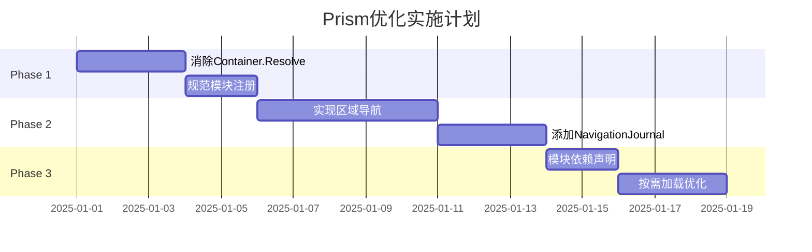

# Prism架构优化方案 - UltraThink v2.0

## 执行摘要

基于Prism官方最佳实践与当前Desktop架构的深度分析，本方案提出了一套**适度优化**的改进策略。
遵循"够用即好"原则，聚焦于修正反模式、提升可维护性，而非过度工程。

## 一、现状分析

### 1.1 当前架构优势
- ✅ 使用Prism.DryIoc作为DI容器
- ✅ 基本的模块化架构（IModule）
- ✅ 统一的ViewModelBase基类
- ✅ 模块化加载机制（ModuleLoader）

### 1.2 与Prism最佳实践的差距

| 问题类别 | 当前实现 | Prism最佳实践 | 影响 |
|---------|---------|--------------|------|
| **依赖注入** | 多处Container.Resolve | 构造函数注入 | 高耦合、难测试 |
| **区域导航** | 直接操作Region | NavigationService | 导航逻辑分散 |
| **View发现** | 手动注册 | 自动发现机制 | 配置冗余 |
| **命令模式** | 独立DelegateCommand | CompositeCommand | 命令协调困难 |
| **导航历史** | 无 | NavigationJournal | 无法回退导航 |

## 二、UltraThink优化方案

### 2.1 核心原则
1. **适度优化**：只修正明确的反模式，不引入不必要的复杂性
2. **增量改进**：可分阶段实施，不影响现有功能
3. **遵循标准**：严格遵循Prism官方推荐模式

### 2.2 优化清单（按优先级）

#### Phase 1：消除反模式（必须）

##### 1.1 移除Container.Resolve反模式
```csharp
// ❌ 当前（App.xaml.cs）
protected override void ConfigureViewModelLocator()
{
    ViewModelLocationProvider.Register<MainWindow>(() =>
        Container.Resolve<MainWindowViewModel>());
}

// ✅ 优化后
protected override void ConfigureViewModelLocator()
{
    base.ConfigureViewModelLocator();
    // 让Prism自动处理ViewModel创建
}
```

##### 1.2 规范模块注册
```csharp
// ❌ 当前（PatientsModule.cs）
public void RegisterTypes(IContainerRegistry containerRegistry)
{
    containerRegistry.RegisterSingleton<IPatientService, PatientService>();
    containerRegistry.Register<PatientDetailViewModel>();
}

// ✅ 优化后
public void RegisterTypes(IContainerRegistry containerRegistry)
{
    // 服务注册
    containerRegistry.RegisterSingleton<IPatientService, PatientService>();

    // 导航注册（包含ViewModel自动注册）
    containerRegistry.RegisterForNavigation<PatientDetailView, PatientDetailViewModel>();
}
```

#### Phase 2：增强导航系统（推荐）

##### 2.1 实现区域导航
```csharp
// 定义区域常量
public static class RegionNames
{
    public const string ContentRegion = "ContentRegion";
    public const string MenuRegion = "MenuRegion";
    public const string StatusRegion = "StatusRegion";
}

// 使用RequestNavigate代替直接操作
public class NavigationService : INavigationService
{
    private readonly IRegionManager _regionManager;

    public async Task NavigateAsync(string regionName, string viewName)
    {
        await _regionManager.RequestNavigate(regionName, viewName);
    }
}
```

##### 2.2 实现NavigationJournal
```csharp
public class MedicalCaseViewModel : INavigationAware
{
    private IRegionNavigationService _navigationService;

    public void OnNavigatedTo(NavigationContext navigationContext)
    {
        _navigationService = navigationContext.NavigationService;
    }

    public DelegateCommand GoBackCommand =>
        new DelegateCommand(() => _navigationService.Journal.GoBack(),
                           () => _navigationService.Journal.CanGoBack);
}
```

#### Phase 3：模块依赖优化（可选）

##### 3.1 声明式依赖管理
```csharp
[Module(ModuleName = "MedicalCaseModule")]
[ModuleDependency("PatientsModule")]  // 明确依赖
[ModuleDependency("ConsultationModule")]
public class MedicalCaseModule : IModule
{
    // 模块实现
}
```

##### 3.2 按需加载优化
```csharp
// 配置按需加载
protected override void ConfigureModuleCatalog(IModuleCatalog moduleCatalog)
{
    // 核心模块 - 立即加载
    moduleCatalog.AddModule<AuthModule>(InitializationMode.WhenAvailable);

    // 功能模块 - 按需加载
    moduleCatalog.AddModule<HerbsModule>(InitializationMode.OnDemand);
    moduleCatalog.AddModule<FormulaModule>(InitializationMode.OnDemand);
}
```

### 2.3 实施路线图



## 三、具体实施示例

### 3.1 ViewModelBase优化
```csharp
public abstract class OptimizedViewModelBase : BindableBase, INavigationAware, IDestructible
{
    protected IRegionManager RegionManager { get; }
    protected IEventAggregator EventAggregator { get; }

    // 构造函数注入（不使用Container.Resolve）
    protected OptimizedViewModelBase(
        IRegionManager regionManager,
        IEventAggregator eventAggregator)
    {
        RegionManager = regionManager;
        EventAggregator = eventAggregator;
    }

    // INavigationAware实现
    public virtual void OnNavigatedTo(NavigationContext navigationContext) { }
    public virtual void OnNavigatedFrom(NavigationContext navigationContext) { }
    public virtual bool IsNavigationTarget(NavigationContext navigationContext) => true;

    // IDestructible实现
    public virtual void Destroy()
    {
        // 清理资源
    }
}
```

### 3.2 Module优化模板
```csharp
[Module(ModuleName = nameof(OptimizedPatientModule))]
public class OptimizedPatientModule : IModule
{
    private readonly IRegionManager _regionManager;

    // 模块也支持依赖注入
    public OptimizedPatientModule(IRegionManager regionManager)
    {
        _regionManager = regionManager;
    }

    public void OnInitialized(IContainerProvider containerProvider)
    {
        // View Discovery - 自动发现和加载
        _regionManager.RegisterViewWithRegion(RegionNames.MenuRegion,
            typeof(PatientMenuView));
    }

    public void RegisterTypes(IContainerRegistry containerRegistry)
    {
        // 服务注册
        containerRegistry.RegisterSingleton<IPatientService, PatientService>();

        // 导航注册（View和ViewModel一起）
        containerRegistry.RegisterForNavigation<PatientListView, PatientListViewModel>();
        containerRegistry.RegisterForNavigation<PatientDetailView, PatientDetailViewModel>();

        // Dialog注册
        containerRegistry.RegisterDialog<PatientEditDialog, PatientEditDialogViewModel>();
    }
}
```

### 3.3 CompositeCommand实现
```csharp
// 定义全局命令接口
public interface IApplicationCommands
{
    CompositeCommand SaveAllCommand { get; }
    CompositeCommand RefreshAllCommand { get; }
}

// 实现
public class ApplicationCommands : IApplicationCommands
{
    public CompositeCommand SaveAllCommand { get; } = new CompositeCommand();
    public CompositeCommand RefreshAllCommand { get; } = new CompositeCommand();
}

// 在ViewModel中注册
public class PatientViewModel : OptimizedViewModelBase
{
    private readonly IApplicationCommands _applicationCommands;

    public PatientViewModel(IApplicationCommands applicationCommands)
    {
        _applicationCommands = applicationCommands;
        SaveCommand = new DelegateCommand(Save);

        // 注册到全局命令
        _applicationCommands.SaveAllCommand.RegisterCommand(SaveCommand);
    }

    public DelegateCommand SaveCommand { get; }

    private void Save()
    {
        // 保存逻辑
    }
}
```

## 四、预期收益

### 4.1 技术收益
- **可测试性提升**：依赖注入使单元测试变得简单
- **解耦度改善**：模块间依赖清晰，易于维护
- **导航体验优化**：支持前进/后退，用户体验更好

### 4.2 开发效率
- **减少样板代码**：自动View-ViewModel绑定
- **统一导航模式**：降低新人学习成本
- **更好的IDE支持**：遵循标准模式，获得更好的智能提示

## 五、风险与缓解

| 风险 | 影响 | 缓解措施 |
|-----|------|---------|
| 重构引入Bug | 中 | 分阶段实施，每阶段充分测试 |
| 学习成本 | 低 | 提供示例代码和培训 |
| 性能影响 | 低 | 按需加载减少启动时间 |

## 六、不建议的优化（过度工程）

以下Prism特性虽然强大，但对当前项目属于过度工程：

- ❌ **EventToCommand**：现有事件处理足够
- ❌ **自定义Region Adapter**：默认适配器满足需求
- ❌ **Module Catalog XAML配置**：代码配置更直观
- ❌ **自定义导航行为**：标准导航足够
- ❌ **ViewModelLocator自定义约定**：默认约定即可

## 七、实施建议

1. **Phase 1必须完成**：消除反模式是基本要求
2. **Phase 2强烈推荐**：显著提升用户体验
3. **Phase 3按需实施**：根据项目规模决定
4. **保持简单**：不要为了用Prism特性而用，要解决实际问题

## 八、验收标准

### Phase 1验收
- [ ] 所有Container.Resolve被移除
- [ ] 模块注册规范化
- [ ] 编译通过，现有功能正常

### Phase 2验收
- [ ] 区域导航正常工作
- [ ] 支持导航历史回退
- [ ] 导航参数传递正确

### Phase 3验收
- [ ] 模块依赖声明完整
- [ ] 按需加载正常工作
- [ ] 启动性能有改善

## 总结

本优化方案遵循**适度设计原则**，聚焦于修正明确的反模式和提升关键体验。
不追求使用所有Prism特性，而是选择对项目真正有价值的改进。
建议分阶段实施，确保稳定性的同时逐步提升架构质量。