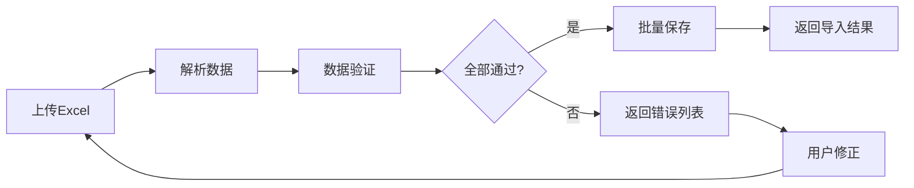
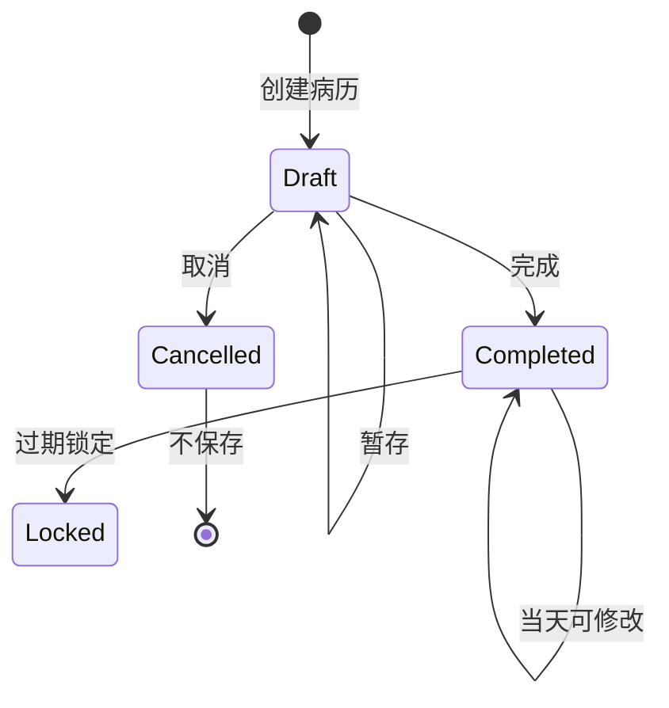
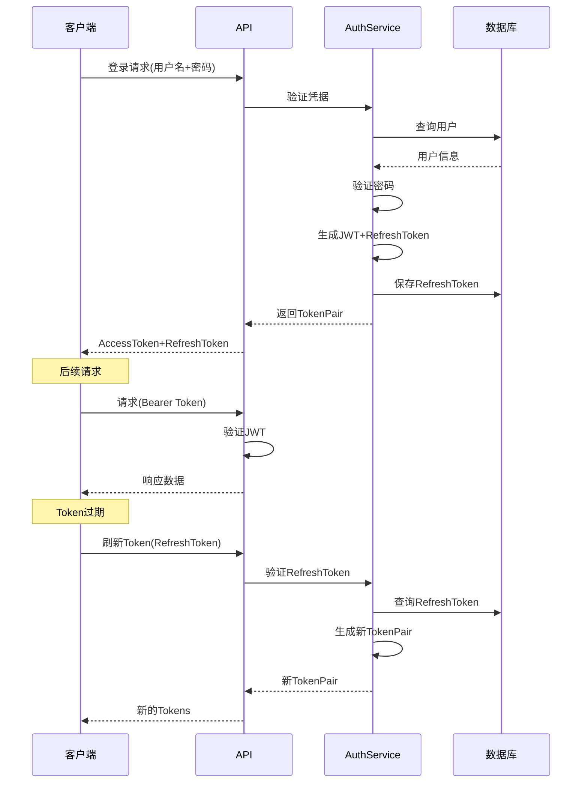

# LYBT中医诊所管理系统 - 功能模块详细设计文档

**版本**：v2.0  
**日期**：2025-09-28  
**编制**：基于系统架构设计文档v3.0  
**状态**：模块设计定稿  

## 一、模块设计概述

### 1.1 设计原则
- **单一职责**：每个模块只负责一个业务领域
- **接口隔离**：查询与命令分离，读写分离
- **依赖倒置**：依赖抽象而非具体实现
- **开闭原则**：对扩展开放，对修改关闭

### 1.2 实际实现状态

| 模块名称 | 服务层 | 仓储层 | 控制器 | 客户端 | 状态 |
|---------|--------|--------|--------|--------|------|
| **Auth** | ✅ AuthService, JwtService | ✅ RefreshTokenRepository | ✅ AuthController | ✅ 完整 | ✅ 已实现 |
| **Patients** | ✅ PatientService | ✅ PatientRepository | ✅ PatientsController | ✅ 完整 | ✅ 已实现 |
| **MedicalCase** | ✅ MedicalCaseService（聚合根） | ✅ MedicalCaseRepository | ✅ MedicalCaseController | ✅ 完整 | ✅ 已实现 |
| **Consultation** | ✅ ConsultationService | ✅ ConsultationRepository | ✅ ConsultationController | ✅ 完整 | ✅ 已实现 |
| **Prescriptions** | ✅ PrescriptionService | ✅ PrescriptionRepository | ✅ PrescriptionsController | ✅ 完整 | ✅ 已实现 |
| **Herbs** | ✅ HerbService | ✅ HerbRepository | ✅ HerbsController | ✅ 完整 | ✅ 已实现 |
| **Formula** | ✅ FormulaService | ✅ FormulaRepository | ✅ FormulasController | ✅ 完整 | ✅ 已实现 |
| **Users** | ✅ UserService | ✅ UserRepository | ✅ UsersController | ✅ 完整 | ✅ 已实现 |

### 1.3 模块分层（实际实现）
```
Controller层 → Service层 → Repository层 → 数据库
     ↓              ↓            ↓
    DTO         Domain       Entity
```

## 二、患者管理模块（Patients）

### 2.1 功能概述
管理患者基本信息，提供快速查询、新建、编辑功能，支持Excel批量导入。

### 2.2 数据模型

#### 2.2.1 实体设计
```csharp
public class Patient : BaseEntity
{
    public string Name { get; set; }              // 姓名
    public string PhoneNumber { get; set; }       // 手机号
    public string IdNumber { get; set; }          // 身份证号
    public string Address { get; set; }           // 家庭地址
    public DateTime BirthDate { get; set; }       // 出生日期
    public Gender Gender { get; set; }            // 性别
    public string PinyinCode { get; set; }        // 拼音码
    
    // 导航属性
    public virtual ICollection<MedicalCase> MedicalCases { get; set; }
    
    // 计算属性
    public int Age => DateTime.Now.Year - BirthDate.Year;
}
```

#### 2.2.2 DTO定义
```csharp
// 列表DTO
public class PatientListDto
{
    public Guid Id { get; set; }
    public string Name { get; set; }
    public string PhoneNumber { get; set; }  // 脱敏显示
    public int Age { get; set; }
    public DateTime? LastVisitDate { get; set; }
}

// 详情DTO
public class PatientDetailDto : PatientListDto
{
    public string IdNumber { get; set; }
    public string Address { get; set; }
    public DateTime BirthDate { get; set; }
    public Gender Gender { get; set; }
    public string PinyinCode { get; set; }
    public List<MedicalCaseSimpleDto> RecentCases { get; set; }
}

// 创建DTO
public class PatientCreateDto
{
    [Required]
    public string Name { get; set; }
    
    [Required]
    [RegularExpression(@"^1[3-9]\d{9}$")]
    public string PhoneNumber { get; set; }
    
    [Required]
    [RegularExpression(@"^\d{17}[\dXx]$")]
    public string IdNumber { get; set; }
    
    [Required]
    public string Address { get; set; }
}
```

### 2.3 接口设计（实际实现）

#### 2.3.1 服务接口
```csharp
// 实际使用统一服务接口（未分离查询和业务服务）
public interface IPatientService
{
    // 查询操作
    Task<ServiceResult<PatientDto>> GetByIdAsync(Guid id);
    Task<ServiceResult<PagedResult<PatientDto>>> GetPagedAsync(int page, int pageSize, string? keyword);
    Task<ServiceResult<List<PatientDto>>> SearchAsync(string keyword);
    Task<ServiceResult<bool>> ExistsAsync(string idNumber);
    
    // 业务操作
    Task<ServiceResult<PatientDto>> CreateAsync(PatientCreateDto dto);
    Task<ServiceResult<PatientDto>> UpdateAsync(Guid id, PatientUpdateDto dto);
    Task<ServiceResult> DeleteAsync(Guid id);
    Task<ServiceResult<ImportResult>> ImportFromExcelAsync(Stream excelStream);
}
```

#### 2.3.2 仓储接口（实际实现）
```csharp
public interface IPatientRepository : IRepository<Patient>
{
    // 继承基础CRUD方法
    // 特定查询方法
    Task<Patient?> GetByIdNumberAsync(string idNumber);
    Task<PagedResult<Patient>> GetPagedAsync(int page, int pageSize, string? keyword);
    Task<List<Patient>> SearchByKeywordAsync(string keyword);
}
```

### 2.4 业务规则

1. **唯一性验证**：身份证号全局唯一
2. **拼音码生成**：自动根据姓名生成，如"张三"→"ZS"
3. **数据脱敏**：列表显示时手机号脱敏（138****1234）
4. **级联关系**：删除患者时检查是否有关联病历
5. **查询优化**：精确匹配优先，模糊匹配按最近就诊时间排序

### 2.5 Excel导入规范

#### 2.5.1 模板格式
| 姓名* | 手机号* | 身份证号* | 地址* | 出生日期 | 性别 |
|-------|---------|-----------|-------|----------|------|
| 张三  | 13800138000 | 110101199001011234 | 北京市... | 1990-01-01 | 男 |

#### 2.5.2 导入流程


## 三、病历管理模块（MedicalCase）- 核心聚合根

### 3.1 功能概述
作为系统的**聚合根**，管理整个诊疗流程。一个病历包含一次诊疗记录，可选包含一张处方。实现了"当天可改、过期锁定"的业务规则。

### 3.2 数据模型（实际实现）

#### 3.2.1 聚合根设计
```csharp
public class MedicalCase : BaseEntity  // 实际继承BaseEntity，不是AggregateRoot
{
    // 基本信息
    public Guid PatientId { get; set; }
    public string PatientName { get; set; }  // 冗余存储用于显示
    public Guid DoctorId { get; set; }  // 实际使用DoctorId，不是UserId
    public string DoctorName { get; set; }  // 冗余存储用于显示
    public DateTime ConsultationDate { get; set; }  // 诊疗时间
    public MedicalCaseStatus Status { get; set; }
    public string? Remark { get; set; }
    
    // 聚合的实体（导航属性）
    public virtual Consultation? Consultation { get; set; }  // 1:1 关系
    public virtual Prescription? Prescription { get; set; }  // 1:0..1 关系
    
    // 业务方法（实际实现）
    public bool CanEdit(bool isAdmin, Guid? currentUserId = null)
    {
        // 管理员可以编辑所有病历
        if (isAdmin) return true;
        
        // 创建者当天可编辑
        if (currentUserId.HasValue && DoctorId == currentUserId.Value)
        {
            return CreatedAt.Date == DateTime.Today;
        }
        return false;
    }
    
    // 判断病历是否已锁定（过了当天）
    public bool IsLocked => CreatedAt.Date < DateTime.Today;
}
```

### 3.3 接口设计（实际实现）

```csharp
public interface IMedicalCaseService
{
    // 基础CRUD
    Task<ServiceResult<PagedResult<MedicalCaseDto>>> GetPagedAsync(int page, int pageSize, string? keyword);
    Task<ServiceResult<MedicalCaseDto>> GetByIdAsync(Guid id);
    Task<ServiceResult<MedicalCaseDto>> CreateAsync(MedicalCaseCreateDto dto);
    Task<ServiceResult<MedicalCaseDto>> UpdateAsync(Guid id, MedicalCaseUpdateDto dto);
    Task<ServiceResult> DeleteAsync(Guid id);
    
    // 聚合操作
    Task<ServiceResult<MedicalCaseDto>> CreateWithDetailsAsync(
        MedicalCaseCreateDto caseDto, 
        ConsultationCreateDto consultationDto, 
        PrescriptionCreateDto? prescriptionDto);
    Task<ServiceResult<MedicalCaseDetailDto>> GetByIdWithDetailsAsync(Guid id);
    
    // 根据患者ID获取病历列表
    Task<ServiceResult<List<MedicalCaseDto>>> GetByPatientIdAsync(Guid patientId);
}
```

#### 3.2.2 状态枚举
```csharp
public enum MedicalCaseStatus
{
    Active = 0,     // 活动状态（实际使用）
    Completed = 1,  // 已完成
    Cancelled = 2   // 已取消（不保存）
}
```

### 3.3 业务流程



### 3.4 接口设计

```csharp
public interface IMedicalCaseService
{
    // 查询
    Task<MedicalCaseDetailDto> GetByIdAsync(Guid id);
    Task<PagedResult<MedicalCaseListDto>> GetTodayListAsync();
    Task<PagedResult<MedicalCaseListDto>> GetByPatientAsync(Guid patientId);
    
    // 业务操作
    Task<ServiceResult<MedicalCaseDetailDto>> CreateAsync(Guid patientId);
    Task<ServiceResult> SaveAsDraftAsync(Guid id, MedicalCaseDraftDto dto);
    Task<ServiceResult> CompleteAsync(Guid id);
    Task<ServiceResult> CancelAsync(Guid id);
    
    // 权限检查
    Task<bool> CanModifyAsync(Guid id, Guid userId);
}
```

### 3.5 业务规则

1. **单个未完成限制**：同一患者同时只能有一个未完成病历
2. **修改权限控制**：
   - 医生：只能修改自己当天的病历
   - 管理员：可修改所有病历
3. **状态转换规则**：
   - 草稿→完成：必须有诊断信息
   - 完成→草稿：不允许
   - 任何→取消：未完成可取消
4. **取消不保存**：取消的病历不写入数据库

## 四、诊断模块（Consultation）

### 4.1 功能概述
记录中医四诊信息、辨证论治，作为病历的核心医疗信息。

### 4.2 数据模型

```csharp
public class Consultation : BaseEntity
{
    public Guid MedicalCaseId { get; set; }
    
    // 主诉与病史
    public string ChiefComplaint { get; set; }      // 主诉
    public string PresentIllness { get; set; }      // 现病史
    
    // 四诊信息
    public string Inspection { get; set; }          // 望诊
    public string AuscultationOlfaction { get; set; } // 闻诊
    public string Inquiry { get; set; }             // 问诊
    public string Palpation { get; set; }           // 切诊
    
    // 诊断与治疗
    public string TCMDiagnosis { get; set; }        // 中医诊断
    public string Syndrome { get; set; }            // 证型
    public string TreatmentPrinciple { get; set; }  // 治疗原则
    public string MedicalAdvice { get; set; }       // 医嘱
    
    // 导航属性
    public virtual MedicalCase MedicalCase { get; set; }
}
```

### 4.3 界面布局设计（14寸屏幕优化）

```
┌──────────────────────────────────────┐
│          患者信息栏（只读）            │
├─────────────┬─────────────────────────┤
│             │                         │
│   望诊      │         闻诊           │
│  (多行)     │        (多行)          │
│             │                         │
├─────────────┼─────────────────────────┤
│             │                         │
│   问诊      │         切诊           │
│  (多行)     │        (多行)          │
│             │                         │
├─────────────┴─────────────────────────┤
│         主诉（单行输入框）             │
├──────────────────────────────────────┤
│       现病史（2-3行输入框）           │
├──────────────────────────────────────┤
│                                      │
│      中医诊断（大文本框）              │
│                                      │
├──────────────────────────────────────┤
│      治疗原则（2行输入框）            │
├──────────────────────────────────────┤
│        医嘱（2-3行输入框）            │
└──────────────────────────────────────┘
[暂存] [完成诊断] [开处方]
```

### 4.4 业务规则

1. **必填验证**：诊断为必填项，其他为选填
2. **自动保存**：每个字段失焦后自动暂存
3. **模板支持**：预留常用语模板接口（MVP不实现）
4. **查询优化**：支持症状、证型关键字查询

## 五、处方管理模块（Prescriptions）

### 5.1 功能概述
中药处方开具，支持四种开方方式，自动价格计算，A5横向打印。

### 5.2 数据模型

#### 5.2.1 处方主表
```csharp
public class Prescription : BaseEntity
{
    public Guid MedicalCaseId { get; set; }
    public int DosageCount { get; set; } = 7;      // 剂数
    public decimal Discount { get; set; } = 1.0m;  // 折扣
    public string? Advice { get; set; }             // 用药建议
    public string? FormulaSource { get; set; }      // 方剂来源
    public string? Usage { get; set; }              // 用法用量
    
    // 导航属性
    public virtual MedicalCase MedicalCase { get; set; }
    public virtual ICollection<PrescriptionItem> Items { get; set; }
    
    // 计算属性
    public decimal SingleDosePrice => Items?.Sum(i => i.UnitPrice * i.Quantity) ?? 0;
    public decimal TotalPrice => SingleDosePrice * DosageCount * Discount;
}
```

#### 5.2.2 处方明细
```csharp
public class PrescriptionItem : BaseEntity
{
    public Guid PrescriptionId { get; set; }
    public Guid HerbId { get; set; }
    public decimal Quantity { get; set; }           // 剂量
    public string Unit { get; set; } = "g";        // 单位
    public decimal UnitPrice { get; set; }         // 单价（锁定）
    public string? Usage { get; set; }             // 特殊用法
    
    // 导航属性
    public virtual Prescription Prescription { get; set; }
    public virtual Herb Herb { get; set; }
}
```

### 5.3 四种开方方式

#### 5.3.1 表格直接编辑
```
┌────────┬────────┬────────┬────────┐
│黄芪 30g│当归 10g│白术 15g│茯苓 20g│
├────────┼────────┼────────┼────────┤
│陈皮 10g│半夏 10g│甘草 6g │        │
├────────┼────────┼────────┼────────┤
│        │        │        │        │
└────────┴────────┴────────┴────────┘
```
- 双击单元格进入编辑
- 输入拼音码或中文
- Tab键横向导航

#### 5.3.2 快速输入弹窗
```
┌─────────────────────────┐
│    快速添加药材          │
├─────────────────────────┤
│ 药材：[_______] ↓      │
│ 剂量：[___] 克          │
│                         │
│ [添加并继续] [完成]     │
└─────────────────────────┘
```
- 纯键盘操作
- 回车自动跳转下一个字段

#### 5.3.3 方剂导入
```csharp
public async Task<ServiceResult> ImportFormulaAsync(
    Guid prescriptionId, 
    Guid formulaId)
{
    var formula = await _formulaRepository.GetByIdAsync(formulaId);
    var prescription = await _repository.GetByIdAsync(prescriptionId);
    
    foreach (var item in formula.Items)
    {
        var existing = prescription.Items
            .FirstOrDefault(i => i.HerbId == item.HerbId);
        
        if (existing != null)
        {
            // 重复药材取最小剂量
            existing.Quantity = Math.Min(existing.Quantity, item.Quantity);
        }
        else
        {
            prescription.Items.Add(new PrescriptionItem
            {
                HerbId = item.HerbId,
                Quantity = item.Quantity,
                Unit = item.Unit,
                UnitPrice = item.Herb.Price // 锁定当前价格
            });
        }
    }
    
    prescription.FormulaSource = formula.Name; // 记录来源
    return ServiceResult.Success("方剂导入成功");
}
```

#### 5.3.4 历史处方复制
- 显示患者最近5个处方
- 选择复制，逻辑同方剂导入

### 5.4 打印设计（A5横向）

```
═══════════════════════════════════════════
            凌隐宝堂中医诊所
                处方笺
───────────────────────────────────────────
姓名：张三    性别：男    年龄：35岁
日期：2025-09-28         编号：RX20250928001
───────────────────────────────────────────
诊断：风寒感冒，风寒束表证
───────────────────────────────────────────
Rp:
黄芪 30g    当归 10g    白术 15g    茯苓 20g
陈皮 10g    半夏 10g    甘草 6g     生姜 10g
大枣 10g    
───────────────────────────────────────────
剂数：7剂        用法：每日一剂，分两次温服
───────────────────────────────────────────
医师：李医生     
单价：￥28.50    总价：￥199.50
═══════════════════════════════════════════
```

## 六、药材管理模块（Herbs）

### 6.1 功能概述
维护中药材基础数据，支持价格管理、Excel导入、启用停用。

### 6.2 数据模型

```csharp
public class Herb : BaseEntity
{
    public string Name { get; set; }           // 药材名称
    public string PinyinCode { get; set; }     // 拼音码
    public string Category { get; set; }       // 分类
    public string Unit { get; set; } = "g";    // 单位
    public decimal Price { get; set; }         // 单价
    public string? Origin { get; set; }        // 产地
    public string? Specification { get; set; } // 规格
    public string? Efficacy { get; set; }      // 功效
    public CommonStatus Status { get; set; }   // 状态
    
    // 价格历史（预留）
    public virtual ICollection<HerbPriceHistory> PriceHistories { get; set; }
}
```

### 6.3 业务规则

1. **价格管理**：
   - 修改价格不影响已开处方
   - 记录价格变更历史
   
2. **状态控制**：
   - 停用的药材不能开方
   - 不能删除已使用的药材
   
3. **查询优化**：
   - 支持拼音码快速查询
   - 按使用频率排序

### 6.4 Excel导入模板

| 药材名称* | 分类 | 单位 | 单价* | 产地 | 规格 | 功效 |
|-----------|------|------|-------|------|------|------|
| 黄芪 | 补气药 | g | 0.5 | 甘肃 | 统货 | 补气固表 |

## 七、方剂管理模块（Formula）

### 7.1 功能概述
管理经验方模板，支持个人/共享/公用方剂，方便快速开方。

### 7.2 数据模型

```csharp
public class Formula : BaseEntity
{
    public string Name { get; set; }           // 方剂名称
    public string PinyinCode { get; set; }     // 拼音码
    public string Category { get; set; }       // 分类
    public string? Efficacy { get; set; }      // 功效主治
    public string? Symptoms { get; set; }      // 适用症状
    public Guid CreatorId { get; set; }        // 创建者
    public FormulaScope Scope { get; set; }    // 使用范围
    
    // 导航属性
    public virtual User Creator { get; set; }
    public virtual ICollection<FormulaItem> Items { get; set; }
}

public enum FormulaScope
{
    Personal = 0,   // 个人
    Shared = 1,     // 共享
    Public = 2      // 公用（管理员创建）
}
```

### 7.3 权限管理

```csharp
public class FormulaPermissionService
{
    public bool CanView(Formula formula, User user)
    {
        if (formula.Scope == FormulaScope.Public) return true;
        if (formula.Scope == FormulaScope.Shared) return true;
        if (formula.CreatorId == user.Id) return true;
        if (user.Role == UserRole.Admin) return true;
        return false;
    }
    
    public bool CanEdit(Formula formula, User user)
    {
        if (user.Role == UserRole.Admin) return true;
        if (formula.CreatorId == user.Id) return true;
        return false;
    }
}
```

### 7.4 分类体系

- 解表剂（麻黄汤、桂枝汤等）
- 清热剂（白虎汤、清营汤等）
- 泻下剂（大承气汤等）
- 和解剂（小柴胡汤等）
- 温里剂（四逆汤、理中丸等）
- 补益剂（四君子汤、四物汤等）
- 固涩剂（牡蛎散、金锁固精丸等）
- 安神剂（酸枣仁汤、甘麦大枣汤等）
- 理气剂（越鞠丸、柴胡疏肝散等）
- 理血剂（桃核承气汤、血府逐瘀汤等）

## 八、用户管理模块（Users & Auth）

### 8.1 功能概述
用户账号管理、认证授权、会话管理。

### 8.2 数据模型

#### 8.2.1 用户实体
```csharp
public class User : BaseEntity
{
    public string UserName { get; set; }       // 登录账号
    public string PasswordHash { get; set; }   // 密码哈希
    public string RealName { get; set; }       // 真实姓名
    public UserRole Role { get; set; }         // 角色
    public string PhoneNumber { get; set; }    // 手机号
    public UserStatus Status { get; set; }     // 状态
    public int LoginFailedCount { get; set; }  // 登录失败次数
    public DateTime? LockedUntil { get; set; } // 锁定时间
    public Guid? TenantId { get; set; }        // 租户ID（预留）
}

public enum UserRole
{
    Doctor = 1,     // 医生
    Admin = 2       // 管理员
}

public enum UserStatus
{
    Active = 1,     // 正常
    Locked = 2,     // 锁定
    Disabled = 3    // 禁用
}
```

#### 8.2.2 RefreshToken
```csharp
public class RefreshToken : BaseEntity
{
    public Guid UserId { get; set; }
    public string Token { get; set; }
    public string Jti { get; set; }            // JWT ID
    public DateTime ExpiresAt { get; set; }
    public bool IsUsed { get; set; }
    public bool IsRevoked { get; set; }
    public string? RevokedReason { get; set; }
}
```

### 8.3 认证流程



### 8.4 密码策略

```csharp
public class PasswordPolicy
{
    public int MinLength { get; set; } = 6;
    public bool RequireDigit { get; set; } = false;
    public bool RequireUpper { get; set; } = false;
    public bool RequireLower { get; set; } = false;
    public bool RequireSpecial { get; set; } = false;
    public string DefaultPassword { get; set; } = "123456";
    
    public bool Validate(string password)
    {
        if (MinLength == 0) return true; // 不限制
        
        if (password.Length < MinLength) return false;
        if (RequireDigit && !password.Any(char.IsDigit)) return false;
        if (RequireUpper && !password.Any(char.IsUpper)) return false;
        if (RequireLower && !password.Any(char.IsLower)) return false;
        if (RequireSpecial && !password.Any(IsSpecialChar)) return false;
        
        return true;
    }
}
```

## 九、系统日志模块（Logs）

### 9.1 日志分类

#### 9.1.1 操作日志
```csharp
public class OperationLog
{
    public Guid Id { get; set; }
    public Guid? UserId { get; set; }
    public string UserName { get; set; }
    public string Module { get; set; }      // 模块名
    public string Action { get; set; }      // 操作类型
    public string EntityId { get; set; }    // 实体ID
    public string? OldValue { get; set; }   // 修改前
    public string? NewValue { get; set; }   // 修改后
    public string IpAddress { get; set; }
    public DateTime CreatedAt { get; set; }
}
```

#### 9.1.2 登录日志
```csharp
public class LoginLog
{
    public Guid Id { get; set; }
    public string UserName { get; set; }
    public bool IsSuccess { get; set; }
    public string? FailReason { get; set; }
    public string IpAddress { get; set; }
    public string? UserAgent { get; set; }
    public DateTime CreatedAt { get; set; }
}
```

### 9.2 日志级别

| 级别 | 说明 | 示例 |
|------|------|------|
| Error | 异常错误 | 数据库连接失败 |
| Warning | 警告 | 登录失败超3次 |
| Information | 业务操作 | 创建患者档案 |
| Debug | 调试信息 | SQL查询语句 |

## 十、缓存设计

### 10.1 缓存策略

```csharp
public interface ICacheService
{
    Task<T?> GetAsync<T>(string key);
    Task SetAsync<T>(string key, T value, TimeSpan? expiry = null);
    Task RemoveAsync(string key);
    Task RemoveByPrefixAsync(string prefix);
}
```

### 10.2 缓存键设计

```csharp
public static class CacheKeys
{
    public const string PatientPrefix = "patient:";
    public const string HerbPrefix = "herb:";
    public const string FormulaPrefix = "formula:";
    public const string UserPrefix = "user:";
    
    public static string Patient(Guid id) => $"{PatientPrefix}{id}";
    public static string PatientList(int page) => $"{PatientPrefix}list:{page}";
    public static string HerbList() => $"{HerbPrefix}list";
    public static string UserPermissions(Guid userId) => $"{UserPrefix}perm:{userId}";
}
```

### 10.3 缓存更新

```csharp
public class PatientService
{
    public async Task<ServiceResult> UpdateAsync(Guid id, PatientUpdateDto dto)
    {
        // 更新数据库
        var result = await _repository.UpdateAsync(id, dto);
        
        // 清除相关缓存
        await _cache.RemoveAsync(CacheKeys.Patient(id));
        await _cache.RemoveByPrefixAsync(CacheKeys.PatientPrefix + "list:");
        
        return result;
    }
}
```

## 十一、前端模块设计

### 11.1 模块结构

```
/Client/Desktop/Modules
    /Patients
        /Views
            PatientsMainView.xaml
            PatientDetailView.xaml
            PatientImportView.xaml
        /ViewModels
            PatientsMainViewModel.cs
            PatientDetailViewModel.cs
        /Services
            IPatientService.cs
            PatientService.cs
        PatientsModule.cs
    /MedicalCase
    /Consultation
    /Prescriptions
    /Herbs
    /Formula
    /Users
```

### 11.2 MVVM模式

```csharp
public class PatientDetailViewModel : ViewModelBase
{
    private readonly IPatientService _patientService;
    private readonly IEventAggregator _eventAggregator;
    
    private PatientDetailDto _patient;
    public PatientDetailDto Patient
    {
        get => _patient;
        set => SetProperty(ref _patient, value);
    }
    
    public DelegateCommand SaveCommand { get; }
    public DelegateCommand CancelCommand { get; }
    
    public PatientDetailViewModel(
        IPatientService patientService,
        IEventAggregator eventAggregator)
    {
        _patientService = patientService;
        _eventAggregator = eventAggregator;
        
        SaveCommand = new DelegateCommand(ExecuteSave, CanSave);
        CancelCommand = new DelegateCommand(ExecuteCancel);
    }
    
    private async void ExecuteSave()
    {
        var result = await _patientService.UpdateAsync(Patient.Id, Patient);
        if (result.IsSuccess)
        {
            _eventAggregator.GetEvent<PatientUpdatedEvent>()
                .Publish(Patient.Id);
        }
    }
}
```

### 11.3 服务注册

```csharp
public class PatientsModule : IModule
{
    public void OnInitialized(IContainerProvider containerProvider)
    {
        var regionManager = containerProvider.Resolve<IRegionManager>();
        regionManager.RequestNavigate(
            RegionNames.ContentRegion, 
            ViewNames.PatientsMain);
    }
    
    public void RegisterTypes(IContainerRegistry containerRegistry)
    {
        // 注册视图
        containerRegistry.RegisterForNavigation<PatientsMainView>();
        containerRegistry.RegisterForNavigation<PatientDetailView>();
        
        // 注册服务
        containerRegistry.Register<IPatientService, PatientService>();
    }
}
```

## 十二、测试设计

### 12.1 单元测试示例

```csharp
[Fact]
public async Task CreatePatient_WithDuplicateIdNumber_ShouldFail()
{
    // Arrange
    var existingPatient = new Patient { IdNumber = "110101199001011234" };
    await _context.Patients.AddAsync(existingPatient);
    await _context.SaveChangesAsync();
    
    var dto = new PatientCreateDto
    {
        Name = "测试患者",
        IdNumber = "110101199001011234", // 重复
        PhoneNumber = "13800138000",
        Address = "测试地址"
    };
    
    // Act
    var result = await _service.CreateAsync(dto);
    
    // Assert
    result.IsSuccess.Should().BeFalse();
    result.Message.Should().Contain("身份证号已存在");
}
```

### 12.2 集成测试示例

```csharp
[Fact]
public async Task CompleteConsultationFlow_ShouldWork()
{
    // 1. 创建患者
    var patient = await CreateTestPatient();
    
    // 2. 创建病历
    var medicalCase = await _medicalCaseService
        .CreateAsync(patient.Id);
    
    // 3. 填写诊断
    var consultation = new ConsultationCreateDto
    {
        MedicalCaseId = medicalCase.Data.Id,
        ChiefComplaint = "头痛",
        TCMDiagnosis = "风寒头痛"
    };
    await _consultationService.CreateAsync(consultation);
    
    // 4. 开处方
    var prescription = new PrescriptionCreateDto
    {
        MedicalCaseId = medicalCase.Data.Id,
        Items = new List<PrescriptionItemDto>
        {
            new() { HerbId = herbId, Quantity = 10 }
        }
    };
    await _prescriptionService.CreateAsync(prescription);
    
    // 5. 完成病历
    var result = await _medicalCaseService
        .CompleteAsync(medicalCase.Data.Id);
    
    // Assert
    result.IsSuccess.Should().BeTrue();
}
```

## 十三、性能优化建议

### 13.1 数据库优化

1. **索引优化**
```sql
-- 患者查询优化
CREATE INDEX IX_Patient_PinyinCode ON Patient(PinyinCode);
CREATE INDEX IX_Patient_PhoneNumber ON Patient(PhoneNumber);

-- 病历查询优化
CREATE INDEX IX_MedicalCase_PatientId_CreatedAt 
ON MedicalCase(PatientId, CreatedAt DESC);

-- 处方查询优化
CREATE INDEX IX_Prescription_MedicalCaseId 
ON Prescription(MedicalCaseId);
```

2. **查询优化**
```csharp
// 使用投影减少数据传输
var patients = await _context.Patients
    .Where(p => !p.IsDeleted)
    .Select(p => new PatientListDto
    {
        Id = p.Id,
        Name = p.Name,
        PhoneNumber = MaskPhone(p.PhoneNumber)
    })
    .ToListAsync();
```

### 13.2 缓存优化

1. **预加载常用数据**
```csharp
public class CacheWarmupService : IHostedService
{
    public async Task StartAsync(CancellationToken cancellationToken)
    {
        // 预加载药材列表
        var herbs = await _herbService.GetAllAsync();
        await _cache.SetAsync(CacheKeys.HerbList(), herbs);
        
        // 预加载公用方剂
        var formulas = await _formulaService.GetPublicAsync();
        await _cache.SetAsync(CacheKeys.FormulaPublic(), formulas);
    }
}
```

2. **批量操作优化**
```csharp
public async Task<IEnumerable<PatientDto>> GetBatchAsync(
    IEnumerable<Guid> ids)
{
    var tasks = ids.Select(id => 
        _cache.GetOrCreateAsync(
            CacheKeys.Patient(id),
            () => _repository.GetByIdAsync(id)
        ));
    
    return await Task.WhenAll(tasks);
}
```

## 十四、部署清单

### 14.1 服务器部署

- [ ] IIS配置
- [ ] SSL证书安装
- [ ] 连接字符串配置
- [ ] JWT密钥配置
- [ ] 日志路径配置
- [ ] 初始管理员账号

### 14.2 客户端部署

- [ ] .NET Desktop Runtime安装
- [ ] API地址配置
- [ ] 自动更新配置
- [ ] 快捷方式创建
- [ ] 打印机驱动

### 14.3 数据初始化

- [ ] 数据库创建
- [ ] 表结构迁移
- [ ] 默认管理员
- [ ] 基础数据导入

## 附录：接口清单

### A.1 患者管理
- GET /api/v1/patients
- GET /api/v1/patients/{id}
- POST /api/v1/patients
- PUT /api/v1/patients/{id}
- DELETE /api/v1/patients/{id}
- POST /api/v1/patients/import

### A.2 病历管理
- GET /api/v1/medicalcases
- GET /api/v1/medicalcases/{id}
- POST /api/v1/medicalcases
- PUT /api/v1/medicalcases/{id}/draft
- PUT /api/v1/medicalcases/{id}/complete
- DELETE /api/v1/medicalcases/{id}

### A.3 诊断管理
- GET /api/v1/consultations/{medicalCaseId}
- POST /api/v1/consultations
- PUT /api/v1/consultations/{id}

### A.4 处方管理
- GET /api/v1/prescriptions/{medicalCaseId}
- POST /api/v1/prescriptions
- PUT /api/v1/prescriptions/{id}
- POST /api/v1/prescriptions/{id}/import-formula
- GET /api/v1/prescriptions/{id}/print

### A.5 药材管理
- GET /api/v1/herbs
- GET /api/v1/herbs/{id}
- POST /api/v1/herbs
- PUT /api/v1/herbs/{id}
- DELETE /api/v1/herbs/{id}
- POST /api/v1/herbs/import

### A.6 方剂管理
- GET /api/v1/formulas
- GET /api/v1/formulas/{id}
- POST /api/v1/formulas
- PUT /api/v1/formulas/{id}
- DELETE /api/v1/formulas/{id}
- PUT /api/v1/formulas/{id}/share

### A.7 用户认证
- POST /api/v1/auth/login
- POST /api/v1/auth/refresh
- POST /api/v1/auth/logout
- POST /api/v1/auth/change-password
- POST /api/v1/auth/reset-password

---

**文档版本控制**：
| 版本 | 日期 | 修订内容 |
|------|------|----------|
| v1.0 | 2025-09-28 | 初始版本 |
| v2.0 | 2025-09-28 | 完善所有模块设计 |