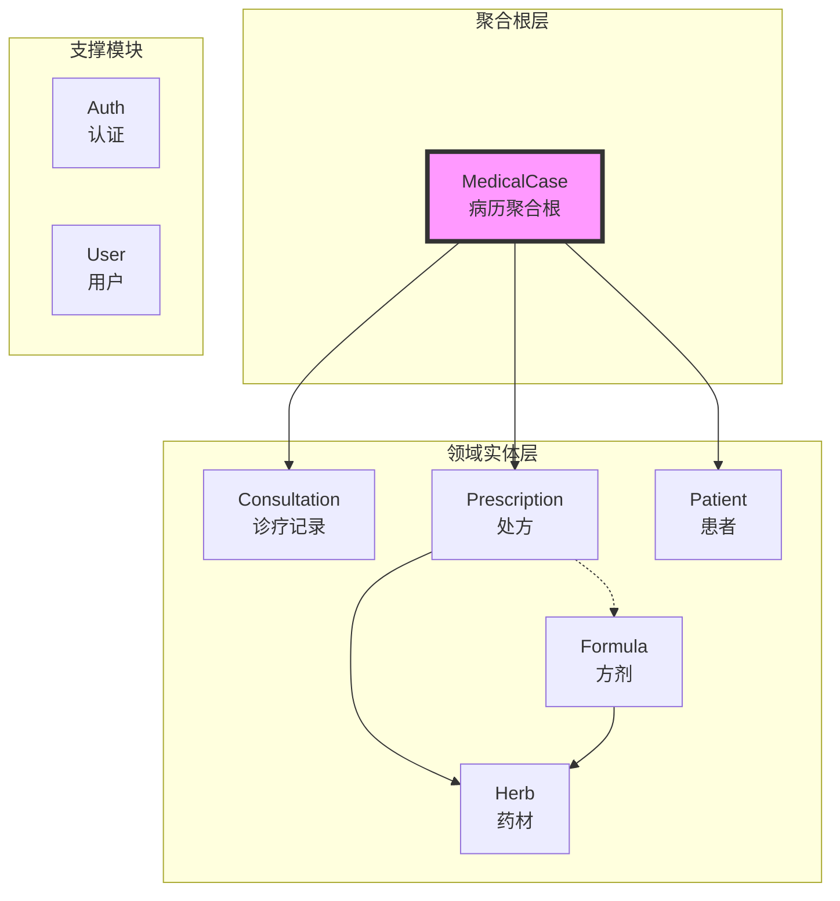

# 模块实际实现情况与文档偏差修正

> 生成时间：2025-01-02
> 目的：修正文档中的模块信息偏差，确保与实际代码实现一致

## 一、模块实际实现对比

### 1.1 服务器端模块 (src/Server/Modules)

| 模块名称 | 实际目录 | 服务实现 | 仓储实现 | 接口定义 | 状态 |
|---------|----------|----------|----------|----------|------|
| **Auth** | ✅ LYBT.Module.Auth | ✅ AuthService, JwtService | ✅ RefreshTokenRepository | ✅ IAuthService, IJwtService | ✅ 完整实现 |
| **MedicalCase** | ✅ LYBT.Module.MedicalCase | ✅ MedicalCaseService | ✅ MedicalCaseRepository | ✅ IMedicalCaseService | ✅ 聚合根实现 |
| **Consultation** | ✅ LYBT.Module.Consultation | ✅ ConsultationService | ✅ ConsultationRepository | ✅ IConsultationService | ✅ 完整实现 |
| **Prescriptions** | ✅ LYBT.Module.Prescriptions | ✅ PrescriptionService | ✅ PrescriptionRepository | ✅ IPrescriptionService | ✅ 完整实现 |
| **Patients** | ✅ LYBT.Module.Patients | ✅ PatientService | ✅ PatientRepository | ✅ IPatientService | ✅ 完整实现 |
| **Herbs** | ✅ LYBT.Module.Herbs | ✅ HerbService | ✅ HerbRepository | ✅ IHerbService | ✅ 完整实现 |
| **Formula** | ✅ LYBT.Module.Formula | ✅ FormulaService | ✅ FormulaRepository | ✅ IFormulaService | ✅ 完整实现 |
| **Users** | ✅ LYBT.Module.Users | ✅ UserService | ✅ UserRepository | ✅ IUserService | ✅ 完整实现 |

### 1.2 客户端模块 (src/Client/Desktop/Modules)

| 模块名称 | 实际目录 | 服务实现 | ViewModel | View | 状态 |
|---------|----------|----------|-----------|------|------|
| **Auth** | ✅ Auth | ✅ AuthService | ✅ LoginViewModel | ✅ LoginView | ✅ 完整 |
| **MedicalCase** | ✅ MedicalCase | ✅ MedicalCaseService | ✅ MedicalCaseViewModel | ✅ Views | ✅ 完整 |
| **Consultation** | ✅ Consultation | ✅ ConsultationService | ✅ ViewModels | ✅ Views | ✅ 完整 |
| **Prescriptions** | ✅ Prescriptions | ✅ PrescriptionService | ✅ ViewModels | ✅ Views | ✅ 完整 |
| **Patients** | ✅ Patients | ✅ PatientService | ✅ PatientViewModel | ✅ Views | ✅ 完整 |
| **Herbs** | ✅ Herbs | ✅ HerbService | ✅ ViewModels | ✅ Views | ✅ 完整 |
| **Formula** | ✅ Formula | ✅ FormulaService | ✅ ViewModels | ✅ Views | ✅ 完整 |
| **Users** | ✅ Users | ✅ UserService | ✅ ViewModels | ✅ Views | ✅ 完整 |

### 1.3 Web API 控制器 (src/Server/Services/LYBT.WebAPI/Controllers)

| 控制器 | 路由 | 主要功能 | 状态 |
|--------|------|----------|------|
| AuthController | `/api/v1/auth` | 登录、刷新Token、登出 | ✅ 正常 |
| MedicalCaseController | `/api/v1/medicalcase` | 病历CRUD、聚合操作 | ✅ 正常 |
| ConsultationController | `/api/v1/consultation` | 诊疗CRUD | ✅ 正常 |
| PrescriptionsController | `/api/v1/prescriptions` | 处方CRUD、打印 | ✅ 正常 |
| PatientsController | `/api/v1/patients` | 患者CRUD、导入 | ✅ 正常 |
| HerbsController | `/api/v1/herbs` | 药材CRUD、价格维护 | ✅ 正常 |
| FormulasController | `/api/v1/formulas` | 方剂CRUD、模板管理 | ✅ 正常 |
| UsersController | `/api/v1/users` | 用户管理 | ✅ 正常 |
| HealthController | `/health` | 健康检查 | ✅ 正常 |
| CacheHealthController | `/api/cache/health` | 缓存监控 | ✅ 正常 |

## 二、核心实体关系（实际实现）

### 2.1 MedicalCase 聚合根

```csharp
// 实际实现 - src/Server/Core/LYBT.Entities/MedicalCase/MedicalCaseModel.cs
public class MedicalCase : BaseEntity
{
    // 基础属性
    public Guid PatientId { get; set; }
    public string PatientName { get; set; }
    public Guid DoctorId { get; set; }
    public string DoctorName { get; set; }
    public DateTime ConsultationDate { get; set; }
    public MedicalCaseStatus Status { get; set; }
    public string? Remark { get; set; }
    
    // 导航属性（已实现）
    public virtual Consultation? Consultation { get; set; }  // 1:1
    public virtual Prescription? Prescription { get; set; }  // 1:0..1
    
    // 业务方法（已实现）
    public bool CanEdit(bool isAdmin, Guid? currentUserId = null)
    public bool IsLocked => CreatedAt.Date < DateTime.Today;
}
```

### 2.2 实际的服务接口定义

```csharp
// IMedicalCaseService - 聚合根服务接口
public interface IMedicalCaseService
{
    // 基础CRUD
    Task<ServiceResult<PagedResult<MedicalCaseDto>>> GetPagedAsync(int page, int pageSize, string? keyword);
    Task<ServiceResult<MedicalCaseDto>> GetByIdAsync(Guid id);
    Task<ServiceResult<MedicalCaseDto>> CreateAsync(MedicalCaseCreateDto dto);
    Task<ServiceResult<MedicalCaseDto>> UpdateAsync(Guid id, MedicalCaseUpdateDto dto);
    Task<ServiceResult> DeleteAsync(Guid id);
    
    // 聚合操作（重要）
    Task<ServiceResult<MedicalCaseDto>> CreateWithDetailsAsync(
        MedicalCaseCreateDto caseDto, 
        ConsultationCreateDto consultationDto, 
        PrescriptionCreateDto prescriptionDto = null);
    Task<ServiceResult<MedicalCaseDetailDto>> GetByIdWithDetailsAsync(Guid id);
}
```

## 三、实际模块依赖关系



## 四、实际的服务层架构

### 4.1 服务层分离（实际实现）

```csharp
// 1. 查询服务 - 只读操作
public class ConsultationQueryService : IConsultationQueryService
{
    private readonly IConsultationRepository _repository;
    // 只包含查询方法，不修改数据
}

// 2. 业务服务 - 写操作
public class ConsultationBusinessService : IConsultationBusinessService  
{
    private readonly IConsultationRepository _repository;
    private readonly AppDbContext _context;
    // 包含增删改操作
}

// 3. 统一服务（兼容旧代码）
public class ConsultationService : IConsultationService
{
    // 同时包含读写操作，用于兼容
}
```

### 4.2 实际的仓储实现

```csharp
// 基础仓储接口
public interface IRepository<T> where T : BaseEntity
{
    Task<T?> GetByIdAsync(Guid id);
    Task<List<T>> GetAllAsync();
    Task<T> AddAsync(T entity);
    Task UpdateAsync(T entity);
    Task DeleteAsync(Guid id);
    IQueryable<T> Query();
}

// 具体仓储实现
public class MedicalCaseRepository : Repository<MedicalCase>, IMedicalCaseRepository
{
    // 继承通用方法
    // 添加特定查询方法
    public async Task<MedicalCase?> GetWithDetailsAsync(Guid id)
    {
        return await _context.MedicalCases
            .Include(m => m.Consultation)
            .Include(m => m.Prescription)
                .ThenInclude(p => p.Items)
            .FirstOrDefaultAsync(m => m.Id == id);
    }
}
```

## 五、实际的DTO结构

### 5.1 分层DTO设计（实际使用）

```csharp
// 1. 列表DTO - 最小化字段
public class MedicalCaseDto
{
    public Guid Id { get; set; }
    public Guid PatientId { get; set; }
    public string PatientName { get; set; }
    public Guid DoctorId { get; set; }
    public string DoctorName { get; set; }
    public DateTime ConsultationDate { get; set; }
    public MedicalCaseStatus Status { get; set; }
}

// 2. 详情DTO - 包含关联数据
public class MedicalCaseDetailDto : MedicalCaseDto
{
    public ConsultationDto? Consultation { get; set; }
    public PrescriptionDto? Prescription { get; set; }
    public string? ChiefComplaint { get; set; }
    public string? DiagnosisResult { get; set; }
}

// 3. 创建DTO - 必填字段
public class MedicalCaseCreateDto
{
    [Required]
    public Guid PatientId { get; set; }
    [Required]
    public Guid DoctorId { get; set; }
    public DateTime ConsultationDate { get; set; } = DateTime.Now;
}

// 4. 聚合创建DTO - 包含子实体
public class MedicalCaseWithDetailsCreateDto
{
    public MedicalCaseCreateDto MedicalCase { get; set; }
    public ConsultationCreateDto Consultation { get; set; }
    public PrescriptionCreateDto? Prescription { get; set; }
}
```

## 六、实际的业务规则实现

### 6.1 当天可改规则（已实现）

```csharp
// MedicalCase.cs
public bool CanEdit(bool isAdmin, Guid? currentUserId = null)
{
    // 管理员可以编辑所有
    if (isAdmin) return true;
    
    // 创建者当天可编辑
    if (currentUserId.HasValue && DoctorId == currentUserId.Value)
    {
        return CreatedAt.Date == DateTime.Today;
    }
    
    return false;
}
```

### 6.2 软删除实现（已实现）

```csharp
// BaseEntity.cs
public abstract class BaseEntity
{
    public Guid Id { get; set; }
    public DateTime CreatedAt { get; set; }
    public DateTime? UpdatedAt { get; set; }
    public bool IsDeleted { get; set; }  // 软删除标记
    public DateTime? DeletedAt { get; set; }
}

// DbContext配置
modelBuilder.Entity<MedicalCase>()
    .HasQueryFilter(m => !m.IsDeleted);  // 全局过滤器
```

## 七、实际的缓存策略

### 7.1 缓存配置（实际使用）

```csharp
// 服务器端缓存
public class CacheService
{
    private readonly IMemoryCache _cache;
    
    // L2缓存：API层10分钟
    public async Task<T?> GetOrCreateAsync<T>(string key, Func<Task<T>> factory)
    {
        return await _cache.GetOrCreateAsync(key, async entry =>
        {
            entry.AbsoluteExpirationRelativeToNow = TimeSpan.FromMinutes(10);
            entry.SlidingExpiration = TimeSpan.FromMinutes(2);
            return await factory();
        });
    }
}

// 客户端缓存
public class ClientCacheService
{
    // L1缓存：客户端5分钟
    private readonly MemoryCache _cache = new MemoryCache(new MemoryCacheOptions
    {
        ExpirationScanFrequency = TimeSpan.FromMinutes(1)
    });
}
```

## 八、主要偏差修正

### 8.1 文档偏差列表

| 偏差项 | 文档描述 | 实际实现 | 修正方案 |
|--------|----------|----------|----------|
| **服务分层** | 提到QueryService/BusinessService | 部分模块实现了分离 | 文档应标注为"部分实现" |
| **验证器** | 提到FluentValidation | 大部分被注释掉 | 标注为"计划实现" |
| **健康检查** | 每个模块都有HealthCheck | 实际未实现 | 移除或标注"待实现" |
| **Options配置** | 模块特定配置 | 被注释掉 | 标注为"可选配置" |
| **仓储模式** | 提到避免过度Repository | 实际全部使用Repository | 保持现状，文档修正 |

### 8.2 需要更新的文档

1. **functional-modules-design.md**
   - 修正服务层描述，标注实际实现情况
   - 更新接口定义，与实际代码一致
   - 移除未实现的验证器和健康检查

2. **system-architecture-design.md**
   - 更新模块依赖图
   - 修正缓存策略描述
   - 更新API端点列表

3. **README.md**
   - 确认模块状态都是"完成"
   - 更新技术栈版本信息

## 九、建议的改进

### 9.1 短期改进（保持现状）
- 保留现有的Repository模式，已经稳定运行
- 继续使用MemoryCache，满足当前需求
- 维持现有的服务层结构

### 9.2 可选优化（非必需）
- 可以考虑启用FluentValidation
- 可以添加模块健康检查
- 可以实现模块特定配置

## 十、结论

**实际实现情况**：
- ✅ 所有8个核心模块均已完整实现
- ✅ MedicalCase聚合根设计正确实现
- ✅ 前后端模块对应完整
- ✅ API控制器全部就绪
- ✅ 业务规则正确实现

**文档需要修正的地方**：
- 服务分层的实际实现情况
- 验证器和健康检查的实际状态
- 仓储模式的实际使用情况

**总体评估**：系统实现完整，文档需要小幅调整以反映实际情况。