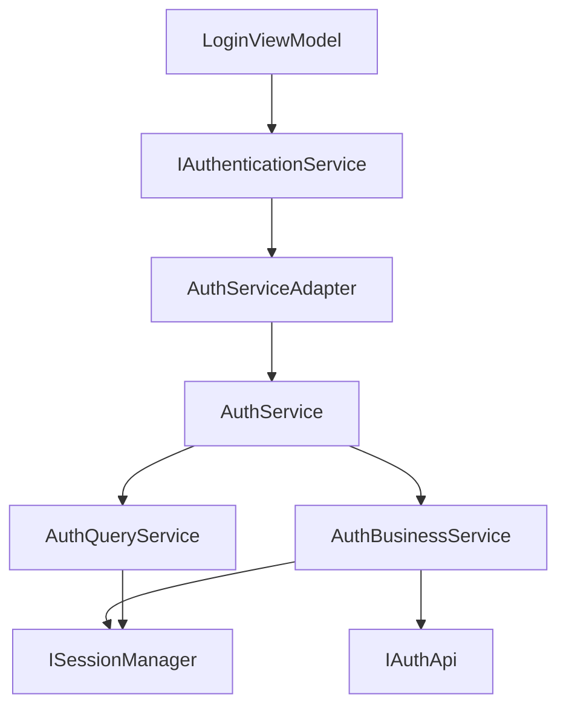

# 客户端Auth模块设计文档

## 文档信息
- **创建时间**: 2025-09-27
- **模块名称**: LYBT.Desktop.Auth
- **模块版本**: 2.1.0-auth-enterprise
- **架构标准**: UltraThink双层架构
- **技术栈**: WPF + Prism.DryIoc + MVVM

## 1. 模块概述

### 1.1 模块定位
客户端Auth模块是凌隐宝堂中医诊所管理系统的安全核心组件，负责用户身份认证、JWT令牌管理和会话状态维护。该模块采用WPF+Prism架构，实现了完整的MVVM模式，为整个桌面应用程序提供统一的认证基础设施。

### 1.2 核心功能
- **用户登录认证**: 提供用户名密码登录界面和业务逻辑
- **JWT令牌管理**: 处理访问令牌和刷新令牌的获取、存储和更新
- **会话状态管理**: 维护用户登录状态和会话信息
- **密码管理**: 支持系统管理员密码修改功能
- **API连接检查**: 监控后端服务连接状态
- **安全登出**: 提供完整的登出流程和状态清理

### 1.3 技术特性
- **模块化设计**: 基于Prism模块化框架，支持按需加载
- **依赖注入**: 使用DryIoc容器实现控制反转
- **接口驱动**: 通过接口抽象实现松耦合架构
- **企业级安全**: 集成JWT认证和RBAC权限控制
- **现代化UI**: 采用Material Design风格的登录界面
- **异步优化**: 全面使用async/await模式提升响应性

### 1.4 架构约束
- 严格遵循UltraThink双层架构：QueryService（查询）+ BusinessService（业务）
- 禁止使用ServiceLocator反模式，强制使用构造函数注入
- 所有ViewModel必须继承ModernViewModelBase基类
- API调用统一通过IAuthApi接口实现
- 状态管理统一通过ISessionManager服务

## 2. 架构设计（MVVM模式）

### 2.1 架构层次

```
┌─────────────────────────────────────────────────────────────┐
│                        Auth Module                          │
├─────────────────────────────────────────────────────────────┤
│                   Views (XAML)                             │
│  ┌─────────────────┐  ┌─────────────────┐                 │
│  │   LoginView     │  │  LoginWindow    │                 │
│  │   (UserControl) │  │   (Window)      │                 │
│  └─────────────────┘  └─────────────────┘                 │
├─────────────────────────────────────────────────────────────┤
│                 ViewModels (MVVM)                          │
│  ┌─────────────────────────────────────────────────────────┐ │
│  │              LoginViewModel                              │ │
│  │         (ModernViewModelBase)                           │ │
│  └─────────────────────────────────────────────────────────┘ │
├─────────────────────────────────────────────────────────────┤
│              Service Layer (UltraThink)                    │
│  ┌──────────────┐  ┌──────────────┐  ┌──────────────┐     │
│  │AuthService   │  │QueryService  │  │BusinessService│     │
│  │(委托层)      │  │(查询专业层)  │  │(业务逻辑层)   │     │
│  └──────────────┘  └──────────────┘  └──────────────┘     │
├─────────────────────────────────────────────────────────────┤
│                Integration Layer                            │
│  ┌─────────────────┐  ┌─────────────────┐                 │
│  │ AuthServiceAdapter│  │  ISessionManager │                 │
│  │  (适配器模式)    │  │   (状态管理)    │                 │
│  └─────────────────┘  └─────────────────┘                 │
├─────────────────────────────────────────────────────────────┤
│                  Infrastructure                            │
│  ┌─────────────────┐  ┌─────────────────┐                 │
│  │    IAuthApi     │  │ IUnifiedApiClient│                 │
│  │   (API客户端)   │  │   (统一客户端)   │                 │
│  └─────────────────┘  └─────────────────┘                 │
└─────────────────────────────────────────────────────────────┘
```

### 2.2 数据流向

```
用户操作 → LoginView → LoginViewModel → AuthService → BusinessService → IAuthApi → 后端API
                                                    ↓
会话状态 ← ISessionManager ← AuthBusinessService ← LoginResponse ← API响应
```

### 2.3 依赖关系



## 3. ViewModels设计

### 3.1 LoginViewModel架构

```csharp
public class LoginViewModel : ModernViewModelBase
{
    // 依赖服务（构造函数注入）
    private readonly IEventAggregator _eventAggregator;
    private readonly ILoggerFactory _loggerFactory;
    private readonly IErrorHandlingService _errorHandlingService;

    // 数据绑定属性
    public string Username { get; set; }
    public string Password { get; set; }
    public bool RememberMe { get; set; }
    public bool IsLoading { get; set; }
    public string StatusMessage { get; set; }
    public string ErrorMessage { get; set; }

    // 命令绑定
    public ICommand LoginCommand { get; }
    public ICommand ClearErrorCommand { get; }
}
```

### 3.2 属性设计模式

#### 3.2.1 基础绑定属性
- **Username**: 用户名输入，支持实时验证
- **Password**: 密码输入，通过PasswordBox事件处理
- **RememberMe**: 记住登录状态的复选框
- **IsLoading**: 控制加载状态和UI禁用
- **StatusMessage**: 成功状态消息显示
- **ErrorMessage**: 错误信息显示

#### 3.2.2 状态管理属性
- **HasMessage**: 计算属性，控制消息区域显示
- **CanLogin**: 计算属性，控制登录按钮可用性
- **IsApiOnline**: API连接状态指示
- **ApiStatus**: API状态文本描述

### 3.3 命令设计模式

#### 3.3.1 LoginCommand实现
```csharp
public ICommand LoginCommand => new AsyncDelegateCommand(
    async () => await ExecuteLoginAsync(),
    () => CanExecuteLogin()
);

private async Task ExecuteLoginAsync()
{
    try
    {
        IsLoading = true;
        ClearMessages();

        var request = new LoginRequest
        {
            Username = Username,
            Password = Password,
            RememberMe = RememberMe
        };

        var result = await _authService.LoginAsync(request);

        if (result.IsSuccess)
        {
            StatusMessage = "登录成功！";
            _eventAggregator.GetEvent<UserLoggedInEvent>().Publish();
        }
        else
        {
            ErrorMessage = result.ErrorMessage ?? "登录失败";
        }
    }
    catch (Exception ex)
    {
        ErrorMessage = $"登录过程发生错误：{ex.Message}";
        _logger.LogError(ex, "用户登录异常");
    }
    finally
    {
        IsLoading = false;
    }
}
```

### 3.4 事件处理机制

#### 3.4.1 Prism事件聚合器
- **UserLoggedInEvent**: 用户登录成功事件
- **UserLoggedOutEvent**: 用户登出事件
- **AuthenticationFailedEvent**: 认证失败事件
- **ApiConnectionChangedEvent**: API连接状态变化事件

#### 3.4.2 事件发布模式
```csharp
// 登录成功后发布事件
_eventAggregator.GetEvent<UserLoggedInEvent>().Publish(new UserLoginPayload
{
    User = result.Data.User,
    LoginTime = DateTime.Now
});
```

## 4. Views界面设计

### 4.1 LoginView用户控件

#### 4.1.1 界面布局结构
```xml
<UserControl x:Class="LYBT.Desktop.Auth.Views.LoginView">
    <Grid Margin="25">
        <!-- 标题Logo区域 -->
        <StackPanel Grid.Row="0">
            <TextBlock Text="凌隐宝堂中医诊所" />
            <TextBlock Text="管理系统" />
        </StackPanel>

        <!-- 用户名输入区域 -->
        <StackPanel Grid.Row="2">
            <TextBlock Text="用户名" />
            <TextBox Text="{Binding Username}" />
        </StackPanel>

        <!-- 密码输入区域 -->
        <StackPanel Grid.Row="4">
            <TextBlock Text="密码" />
            <PasswordBox x:Name="PasswordBox" />
        </StackPanel>

        <!-- 记住我选项 -->
        <CheckBox Grid.Row="6" Content="记住我"
                 IsChecked="{Binding RememberMe}" />

        <!-- 登录按钮 -->
        <Button Grid.Row="8" Content="登录"
               Command="{Binding LoginCommand}" />

        <!-- 状态消息区域 -->
        <Border Grid.Row="10">
            <StackPanel>
                <TextBlock Text="{Binding StatusMessage}" />
                <TextBlock Text="{Binding ErrorMessage}" />
            </StackPanel>
        </Border>

        <!-- 加载遮罩 -->
        <Grid Grid.RowSpan="12"
             Visibility="{Binding IsLoading, Converter={StaticResource BooleanToVisibilityConverter}}">
            <ProgressBar IsIndeterminate="True" />
            <TextBlock Text="正在登录..." />
        </Grid>
    </Grid>
</UserControl>
```

#### 4.1.2 样式设计特点
- **现代化外观**: 圆角边框、渐变背景、柔和阴影
- **响应式交互**: 鼠标悬停效果、焦点状态变化
- **高对比度支持**: 支持系统高对比度主题
- **无障碍访问**: 完整的AutomationProperties支持
- **多语言支持**: 可本地化的文本资源

### 4.2 LoginWindow独立窗口

#### 4.2.1 窗口特性
- **固定尺寸**: 580x480像素，居中显示
- **无调整**: ResizeMode="NoResize"
- **单边框**: WindowStyle="SingleBorderWindow"
- **启动动画**: FadeIn + TranslateY动画效果
- **阴影效果**: DropShadowEffect增强视觉效果

#### 4.2.2 主题系统集成
```xml
<Window.Resources>
    <ResourceDictionary>
        <ResourceDictionary.MergedDictionaries>
            <ResourceDictionary Source="../../Themes/Controls/LoginControls.xaml" />
            <ResourceDictionary Source="../../Themes/Design/HighContrastTheme.xaml" />
        </ResourceDictionary.MergedDictionaries>
    </ResourceDictionary>
</Window.Resources>
```

### 4.3 响应式UI设计

#### 4.3.1 控件样式
- **ModernTextBoxStyle**: 现代化文本框样式
- **ModernPasswordBoxStyle**: 密码框专用样式
- **PrimaryButtonStyle**: 主要按钮样式
- **ModernCheckBoxStyle**: 复选框样式
- **LoadingOverlayStyle**: 加载遮罩样式

#### 4.3.2 状态指示器
- **API状态**: 实时显示后端连接状态
- **加载状态**: 登录过程中的进度指示
- **错误状态**: 红色文本显示错误信息
- **成功状态**: 绿色文本显示成功信息

## 5. 前端服务层

### 5.1 服务层架构（UltraThink双层）

#### 5.1.1 AuthService（委托层）
```csharp
public class AuthService : IAuthService
{
    private readonly IAuthQueryService _queryService;
    private readonly IAuthBusinessService _businessService;

    // 委托模式：将请求路由到专业化服务
    public async Task<ServiceResult<LoginResponse>> LoginAsync(LoginRequest request)
        => await _businessService.LoginAsync(request);

    public async Task<ServiceResult<bool>> LogoutAsync(LogoutRequest request)
    {
        var result = await _businessService.LogoutAsync();
        return result.IsSuccess
            ? ServiceResult<bool>.Success(true)
            : ServiceResult<bool>.Failure(result.ErrorMessage);
    }
}
```

#### 5.1.2 AuthQueryService（查询专业层）
```csharp
public class AuthQueryService : IAuthQueryService
{
    private readonly ISessionManager _sessionManager;
    private readonly IAuthApi _authApi;

    // 只读查询操作，不涉及状态修改
    public bool IsLoggedIn => _sessionManager.CurrentUser != null;

    public Task<ServiceResult<UserDto?>> GetCurrentUser()
    {
        var currentUser = _sessionManager.CurrentUser;
        return Task.FromResult(ServiceResult<UserDto?>.Success(currentUser));
    }

    public async Task<ServiceResult<bool>> CheckConnectionAsync()
    {
        try
        {
            await Task.Delay(10); // 模拟异步检查
            return ServiceResult<bool>.Success(true);
        }
        catch
        {
            return ServiceResult<bool>.Success(false);
        }
    }
}
```

#### 5.1.3 AuthBusinessService（业务逻辑层）
```csharp
public class AuthBusinessService : IAuthBusinessService
{
    private readonly IAuthApi _authApi;
    private readonly ISessionManager _sessionManager;
    private readonly IUnifiedApiClientManager _apiClientManager;

    public async Task<ServiceResult<LoginResponse>> LoginAsync(LoginRequest request)
    {
        try
        {
            var response = await _authApi.LoginAsync(request);

            if (response.Success && response.Data != null)
            {
                // 更新会话状态
                _sessionManager.SetUserSession(response.Data.User, response.Data.Token);

                // 设置API客户端认证令牌
                _apiClientManager.SetAuthorizationToken(response.Data.Token);

                return ServiceResult<LoginResponse>.Success(response.Data);
            }

            return ServiceResult<LoginResponse>.Failure("登录失败");
        }
        catch (Exception ex)
        {
            return ServiceResult<LoginResponse>.Failure($"登录过程发生错误: {ex.Message}");
        }
    }
}
```

### 5.2 适配器模式设计

#### 5.2.1 AuthServiceAdapter
解决服务接口职责混乱问题，将IAuthService业务API适配为IAuthenticationService前端认证接口：

```csharp
public class AuthServiceAdapter : IAuthenticationService
{
    private readonly IAuthService _authService;
    private readonly ISessionManager _sessionManager;

    // 适配器模式：接口转换
    public async Task<ServiceResult<LoginResponse>> LoginAsync(LoginRequest request)
        => await _authService.LoginAsync(request);

    public async Task<ServiceResult> LogoutAsync()
    {
        var logoutRequest = new LogoutRequest();
        var result = await _authService.LogoutAsync(logoutRequest);

        return result.IsSuccess
            ? ServiceResult.Success("登出成功")
            : ServiceResult.Failure(result.ErrorMessage);
    }

    // 状态查询适配
    public bool IsLoggedIn => _sessionManager.IsLoggedIn;
    public Task<UserDto?> GetCurrentUserAsync() => Task.FromResult(_sessionManager.CurrentUser);
}
```

### 5.3 错误处理策略

#### 5.3.1 统一异常处理
- **网络异常**: 自动重试机制，连接超时处理
- **认证异常**: 清理本地状态，引导重新登录
- **业务异常**: 用户友好的错误提示
- **系统异常**: 详细日志记录，通用错误提示

#### 5.3.2 ServiceResult模式
```csharp
public class ServiceResult<T>
{
    public bool IsSuccess { get; set; }
    public T? Data { get; set; }
    public string? Message { get; set; }
    public string? ErrorMessage { get; set; }

    public static ServiceResult<T> Success(T data, string? message = null)
        => new() { IsSuccess = true, Data = data, Message = message };

    public static ServiceResult<T> Failure(string errorMessage)
        => new() { IsSuccess = false, ErrorMessage = errorMessage };
}
```

## 6. 数据绑定与验证

### 6.1 数据绑定模式

#### 6.1.1 双向绑定属性
```csharp
private string _username = string.Empty;
public string Username
{
    get => _username;
    set
    {
        if (SetProperty(ref _username, value))
        {
            // 触发登录命令可用性检查
            ((DelegateCommand)LoginCommand).RaiseCanExecuteChanged();

            // 清除之前的错误信息
            if (!string.IsNullOrEmpty(ErrorMessage))
            {
                ErrorMessage = string.Empty;
            }
        }
    }
}
```

#### 6.1.2 密码处理机制
由于WPF安全限制，PasswordBox不支持直接绑定，采用事件处理方式：

```csharp
// LoginView.xaml.cs
private void PasswordBox_PasswordChanged(object sender, RoutedEventArgs e)
{
    if (DataContext is LoginViewModel viewModel && sender is PasswordBox passwordBox)
    {
        viewModel.Password = passwordBox.Password;
    }
}
```

### 6.2 输入验证体系

#### 6.2.1 实时验证规则
```csharp
private bool ValidateLoginInput()
{
    var errors = new List<string>();

    if (string.IsNullOrWhiteSpace(Username))
        errors.Add("用户名不能为空");
    else if (Username.Length > 32)
        errors.Add("用户名长度不能超过32个字符");

    if (string.IsNullOrWhiteSpace(Password))
        errors.Add("密码不能为空");
    else if (Password.Length < 6)
        errors.Add("密码长度不能少于6个字符");

    if (errors.Any())
    {
        ErrorMessage = string.Join("；", errors);
        return false;
    }

    return true;
}
```

#### 6.2.2 数据注解验证
使用Shared层的验证特性：

```csharp
// LoginRequest.cs 中的验证规则
[Required(ErrorMessage = "用户名不能为空")]
[StringLength(32, ErrorMessage = "用户名长度不能超过32个字符")]
public string Username { get; set; } = string.Empty;

[Required(ErrorMessage = "密码不能为空")]
public string Password { get; set; } = string.Empty;
```

### 6.3 值转换器

#### 6.3.1 可见性转换器
```csharp
// StringToVisibilityConverter
public object Convert(object value, Type targetType, object parameter, CultureInfo culture)
{
    return string.IsNullOrEmpty(value?.ToString())
        ? Visibility.Collapsed
        : Visibility.Visible;
}

// BooleanToVisibilityConverter（系统内置）
Visibility="{Binding IsLoading, Converter={StaticResource BooleanToVisibilityConverter}}"
```

#### 6.3.2 状态转换器
```csharp
// ApiStatusToColorConverter
public object Convert(object value, Type targetType, object parameter, CultureInfo culture)
{
    return value is bool isOnline && isOnline
        ? new SolidColorBrush(Colors.Green)
        : new SolidColorBrush(Colors.Red);
}
```

## 7. 路由与导航

### 7.1 Prism导航系统

#### 7.1.1 区域导航配置
```csharp
// AuthenticationModule.cs
public void RegisterTypes(IContainerRegistry containerRegistry)
{
    // 注册视图用于导航
    containerRegistry.RegisterForNavigation<LoginView>();

    // 注册服务
    containerRegistry.RegisterSingleton<AuthService>();
    containerRegistry.Register<LoginViewModel>();
}
```

#### 7.1.2 导航流程
```csharp
// 主Shell中的导航逻辑
public async Task NavigateToLoginAsync()
{
    var navigationResult = await _regionManager.RequestNavigateAsync(
        RegionNames.MainRegion,
        nameof(LoginView)
    );

    if (!navigationResult.Result.HasValue || !navigationResult.Result.Value)
    {
        _logger.LogWarning("导航到登录视图失败: {Error}", navigationResult.Error?.Message);
    }
}
```

### 7.2 导航参数传递

#### 7.2.1 参数传递机制
```csharp
// 带参数导航
var navigationParameters = new NavigationParameters
{
    { "ReturnUrl", "/patients" },
    { "ShowMessage", "会话已过期，请重新登录" }
};

await _regionManager.RequestNavigateAsync(
    RegionNames.MainRegion,
    nameof(LoginView),
    navigationParameters
);
```

#### 7.2.2 参数接收处理
```csharp
// LoginViewModel 实现 INavigationAware
public void OnNavigatedTo(NavigationContext navigationContext)
{
    if (navigationContext.Parameters.ContainsKey("ShowMessage"))
    {
        StatusMessage = navigationContext.Parameters.GetValue<string>("ShowMessage");
    }

    _returnUrl = navigationContext.Parameters.GetValue<string>("ReturnUrl");
}
```

### 7.3 导航守护

#### 7.3.1 登录状态检查
```csharp
public bool IsNavigationTarget(NavigationContext navigationContext)
{
    // 如果已登录，阻止导航到登录页面
    return !_sessionManager.IsLoggedIn;
}

public void OnNavigatedFrom(NavigationContext navigationContext)
{
    // 清理登录页面状态
    ClearSensitiveData();
}
```

## 8. 状态管理

### 8.1 ISessionManager集成

#### 8.1.1 会话状态接口
```csharp
public interface ISessionManager
{
    UserDto? CurrentUser { get; }
    bool IsLoggedIn { get; }
    string? CurrentToken { get; }

    void SetUserSession(UserDto user, string token);
    void ClearUserSession();
    void UpdateUserInfo(UserDto user);

    event EventHandler<UserSessionChangedEventArgs> SessionChanged;
}
```

#### 8.1.2 状态变化监听
```csharp
// LoginViewModel 构造函数中订阅会话变化
public LoginViewModel(ISessionManager sessionManager)
{
    _sessionManager = sessionManager;
    _sessionManager.SessionChanged += OnSessionChanged;
}

private void OnSessionChanged(object sender, UserSessionChangedEventArgs e)
{
    // 根据会话状态更新UI
    RaisePropertyChanged(nameof(IsLoggedIn));

    if (e.IsLoggedIn)
    {
        // 登录成功，导航到主界面
        NavigateToMainWorkbench();
    }
}
```

### 8.2 本地状态持久化

#### 8.2.1 RememberMe功能
```csharp
public class LoginCredentialStore
{
    private const string CredentialsKey = "LYBT_LoginCredentials";

    public void SaveCredentials(string username, bool rememberMe)
    {
        if (rememberMe)
        {
            var credentials = new LoginCredentials
            {
                Username = username,
                SavedAt = DateTime.Now
            };

            var json = JsonSerializer.Serialize(credentials);
            var encrypted = ProtectedData.Protect(
                Encoding.UTF8.GetBytes(json),
                null,
                DataProtectionScope.CurrentUser
            );

            Properties.Settings.Default.LoginCredentials = Convert.ToBase64String(encrypted);
            Properties.Settings.Default.Save();
        }
        else
        {
            ClearSavedCredentials();
        }
    }

    public LoginCredentials? LoadSavedCredentials()
    {
        try
        {
            var base64 = Properties.Settings.Default.LoginCredentials;
            if (string.IsNullOrEmpty(base64)) return null;

            var encrypted = Convert.FromBase64String(base64);
            var decrypted = ProtectedData.Unprotect(
                encrypted,
                null,
                DataProtectionScope.CurrentUser
            );

            var json = Encoding.UTF8.GetString(decrypted);
            return JsonSerializer.Deserialize<LoginCredentials>(json);
        }
        catch
        {
            return null;
        }
    }
}
```

### 8.3 全局状态同步

#### 8.3.1 状态同步事件
```csharp
// 全局状态同步事件定义
public class UserLoggedInEvent : PubSubEvent<UserLoginPayload> { }
public class UserLoggedOutEvent : PubSubEvent { }
public class AuthenticationFailedEvent : PubSubEvent<AuthFailurePayload> { }

// 事件载荷定义
public class UserLoginPayload
{
    public UserDto User { get; set; }
    public DateTime LoginTime { get; set; }
    public string? DeviceInfo { get; set; }
}

public class AuthFailurePayload
{
    public string ErrorMessage { get; set; }
    public int FailureCount { get; set; }
    public bool ShouldLockout { get; set; }
}
```

#### 8.3.2 跨模块状态通知
```csharp
// 其他模块订阅认证事件
public class PatientModule : IModule
{
    public void OnInitialized(IContainerProvider containerProvider)
    {
        var eventAggregator = containerProvider.Resolve<IEventAggregator>();

        eventAggregator.GetEvent<UserLoggedInEvent>()
                      .Subscribe(OnUserLoggedIn, ThreadOption.UIThread);

        eventAggregator.GetEvent<UserLoggedOutEvent>()
                      .Subscribe(OnUserLoggedOut, ThreadOption.UIThread);
    }

    private void OnUserLoggedIn(UserLoginPayload payload)
    {
        // 初始化患者模块的用户相关数据
        InitializeUserData(payload.User);
    }

    private void OnUserLoggedOut()
    {
        // 清理患者模块的敏感数据
        ClearSensitiveData();
    }
}
```

## 9. API集成

### 9.1 IAuthApi接口设计

#### 9.1.1 Refit客户端定义
```csharp
[Description("身份认证API客户端 - JWT认证、会话管理、安全操作")]
public interface IAuthApi
{
    [Post("/api/v1/auth/login")]
    Task<ApiResponse<LoginResponse>> LoginAsync([Body] LoginRequest loginRequest);

    [Post("/api/v1/auth/logout")]
    Task<ApiResponse<object>> LogoutAsync();

    [Get("/api/v1/auth/current-user")]
    Task<ApiResponse<UserDto>> GetCurrentUserAsync();

    [Post("/api/v1/auth/refresh-token")]
    Task<ApiResponse<LoginResponse>> RefreshTokenAsync();

    [Post("/api/v1/auth/change-password")]
    Task<ApiResponse<object>> ChangePasswordAsync([Body] ChangePasswordRequest request);

    [Get("/api/v1/health/alive")]
    Task<string> HealthCheckAsync();
}
```

#### 9.1.2 API响应处理
```csharp
public async Task<ServiceResult<LoginResponse>> LoginAsync(LoginRequest request)
{
    try
    {
        var apiResponse = await _authApi.LoginAsync(request);

        if (apiResponse.Success && apiResponse.Data != null)
        {
            return ServiceResult<LoginResponse>.Success(
                apiResponse.Data,
                "登录成功"
            );
        }

        return ServiceResult<LoginResponse>.Failure(
            apiResponse.Message ?? "登录失败"
        );
    }
    catch (HttpRequestException httpEx)
    {
        _logger.LogError(httpEx, "API请求异常: {Message}", httpEx.Message);
        return ServiceResult<LoginResponse>.Failure("网络连接异常，请检查网络设置");
    }
    catch (TaskCanceledException timeoutEx)
    {
        _logger.LogError(timeoutEx, "API请求超时");
        return ServiceResult<LoginResponse>.Failure("请求超时，请稍后重试");
    }
    catch (Exception ex)
    {
        _logger.LogError(ex, "登录过程发生未知异常");
        return ServiceResult<LoginResponse>.Failure($"登录失败: {ex.Message}");
    }
}
```

### 9.2 统一API客户端管理

#### 9.2.1 IUnifiedApiClientManager
```csharp
public interface IUnifiedApiClientManager
{
    void SetAuthorizationToken(string? token);
    void SetBaseAddress(string baseAddress);
    HttpClient GetHttpClient();
    T GetTypedClient<T>() where T : class;
}
```

#### 9.2.2 JWT令牌自动管理
```csharp
public class UnifiedApiClientManager : IUnifiedApiClientManager
{
    private readonly HttpClient _httpClient;
    private readonly ILogger<UnifiedApiClientManager> _logger;

    public void SetAuthorizationToken(string? token)
    {
        if (string.IsNullOrEmpty(token))
        {
            _httpClient.DefaultRequestHeaders.Authorization = null;
            _logger.LogDebug("已清除API认证令牌");
        }
        else
        {
            _httpClient.DefaultRequestHeaders.Authorization =
                new AuthenticationHeaderValue("Bearer", token);
            _logger.LogDebug("已设置API认证令牌");
        }
    }

    public T GetTypedClient<T>() where T : class
    {
        return RestService.For<T>(_httpClient);
    }
}
```

### 9.3 网络错误处理

#### 9.3.1 重试策略
```csharp
public class RetryPolicyHandler : DelegatingHandler
{
    private readonly int _maxRetries;
    private readonly TimeSpan _delay;

    protected override async Task<HttpResponseMessage> SendAsync(
        HttpRequestMessage request,
        CancellationToken cancellationToken)
    {
        for (int attempt = 0; attempt <= _maxRetries; attempt++)
        {
            try
            {
                var response = await base.SendAsync(request, cancellationToken);

                if (response.IsSuccessStatusCode || attempt == _maxRetries)
                    return response;

                if (ShouldRetry(response.StatusCode))
                {
                    await Task.Delay(_delay, cancellationToken);
                    continue;
                }

                return response;
            }
            catch (HttpRequestException) when (attempt < _maxRetries)
            {
                await Task.Delay(_delay, cancellationToken);
            }
        }

        throw new InvalidOperationException("超过最大重试次数");
    }

    private static bool ShouldRetry(HttpStatusCode statusCode)
    {
        return statusCode == HttpStatusCode.RequestTimeout ||
               statusCode == HttpStatusCode.TooManyRequests ||
               (int)statusCode >= 500;
    }
}
```

#### 9.3.2 连接状态监控
```csharp
public class ApiConnectionMonitor
{
    private readonly IAuthApi _authApi;
    private readonly Timer _monitorTimer;
    private bool _isOnline = true;

    public event EventHandler<bool> ConnectionStatusChanged;

    public void StartMonitoring()
    {
        _monitorTimer = new Timer(CheckConnection, null, TimeSpan.Zero, TimeSpan.FromMinutes(1));
    }

    private async void CheckConnection(object state)
    {
        try
        {
            await _authApi.HealthCheckAsync();
            SetConnectionStatus(true);
        }
        catch
        {
            SetConnectionStatus(false);
        }
    }

    private void SetConnectionStatus(bool isOnline)
    {
        if (_isOnline != isOnline)
        {
            _isOnline = isOnline;
            ConnectionStatusChanged?.Invoke(this, isOnline);
        }
    }
}
```

## 10. 实现状态

### 10.1 当前完成状态

#### 10.1.1 已实现功能 ✅
- **核心架构**: UltraThink双层架构完整实现
- **Prism模块**: AuthenticationModule模块化注册
- **服务层**: AuthService、AuthQueryService、AuthBusinessService
- **适配器模式**: AuthServiceAdapter解决接口职责问题
- **ViewModel基础**: LoginViewModel基础框架
- **UI布局**: LoginView和LoginWindow完整界面
- **API集成**: IAuthApi接口定义和基础实现
- **依赖注入**: 完整的DI容器配置
- **项目配置**: .csproj文件和依赖管理

#### 10.1.2 部分实现功能 ⚠️
- **LoginViewModel业务逻辑**: 架构重构后需要重新实现
- **密码处理**: PasswordBox事件处理待完善
- **状态管理**: 会话状态同步机制待完善
- **错误处理**: 统一异常处理机制待完善
- **导航逻辑**: Prism导航集成待完善

### 10.2 待实现功能

#### 10.2.1 高优先级 🔴
1. **LoginViewModel完整实现**
   - 登录命令业务逻辑
   - 输入验证机制
   - 状态管理集成
   - 错误处理逻辑

2. **密码安全处理**
   - PasswordBox安全绑定
   - 密码强度验证
   - 密码可见性切换

3. **会话状态同步**
   - ISessionManager集成
   - 全局状态事件
   - 跨模块通信

#### 10.2.2 中优先级 🟡
1. **UI交互优化**
   - 加载状态指示
   - 动画效果实现
   - 响应式布局

2. **安全功能增强**
   - 记住我功能
   - 自动登录
   - 登录失败限制

3. **网络连接管理**
   - 连接状态监控
   - 离线模式支持
   - 重试机制

#### 10.2.3 低优先级 🟢
1. **高级功能**
   - 多语言支持
   - 主题切换
   - 无障碍访问

2. **性能优化**
   - 异步操作优化
   - 内存管理
   - 启动速度优化

### 10.3 技术债务

#### 10.3.1 架构层面
- **TODO标记清理**: 代码中存在大量TODO注释需要处理
- **接口职责优化**: 某些接口职责定义需要进一步明确
- **依赖关系简化**: 减少不必要的依赖关系

#### 10.3.2 代码质量
- **单元测试覆盖**: Auth模块缺少完整的单元测试
- **日志记录标准化**: 日志记录格式和级别需要统一
- **异常处理规范**: 异常处理策略需要标准化

### 10.4 质量指标

#### 10.4.1 代码质量
- **代码覆盖率**: 目标 > 80%
- **复杂度控制**: 圈复杂度 < 10
- **技术债务**: SonarQube评级 A

#### 10.4.2 性能指标
- **启动时间**: < 2秒
- **登录响应**: < 3秒
- **内存占用**: < 50MB

#### 10.4.3 用户体验
- **界面响应**: UI操作 < 100ms
- **错误恢复**: 自动重试机制
- **状态一致**: 全局状态同步

### 10.5 后续规划

#### 10.5.1 短期目标（1-2周）
1. 完成LoginViewModel业务逻辑实现
2. 实现完整的会话状态管理
3. 添加基础的单元测试覆盖

#### 10.5.2 中期目标（1个月）
1. 实现所有安全功能和优化
2. 完善错误处理和用户体验
3. 添加集成测试和端到端测试

#### 10.5.3 长期目标（3个月）
1. 性能优化和稳定性提升
2. 高级功能实现和用户体验优化
3. 完整的文档和维护指南

---

## 附录

### A. 相关文件清单

#### A.1 核心实现文件
- `AuthenticationModule.cs` - Prism模块注册
- `ViewModels/LoginViewModel.cs` - 登录视图模型
- `Views/LoginView.xaml` - 登录用户控件
- `Views/LoginWindow.xaml` - 登录独立窗口
- `Services/AuthService.cs` - 认证服务委托层
- `Services/AuthQueryService.cs` - 认证查询服务
- `Services/AuthBusinessService.cs` - 认证业务服务
- `Services/AuthServiceAdapter.cs` - 服务适配器

#### A.2 接口定义文件
- `Interfaces/IAuthBusinessService.cs` - 业务服务接口
- `Interfaces/IAuthQueryService.cs` - 查询服务接口

#### A.3 配置文件
- `LYBT.Desktop.Auth.csproj` - 项目配置
- `Mappings/MappingProfile.cs` - AutoMapper配置

### B. 共享依赖

#### B.1 Shared模型
- `LYBT.Shared.Models.Contracts.Auth.LoginRequest` - 登录请求
- `LYBT.Shared.Models.Contracts.Auth.LoginResponse` - 登录响应
- `LYBT.Shared.Models.Contracts.Users.UserDto` - 用户信息

#### B.2 共享接口
- `LYBT.Shared.Interfaces.Services.IAuthService` - 认证服务接口
- `LYBT.Shared.Interfaces.Api.IAuthApi` - 认证API接口

### C. 技术参考

#### C.1 框架版本
- .NET 8.0
- WPF (Windows Presentation Foundation)
- Prism.DryIoc 8.x
- Refit 7.x
- AutoMapper 14.x

#### C.2 设计模式应用
- MVVM (Model-View-ViewModel)
- 依赖注入 (Dependency Injection)
- 适配器模式 (Adapter Pattern)
- 观察者模式 (Observer Pattern)
- 命令模式 (Command Pattern)

---

*文档版本: 1.0*
*最后更新: 2025-09-27*
*维护团队: LYBT开发团队*