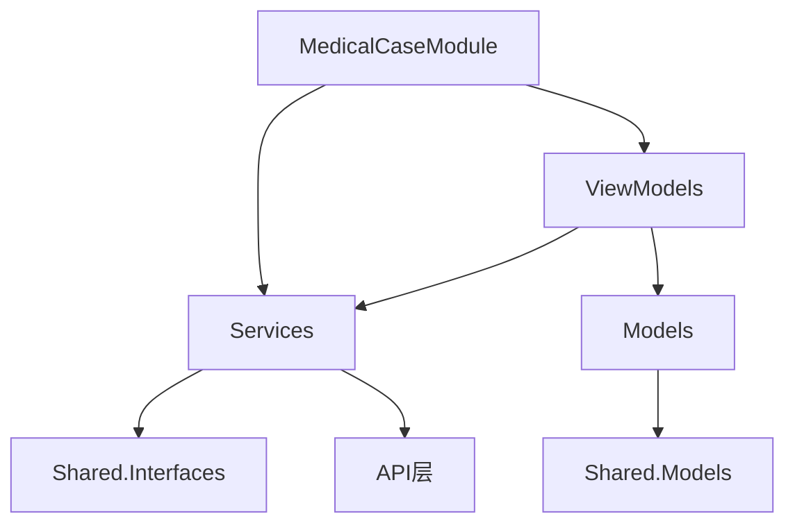

# 客户端MedicalCase模块设计文档

## 1. 模块概述

### 1.1 模块定位
客户端MedicalCase模块是LYBTZYZS系统中负责病历管理的前端模块，基于WPF + Prism.DryIoc架构实现。该模块遵循UltraThink双层架构设计，提供完整的病历创建、查询、编辑和统计功能。

### 1.2 模块职责
- **病历管理**：提供病历的创建、查询、编辑、删除等核心功能
- **患者关联**：与患者信息紧密关联，支持按患者查询病历
- **诊疗集成**：与诊疗模块集成，支持诊疗记录和处方开具
- **数据展示**：提供友好的用户界面展示病历信息
- **状态管理**：管理病历的各种状态（进行中、已完成、已取消等）

### 1.3 技术栈
- **前端框架**：WPF (.NET 8)
- **MVVM框架**：Prism.DryIoc
- **依赖注入**：DryIoc容器
- **数据绑定**：WPF数据绑定机制
- **UI设计**：统一设计系统（UnifiedDesignSystem.xaml）

## 2. 架构设计

### 2.1 整体架构
```
LYBT.Desktop.MedicalCase/
├── MedicalCaseModule.cs          # 模块注册和初始化
├── Models/                       # UI专用模型
│   └── MedicalCaseItem.cs       # 病历列表项UI模型
├── Services/                     # 前端服务层
│   └── MedicalCaseService.cs    # 病历服务实现
├── ViewModels/                   # 视图模型
│   ├── MedicalCaseListViewModel.cs
│   ├── MedicalCaseManagementViewModel.cs
│   ├── CreateMedicalCaseViewModel.cs
│   ├── MedicalCaseDetailViewModel.cs
│   └── RefactoredMedicalCaseListViewModel.cs
└── Views/                        # 视图界面
    ├── MedicalCaseListView.xaml
    ├── MedicalCaseManagementView.xaml
    ├── CreateMedicalCaseDialog.xaml
    └── MedicalCaseDetailView.xaml
```

### 2.2 UltraThink双层架构
遵循项目的UltraThink架构模式：
- **委托层（Module）**：负责模块注册和依赖配置
- **服务层（Service）**：封装业务逻辑和API调用
- **视图模型层（ViewModel）**：处理UI逻辑和数据绑定
- **视图层（View）**：提供用户界面展示

### 2.3 依赖关系


## 3. ViewModels设计

### 3.1 基础ViewModel架构
所有ViewModel都继承自项目标准的基类：
- `ModernViewModelBase`：适用于普通视图模型
- `NavigationViewModelBase`：适用于需要导航功能的视图模型

### 3.2 核心ViewModels

#### 3.2.1 MedicalCaseListViewModel
```csharp
/// <summary>
/// 病历列表视图模型 - 简化版本
/// 当前状态：架构重构后的简化实现
/// </summary>
public class MedicalCaseListViewModel : ModernViewModelBase
{
    // 依赖注入
    - IEventAggregator eventAggregator
    - ILoggerFactory loggerFactory  
    - IErrorHandlingService errorHandlingService
    
    // 主要功能（TODO: 重构完成后实现）
    // - 病历列表展示
    // - 搜索和筛选
    // - 分页控制
    // - 操作命令
}
```

#### 3.2.2 MedicalCaseManagementViewModel
```csharp
/// <summary>
/// 病历管理视图模型 - 导航型ViewModel
/// 当前状态：架构重构后的简化实现
/// </summary>
public class MedicalCaseManagementViewModel : NavigationViewModelBase
{
    // 依赖注入（扩展了导航功能）
    - IRegionManager regionManager
    - ISessionManager sessionManager
    
    // 管理功能（TODO: 重构完成后实现）
    // - 综合管理界面
    // - 多视图导航
    // - 权限控制
}
```

#### 3.2.3 CreateMedicalCaseViewModel
```csharp
/// <summary>
/// 创建病历视图模型
/// 当前状态：架构重构后的简化实现
/// </summary>
public class CreateMedicalCaseViewModel : ModernViewModelBase
{
    // 创建功能（TODO: 重构完成后实现）
    // - 新建病历表单
    // - 数据验证
    // - 保存操作
}
```

#### 3.2.4 MedicalCaseDetailViewModel
```csharp
/// <summary>
/// 病历详情视图模型
/// 当前状态：架构重构后的简化实现
/// </summary>
public class MedicalCaseDetailViewModel : ModernViewModelBase
{
    // 详情功能（TODO: 重构完成后实现）
    // - 病历详情展示
    // - 编辑模式
    // - 关联信息显示
}
```

## 4. Views界面设计

### 4.1 界面设计原则
- **统一设计系统**：使用`UnifiedDesignSystem.xaml`中定义的样式
- **响应式布局**：适应不同屏幕尺寸
- **用户友好**：清晰的操作流程和反馈
- **无障碍访问**：支持键盘导航和屏幕阅读器

### 4.2 主要界面

#### 4.2.1 MedicalCaseListView
病历列表主界面，包含：
```xml
<Grid>
    <!-- 工具栏：搜索、筛选、操作按钮 -->
    <Border Grid.Row="0" Style="{StaticResource ToolBarBorder}">
        - 搜索框：支持患者姓名和案例编号搜索
        - 状态筛选：下拉框选择状态
        - 操作按钮：新建案例、刷新
    </Border>
    
    <!-- 数据表格 -->
    <DataGrid Grid.Row="1" Style="{StaticResource ModernDataGridStyle}">
        列包括：
        - 案例编号
        - 患者信息（姓名、性别、年龄）
        - 主诉
        - 医生
        - 状态（带颜色标识）
        - 操作按钮（查看、诊疗、编辑、删除）
    </DataGrid>
    
    <!-- 分页控件 -->
    <Border Grid.Row="2">
        - 每页显示数量选择
        - 页码信息
        - 上一页/下一页按钮
    </Border>
    
    <!-- 加载遮罩 -->
    <Grid Visibility="{Binding IsLoading}">
        - 加载进度指示器
        - 半透明背景
    </Grid>
</Grid>
```

#### 4.2.2 MedicalCaseManagementView
病历管理界面，功能更全面：
```xml
<Grid>
    <!-- 增强工具栏 -->
    <Border Style="{StaticResource ToolBarContainer}">
        - 搜索关键词
        - 状态筛选
        - 日期范围筛选
        - 新建和刷新按钮
    </Border>
    
    <!-- 功能完整的DataGrid -->
    <DataGrid Style="{StaticResource MedicalCaseManagementDataGrid}">
        - 完整的患者和病历信息
        - 诊断结果
        - 状态标签（带颜色）
        - 丰富的操作按钮：
          * 查看详情
          * 编辑
          * 诊疗记录
          * 开具处方
          * 打印
          * 删除
    </DataGrid>
    
    <!-- 状态栏和分页 -->
    <Border Style="{StaticResource StatusBarContainer}">
        - 统计信息显示
        - 完整分页控件（首页、上一页、页码、下一页、末页）
    </Border>
</Grid>
```

#### 4.2.3 CreateMedicalCaseDialog
创建病历对话框：
```xml
<!-- TODO: 重构完成后实现具体界面 -->
- 患者选择
- 主诉输入
- 基本信息填写
- 保存/取消按钮
```

#### 4.2.4 MedicalCaseDetailView
病历详情界面：
```xml
<!-- TODO: 重构完成后实现具体界面 -->
- 病历完整信息展示
- 关联的诊疗记录
- 处方信息
- 编辑功能
```

## 5. 前端服务层

### 5.1 MedicalCaseService实现
```csharp
/// <summary>
/// 医疗案例服务 - 简化版，只包含基础CRUD
/// </summary>
public class MedicalCaseService : IMedicalCaseService
{
    // 依赖注入
    private readonly IMedicalCaseApi _medicalCaseApi;
    private readonly ILogger<MedicalCaseService> _logger;
    private readonly IExceptionHandler _exceptionHandler;
    
    // 核心方法
    public async Task<ServiceResult<PagedResult<MedicalCaseDto>>> GetPagedAsync(...)
    public async Task<ServiceResult<MedicalCaseDto>> GetByIdAsync(Guid id)
    public async Task<ServiceResult<MedicalCaseDto>> CreateAsync(MedicalCaseCreateDto dto)
    public async Task<ServiceResult<MedicalCaseDto>> UpdateAsync(Guid id, MedicalCaseUpdateDto dto)
    public async Task<ServiceResult> DeleteAsync(Guid id)
    public async Task<ServiceResult<List<MedicalCaseDto>>> GetByPatientIdAsync(Guid patientId)
}
```

### 5.2 异常处理机制
- 统一使用`IExceptionHandler`处理异常
- 所有API调用都包装在异常处理中
- 返回标准的`ServiceResult<T>`结果类型
- 记录详细的日志信息

## 6. 数据绑定与验证

### 6.1 UI模型设计

#### 6.1.1 MedicalCaseItem类
专为UI优化的病历项模型：
```csharp
/// <summary>
/// 病历列表项UI模型 - 用于DataGrid/ListView显示
/// 替代直接使用MedicalCaseDto，实现Desktop层与Shared层的解耦
/// </summary>
public class MedicalCaseItem : BindableBase
{
    // 核心属性
    public Guid Id { get; set; }
    public Guid PatientId { get; set; }
    public string PatientName { get; set; }
    public string CaseNumber { get; set; }
    public string ChiefComplaint { get; set; }
    public MedicalCaseStatus Status { get; set; }
    public DateTime CreatedAt { get; set; }
    
    // UI状态属性
    public bool IsSelected { get; set; }
    public bool IsHighlighted { get; set; }
    public bool IsExpanded { get; set; }
    
    // 计算属性
    public string StatusText => Status switch {...}
    public string StatusColor => Status switch {...}
    public bool IsActive => Status == MedicalCaseStatus.Active;
    public bool CanEdit => IsActive;
    public string DisplayText => $"{CaseNumber} - {PatientName} ({StatusText})";
    public int? DurationMinutes => // 计算就诊时长
    
    // 转换方法
    public static MedicalCaseItem FromDto(MedicalCaseDetailDto dto)
    public MedicalCaseDetailDto ToDto()
    public void UpdateFromDto(MedicalCaseDetailDto dto)
}
```

### 6.2 数据绑定特性
- **双向绑定**：支持数据的双向同步
- **属性通知**：继承`BindableBase`，自动触发属性变更通知
- **转换器支持**：使用内置和自定义转换器
- **验证机制**：集成WPF验证框架

### 6.3 状态绑定
- **状态颜色**：根据病历状态显示不同颜色
- **操作可用性**：根据状态和权限控制按钮可用性
- **视觉反馈**：选中、高亮等状态的视觉表现

## 7. 路由与导航

### 7.1 Prism导航机制
- **区域导航**：使用`IRegionManager`管理视图导航
- **参数传递**：通过`NavigationParameters`传递数据
- **导航确认**：实现`IConfirmNavigationRequest`进行导航确认
- **导航生命周期**：处理`OnNavigatedTo`和`OnNavigatedFrom`事件

### 7.2 导航路径
```
主工作台
├── 病历管理 (MedicalCaseManagementView)
│   ├── 病历列表 (MedicalCaseListView)
│   ├── 创建病历 (CreateMedicalCaseDialog)
│   └── 病历详情 (MedicalCaseDetailView)
└── 诊疗工作台
    └── 关联病历操作
```

### 7.3 菜单集成
通过模块注册自动集成到主菜单系统，支持：
- 权限控制的菜单项显示
- 快捷键绑定
- 图标和文本本地化

## 8. 状态管理

### 8.1 本地状态管理
- **ViewModel状态**：各ViewModel独立管理自身状态
- **会话状态**：通过`ISessionManager`管理用户会话
- **UI状态**：选中项、展开状态、筛选条件等

### 8.2 全局事件通信
通过`IEventAggregator`进行模块间通信：
```csharp
// 发布事件
eventAggregator.GetEvent<MedicalCaseCreatedEvent>().Publish(medicalCase);

// 订阅事件
eventAggregator.GetEvent<PatientSelectedEvent>().Subscribe(OnPatientSelected);
```

### 8.3 状态持久化
- **用户偏好**：筛选条件、排序方式等
- **窗口状态**：大小、位置等界面状态
- **数据缓存**：常用数据的本地缓存

## 9. API集成

### 9.1 服务接口层
通过`IMedicalCaseService`接口与后端API集成：
```csharp
// 服务接口定义
public interface IMedicalCaseService
{
    Task<ServiceResult<PagedResult<MedicalCaseDto>>> GetPagedAsync(int page, int pageSize, string? keyword);
    Task<ServiceResult<MedicalCaseDto>> GetByIdAsync(Guid id);
    Task<ServiceResult<MedicalCaseDto>> CreateAsync(MedicalCaseCreateDto dto);
    Task<ServiceResult<MedicalCaseDto>> UpdateAsync(Guid id, MedicalCaseUpdateDto dto);
    Task<ServiceResult> DeleteAsync(Guid id);
    Task<ServiceResult<List<MedicalCaseDto>>> GetByPatientIdAsync(Guid patientId);
}
```

### 9.2 API调用模式
- **异步操作**：所有API调用都是异步的
- **结果封装**：使用`ServiceResult<T>`统一封装结果
- **异常处理**：统一的异常处理和错误提示
- **重试机制**：对于网络错误的自动重试

### 9.3 数据传输对象(DTO)
使用共享层定义的DTO进行数据传输：
- `MedicalCaseDto`：基础病历信息
- `MedicalCaseDetailDto`：详细病历信息
- `MedicalCaseCreateDto`：创建病历请求
- `MedicalCaseUpdateDto`：更新病历请求

## 10. 实现状态

### 10.1 当前实现情况

#### ✅ 已完成
- **模块结构**：基本的目录结构和文件组织
- **依赖注入**：模块注册和服务注册框架
- **UI模型**：`MedicalCaseItem`完整实现，包含UI专用属性和转换方法
- **服务层**：`MedicalCaseService`基础CRUD实现
- **视图界面**：完整的XAML界面设计，包含所有主要视图
- **样式系统**：集成统一设计系统样式

#### 🔄 进行中
- **架构重构**：正在进行UltraThink架构的重构工作
- **ViewModels重构**：当前ViewModels都是简化版本，等待重构完成后重新实现

#### ❌ 待实现
- **业务逻辑**：ViewModels中的具体业务逻辑实现
- **数据绑定**：ViewModels与Views的完整数据绑定
- **命令实现**：各种操作命令的具体实现
- **验证机制**：表单验证和业务规则验证
- **异常处理**：完整的用户友好异常处理
- **单元测试**：针对ViewModels和Services的单元测试

### 10.2 重构计划

#### 第一阶段：基础功能恢复
1. **实现MedicalCaseListViewModel**
   - 病历列表加载和显示
   - 搜索和筛选功能
   - 分页控制
   - 基础操作命令

2. **实现MedicalCaseDetailViewModel**
   - 病历详情显示
   - 编辑功能
   - 数据验证

3. **实现CreateMedicalCaseViewModel**
   - 新建病历表单
   - 数据验证和保存

#### 第二阶段：高级功能
1. **完善MedicalCaseManagementViewModel**
   - 综合管理功能
   - 高级筛选和查询
   - 批量操作

2. **集成其他模块**
   - 与患者模块集成
   - 与诊疗模块集成
   - 与处方模块集成

#### 第三阶段：优化和测试
1. **性能优化**
   - 数据虚拟化
   - 异步加载优化
   - 缓存机制

2. **测试覆盖**
   - 单元测试
   - 集成测试
   - UI自动化测试

### 10.3 技术债务
1. **代码重复**：多个相似的ViewModel需要提取公共基类
2. **硬编码**：部分UI文本和配置需要外部化
3. **异常处理**：需要完善用户友好的错误提示机制
4. **性能优化**：大数据量时的分页和虚拟化优化

### 10.4 依赖关系
当前模块的实现进度依赖于：
- **架构重构完成**：UltraThink架构的完整实施
- **共享层稳定**：DTO和接口定义的稳定
- **API层就绪**：后端API的完整实现和测试
- **基础设施**：异常处理、日志、缓存等基础服务

## 总结

客户端MedicalCase模块是一个结构完整、设计良好的WPF模块，遵循了项目的架构规范和设计原则。当前模块处于架构重构阶段，基础框架已经搭建完成，UI界面设计完整，等待重构完成后实现具体的业务逻辑。

模块的设计体现了以下优点：
- **架构清晰**：遵循UltraThink双层架构和MVVM模式
- **解耦合理**：UI模型与业务模型分离，前端与后端解耦
- **扩展性好**：基于接口的设计，便于后续功能扩展
- **用户友好**：完整的UI设计和交互逻辑

待重构完成后，该模块将成为系统中病历管理的核心前端组件，为用户提供完整、高效的病历管理体验。