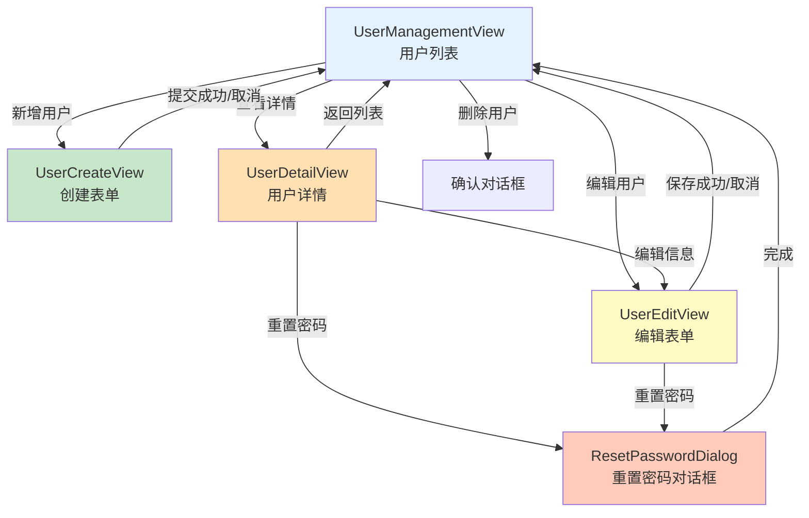

# 用户管理模块 (Users Module) - 客户端

## 模块概述

用户管理模块是凌隐宝堂中医诊所管理系统的核心模块之一，负责用户的创建、编辑、权限管理和状态控制等功能。该模块提供了完整的用户生命周期管理能力。

## 模块位置

```
src/Client/Desktop/Modules/LYBT.Desktop.Users/
├── LYBT.Desktop.Users.csproj
├── UsersModule.cs                      # 模块注册
├── Views/                              # ✅ 已实现
│   ├── UserManagementView.xaml         # 用户列表视图
│   ├── UserCreateView.xaml             # 创建用户表单（Issue #1248）
│   ├── UserEditView.xaml               # 编辑用户表单（Issue #1248）
│   ├── UserDetailView.xaml             # 用户详情视图
│   ├── ChangePasswordDialog.xaml       # 修改密码对话框
│   ├── ResetPasswordDialog.xaml        # 重置密码对话框
│   └── UserProfileDialog.xaml          # 用户资料对话框
├── ViewModels/                         # ✅ 已实现
│   ├── UserManagementViewModel.cs      # 列表管理
│   ├── UserCreateViewModel.cs          # 创建用户
│   ├── UserEditViewModel.cs            # 编辑用户
│   ├── UserDetailViewModel.cs          # 用户详情（Issue #1248 完善）
│   ├── ChangePasswordDialogViewModel.cs
│   ├── ResetPasswordDialogViewModel.cs
│   └── UserProfileDialogViewModel.cs
├── Repositories/                       # ADR-002 架构
│   └── UserRepository.cs               # Repository 模式（无 Service 层）
└── Interfaces/
    └── IUserRepository.cs              # Repository 接口
```

## 核心功能

### 1. 用户管理
- **用户列表**：分页显示所有用户，支持搜索和筛选
- **创建用户**：新建用户账号，设置角色和权限
- **编辑用户**：修改用户基本信息和角色
- **用户详情**：查看用户完整信息和操作历史
- **状态管理**：启用/禁用用户账号

### 2. 权限控制
- **角色分配**：Admin（管理员）、Doctor（医生）
- **权限验证**：基于角色的访问控制
- **超级管理员保护**：防止创建与超级管理员相同的用户名

### 3. 密码管理
- **密码重置**：管理员可重置用户密码
- **默认密码**：新用户使用系统配置的默认密码
- **首次登录**：提示用户修改默认密码

## Repository 模式实现（ADR-002 架构）

### UserRepository
```csharp
public class UserRepository : BaseApiRepository, IUserRepository
{
    // ✅ 返回裸类型（无 ServiceResult 包装）
    // ✅ 异常向上抛出，由 ViewModel 统一处理

    // 获取用户列表（分页）
    Task<PagedResult<UserDto>> GetPagedAsync(UserQueryDto query);

    // 根据 ID 获取用户
    Task<UserDto?> GetByIdAsync(Guid id);

    // 创建新用户
    Task<UserDto> CreateAsync(UserCreateDto dto);

    // 更新用户信息
    Task<UserDto> UpdateAsync(Guid id, UserUpdateDto dto);

    // 删除用户
    Task<bool> DeleteAsync(Guid id);
}
```

**架构说明**（根据 ADR-002）：
- ✅ **无 Service 层**：Desktop 端移除 Service 层，ViewModel 直接调用 Repository
- ✅ **Repository 返回裸类型**：不使用 `ServiceResult<T>` 包装，异常向上传递
- ✅ **异常处理在 ViewModel**：`UnifiedViewModelBase` 统一处理异常并显示用户友好消息

## 视图导航架构



**导航流程**：
1. **UserManagementView**（主列表）→ 新增/编辑/详情/删除
2. **UserCreateView**（创建表单）→ 提交成功后返回列表并刷新
3. **UserEditView**（编辑表单）→ 保存成功后返回列表并刷新
4. **UserDetailView**（用户详情）→ 可跳转到编辑页面或重置密码对话框
5. **ResetPasswordDialog**（重置密码）→ Prism Dialog Service

## 视图模型架构

### UserManagementViewModel
主列表视图模型，负责：
- 用户列表的加载和刷新
- 搜索和筛选逻辑
- 导航到创建/编辑/详情页面
- 快速操作（状态切换、密码重置）

### UserCreateViewModel
创建视图模型，负责：
- 初始化新用户表单
- 用户名唯一性验证
- 保留用户名检查
- 密码强度验证
- 创建用户并设置默认密码

### UserEditViewModel
编辑视图模型，负责：
- 加载现有用户数据
- 验证输入数据（真实姓名、手机号、邮箱格式）
- 保存更改
- 角色权限修改
- 重置密码功能触发

### UserDetailViewModel（Issue #1248 完整实现）
用户详情视图模型，负责：
- **数据加载**：使用 Issue #1240 异步导航模式
  - `ProcessNavigationParameters()`：同步处理 UserId 参数
  - `InitializeAsync()`：异步调用 `LoadUserAsync()` 加载数据
- **导航功能**：
  - `GoBackCommand`：返回用户列表（UserManagementView）
  - `EditUserCommand`：跳转编辑页面（UserEditView）
  - `ResetPasswordCommand`：打开重置密码对话框
- **依赖注入**：`IUserRepository`、`IEventAggregator`、`ILogger`、`IRegionManager`

## 数据流（ADR-002 架构）

```
View (XAML)
    ↓ 数据绑定
ViewModel
    ↓ 直接调用
UserRepository
    ↓ HTTP 请求
BaseApiRepository (Refit)
    ↓ API 调用
WebAPI (/api/v1/users)
```

**架构特点**（根据 ADR-002）：
- ✅ **三层 MVVM**：View → ViewModel → Repository
- ✅ **移除 Service 层**：Desktop 端不再使用 Service 层，简化架构
- ✅ **异常处理**：Repository 不捕获异常，由 `UnifiedViewModelBase` 统一处理
- ✅ **Refit 客户端**：`BaseApiRepository` 封装 Refit HTTP 客户端

## 安全特性

### 1. 超级管理员隔离
- 超级管理员不在Users表中显示
- 用户名从配置文件读取，不存储在数据库
- 创建用户时自动检查保留用户名

### 2. 保留用户名列表
```csharp
private static readonly HashSet<string> ReservedUsernames = new()
{
    "admin", "administrator", "root",
    "system", "superadmin", "sysadmin"
};
```

### 3. 权限验证
- 只有Admin角色可以访问用户管理模块
- 操作前验证当前用户权限
- 敏感操作需要二次确认

## 事件通信

### 发布的事件
- `UserCreatedEvent` - 用户创建成功
- `UserUpdatedEvent` - 用户信息更新
- `UserDeletedEvent` - 用户删除
- `UserStatusChangedEvent` - 用户状态变更

### 订阅的事件
- `RefreshUsersEvent` - 刷新用户列表
- `NavigateToUserDetailEvent` - 导航到用户详情

## UI 特性

### 1. 响应式设计
- 自适应列表布局
- 可调整列宽
- 支持键盘快捷键

### 2. 数据验证
- 实时输入验证
- 错误提示显示
- 必填字段标识

### 3. 用户体验
- 加载状态指示器
- 操作成功/失败提示
- 批量操作支持

## 配置项

```json
{
  "Lybt": {
    "Users": {
      "DefaultPassword": "123456",
      "PasswordExpiryDays": 90,
      "MaxLoginAttempts": 5,
      "EnableUserCache": true,
      "CacheDurationMinutes": 30
    }
  }
}
```

## 依赖关系

### 内部依赖
- `LYBT.Desktop.Core` - 基础框架
- `LYBT.Desktop.Infrastructure` - 基础设施（含 BaseApiRepository）

### 外部依赖
- `LYBT.Shared.Models` - 数据契约
- `LYBT.Shared.Interfaces` - 服务接口

## 性能优化

### 1. 缓存策略
- 用户列表缓存30分钟
- 角色权限缓存
- 增量更新机制

### 2. 延迟加载
- 按需加载用户详情
- 虚拟化列表滚动
- 分页数据获取

## 错误处理

### 1. 网络错误
- 自动重试机制
- 离线状态提示
- 本地缓存回退

### 2. 业务错误
- 用户名重复检查
- 保留用户名验证
- 权限不足提示

## 测试覆盖

### 单元测试
- UserRepository 方法测试
- ViewModel 逻辑测试
- 数据验证测试
- 命令执行测试（Issue #1248）

### 集成测试
- API 调用测试
- 权限验证测试
- 事件通信测试

## 未来增强

1. **批量导入**：支持从Excel批量导入用户
2. **审计日志**：记录所有用户操作
3. **双因素认证**：增强账户安全性
4. **密码策略**：复杂度要求和历史记录
5. **在线状态**：显示用户在线/离线状态

## 相关文档

- [服务端用户模块](../server/users-module.md)
- [认证模块](./auth-module.md)
- [权限系统设计](../../security/rbac.md)
- [API 文档](../../../api/users-api.md)