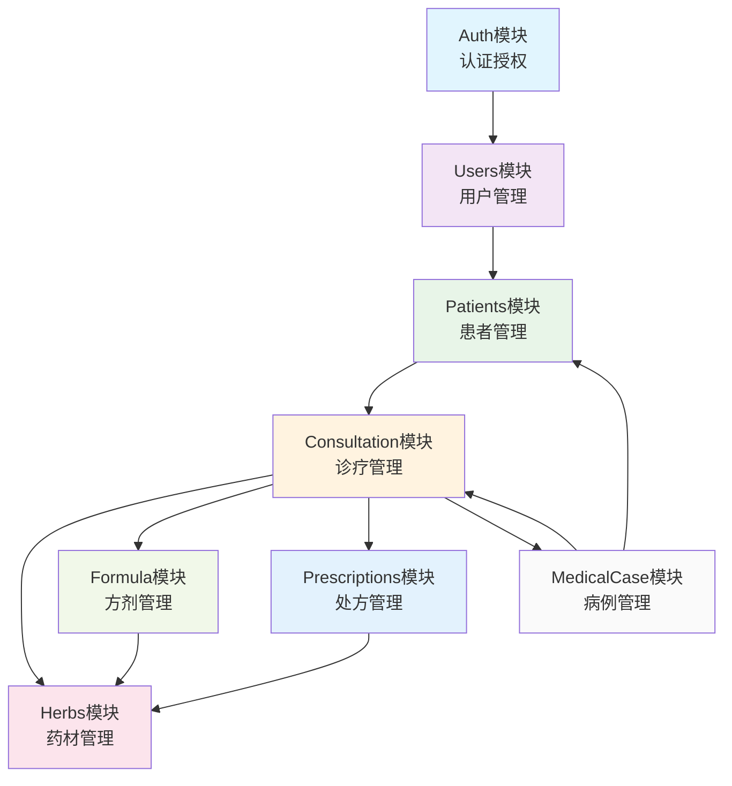
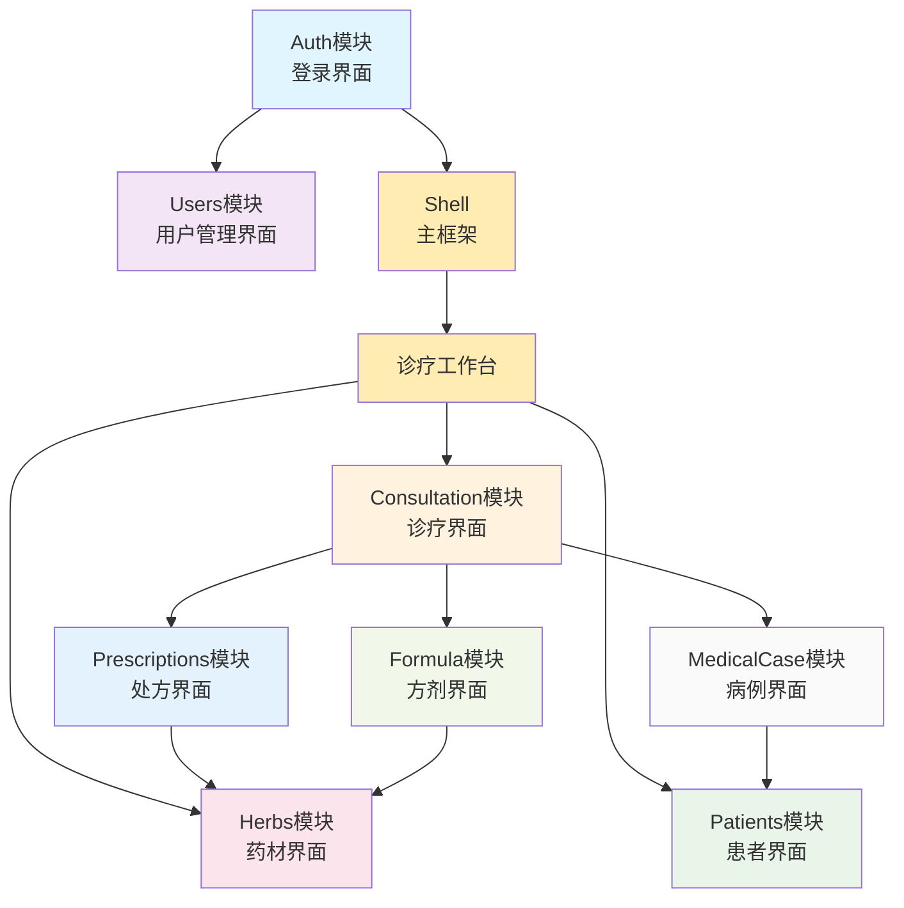
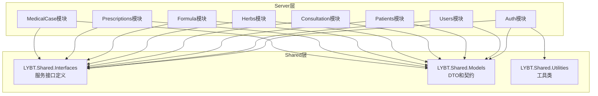
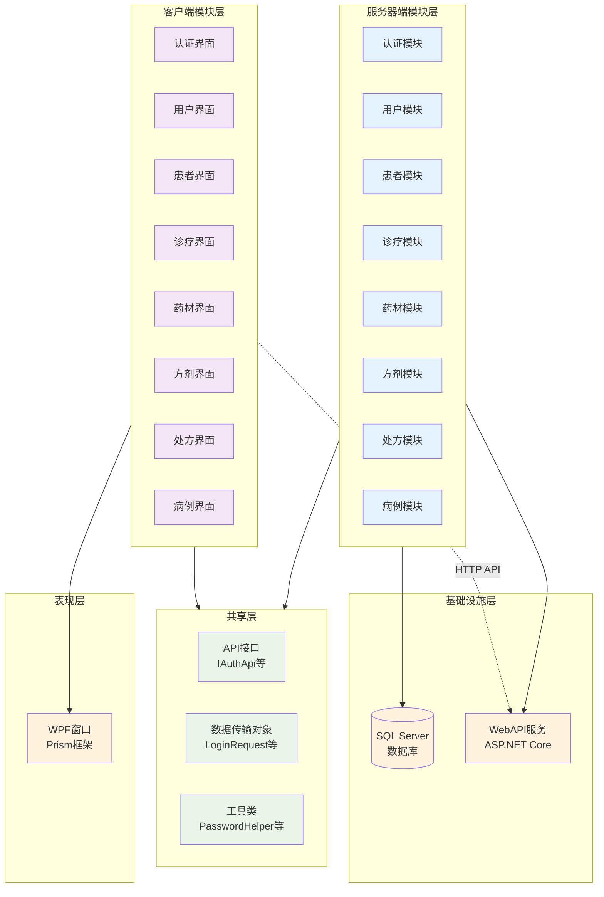

# 模块依赖关系图与架构总结

## 📋 文档概述

本文档总结了LYBT中医诊所管理系统的完整模块架构，包括依赖关系分析、技术总结和未来规划。

## 🏗️ 模块依赖关系图

### 1. Server端模块依赖关系



### 2. Client端模块依赖关系



### 3. Server-Shared依赖关系



### 4. Client-Shared依赖关系


### 5. 整体架构依赖图



## 🔍 依赖分析

### 核心依赖关系

#### Server端依赖层次
1. **基础层**: Auth → Users（认证是用户管理的基础）
2. **业务层**: Users → Patients → Consultation（业务流程依赖）
3. **功能层**: Consultation → {Herbs, Formula, Prescriptions, MedicalCase}（诊疗驱动功能）
4. **支撑层**: Prescriptions → Herbs, Formula → Herbs（药材支撑处方和方剂）

#### Client端依赖层次
1. **认证层**: Auth → Shell（登录后进入主界面）
2. **工作台层**: Shell → 诊疗工作台（业务入口）
3. **业务层**: 诊疗工作台 → 各业务模块（业务导航）
4. **数据层**: 各模块 → Shared（数据契约）

### 循环依赖检查

✅ **无直接循环依赖**
- Server端模块间无循环依赖
- Client端模块间无循环依赖
- 所有模块对Shared层均为单向依赖

⚠️ **潜在间接循环**
- Consultation ↔ MedicalCase（通过业务逻辑）
- Prescriptions ↔ Formula（通过Herbs中介）

### 解耦度分析

#### 高度耦合区域
- **Consultation模块**: 作为核心业务模块，与多个模块有依赖关系
- **Herbs模块**: 被Prescriptions和Formula模块依赖

#### 低耦合区域
- **Auth模块**: 相对独立，仅被其他模块依赖
- **Users模块**: 基础模块，依赖关系清晰

## 📈 架构总结

### UltraThink双层架构应用

#### 在Server端的体现
```
Controller层 → BusinessService层 → QueryService层 → Repository层
     ↓              ↓                  ↓              ↓
   API入口        业务逻辑           查询专业化        数据访问
```

#### 在Client端的体现
```
View层 → ViewModel层 → Service层 → API层
  ↓         ↓          ↓         ↓
 界面      业务逻辑     服务代理   远程调用
```

### MVVM模式统一实现

#### 客户端架构特点
- **基类统一**: 所有ViewModel继承自`ModernViewModelBase`或`NavigationViewModelBase`
- **依赖注入**: 通过Prism.DryIoc实现服务解耦
- **命令模式**: 统一使用RelayCommand进行用户交互
- **数据绑定**: 双向绑定和属性变更通知

### API契约统一设计

#### Shared层契约体系
- **接口定义**: `LYBT.Shared.Interfaces`统一定义API和服务接口
- **数据模型**: `LYBT.Shared.Models`提供DTO和业务模型
- **工具支撑**: `LYBT.Shared.Utilities`提供跨层工具方法

## ⚠️ 技术债务和改进建议

### 当前发现的问题

#### 1. 架构重构中的模块
- **Herbs模块（Client端）**: ViewModels简化中，需要重新实现业务逻辑
- **MedicalCase模块（Client端）**: 架构重构导致部分功能待恢复
- **Users模块（Client端）**: 模块注册不完整

#### 2. 服务职责重叠
- **Patients模块**: Service职责重叠问题
- **Auth模块**: LoginViewModel需要重构

#### 3. 缺失功能
- **所有模块**: 缺少完整的单元测试覆盖
- **Client端**: 部分界面和高级功能未实现
- **Server端**: 健康检查和监控功能简化

### 改进建议（按优先级）

#### P0 - 立即修复
1. **完成架构重构**: 恢复Herbs和MedicalCase模块的完整功能
2. **修复模块注册**: 确保所有ViewModels和Services正确注册到DI容器
3. **统一错误处理**: 实现Client端统一的异常处理机制

#### P1 - 短期改进
1. **补齐单元测试**: 为核心业务逻辑添加测试覆盖
2. **完善UI功能**: 实现缺失的界面和用户交互
3. **优化性能**: 解决N+1查询问题，优化大数据场景

#### P2 - 中期规划
1. **引入缓存机制**: 优化频繁查询的性能
2. **实现离线支持**: 支持网络断开时的基本功能
3. **添加高级功能**: 数据导出、报表、高级搜索等

## 📚 模块文档索引

### Server端模块文档
- [Auth模块设计](./server/auth-module.md) - 认证授权和JWT令牌管理
- [Users模块设计](./server/users-module.md) - 用户管理和权限控制
- [Patients模块设计](./server/patients-module.md) - 患者档案和医疗记录
- [Herbs模块设计](./server/herbs-module.md) - 中药材库存管理
- [Consultation模块设计](./server/consultation-module.md) - 中医诊疗核心业务
- [Formula模块设计](./server/formula-module.md) - 中医方剂管理
- [Prescriptions模块设计](./server/prescriptions-module.md) - 处方开具和管理
- [MedicalCase模块设计](./server/medicalcase-module.md) - 病例记录管理

### Client端模块文档
- [Auth模块设计](./client/auth-module.md) - 登录界面和会话管理
- [Users模块设计](./client/users-module.md) - 用户管理界面
- [Patients模块设计](./client/patients-module.md) - 患者管理界面，包含Excel导入
- [Herbs模块设计](./client/herbs-module.md) - 药材管理界面
- [Consultation模块设计](./client/consultation-module.md) - 诊疗工作台界面
- [Formula模块设计](./client/formula-module.md) - 方剂管理界面
- [Prescriptions模块设计](./client/prescriptions-module.md) - 处方开具界面
- [MedicalCase模块设计](./client/medicalcase-module.md) - 病例管理界面

### 共享层文档
- [Shared层设计](./shared-layer.md) - 跨层契约、DTO体系和工具集

### 导航指南

#### 按业务流程浏览
1. **用户认证流程**: Auth(Server) → Auth(Client) → Users模块
2. **患者管理流程**: Patients(Server) → Patients(Client)
3. **诊疗业务流程**: Consultation → Formula/Prescriptions → Herbs
4. **病例管理流程**: MedicalCase → Patients → Consultation

#### 按技术关注点浏览
1. **API设计**: 查看Server端模块的API接口设计章节
2. **界面设计**: 查看Client端模块的Views界面设计章节
3. **数据模型**: 查看Shared层的DTO体系设计
4. **安全机制**: 查看Auth模块和Shared层的安全工具

## 🚀 未来扩展规划

### 模块扩展方向

#### 新业务模块
- **财务模块**: 收费、结算、财务报表
- **库存模块**: 药材采购、库存预警、供应商管理
- **预约模块**: 患者预约、日程管理、提醒通知

#### 技术能力增强
- **报表模块**: 业务数据分析和可视化
- **集成模块**: 与外部系统的数据交换
- **移动端**: 基于现有Shared层的移动应用

### 架构演进路径

#### 阶段1: 稳定现有架构（1-2个月）
- 完成所有技术债务修复
- 实现完整的测试覆盖
- 优化性能和用户体验

#### 阶段2: 功能完善（3-6个月）
- 实现所有规划的高级功能
- 添加离线支持和缓存机制
- 完善错误处理和日志记录

#### 阶段3: 扩展增强（6-12个月）
- 引入新的业务模块
- 实现移动端支持
- 集成外部系统

---

## 📝 总结

LYBT中医诊所管理系统采用了清晰的模块化架构，通过UltraThink双层架构实现了良好的分层和解耦。Shared层作为契约中心，确保了前后端的一致性和类型安全。

当前系统的核心架构稳定，主要的技术债务集中在部分模块的重构恢复上。通过逐步修复和功能完善，系统将能够很好地满足中小型中医诊所的业务需求。

模块化设计为未来的功能扩展和技术演进奠定了良好的基础，可以支持系统的持续发展和业务增长。