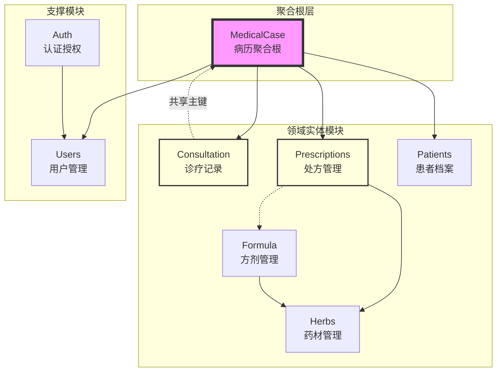
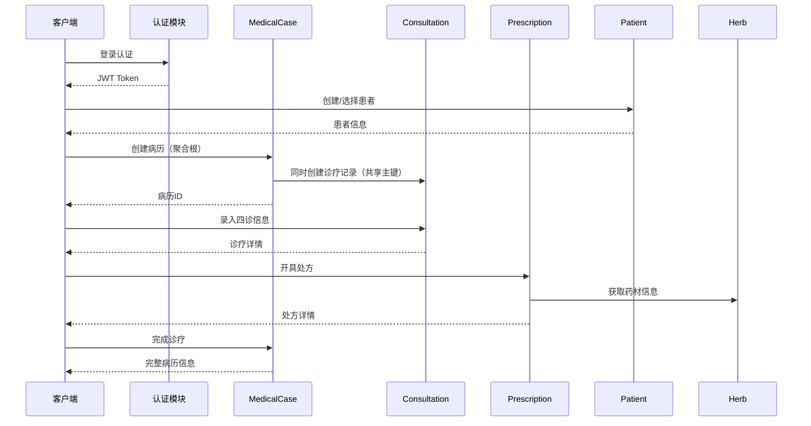

# 模块依赖关系图

> 更新时间：2025-01-02
> 说明：本文档描述系统各模块之间的依赖关系

## 一、模块依赖关系总览



## 二、依赖关系详细说明

### 2.1 MedicalCase（聚合根）

**依赖模块**：
- `Patient`：通过PatientId关联患者信息
- `User`：通过DoctorId关联医生信息
- `Consultation`：1:1关系，共享主键
- `Prescription`：1:0..1关系，可选关联

**被依赖**：作为聚合根，是整个诊疗流程的核心

### 2.2 Consultation（诊疗记录）

**特殊设计**：与MedicalCase共享主键（Id相同）
- 不需要单独存储PatientId和UserId
- 通过MedicalCase导航属性获取相关信息
- 确保了1:1关系的强一致性

### 2.3 Prescription（处方）

**依赖模块**：
- `MedicalCase`：通过MedicalCaseId关联
- `Herb`：处方明细中的药材信息
- `Formula`：可选，方剂模板导入

**关键特性**：
- PatientId和UserId为冗余字段（可通过MedicalCase获取）
- 包含打印管理功能（PrintVersion、PrintCount等）

### 2.4 Patient（患者档案）

**依赖模块**：无直接依赖

**被依赖**：
- `MedicalCase`：病历需要患者信息
- 所有诊疗相关模块间接依赖

**敏感数据保护**（Epic 05-P0-03）：
- IdNumber：身份证号加密
- PhoneNumber：手机号加密
- Address：地址信息加密
- AllergyHistory：过敏史加密

### 2.5 Herbs（药材管理）

**依赖模块**：无直接依赖

**被依赖**：
- `Prescription`：处方项目引用药材
- `Formula`：方剂组成引用药材

### 2.6 Formula（方剂管理）

**依赖模块**：
- `Herb`：方剂组成需要药材信息

**被依赖**：
- `Prescription`：方剂模板导入功能

### 2.7 Auth（认证授权）

**依赖模块**：
- `User`：认证需要用户信息

**提供服务**：
- JWT令牌生成与验证
- RefreshToken管理
- 权限验证

### 2.8 Users（用户管理）

**依赖模块**：无直接依赖

**被依赖**：
- `Auth`：认证服务
- `MedicalCase`：医生信息
- 所有需要操作员信息的模块

## 三、数据流向



## 四、模块间通信方式

### 4.1 服务层调用
- 通过接口依赖注入
- 使用`IServiceCollection`注册服务
- 避免模块间直接引用实现类

### 4.2 数据共享
- 通过共享的DTO模型（在`LYBT.Shared.Models`中）
- 使用统一的枚举定义
- 实体间通过外键或导航属性关联

### 4.3 事件通知（计划中）
- 领域事件（未实现）
- 集成事件（未实现）

## 五、依赖注入配置

每个模块都有独立的模块类负责服务注册：

```csharp
// 示例：PatientsModule.cs
public class PatientsModule : IModule
{
    public void ConfigureServices(IServiceCollection services)
    {
        // 注册服务
        services.AddScoped<IPatientService, PatientService>();
        services.AddScoped<IPatientRepository, PatientRepository>();

        // 注册AutoMapper配置
        services.AddAutoMapper(typeof(PatientMappingProfile));
    }
}
```

## 六、注意事项

### 6.1 循环依赖预防
- 模块间只允许单向依赖
- 通过聚合根（MedicalCase）协调复杂交互
- 使用接口而非具体实现

### 6.2 性能考虑
- 使用Include预加载避免N+1查询
- 合理使用投影（Select）减少数据传输
- 缓存策略应用于热点数据

### 6.3 事务边界
- 以聚合根为事务边界
- 跨模块操作通过服务协调
- 使用工作单元模式保证一致性

## 七、未来改进方向

1. **事件驱动**：引入领域事件解耦模块间通信
2. **CQRS分离**：复杂查询场景的读写分离（当前已禁止）
3. **模块独立部署**：支持模块级别的独立升级（微服务化已禁止）
4. **接口版本管理**：支持多版本API共存（内部系统不需要）

---

**维护说明**：本文档应在模块结构发生变化时及时更新。