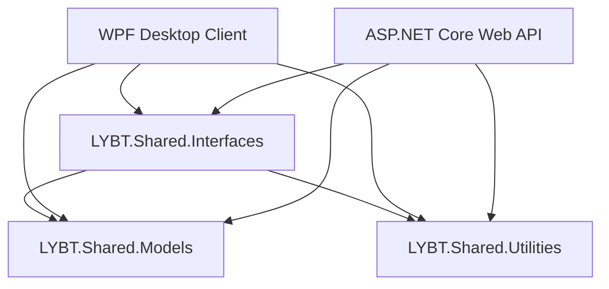
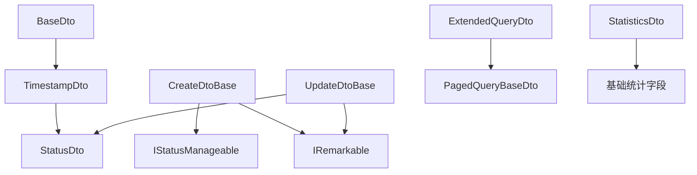
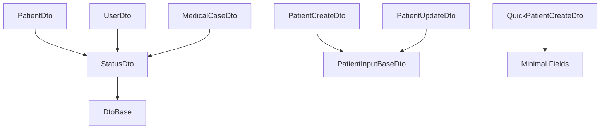
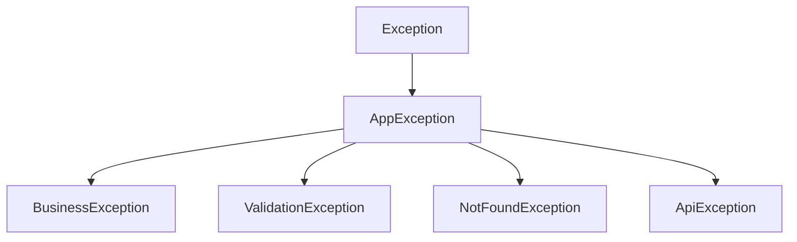

# Shared层设计文档

## 文档信息

- **文档版本**: 1.1.0
- **创建日期**: 2025-09-27
- **最后更新**: 2025-09-28
- **维护人员**: LYBT开发团队
- **文档状态**: 当前有效

## 1. Shared层概述

### 1.1 定位与目标

LYBT中医诊所系统的Shared层是前后端之间的统一契约层，负责定义所有跨层共享的接口、数据模型、工具类和常量。它确保前端WPF客户端与后端Web API之间的类型安全和契约一致性。

### 1.2 组件结构

```
src/Shared/
├── LYBT.Shared.Interfaces/    # API接口和服务接口
├── LYBT.Shared.Models/        # 数据模型、DTO、枚举、异常
└── LYBT.Shared.Utilities/     # 配置助手、扩展方法、安全工具
```

### 1.3 设计原则

1. **契约一致性**: 确保前后端使用相同的数据结构和接口定义
2. **类型安全**: 强类型约束，减少运行时错误
3. **版本兼容**: 支持渐进式升级和向后兼容
4. **简洁实用**: 避免过度设计，专注业务需求
5. **文档驱动**: 所有公共API都有完整的XML注释

## 2. 架构设计与原则

### 2.1 分层职责



- **LYBT.Shared.Interfaces**: 定义API客户端接口和服务接口
- **LYBT.Shared.Models**: 提供数据传输对象、枚举和异常类型
- **LYBT.Shared.Utilities**: 提供通用工具类和扩展方法

### 2.2 依赖关系

```
LYBT.Shared.Interfaces → LYBT.Shared.Models
LYBT.Shared.Utilities → LYBT.Shared.Models
```

- Interfaces层依赖Models层获取DTO定义
- Utilities层依赖Models层获取异常和常量定义
- Models层无外部依赖，保持纯净

### 2.3 技术约束

1. **目标框架**: .NET 8.0
2. **语言版本**: C# 12.0
3. **可空引用**: 启用 (Nullable enable)
4. **序列化**: System.Text.Json (统一JSON序列化)
5. **验证**: System.ComponentModel.Annotations (数据注解验证)

## 3. LYBT.Shared.Interfaces详细设计

### 3.1 组件概述

负责定义所有API客户端接口和服务接口，支持Refit类型安全的REST客户端调用。

### 3.2 项目配置

```xml
<PackageReference Include="Refit" />
<PackageReference Include="System.ComponentModel.Annotations" />
<ProjectReference Include="..\LYBT.Shared.Models\LYBT.Shared.Models.csproj" />
```

### 3.3 接口分类

#### 3.3.1 API客户端接口 (Api/)

**IAuthApi.cs** - 身份认证API客户端
```csharp
[Description("身份认证API客户端 - JWT认证、会话管理、安全操作")]
public interface IAuthApi
{
    [Refit.Post("/api/v1/auth/login")]
    Task<ApiResponse<LoginResponse>> LoginAsync([Refit.Body] LoginRequest loginRequest);
    
    [Refit.Post("/api/v1/auth/logout")]
    Task<ApiResponse<object>> LogoutAsync();
    
    [Refit.Get("/api/v1/auth/current-user")]
    Task<ApiResponse<UserDto>> GetCurrentUserAsync();
    
    [Refit.Post("/api/v1/auth/refresh-token")]
    Task<ApiResponse<LoginResponse>> RefreshTokenAsync();
}
```

**IPatientApi.cs** - 患者管理API客户端
```csharp
public interface IPatientApi
{
    [Refit.Get("/api/v1/patients")]
    Task<Refit.ApiResponse<PagedResult<PatientDto>>> GetPatientsAsync(
        [Refit.Query] int pageIndex = 1,
        [Refit.Query] int pageSize = 20,
        [Refit.Query] string? searchTerm = null);
    
    [Refit.Get("/api/v1/patients/{id}")]
    Task<Refit.ApiResponse<PatientDto>> GetPatientByIdAsync(Guid id);
}
```

**其他API接口**:
- IUserApi.cs - 用户管理API
- IMedicalCaseApi.cs - 医案管理API
- IConsultationApi.cs - 诊疗记录API
- IPrescriptionApi.cs - 处方管理API
- IHerbApi.cs - 药材管理API
- IFormulaApi.cs - 验方管理API

#### 3.3.2 服务接口 (Services/)

**IQueryService.cs** - CQRS查询服务基接口
```csharp
public interface IQueryService<TDto> where TDto : class
{
    Task<ServiceResult<TDto>> GetByIdAsync(Guid id);
    Task<ServiceResult<List<TDto>>> GetAllAsync();
    Task<ServiceResult<PagedResult<TDto>>> GetPagedAsync(PagedQueryBaseDto query);
    Task<ServiceResult<List<TDto>>> SearchAsync(string keyword);
}
```

**ICommandService.cs** - CQRS命令服务基接口
```csharp
public interface ICommandService<TDto, TCreateDto, TUpdateDto>
    where TDto : class
    where TCreateDto : class
    where TUpdateDto : class
{
    Task<ServiceResult<TDto>> CreateAsync(TCreateDto dto);
    Task<ServiceResult<TDto>> UpdateAsync(Guid id, TUpdateDto dto);
    Task<ServiceResult<bool>> DeleteAsync(Guid id);
    Task<ServiceResult<bool>> DeleteBatchAsync(List<Guid> ids);
}
```

**业务服务接口**:
- IAuthService.cs - 身份认证服务
- IPatientService.cs - 患者管理服务
- IUserService.cs - 用户管理服务
- IMedicalCaseService.cs - 医案管理服务
- 其他业务服务接口

### 3.4 设计特性

1. **Refit集成**: 所有API接口使用Refit特性标注，支持类型安全的HTTP调用
2. **XML文档**: 完整的XML注释，包含功能说明、参数说明和示例
3. **统一响应**: 所有API返回统一的ApiResponse<T>格式
4. **异步支持**: 所有接口方法都是异步的，返回Task<T>
5. **CQRS模式**: 查询和命令接口分离，遵循CQRS设计模式

## 4. LYBT.Shared.Models详细设计

### 4.1 组件概述

包含所有数据传输对象、枚举、异常类型和验证模型，是前后端数据交换的核心契约。

### 4.2 项目配置

```xml
<PackageReference Include="System.ComponentModel.Annotations" />
<PackageReference Include="System.Text.Json" />
<PackageReference Include="Microsoft.Extensions.Logging.Abstractions" />
```

### 4.3 目录结构详解

```
LYBT.Shared.Models/
├── Common/              # 通用模型
│   ├── BatchIdsDto.cs
│   ├── EnumItem.cs
│   └── NullableEnumItem.cs
├── Constants/           # 常量定义
│   ├── ErrorMessageKeys.cs
│   └── ValidationConstants.cs
├── Contracts/           # 数据传输对象
│   ├── Auth/           # 认证相关DTO
│   ├── Common/         # 通用响应模型
│   ├── Consultation/   # 诊疗相关DTO
│   ├── Formula/        # 验方相关DTO
│   ├── Herbs/          # 药材相关DTO
│   ├── MedicalCase/    # 医案相关DTO
│   ├── Patients/       # 患者相关DTO
│   ├── Prescriptions/  # 处方相关DTO
│   └── Users/          # 用户相关DTO
├── Core/               # 核心模型
│   └── BaseAuthSession.cs
├── Enums/              # 枚举定义
│   ├── AuthEnums.cs
│   ├── Gender.cs
│   ├── MedicalCaseEnums.cs
│   ├── PatientStatus.cs
│   ├── PrescriptionStatus.cs
│   ├── RecordEnums.cs
│   └── SystemEnums.cs
├── Exceptions/         # 异常类型
│   ├── ApiException.cs
│   ├── AppException.cs
│   ├── BusinessException.cs
│   ├── ExceptionFactory.cs
│   ├── NotFoundException.cs
│   └── ValidationException.cs
└── Extensions/         # 扩展方法
    └── EnumExtensions.cs
```

### 4.4 核心响应模型

#### 4.4.1 ApiResponse<T> - 统一API响应格式

```csharp
public class ApiResponse<T>
{
    [JsonPropertyName("success")]
    public bool Success { get; set; }
    
    [JsonPropertyName("message")]
    public string Message { get; set; } = string.Empty;
    
    [JsonPropertyName("data")]
    public T? Data { get; set; }
    
    [JsonPropertyName("errors")]
    public object? Errors { get; set; }
    
    [JsonPropertyName("timestamp")]
    public long Timestamp { get; set; } = DateTimeOffset.UtcNow.ToUnixTimeSeconds();
    
    [JsonPropertyName("requestId")]
    public string RequestId { get; set; } = string.Empty;
    
    public static ApiResponse<T> CreateSuccess(T? data = default, string message = "操作成功")
    public static ApiResponse<T> CreateFail(string message = "操作失败", object? errors = null)
}
```

#### 4.4.2 ServiceResult<T> - 服务层响应格式

```csharp
public class ServiceResult<T>
{
    public bool IsSuccess { get; set; }
    public T? Data { get; set; }
    public string? ErrorMessage { get; set; }
    public Exception? Exception { get; set; }
    public string? Message => ErrorMessage;
    
    public static ServiceResult<T> Success(T data)
    public static ServiceResult<T> Failure(string errorMessage, Exception? exception = null)
}
```

#### 4.4.3 PagedResult<T> - 分页响应格式

```csharp
public class PagedResult<T>
{
    [JsonPropertyName("items")]
    public List<T> Items { get; set; } = new List<T>();
    
    [JsonPropertyName("totalCount")]
    public int TotalCount { get; set; }
    
    [JsonPropertyName("currentPage")]
    public int CurrentPage { get; set; }
    
    [JsonPropertyName("pageSize")]
    public int PageSize { get; set; }
    
    [JsonPropertyName("totalPages")]
    public int TotalPages => TotalCount > 0 ? (int)Math.Ceiling((double)TotalCount / PageSize) : 1;
    
    [JsonPropertyName("hasPreviousPage")]
    public bool HasPreviousPage => CurrentPage > 1;
    
    [JsonPropertyName("hasNextPage")]
    public bool HasNextPage => CurrentPage < TotalPages;
}
```

### 4.5 DTO设计模式与继承体系

#### 4.5.1 DTO 继承体系架构

基于模块化双层架构优化，Shared层实现了简化的 DTO 继承体系：



**核心基础类**：
- **BaseDto**: 最小化基础类，仅包含 Guid 类型的 Id 字段
- **TimestampDto**: 继承 BaseDto，添加审计时间字段（CreateTime, UpdateTime）
- **StatusDto**: 继承 TimestampDto，添加状态管理字段（Status, IsEnabled 计算属性）

**CRUD 操作基类**：
- **CreateDtoBase**: 创建操作基类，不包含ID（由系统生成），实现状态和备注接口
- **UpdateDtoBase**: 更新操作基类，继承 StatusDto，添加备注支持

**查询和统计基类**：
- **ExtendedQueryDto**: 扩展查询基类，在分页基础上添加常用查询字段
- **StatisticsDto**: 统计基类，提供通用统计字段和状态统计

#### 4.5.2 DTO 命名约定

所有DTO遵循以下命名约定：
- **XxxDto**: 查询/显示用DTO，包含完整信息，继承 StatusDto
- **XxxCreateDto**: 创建操作用DTO，继承 CreateDtoBase
- **XxxUpdateDto**: 更新操作用DTO，继承 UpdateDtoBase
- **QuickXxxCreateDto**: 快速创建用DTO，包含最少必要字段

#### 4.5.2 患者DTO示例

```csharp
// 查询显示用DTO
public class PatientDto : StatusDto
{
    public string Name { get; set; } = string.Empty;
    public Gender Gender { get; set; }
    public DateTime? BirthDate { get; set; }
    public int Age { get; } // 计算属性
    public string? IdNumber { get; set; }
    public string? PhoneNumber { get; set; }
    // ... 其他属性
}

// 输入基础DTO
public abstract class PatientInputBaseDto
{
    [Required(ErrorMessage = "患者姓名不能为空")]
    [StringLength(50, ErrorMessage = "患者姓名长度不能超过{1}个字符")]
    public string Name { get; set; } = string.Empty;
    
    public Gender Gender { get; set; } = Gender.Unknown;
    // ... 其他属性和验证
}

// 创建DTO
public class PatientCreateDto : PatientInputBaseDto { }

// 更新DTO
public class PatientUpdateDto : PatientInputBaseDto, IIdentifiable<Guid>
{
    [Required(ErrorMessage = "患者ID不能为空")]
    public Guid Id { get; set; }
}

// 快速创建DTO
public class QuickPatientCreateDto
{
    [Required(ErrorMessage = "患者姓名不能为空")]
    public string Name { get; set; } = string.Empty;
    
    public Gender Gender { get; set; } = Gender.Unknown;
    
    [Range(0, 150, ErrorMessage = "年龄必须在{1}-{2}之间")]
    public int Age { get; set; }
    
    public string? PhoneNumber { get; set; }
    public string? ChiefComplaint { get; set; }
}
```

### 4.6 验证特性

1. **Data Annotations**: 使用标准验证特性
2. **自定义验证**: 支持复杂业务规则验证
3. **国际化准备**: 错误消息使用常量定义
4. **级联验证**: 支持嵌套对象验证

## 5. LYBT.Shared.Utilities详细设计

### 5.1 组件概述

提供配置管理、安全工具、扩展方法等通用功能，支持前后端共同使用。

### 5.2 项目配置

```xml
<PackageReference Include="Microsoft.Extensions.Configuration.Abstractions" />
<PackageReference Include="Microsoft.Extensions.Configuration.Binder" />
<PackageReference Include="Microsoft.Extensions.DependencyInjection.Abstractions" />
<PackageReference Include="Microsoft.Extensions.Hosting.Abstractions" />
<PackageReference Include="Microsoft.Extensions.Caching.Memory" />
<PackageReference Include="System.Text.Json" />
<PackageReference Include="System.ComponentModel.Annotations" />
<ProjectReference Include="..\LYBT.Shared.Models\LYBT.Shared.Models.csproj" />
```

### 5.3 功能模块

#### 5.3.1 配置管理 (Configuration/)

**ConfigurationHelper.cs** - 配置管理帮助类
```csharp
public static class ConfigurationHelper
{
    // 泛型配置值获取
    public static T GetValue<T>(IConfiguration configuration, string key, T defaultValue = default!)
    
    // 连接字符串获取（支持环境变量优先）
    public static string GetConnectionString(IConfiguration configuration, string name = "DefaultConnection", string? environmentVariable = "CONNECTION_STRING")
    
    // 必需配置值获取
    public static string GetRequiredValue(IConfiguration configuration, string key)
    
    // 配置节绑定
    public static T? GetSection<T>(IConfiguration configuration, string sectionName) where T : class, new()
    
    // 配置验证
    public static ConfigurationValidationResult ValidateRequiredKeys(IConfiguration configuration, params string[] requiredKeys)
}
```

**EnvironmentHelper.cs** - 环境管理帮助类
```csharp
public static class EnvironmentHelper
{
    public static bool IsDevelopment()
    public static bool IsProduction()
    public static bool IsStaging()
    public static string GetEnvironmentName()
    public static T GetEnvironmentVariable<T>(string key, T defaultValue = default!)
}
```

#### 5.3.2 安全工具 (Security/)

**PasswordHelper.cs** - 密码安全工具类
```csharp
public static partial class PasswordHelper
{
    // PBKDF2密码哈希
    public static string Hash(string password)
    
    // 密码验证
    public static bool Verify(string hash, string password)
    
    // 密码强度检查
    public static PasswordStrength CheckPasswordStrength(string password)
    
    // 密码验证（完整规则）
    public static PasswordValidationResult ValidatePassword(string password, int minLength = 8, bool requireUppercase = true, bool requireLowercase = true, bool requireDigits = true, bool requireSpecialChars = true)
    
    // 安全随机密码生成
    public static string GenerateSecurePassword(int length = 12, bool includeUppercase = true, bool includeLowercase = true, bool includeDigits = true, bool includeSpecialChars = true)
    
    // 弱密码检查
    public static bool IsCommonPassword(string password)
}
```

**RoleHelper.cs** - 角色管理帮助类
```csharp
public static class RoleHelper
{
    public static class Roles
    {
        public const string Admin = "Admin";
        public const string Doctor = "Doctor";
        public static readonly string[] All = { Admin, Doctor };
    }
    
    public static class Policies
    {
        public const string AdminOnly = "AdminPolicy";
        public const string DoctorOnly = "DoctorPolicy";
        public const string DoctorOrAdmin = "DoctorOrAdminPolicy";
    }
    
    // 角色标准化
    public static string NormalizeRole(string? role)
    
    // 角色验证
    public static bool IsValidRole(string? role)
    public static bool IsAdmin(string? role)
    public static bool IsDoctor(string? role)
    
    // 显示名称获取
    public static string GetDisplayName(string? role)
}
```

**ClaimsHelper.cs** - 声明管理帮助类
```csharp
public static class ClaimsHelper
{
    // 标准声明类型
    public static class ClaimTypes
    {
        public const string UserId = "user_id";
        public const string Username = "username";
        public const string Role = "role";
        public const string DisplayName = "display_name";
    }
    
    // 声明创建和解析
    public static Claim CreateUserIdClaim(Guid userId)
    public static Guid? GetUserId(ClaimsPrincipal principal)
    public static string? GetUsername(ClaimsPrincipal principal)
    public static string? GetRole(ClaimsPrincipal principal)
}
```

#### 5.3.3 扩展方法 (Extensions/)

**应用程序初始化扩展**
```csharp
public static class ApplicationInitializationExtensions
{
    public static IApplicationBuilder UseSharedUtilities(this IApplicationBuilder app)
    public static IServiceCollection AddSharedUtilities(this IServiceCollection services)
}
```

**缓存扩展**
```csharp
public static class CacheExtensions
{
    public static IServiceCollection AddMemoryCacheExtensions(this IServiceCollection services)
    public static Task<T> GetOrSetAsync<T>(this IMemoryCache cache, string key, Func<Task<T>> getItem, TimeSpan? expiration = null)
}
```

#### 5.3.4 通用助手 (Helpers/)

**密码策略验证器**
```csharp
public class PasswordPolicyValidator
{
    public class PasswordPolicy
    {
        public int MinLength { get; set; } = 8;
        public bool RequireUppercase { get; set; } = true;
        public bool RequireLowercase { get; set; } = true;
        public bool RequireDigits { get; set; } = true;
        public bool RequireSpecialChars { get; set; } = true;
        public int MaxRepeatingChars { get; set; } = 3;
        public bool CheckCommonPasswords { get; set; } = true;
    }
    
    public PasswordValidationResult Validate(string password, PasswordPolicy? policy = null)
}
```

### 5.4 设计特性

1. **静态工具类**: 大部分工具类设计为静态类，方便调用
2. **配置驱动**: 支持通过配置文件自定义行为
3. **异常安全**: 所有工具方法都有适当的异常处理
4. **性能优化**: 使用正则表达式生成器、缓存等优化性能
5. **安全优先**: 密码处理使用PBKDF2，防止时间攻击

## 6. 数据传输对象（DTO）体系

### 6.1 DTO分层架构



### 6.2 基础DTO类体系（基于实际实现）

#### 6.2.1 BaseDto - 所有DTO的基类

```csharp
/// <summary>
/// 基础DTO抽象类 - 提供Guid类型的ID字段
/// 架构简化：最小化基础类，只包含ID
/// </summary>
public abstract class BaseDto : IIdentifiable<Guid>
{
    /// <summary>唯一标识符</summary>
    [DisplayName("ID")]
    public Guid Id { get; set; }
}
```

#### 6.2.2 TimestampDto - 包含审计时间的DTO基类

```csharp
/// <summary>
/// 时间戳DTO抽象类 - 包含ID和审计时间字段
/// 架构简化：统一审计时间管理
/// </summary>
public abstract class TimestampDto : BaseDto, IAuditable
{
    /// <summary>创建时间</summary>
    [DisplayName("创建时间")]
    public DateTime CreateTime { get; set; } = DateTime.Now;

    /// <summary>更新时间</summary>
    [DisplayName("更新时间")]
    public DateTime? UpdateTime { get; set; }
}
```

#### 6.2.3 StatusDto - 包含状态管理的DTO基类

```csharp
/// <summary>
/// 状态管理DTO抽象类 - 包含ID、时间戳和状态字段
/// 架构简化：合并状态和时间戳管理
/// </summary>
public abstract class StatusDto : TimestampDto, IStatusManageable
{
    /// <summary>状态</summary>
    [DisplayName("状态")]
    public CommonStatus Status { get; set; } = CommonStatus.Enabled;

    /// <summary>是否启用 - 根据Status计算得出</summary>
    [DisplayName("是否启用")]
    public bool IsEnabled => Status == CommonStatus.Enabled;
}
```

#### 6.2.4 CreateDtoBase - 创建操作DTO基类

```csharp
/// <summary>
/// 创建操作DTO基类 - 不包含ID（由系统生成）
/// 架构简化：继承状态管理，添加备注支持
/// </summary>
public abstract class CreateDtoBase : IStatusManageable, IRemarkable
{
    /// <summary>状态</summary>
    [DisplayName("状态")]
    public CommonStatus Status { get; set; } = CommonStatus.Enabled;

    /// <summary>备注</summary>
    [StringLength(500, ErrorMessage = "备注长度不能超过500个字符")]
    [DisplayName("备注")]
    public string? Remark { get; set; }
}
```

#### 6.2.5 UpdateDtoBase - 更新操作DTO基类

```csharp
/// <summary>
/// 更新操作DTO基类 - 包含ID用于标识要更新的实体
/// 架构简化：使用StatusDto，添加备注支持
/// </summary>
public abstract class UpdateDtoBase : StatusDto, IRemarkable
{
    /// <summary>备注</summary>
    [StringLength(500, ErrorMessage = "备注长度不能超过500个字符")]
    [DisplayName("备注")]
    public string? Remark { get; set; }
}
```

#### 6.2.6 ExtendedQueryDto - 扩展查询DTO基类

```csharp
/// <summary>
/// 扩展查询DTO基类 - 在分页基础上添加常用查询字段
/// 架构简化：合并常用查询功能，避免多层继承
/// </summary>
public abstract class ExtendedQueryDto : PagedQueryBaseDto
{
    /// <summary>状态筛选</summary>
    [DisplayName("状态")]
    public CommonStatus? Status { get; set; }

    /// <summary>开始日期</summary>
    [DisplayName("开始日期")]
    public DateTime? StartDate { get; set; }

    /// <summary>结束日期</summary>
    [DisplayName("结束日期")]
    public DateTime? EndDate { get; set; }

    /// <summary>是否包含已禁用项</summary>
    [DisplayName("包含已禁用")]
    public bool IncludeInactive { get; set; } = false;

    /// <summary>拼音码搜索</summary>
    [DisplayName("拼音码")]
    public string? PinYinCode { get; set; }
}
```

#### 6.2.7 StatisticsDto - 统计DTO基类

```csharp
/// <summary>
/// 统计DTO基类 - 提供通用统计字段和状态统计
/// 架构简化：合并基础统计和状态统计功能
/// </summary>
public abstract class StatisticsDto
{
    /// <summary>总数</summary>
    [DisplayName("总数")]
    public int TotalCount { get; set; }

    /// <summary>统计时间</summary>
    [DisplayName("统计时间")]
    public DateTime StatisticsTime { get; set; } = DateTime.Now;

    /// <summary>启用数量</summary>
    [DisplayName("启用数量")]
    public int EnabledCount { get; set; }

    /// <summary>禁用数量</summary>
    [DisplayName("禁用数量")]
    public int DisabledCount { get; set; }

    /// <summary>已删除数量</summary>
    [DisplayName("已删除数量")]
    public int DeletedCount { get; set; }
}
```

### 6.3 领域DTO设计

#### 6.3.1 认证相关DTO

**LoginRequest** - 登录请求
```csharp
public class LoginRequest
{
    [Required(ErrorMessage = "用户名不能为空")]
    [StringLength(32, ErrorMessage = "用户名长度不能超过32个字符")]
    public string Username { get; set; } = string.Empty;
    
    [Required(ErrorMessage = "密码不能为空")]
    public string Password { get; set; } = string.Empty;
    
    public string? ClientIp { get; set; }
    public string? UserAgent { get; set; }
    public string? LoginType { get; set; } = "Password";
    public bool RememberMe { get; set; } = false;
    public string? DeviceId { get; set; }
    public string? DeviceName { get; set; }
}
```

**LoginResponse** - 登录响应
```csharp
public class LoginResponse
{
    public string AccessToken { get; set; } = string.Empty;
    public string RefreshToken { get; set; } = string.Empty;
    public DateTime ExpiresAt { get; set; }
    public UserDto User { get; set; } = new();
    public List<string> Permissions { get; set; } = new();
}
```

#### 6.3.2 患者相关DTO

已在前面章节详细介绍，包括：
- PatientDto（查询显示）
- PatientCreateDto（创建）
- PatientUpdateDto（更新）
- QuickPatientCreateDto（快速创建）

#### 6.3.3 其他业务领域DTO

按照相同模式设计：
- **用户管理**: UserDto, UserCreateDto, UserUpdateDto
- **医案管理**: MedicalCaseDto, MedicalCaseCreateDto, MedicalCaseUpdateDto
- **诊疗记录**: ConsultationDto, ConsultationCreateDto, ConsultationUpdateDto
- **处方管理**: PrescriptionDto, PrescriptionCreateDto, PrescriptionUpdateDto
- **药材管理**: HerbDto, HerbCreateDto, HerbUpdateDto
- **验方管理**: FormulaDto, FormulaCreateDto, FormulaUpdateDto

### 6.4 DTO验证体系

#### 6.4.1 验证特性层次

1. **字段级验证**: Required, StringLength, Range, RegularExpression
2. **对象级验证**: IValidatableObject接口实现
3. **业务规则验证**: 自定义ValidationAttribute
4. **跨字段验证**: Compare特性或自定义逻辑

#### 6.4.2 验证错误处理

```csharp
// 验证失败时抛出ValidationException
public class ValidationException : AppException
{
    public Dictionary<string, string[]> Errors { get; set; }
    public string? FieldName { get; set; }
    
    public void AddError(string fieldName, string errorMessage)
    public bool HasErrors => Errors.Any();
}
```

## 7. 枚举和常量管理

### 7.1 枚举设计原则

1. **JSON序列化**: 所有枚举使用JsonStringEnumConverter
2. **描述特性**: 每个枚举值都有Description特性
3. **兼容性处理**: 使用Obsolete特性标记过时值
4. **值设计**: 使用有意义的数值，预留扩展空间

### 7.2 核心枚举

#### 7.2.1 系统枚举 (SystemEnums.cs)

```csharp
[JsonConverter(typeof(JsonStringEnumConverter))]
public enum CommonStatus
{
    [Description("禁用")] Disabled = 0,
    [Description("启用")] Enabled = 1
}

[JsonConverter(typeof(JsonStringEnumConverter))]
public enum DeleteStatus
{
    [Description("正常")] Normal = 0,
    [Description("已删除")] Deleted = 1
}

[JsonConverter(typeof(JsonStringEnumConverter))]
public enum OperationResult
{
    [Description("失败")] Failed = 0,
    [Description("成功")] Success = 1,
    [Description("错误")] Error = 2,
    [Description("警告")] Warning = 3,
    [Description("权限不足")] Forbidden = 4,
    [Description("未授权")] Unauthorized = 5,
    [Description("已取消")] Cancelled = 6,
    [Description("超时")] Timeout = 7
}

[JsonConverter(typeof(JsonStringEnumConverter))]
public enum DataStatus
{
    [Description("草稿")] Draft = 0,
    [Description("正常")] Normal = 1,
    [Description("锁定")] Locked = 2,
    [Description("归档")] Archived = 3
}

[JsonConverter(typeof(JsonStringEnumConverter))]
public enum AuditStatus
{
    [Description("待审核")] Pending = 0,
    [Description("审核通过")] Approved = 1,
    [Description("审核拒绝")] Rejected = 2
}

[JsonConverter(typeof(JsonStringEnumConverter))]
public enum PaymentStatus
{
    [Description("未支付")] Unpaid = 0,
    [Description("已支付")] Paid = 1,
    [Description("部分支付")] PartialPaid = 2,
    [Description("已退款")] Refunded = 3
}

[JsonConverter(typeof(JsonStringEnumConverter))]
public enum PaymentMethod
{
    [Description("现金")] Cash = 0,
    [Description("银行卡")] BankCard = 1,
    [Description("微信支付")] WeChat = 2,
    [Description("支付宝")] Alipay = 3,
    [Description("医保卡")] MedicalCard = 4
}

[JsonConverter(typeof(JsonStringEnumConverter))]
public enum WorkDay
{
    [Description("周一")] Monday = 1,
    [Description("周二")] Tuesday = 2,
    [Description("周三")] Wednesday = 3,
    [Description("周四")] Thursday = 4,
    [Description("周五")] Friday = 5,
    [Description("周六")] Saturday = 6,
    [Description("周日")] Sunday = 7
}

[JsonConverter(typeof(JsonStringEnumConverter))]
public enum TimeSlot
{
    [Description("上午")] Morning = 0,
    [Description("下午")] Afternoon = 1,
    [Description("晚上")] Evening = 2,
    [Description("全天")] AllDay = 3
}

[JsonConverter(typeof(JsonStringEnumConverter))]
public enum CompatibilityType
{
    [Description("未知")] Unknown = 0,
    [Description("安全")] Safe = 1,
    [Description("注意")] Warning = 2,
    [Description("冲突")] Conflict = 3
}

[JsonConverter(typeof(JsonStringEnumConverter))]
public enum CompatibilitySeverity
{
    [Description("低")] Low = 1,
    [Description("中")] Medium = 2,
    [Description("高")] High = 3
}
```

#### 7.2.2 认证枚举 (AuthEnums.cs)

```csharp
[JsonConverter(typeof(JsonStringEnumConverter))]
public enum UserRole
{
    [Description("管理员")] Admin = 10,
    [Description("医生")] Doctor = 1,

    // 兼容性映射（标记为过时）
    [Description("普通用户")]
    [Obsolete("Use Doctor instead. User role unified to Doctor in role unification.", false)]
    User = 20,

    [Description("药师")]
    [Obsolete("Use Doctor instead. Pharmacist role unified to Doctor in role unification.", false)]
    Pharmacist = 2,

    [Description("前台")]
    [Obsolete("Use Doctor instead. Receptionist role unified to Doctor in role unification.", false)]
    Receptionist = 3,

    [Description("收银员")]
    [Obsolete("Use Doctor instead. Cashier role unified to Doctor in role unification.", false)]
    Cashier = 4,

    [Description("理疗师")]
    [Obsolete("Use Doctor instead. Therapist role unified to Doctor in role unification.", false)]
    Therapist = 5
}

[JsonConverter(typeof(JsonStringEnumConverter))]
public enum AuthSessionStatus
{
    [Description("活跃中")] Active = 0,
    [Description("已过期")] Expired = 1,
    [Description("已登出")] LoggedOut = 2,
    [Description("已撤销")] Revoked = 3,
    [Description("被锁定")] Locked = 4
}

[JsonConverter(typeof(JsonStringEnumConverter))]
public enum SecurityLevel
{
    [Description("低级")] Low = 0,
    [Description("中级")] Medium = 1,
    [Description("高级")] High = 2,
    [Description("严重")] Critical = 3,
    [Description("紧急")] Emergency = 4
}

[JsonConverter(typeof(JsonStringEnumConverter))]
public enum AuthEventType
{
    [Description("登录成功")] LoginSuccess = 0,
    [Description("登录失败")] LoginFailed = 1,
    [Description("登出")] Logout = 2,
    [Description("令牌刷新")] TokenRefresh = 3,
    [Description("密码修改")] PasswordChange = 4,
    [Description("账户锁定")] AccountLocked = 5,
    [Description("异常访问")] SuspiciousAccess = 6,
    [Description("权限拒绝")] PermissionDenied = 7,
    [Description("数据访问")] DataAccess = 8,
    [Description("可疑活动")] SuspiciousActivity = 9,
    [Description("系统错误")] SystemError = 10,
    [Description("密码已修改")] PasswordChanged = 11,
    [Description("安全警报")] SecurityAlert = 12,
    [Description("合规违规")] ComplianceViolation = 13,
    [Description("令牌撤销")] TokenRevoked = 14,
    [Description("账户解锁")] AccountUnlocked = 15,
    [Description("数据修改")] DataModification = 16
}

[JsonConverter(typeof(JsonStringEnumConverter))]
public enum LoginType
{
    [Description("密码登录")] Password = 0,
    [Description("微信登录")] WeChat = 1,
    [Description("短信验证码")] SmsCode = 2,
    [Description("二维码")] QrCode = 3,
    [Description("指纹")] Fingerprint = 4,
    [Description("人脸识别")] FaceRecognition = 5,
    [Description("双因子认证")] TwoFactor = 6
}
```

#### 7.2.3 业务枚举

**Gender.cs** - 性别枚举
```csharp
[JsonConverter(typeof(JsonStringEnumConverter))]
public enum Gender
{
    [Description("未知")] Unknown = 0,
    [Description("男")] Male = 1,
    [Description("女")] Female = 2
}
```

**PatientStatus.cs** - 患者状态（简化为Record-Only模式）
```csharp
[JsonConverter(typeof(JsonStringEnumConverter))]
public enum PatientStatus
{
    [Description("停用")] Inactive = 0,
    [Description("活跃")] Active = 1
}
```

**MedicalCaseEnums.cs** - 医案状态（简化为Record-Only模式）
```csharp
[JsonConverter(typeof(JsonStringEnumConverter))]
public enum MedicalCaseStatus
{
    [Description("活跃")] Active = 10,
    [Description("已关闭")] Closed = 20,
    
    // 兼容性映射（标记为过时）
    [Description("挂号完成")]
    [Obsolete("Use Active instead. Registered status merged into Active in Record-Only mode.", false)]
    Registered = 0
}
```

### 7.3 常量管理

#### 7.3.1 验证常量 (ValidationConstants.cs)

```csharp
public static class ValidationConstants
{
    #region 通用长度限制

    /// <summary>用户名最小长度</summary>
    public const int UsernameMinLength = 3;

    /// <summary>用户名最大长度</summary>
    public const int UsernameMaxLength = 32;

    /// <summary>密码最小长度</summary>
    public const int PasswordMinLength = 6;

    /// <summary>密码最大长度</summary>
    public const int PasswordMaxLength = 128;

    /// <summary>名称字段最大长度（如真实姓名、患者姓名等）</summary>
    public const int NameMaxLength = 50;

    /// <summary>简短名称最大长度（如药材名称、验方名称）</summary>
    public const int ShortNameMaxLength = 100;

    /// <summary>长名称最大长度（如机构名称、详细名称）</summary>
    public const int LongNameMaxLength = 200;

    /// <summary>手机号码最大长度</summary>
    public const int PhoneMaxLength = 20;

    /// <summary>邮箱最大长度</summary>
    public const int EmailMaxLength = 100;

    /// <summary>地址最大长度</summary>
    public const int AddressMaxLength = 200;

    /// <summary>URL最大长度</summary>
    public const int UrlMaxLength = 500;

    /// <summary>备注最大长度</summary>
    public const int RemarkMaxLength = 500;

    /// <summary>长备注最大长度</summary>
    public const int LongRemarkMaxLength = 1000;

    /// <summary>描述最大长度</summary>
    public const int DescriptionMaxLength = 1000;

    /// <summary>长描述最大长度</summary>
    public const int LongDescriptionMaxLength = 2000;

    /// <summary>代码字段最大长度（如拼音码、五笔码）</summary>
    public const int CodeMaxLength = 50;

    // 专业业务字段长度限制

    /// <summary>用法说明最大长度</summary>
    public const int UsageMaxLength = 200;

    /// <summary>诊断最大长度</summary>
    public const int DiagnosisMaxLength = 500;

    #endregion

    #region 数值范围限制

    /// <summary>年龄最小值</summary>
    public const int AgeMinValue = 0;

    /// <summary>年龄最大值</summary>
    public const int AgeMaxValue = 150;

    /// <summary>价格最小值</summary>
    public const decimal PriceMinValue = 0m;

    /// <summary>价格最大值</summary>
    public const decimal PriceMaxValue = 999999.99m;

    /// <summary>数量最小值</summary>
    public const decimal QuantityMinValue = 0.01m;

    /// <summary>数量最大值</summary>
    public const decimal QuantityMaxValue = 9999.99m;

    /// <summary>药材用量最小值（克）</summary>
    public const decimal HerbDoseMinValue = 0.1m;

    /// <summary>药材用量最大值（克）</summary>
    public const decimal HerbDoseMaxValue = 1000m;

    /// <summary>处方剂数最小值</summary>
    public const int PrescriptionDoseMinCount = 1;

    /// <summary>处方剂数最大值</summary>
    public const int PrescriptionDoseMaxCount = 100;

    /// <summary>折扣最小值</summary>
    public const decimal DiscountMinValue = 0m;

    /// <summary>折扣最大值</summary>
    public const decimal DiscountMaxValue = 1m;

    /// <summary>库存最小值</summary>
    public const int StockMinValue = 0;

    /// <summary>库存最大值</summary>
    public const int StockMaxValue = 999999;

    /// <summary>排序值最小值</summary>
    public const int SortOrderMinValue = 0;

    /// <summary>排序值最大值</summary>
    public const int SortOrderMaxValue = 9999;

    #endregion

    #region 分页限制

    /// <summary>默认页大小</summary>
    public const int DefaultPageSize = 20;

    /// <summary>最小页大小</summary>
    public const int MinPageSize = 1;

    /// <summary>最大页大小</summary>
    public const int MaxPageSize = 100;

    /// <summary>导出最大记录数</summary>
    public const int MaxExportRecords = 10000;

    #endregion

    #region 正则表达式

    /// <summary>用户名正则表达式（字母、数字、下划线）</summary>
    public const string UsernameRegex = @"^[a-zA-Z0-9_]+$";

    /// <summary>手机号正则表达式（中国大陆）</summary>
    public const string PhoneRegex = @"^1[3-9]\d{9}$";

    /// <summary>身份证号正则表达式（18位）</summary>
    public const string IdCardRegex = @"^\d{17}[\dXx]$";

    /// <summary>邮政编码正则表达式</summary>
    public const string PostalCodeRegex = @"^\d{6}$";

    /// <summary>拼音码正则表达式（大写字母）</summary>
    public const string PinYinCodeRegex = @"^[A-Z]+$";

    /// <summary>五笔码正则表达式（小写字母）</summary>
    public const string WuBiCodeRegex = @"^[a-z]+$";

    #endregion

    #region 验证错误消息

    /// <summary>必填字段错误消息</summary>
    public const string RequiredErrorMessage = "{0}不能为空";

    /// <summary>字符串长度错误消息</summary>
    public const string StringLengthErrorMessage = "{0}长度必须在{2}-{1}个字符之间";

    /// <summary>最大长度错误消息</summary>
    public const string MaxLengthErrorMessage = "{0}长度不能超过{1}个字符";

    /// <summary>最小长度错误消息</summary>
    public const string MinLengthErrorMessage = "{0}长度不能少于{1}个字符";

    /// <summary>范围错误消息</summary>
    public const string RangeErrorMessage = "{0}必须在{1}-{2}之间";

    /// <summary>正则表达式错误消息</summary>
    public const string RegexErrorMessage = "{0}格式不正确";

    /// <summary>邮箱格式错误消息</summary>
    public const string EmailErrorMessage = "邮箱格式不正确";

    /// <summary>电话格式错误消息</summary>
    public const string PhoneErrorMessage = "电话号码格式不正确";

    /// <summary>比较错误消息</summary>
    public const string CompareErrorMessage = "两次输入的{0}不一致";

    /// <summary>唯一性错误消息</summary>
    public const string UniqueErrorMessage = "{0}已存在";

    #endregion
}
```

#### 7.3.2 错误消息常量 (ErrorMessageKeys.cs)

```csharp
public static class ErrorMessageKeys
{
    // 通用应用异常
    public const string APP_EXCEPTION = "应用程序异常";
    public const string BUSINESS_FAILURE = "业务处理失败";
    public const string VALIDATION_FAILURE = "数据验证失败";
    public const string RESOURCE_NOT_FOUND = "请求的资源不存在";
    
    // 认证和授权
    public const string INVALID_CREDENTIALS = "用户名或密码错误";
    public const string ACCOUNT_LOCKED = "账户已被锁定";
    public const string AUTHENTICATION_FAILED = "身份验证失败，请重新登录";
    public const string ACCESS_FORBIDDEN = "没有权限访问此资源";
    
    // 业务实体
    public const string USER_NOT_FOUND = "用户不存在";
    public const string USER_ALREADY_EXISTS = "用户名 {0} 已存在";
    public const string PATIENT_NOT_FOUND = "患者不存在";
    public const string PATIENT_ALREADY_EXISTS = "患者 {0} (电话: {1}) 已存在";
    public const string HERB_NOT_FOUND = "药材不存在";
    public const string HERB_INSUFFICIENT_STOCK = "药材 {0} 库存不足，需要 {1}，可用 {2}";
    
    // 字段验证
    public const string FIELD_VALIDATION_FAILED = "字段 {0} 验证失败: {1}";
    public const string FIELD_VALIDATION_ERROR = "字段 {0} 验证失败";
}
```

### 7.4 枚举扩展方法

```csharp
public static class EnumExtensions
{
    /// <summary>获取枚举的Description特性值</summary>
    public static string GetDescription(this Enum value)
    
    /// <summary>获取所有枚举值及其描述</summary>
    public static Dictionary<TEnum, string> GetDescriptions<TEnum>() where TEnum : struct, Enum
    
    /// <summary>从描述字符串解析枚举值</summary>
    public static TEnum? ParseFromDescription<TEnum>(string description) where TEnum : struct, Enum
    
    /// <summary>检查枚举值是否已过时</summary>
    public static bool IsObsolete(this Enum value)
}
```

## 8. 异常处理机制

### 8.1 异常体系架构



### 8.2 异常类设计

#### 8.2.1 AppException - 应用程序基础异常

```csharp
public class AppException : Exception
{
    public string? ErrorCode { get; set; }
    public string? UserMessage { get; set; }
    public bool ShowDetailToUser { get; set; }
    
    public AppException(string message, string? errorCode = null, string? userMessage = null, bool showDetailToUser = false)
        : base(message)
    {
        ErrorCode = errorCode;
        UserMessage = userMessage ?? message;
        ShowDetailToUser = showDetailToUser;
    }
}
```

#### 8.2.2 BusinessException - 业务逻辑异常

```csharp
public class BusinessException : AppException
{
    public string? BusinessRule { get; set; }
    
    public BusinessException(string message, string businessRule) : base(message)
    {
        BusinessRule = businessRule;
        ShowDetailToUser = true; // 业务异常通常需要显示给用户
    }
}
```

#### 8.2.3 ValidationException - 数据验证异常

```csharp
public class ValidationException : AppException
{
    public Dictionary<string, string[]> Errors { get; set; }
    public string? FieldName { get; set; }
    
    public ValidationException(string fieldName, string errorMessage) 
        : base(string.Format(ErrorMessageKeys.FIELD_VALIDATION_FAILED, fieldName, errorMessage))
    {
        FieldName = fieldName;
        Errors = new Dictionary<string, string[]>
        {
            [fieldName] = new[] { errorMessage }
        };
        ShowDetailToUser = true;
    }
    
    public void AddError(string fieldName, string errorMessage)
    public bool HasErrors => Errors.Any();
}
```

#### 8.2.4 NotFoundException - 资源不存在异常

```csharp
public class NotFoundException : AppException
{
    public string ResourceType { get; set; }
    public string ResourceId { get; set; }
    
    public NotFoundException(string resourceType, Guid resourceId)
        : base(string.Format(ErrorMessageKeys.RESOURCE_WITH_ID_NOT_FOUND, resourceType, resourceId))
    {
        ResourceType = resourceType;
        ResourceId = resourceId.ToString();
        ShowDetailToUser = true;
    }
    
    // 静态工厂方法
    public static NotFoundException User(Guid userId) => new("用户", userId);
    public static NotFoundException Patient(Guid patientId) => new("患者", patientId);
    public static NotFoundException Herb(Guid herbId) => new("药材", herbId);
    public static NotFoundException Prescription(Guid prescriptionId) => new("处方", prescriptionId);
}
```

#### 8.2.5 ApiException - API调用异常

```csharp
public class ApiException : AppException
{
    public HttpStatusCode StatusCode { get; set; }
    public string? RequestUrl { get; set; }
    public string? HttpMethod { get; set; }
    public string? ResponseContent { get; set; }
    
    public ApiException(HttpStatusCode statusCode, string? responseContent = null)
        : base(string.Format(ErrorMessageKeys.API_CALL_FAILED_WITH_STATUS, statusCode))
    {
        StatusCode = statusCode;
        ResponseContent = responseContent;
    }
    
    // 静态工厂方法
    public static ApiException Unauthorized() => new(HttpStatusCode.Unauthorized);
    public static ApiException Forbidden() => new(HttpStatusCode.Forbidden);
    public static ApiException ServiceUnavailable() => new(HttpStatusCode.ServiceUnavailable);
    public static ApiException Timeout() => new(HttpStatusCode.RequestTimeout);
}
```

### 8.3 异常工厂

#### 8.3.1 ExceptionFactory - 统一异常创建

```csharp
public static class ExceptionFactory
{
    // 业务异常
    public static BusinessException Business(string message, string? businessRule = null)
        => new(message, businessRule ?? "UnknownRule");
    
    // 验证异常
    public static ValidationException Validation(string fieldName, string errorMessage)
        => new(fieldName, errorMessage);
    
    public static ValidationException Validation(Dictionary<string, string[]> errors)
        => new("数据验证失败", errors);
    
    // 资源不存在异常
    public static NotFoundException NotFound(string resourceType, Guid resourceId)
        => new(resourceType, resourceId);
    
    // API异常
    public static ApiException Api(HttpStatusCode statusCode, string? responseContent = null)
        => new(statusCode, responseContent);
    
    // 常用业务场景
    public static class User
    {
        public static NotFoundException NotFound(Guid userId) => NotFoundException.User(userId);
        public static BusinessException AlreadyExists(string username) 
            => Business($"用户名 {username} 已存在", "USER_ALREADY_EXISTS");
        public static BusinessException InvalidCredentials() 
            => Business("用户名或密码错误", "INVALID_CREDENTIALS");
    }
    
    public static class Patient
    {
        public static NotFoundException NotFound(Guid patientId) => NotFoundException.Patient(patientId);
        public static BusinessException AlreadyExists(string name, string phone) 
            => Business($"患者 {name} (电话: {phone}) 已存在", "PATIENT_ALREADY_EXISTS");
    }
    
    public static class Herb
    {
        public static NotFoundException NotFound(Guid herbId) => NotFoundException.Herb(herbId);
        public static BusinessException InsufficientStock(string herbName, int required, int available) 
            => Business($"药材 {herbName} 库存不足，需要 {required}，可用 {available}", "INSUFFICIENT_STOCK");
    }
}
```

### 8.4 异常处理最佳实践

1. **分层处理**: 不同层级处理不同类型的异常
2. **用户友好**: 业务异常向用户显示友好消息
3. **日志记录**: 系统异常记录详细日志用于排查
4. **错误码**: 使用统一的错误码便于客户端处理
5. **国际化**: 错误消息使用常量，便于多语言支持

## 9. 安全和验证工具

### 9.1 密码安全

#### 9.1.1 密码哈希算法

使用PBKDF2算法进行密码哈希：
- **算法**: PBKDF2-SHA256
- **盐长度**: 32字节 (256位)
- **密钥长度**: 64字节 (512位)
- **迭代次数**: 100,000次
- **编码格式**: Base64

```csharp
public static string Hash(string password)
{
    var salt = RandomNumberGenerator.GetBytes(SaltSize);
    var hash = Rfc2898DeriveBytes.Pbkdf2(
        Encoding.UTF8.GetBytes(password),
        salt,
        Iterations,
        HashAlgorithmName.SHA256,
        KeySize);
    
    var result = new byte[SaltSize + KeySize];
    Array.Copy(salt, 0, result, 0, SaltSize);
    Array.Copy(hash, 0, result, SaltSize, KeySize);
    
    return Convert.ToBase64String(result);
}
```

#### 9.1.2 密码强度评估

```csharp
public enum PasswordStrength
{
    [Description("弱")] Weak = 1,
    [Description("一般")] Fair = 2,
    [Description("良好")] Good = 3,
    [Description("强")] Strong = 4,
    [Description("很强")] VeryStrong = 5
}

public static PasswordStrength CheckPasswordStrength(string password)
{
    var score = 0;
    
    // 长度评分 (最多20分)
    score += Math.Min(password.Length * 2, 20);
    
    // 字符类型评分 (每种类型10分)
    if (password.Any(char.IsLower)) score += 10;
    if (password.Any(char.IsUpper)) score += 10;
    if (password.Any(char.IsDigit)) score += 10;
    if (!AlphanumericRegex().IsMatch(password)) score += 10;
    
    // 长度奖励
    if (password.Length >= 12) score += 10;
    if (password.Length >= 16) score += 10;
    
    // 弱密码惩罚
    if (IsCommonPassword(password)) score -= 20;
    
    return score switch
    {
        >= 60 => PasswordStrength.VeryStrong,
        >= 50 => PasswordStrength.Strong,
        >= 35 => PasswordStrength.Good,
        >= 20 => PasswordStrength.Fair,
        _ => PasswordStrength.Weak
    };
}
```

#### 9.1.3 密码策略验证

```csharp
public class PasswordValidationResult
{
    public bool IsValid { get; set; }
    public PasswordStrength Strength { get; set; }
    public List<string> Errors { get; set; } = new();
    public string Suggestions { get; set; } = string.Empty;
}

public static PasswordValidationResult ValidatePassword(
    string password,
    int minLength = 8,
    bool requireUppercase = true,
    bool requireLowercase = true,
    bool requireDigits = true,
    bool requireSpecialChars = true)
{
    var result = new PasswordValidationResult();
    
    if (string.IsNullOrEmpty(password))
    {
        result.Errors.Add("密码不能为空");
        return result;
    }
    
    // 长度检查
    if (password.Length < minLength)
        result.Errors.Add($"密码长度不能少于{minLength}位");
    
    // 字符类型检查
    if (requireLowercase && !password.Any(char.IsLower))
        result.Errors.Add("密码必须包含小写字母");
    if (requireUppercase && !password.Any(char.IsUpper))
        result.Errors.Add("密码必须包含大写字母");
    if (requireDigits && !password.Any(char.IsDigit))
        result.Errors.Add("密码必须包含数字");
    if (requireSpecialChars && !HasSpecialChars(password))
        result.Errors.Add("密码必须包含特殊字符");
    
    // 弱密码检查
    if (IsCommonPassword(password))
        result.Errors.Add("密码过于简单，请使用更复杂的密码");
    
    result.Strength = CheckPasswordStrength(password);
    result.IsValid = result.Errors.Count == 0;
    
    return result;
}
```

### 9.2 角色和权限管理

#### 9.2.1 角色标准化

```csharp
public static string NormalizeRole(string? role)
{
    if (string.IsNullOrWhiteSpace(role))
        return Roles.Doctor; // 默认角色
    
    var normalizedRole = role.Trim();
    
    // 中文角色映射
    return normalizedRole switch
    {
        "用户" or "普通用户" or "User" => Roles.Doctor,
        "医生" or "Doctor" => Roles.Doctor,
        "管理员" or "Admin" => Roles.Admin,
        _ => Roles.Doctor // 默认映射到医生角色
    };
}
```

#### 9.2.2 权限检查

```csharp
public static bool IsAdmin(string? role)
{
    return string.Equals(NormalizeRole(role), Roles.Admin, StringComparison.OrdinalIgnoreCase);
}

public static bool IsDoctor(string? role)
{
    return string.Equals(NormalizeRole(role), Roles.Doctor, StringComparison.OrdinalIgnoreCase);
}

public static bool IsValidRole(string? role)
{
    if (string.IsNullOrWhiteSpace(role))
        return false;
    
    var normalizedRole = NormalizeRole(role);
    return Roles.All.Contains(normalizedRole, StringComparer.OrdinalIgnoreCase);
}
```

### 9.3 JWT声明管理

#### 9.3.1 标准声明类型

```csharp
public static class ClaimTypes
{
    public const string UserId = "user_id";
    public const string Username = "username";
    public const string Role = "role";
    public const string DisplayName = "display_name";
    public const string SessionId = "session_id";
    public const string DeviceId = "device_id";
}
```

#### 9.3.2 声明操作

```csharp
public static class ClaimsHelper
{
    public static Claim CreateUserIdClaim(Guid userId)
        => new(ClaimTypes.UserId, userId.ToString());
    
    public static Claim CreateUsernameClaim(string username)
        => new(ClaimTypes.Username, username);
    
    public static Claim CreateRoleClaim(string role)
        => new(ClaimTypes.Role, RoleHelper.NormalizeRole(role));
    
    public static Guid? GetUserId(ClaimsPrincipal principal)
    {
        var claim = principal.FindFirst(ClaimTypes.UserId);
        return claim != null && Guid.TryParse(claim.Value, out var userId) ? userId : null;
    }
    
    public static string? GetUsername(ClaimsPrincipal principal)
        => principal.FindFirst(ClaimTypes.Username)?.Value;
    
    public static string? GetRole(ClaimsPrincipal principal)
        => principal.FindFirst(ClaimTypes.Role)?.Value;
    
    public static string? GetDisplayName(ClaimsPrincipal principal)
        => principal.FindFirst(ClaimTypes.DisplayName)?.Value;
}
```

### 9.4 输入验证和清理

#### 9.4.1 XSS防护

```csharp
public static class InputSanitizer
{
    public static string SanitizeHtml(string input)
    {
        if (string.IsNullOrWhiteSpace(input))
            return string.Empty;
        
        // 移除HTML标签
        return Regex.Replace(input, "<.*?>", string.Empty);
    }
    
    public static string SanitizeScript(string input)
    {
        if (string.IsNullOrWhiteSpace(input))
            return string.Empty;
        
        // 移除脚本相关内容
        var patterns = new[]
        {
            @"<script\b[^<]*(?:(?!<\/script>)<[^<]*)*<\/script>",
            @"javascript:",
            @"vbscript:",
            @"onload\s*=",
            @"onerror\s*="
        };
        
        var result = input;
        foreach (var pattern in patterns)
        {
            result = Regex.Replace(result, pattern, string.Empty, RegexOptions.IgnoreCase);
        }
        
        return result;
    }
}
```

#### 9.4.2 SQL注入防护

通过参数化查询防护，在Shared层提供验证帮助：

```csharp
public static class SqlInjectionValidator
{
    private static readonly string[] SqlKeywords = 
    {
        "SELECT", "INSERT", "UPDATE", "DELETE", "DROP", "CREATE", "ALTER",
        "EXEC", "EXECUTE", "UNION", "DECLARE", "CAST", "CONVERT"
    };
    
    public static bool ContainsSqlKeywords(string input)
    {
        if (string.IsNullOrWhiteSpace(input))
            return false;
        
        var upperInput = input.ToUpper();
        return SqlKeywords.Any(keyword => upperInput.Contains(keyword));
    }
    
    public static string EscapeSpecialCharacters(string input)
    {
        if (string.IsNullOrWhiteSpace(input))
            return string.Empty;
        
        return input.Replace("'", "''")
                   .Replace("\"", "\"\"")
                   .Replace("[", "[[]")
                   .Replace("%", "[%]")
                   .Replace("_", "[_]");
    }
}
```

## 10. 版本兼容性和演化策略

### 10.1 版本管理策略

#### 10.1.1 语义化版本控制

遵循SemVer规范：`MAJOR.MINOR.PATCH`

- **MAJOR**: 不兼容的API变更
- **MINOR**: 向后兼容的功能添加
- **PATCH**: 向后兼容的问题修复

当前版本：
- LYBT.Shared.Interfaces: 2.1.0
- LYBT.Shared.Models: 1.0.0
- LYBT.Shared.Utilities: 1.0.0

#### 10.1.2 版本信息配置

```xml
<!-- LYBT.Shared.Interfaces.csproj -->
<PropertyGroup>
    <AssemblyVersion>2.1.0.0</AssemblyVersion>
    <FileVersion>2.1.0.0</FileVersion>
    <InformationalVersion>2.1.0-interfaces-enterprise</InformationalVersion>
    <PackageVersion>2.1.0</PackageVersion>
</PropertyGroup>
```

### 10.2 向后兼容策略

#### 10.2.1 枚举兼容性

使用`Obsolete`特性标记过时值，而不是直接删除：

```csharp
public enum UserRole
{
    [Description("医生")] Doctor = 1,
    [Description("管理员")] Admin = 10,
    
    // 兼容性映射：旧角色保留以避免序列化错误
    [Description("普通用户")]
    [Obsolete("Use Doctor instead. User role unified to Doctor in role unification.", false)]
    User = 20,
    
    [Description("药师")]
    [Obsolete("Use Doctor instead. Pharmacist role unified to Doctor in role unification.", false)]
    Pharmacist = 2
}
```

#### 10.2.2 DTO兼容性

- **新增字段**: 使用可空类型或默认值
- **字段重命名**: 保留旧字段并标记为过时
- **字段删除**: 先标记过时，等待几个版本后再删除

```csharp
public class PatientDto : StatusDto
{
    // 新字段名（推荐使用）
    [DisplayName("出生日期")]
    public DateTime? BirthDate { get; set; }
    
    // 旧字段名（兼容性保留）
    [Obsolete("Use BirthDate instead", false)]
    [JsonIgnore] // 不参与序列化
    public DateTime? DateOfBirth 
    { 
        get => BirthDate; 
        set => BirthDate = value; 
    }
}
```

#### 10.2.3 接口兼容性

- **新增方法**: 使用默认实现或可选参数
- **方法签名变更**: 保留旧方法并标记为过时
- **接口拆分**: 通过继承保持兼容

```csharp
public interface IPatientApi
{
    // 新方法（推荐使用）
    [Refit.Get("/api/v1/patients")]
    Task<Refit.ApiResponse<PagedResult<PatientDto>>> GetPatientsAsync(
        [Refit.Query] int pageIndex = 1,
        [Refit.Query] int pageSize = 20,
        [Refit.Query] string? searchTerm = null);
    
    // 旧方法（兼容性保留）
    [Obsolete("Use GetPatientsAsync with pageIndex parameter instead", false)]
    Task<Refit.ApiResponse<PagedResult<PatientDto>>> GetPatientsAsync(
        [Refit.Query] int page = 1,
        [Refit.Query] int size = 20);
}
```

### 10.3 迁移策略

#### 10.3.1 数据迁移

提供数据转换助手：

```csharp
public static class MigrationHelper
{
    /// <summary>
    /// 将旧版本用户角色转换为新版本
    /// </summary>
    public static UserRole MigrateUserRole(string oldRole)
    {
        return oldRole switch
        {
            "User" or "用户" or "普通用户" => UserRole.Doctor,
            "Pharmacist" or "药师" => UserRole.Doctor,
            "Receptionist" or "前台" => UserRole.Doctor,
            "Cashier" or "收银员" => UserRole.Doctor,
            "Therapist" or "理疗师" => UserRole.Doctor,
            "Admin" or "管理员" => UserRole.Admin,
            _ => UserRole.Doctor
        };
    }
    
    /// <summary>
    /// 批量迁移用户角色
    /// </summary>
    public static List<UserDto> MigrateUserRoles(List<UserDto> users)
    {
        foreach (var user in users)
        {
            if (Enum.TryParse<UserRole>(user.Role, out var currentRole))
            {
                if (IsObsoleteRole(currentRole))
                {
                    user.Role = MigrateUserRole(user.Role).ToString();
                }
            }
        }
        return users;
    }
    
    private static bool IsObsoleteRole(UserRole role)
    {
        var field = typeof(UserRole).GetField(role.ToString());
        return field?.GetCustomAttribute<ObsoleteAttribute>() != null;
    }
}
```

#### 10.3.2 API版本管理

虽然当前是内部系统，但为将来做准备：

```csharp
public static class ApiVersions
{
    public const string V1 = "v1";
    public const string V2 = "v2";
    public const string Current = V1;
    
    public static class Routes
    {
        public const string V1_Auth = "/api/v1/auth";
        public const string V1_Patients = "/api/v1/patients";
        public const string V1_Users = "/api/v1/users";
        
        // 预留v2路由
        public const string V2_Auth = "/api/v2/auth";
        public const string V2_Patients = "/api/v2/patients";
    }
}
```

### 10.4 文档版本控制

#### 10.4.1 变更日志

维护详细的CHANGELOG.md：

```markdown
# Shared层变更日志

## [2.1.0] - 2025-09-27

### 新增
- 新增密码策略验证器
- 新增角色标准化助手
- 新增JWT声明管理工具

### 变更
- 用户角色统一为Doctor/Admin模式
- 医案状态简化为Record-Only模式

### 废弃
- UserRole.User 已废弃，使用 UserRole.Doctor 替代
- UserRole.Pharmacist 已废弃，使用 UserRole.Doctor 替代

### 修复
- 修复PatientDto年龄计算逻辑
- 修复密码验证正则表达式
```

#### 10.4.2 破坏性变更指南

对于每个主版本升级，提供详细的迁移指南：

```markdown
# Shared层 v3.0 迁移指南

## 破坏性变更

### 1. 用户角色枚举简化
**变更**: 移除了过时的角色枚举值
**影响**: 使用旧角色值的代码需要更新
**迁移**: 使用 `MigrationHelper.MigrateUserRole()` 方法

### 2. DTO字段重命名
**变更**: PatientDto.DateOfBirth 重命名为 BirthDate
**影响**: 直接访问 DateOfBirth 的代码
**迁移**: 全局替换 DateOfBirth 为 BirthDate

### 3. 移除过时的API方法
**变更**: 移除了标记为 Obsolete 超过2个版本的方法
**影响**: 仍在使用过时方法的客户端
**迁移**: 查看每个过时方法的注释获取替代方案
```

### 10.5 自动化兼容性检查

#### 10.5.1 CI/CD集成

```yaml
# .github/workflows/compatibility-check.yml
name: API Compatibility Check

on:
  pull_request:
    paths:
      - 'src/Shared/**'

jobs:
  compatibility:
    runs-on: ubuntu-latest
    steps:
      - uses: actions/checkout@v3
      - name: Check API Compatibility
        run: |
          # 检查是否有破坏性变更
          dotnet tool install -g ApiCompat
          apicompat check src/Shared/LYBT.Shared.Interfaces/
      
      - name: Check Enum Compatibility
        run: |
          # 检查枚举变更
          python scripts/check-enum-compatibility.py
      
      - name: Generate Migration Notes
        run: |
          # 生成迁移说明
          python scripts/generate-migration-notes.py
```

#### 10.5.2 单元测试覆盖

```csharp
[TestClass]
public class CompatibilityTests
{
    [TestMethod]
    public void UserRole_ObsoleteValues_ShouldStillDeserialize()
    {
        // 测试过时枚举值仍能正确反序列化
        var json = """{"Role": "User"}""";
        var user = JsonSerializer.Deserialize<UserDto>(json);
        Assert.IsNotNull(user);
        Assert.AreEqual("User", user.Role);
    }
    
    [TestMethod]
    public void MigrationHelper_ShouldConvertAllObsoleteRoles()
    {
        var obsoleteRoles = new[] { "User", "Pharmacist", "Receptionist", "Cashier", "Therapist" };
        
        foreach (var role in obsoleteRoles)
        {
            var migratedRole = MigrationHelper.MigrateUserRole(role);
            Assert.IsTrue(migratedRole == UserRole.Doctor || migratedRole == UserRole.Admin);
        }
    }
}
```

## 11. 总结

### 11.1 设计成果

LYBT中医诊所系统的Shared层实现了：

1. **统一契约**: 前后端使用相同的接口和数据模型定义
2. **类型安全**: 强类型约束，减少运行时错误
3. **版本兼容**: 通过Obsolete特性支持渐进式升级
4. **安全性**: 完整的密码安全和角色管理体系
5. **可维护性**: 清晰的分层结构和文档体系

### 11.2 技术特性

- **.NET 8.0**: 现代化的开发平台
- **Refit集成**: 类型安全的HTTP客户端
- **JSON序列化**: 统一的数据交换格式
- **数据验证**: 完整的验证注解体系
- **异常处理**: 分层的异常管理机制

### 11.3 架构价值

1. **降低复杂性**: 统一的接口定义减少了前后端协调成本
2. **提高质量**: 强类型约束和验证减少了错误
3. **支持演化**: 版本兼容策略支持系统平滑升级
4. **增强安全**: 完整的安全工具和最佳实践
5. **便于维护**: 清晰的文档和规范化的代码结构

### 11.4 发展方向

1. **国际化支持**: 基于ErrorMessageKeys的多语言支持
2. **性能优化**: 更多的缓存和优化策略
3. **监控集成**: 添加性能监控和健康检查
4. **自动化测试**: 更完善的兼容性测试
5. **工具生成**: 基于接口定义自动生成客户端代码

---

**文档维护**: 此文档应随着Shared层的演化而更新，确保与实际实现保持同步。
**反馈渠道**: 如有问题或建议，请联系LYBT开发团队。