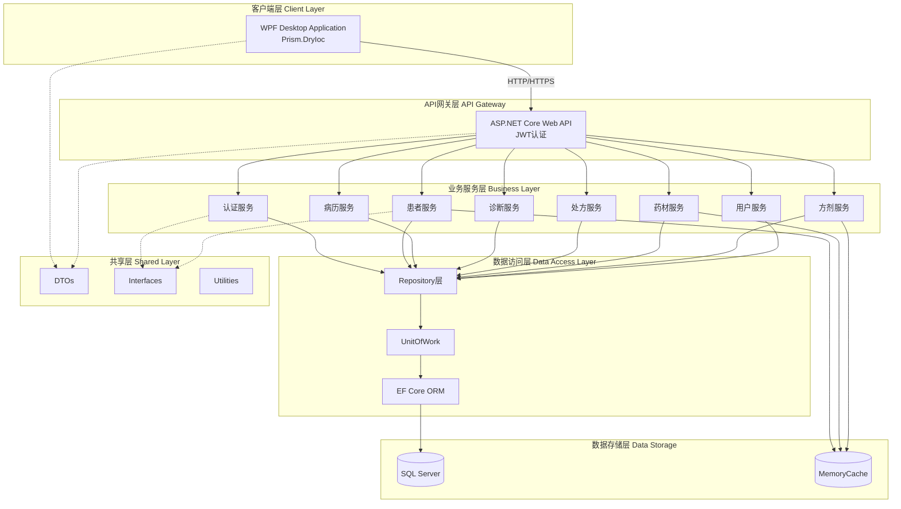
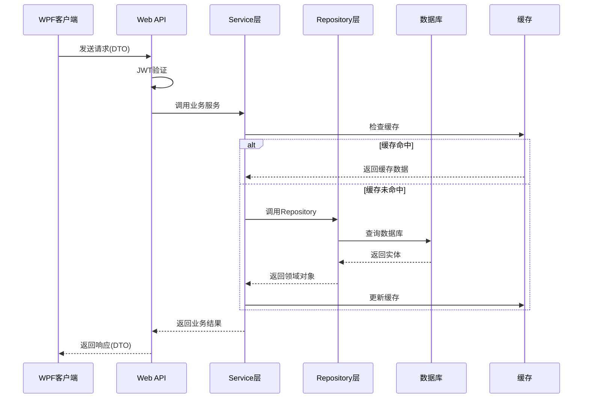
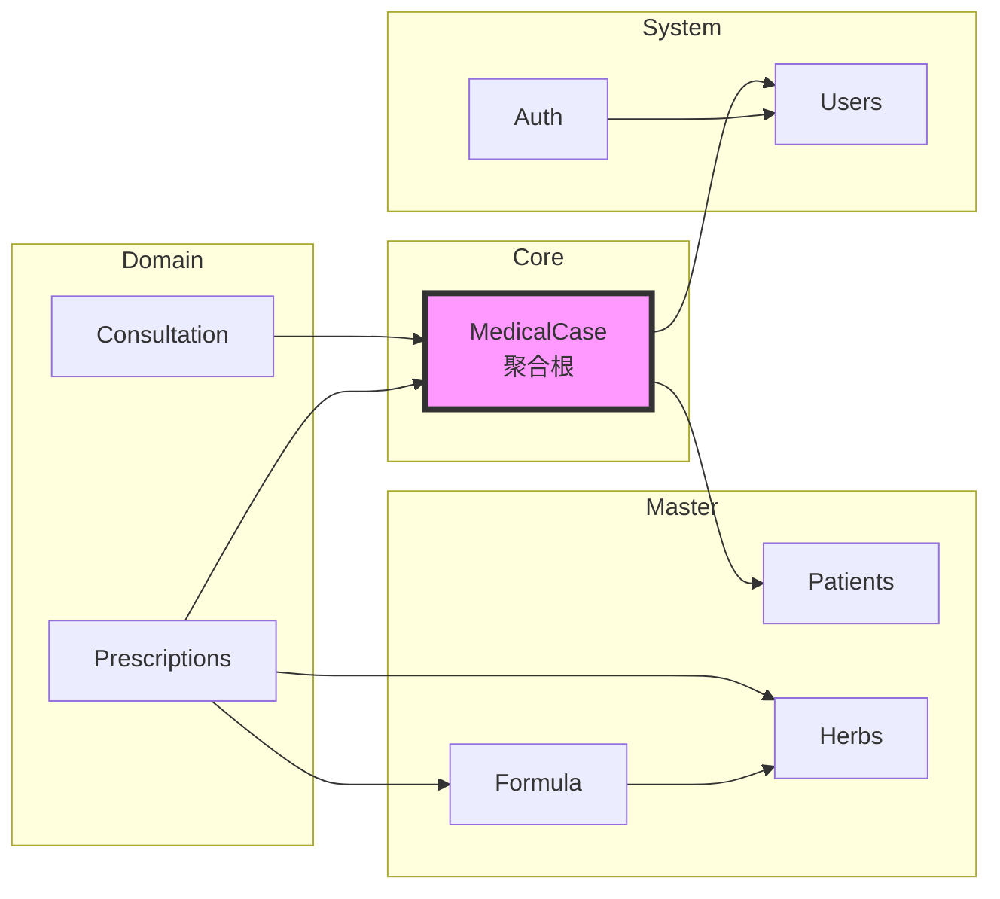
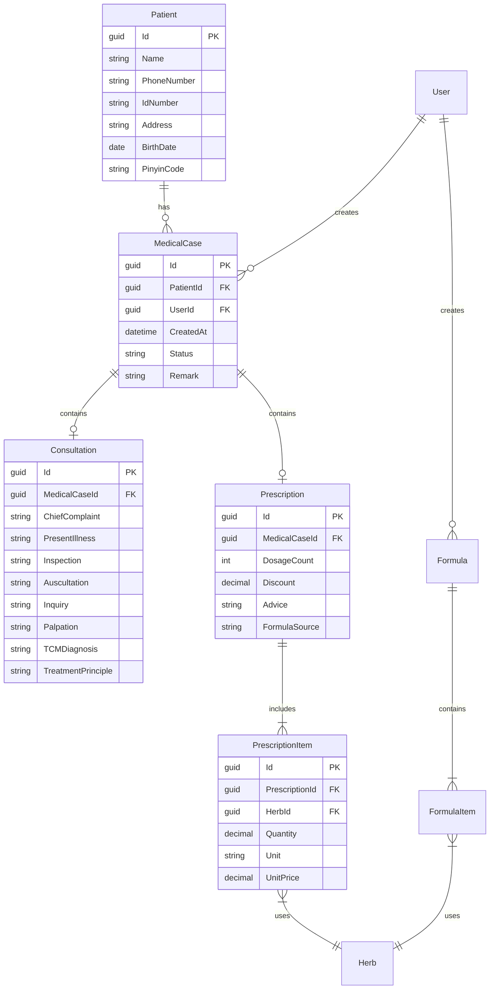
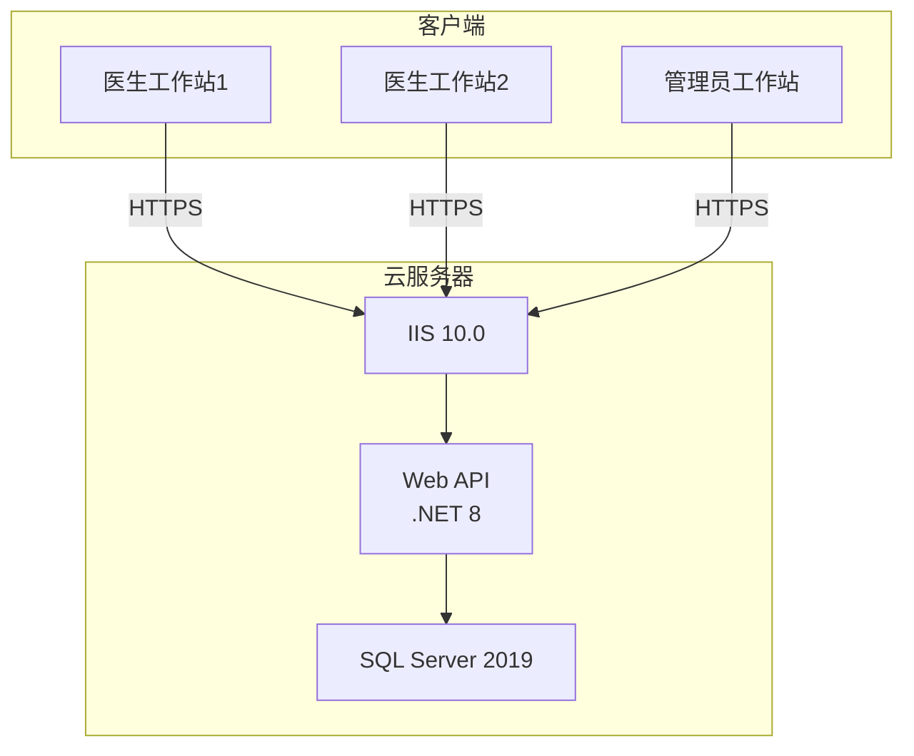

# LYBT中医诊所管理系统 - 系统架构设计文档

**版本**：v3.0  
**日期**：2025-09-28  
**编制**：基于MVP需求规范书（v2.0）  
**状态**：架构设计定稿  

## 一、架构概述

### 1.1 设计原则
- **简单适用**：针对小型诊所实际需求，避免过度设计
- **模块化**：清晰的模块边界，便于维护和扩展
- **高内聚低耦合**：模块内聚合，模块间松耦合
- **增量迭代**：支持功能逐步添加，不影响核心流程

### 1.2 架构风格
采用**分层架构 + 模块化设计**，结合以下模式：
- 三层架构（表现层、业务层、数据层）
- Repository模式（数据访问）
- UnitOfWork模式（事务管理）
- 依赖注入（DI）
- 领域驱动设计（DDD）的部分概念

## 二、系统架构图

### 2.1 整体架构



### 2.2 数据流向



## 三、模块设计

### 3.1 核心模块划分

| 模块名称 | 职责范围 | 核心实体 |
|----------|----------|----------|
| **Auth** | 用户认证、授权、会话管理 | User, Role, RefreshToken |
| **Patients** | 患者档案管理 | Patient |
| **MedicalCase** | 病历管理（聚合根） | MedicalCase |
| **Consultation** | 诊断信息管理 | Consultation |
| **Prescriptions** | 处方管理 | Prescription, PrescriptionItem |
| **Herbs** | 药材基础数据 | Herb |
| **Formula** | 方剂模板管理 | Formula, FormulaItem |
| **Users** | 用户信息管理 | UserProfile |

### 3.2 模块依赖关系



### 3.3 接口设计原则

#### 3.3.1 服务接口分离
```csharp
// 查询服务接口
public interface IPatientQueryService
{
    Task<PatientDto> GetByIdAsync(Guid id);
    Task<PagedResult<PatientDto>> GetPagedAsync(PatientQueryDto query);
}

// 业务服务接口
public interface IPatientBusinessService
{
    Task<ServiceResult<PatientDto>> CreateAsync(PatientCreateDto dto);
    Task<ServiceResult<PatientDto>> UpdateAsync(Guid id, PatientUpdateDto dto);
    Task<ServiceResult> DeleteAsync(Guid id);
}
```

#### 3.3.2 Repository接口规范
```csharp
public interface IRepository<TEntity> where TEntity : BaseEntity
{
    Task<TEntity> GetByIdAsync(Guid id);
    IQueryable<TEntity> Query();
    Task<TEntity> AddAsync(TEntity entity);
    Task UpdateAsync(TEntity entity);
    Task DeleteAsync(TEntity entity);
}
```

## 四、数据架构

### 4.1 实体关系模型



### 4.2 聚合根设计

#### MedicalCase聚合根
```csharp
public class MedicalCase : AggregateRoot
{
    public Guid PatientId { get; private set; }
    public Guid UserId { get; private set; }
    public MedicalCaseStatus Status { get; private set; }
    
    // 值对象
    public Consultation Consultation { get; private set; }
    public Prescription Prescription { get; private set; }
    
    // 领域事件
    public void Complete() 
    {
        if (Status != MedicalCaseStatus.Draft)
            throw new DomainException("只能完成草稿状态的病历");
        
        Status = MedicalCaseStatus.Completed;
        AddDomainEvent(new MedicalCaseCompletedEvent(Id));
    }
    
    // 业务规则
    public bool CanModify(Guid userId, bool isAdmin)
    {
        if (isAdmin) return true;
        if (UserId != userId) return false;
        return Status == MedicalCaseStatus.Draft || 
               (Status == MedicalCaseStatus.Completed && 
                CreatedAt.Date == DateTime.Today);
    }
}
```

### 4.3 数据一致性策略

1. **事务边界**：每个聚合根维护自己的事务边界
2. **乐观并发**：使用RowVersion进行并发控制
3. **软删除**：所有实体支持软删除（IsDeleted字段）
4. **审计跟踪**：自动记录创建时间、修改时间、操作用户

## 五、技术架构

### 5.1 API设计规范

#### 5.1.1 RESTful路由规范
```
GET    /api/v1/patients          # 获取患者列表
GET    /api/v1/patients/{id}     # 获取单个患者
POST   /api/v1/patients          # 创建患者
PUT    /api/v1/patients/{id}     # 更新患者
DELETE /api/v1/patients/{id}     # 删除患者

# 嵌套资源
GET    /api/v1/medicalcases/{id}/consultation
POST   /api/v1/medicalcases/{id}/prescription
```

#### 5.1.2 统一响应格式
```json
{
    "success": true,
    "code": 200,
    "message": "操作成功",
    "data": {
        // 业务数据
    },
    "timestamp": "2025-09-28T10:00:00Z"
}
```

#### 5.1.3 分页响应
```json
{
    "items": [...],
    "totalCount": 100,
    "pageNumber": 1,
    "pageSize": 20,
    "totalPages": 5,
    "hasPrevious": false,
    "hasNext": true
}
```

### 5.2 认证授权方案

#### 5.2.1 JWT Token结构
```json
{
    "sub": "user_id",
    "name": "user_name",
    "role": "Doctor",
    "clinic": "clinic_id",
    "exp": 1234567890,
    "iat": 1234567890,
    "jti": "unique_token_id"
}
```

#### 5.2.2 权限控制矩阵
| 资源 | 管理员 | 医生 |
|------|--------|------|
| 患者档案 | CRUD | R |
| 自己的病历 | CRUD | CRUD(当天) |
| 他人的病历 | CRUD | R |
| 药材管理 | CRUD | R |
| 方剂(公用) | CRUD | R |
| 方剂(个人) | - | CRUD |
| 用户管理 | CRUD | R(自己) |

### 5.3 缓存策略

#### 5.3.1 缓存层次
```
L1: 客户端内存缓存（5分钟）
    ↓
L2: API MemoryCache（10分钟）
    ↓
L3: 数据库查询缓存
```

#### 5.3.2 缓存策略
| 数据类型 | 缓存时间 | 更新策略 |
|----------|----------|----------|
| 患者基本信息 | 10分钟 | 更新时失效 |
| 药材列表 | 30分钟 | 定时刷新 |
| 方剂模板 | 30分钟 | 更新时失效 |
| 用户权限 | 5分钟 | 登录时刷新 |
| 病历/处方 | 不缓存 | - |

### 5.4 异常处理机制

#### 5.4.1 异常分类
```csharp
public class DomainException : Exception { }      // 领域异常
public class ValidationException : Exception { }   // 验证异常
public class AuthorizationException : Exception { } // 授权异常
public class ConcurrencyException : Exception { }  // 并发异常
```

#### 5.4.2 全局异常处理
```csharp
public class GlobalExceptionMiddleware
{
    public async Task InvokeAsync(HttpContext context)
    {
        try
        {
            await _next(context);
        }
        catch (ValidationException ex)
        {
            await HandleValidationException(context, ex);
        }
        catch (DomainException ex)
        {
            await HandleDomainException(context, ex);
        }
        catch (Exception ex)
        {
            await HandleGenericException(context, ex);
        }
    }
}
```

## 六、部署架构

### 6.1 服务器部署



### 6.2 配置管理

#### 6.2.1 服务器配置
```json
// appsettings.json
{
    "ConnectionStrings": {
        "DefaultConnection": "Server=...;Database=LYBTDB;..."
    },
    "JwtOptions": {
        "Secret": "...",
        "Issuer": "LYBT",
        "Audience": "LYBT-Client",
        "ExpireMinutes": 480
    },
    "CacheOptions": {
        "PatientCacheMinutes": 10,
        "HerbCacheMinutes": 30,
        "FormulaCacheMinutes": 30
    }
}
```

#### 6.2.2 客户端配置
```xml
<!-- App.config -->
<configuration>
    <appSettings>
        <add key="ApiBaseUrl" value="https://api.lybt.com" />
        <add key="EnableOfflineMode" value="false" />
        <add key="DefaultTimeout" value="30" />
    </appSettings>
</configuration>
```

## 七、扩展性设计

### 7.1 多租户预留

```csharp
// 实体基类预留租户字段
public abstract class TenantEntity : BaseEntity
{
    public Guid? TenantId { get; set; } // 预留，当前为null
}

// 查询过滤器预留
modelBuilder.Entity<Patient>()
    .HasQueryFilter(p => p.TenantId == _currentTenantId || p.TenantId == null);
```

### 7.2 接口版本管理

```csharp
// API版本控制
[ApiVersion("1.0")]
[Route("api/v{version:apiVersion}/[controller]")]
public class PatientsController : ControllerBase { }

// 客户端版本兼容
public interface IApiClient
{
    string ApiVersion { get; }
    Task<T> GetAsync<T>(string endpoint, string version = "1.0");
}
```

### 7.3 模块化扩展点

```csharp
// 模块注册接口
public interface IModule
{
    void RegisterServices(IServiceCollection services);
    void Configure(IApplicationBuilder app);
}

// 动态加载模块
public class ModuleLoader
{
    public void LoadModules(IServiceCollection services)
    {
        var modules = Assembly.GetExecutingAssembly()
            .GetTypes()
            .Where(t => typeof(IModule).IsAssignableFrom(t))
            .Select(t => Activator.CreateInstance(t) as IModule);
        
        foreach (var module in modules)
        {
            module.RegisterServices(services);
        }
    }
}
```

## 八、安全架构

### 8.1 安全措施

1. **通信安全**：HTTPS传输，TLS 1.2+
2. **认证机制**：JWT Token，RefreshToken机制
3. **密码策略**：BCrypt加密，可配置复杂度
4. **SQL注入防护**：参数化查询，EF Core自动处理
5. **XSS防护**：输入验证，输出编码
6. **审计日志**：关键操作记录

### 8.2 数据保护

```csharp
// 敏感数据加密
public class EncryptionService
{
    public string Encrypt(string plainText) { }
    public string Decrypt(string cipherText) { }
}

// 个人信息脱敏
public class DataMaskingService
{
    public string MaskPhoneNumber(string phone)
    {
        // 138****1234
        return $"{phone.Substring(0,3)}****{phone.Substring(7)}";
    }
}
```

## 九、性能优化

### 9.1 数据库优化

```sql
-- 索引设计
CREATE INDEX IX_MedicalCase_PatientId_CreatedAt 
ON MedicalCase(PatientId, CreatedAt DESC);

CREATE INDEX IX_Prescription_MedicalCaseId 
ON Prescription(MedicalCaseId);

-- 分区表（未来）
-- CREATE PARTITION FUNCTION PF_MedicalCase_Date (datetime)
-- AS RANGE RIGHT FOR VALUES ('2025-01-01', '2025-07-01', '2026-01-01');
```

### 9.2 查询优化

```csharp
// 使用投影减少数据传输
public async Task<IEnumerable<PatientListDto>> GetPatientsAsync()
{
    return await _context.Patients
        .Where(p => !p.IsDeleted)
        .Select(p => new PatientListDto
        {
            Id = p.Id,
            Name = p.Name,
            PhoneNumber = p.PhoneNumber,
            LastVisitDate = p.MedicalCases
                .OrderByDescending(m => m.CreatedAt)
                .Select(m => m.CreatedAt)
                .FirstOrDefault()
        })
        .ToListAsync();
}
```

## 十、监控与运维

### 10.1 健康检查

```csharp
// Startup.cs
services.AddHealthChecks()
    .AddDbContextCheck<AppDbContext>()
    .AddCheck("cache", new CacheHealthCheck())
    .AddCheck("auth", new AuthServiceHealthCheck());

// 健康检查端点
app.MapHealthChecks("/health", new HealthCheckOptions
{
    ResponseWriter = UIResponseWriter.WriteHealthCheckUIResponse
});
```

### 10.2 日志策略

```csharp
// 结构化日志
Log.Information("User {UserId} created patient {PatientId}", 
    userId, patientId);

// 日志级别
// - Error: 异常和错误
// - Warning: 性能问题、重试
// - Information: 业务操作
// - Debug: 调试信息（开发环境）
```

## 十一、开发规范

### 11.1 代码组织

```
/src
  /Server
    /Core
      /LYBT.Entities        # 领域实体
      /LYBT.Infrastructure  # 基础设施
    /Modules
      /LYBT.Module.Auth
      /LYBT.Module.Patients
      /LYBT.Module.MedicalCase
    /Services
      /LYBT.WebAPI          # API入口
  /Client
    /Desktop
      /Core                 # 核心功能
      /Infrastructure       # 基础设施
      /Modules              # 业务模块
      /Shell                # 主程序
  /Shared
    /LYBT.Shared.Models     # DTO定义
    /LYBT.Shared.Interfaces # 接口定义
    /LYBT.Shared.Utilities  # 工具类
```

### 11.2 命名规范

| 类型 | 规范 | 示例 |
|------|------|------|
| 类名 | PascalCase | PatientService |
| 接口 | I + PascalCase | IPatientService |
| 方法 | PascalCase + Async | GetPatientAsync |
| 私有字段 | _camelCase | _patientRepository |
| 参数 | camelCase | patientId |
| 常量 | UPPER_CASE | MAX_RETRY_COUNT |

## 十二、测试策略

### 12.1 测试层次

```
单元测试（70%）
  ↓
集成测试（20%）
  ↓
端到端测试（10%）
```

### 12.2 测试示例

```csharp
[Fact]
public async Task CreatePatient_WithValidData_ShouldReturnSuccess()
{
    // Arrange
    var dto = new PatientCreateDto 
    { 
        Name = "测试患者",
        PhoneNumber = "13800138000" 
    };
    
    // Act
    var result = await _service.CreateAsync(dto);
    
    // Assert
    result.Should().NotBeNull();
    result.IsSuccess.Should().BeTrue();
    result.Data.Name.Should().Be(dto.Name);
}
```

## 十三、风险与缓解

| 风险 | 影响 | 缓解措施 |
|------|------|----------|
| 数据库单点故障 | 系统不可用 | 定期备份，快速恢复方案 |
| 网络中断 | 无法使用 | 预留离线模式接口 |
| 并发冲突 | 数据不一致 | 乐观锁，冲突重试 |
| 性能瓶颈 | 响应慢 | 缓存优化，查询优化 |

## 十四、里程碑计划

### Phase 1: MVP核心（第1-2周）
- [x] 基础架构搭建
- [ ] 用户认证模块
- [ ] 患者管理模块
- [ ] 病历核心流程
- [ ] 诊断信息录入
- [ ] 基础处方功能

### Phase 2: 完整功能（第3周）
- [ ] 四种开方方式
- [ ] Excel数据导入
- [ ] 药材管理
- [ ] 方剂管理
- [ ] 权限控制

### Phase 3: 优化完善（第4周）
- [ ] 性能优化
- [ ] 缓存实现
- [ ] 日志完善
- [ ] 错误处理
- [ ] 部署配置

## 附录A：技术选型理由

| 技术 | 选择理由 |
|------|----------|
| WPF | 成熟稳定，适合复杂表单，团队熟悉 |
| Prism | 模块化架构，MVVM支持好 |
| .NET 8 | 最新LTS版本，性能优秀 |
| EF Core | 简化数据访问，支持迁移 |
| SQL Server | 企业级数据库，稳定可靠 |
| JWT | 无状态认证，适合分布式 |
| MemoryCache | 简单高效，满足需求 |

## 附录B：参考资料

1. [Microsoft .NET 架构指南](https://docs.microsoft.com/en-us/dotnet/architecture/)
2. [Domain-Driven Design](https://martinfowler.com/tags/domain%20driven%20design.html)
3. [RESTful API 设计指南](https://restfulapi.net/)
4. [JWT 规范](https://jwt.io/introduction)

---

**文档维护**：
- 编制：架构师团队
- 审核：技术负责人
- 批准：项目经理

**修订记录**：
| 版本 | 日期 | 修订内容 | 修订人 |
|------|------|----------|--------|
| v1.0 | 2025-09-27 | 初始版本 | Claude |
| v2.0 | 2025-09-28 | 基于需求复审完善 | Claude |
| v3.0 | 2025-09-28 | 添加详细技术规范 | Claude |