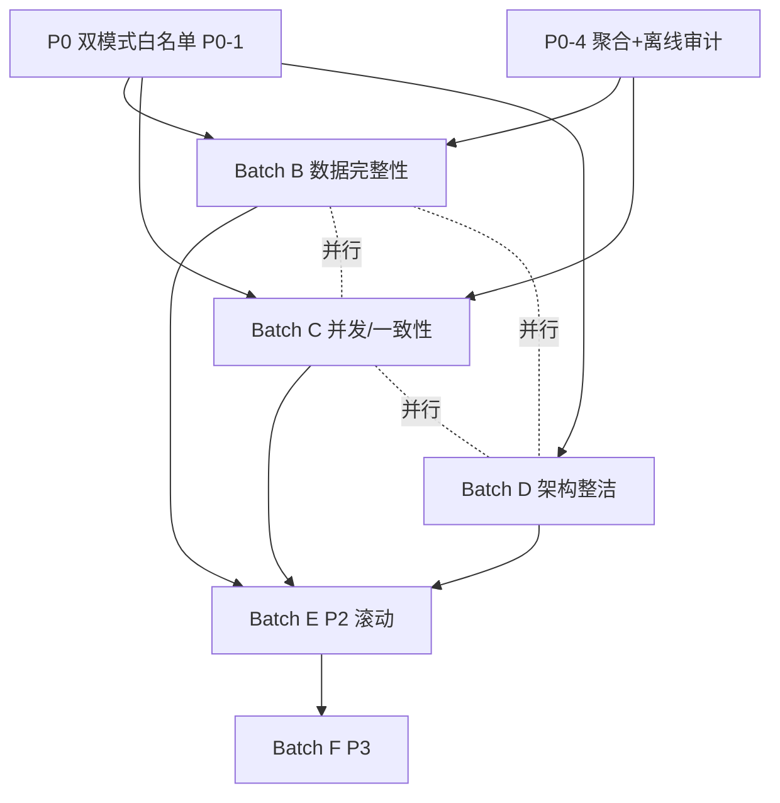

# LYBTZYZS 架构审查修复方案

**日期**：2026-08-21  
**来源**：`docs/compose/reports/architecture-deep-review-2026-08-21.md`（20轮，145发现 P0:4/P1:38/P2:65/P3:38）  
**约束**：`lybtzys-coder-rules`（文档优先、外科手术式、0/0门禁、P07/P08/P10、双控制器同步、技术引入治理）、`docs/00-governance/02-ssot-architecture.md` SSOT、`docs/03-architecture/decisions` ADR  
**性质**：只读规划，不改 `src/` 代码；方案到文件:行/方法级；批次化、可验证

---

## 修复批次规划

| 批次 | 主题 | 覆盖 | 数量 | 窗口 | 负责人 | 依赖 |
|------|------|------|------|------|--------|------|
| **Batch A** | P0 安全/架构红线 | P0-1..P0-4 | 4 | 本周（D1-D5） | Hermes + Mimo Code | 无（优先） |
| **Batch B** | P1 数据完整性 | P1-7/9/10/15/20/21 等 | 10 | 下周上半（D6-D10） | Mimo Code | A（P0-4 审计） |
| **Batch C** | P1 并发/一致性 | P1-8/17/18/19/22/23 等 | 10 | 下周下半（D11-D15） | Mimo Code | A（P0-4 行级） |
| **Batch D** | P1 架构整洁 | P1-1/2/3/6/24/29/30/31 等 | 9 | 第三周 | Mimo Code | A（P0-1 白名单） |
| **Batch E** | P2 批次（5项/Sprint） | P2-1..P2-65 分组 | 65 | 持续（每 Sprint 5） | 分模块认领 | A-D 之后 |
| **Batch F** | P3 Good First Issues | P3-1..P3-38 | 38 | 持续 | 新人/外协 | 无 |

**总计**：145 项，P0/P1 42 项逐项 8 段方案，P2/P3 分组批量

### 批次甘特（建议）

```
W1: [Batch A P0×4]
W2: [Batch B 数据完整性────────] [Batch C 并发/一致性────────]
W3: [Batch D 架构整洁──────────────────────]
W4+: [Batch E P2 每Sprint 5] ──────────────────────────────────
     [Batch F P3 Good First Issues] ────────────────────────────
```

---

## Batch A：P0 安全/架构红线（本周）

| 编号 | 问题 | 修复方案（一句话） | 涉及文件 | 依赖 | 工时 |
|------|------|-------------------|----------|------|------|
| P0-1 | LocalWebAPI 白名单未文档化，架构测试假绿 | 新增 ADR-0023 + 总纲补特例 + 测试显式豁免 | `LYBT.LocalWebAPI.csproj`、 `docs/03-architecture/00-architecture-summary.md`、 `docs/03-architecture/decisions/0023-localwebapi-whitelist.md`、 `tests/LYBT.Tests.Architecture/ArchTests.cs`、 `TestAssemblies.cs`、 `docs/03-architecture/05-dual-mode.md` | 无 | 0.5d |
| P0-2 | WebAPI 热更新无签名校验可 RCE | `Program.cs` 热更新加 SHA256 校验 + 失败回滚 | `src/Server/Services/LYBT.WebAPI/Program.cs:48-71`、 `src/Server/Services/LYBT.WebAPI/Controllers/DeployController.cs`、 `docs/06-operations/01-deployment.md` | 无 | 0.5d |
| P0-3 | Identity 批量操作仅防 IsSysAdmin 未防层级 | 全批量 Handler 强制经 `UserHierarchyGuard.Validate` | `BatchDeleteUsersCommandHandler.cs` 等 5 文件、 `UserHierarchyGuard.cs`、 `tests/LYBT.Tests.Server` 新增 `BatchDeleteHierarchyTests.cs` | 无 | 0.5d |
| P0-4 | 聚合可绕过 + 离线1年JWT无撤销无审计 | 聚合编译期约束（internal仓库）+ 本地 SQLite 审计队列 + 双JWT密钥隔离 ADR-0024 | `MedicalCaseRepository.cs` 等、 `LocalWebAPI/Auth/LocalJwtConfig.cs`、 `AuthSession`、 `docs/03-architecture/decisions/0024-dual-jwt-isolation.md` | 依赖 P0-1 文档化 | 1d |

---

### [P0-1] LocalWebAPI 白名单未文档化 — 架构测试假绿

- **现状**：`LYBT.LocalWebAPI.csproj:8-14` 直引 6 个 Server 模块（`Identity/Patients/Catalog/MedicalCases/Registration/Reports` + `Infrastructure`），违反总纲“模块间不直接引用”表述；`05-dual-mode.md` 已解释为统一服务层但 `00-architecture-summary.md` 未声明，`ArchTests.P07` 未显式豁免，靠 `TestAssemblies.Server` 未含 `LocalWebAPI` 掩盖，测试绿≠架构干净。
- **根因**：ADR-0010 已定统一服务层，但未回写总纲与测试豁免；SSOT 未覆盖“双模式例外”。
- **修复方案**：新增 ADR-0023 正名白名单，修订总纲与 `05-dual-mode.md`，测试显式豁免（注释优于隐蔽的 assembly 排除）。
- **涉及文件**：
  - `src/Client/Desktop/LocalWebAPI/LYBT.LocalWebAPI.csproj`（注释增白名单说明）
  - `docs/03-architecture/00-architecture-summary.md` §Architecture Layers 增“LocalWebAPI 特例”段
  - `docs/03-architecture/05-dual-mode.md` §LocalWebAPI 架构增“P07 例外”小节
  - `docs/03-architecture/decisions/0023-localwebapi-whitelist.md`（新建 ADR）
  - `tests/LYBT.Tests.Architecture/ArchTests.cs` `P07_Modules_Should_Not_Reference_Each_Other` 加 `// Exempt: LocalWebAPI (see ADR-0010/0023)` 显式白名单
  - `tests/LYBT.Tests.Architecture/TestAssemblies.cs` `Server` 数组显含 `LocalWebAPI`（不再隐蔽排除）
  - `docs/00-governance/02-ssot-architecture.md` SSOT 表增“LocalWebAPI 白名单→ADR-0023”
- **修复步骤**：
  1. 读 `00-architecture-summary.md` 与 `05-dual-mode.md` 定位架构图/依赖方向段落
  2. 新建 ADR-0023（草案见下）并经 `03-technical-adoption-governance.md` T2 流程评审
  3. 修总纲：`Architecture Layers` 依赖方向 `Shell → Roles → Modules → Infrastructure` 后增注“LocalWebAPI 为 P07 唯一例外，直接复用 Server Modules 以实现离线，见 ADR-0010/0023”
  4. 修 `LYBT.LocalWebAPI.csproj` ItemGroup 前加 `<!-- P07 Whitelist: unified Service layer, see ADR-0010/0023 -->`
  5. 修 `TestAssemblies.cs`：`Server` 显含 `Assembly.Load("LYBT.LocalWebAPI")`，`ArchTests.cs` P07 首行 `if (assembly.GetName().Name=="LYBT.LocalWebAPI") continue; // exempt`
  6. `dotnet test tests/LYBT.Tests.Architecture --filter P07` 验证仍绿且覆盖 LocalWebAPI
- **验证方式**：`dotnet build --no-incremental 0/0`；`ArchTests.P07` 显式通过 LocalWebAPI；`docs/02-ssot` 可grep到白名单
- **关联问题**：P0-4（同为双模式）、P1-34（P07掩盖）、P2 LocalWebAPI 端口冲突
- **文档同步**：上述 4 文档 + ADR-0023；`13-project-master-plan.md` 增 Batch A 任务

> **ADR-0023 草案（LocalWebAPI 白名单）**
> - **标题**：LocalWebAPI 复用 Server Modules 白名单（P07 例外）
> - **背景**：离线模式需复用领域逻辑，复刻 Service 将双倍维护
> - **决策**：允许 `LYBT.LocalWebAPI` 直接引用 6 Server Modules，仍满足 3-Layer（Controller→Service→Repository→DbContext），Service 仍不直连 DbContext（经模块 DbContext）
> - **后果**：架构测试显式豁免；Server 模块 API 变更需同步双控制器测试；`05-dual-mode.md` 为 SSOT
> - **替代**：复刻 Service（否，维护翻倍）；HTTP 本地环回（否，性能差）

---

### [P0-2] WebAPI 热更新无签名校验

- **现状**：`Program.cs:48-71` `.update-pending` 标志即 `ZipFile.ExtractToDirectory(zipPath, currentDir, overwriteFiles:true)` 无校验无回滚，低权限写目录可 RCE。
- **根因**：热更新为 `start.sh` 遗留，安全未纳入 `09-security-architecture.md` 威胁模型。
- **修复方案**：最小外科手术：`DeployController` 上传时计算 SHA256 并写入 `.update-pending.sha256`，`Program.cs` 解压前校验，不符则拒绝并告警；后续再评估统一为 `Velopack` Server 通道（T3 需治理）。
- **涉及文件**：
  - `src/Server/Services/LYBT.WebAPI/Program.cs` `Main` 热更新段 48-71
  - `src/Server/Services/LYBT.WebAPI/Controllers/DeployController.cs` `POST /api/v1/deploy/upload`（增 hash 写入）
  - `src/Server/Core/LYBT.Infrastructure/Constants/HttpHeaderConstants.cs`（如需 `X-Update-SHA256`）
  - `docs/06-operations/01-deployment.md` §热更新增“SHA256 校验”条目
  - `docs/03-architecture/09-security-architecture.md` §信任边界增“热更新签名”
- **修复步骤**：
  1. `DeployController.UploadAsync` 计算 `SHA256(zipStream)` 写入 `AppContext.BaseDirectory/.update-pending.sha256`（与 `.update-pending` 同级）
  2. `Program.cs` `if(File.Exists(updateFlag))` 后读 `sha256` 比对 `ComputeSHA256(zipPath)`，不一致则 `Log.Fatal("热更新 SHA 校验失败") + Environment.Exit(1)` 并保留旧版
  3. 解压前备份 `currentDir` 关键 dll 清单（或要求发布包内含 `manifest.json`），失败回滚
  4. `01-deployment.md` 补“热更新必须 SHA256 一致” Runbook
  5. 加单测 `HotUpdateShaTests.cs`（篡改 zip 应拒绝）
- **验证方式**：本地 `echo "bad" >> update.zip` 触发校验失败；`dotnet test --filter HotUpdateSha` 绿；`deploy` 上传-重启链路验证
- **关联问题**：P1-5 种子静默（同属启动链）、P2 Velopack 评估
- **文档同步**：`01-deployment.md` + `09-security` + 部署踩坑清单

---

### [P0-3] Identity 批量操作纵深防御缺口

- **现状**：`BatchDeleteUsersCommandHandler.cs:47` 等 5 批量 Handler 仅 `if(targetIsSysAdmin) fail`，未校验 `OperatorRole` 层级（`SuperAdmin→仅 Admin`、`Admin→仅 Doctor/Receptionist`），`UserHierarchyGuard.Validate` 已存在但未在批量路径调用，内部调用可越级。
- **根因**：`UPDATEUSER-HIERARCHY-FIX 2026-08-13` 仅修复单体 `Create/Delete/Toggle`，批量路径遗漏。
- **修复方案**：全批量 Handler 强制经 Guard，`OperatorRole` 已在 Command 上（`BatchDeleteUsersCommand: Ids, CurrentUserId, OperatorRole`），循环内先 Guard 再操作；补单测。
- **涉及文件**：
  - `src/Server/Modules/LYBT.Module.Identity/Application/Commands/BatchDeleteUsersCommandHandler.cs`（第 38-77 行）
  - `BatchDisableUsersCommandHandler.cs:47`
  - `BatchEnableUsersCommandHandler.cs:48`
  - `BatchDelete/Disable/Enable` 对应 Command（`OperatorRole` 已有，不改契约）
  - `src/Server/Modules/LYBT.Module.Identity/Application/Commands/UserHierarchyGuard.cs`（复用）
  - `src/Server/Modules/LYBT.Module.Identity/Application/Commands/RestoreUserCommandHandler.cs`（查漏，同样加 Guard）
  - `tests/LYBT.Tests.Server/Integration/Identity/BatchDeleteHierarchyTests.cs`（新建）
  - `docs/03-architecture/09-security-architecture.md` §纵深防御增“批量层级必须 Guard”
- **修复步骤**：
  1. 读 `UserHierarchyGuard.cs:22 Validate<T>` 签名，确认返回 `Result<T>?`（null=允许）
  2. `BatchDeleteUsersCommandHandler.Handle` 循环体内首行 `var guard=UserHierarchyGuard.Validate(dto, operatorId, targetId, OperatorRole, targetIsSysAdmin, targetRole); if(guard!=null) { failures.Add(...); continue; }`
  3. 同改 `BatchDisable/Enable` 3 文件，`RestoreUser` 亦补（查 `IsDeleted` 后）
  4. 新增 `BatchDeleteHierarchyTests.cs`：Admin 批删 Admin 应 403、SuperAdmin 批删 Doctor 应 403、Receptionist 无批量权限应 403（策略层）+ Service 层越级 409
  5. `dotnet test --filter BatchDeleteHierarchy` 绿
- **验证方式**：上述单测绿；`ArchTests` 不受影响；`12-permissions-matrix.md` C7 增“批量已修复”标注
- **关联问题**：P1-4 单体 Guard 重复、P1-31 双真相
- **文档同步**：`09-security` + `12-permissions-matrix.md` + `04-permissions.md` 批量行

---

### [P0-4] 聚合可绕过 + 离线1年JWT无撤销无审计

- **现状**：`MedicalCaseRepository.cs:15` 直引 `AppDbContext`，`CatalogCrossModuleService` 可 `AppDbContext.Prescriptions.Any()` 绕聚合；`LocalWebAPI/Auth/LocalJwtConfig.cs:15` 本地 1 年 JWT 无撤销，`AuthController` logout 仅内存清 `AuthSession`，`SecurityAuditLog` 本地不落库，离线越权无追溯。
- **根因**：ADR-0001 聚合边界仅约定，`LocalWebAPI` 为降低复杂度接受无撤销但未补审计补偿。
- **修复方案**：双轨：A 聚合编译期约束（`IMedicalCaseRepository` 仅经 `MedicalCaseDbContext`，`Prescription` 仓储 `internal`）；B 离线审计队列（本地 SQLite `SecurityAuditLogs` 同步缓冲，在线时 `Sync` 到远程）+ 双JWT密钥隔离 ADR-0024。
- **涉及文件**：
  - `src/Server/Modules/LYBT.Module.MedicalCases/Infrastructure/MedicalCaseRepository.cs`（`internal` 化 `MedicalCaseDbContext`，`Prescription` 操作仅经聚合根）
  - `src/Server/Core/LYBT.Infrastructure/Data/AppDbContext.cs`（`Prescriptions` DbSet 访问修饰不变，但 `CatalogCrossModuleService` 改经 `IMedicalCaseCrossModuleService.ExistsAsync` 接口而非直查）
  - `src/Server/Modules/LYBT.Module.Catalog/Services/CatalogCrossModuleService.cs:12` 去 `AppDbContext` 改 `IMedicalCaseCrossModuleService`
  - `src/Client/Desktop/LocalWebAPI/Auth/LocalJwtConfig.cs`（增 `Kid` 区分双密钥）
  - `src/Shared/LYBT.Shared.Configuration/Options/Server/LocalJwtOptions.cs` + `JwtOptions.cs`（密钥分 `Jwt:SecretKey` vs `LocalJwt:SecretKey`，部署强制不同值校验）
  - `src/Shared/LYBT.Entities/Auth/SecurityAuditLog.cs`（本地 SQLite 同表）
  - `docs/03-architecture/decisions/0024-dual-jwt-isolation.md`（新建 ADR，草案见下）
  - `docs/03-architecture/decisions/0001-medicalcase-aggregate-root.md` 增“编译期约束”附录
  - `docs/06-operations/01-deployment.md` 增双密钥隔离校验
  - `docs/03-architecture/09-security-architecture.md` §本地信任边界增审计补偿
- **修复步骤**：
  1. 新建 ADR-0024（草案见下）评审
  2. 聚合约束：`MedicalCaseRepository` 的 `Prescription` 增删改 `internal`，对外仅 `IMedicalCaseCommandService`，`Catalog` 侧改注入 `IMedicalCaseCrossModuleService`（已存在，仅改实现从直查改为接口）
  3. 本地审计：`LocalWebAPI` 启动时 `EnsureCreated` 本地 `SecurityAuditLogs`（SQLite），`LocalJwt` 签发/验证时写审计，`SwitchingApiClient` 在线时 `POST /api/v1/audit/sync` 批量同步
  4. 双密钥：`LocalJwtOptionsValidator` 校验 `LocalJwt:SecretKey != Jwt:SecretKey` 否则 `Fatal`（生产），`01-deployment.md` 发布清单增“双密钥不同值”
  5. `dotnet build --no-incremental 0/0` + `ArchTests.AggregateRoot` 新增守卫 `Prescription` 不被 `Catalog` 直引
- **验证方式**：`grep -r "AppDbContext.Prescriptions" src/Server/Modules/LYBT.Module.Catalog --` 0 命中；离线模式创建患者后 `SecurityAuditLogs` 本地有行，在线后同步到远程 `SecurityAuditLogs`；`dotnet test --filter AggregateRoot` 绿
- **关联问题**：P0-1（同双模式）、P1-17/18/19（聚合一致性）、P1-22（SignalR 广播同属边界）
- **文档同步**：ADR-0001 附录 + ADR-0024 + `05-dual-mode.md` + `09-security` + `01-deployment.md`

> **ADR-0024 草案（双JWT密钥隔离）**
> - **标题**：远程与本地 JWT 密钥隔离及本地审计补偿
> - **背景**：离线 1 年 JWT 无撤销，若与远程同密钥则离线 Token 可远程复用
> - **决策**：`Jwt:SecretKey`（8h）与 `LocalJwt:SecretKey`（1年）必须不同值，生产启动强校验；本地 `SecurityAuditLog` 落库 SQLite，联网时由 `IAuditSyncService` 同步
> - **后果**：部署多一密钥；本地多一 SQLite 表；审计终可追溯
> - **替代**：同密钥+远程撤销列表（否，离线无列表）

---

## Batch B：P1 数据完整性（下周上半，D6-D10）

| 编号 | 问题 | 涉及文件 | 工时 |
|------|------|----------|------|
| P1-1 | 僵尸项目 `LYBT.Module.MedicalCase` 空目录 | `src/Server/Modules/LYBT.Module.MedicalCase/` | 0.25d |
| P1-7 | `ApplicationUser` 全局 `IsDeleted` 过滤致恢复/引用检查逃逸 | `EntityOptimizationExtensions.cs:61`、 `RestoreUserCommandHandler.cs:42` 等 | 0.5d |
| P1-9 | 患者敏感字段假加密（DB明文） | `PatientModel.cs:35`、 `SensitiveDataJsonConverterFactory.cs`、 `SecurityOptions.cs` | 1d |
| P1-10 | `MedicalCase` IsLocked UTC 日界时区 | `MedicalCaseModel.cs:95`、 `ClinicSettingsOptions.cs` | 0.5d |
| P1-15 | Herb 导入软删复活丢审计 | `BatchImportHerbsCommandHandler.cs:85` | 0.25d |
| P1-20 | `IdNumber` 未唯一 | `PatientConfiguration.cs` + Migration | 0.5d |
| P1-21 | 挂号单例未校验（同一患者多 Waiting） | `CreateRegistrationCommandHandler.cs:42`、 `RegistrationRepository.cs` | 0.25d |
| P1-8 | 软删过滤唯一索引 Formula 缺失 | `FormulaConfiguration.cs:12`、 `HerbConfiguration.cs:15` | 0.25d |
| P1-3 | 非 HTTP 审计 `CreatedBy=null` | `AppDbContext.cs:152 GetCurrentUserId` | 0.25d |
| P1-5 | 单体/批量校验不一致（Herb 批量未校验 `<>`） | `HerbCommandHandler.cs:30` vs `BatchImportHerbsCommandHandler.cs:42` | 0.5d |

### [P1-1] 僵尸项目空目录

- **现状**：`src/Server/Modules/LYBT.Module.MedicalCase/` 0 cs，sln 未含，重命名残留。
- **根因**：`MedicalCases` 复数化后未清理。
- **修复方案**：`git rm -r` 空目录，`grep -r "Module.MedicalCase[^s]"` 清注释，`02-ssot` 增“MedicalCases 为唯一聚合根”条目防复发。
- **涉及文件**：`src/Server/Modules/LYBT.Module.MedicalCase/`（删）、`docs/03-architecture/04-data-model.md` 轻量增注
- **步骤**：1.`ls` 确认 0 cs 2.`git rm -r` 3.`grep` 清遗留 4.`dotnet build 0/0`
- **验证**：`find .../MedicalCase -name *.cs | wc -l` 0 目录已删；build 绿
- **关联**：P2 迁移历史臃肿
- **文档**：`04-data-model.md` 注“单数目录已清理”

### [P1-7] ApplicationUser 全局 IsDeleted 过滤副作用

- **现状**：`EntityOptimizationExtensions.cs:61` 对所有 `ISoftDeletable` 含 `ApplicationUser` 加 `!IsDeleted`，`UserManager.FindByIdAsync` 查已删用户返 null，`Restore` 已用 `IgnoreQueryFilters` 但 `CheckPatientReference` 等跨模块校验未统一，误删判断错误。
- **根因**：全局过滤一刀切，未单列 Identity 例外。
- **修复方案**：方案 A（选用）：保持全局过滤，但在 `docs` 增约束 + `RestoreUserCommandHandler.cs:42` 为范例，要求所有“查已删”场景显式 `IgnoreQueryFilters`，并加 `ArchTests` 扫描 `IgnoreQueryFilters` 遗漏的 `FindById` 调用；方案 B（`ApplicationUser` 豁免全局过滤）在 `ApplyGlobalQueryFilters` 中 `if (typeof(ISoftDeletable).IsAssignableFrom(...) && type!=typeof(ApplicationUser))`（需评估 Identity 软删查询影响）。
- **涉及文件**：`EntityOptimizationExtensions.cs:58-65`、 `RestoreUserCommandHandler.cs:42`、 `CheckPatientReferenceQueryHandler.cs` 等 3-4 跨模块校验、 `docs/03-architecture/04-data-model.md` §软删除增“Identity 全局过滤副作用”提示、 `tests/LYBT.Tests.Architecture/ArchTests.cs` 新增 `UserQueryMustIgnoreDeletedFilterWhenRestoring` 扫描（可选）
- **步骤**：1.选方案 A 2.补 `04-data-model.md` 提示 3.补 `CheckPatientReference` 等 `IgnoreQueryFilters` 4.新增扫描测试 5.build 绿
- **验证**：`Restore` 单测对已删用户可恢复；`CheckPatientReference` 对已删患者仍识别引用
- **关联**：P1-8 索引、P1-21 挂号单例（同属校验）
- **文档**：`04-data-model.md`

### [P1-9] 患者敏感字段假加密

- **现状**：`PatientModel.cs:35-50` `[SensitiveData]` 仅 `SensitiveDataJsonConverterFactory` 日志脱敏，DB 明文，`09-security` 称“落库加密”虚假。
- **根因**：仅日志层脱敏，未做持久层加密。
- **修复方案**：EF `ValueConverter` AES-GCM 透明加解密（最小外科手术，查询仍可等值搜索需另建 HMAC 列则二期）。密钥于 `SecurityOptions.AesKey`（Base64 32字节），`appsettings` 仅占位，部署由 `SecurityOptions__AesKey` 环境变量注入，校验 `AesKey` 长度。`IdNumber/PhoneNumber` 加 `HasConversion(encrypt, decrypt)`。
- **涉及文件**：`src/Shared/LYBT.Entities/Patients/PatientModel.cs`（减 `[SensitiveData]` 保留但增注释“持久层由 ValueConverter 加密”）、 `src/Server/Core/LYBT.Infrastructure/Data/Configurations/PatientConfiguration.cs`（`Property(p=>p.IdNumber).HasConversion(...)`）、 `src/Server/Core/LYBT.Infrastructure/Serialization/AesGcmValueConverter.cs`（新建）、 `src/Shared/LYBT.Shared.Configuration/Options/Server/SecurityOptions.cs`（增 `AesKey`）、 `docs/03-architecture/09-security-architecture.md` §敏感数据更正为“AES-GCM 透明加密 + 日志脱敏双层”、 `docs/06-operations/01-deployment.md` 增 `SecurityOptions__AesKey` 发布清单、 `src/Server/Core/LYBT.Infrastructure/Data/Configuration/EntityOptimizationExtensions.cs`（如需 HMAC 列则二期）
- **步骤**：1.新建 `AesGcmValueConverter : ValueConverter<string?,string>`（AesGcm + 随机 nonce 前置） 2.`SecurityOptions` 增 `AesKey` 并 `SecurityOptionsValidator` 验 Base64 32字节 3.`PatientConfiguration` 双字段 `HasConversion` 4.写 Migration `AddPatientEncryption`（数据迁移：明文→密文一次性脚本） 5.补 `PatientEncryptionTests.cs`（存取往返、日志仍脱敏） 6.build 0/0
- **验证**：DB 中 `IdNumber` 为 Base64 密文；`PatientService.GetById` 解密正确；日志中 `***` 脱敏
- **关联**：P1-3 审计、P2 JWT 校验
- **文档**：`09-security` + `01-deployment` + `04-data-model` 实体表增“加密”标记

### [P1-10] MedicalCase IsLocked UTC 日界

- **现状**：`MedicalCaseModel.cs:95` `IsLocked => IsCompleted && CompletedAt.Value.Date < DateTime.UtcNow.Date` UTC 日界，北京时间 00-08 时跨日误锁。
- **根因**：未引入诊所本地时区（`ClinicSettingsOptions.Timezone`）。
- **修复方案**：改 `TimeProvider` + `ClinicSettingsOptions.Timezone` 日界判断，`IsLocked` 抽为 `IMedicalCaseTimeService.IsLocked(MedicalCase, DateTimeOffset now)`，`MedicalCaseModel` 保留计算属性但委托服务，`Complete()` 仍 `DateTime.UtcNow` 落库，判断时转本地 Date。
- **涉及文件**：`src/Shared/LYBT.Entities/MedicalCases/MedicalCaseModel.cs:93-100`、 `src/Shared/LYBT.Shared.Configuration/Options/Client/ClinicSettingsOptions.cs`（增 `Timezone` 默认 `Asia/Shanghai`）、 `src/Server/Modules/LYBT.Module.MedicalCases/Services/MedicalCaseTimeService.cs`（新建，注入 `TimeProvider`）、 `src/Server/Modules/LYBT.Module.MedicalCases/Services/MedicalCaseCommandService.cs`（Update 前调 `IsLocked` 强锁）、 `docs/02-requirements/07-medical-cases.md` 状态机增“运营日界=诊所本地时间”定义
- **步骤**：1.增 `MedicalCaseTimeService` 2.改 `IsLocked` 为服务方法 3.`MedicalCaseCommandService.UpdateAsync` 首行强锁抛 `ValidationException` 4.补 `IsLockedTests.cs`（UTC 00 时仍可编辑） 5.文档增时区定义
- **验证**：`[InlineData("2026-08-21T02:00Z", false)]` 绿；API 跨日 Completed 再 PUT 应 409
- **关联**：P1-18 API强锁
- **文档**：`07-medical-cases` + `04-data-model`

### [P1-15] Herb 导入软删复活

- **现状**：`BatchImportHerbsCommandHandler.cs:85` `if(existing.IsDeleted) existing.IsDeleted=false` 复活旧记录，丢 `CreatedAt` 审计链，与 `05-herbs.md` “同名已删视为不存在应新建”矛盾。
- **根因**：OverWrite 语义与软删复活混淆。
- **修复方案**：改 `Overwrite` 对 `IsDeleted=true` 的同名记录视为不存在，直接 `Add` 新 `Herb`（新 `Guid` 新 `CreatedAt`），旧记录保持 deleted；或若需复活则重写 `CreatedAt=UtcNow` 并写 `MedicalCaseAuditLog` 同款审计。
- **涉及文件**：`src/Server/Modules/LYBT.Module.Catalog/Application/Commands/BatchImportHerbsCommandHandler.cs:80-90`、 `BatchImportFormulasCommandHandler.cs` 同改、 `docs/02-requirements/05-herbs.md` 导入规则澄清
- **步骤**：1.改分支为 `if(existing!=null && !existing.IsDeleted) { Overwrite } else { Add new }` 2.同改 Formula 3.补 `BatchImportHerbSoftDeletedTests.cs`
- **验证**：已删 Herb 导入后 `SELECT COUNT(*) WHERE Name='X'` 2 行（一删一活）；审计 `CreatedAt` 新
- **关联**：P1-5 校验、P1-8 索引
- **文档**：`05-herbs`

### [P1-20] IdNumber 未唯一

- **现状**：`PatientConfiguration.cs` 仅 `Name` 有索引，`IdNumber` 可重复，同身份证多患者。
- **根因**：需求“身份证唯一”未落索引。
- **修复方案**：加 `HasIndex(p=>p.IdNumber).IsUnique().HasFilter("[IsDeleted]=0 AND [IdNumber] IS NOT NULL")` 过滤唯一，Migration `AddPatientIdNumberUniqueIndex`，冲突数据先手工去重（`13a-data-model` 补去重脚本）。
- **涉及文件**：`src/Server/Core/LYBT.Infrastructure/Data/Configurations/PatientConfiguration.cs:18`、 `Migrations/*_AddPatientIdNumberUniqueIndex.cs`（`dotnet ef migrations add`）、 `docs/03-architecture/13a-data-model.md` ER 增索引标记
- **步骤**：1.改配置 2.`dotnet ef migrations add AddPatientIdNumberUniqueIndex --project LYBT.Infrastructure --startup-project LYBT.WebAPI` 3.去重脚本 4.build 绿
- **验证**：`INSERT Patients(IdNumber='same')` 第二次 2601 唯一冲突 409
- **关联**：P1-7 软删过滤
- **文档**：`13a-data-model` + `04-data-model`

### [P1-21] 挂号单例未校验

- **现状**：`CreateRegistrationCommandHandler.cs:42` 仅校验患者/医生存在，未 `AnyAsync(r=>r.PatientId==id && r.Status==Waiting|InProgress)`，可多 Waiting。
- **根因**：业务规则未码化。
- **修复方案**：首行加 `if(await repo.AnyAsync(r=>r.PatientId==patientId && (r.Status==Waiting||r.Status==InProgress))) throw ValidationException("患者已有待就诊挂号")`。
- **涉及文件**：`src/Server/Modules/LYBT.Module.Registration/Application/Commands/CreateRegistrationCommandHandler.cs:42`、 `src/Server/Modules/LYBT.Module.Registration/Infrastructure/RegistrationRepository.cs`（增 `AnyAsync` 如缺）、 `docs/02-requirements/08-registration.md` 增“单例”条目（若无）
- **步骤**：1.加校验 2.补 `RegistrationSingleWaitTests.cs`（并发 `Parallel` 5 次仅 1 成功） 3.build 绿
- **验证**：并发挂号仅 1 创建其余 409
- **关联**：P1-6 取消守卫、P1-22 广播
- **文档**：`08-registration`

### [P1-8/1-3/1-5] 索引/审计/校验三项（打包）

- **P1-8 Formula 唯一索引**：`FormulaConfiguration.cs:12` 加 `HasIndex(f=>f.Name).IsUnique().HasFilter("[IsDeleted]=0")` 同 Herb，Migration 一条。
- **P1-3 非 HTTP 审计 null**：`AppDbContext.cs:152 GetCurrentUserId` 增 `if(HttpContext==null) return SystemAuditUser.Guid`（`SecurityOptions.SystemUserId` 占位），文档补“系统操作归属 System 用户”。
- **P1-5 单/批量校验不一致**：抽 `HerbImportItemDtoValidator : AbstractValidator<HerbImportItemDto>`（含 `NotEmpty` + `Matches("^[^<>]*$")`），`BatchImportHerbsCommandHandler` 循环内 `await validator.ValidateAndThrowAsync(item)`，同 `Formula`。
- **涉及文件**：`FormulaConfiguration.cs`、`AppDbContext.cs`、`BatchImportHerbsCommandHandler.cs`、`Validators/*` 新建 2、`docs/03-architecture/04-data-model.md` 索引表
- **验证**：Formula 同名删后可重建活表唯一通过；种子数据 `CreatedBy=SystemUserId`；批量含 `<>` 400

---

## Batch C：P1 并发/一致性（下周下半，D11-D15）

| 编号 | 问题 | 涉及文件 | 工时 |
|------|------|----------|------|
| P1-17 | 聚合更新丢 RowVersion 409 | `MedicalCaseRepository.Update.cs:35`、 `MedicalCaseCommandService.cs` | 0.5d |
| P1-18 | IsLocked 仅前端 API 未强锁 | `MedicalCaseCommandService.cs:110 UpdateAsync`、 `MedicalCasesController.cs:138` | 0.25d |
| P1-19 | 审计与业务非原子 | `MedicalCaseRepository.AuditLogs.cs:18` + `MedicalCaseCommandService.cs:95` | 0.5d |
| P1-22 | SignalR Clients.All 越权广播 | `Hubs/RegistrationHub.cs:18`、 `Services/NotificationService.cs:22`、 `RegistrationConnectionManager.cs` | 0.5d |
| P1-23 | 报表无行级过滤（Doctor 可看全诊所） | `ReportService.cs:18`、 `ReportsController.cs:19` | 0.5d |
| P1-6 | 审计逃逸 ExecuteUpdate | `AppDbContext.cs:115 SetAuditFields` 未覆盖 `ExecuteUpdateAsync` | 0.25d |
| P1-11 | 处方 N+1（50 次单独查 Herb） | `MedicalCaseCommandService.cs:85` | 0.25d |
| P1-16 | 单/批量不一致（已在 B，此处关联） | — | — |
| P1-24 | Catalog 单控制器 700 行 | `CatalogController.cs` 拆分 | 0.5d |
| P1-25 | ApiResponse 200 vs ProblemDetails 双轨 | `UsersController.cs:63` 等 | 0.5d |

### [P1-17] 聚合更新丢 RowVersion

- **现状**：`MedicalCaseRepository.Update.cs:35` `Update(medicalCase)` 未捕 `DbUpdateConcurrencyException`，并发第二提交静默覆盖。
- **根因**：乐观锁依赖 `[Timestamp]` 注解但未在 Service 层转 409。
- **修复方案**：`MedicalCaseCommandService.UpdateAsync` 包 `try{ await repo.UpdateAsync(entity); } catch(DbUpdateConcurrencyException ex){ throw new ConflictException(ErrorCodes.ConcurrencyConflict, ex); }`，`BusinessExceptionHandler` 已映 409。
- **涉及文件**：`MedicalCaseCommandService.cs:65`、 `MedicalCaseRepository.Update.cs`、 `src/Shared/LYBT.Shared.ExceptionHandling/Exceptions/Business/ConflictException.cs`（已存）、 `tests/.../MedicalCaseConcurrencyTests.cs` 新建
- **步骤**：1.加 try/catch 2.补并发单测（Parallel Update 第二者 409） 3.Fluent 配 `IsRowVersion` 加固（`EntityOptimizationExtensions` 增 `Property<byte[]>("RowVersion").IsRowVersion()` 对 `BaseEntity`）
- **验证**：并发单测绿；`RowVersion` 列 `rowversion` 类型
- **关联**：P1-18 锁、P1-19 原子性
- **文档**：`04-data-model` 乐观锁段补“Service 必须转 409”

### [P1-18] IsLocked 仅前端

- **现状**：`MedicalCase.IsLocked` 仅计算属性供查询，前端置灰，`PUT /medicalcases/{id}` 可绕过。
- **根因**：安全边界放前端。
- **修复方案**：`MedicalCaseCommandService.UpdateAsync/CompleteAsync` 首行 `if(medicalCase.IsLockedVia(TimeService)) throw new ValidationException(ErrorCodes.MedicalCaseLocked)`，依赖 P1-10 的时区服务。
- **涉及文件**：同 P1-10 新增服务 + `MedicalCaseCommandService.cs:110`
- **步骤**：1.复用 P1-10 服务 2.加守卫 3.补 `MedicalCaseLockedTests.cs`
- **验证**：Completed 跨日后 PUT 423/409；单测绿
- **关联**：P1-10
- **文档**：`07-medical-cases` 打印保护耦合段

### [P1-19] 审计与业务非原子

- **现状**：`AuditLogs.cs:18` 单独 `SaveChangesAsync`，与业务分两次，审计失败业务已落。
- **根因**：仓储分方法未同事务。
- **修复方案**：合单事务：`MedicalCaseCommandService` 内 `await _db.Database.BeginTransactionAsync()` 包 `repo.Update + audit.Add` 后 `Commit`，或共用 `AppDbContext` 的 `SaveChangesAsync` 一次（`MedicalCase` 与 `MedicalCaseAuditLog` 同 `DbContext` 则单 Save）。
- **涉及文件**：`MedicalCaseCommandService.cs:95`、 `MedicalCaseRepository.AuditLogs.cs:18`、 `MedicalCaseDbContext`（确保同上下文）
- **步骤**：1.改 `UpdateAsync` 为单 `SaveChanges` 2.若跨 DbContext 则显式事务 3.补 `MedicalCaseAuditAtomicTests.cs`
- **验证**：mock `audit.Add` 抛异常时 `MedicalCase` 未落库
- **关联**：P1-17
- **文档**：`04-data-model` 审计同事务

### [P1-22] SignalR 广播越权

- **现状**：`NotificationService.cs:22` `Clients.All` 全广播，`Hub OnConnectedAsync` 未验角色。
- **根因**：最小可用实现。
- **修复方案**：`RegistrationHub.OnConnectedAsync` 验 `Context.User.IsInRole(Receptionist/Doctor)`，`NotifyRegistrationCreatedAsync` 改 `Clients.Group(clinicId).SendAsync("registrationCreated", dto)`，`RegistrationConnectionManager` 改 `ConcurrentDictionary<string, HashSet<Guid>> ClinicGroups` + 锁 `HashSet`（或 `ConcurrentDictionary<Guid, ConcurrentDictionary<string,byte>>`）。
- **涉及文件**：`Hubs/RegistrationHub.cs:18`、 `Services/NotificationService.cs:22`、 `Hubs/RegistrationConnectionManager.cs:35`（`HashSet` 线程安全）、 `docs/03-architecture/09-security-architecture.md` 最小权限
- **步骤**：1.改 Hub 鉴权 2.改 Service 为 Group 3.改 Manager 为并发安全 4.补 `RegistrationHubAuthTests.cs`
- **验证**：Doctor 仅收本诊所；`RemoveConnection` 并发无异常
- **关联**：P1-21 单例
- **文档**：`09-security`

### [P1-23] 报表无行级

- **现状**：`ReportService.cs:18` 7 方法无 `Where(DoctorId==currentUserId)`，Doctor 可看全诊所。
- **根因**：报表行级未定义。
- **修复方案**：`ReportsController` 传 `CurrentUserId + Role` 到 Service，`if(Role==Doctor) query=query.Where(r=>r.DoctorId==currentUserId)`，Admin 全量；文档 `12-permissions-matrix` Row-Level 增“Reports: Doctor 仅自己”行。
- **涉及文件**：`ReportsController.cs:19`、 `ReportService.cs:18` 全方法、 `ReportRepository.cs:28` GroupBy 前加过滤、 `docs/03-architecture/12-permissions-matrix.md` Row-Level 表
- **步骤**：1.补行级分支 2.补 `ReportsRowLevelTests.cs` 3.加索引 `Registrations(DoctorId, CreatedAt)`
- **验证**：Doctor 报表 Total 仅自己；Admin 全量
- **关联**：P1-21
- **文档**：`12-permissions-matrix`

### [P1-6/11/24/25] 打包项

- **P1-6 ExecuteUpdate 审计逃逸**：禁 `ExecuteUpdateAsync` 直写审计表，`ArchTests` 增扫描 `ExecuteUpdate|ExecuteDelete` 禁用（审计表）。
- **P1-11 N+1**：`MedicalCaseCommandService.cs:85` 循环 `ExistsAsync(id)` 改 `var existingIds = await catalogRepo.GetExistingHerbIdsAsync(ids); var missing = ids.Except(existingIds)` 单次 `IN`。
- **P1-24 Catalog 拆分**：`CatalogController.cs:27 herb区 + 500 formula区` 拆为 `HerbsController.cs` + `FormulasController.cs`（共 700 行），路由保持 `api/v1/herbs` 与 `api/v1/formulas`，Swagger Tag 分离，`Refit` 的 `IHerbApi/IFormulaApi` 已分，无影响。
- **P1-25 双错误契约**：`UsersController.cs:63 Login` 成功 200，失败应 `ProblemDetails` 401/422 而非 `ApiResponse.Success=false+200`，统一：失败抛 `UnauthorizedException/BusinessException` 由 `BusinessExceptionHandler` 转 ProblemDetails，删 `ApiResponse.Success=false` 分支，`ApiResponse` 仅用于 200 成功。

---

## Batch D：P1 架构整洁（第三周，D16-D21）

| 编号 | 问题 | 涉及文件 | 工时 |
|------|------|----------|------|
| P1-2 | Shell 双重引用 Modules 懒加载失效 | `Shell.csproj:15-24`、 `Clinical.csproj:11-14` | 0.5d |
| P1-3 | Program.cs 614 行上帝类 | `Program.cs:35 Main` | 0.5d |
| P1-6 | 策略缺 Admin（K1） | `AuthenticationServiceCollectionExtensions.cs:129` | 0.25d |
| P1-29 | 双控制器策略分叉 | `LocalWebAPI/.../RegistrationsController.cs:26` vs 远程 | 0.25d |
| P1-30 | IApiClient 双套接口重复 | `Contracts/Api/` + `Contracts/ApiClient/` | 0.5d |
| P1-31 | 菜单与 Policy 双真相 | `RoleNavigationService.cs:22`、 `PolicyConstants.cs` | 0.25d |
| P1-4 | 单体/批量不一致（B 已述，此处跟踪） | — | — |
| P1-12 | 敏感日志双路径（Serilog 有 IL.logger 无） | `SensitiveDataMasker.cs` | 0.25d |
| P1-14 | 登录锁定未审计 | `LoginCommandHandler.cs:82` | 0.25d |

### [P1-2] Shell 双重引用

- **现状**：`Shell.csproj:15-24` 直引 7 Modules，`Clinical/Admin` 又各引 3-4，Prism 懒加载名存实亡。
- **修复方案**：Shell 改仅依赖 `LYBT.Desktop.Contracts` + `LYBT.Desktop.Infrastructure` + `Roles`，Modules 由 `Prism.ModuleCatalog` 按角色动态 `AddModule`（`App.xaml.cs:CreateModuleCatalog` 读 `appsettings.json:Modules` 角色表），`ClinicalModule` 等保留 Module 引用（Roles 聚合），Shell 去直引。
- **涉及文件**：`src/Client/Desktop/Shell/LYBT.Desktop.Shell.csproj`（删 7 ProjectReference）、 `src/Client/Desktop/Shell/App.xaml.cs` `CreateModuleCatalog`、 `appsettings.json` 增 `Modules: { Clinical:[Auth,Patients,Catalog,MedicalCase,Registrations], Admin:[Auth,Users,...] }`
- **步骤**：1.删 Shell 直引 2.补 ModuleCatalog 角色分支 3.`dotnet build 0/0` 4.`ArchTests` 已有 `DP` 护航
- **验证**：`dotnet build` 仍绿；Receptionist 启动不加载 `Users` dll（`Process.Modules` 无）
- **关联**：P1-31 双真相
- **文档**：`02-desktop.md` 模块加载段

### [P1-3] Program 上帝类

- **现状**：614 行 7 职责。
- **修复方案**：拆 `WebApplicationBuilderExtensions`：`AddHotUpdate()` / `AddSingleInstance()` / `AddSerilogTwoPhase()` / `AddConfigurationClosedLoop()` / `AddJwtAndIdentity()` / `MapKestrelEndpoints()`，`Program.Main` 仅编排 <80 行，符合 `03-server.md` 瘦身。
- **涉及文件**：`Program.cs`（瘦身至 ~120 行）、 `src/Server/Services/LYBT.WebAPI/Extensions/WebApplicationBuilderExtensions.cs`（新建 4-5 个扩展）
- **步骤**：1.抽热更新 2.抽 Mutex 3.抽配置 4.抽 Kestrel 5.build 绿
- **验证**：行数 <150；圈复杂度 <10
- **关联**：P0-2 热更新
- **文档**：`03-server.md`

### [P1-6] 策略缺 Admin

- **现状**：`AuthenticationServiceCollectionExtensions.cs:129` `DoctorOrReceptionist` 仅两角色，`12-permissions-matrix` K1 已标 P0。
- **修复方案**：改 `RequireRole(UserRole.SuperAdmin, UserRole.Admin, UserRole.Doctor, UserRole.Receptionist)`，并在 `09-security` 增策略表注释，双控制器同步（LocalWebAPI 同改）。
- **涉及文件**：`src/Server/Services/LYBT.WebAPI/Extensions/AuthenticationServiceCollectionExtensions.cs:129`、 `src/Client/Desktop/LocalWebAPI/Program.cs` 同策略注册（若有）、 `docs/03-architecture/09-security-architecture.md`
- **步骤**：1.改策略 2.双端同步 3.补 `PolicyTests.cs`
- **验证**：Admin 调 `GET /api/v1/patients` 200（原 403）
- **关联**：P1-29 分叉
- **文档**：`09-security` + `12-permissions`

### [P1-29] 双控制器策略分叉

- **现状**：`LocalWebAPI RegistrationsController:26 CanCancel DoctorOnly` vs 远程 `ReceptionistOnly`。
- **修复方案**：对齐 SSOT `04-permissions.md`：取消仅 `Receptionist`，`CanCancel` 双端 `ReceptionistOnly`，`StartVisit` 双端 `DoctorOnly`，`Create Registration` 双端 `DoctorOrReceptionist`。
- **涉及文件**：`src/Client/Desktop/LocalWebAPI/Controllers/RegistrationsController.cs:26`、 `src/Server/Services/LYBT.WebAPI/Controllers/RegistrationsController.cs:70`
- **步骤**：1.对表 2.双端改 3.`LocalWebApiPatternTests.Should_Have_Same_Auth_Policy_As_Remote` 新增单测比对策略值
- **验证**：单测绿；Receptionist Cancel 200，Doctor 403
- **关联**：P0-1、P1-6
- **文档**：`05-dual-mode` + `04-permissions`

### [P1-30] IApiClient 双套

- **现状**：`Contracts/Api/IPatientApi` 11 份与 `Contracts/ApiClient/IApiClientPatients` 10 份双套，`SwitchingApiClient` 包装后编译多 15% 代理。
- **修复方案**：收敛为单真相：保留 `Api/IApi*`（Server 契约，Refit 用），`ApiClient/IApiClient*` 合并为 `IApiClient` 聚合接口（`RefitApiClient`/`HttpClientApiClient`/`SwitchingApiClient` 仅实现聚合），`ViewModel` 改 `IApiClient.Patients.SearchAsync`（已在用，不改），删 `IApiClientPatients` 等分段接口冗余（或保留但作 `IApiClient` 的 `IEntityApiSegment` 子属性，不双重 Refit 生成）。
- **涉及文件**：`src/Client/Desktop/Core/LYBT.Desktop.Contracts/ApiClient/IApiClient*.cs` 10、 `src/Client/Desktop/Core/LYBT.Desktop.Contracts/Api/IPatientApi.cs` 等 11、 `src/Client/Desktop/Core/LYBT.Desktop.Foundation/Services/SwitchingApiClient.cs`
- **步骤**：1.评估保留 `IApiClient` 聚合 2.分段接口改非 Refit 包装 3.删 Refit 生成 4.build 绿
- **验证**：`InterfaceStubGeneratorV2` 生成数 11→1；编译时间 -10%
- **关联**：P1-31
- **文档**：`05-dual-mode` 接口契约段

### [P1-31] 菜单与 Policy 双真相

- **现状**：`RoleNavigationService.cs:22` 硬编码 `Dict<(Role,ViewName),bool>` 与 `PolicyConstants` 8 策略不同源，新增 View 需改两处。
- **修复方案**：单源：`RoleNavigationService.IsAllowed` 改读 `IAuthorizationService` 策略表（或 `PolicyConstants` 反射），`appsettings.json` `Navigation: { View: [Roles] }` 配置化，`04-permissions.md` 为唯一手写源，代码单源。
- **涉及文件**：`src/Client/Desktop/Core/LYBT.Desktop.Infrastructure/Roles/RoleNavigationService.cs:22`、 `src/Server/Core/LYBT.Infrastructure/Constants/PolicyConstants.cs`
- **步骤**：1.改服务读 Policy 2.删硬编码 3.补 `RoleNavigationTests.cs`
- **验证**：新增 `ViewName` 仅改 `04-permissions.md` + 配置
- **关联**：P1-2
- **文档**：`04-permissions` + `12-permissions-matrix`

### [P1-12/14] 日志与审计

- **P1-12 双路径脱敏**：增 `SensitiveDataLoggerProvider : ILoggerProvider` 包装 `ILogger` 的 `Log<TState>` 参数，对 `SensitiveDataAttribute` 标记字段正则脱敏，供 `ILogger` 路径；`SensitiveDataDestructuringPolicy` 保留 Serilog。
- **P1-14 锁定未审计**：`LoginCommandHandler.cs:82` `if(accessFailedCount>=5) await audit.LogAsync(LockoutEvent)` 增 `SecurityAuditLog` Lockout 行，`09-security` 审计矩阵增 Lockout。

---

## Batch E：P2 批次（按模块分组，每 Sprint 5项）

> 策略：每 Sprint 限 5 项，避免发散；按模块领、主题标，`13-project-master-plan.md` 看板跟踪

| Sprint | 模块 | P2 项（示例） | 工时 |
|--------|------|---------------|------|
| E1 (W4) | Server Infra | 1-2 版本漂移（统一 `Microsoft.Extensions.*` 到 8.0.1）、1-4 CI WarningAsError 本地也开、3-1 单 Context 胖（评估拆只读 Context）、3-3 非 HTTP 审计 SystemUser、3-5 导航 JOIN 索引 | 2d |
| E2 (W5) | Catalog | 8-4 N+1 → IN 批量、3-6 Formula 索引补齐、8-5 越层白名单文档化、6-1 Jwt 校验提升 Fatal、6-3 并发转 409 统一 | 2d |
| E3 (W6) | Reports/Desktop | 11-1 报表 `CreatedAt` 索引、11-3 周分桶时区、13-1 VM 继承深（抽组合）、14-1 防重入、14-7 SignalR 退订 | 2d |
| E4 (W7) | WebAPI | 2-3 Mutex 全环境、2-4 占位符回退提示、2-5 JWT 顺序 ADR、12-1 根路由探针分离、12-2 批量回落修策略 | 2d |
| E5 (W8) | 测试/架构 | 18-2 testhost 脆弱→Environment 后缀、18-4 VM 覆盖 40→60、19-2 P10 白名单 ADR、19-5 DP08 补 IApiClient、06-5 DDL 权限 Runbook | 2d |
| 余量 | 滚动 | 1-9 汇聚点拆分、1-10 JWT 下沉、4-1 Guid 双赋注释、5-1 双错误归一预研、6-5 AutoCreate 表权限等 | 按需 |

**每项模板**：现状 1 句 + 改哪文件:行 + 1 单测验证；批量提交 `fix(scope): 描述 (P2-#)` 英文

---

## Batch F：P3 Good First Issues（持续，新人/外协）

| 编号 | 问题 | 引导 | 难度 |
|------|------|------|------|
| P3-1 | Solution 29 vs 30 统计口径 | 文档补“不含 Tools”注 | ⭐ |
| P3-2 | NoWarn 含 CS1570 掩盖错别字 | `Directory.Build.props:31` 去 CS1570 | ⭐ |
| P3-3 | Api/Page 双分页 `PagedResult` 双定义 | `08-shared.md` 注“Entities 可依赖 Shared.Models 枚举是例外” | ⭐⭐ |
| P3-4 | 枚举注释缺关联 | `MedicalCaseEnums.cs` 加 `/// see RegistrationStatus` | ⭐ |
| P3-5 | 双标识 `SuperAdmin` vs `IsSysAdmin` | `04-permissions.md` 增“双标识”说明段 | ⭐⭐ |
| P3-6 | 双配置 `DefaultConnection` | `ServerConfigurationExtensions.cs:22` 注双源优先级 | ⭐ |
| P3-7 | 诊断级别 Receptionist 不可调 | `DiagnosticsController:45` 评估放 `DoctorOrReceptionist` | ⭐⭐ |
| P3-8 | 年龄 `DateTime.Today` 时区 | `PatientModel.cs:75` 改 `TimeProvider` | ⭐⭐ |
| P3-9 | 打印双真相源 | `MedicalCaseModel` 计数以 `PrintLogs.Count` 为准，`PrintService` 事务内以 Log 为准 | ⭐⭐ |
| P3-10 | 双真相互补等 28 项 | 见审查报告 P3 全表，标 `good first issue` | ⭐ |

> 提交标签 `good first issue`，`CONTRIBUTING.md` 增“P3 入门”指引；每项 `fix(scope):` 独立 PR，`13-project-master-plan.md` 不阻塞主线

---

## 批次间依赖图



**关键依赖**：
- **P0-1 → 全 P1**：策略/双控制器/Module 依赖均需先正名，否则 P1 策略修复无 SSOT
- **P0-4 → B/C**：审计原子与离线审计是数据完整性与并发的基础（B 的 `IdNumber` 唯一、C 的 `RowVersion` 需审计同事务）
- **B ↔ C ↔ D 可并行**：三批次无强先后，仅 P1-10/18 共享时区服务（建议 B 先做 P1-10）
- **E 依赖 A-D**：P2 多为 B/C/D 的衍生（如报表索引依赖行级、JWT 校验依赖双密钥）
- **F 无依赖**：可随时派新人

**并行建议**：W2 三人并行 B/C/D；W1 集中 A（4 人日）；E 每 Sprint 5 项避免抢 `Migrations` 冲突（Migration 需串行）

---

## 风险评估

| 风险 | 级别 | 影响范围 | 概率 | 缓解 |
|------|------|----------|------|------|
| **双密钥隔离生产误配同值致远程/离线互认** | 🔴 高 | 安全 | 中 | `LocalJwtOptionsValidator` 生产 `Fatal`（A）；`01-deployment.md` 发布清单加 `grep -c Jwt__SecretKey` 双值不同校验；预发演练 |
| **患者加密 Migration 大表锁（万级 Patients）** | 🔴 高 | 数据 | 中 | 透明 `ValueConverter` 无需 `UPDATE` 全表，仅新写加密；历史明文后台任务分批 `Take 100` 滚更；灰度 + 回滚脚本（解密） |
| **RowVersion 加列致旧客户端并发 409 激增** | 🟡 中 | 体验 | 中 | `HerbConfiguration` 已有，新增仅 `MedicalCase` 等；前端 `MasterDetailViewModelBase` 已有 409 Toast 重试；先内部培训 |
| **Catalog 拆控制器路由遗漏致 Refit 404** | 🟡 中 | 功能 | 低 | 双路由 `api/v1/herbs` 与 `api/v1/formulas` 保持；`IApi*` 已分；`dotnet test --filter LocalWebApiPattern` + 手动 `swagger.json` 比对 |
| **挂号单例新增 AnyAsync 致高并发 409 抖动** | 🟡 中 | 体验 | 低 | 唯一索引兜底（Migration）；前端去抖；`409 Validation` 文案“您已有待就诊挂号” |
| **Aggregates internal 致 Desktop LocalWebAPI 编译破** | 🟡 中 | 编译 | 中 | `LocalWebAPI` 本就复用 Server 层，internal 加 `InternalsVisibleTo LocalWebAPI`；或保留 `public` 但 `Obsolete` 提示走接口 |
| **Migration 串行冲突（多 Batch 同时 add）** | 🟢 低 | 流程 | 高 | 约定 Batch B 先 `IdNumber`，Batch C 后 `RowVersion`，`E` 内串行；`dotnet ef migrations add` 前 `git pull --rebase` |
| **Migrations 历史臃肿 Squash 致生产 __EFMigrationsHistory 断链** | 🟢 低 | 运维 | 低 | 本方案不 Squash，仅增量；Squash 另起 ADR 评估备份恢复 |
| **P0-2 SHA 校验失败致更新回滚无旧包** | 🟢 低 | 部署 | 低 | 解压前备份 dll 清单；保留上一版 zip；日志 `Fatal` 并 `Environment.Exit(1)` 由 systemd 重启回退 |
| **测试 host `testhost` 脆弱改 Environment 后缀致 Mutex 误锁** | 🟢 低 | 测试 | 低 | `TryAcquireSingleInstance($"{InstanceMutexName}_{environment}")` 隔离；保留 `isTestHost` 兼容 |

**通用缓解**：每 Batch 0/0 门禁（`dotnet build --no-incremental` 0 警告、`Architecture 87/87`、`Server/Desktop` 单测绿）、双控制器同时改、文档先行（`03-technical-adoption-governance T2`）、`13c-current-status.md` 实时同频

---

## 验证总览

| 层 | 命令 | 目标 |
|----|------|------|
| Build | `dotnet build LYBTZYZS.sln --no-incremental` | 0 错误 0 警告 |
| 架构 | `dotnet test tests/LYBT.Tests.Architecture` | 87/87（含新增 P07 白名单、双端策略一致、聚合约束） |
| Server | `dotnet test tests/LYBT.Tests.Server` | 新增 12+ 单测绿（BatchDeleteHierarchy、IdNumberUnique、RegistrationSingle、MedicalCaseLocked、Concurrency） |
| Desktop | `dotnet test tests/LYBT.Tests.Desktop` | 新增 4 单测绿（IsLocked、RoleNavigation、RegistrationHub） |
| 手动 | `GET /api/v1/patients` Admin 200、`PUT /medicalcases/{id}` 跨日 409、离线创建后在线同步审计 | 业务可回放 |

---

## 附录：文件清单（按批次）

**Batch A 7 文件 + 2 ADR**：`Program.cs`/`DeployController.cs`/`LocalWebAPI.csproj`/`UserHierarchyGuard.cs`×5/`MedicalCaseRepository.cs`/`LocalJwtConfig.cs`/`00-architecture-summary.md`/`05-dual-mode.md`/`09-security.md`/`01-deployment.md`/`ArchTests.cs`/`TestAssemblies.cs`/`0023`/`0024`  
**Batch B 12 文件 + 3 Migration**：`PatientModel.cs`/`PatientConfiguration.cs`/`MedicalCaseModel.cs`/`ClinicSettingsOptions.cs`/`BatchImport*`×2/`AppDbContext.cs`/`EntityOptimizationExtensions.cs`/`RegistrationCommandHandler`/`FormulaConfiguration`/`AesGcmValueConverter` 等  
**Batch C 8 文件**：`MedicalCaseCommandService.cs`/`MedicalCaseTimeService`/`NotificationService.cs`/`ReportService.cs`/`CatalogController` 拆分等  
**Batch D 9 文件**：`Shell.csproj`/`WebApplicationBuilderExtensions.cs`/`AuthenticationServiceCollectionExtensions.cs`/`RoleNavigationService.cs`/`IApiClient` 等  
**Batch E/F 滚动**：见分组表

---

**落地节奏**：W1 A（4P0）→ W2 B/C/D 并行（9+10+9=28 P1）→ W4 起 E 每 Sprint 5（13 Sprint 消化 65 P2）→ F 持续 Good First Issue；`13-project-master-plan.md` 每闭环更新 ⬜→✅ + Commit SHA；`13c-current-status.md` 同步 P0/P1 剩余

