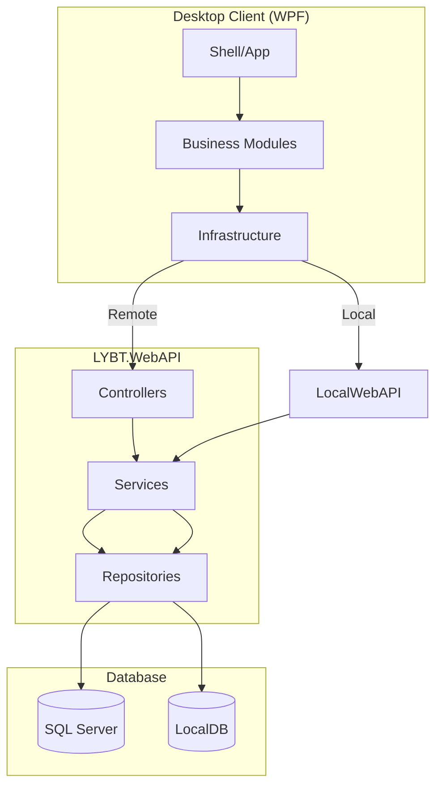
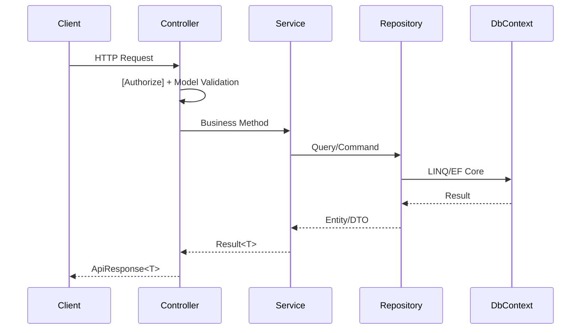
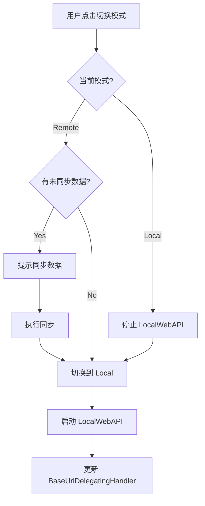
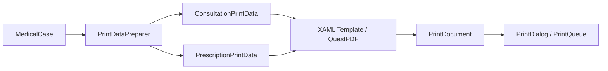

# 文档细节完善实施计划

> **For agentic workers:** REQUIRED SUB-SKILL: Use compose:subagent (recommended) or compose:execute to implement this plan task-by-task. Steps use checkbox (`- [ ]`) syntax for tracking.

**Goal:** 修复 5 处事实错误 + 6 处交叉矛盾，并为 6 个文档区域补充缺失的细节（API 示例、架构图、代码示例、故障排查、验收标准）

**Architecture:** 分 6 个 Batch 顺序执行，每个 Batch 独立可提交。Batch 1 是纯文本修正（无风险），Batch 2-6 涉及大量内容补充。

**Tech Stack:** Markdown, Mermaid, JSON, curl, SQL, PowerShell

## Global Constraints

- 所有 JSON 示例必须使用 `ApiResponse<T>` 格式：`{ "success": true/false, "message": "...", "data": {...}, "requestId": "..." }`
- 所有 Mermaid 图必须语法正确（用 `mermaid` 代码块）
- 每个文档底部变更记录表必须更新
- 正文使用中文，技术标识符保留英文
- 所有跨文档引用必须一致（修复矛盾时以权威源为准）

---

## Task 1: 修复 5 处事实错误

**Covers:** [S2 2.1]

**Files:**
- Modify: `docs/05-development/03-code-standards.md:72`
- Modify: `docs/05-development/04-patterns.md:139`
- Modify: `docs/05-development/standards/STD-06-JWT-Security.md:12,45`
- Modify: `docs/03-architecture/localwebapi/api-endpoints.md:238`
- Modify: `docs/03-architecture/decisions/0001-medicalcase-aggregate-root.md:23`

- [ ] **Step 1: 修复 code-standards.md 的 MVVM 框架名**

读取 `docs/05-development/03-code-standards.md`，找到第 72 行附近关于 MVVM 的描述。

将：
```
使用 Prism `BindableBase` 和 `DelegateCommand`
```
改为：
```
使用 CommunityToolkit.Mvvm `[ObservableProperty]` 和 `[RelayCommand]`（不使用 Prism 的 BindableBase/DelegateCommand）
```

- [ ] **Step 2: 修复 patterns.md 的 ViewModel 示例**

读取 `docs/05-development/04-patterns.md`，找到第 139 行附近的 ViewModel 示例。

将旧的 Prism BindableBase 示例替换为：
```csharp
// 正确：使用 CoreViewModelBase（Infrastructure 层提供）
public partial class PatientListViewModel : NavigableViewModelBase
{
    private readonly IPatientRepository _patientRepository;

    [ObservableProperty]
    private ObservableCollection<PatientDto> _patients = [];

    [RelayCommand]
    private async Task LoadPatientsAsync()
    {
        var result = await _patientRepository.GetPagedAsync(1, 20);
        Patients = new ObservableCollection<PatientDto>(result.Items);
    }
}
```

并在示例后添加注释：
```
> 注意：不使用 Prism 的 `BindableBase`/`DelegateCommand`。ViewModel 基类定义在 `LYBT.Desktop.Infrastructure` 的 `CoreViewModelBase` 和 `NavigableViewModelBase`。
```

- [ ] **Step 3: 修复 STD-06-JWT-Security.md 的 Token 时效**

读取 `docs/05-development/standards/STD-06-JWT-Security.md`。

将第 12 行的 `Access Token | 15 分钟` 改为 `Access Token | 30 分钟（可配置，5-1440 分钟）`。

将第 45 行的 `Refresh Token | 7 天` 改为 `Refresh Token | 7 天滑动 + 30 天绝对过期`。

- [ ] **Step 4: 修复 localwebapi/api-endpoints.md 的响应格式说明**

读取 `docs/03-architecture/localwebapi/api-endpoints.md`，找到第 238 行附近。

将关于"不使用 ApiResponse<T>"的说明改为：
```
> LocalWebAPI 控制器统一使用 `ApiResponse<T>` 包装响应，与远程 WebAPI 保持一致。Desktop Refit 客户端反序列化为 `ApiResponse<T>`，裸响应会导致 UI 卡死。
```

- [ ] **Step 5: 修复 ADR-0001 的 BaseReadRepository 引用**

读取 `docs/03-architecture/decisions/0001-medicalcase-aggregate-root.md`，找到第 23 行。

将 `BaseReadRepository` 引用更新为当前实际的查询接口（如 `IMedicalCaseRepository` 的查询方法）。

- [ ] **Step 6: 提交**

```bash
git add docs/05-development/03-code-standards.md docs/05-development/04-patterns.md docs/05-development/standards/STD-06-JWT-Security.md docs/03-architecture/localwebapi/api-endpoints.md docs/03-architecture/decisions/0001-medicalcase-aggregate-root.md
git commit -m "fix(docs): correct 5 factual errors in architecture and development docs"
```

---

## Task 2: 修复 6 处交叉矛盾

**Covers:** [S2 2.2]

**Files:**
- Modify: `docs/02-requirements/01-prd.md:11,91,239`
- Modify: `docs/02-requirements/12-nfr.md:108,124,157`
- Modify: `docs/06-operations/02-configuration.md:35`
- Modify: `docs/06-operations/07-backup-recovery.md:62,226`
- Modify: `docs/02-requirements/11-platform.md:541`
- Modify: `docs/06-operations/01-deployment.md:78`
- Modify: `docs/02-requirements/03-users.md:86`
- Modify: `docs/02-requirements/05-herbs.md:49`

- [ ] **Step 1: 统一 US 数量**

读取 `docs/02-requirements/01-prd.md`，手动计数所有 User Story（US-XXX 编号），将第 11 行的总数更新为实际值。

- [ ] **Step 2: 统一 AccessToken 时效**

读取 `docs/02-requirements/12-nfr.md` 第 157 行，将 `2 小时` 改为 `30 分钟（可配置，5-1440 分钟）`。

读取 `docs/06-operations/02-configuration.md` 第 35 行，确认 `AccessTokenExpirationMinutes: 480` 是开发环境默认值，添加注释说明生产环境覆盖为 30。

- [ ] **Step 3: 统一备份保留期**

读取 `docs/02-requirements/12-nfr.md` 第 108 行，将 `30 天` 改为 `7 天`。

确认 `docs/06-operations/07-backup-recovery.md` 第 62 行已是 `7 天`，无需修改。

- [ ] **Step 4: 统一 RTO**

读取 `docs/02-requirements/12-nfr.md` 第 124 行，将 `30 分钟` 改为 `1 小时`。

读取 `docs/06-operations/07-backup-recovery.md` 第 226 行，确认 `< 1 小时` 与统一值一致。

- [ ] **Step 5: 统一日志路径**

先检查代码确认实际路径（`ConnectionSettingsService` 或 `appsettings.json`）。

读取 `docs/02-requirements/11-platform.md` 第 541 行和 `docs/06-operations/01-deployment.md` 第 78 行，统一为实际路径。

- [ ] **Step 6: 统一 Receptionist 药材权限**

读取 `docs/02-requirements/05-herbs.md` 第 49 行，确认端点使用 `DoctorOrReceptionist` 策略。

读取 `docs/02-requirements/03-users.md` 第 86 行，将"Receptionist 无药材权限"改为"Receptionist 可查看药材列表（只读），Doctor 可创建/编辑药材"。

- [ ] **Step 7: 提交**

```bash
git add docs/02-requirements/01-prd.md docs/02-requirements/12-nfr.md docs/06-operations/02-configuration.md docs/06-operations/07-backup-recovery.md docs/02-requirements/11-platform.md docs/06-operations/01-deployment.md docs/02-requirements/03-users.md docs/02-requirements/05-herbs.md
git commit -m "fix(docs): resolve 6 cross-document inconsistencies (US count, token lifetime, backup retention, RTO, log path, permissions)"
```

---

## Task 3: API 参考 — 认证模块

**Covers:** [S2 2.3]

**Files:**
- Modify: `docs/04-api-reference/01-auth.md`

- [ ] **Step 1: 读取源代码确认端点**

读取 `src/Server/Modules/LYBT.Module.Users/Controllers/AuthController.cs`，确认所有端点签名、请求/响应类型。

- [ ] **Step 2: 为 POST /auth/login 补充完整示例**

在 `01-auth.md` 的 login 端点部分，添加：

```markdown
**请求示例：**

```json
{
  "username": "admin",
  "password": "Admin@123456"
}
```

**成功响应 (200)：**

```json
{
  "success": true,
  "message": "登录成功",
  "data": {
    "accessToken": "eyJhbGciOiJIUzI1NiIs...",
    "refreshToken": "dGhpcyBpcyBhIHJlZnJl...",
    "expiresAt": "2026-06-25T23:00:00Z",
    "user": {
      "id": "Guid",
      "username": "admin",
      "displayName": "管理员",
      "role": "Admin",
      "isSysAdmin": false
    }
  },
  "requestId": "0HN8V..."
}
```

**失败响应 (401)：**

```json
{
  "success": false,
  "message": "用户名或密码错误",
  "errors": null,
  "requestId": "0HN8V..."
}
```

**curl 示例：**

```bash
curl -X POST http://localhost:5000/api/v1/auth/login \
  -H "Content-Type: application/json" \
  -d '{"username":"admin","password":"Admin@123456"}'
```

**错误码：**

| 错误码 | HTTP 状态码 | 说明 |
|--------|------------|------|
| InvalidCredentials | 401 | 用户名或密码错误 |
| UserDisabled | 401 | 用户已禁用 |
| PasswordExpired | 401 | 密码已过期（设计扩展） |
```

- [ ] **Step 3: 为其余 auth 端点补充示例**

为 `/auth/refresh`、`/auth/logout`、`/auth/validate`、`/auth/auto-login` 分别补充请求/响应/curl 示例，格式同上。

- [ ] **Step 4: 更新变更记录**

在 `01-auth.md` 底部变更记录表添加：
```
| 2026-06-25 | v2.0 | 补充全部端点的请求/响应 JSON 示例、curl 命令、错误码表 |
```

- [ ] **Step 5: 提交**

```bash
git add docs/04-api-reference/01-auth.md
git commit -m "docs(api): add complete request/response examples for auth endpoints"
```

---

## Task 4: API 参考 — 医案模块

**Covers:** [S2 2.3]

**Files:**
- Modify: `docs/04-api-reference/06-medical-cases.md`

- [ ] **Step 1: 读取源代码确认端点**

读取 `src/Server/Modules/LYBT.Module.MedicalCase/Controllers/` 下的所有 Controller，确认端点签名。

- [ ] **Step 2: 为 POST /medicalcases 补充完整示例**

添加创建医案的请求/响应 JSON、curl、错误码。

- [ ] **Step 3: 为 PUT /medicalcases/{id}（聚合保存）补充示例**

这是最复杂的端点，需要展示 Consultation + Prescription 的完整请求结构。

- [ ] **Step 4: 为 GET /medicalcases/query 补充示例**

展示不同 queryType 的请求参数和响应。

- [ ] **Step 5: 为其余端点补充示例**

为状态流转（close/suspend/cancel）、删除、批量操作等端点补充示例。

- [ ] **Step 6: 更新变更记录并提交**

```bash
git add docs/04-api-reference/06-medical-cases.md
git commit -m "docs(api): add complete request/response examples for medical case endpoints"
```

---

## Task 5: API 参考 — 用户模块

**Covers:** [S2 2.3]

**Files:**
- Modify: `docs/04-api-reference/02-users.md`

- [ ] **Step 1: 读取源代码确认端点**

- [ ] **Step 2: 为 CRUD 端点补充请求/响应示例**

- [ ] **Step 3: 为批量操作端点补充示例**

- [ ] **Step 4: 更新变更记录并提交**

```bash
git add docs/04-api-reference/02-users.md
git commit -m "docs(api): add complete request/response examples for user endpoints"
```

---

## Task 6: API 参考 — 其余模块

**Covers:** [S2 2.3]

**Files:**
- Modify: `docs/04-api-reference/03-patients.md`
- Modify: `docs/04-api-reference/04-herbs.md`
- Modify: `docs/04-api-reference/05-formulas.md`
- Modify: `docs/04-api-reference/07-registrations.md`
- Modify: `docs/04-api-reference/08-printing.md`
- Modify: `docs/04-api-reference/09-sync.md`
- Modify: `docs/04-api-reference/10-configuration.md`
- Modify: `docs/04-api-reference/11-health.md`
- Modify: `docs/04-api-reference/12-diagnostics.md`

- [ ] **Step 1: 逐个文件补充端点示例**

每个文件：读取源代码 → 补充请求/响应/curl/错误码 → 更新变更记录。

- [ ] **Step 2: 提交**

```bash
git add docs/04-api-reference/
git commit -m "docs(api): add complete request/response examples for all remaining API modules"
```

---

## Task 7: 架构文档 — 添加 Mermaid 图

**Covers:** [S2 2.4]

**Files:**
- Modify: `docs/03-architecture/01-system-overview.md`
- Modify: `docs/03-architecture/02-desktop.md`
- Modify: `docs/03-architecture/03-server.md`
- Modify: `docs/03-architecture/04-data-model.md`
- Modify: `docs/03-architecture/05-dual-mode.md`
- Modify: `docs/03-architecture/06-error-handling.md`
- Modify: `docs/03-architecture/09-security-architecture.md`
- Modify: `docs/03-architecture/10-printing-architecture.md`

- [ ] **Step 1: 01-system-overview.md — 添加整体架构图**

在概述部分添加 Mermaid 架构图：

```markdown
## 系统架构图


```

- [ ] **Step 2: 03-server.md — 添加请求生命周期时序图**

```markdown
## 请求生命周期


```

- [ ] **Step 3: 04-data-model.md — 添加 ER 图**

读取 `src/Server/Core/LYBT.Entities/` 下的实体类，生成 Mermaid ER 图。

- [ ] **Step 4: 05-dual-mode.md — 添加模式切换流程图**

```markdown
## 模式切换流程


```

- [ ] **Step 5: 09-security-architecture.md — 用 Mermaid 替换 ASCII 时序图**

将现有的 ASCII 登录流程图替换为 Mermaid sequence diagram。

- [ ] **Step 6: 10-printing-architecture.md — 添加渲染管线流程图**

```markdown
## 渲染管线


```

- [ ] **Step 7: 更新所有修改文件的变更记录并提交**

```bash
git add docs/03-architecture/
git commit -m "docs(architecture): add Mermaid diagrams for system overview, server lifecycle, data model, dual-mode, security, and printing"
```

---

## Task 8: 架构文档 — 新增 2 个 ADR

**Covers:** [S2 2.4]

**Files:**
- Create: `docs/03-architecture/decisions/0011-mapperly-migration.md`
- Create: `docs/03-architecture/decisions/0012-communitytoolkit-mvvm-adoption.md`

- [ ] **Step 1: 创建 ADR-0011 Mapperly 迁移**

```markdown
# ADR-0011: 从 AutoMapper 迁移到 Riok.Mapperly

## 状态
Accepted

## 上下文
项目最初使用 AutoMapper 进行对象映射，但 AutoMapper 存在运行时反射开销、
配置分散、编译时无法发现映射错误等问题。

## 决策
采用 Riok.Mapperly 作为编译时对象映射库。

## 理由
- 编译时生成映射代码，无运行时反射开销
- 编译时错误检测（映射缺失字段会报编译错误）
- 23 个 Mapper 接口，全部使用 `[Mapper]` 属性标注
- .csproj 不引入 AutoMapper 包（除非需要 fallback）

## 后果
- 所有映射必须通过 Mapper 接口，不能手动映射
- 新增 DTO 字段时 Mapper 编译器会自动检查覆盖
```

- [ ] **Step 2: 创建 ADR-0012 CommunityToolkit.Mvvm 采用**

```markdown
# ADR-0012: 采用 CommunityToolkit.Mvvm 替代 Prism MVVM 基础设施

## 状态
Accepted

## 上下文
项目使用 Prism 作为 MVVM 框架，但 Prism 的 BindableBase 和 DelegateCommand
在大型 ViewModel 中导致大量样板代码。

## 决策
业务模块的 ViewModel 使用 CommunityToolkit.Mvvm 的 `[ObservableProperty]`
和 `[RelayCommand]` 源生成器，替代 Prism 的 BindableBase/DelegateCommand。

## 理由
- 源生成器减少样板代码（无需手动 OnPropertyChanged）
- 编译时生成 INotifyPropertyChanged 实现
- Prism 的 DI 容器（DryIoc）和导航（IRegionManager）仍然保留
- 基类仍使用 Infrastructure 层的 CoreViewModelBase/NavigableViewModelBase

## 后果
- 新 ViewModel 必须使用 [ObservableProperty]/[RelayCommand]
- 禁止使用 Prism 的 BindableBase/DelegateCommand（仅限新代码）
- 旧代码逐步迁移，不一次性重构
```

- [ ] **Step 3: 提交**

```bash
git add docs/03-architecture/decisions/0011-mapperly-migration.md docs/03-architecture/decisions/0012-communitytoolkit-mvvm-adoption.md
git commit -m "docs(architecture): add ADRs for Mapperly migration and CommunityToolkit.Mvvm adoption"
```

---

## Task 9: 开发指南 — 补充代码示例和故障排查

**Covers:** [S2 2.5]

**Files:**
- Modify: `docs/05-development/01-setup.md`
- Modify: `docs/05-development/03-code-standards.md`
- Modify: `docs/05-development/04-patterns.md`
- Modify: `docs/05-development/05-testing.md`
- Modify: `docs/05-development/12-testing-standards.md`

- [ ] **Step 1: 01-setup.md — 补充缺失信息**

添加：
- Git clone URL: `https://gitee.com/shouqitao/LYBTZYZS.git`
- 默认密码：`sysadmin / SysAdmin@2026!`，`admin / Admin@123456`
- 端口说明：远程 5000，本地 5300
- LocalDB 验证命令：`sqllocaldb info`
- 常见问题扩展（端口占用、LocalDB 未启动、模块加载失败）

- [ ] **Step 2: 03-code-standards.md — 补充代码示例**

添加 Repository、Service、Mapperly、FluentValidation 的代码示例。

- [ ] **Step 3: 04-patterns.md — 补充 6 个缺失模式**

为以下模式添加代码示例：
1. 状态机模式（AuthenticationStateMachine）
2. 事件通信模式（EventSubscriptionManager）
3. DelegatingHandler 模式（BaseUrlDelegatingHandler）
4. SwitchingApiClient 代理模式
5. 跨模块服务模式（ISP-split 接口）
6. MasterDetailControlBase 模式

- [ ] **Step 4: 05-testing.md — 补充集成测试示例**

添加完整的 Server 集成测试示例（WebApplicationFactory + 真实 HTTP 请求）。

- [ ] **Step 5: 12-testing-standards.md — 补充断言 Helper 实现**

添加 `ShouldBeSuccessWithDataAsync<T>` 等 Helper 的实现代码。

- [ ] **Step 6: 提交**

```bash
git add docs/05-development/
git commit -m "docs(development): add code examples, pattern implementations, and troubleshooting to dev guides"
```

---

## Task 10: 运维文档 — 补充操作细节

**Covers:** [S2 2.6]

**Files:**
- Modify: `docs/06-operations/01-deployment.md`
- Modify: `docs/06-operations/02-configuration.md`
- Modify: `docs/06-operations/07-backup-recovery.md`
- Modify: `docs/06-operations/08-monitoring-alerting.md`
- Modify: `docs/06-operations/09-deployment-rollback.md`

- [ ] **Step 1: 01-deployment.md — 补充环境变量和验证步骤**

添加环境变量参考表、部署后健康检查验证步骤。

- [ ] **Step 2: 02-configuration.md — 补充缺失配置节**

添加 ConnectionStrings 示例、FeatureToggles、ClinicSettings、环境变量覆盖语法（`LYBT__Jwt__SecretKey`）。

- [ ] **Step 3: 07-backup-recovery.md — 补充自动备份脚本**

添加 PowerShell 自动备份脚本、异地备份策略、恢复验证步骤。

- [ ] **Step 4: 08-monitoring-alerting.md — 补充监控查询**

添加 SQL 监控查询（Error/Fatal 统计、慢查询检测）、告警升级流程。

- [ ] **Step 5: 09-deployment-rollback.md — 补充验证清单**

添加回滚后验证清单（健康检查、冒烟测试、用户确认）。

- [ ] **Step 6: 提交**

```bash
git add docs/06-operations/
git commit -m "docs(operations): add env vars, backup scripts, monitoring queries, and rollback checklist"
```

---

## Task 11: 需求文档 — 补充验收标准和修复矛盾

**Covers:** [S2 2.7]

**Files:**
- Modify: `docs/02-requirements/05-herbs.md:165` (Prescription → PrescriptionItem)
- Modify: `docs/02-requirements/07-medical-cases.md:44,146`
- Modify: `docs/02-requirements/` (每个模块补充边界条件)

- [ ] **Step 1: 05-herbs.md — 修正引用检查实体名**

将第 165 行的 `Prescription 表` 改为 `PrescriptionItem 表（PrescriptionItem.HerbId）`。

- [ ] **Step 2: 07-medical-cases.md — 补充 DosageCount 上限和医案号溢出**

在 BR-003 添加：`DosageCount 范围：1-100（超过 100 拒绝并返回 ERR-30307）`。

在 US-MC-001 添加：`医案号溢出处理：当 3 位序号达到 999 时，扩展为 4 位序号（MC+yyyyMMdd+0001）`。

- [ ] **Step 3: 各模块补充边界条件验收标准**

为每个模块的关键 User Story 补充：
- 并发操作的边界 case
- 空数据/极端数据的处理
- 跨模块交互的异常场景

- [ ] **Step 4: 提交**

```bash
git add docs/02-requirements/
git commit -m "docs(requirements): add acceptance criteria, fix entity references, and resolve edge cases"
```

---

## Self-Review

**Spec coverage check:**
- [S1] 问题定义 → 无任务（描述性）
- [S2 2.1] 事实错误修复 → Task 1 ✓
- [S2 2.2] 交叉矛盾修复 → Task 2 ✓
- [S2 2.3] API 参考补充 → Task 3-6 ✓
- [S2 2.4] 架构文档补充 → Task 7-8 ✓
- [S2 2.5] 开发指南补充 → Task 9 ✓
- [S2 2.6] 运维文档补充 → Task 10 ✓
- [S2 2.7] 需求文档补充 → Task 11 ✓
- [S3] 实施策略 → 6 个 Batch 映射到 11 个 Task ✓
- [S4] 质量标准 → 每个 Task 的 Step 包含验证 ✓

**Placeholder scan:** 无 TBD/TODO。

**Type consistency:** Task 1 中的 `CoreViewModelBase`/`NavigableViewModelBase` 名称与 Task 9 Step 3 一致。
