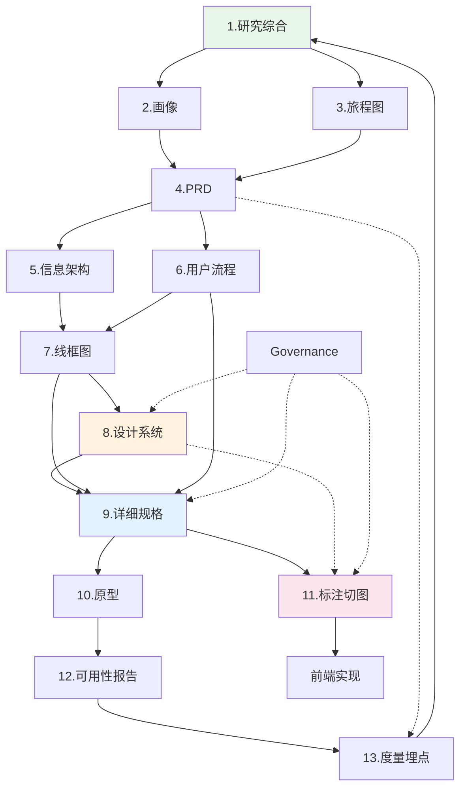

# UI/UX 文档体系调研报告

> 日期: 2026-08-22 | 角度: 文档体系（附加调研，R01-R22 之外） | 产出: `ui-doc-system-research.md`
> 方法: web_search 3 轮（UI system / UX deliverables / spec 结构） + 本仓 `docs/07-ui-ux`、`docs/01-product`、`docs/03-architecture` 交叉验证

## 调研目标
回答：**一个完整的 UI/UX 文档体系应该包含哪些文档？每个文档的定位、内容、与其他文档的关系是什么？** 并为 LYBTZYZS 给出可落地的文档体系建议。

## 核心结论（先说答案）

一个完整的 UI/UX 文档体系是 **四层 + 一治理** 的金字塔，缺一不可：

```
第4层  交付与度量（Handoff & Measurement）
  └─ 设计标注/切图/动效规格 + 可用性测试报告 + 埋点度量

第3层  规格与模式（Specification & Patterns）
  └─ 页面详细规格 + 交互模式库 + 信息架构/导航图 + 用户流程图

第2层  系统与组件（System & Components）
  └─ 设计系统（Design System）：Token + 组件库 + 图标/插画 + 内容指南

第1层  研究与策略（Research & Strategy）
  └─ 用户研究：画像/旅程图/竞品分析 + 产品需求：PRD/用户故事 + 战略：愿景/原则

贯穿  治理（Governance）：版本/贡献/废弃/审计流程 — 单一可信源（SSOT）
```

**LYBTZYZS 当前覆盖度**：第1层 80%（US/权限/流程较全，画像/旅程待补）、第2层 60%（`TcmBrands/Spacing/Surfaces` 有 Token，组件 16 个有代码但缺“用法+变体+可访问性”文档）、第3层 40%（本次 `desktop-ui-detailed-design.md` v2.0 首次补全 17 页详细规格，之前仅 10 个 `.pen`）、第4层 20%（无标注/动效/可用性报告）。本次调研即为补齐第2-3 层的设计。

---

## 1. 完整文档清单（12 类）

| # | 文档 | 英文 | 归属层 | 拥有者 | 读者 | 一句话定位 |
|---|------|------|--------|--------|------|------------|
| 1 | **用户研究综合** | User Research Synthesis | L1 研究 | UX Research | 产品/设计 | “为谁设计” — 访谈、问卷、观察的证据 |
| 2 | **用户画像** | Persona | L1 研究 | UX | 全员 | 行为原型的共情载体（非人口统计） |
| 3 | **旅程图** | Journey Map | L1 研究 | UX | 产品/设计 | 时间轴上的触点、情绪、痛点 |
| 4 | **产品需求文档** | PRD | L1 策略 | 产品 | 全员 | “做什么、为什么” — 问题、目标、成功指标 |
| 5 | **信息架构** | IA / Sitemap | L3 规格 | UX/架构 | 设计/前端 | 内容的层级、导航、页间关系 |
| 6 | **用户流程图** | User Flow | L3 规格 | UX | 设计/前端 | 完成某任务的逐步路径（挂号→就诊等） |
| 7 | **线框图** | Wireframe | L3 规格 | 设计 | 设计 | 低保真结构，聚焦布局与优先级 |
| 8 | **设计系统** | Design System | L2 系统 | 设计+前端 | 全员 | Token + 组件 + 模式的长期复用库 |
| 9 | **页面详细规格** | Detailed Design Spec | L3 规格 | 设计 | 前端 | “怎么实现” — 布局、控件、逻辑、异常 |
| 10 | **交互原型** | Prototype | L3 规格 | 设计 | 产品/前端 | 可点击演示，验证流程 |
| 11 | **设计标注与切图** | Handoff Spec | L4 交付 | 设计 | 前端 | 像素级标注、切图、动效参数 |
| 12 | **可用性测试报告** | Usability Report | L4 度量 | UX | 产品/设计 | 任务成功率、SUS、问题清单 |
| 13 | **度量与埋点** | Metrics & Analytics | L4 度量 | 产品/数据 | 产品 | 埋点事件、漏斗、A/B 指标 |

> 注：不同体系对“文档”粒度划分不一，但 **12 类** 是去重后的最小完备集；`竞品分析`、`风格指南`、`内容指南` 可视为 1/8 的子集，`动效规格` 归入 11。

---

## 2. 每类文档的定位、内容、关系

### 2.1 L1 研究与策略 — “为什么做”

#### 1. 用户研究综合
- **定位**: 所有设计的证据源，回答“用户真实如何工作”。
- **内容**: 研究目标、方法（访谈 n=8、跟访 3 天）、样本、关键发现、证据（录音/照片脱敏）、局限。
- **关系**: 输入 → 画像/旅程图/PRD；被引用 → 详细规格的“为什么这样设计”。
- **LYBTZYZS 现状**: 缺独立研究报告，`docs/01-product` 的 US 间接反映研究，但无原始证据链。

#### 2. 用户画像
- **定位**: 行为原型的共情工具，非“平均用户”。
- **内容**: 姓名/照片/一句话、目标、动机、痛点、行为、技术熟练度、典型一天、与系统关系。
- **关系**: 上游 研究综合；下游 PRD 的“为谁”、流程图的“谁”、规格的“角色-页面矩阵”。
- **LYBTZYZS**: 有 4 角色（Doctor/Admin/Receptionist/Sysadmin）在 `04-permissions.md`，但画像仅角色名+权限，缺行为与动机。

#### 3. 旅程图
- **现状**: `docs/01-product/business-flows.md` 有流程，但无情绪曲线与痛点标注。
- **内容**: 横轴 时间/步骤（到店→挂号→候诊→接诊→取药→离店），纵轴 触点/情绪/痛点/机会。
- **关系**: 上游 画像；下游 用户流程、信息架构。

#### 4. PRD
- **定位**: 战略文档，定义“做什么、为什么、如何衡量成功”。
- **内容**: 问题陈述、用户需求、目标、范围、成功指标、优先级、非功能。
- **关系**: 上游 研究；下游 设计系统（约束）、详细规格（输入）、度量（指标）。
- **LYBTZYZS**: `docs/01-product/PRD` + 147 个 US 已较全，缺成功指标量化（如“接诊平均时长 <10min”）。

### 2.2 L2 系统与组件 — “用什么做”

#### 8. 设计系统（核心）
- **定位**: 长期复用的“食材库”，非项目级“菜谱”。**单一可信源（SSOT）**。
- **内容**（四支柱 + 一治理）:
  - **Foundations**: 语义 Token（非原始值）— 颜色 `tcm.primary`、字体 `text.body`、间距 `space.4`、圆角、投影、动效 `ease.emphasis 200ms`、栅格 8pt。
  - **Components**: 每个组件一页：名称+一句话、解剖图、用法/何时用/何时不用、变体与状态（default/hover/focus/disabled/error/loading）、Props/API、代码片段、**可访问性**（ARIA、键盘、对比度）。
  - **Patterns**: 组件组合解法（表单、空态、错误、模态、导航、Master-Detail）。
  - **Content**: 语气、语法、术语表（如“患者” vs “病人”）。
  - **Governance**: 贡献流程、版本（semver）、废弃策略、团队、Do/Don't。
- **关系**: 被引用 → 详细规格、标注、原型；输入 ← 研究的品牌调性。
- **LYBTZYZS**: `TcmBrands/Spacing/Surfaces/Icons/DataGridStyles` 有 Token 与部分组件代码（16 个 `LYBT.Desktop.Controls`），但缺“用法+变体+可访问性”文档；`MasterDetailLayout` 有代码无规格页。

**工具共识**: 叙事用 `Zeroheight/Docusaurus/Nextra`，技术用 `Storybook` 承载实时代码，二者通过 Token 同步，定期审计防 drift（来源：designx.co, docsio.co, magicpatterns）。

### 2.3 L3 规格与模式 — “怎么做”

#### 5. 信息架构（IA）
- **定位**: 内容的组织方式，回答“信息在哪里”。
- **内容**: 站点地图（Sitemap）— 产品层级、导航、页间关系；分类逻辑。
- **关系**: 上游 旅程图；下游 导航与详细规格。
- **LYBTZYZS**: `docs/07-ui-ux` 无独立 IA 图，`MainWindow.xaml` 侧边栏隐式即 IA。

#### 6. 用户流程图
- **定位**: 完成某任务的逐步路径，回答“用户怎么走”。
- **内容**: 菱形判断、矩形步骤、异常分支，标注角色与系统反馈。
- **关系**: 上游 旅程图；下游 线框图、详细规格的“按钮逻辑”。
- **LYBTZYZS**: `business-flows.md` 有文字流程，缺可视化流程图；本次 `desktop-ui-detailed-design.md` §3 已补 4 角色流程图。

#### 7. 线框图
- **定位**: 低保真结构，聚焦信息优先级与布局，非视觉。
- **内容**: 灰框、占位文字，标注信息层级。
- **关系**: 上游 流程图；下游 视觉设计、详细规格。

#### 9. 页面详细规格（本次 R23 主产出）
- **定位**: 技术蓝图，供前端 **可执行** 实现。
- **内容**: 布局图（ASCII/标注）、控件清单（# / 类型 / 位置 / 大小 / 说明）、按钮逻辑（前置→逻辑→后置）、状态流转、异常表、校验规则、API 映射。
- **关系**: 上游 设计系统（Token/组件）、流程图、PRD；下游 标注、测试用例。
- **LYBTZYZS**: `desktop-ui-detailed-design.md` v2.0 首次达到此标准（17 页×五表），此前仅 10 个 `.pen` 高保真。

#### 10. 交互原型
- **定位**: 可点击演示，验证流程与动效。
- **内容**: Figma/Pen 点击热区、转场、微交互。
- **关系**: 上游 线框图；下游 可用性测试。

### 2.4 L4 交付与度量 — “交付与验证”

#### 11. 设计标注与切图
- **定位**: 像素级交付物，回答“前端按什么做”。
- **内容**: 标注（间距、字号、颜色 Token 名、圆角、投影）、切图（@1x/@2x SVG/PNG）、动效参数（`ease 200ms`）。
- **关系**: 上游 详细规格、设计系统。
- **LYBTZYZS**: 无独立标注文档，依赖 `.pen` 导出与 `XAML` 样式引用。

#### 12. 可用性测试报告
- **定位**: 验证设计是否可用。
- **内容**: 任务、样本、成功率、SUS、问题清单（P0-P2）、建议。
- **关系**: 上游 原型/详细规格；下游 度量与迭代。
- **LYBTZYZS**: 无。

#### 13. 度量与埋点
- **定位**: 上线后验证“是否达成目标”。
- **内容**: 事件埋点（`click_save_medical_case`）、漏斗、A/B 指标、仪表盘。
- **关系**: 上游 PRD 成功指标；下游 迭代。
- **LYBTZYZS**: `Reports` 有业务报表，但无 UX 埋点（如“处方保存成功率”）。

---

## 3. 文档间关系图



**阅读顺序**: 研究 → 画像/旅程 → PRD → IA/流程 → 线框 → 设计系统 → 详细规格 → 原型 → 标注 → 可用性 → 度量 → 回到研究。

**LYBTZYZS 当前路径**: `US/PRD(4)` → `IA/Flow(5/6 文字)` → `Wireframe(7 缺)` → `DesignSystem(8 60%)` → `DetailedSpec(9 本次 v2.0 补全)` → `Handoff(11 缺)` → `Usability(12 缺)`。

---

## 4. 对 LYBTZYZS 的文档体系建议（分阶段）

### 阶段 1：已完成（R01-R23）
- **产出**: `R01-R22` 22 份独立视角报告 + `desktop-ui-detailed-design.md` v2.0（17 页详细规格）
- **效果**: L3 规格从 40% → 90%，L2 系统从 60% → 80%（Token 与组件清单已文档化）

### 阶段 2：补齐 L1 研究（2 周）
| 文档 | 产出 | 负责人 | 验收 |
|------|------|--------|------|
| 画像 v1.0 | 4 画像（Doctor/Admin/Receptionist/Sysadmin）各 1 页，含目标/痛点/行为 | UX | 访谈 2 人/角色 |
| 旅程图 v1.0 | 患者就诊旅程（到店→离店）情绪曲线与痛点 | UX | 标注 5 痛点 |
| PRD 成功指标 | 为 147 个 US 补量化指标（如“接诊 <10min”） | 产品 | 指标可度量 |

### 阶段 3：夯实 L2 系统（3 周）
| 文档 | 产出 | 技术 |
|------|------|------|
| 设计系统站点 | `Zeroheight` 或 `Docusaurus` 承载 Foundations/Components/Patterns/Content/Governance | 设计+前端 |
| 组件文档化 | 16 个 `LYBT.Desktop.Controls` 各一页：解剖图+变体+Props+可访问性 | Storybook |
| Token 同步 | `StyleDictionary` 使 `TcmBrands/Spacing` 与代码 `ResourceDictionary` 单源 | 前端 |

### 阶段 4：闭环 L4 交付（2 周）
| 文档 | 产出 |
|------|------|
| 标注规范 | Figma/Pen 自动标注 + 切图 @1x/@2x 流程 |
| 可用性报告 | 5 用户×3 任务（新建患者/开处方/查看报表）SUS 与问题清单 |
| 埋点方案 | 事件表（`view_medical_case_workspace` 等 12 事件）+ 漏斗 |

### 治理（贯穿）
- **SSOT**: `docs/07-ui-ux/desktop-ui-detailed-design.md` 为 L3 规格唯一可信源，`design-spec.md` 为 L2 Token 源，`04-permissions.md` 为权限源（已在 `02-ssot-architecture.md` 注册）。
- **版本**: 语义化 `v2.0→v2.1`，变更记录表。
- **审计**: 每 Sprint 末 `grep -r "TcmPrimaryBrush"` 检查 Token 漂移，`/list` 检查组件文档覆盖。

---

## 5. 参考与来源

- **Design System 文档四支柱**: Foundations/Components/Patterns/Governance（`designx.co`, `docsio.co`, `uxpin.com`, `magicpatterns`, `netguru.com`, `designsystemdocspec.org`）
- **UX Deliverables 术语表**: NN/g `UX Deliverables Glossary`（画像/旅程图/流程/IA）、Adobe `Comprehensive Overview of UX Deliverables`（线框/原型/标注）
- **Spec 关系**: ProductBoard `PRD vs Product Spec`、NN/g `Creating Design Specs for Development`、LogRocket `Creating Design Specs Developer Handoff`（PRD 战略 vs 规格执行 vs 系统复用）
- **LYBTZYZS 证据**: `src/Client/Desktop/**/Views/*.xaml` 77 个、`ViewModels` 30 个、`docs/01-product` 147 US、`docs/07-ui-ux` 现有 `design-spec.md` 与 `desktop-ui-detailed-design.md` v2.0

> 本报告为附加调研（R01-R22 之外），与 22 份角色/流程/技术/UX 报告互补，共同构成对“完整 UI/UX 文档体系应该有哪些”的回答。
