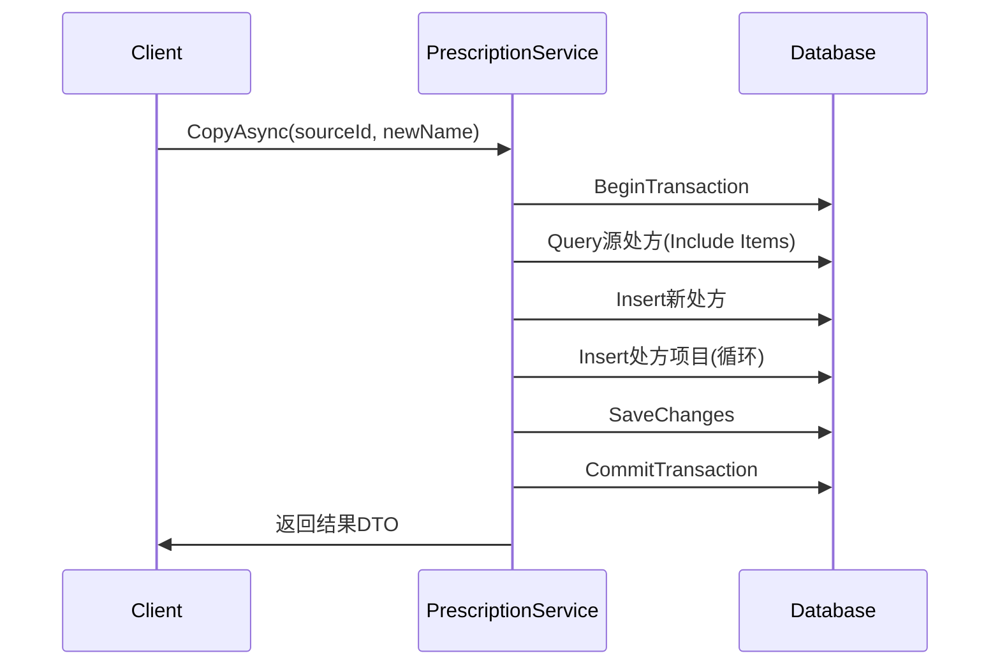
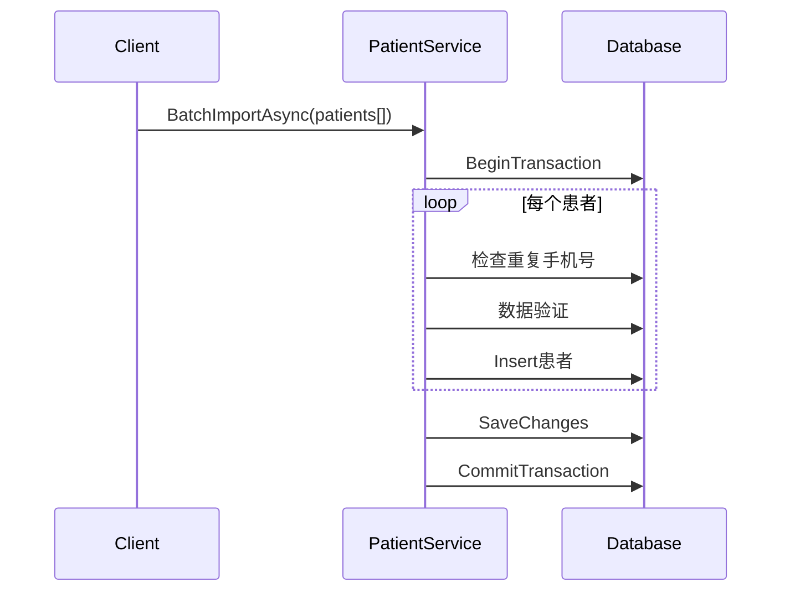
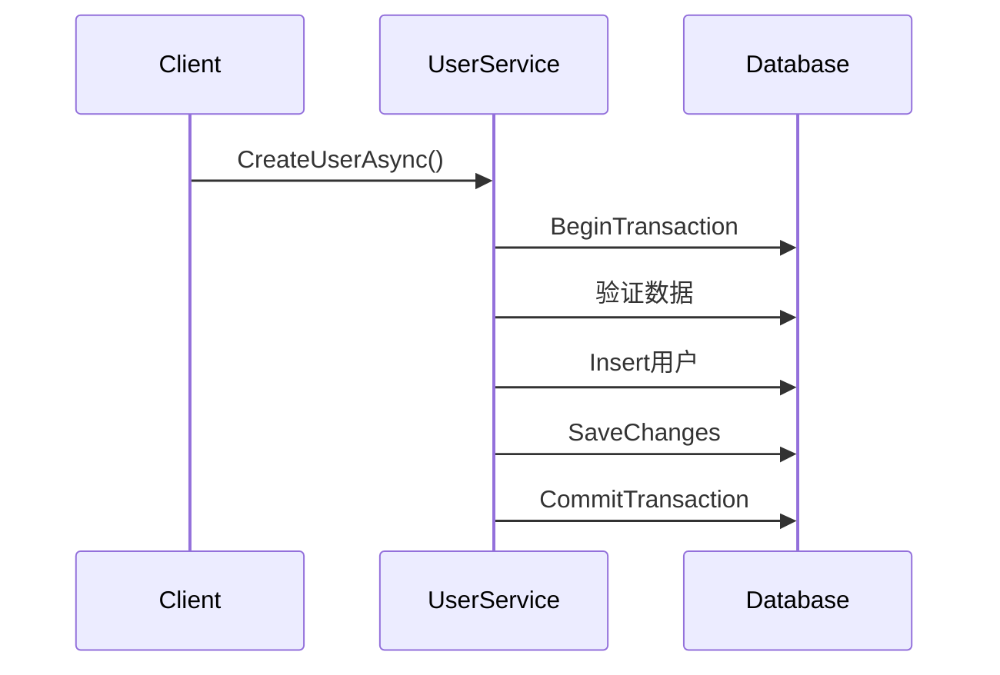

# 事务与写入现状审计报告

**审计时间**: 2025-01-31  
**审计范围**: 凌隐宝堂中医诊所诊疗系统 Server 端  
**目标**: 为事务优化决策提供依据（最小改动、零入侵）

## 1. SaveChanges 分布统计

### 1.1 总体统计
- **总SaveChanges调用**: 53次
- **涉及文件数**: 18个
- **BusinessService层**: 28次 (52.8%)
- **Repository层**: 15次 (28.3%)
- **初始化服务**: 3次 (5.7%)
- **基础设施**: 7次 (13.2%)

### 1.2 按模块分布

| 模块 | BusinessService | Repository | 总计 |
|------|----------------|------------|------|
| Users | 8次 | 3次 | 11次 |
| Patients | 6次 | 3次 | 9次 |
| MedicalCase | 10次 | 0次 | 10次 |
| Prescriptions | 1次 | 1次 | 2次 |
| Herbs | 1次 | 1次 | 2次 |
| Consultation | 1次 | 0次 | 1次 |
| Auth | 0次 | 2次 | 2次 |
| Formula | 1次 | 0次 | 1次 |
| Infrastructure | - | - | 3次 |

### 1.3 同方法多次SaveChanges清单

**发现问题**: 以下方法在同一作用域中多次调用SaveChanges：

```
无发现 - 所有SaveChanges调用都在单独的事务或方法中
```

### 1.4 关键SaveChanges调用点

#### 高频调用点
1. **UserBusinessService.cs**: 8次SaveChanges
   - `DisableAsync`: 行84
   - `EnableAsync`: 行123
   - `ResetPasswordAsync`: 行234
   - `ChangePasswordAsync`: 行290
   - `UpdateUserAsync`: 行333
   - `CreateUserAsync`: 行388 (事务中)
   - `UpdateUserAsync`: 行452 (事务中)
   - `DeleteAsync`: 行508

2. **MedicalCaseBusinessService.cs**: 10次SaveChanges
   - 各种状态变更方法，每个方法一次SaveChanges

3. **PatientBusinessService.cs**: 6次BusinessService + 3次Repository
   - 包含复杂的批量导入逻辑

## 2. 显式事务分析

### 2.1 事务使用统计
- **显式事务总数**: 15个
- **使用BeginTransactionAsync**: 15个
- **使用TransactionScope**: 0个
- **事务成功率检测**: 全部包含try-catch-rollback

### 2.2 事务分布详情

| 文件 | 事务数量 | 事务方法 |
|------|----------|----------|
| **OptimizedBaseRepository.cs** | 4个 | BulkInsertAsync, BulkUpdateAsync, BulkDeleteAsync, ExecuteInTransactionAsync |
| **UserBusinessService.cs** | 2个 | CreateUserAsync, UpdateUserAsync |
| **PrescriptionBusinessService.cs** | 1个 | CopyAsync |
| **PatientBusinessService.cs** | 6个 | CreateAsync, 各种批量操作 |
| **PatientRepository.cs** | 1个 | BulkUpdateFieldsAsync |
| **HerbBusinessService.cs** | 1个 | BatchImportAsync |

### 2.3 事务复杂度分析

#### 高复杂度事务
1. **PrescriptionBusinessService.CopyAsync** (行41-119)
   - 跨表操作: Prescriptions + PrescriptionItems
   - 涉及Include查询
   - 复制逻辑，数据一致性要求高

2. **PatientBusinessService.BatchImportAsync** (行347-424)
   - 循环中的复杂验证逻辑
   - 多个数据库查询
   - 错误收集机制

3. **HerbBusinessService.BatchImportAsync** (行52-140)
   - 循环导入+验证
   - 重复性检查
   - 错误累积处理

## 3. 跨表多步写操作分析

### 3.1 复杂业务流程识别

#### 3.1.1 处方复制流程 (高风险)


**风险点**:
- 跨Prescriptions + PrescriptionItems表
- 循环Insert操作
- 无并发控制
- 可能的数据不一致

#### 3.1.2 患者批量导入流程 (中风险)


**风险点**:
- 循环中重复查询
- 长事务
- 失败时全部回滚

#### 3.1.3 用户创建流程 (低风险)


### 3.2 潜在的聚合边界问题

#### 识别的跨聚合操作：
1. **处方-药材关联** (Prescription → Herb)
   - 处方项目引用药材信息
   - 无强一致性要求，但需要引用完整性

2. **医案-处方关联** (MedicalCase → Prescription)
   - 1:1关系，强一致性要求
   - 当前无事务保护

3. **患者-医案关联** (Patient → MedicalCase)
   - 1:N关系，删除时需要考虑级联

## 4. 同步阻塞问题分析

### 4.1 发现的阻塞调用
```
文件: UnifiedApplicationInitialization.cs:270
问题: app.StopAsync().GetAwaiter().GetResult()
位置: 优雅关闭处理
影响: 非写入路径，系统关闭时使用
建议: 保持现状，这是合理的同步等待
```

### 4.2 写入路径检查
**结果**: 所有业务写入路径均使用正确的异步模式，无阻塞风险。

## 5. 并发控制现状

### 5.1 实体并发字段检查

| 实体 | 并发控制字段 | 风险等级 | 说明 |
|------|-------------|----------|------|
| **Patient** | ❌ 无 | 🔴 高 | 患者信息并发修改风险 |
| **Herb** | ❌ 无 | 🟡 中 | 药材价格并发修改风险 |
| **Prescription** | ❌ 无 | 🔴 高 | 处方并发修改风险 |
| **PrescriptionItem** | ❌ 无 | 🟡 中 | 处方项目并发风险 |
| **MedicalCase** | ❌ 无 | 🟡 中 | 医案状态并发风险 |
| **User** | ❌ 无 | 🔴 高 | 用户信息并发修改风险 |
| **Consultation** | ❌ 无 | 🟡 中 | 诊断记录并发风险 |

### 5.2 关键并发场景
1. **患者信息修改**: 多个前台同时修改同一患者
2. **处方编辑**: 医生修改处方时护士同时查看
3. **药材价格更新**: 批量价格调整与单个修改冲突
4. **用户密码修改**: 管理员重置与用户自己修改冲突

## 6. SQL Server特性依赖分析

### 6.1 ExecuteUpdate/ExecuteDelete使用

#### ExecuteUpdateAsync调用 (13处)
```csharp
// 批量状态更新 - 高频使用
await _context.Users
    .Where(u => validIds.Contains(u.Id))
    .ExecuteUpdateAsync(setters => setters
        .SetProperty(u => u.Status, CommonStatus.Disabled));
```

**使用场景**:
- 用户批量启用/禁用 (2处)
- 药材批量状态更新 (1处)  
- 认证失败次数更新 (2处)
- 患者批量操作 (4处)
- 医案状态批量更新 (1处)

#### ExecuteDeleteAsync调用 (1处)
```csharp
// OptimizedBaseRepository中的批量删除
await _dbSet.Where(predicate).ExecuteDeleteAsync(cancellationToken);
```

### 6.2 原生SQL使用 (2处)
```csharp
// DatabaseInitializationService - 表验证
await _dbContext.Database.ExecuteSqlRawAsync("SELECT TOP 0 * FROM [TableName]");

// PatientRepository - 批量字段更新  
await _context.Database.ExecuteSqlRawAsync(sql, parameters);
```

### 6.3 事务语义依赖
- **CreateExecutionStrategy()**: 高频使用，SQL Server重试策略
- **隔离级别**: 使用默认 READ_COMMITTED
- **无显式锁**: 未使用表锁或行锁
- **无存储过程依赖**

## 7. 性能与可靠性评估

### 7.1 性能热点
1. **患者批量导入**: 循环查询，O(n)复杂度
2. **处方复制**: Include查询 + 循环插入
3. **药材导入**: 逐个重复性检查

### 7.2 可靠性风险
1. **无并发控制**: 所有实体均缺乏乐观并发控制
2. **长事务**: 批量操作可能造成锁等待
3. **部分原子性缺失**: 某些跨表操作未使用事务

### 7.3 数据一致性风险
1. **引用完整性**: 依赖外键约束，无应用层检查
2. **业务一致性**: 某些状态变更缺乏事务保护
3. **并发一致性**: 缺乏版本控制或时间戳

## 8. 优化建议优先级

### 8.1 高优先级 (P0)
1. **添加乐观并发控制**
   - 关键实体添加 RowVersion 字段
   - 高并发场景：Patient, User, Prescription

2. **事务边界优化**
   - 医案-处方创建使用事务
   - 批量操作性能优化

### 8.2 中优先级 (P1)
1. **长事务拆分**
   - 批量导入分批处理
   - 错误隔离机制

2. **查询优化**
   - 减少循环查询
   - 批量存在性检查

### 8.3 低优先级 (P2)
1. **监控增强**
   - 事务性能监控
   - 并发冲突检测

2. **代码规范**
   - 事务使用模式统一
   - 异常处理标准化

---

**审计结论**: 系统整体事务使用规范，但缺乏并发控制是主要风险点。建议优先实施乐观并发控制和关键事务边界优化。