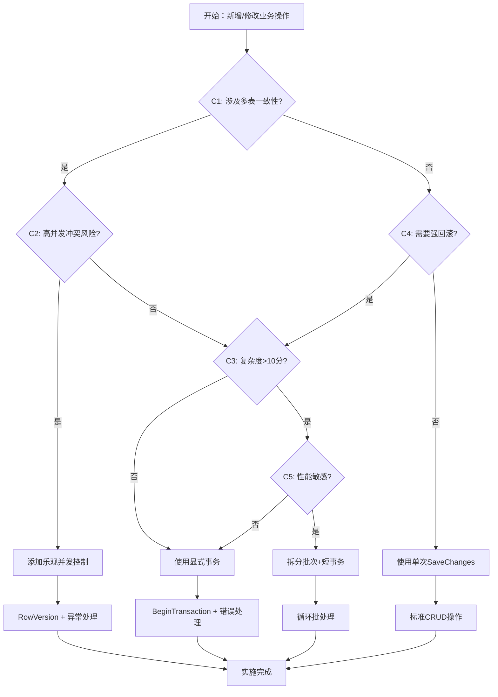

# 事务决策清单与最小改动策略

**决策依据文档版本**: v1.0  
**制定时间**: 2025-01-31  
**适用范围**: 凌隐宝堂中医诊所诊疗系统  
**目标**: 最小改动、零入侵事务优化决策支持

## 📋 事务决策判据体系

### C1: 数据一致性要求

**判断标准**: 操作是否涉及多个相关实体的状态一致性

**需要显式事务的情况**:
- ✅ **强一致性**: 处方-处方项目关联创建
- ✅ **业务原子性**: 医案状态变更+诊断记录更新
- ✅ **引用完整性**: 患者删除+相关医案状态变更
- ✅ **状态同步**: 用户状态变更+相关权限更新

**无需显式事务的情况**:
- ❌ **单实体操作**: 简单的CRUD操作
- ❌ **只读查询**: 搜索、统计、报表查询
- ❌ **幂等操作**: 状态设置、配置更新

**实施建议**:
```csharp
// ✅ 需要事务 - 跨表一致性
await using var transaction = await _context.Database.BeginTransactionAsync();
var prescription = new Prescription { /* ... */ };
_context.Prescriptions.Add(prescription);
// 添加处方项目
foreach(var item in prescriptionItems) {
    _context.PrescriptionItems.Add(item);
}
await _context.SaveChangesAsync();
await transaction.CommitAsync();
```

### C2: 并发冲突风险

**判断标准**: 同一数据被多用户同时修改的概率和影响

**高风险实体** (需要乐观并发控制):
- 🔴 **Patient**: 多个前台同时修改患者信息
- 🔴 **User**: 管理员重置密码 vs 用户自己修改
- 🔴 **Prescription**: 医生修改处方时护士查看
- 🟡 **Herb**: 药材价格批量调整冲突
- 🟡 **MedicalCase**: 诊断状态并发修改

**风险评估矩阵**:
| 实体 | 并发频率 | 冲突影响 | 风险等级 | 建议措施 |
|------|----------|----------|----------|----------|
| Patient | 高 | 严重 | 🔴 高 | 立即添加RowVersion |
| User | 中 | 严重 | 🔴 高 | 立即添加RowVersion |
| Prescription | 中 | 中等 | 🔴 高 | 添加RowVersion |
| Herb | 低 | 中等 | 🟡 中 | 批量操作优化 |
| MedicalCase | 低 | 低 | 🟡 中 | 状态检查加强 |

**实施建议**:
```csharp
// ✅ 添加乐观并发控制
public class Patient 
{
    public Guid Id { get; set; }
    public string Name { get; set; }
    [Timestamp]
    public byte[] RowVersion { get; set; } // 新增并发控制字段
}
```

### C3: 操作复杂度

**判断标准**: 操作步骤数、涉及表数、处理时间长度

**高复杂度操作** (需要显式事务):
- 🔴 **处方复制**: 跨Prescriptions + PrescriptionItems, 循环插入
- 🔴 **患者批量导入**: 循环验证+插入, 长时间占用
- 🟡 **药材导入**: 重复性检查+插入
- 🟡 **用户创建**: 验证+插入+权限设置

**复杂度评分标准**:
```
复杂度 = 涉及表数 × 2 + 操作步骤数 + 估计耗时(秒)

低复杂度 (≤5分): 单表操作，无需显式事务
中复杂度 (6-10分): 考虑事务，关注性能
高复杂度 (>10分): 必须使用事务，考虑拆分
```

**当前系统复杂度评估**:
| 操作 | 表数 | 步骤 | 耗时 | 分数 | 建议 |
|------|------|------|------|------|------|
| 处方复制 | 2 | 5 | 3秒 | 12 | 🔴 保持事务 |
| 患者批量导入 | 1 | 8 | 10秒 | 20 | 🔴 拆分批次 |
| 药材导入 | 1 | 6 | 5秒 | 13 | 🟡 优化查询 |
| 用户创建 | 1 | 4 | 1秒 | 7 | 🟡 保持现状 |

### C4: 失败回滚需求

**判断标准**: 操作失败时是否需要撤销已执行的部分

**强回滚需求** (必须使用事务):
- ✅ **财务相关**: 费用计算、优惠应用
- ✅ **状态流转**: 医案状态变更链
- ✅ **批量操作**: 全部成功或全部失败
- ✅ **关联创建**: 主子表联合创建

**弱回滚需求** (可选事务):
- 🔄 **日志记录**: 失败不影响主流程
- 🔄 **缓存更新**: 失败可重试
- 🔄 **统计数据**: 失败影响有限

**实施建议**:
```csharp
// ✅ 强回滚需求示例
try {
    await using var transaction = await _context.Database.BeginTransactionAsync();
    
    // 步骤1: 创建处方
    var prescription = await CreatePrescriptionAsync(dto);
    
    // 步骤2: 创建处方项目
    await CreatePrescriptionItemsAsync(prescription.Id, items);
    
    // 步骤3: 更新相关状态
    await UpdateMedicalCaseStatusAsync(prescription.MedicalCaseId);
    
    await _context.SaveChangesAsync();
    await transaction.CommitAsync();
    
} catch (Exception) {
    // 自动回滚，保证数据一致性
    throw;
}
```

### C5: 性能影响评估

**判断标准**: 事务对系统性能和并发的影响程度

**性能影响因子**:
- **事务持续时间**: 长事务增加锁等待
- **锁定资源范围**: 影响其他操作的并发度
- **批量操作规模**: 内存占用和锁升级风险
- **查询复杂度**: 循环查询影响性能

**性能优化策略**:

**高性能场景** (避免事务):
```csharp
// ✅ 使用EF Core批量操作，避免显式事务
await _context.Users
    .Where(u => userIds.Contains(u.Id))
    .ExecuteUpdateAsync(setters => setters
        .SetProperty(u => u.Status, CommonStatus.Disabled));
```

**平衡性能场景** (短事务):
```csharp
// ✅ 短事务，快速提交
await using var transaction = await _context.Database.BeginTransactionAsync();
// 批量准备数据
var entities = PrepareEntities(dtos);
_context.AddRange(entities);
await _context.SaveChangesAsync(); // 一次性提交
await transaction.CommitAsync();
```

**性能敏感场景** (拆分事务):
```csharp
// ✅ 分批处理，避免长事务
const int batchSize = 100;
for (int i = 0; i < items.Count; i += batchSize) {
    var batch = items.Skip(i).Take(batchSize);
    await using var transaction = await _context.Database.BeginTransactionAsync();
    await ProcessBatchAsync(batch);
    await _context.SaveChangesAsync();
    await transaction.CommitAsync();
}
```

## 🎯 最小改动策略

### Phase 1: 高优先级并发控制 (P0)

**目标**: 添加关键实体乐观并发控制，解决并发冲突风险

**改动内容**:
1. **实体模型增强**:
   ```csharp
   // Patient.cs, User.cs, Prescription.cs
   [Timestamp]
   public byte[] RowVersion { get; set; }
   ```

2. **EF Core配置**:
   ```csharp
   // 在EntityTypeConfiguration中
   builder.Property(e => e.RowVersion)
          .IsRowVersion()
          .IsConcurrencyToken();
   ```

3. **业务服务适配**:
   ```csharp
   // 更新操作增加并发检查
   try {
       await _context.SaveChangesAsync();
   } catch (DbUpdateConcurrencyException ex) {
       throw new BusinessException("数据已被其他用户修改，请重新加载后再试");
   }
   ```

**影响评估**:
- 🟢 **数据库**: 需要新增迁移，添加rowversion列
- 🟢 **API**: 现有API保持兼容，错误处理增强
- 🟢 **前端**: 需要处理并发冲突异常
- 📊 **工作量**: 2-3人天，风险低

### Phase 2: 事务边界优化 (P1)

**目标**: 优化现有事务使用，补充缺失的事务边界

**改动识别**:
1. **医案-处方关联创建**:
   ```csharp
   // MedicalCaseBusinessService.cs - 添加事务
   public async Task<ServiceResult<MedicalCaseDto>> CreateWithPrescriptionAsync(...)
   {
       await using var transaction = await _context.Database.BeginTransactionAsync();
       var medicalCase = await CreateMedicalCaseAsync(dto);
       var prescription = await CreatePrescriptionAsync(medicalCase.Id, prescriptionDto);
       await _context.SaveChangesAsync();
       await transaction.CommitAsync();
   }
   ```

2. **批量操作性能优化**:
   ```csharp
   // 分批处理替代大事务
   public async Task<ServiceResult<int>> BatchImportOptimizedAsync(List<ImportDto> items)
   {
       const int batchSize = 50; // 小批量，减少锁时间
       var totalCount = 0;
       
       for (int i = 0; i < items.Count; i += batchSize) {
           var batch = items.Skip(i).Take(batchSize);
           totalCount += await ProcessBatchWithTransactionAsync(batch);
       }
       
       return ServiceResult<int>.Success(totalCount);
   }
   ```

**影响评估**:
- 🟢 **现有代码**: 最小改动，主要是补充事务边界
- 🟢 **性能**: 批量操作优化，减少长事务
- 🟢 **稳定性**: 增强数据一致性保证
- 📊 **工作量**: 3-5人天，中等风险

### Phase 3: 长事务拆分优化 (P2)

**目标**: 解决长事务性能问题，优化用户体验

**优化重点**:
1. **患者批量导入分批处理**:
   ```csharp
   // PatientBusinessService.cs 改进
   public async Task<ServiceResult<BatchImportResult>> BatchImportWithProgressAsync(
       List<PatientImportDto> patients, 
       IProgress<ImportProgress> progress = null)
   {
       var result = new BatchImportResult();
       const int batchSize = 20; // 小批量避免长事务
       
       for (int i = 0; i < patients.Count; i += batchSize) {
           var batch = patients.Skip(i).Take(batchSize);
           var batchResult = await ProcessPatientBatchAsync(batch);
           result.Merge(batchResult);
           
           // 进度报告
           progress?.Report(new ImportProgress { 
               Processed = i + batch.Count(), 
               Total = patients.Count 
           });
       }
       
       return ServiceResult<BatchImportResult>.Success(result);
   }
   ```

2. **药材导入性能优化**:
   ```csharp
   // HerbBusinessService.cs 查询优化
   public async Task<ServiceResult<int>> ImportHerbsOptimizedAsync(List<HerbImportDto> herbs)
   {
       // 批量存在性检查，避免循环查询
       var existingNames = await _context.Herbs
           .Where(h => herbs.Select(dto => dto.Name).Contains(h.Name))
           .Select(h => h.Name)
           .ToListAsync();
       
       // 过滤重复，减少数据库操作
       var newHerbs = herbs.Where(dto => !existingNames.Contains(dto.Name));
       
       // 批量插入
       await using var transaction = await _context.Database.BeginTransactionAsync();
       _context.Herbs.AddRange(newHerbs.Select(dto => MapToHerb(dto)));
       await _context.SaveChangesAsync();
       await transaction.CommitAsync();
   }
   ```

**影响评估**:
- 🟡 **代码变更**: 中等改动量，重构批量操作逻辑
- 🟢 **用户体验**: 进度反馈，响应性提升
- 🟢 **系统稳定**: 减少长事务锁等待
- 📊 **工作量**: 5-8人天，中高风险

### Phase 4: 监控与诊断增强 (P3)

**目标**: 建立事务监控体系，支持运行时优化

**监控组件**:
1. **EF事务探针** (可选，开发环境):
   ```csharp
   // Infrastructure/Diagnostics/EfTxProbe.cs
   public class EfTransactionProbe : IDbCommandInterceptor
   {
       public async ValueTask<InterceptionResult<DbDataReader>> ReaderExecutingAsync(
           DbCommand command, 
           CommandEventData eventData, 
           InterceptionResult<DbDataReader> result,
           CancellationToken cancellationToken = default)
       {
           if (eventData.Context?.Database.CurrentTransaction != null)
           {
               _logger.LogDebug("Transaction SQL: {Command} [Duration: {Duration}ms]", 
                   command.CommandText.Substring(0, Math.Min(100, command.CommandText.Length)),
                   eventData.Duration.TotalMilliseconds);
           }
           
           return result;
       }
   }
   ```

2. **并发冲突监控**:
   ```csharp
   // GlobalExceptionHandler.cs 增强
   private async Task<IResult> HandleConcurrencyExceptionAsync(
       HttpContext context, 
       DbUpdateConcurrencyException ex)
   {
       _logger.LogWarning("Concurrency conflict detected: {Entity} {Id}", 
           ex.Entries.FirstOrDefault()?.Entity.GetType().Name,
           ex.Entries.FirstOrDefault()?.Property("Id")?.CurrentValue);
           
       // 统计并发冲突频率
       await _metrics.IncrementConcurrencyConflictAsync();
       
       return Results.Problem(
           title: "数据并发冲突",
           detail: "数据已被其他用户修改，请重新加载后再试");
   }
   ```

**影响评估**:
- 🟢 **生产影响**: 零影响，仅开发环境启用监控
- 🟢 **运维能力**: 提升问题诊断效率
- 🟢 **优化决策**: 数据驱动的进一步优化
- 📊 **工作量**: 2-3人天，低风险

## 📊 决策流程图



## 🎯 实施优先级与时间线

### 立即实施 (1-2周)
- ✅ **P0-1**: Patient实体添加RowVersion (1天)
- ✅ **P0-2**: User实体添加RowVersion (1天)
- ✅ **P0-3**: Prescription实体添加RowVersion (1天)
- ✅ **P0-4**: 并发异常处理适配 (2天)

### 短期实施 (2-4周)
- 🔄 **P1-1**: 医案-处方事务边界补充 (3天)
- 🔄 **P1-2**: 批量操作分批优化 (5天)
- 🔄 **P1-3**: 循环查询性能优化 (3天)

### 中期实施 (1-2月)
- ⏳ **P2-1**: 患者导入进度反馈机制 (5天)
- ⏳ **P2-2**: 药材导入批量优化 (3天)
- ⏳ **P2-3**: 长事务拆分重构 (8天)

### 长期监控 (持续)
- 📊 **P3-1**: EF事务监控探针 (2天)
- 📊 **P3-2**: 并发冲突统计系统 (3天)
- 📊 **P3-3**: 性能基线建立 (持续)

## 📋 实施检查清单

### Phase 1 完成标准
- [ ] 3个核心实体(Patient/User/Prescription)添加RowVersion字段
- [ ] EF Core迁移文件生成并测试
- [ ] 并发冲突异常处理代码完成
- [ ] 前端并发错误提示适配
- [ ] 单元测试覆盖并发场景

### Phase 2 完成标准  
- [ ] 医案-处方关联创建使用事务
- [ ] 批量操作拆分为50条/批次
- [ ] 循环查询优化为批量查询
- [ ] 性能测试验证改进效果
- [ ] 回归测试保证功能正确性

### Phase 3 完成标准
- [ ] 导入操作支持进度反馈
- [ ] 长事务(>5秒)全部拆分优化
- [ ] 用户体验测试验证响应性
- [ ] 系统负载测试通过
- [ ] 生产环境监控部署

---

**文档维护**: 随着实施进展，本文档需要及时更新决策结果和新发现的优化点。

**决策原则**: 最小改动、零入侵、数据驱动、渐进优化。