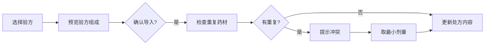

# 处方开具界面交互设计规范

## 一、界面布局设计

### 1.1 整体布局结构
```
┌──────────────────────────────────────────────────────────┐
│                     处方开具                              │
├──────────────────────────────────────────────────────────┤
│ 患者：张三  男  35岁  电话：138****1234                    │
├──────────────────────────────────────────────────────────┤
│ ┌─────────────────┬────────────────────────────────────┐ │
│ │                 │                                    │ │
│ │   验方快速      │        处方内容区                   │ │
│ │   选择区        │     （药材输入和展示）              │ │
│ │                 │                                    │ │
│ │ [个人验方]      │  ┌─────────────────────────────┐  │ │
│ │ [共享验方]      │  │  药材快速输入栏（同Formula）  │  │ │
│ │ [经典验方]      │  └─────────────────────────────┘  │ │
│ │                 │                                    │ │
│ │  验方列表       │  ┌─────────────────────────────┐  │ │
│ │  ┌──────────┐  │  │                              │  │ │
│ │  │小柴胡汤   │  │  │    已添加药材展示区           │  │ │
│ │  │四物汤     │  │  │  （WrapPanel布局，4列）       │  │ │
│ │  │理中丸     │  │  │                              │  │ │
│ │  └──────────┘  │  └─────────────────────────────┘  │ │
│ │                 │                                    │ │
│ │ [预览] [导入]   │  处方信息：共X味药 预计：￥XXX      │ │
│ └─────────────────┴────────────────────────────────────┘ │
│                                                          │
│ [保存草稿]  [价格计算]  [打印预览]  [确认开方]           │
└──────────────────────────────────────────────────────────┘
```

### 1.2 区域功能说明

#### 验方快速选择区（左侧）
- **宽度**：300px固定宽度
- **功能**：快速浏览和选择验方
- **分类标签**：个人/共享/经典
- **操作按钮**：预览（查看组成）、导入（添加到处方）

#### 处方内容区（右侧主区域）
- **药材输入栏**：复用AddFormulaDialog的输入方式
- **已添加展示**：WrapPanel布局，每行4个药材标签
- **统计信息**：实时显示药材数量和预估价格

## 二、交互流程设计

### 2.1 验方导入流程



#### 具体交互步骤：
1. **选择验方**：点击左侧验方列表项
2. **预览组成**：弹出浮层显示验方药材组成
3. **确认导入**：点击"导入"按钮
4. **冲突处理**：
   - 系统检测重复药材
   - 弹出提示："已存在药材[麻黄]，原剂量10g，新剂量15g，将使用较小剂量10g"
   - 用户可选择：确认/手动调整/取消
5. **添加完成**：药材添加到处方内容区

### 2.2 单味药输入流程（复用AddFormulaDialog逻辑）

#### 输入方式：
1. **拼音搜索**：输入"mh"快速定位"麻黄"
2. **中文搜索**：直接输入"麻"联想相关药材
3. **批量粘贴**：支持"白芍25 川芎50"格式

#### 快捷键支持：
- `Tab`/`Enter`：从药名跳转到剂量输入
- `Enter`（剂量框）：添加药材并清空输入
- `Ctrl+V`：批量粘贴药材
- `Delete`：删除选中的药材标签

## 三、药材展示设计

### 3.1 药材标签样式

```html
<!-- 单个药材标签 -->
<Border>
    <StackPanel Orientation="Horizontal">
        <TextBlock>麻黄 10g</TextBlock>
        <Button>×</Button>  <!-- 删除按钮 -->
    </StackPanel>
</Border>
```

**视觉规范**：
- 背景色：#F0F0F0
- 圆角：3px
- 内边距：10px 5px
- 最小宽度：120px
- 每行显示：4个药材
- 换行方式：自动换行（WrapPanel）

### 3.2 药材分组显示（多验方情况）

```
【小柴胡汤】
柴胡 24g    黄芩 9g     人参 9g     半夏 9g
生姜 9g     大枣 9g     甘草 6g

【加味】
麻黄 10g    桂枝 15g

【手动添加】
白术 15g    茯苓 20g
```

## 四、剂量冲突处理规则

### 4.1 冲突检测时机
- 验方导入时
- 批量粘贴时
- 手动添加重复药材时

### 4.2 处理策略

| 场景 | 处理方式 | 提示信息 |
|------|----------|----------|
| 单个验方导入 | 直接覆盖 | "将使用验方中的剂量" |
| 多个验方合并 | 取最小值 | "药材[X]在多个验方中出现，取最小剂量" |
| 手动添加重复 | 询问用户 | "是否替换原有剂量？" |

### 4.3 冲突提示界面

```
┌─────────────────────────────────┐
│        剂量冲突提示              │
├─────────────────────────────────┤
│ 检测到以下药材重复：             │
│                                 │
│ 药材    原剂量   新剂量   建议   │
│ 麻黄    10g      15g      10g    │
│ 桂枝    15g      20g      15g    │
│                                 │
│ ☑ 使用建议剂量（最小值原则）      │
│                                 │
│ [确认]  [手动调整]  [取消]       │
└─────────────────────────────────┘
```

## 五、价格计算与折扣功能

### 5.1 实时计算显示
- **位置**：处方内容区底部
- **格式**：`共12味药 | 单剂：¥28.50 | 7剂：¥199.50 | 折后：¥179.55`
- **更新时机**：添加/删除/修改药材后立即更新

### 5.2 价格明细与折扣设置

点击"价格计算"按钮后显示：

```
┌──────────────────────────────────┐
│         处方价格明细              │
├──────────────────────────────────┤
│ 药材名称   剂量   单价   小计      │
│ 麻黄      10g    ¥2.0   ¥2.0     │
│ 桂枝      15g    ¥1.5   ¥2.25    │
│ ...                               │
├──────────────────────────────────┤
│ 单剂合计：¥28.50                  │
│ 剂数：7（默认）  [修改]           │
│ 原价：¥199.50                     │
│                                   │
│ 折扣：[9.0]折  快捷：[8折][9折]   │
│ 折后价：¥179.55                   │
│                                   │
│ 用法：[每日1剂，分2次服___]       │
│      [先煎附子30分钟______]       │
└──────────────────────────────────┘
```

### 5.3 折扣权限控制
- **普通医生**：最低8折
- **主任医生**：最低7折
- **管理员**：无限制

## 六、批量操作功能

### 6.1 剂量批量调整
- **全部调整**：所有药材剂量 × 系数
- **分类调整**：选中特定药材批量修改
- **快捷操作**：
  - 儿童剂量（×0.5）
  - 成人加强（×1.5）

### 6.2 药材排序
- **拖拽排序**：支持拖动调整顺序
- **自动排序**：按功效分类排序
- **传统排序**：君臣佐使顺序

## 七、数据保存策略

### 7.1 自动保存
- **触发条件**：每次修改后5秒
- **保存内容**：草稿状态的处方
- **恢复机制**：意外退出后可恢复

### 7.2 版本管理
- **修改历史**：记录每次修改
- **撤销/重做**：支持Ctrl+Z/Ctrl+Y
- **版本对比**：查看修改前后差异

## 八、性能优化

### 8.1 加载优化
- 验方列表延迟加载
- 药材搜索结果缓存
- 价格计算防抖处理

### 8.2 交互优化
- 输入框自动聚焦
- Tab顺序合理
- 响应时间 < 200ms

## 九、错误处理

### 9.1 输入验证
- 药材名称验证
- 剂量范围检查（0.1-999）
- 特殊药材警告（毒性药材）

### 9.2 异常恢复
- 网络断开时本地保存
- 服务异常时友好提示
- 数据冲突时版本选择

## 十、处方打印格式

### 10.1 打印内容布局

```
════════════════════════════════════════════════════════════
                    凌隐宝堂中医诊所
                   地址：XX市XX区XX路XX号
                    电话：0512-88888888
────────────────────────────────────────────────────────────
                        中药处方单
                                   
处方编号：RX20250108001            日期：2025-01-08
────────────────────────────────────────────────────────────
患者姓名：张三          性别：男        年龄：35岁
联系电话：138****1234
诊断结果：风寒感冒，头痛鼻塞，恶寒发热
────────────────────────────────────────────────────────────
Rp.
    麻黄 10g      桂枝 15g      白芍 20g      甘草 6g
    生姜 9g       大枣 9g       杏仁 12g      石膏 30g
    黄芩 9g       黄连 6g       黄柏 9g       栀子 12g
    
    共12味药
────────────────────────────────────────────────────────────
剂数：7剂
用法：每日1剂，水煎服，分早晚两次温服
      附子先煎30分钟，薄荷后下
────────────────────────────────────────────────────────────
费用：
    原价：￥199.50
    折扣：9折
    应付：￥179.55
────────────────────────────────────────────────────────────
医师：李医生                    签名：___________

药师审核：___________           发药：___________
════════════════════════════════════════════════════════════
```

### 10.2 打印设置选项
- **纸张大小**：A5/A4可选
- **打印份数**：默认2份（患者1份，存档1份）
- **打印内容**：
  - ☑ 诊断结果
  - ☑ 价格信息
  - ☑ 用法说明
  - ☐ 煎药指南（可选附页）

### 10.3 打印预览功能
- 所见即所得预览
- 支持调整字体大小
- 支持导出PDF

## 十一、扩展功能（预留）

### 11.1 智能推荐
- 基于症状推荐验方
- 基于配伍推荐加减
- 基于历史推荐常用组合

### 11.2 模板管理
- 保存为个人模板
- 导入导出功能
- 分享给其他医生

---

**文档版本**: 1.1
**创建日期**: 2025-01-08
**最后更新**: 2025-01-08
**状态**: 已确认