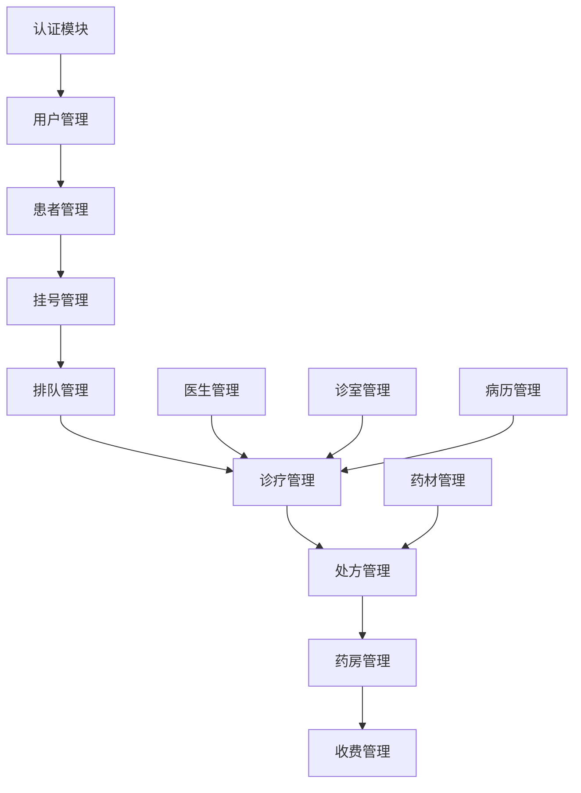

# WebAPI与WPF项目模块对比分析报告

**生成时间**: 2025-07-30  
**分析对象**: LYBT中医诊所管理系统  

---

## 📊 模块对比总览

### WebAPI已实现的控制器 (18个)

| 序号 | 控制器 | WebAPI状态 | WPF前端状态 | 优先级 | 备注 |
|------|--------|-----------|------------|-------|------|
| 1 | AuthController | ✅ 已实现 | ✅ 已实现 | 🟢 完成 | 登录认证功能 |
| 2 | UsersController | ✅ 已实现 | ✅ 已实现 | 🟢 完成 | 用户管理模块 |
| 3 | PatientsController | ✅ 已实现 | ✅ 已实现 | 🟢 完成 | 患者管理模块 |
| 4 | HerbsController | ✅ 已实现 | ✅ 已实现 | 🟢 完成 | 药材管理模块 |
| 5 | RecordsController | ✅ 已实现 | ✅ 已实现 | 🟢 完成 | 病历管理模块 |
| 6 | DoctorsController | ✅ 已实现 | ✅ 部分实现 | 🟡 需补充 | 医生管理，WPF仅有诊疗视图 |
| 7 | QueueingController | ✅ 已实现 | ✅ 部分实现 | 🟡 需补充 | 排队管理，WPF功能简单 |
| 8 | RegistrationController | ✅ 已实现 | ✅ 部分实现 | 🟡 需补充 | 挂号管理，WPF功能简单 |
| 9 | FormulaTemplatesController | ✅ 已实现 | ✅ 部分实现 | 🟡 需补充 | 验方模板，WPF为处方模板 |
| 10 | PrescriptionsController | ✅ 已实现 | ❌ 缺失 | 🔴 高优先级 | 处方管理完全缺失 |
| 11 | PharmacyController | ✅ 已实现 | ✅ 框架存在 | 🟡 需补充 | 药房管理，WPF仅有框架 |
| 12 | BillingController | ✅ 已实现 | ✅ 框架存在 | 🟡 需补充 | 收费管理，WPF为收银模块 |
| 13 | DiagnosisTreatmentController | ✅ 已实现 | ❌ 缺失 | 🔴 高优先级 | 诊疗管理完全缺失 |
| 14 | TreatmentRoomController | ✅ 已实现 | ❌ 缺失 | 🔴 高优先级 | 诊室管理完全缺失 |
| 15 | SyncController | ✅ 已实现 | ❌ 缺失 | 🟠 中优先级 | 数据同步功能缺失 |
| 16 | UnifiedConfigController | ✅ 已实现 | ❌ 缺失 | 🟠 中优先级 | 统一配置管理缺失 |
| 17 | UnifiedLogsController | ✅ 已实现 | ❌ 缺失 | 🟠 中优先级 | 统一日志管理缺失 |
| 18 | HealthController | ✅ 已实现 | ❌ 不需要 | ⚪ 系统级 | 健康检查，前端不需要 |

---

## 🔴 高优先级缺失模块 (需要立即实现)

### 1. 处方管理模块 (PrescriptionsController)

**重要性**: ⭐⭐⭐⭐⭐ (核心业务)

**WebAPI功能**:
- 处方CRUD操作
- 智能处方推荐
- 处方审核流程
- 处方打印
- 处方统计

**WPF需要实现**:
- 处方创建和编辑界面
- 处方列表和搜索
- 处方审核工作流
- 处方打印功能
- 智能推荐集成

### 2. 诊疗管理模块 (DiagnosisTreatmentController)

**重要性**: ⭐⭐⭐⭐⭐ (核心业务)

**WebAPI功能**:
- 诊疗记录管理
- 诊断信息录入
- 治疗方案制定
- 诊疗历史查询

**WPF需要实现**:
- 诊疗记录界面
- 诊断录入表单
- 治疗方案管理
- 诊疗历史查看

### 3. 诊室管理模块 (TreatmentRoomController)

**重要性**: ⭐⭐⭐⭐ (重要业务)

**WebAPI功能**:
- 诊室信息管理
- 诊室状态控制
- 诊室分配
- 诊室使用统计

**WPF需要实现**:
- 诊室状态监控
- 诊室分配界面
- 诊室使用管理
- 实时状态更新

---

## 🟡 中优先级需要补充的模块

### 4. 医生管理模块 (DoctorsController)

**当前状态**: WPF仅有诊疗视图，缺少医生信息管理

**需要补充**:
- 医生信息管理界面
- 医生排班管理
- 医生权限设置
- 医生统计报表

### 5. 药房管理模块 (PharmacyController)

**当前状态**: WPF仅有框架，功能未实现

**需要补充**:
- 药品出入库管理
- 药房库存监控
- 药品调剂界面
- 药房统计报表

### 6. 收费管理模块 (BillingController)

**当前状态**: WPF有收银模块框架

**需要补充**:
- 收费标准管理
- 费用计算引擎
- 收费记录查询
- 财务统计报表

---

## 🟠 低优先级支持模块

### 7. 数据同步模块 (SyncController)

**功能**: 数据备份、恢复、同步
**实现优先级**: 低 (系统稳定后考虑)

### 8. 统一配置管理 (UnifiedConfigController)

**功能**: 系统参数配置、业务规则设置
**实现优先级**: 低 (可用现有配置文件替代)

### 9. 统一日志管理 (UnifiedLogsController)

**功能**: 操作日志查询、系统日志分析
**实现优先级**: 低 (调试和运维功能)

---

## 📂 WPF项目结构分析

### 已实现的核心服务

```
Frontend/Desktop/Services/
├── ApiService.cs              // ✅ API通讯基础服务
├── AuthenticationService.cs   // ✅ 认证服务
├── TokenManager.cs            // ✅ Token管理
├── UserService.cs             // ✅ 用户服务
├── PatientService.cs          // ✅ 患者服务
├── HerbService.cs             // ✅ 药材服务
├── RecordService.cs           // ✅ 病历服务
└── PrescriptionPrintService.cs // ✅ 处方打印服务
```

### 缺失的关键服务

```
需要创建的服务:
├── IDoctorService.cs          // ❌ 医生管理服务
├── IPrescriptionService.cs    // ❌ 处方管理服务  
├── IDiagnosisService.cs       // ❌ 诊疗服务
├── ITreatmentRoomService.cs   // ❌ 诊室管理服务
├── IPharmacyService.cs        // ❌ 药房管理服务
├── IBillingService.cs         // ❌ 收费管理服务
├── IQueueingService.cs        // ❌ 排队管理服务
└── IRegistrationService.cs    // ❌ 挂号管理服务
```

---

## 🎯 实现计划建议

### 第一阶段: 核心业务模块 (高优先级)

**时间估计**: 2-3周

1. **处方管理模块**
   - 创建 IPrescriptionService 和 PrescriptionService
   - 实现处方管理界面 (CRUD)
   - 集成智能处方推荐
   - 处方打印功能增强

2. **诊疗管理模块**
   - 创建 IDiagnosisService 和 DiagnosisService
   - 实现诊疗记录界面
   - 诊断录入和治疗方案
   - 诊疗历史查询

3. **诊室管理模块**
   - 创建 ITreatmentRoomService 和 TreatmentRoomService
   - 实现诊室状态监控
   - 诊室分配和管理
   - 实时状态更新

### 第二阶段: 辅助业务模块 (中优先级)

**时间估计**: 2-3周

4. **医生管理增强**
   - 完善医生信息管理
   - 排班管理功能
   - 权限设置界面

5. **药房管理实现**
   - 药品出入库界面
   - 库存监控功能
   - 调剂工作台

6. **收费管理完善**
   - 收费标准设置
   - 费用计算集成
   - 财务报表功能

### 第三阶段: 系统完善 (低优先级)

**时间估计**: 1-2周

7. **系统管理功能**
   - 配置管理界面
   - 日志查询功能
   - 数据同步工具

---

## 🔧 技术实现要点

### 1. 服务层架构
```csharp
// 统一的服务接口模式
public interface IBaseService<T>
{
    Task<List<T>> GetAllAsync();
    Task<T> GetByIdAsync(Guid id);
    Task<bool> CreateAsync(T entity);
    Task<bool> UpdateAsync(T entity);
    Task<bool> DeleteAsync(Guid id);
}
```

### 2. MVVM模式一致性
```csharp
// 统一的ViewModel基类
public abstract class BaseViewModel : BindableBase
{
    protected IApiService ApiService { get; }
    protected IDialogService DialogService { get; }
    // 通用属性和方法
}
```

### 3. 数据绑定模式
```xml
<!-- 统一的界面布局模式 -->
<Grid>
    <Grid.RowDefinitions>
        <RowDefinition Height="Auto"/>    <!-- 工具栏 -->
        <RowDefinition Height="*"/>       <!-- 数据显示 -->
        <RowDefinition Height="Auto"/>    <!-- 状态栏 -->
    </Grid.RowDefinitions>
</Grid>
```

---

## 📋 模块依赖关系



---

## 🎉 总结

WebAPI项目已经提供了完整的后端支持，但WPF前端在核心业务模块方面存在明显差距。建议按优先级逐步实现：

1. **立即开始**: 处方管理、诊疗管理、诊室管理 (核心业务)
2. **第二阶段**: 医生管理、药房管理、收费管理 (重要业务)  
3. **后续完善**: 系统管理、日志管理、数据同步 (支持功能)

完成这些模块后，LYBT中医诊所管理系统将成为一个功能完整、业务闭环的医疗管理系统。

---

**报告生成者**: Claude Code Assistant  
**分析完成时间**: 2025-07-30  
**建议实施**: 按优先级分阶段实现