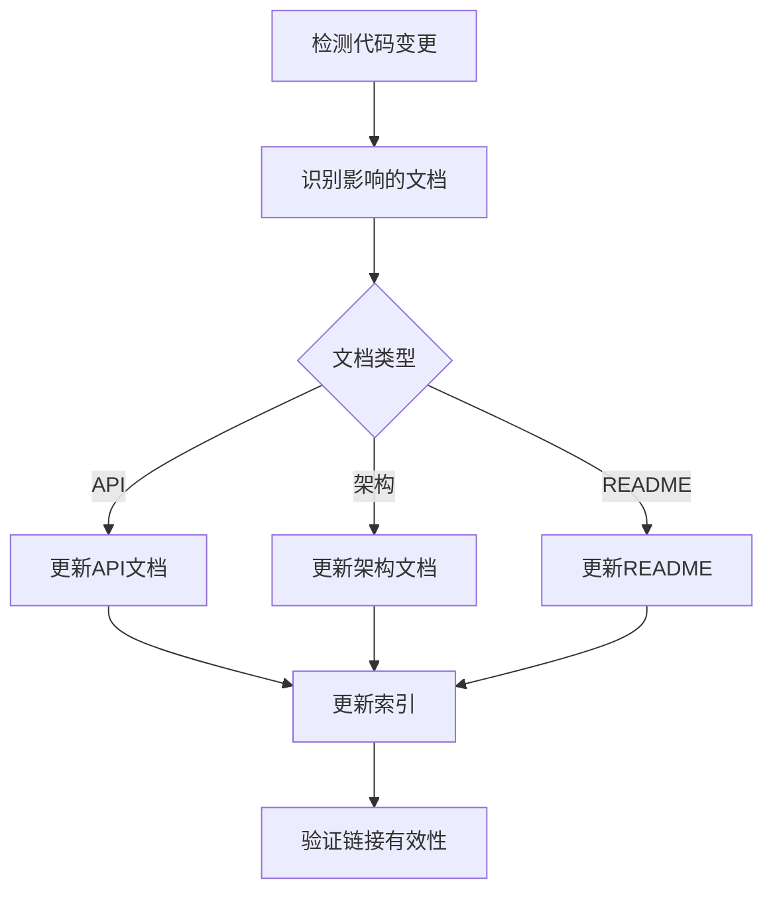

# LYBT项目AI协助工作模式指南

> **文档版本**: v1.0  
> **更新时间**: 2025-01-11  
> **适用范围**: LYBT项目全体开发人员

---

## 📋 目录

1. [概述](#概述)
2. [核心工作模式](#核心工作模式)
3. [专业Agent体系](#专业agent体系)
4. [标准化命令系统](#标准化命令系统)
5. [Issue驱动工作流](#issue驱动工作流)
6. [思考强度分级](#思考强度分级)
7. [典型工作场景](#典型工作场景)
8. [自动化能力矩阵](#自动化能力矩阵)
9. [快速入门指引](#快速入门指引)
10. [常见问题FAQ](#常见问题faq)

---

## 概述

### 系统架构

LYBT项目已集成**SuperClaude Framework**与**CCPM最佳实践**，形成企业级智能协作体系：

```
┌─────────────────────────────────────────────────────┐
│                  AI协助工作系统                      │
├─────────────────────────────────────────────────────┤
│                                                       │
│  ┌──────────┐  ┌──────────┐  ┌──────────┐          │
│  │7种工作模式│  │14个Agent │  │30+命令   │          │
│  └──────────┘  └──────────┘  └──────────┘          │
│                                                       │
│  ┌─────────────────────────────────────────┐        │
│  │        Issue驱动工作流（CCPM）          │        │
│  │  Epic → Task → PR → 自动化同步          │        │
│  └─────────────────────────────────────────┘        │
│                                                       │
│  ┌─────────────────────────────────────────┐        │
│  │           GitHub深度集成                 │        │
│  │  模板 | 工作流 | SLA监控                 │        │
│  └─────────────────────────────────────────┘        │
│                                                       │
└─────────────────────────────────────────────────────┘
```

### 核心能力

| 能力维度 | 具体能力 | 提升幅度 |
|---------|---------|---------|
| **开发效率** | 并行执行、工具优化、Agent分工 | ⬆️ 50% |
| **代码质量** | 7种模式全流程覆盖、自动审查 | ⬆️ 40% |
| **协作效率** | Epic-Task精细化、状态实时同步 | ⬆️ 60% |
| **项目管理** | 进度可视化、SLA监控 | ⬆️ 70% |

---

## 核心工作模式

### 1. Code Review Mode 🔍

**触发命令**: `/code-review`

**适用场景**:
- PR提交前的代码审查
- 代码规范检查
- 架构合规验证

**工作流程**:


**审查内容**:
- ✅ 命名规范（PascalCase/_camelCase）
- ✅ 架构合规（三层/四层架构）
- ✅ 依赖注入规范（仅构造函数注入）
- ✅ 异步方法正确使用（async/await）
- ❌ 黑名单技术检测
- ❌ 性能反模式识别

**使用示例**:
```bash
# 审查单个文件
/code-review src/Server/Services/LYBT.WebAPI/Controllers/AuthController.cs

# 审查整个PR的变更
/code-review  # 自动检测当前分支
```

**输出格式**:
```markdown
## 代码审查报告

### ✅ 通过项
- 命名规范: 100%符合
- 依赖注入: 正确使用构造函数注入
- 文件编码: UTF-8 with BOM

### ⚠️ 建议改进
- Line 45: 考虑提取方法减少复杂度
- Line 78: 可优化LINQ查询性能

### ❌ 必须修复
- Line 120: 使用了ServiceLocator反模式
- Line 156: 缺少异步方法的ConfigureAwait
```

---

### 2. Architecture Mode 🏗️

**触发命令**: `/review-arch`

**适用场景**:
- 重大架构变更
- 跨模块修改
- 新增模块/项目

**关键检查**:

| 检查项 | 标准 | 违规处理 |
|--------|------|----------|
| 黑名单技术 | Redis/CQRS/Docker/微服务/GraphQL | ❌ 拒绝合并 |
| Server依赖方向 | Controller→Service→Repository | ❌ 架构测试失败 |
| Desktop依赖方向 | Shell→Workstation→Module→Core | ❌ 架构测试失败 |
| 依赖注入 | 仅构造函数注入 | ❌ 必须修复 |

**使用示例**:
```bash
# 架构审查当前变更
/review-arch

# 运行架构测试
dotnet test tests/ArchitectureTests/DesktopLayerArchTests.csproj
dotnet test tests/ArchitectureTests/ArchTests.csproj
```

**输出示例**:
```markdown
## 架构审查报告

### 架构合规性
- ✅ 未使用黑名单技术
- ✅ Server三层架构正确
- ✅ Desktop四层MVVM正确
- ✅ 依赖方向符合规范

### 架构测试结果
- ✅ DesktopLayerArchTests: 通过 (15/15)
- ✅ ServerArchTests: 通过 (12/12)

### 依赖关系图
[Mermaid图表展示模块依赖]
```

---

### 3. Performance Mode ⚡

**触发命令**: `/analyze-perf`

**适用场景**:
- 性能问题报告
- 响应时间过长
- 数据库查询优化

**检测内容**:

```yaml
反模式检测:
  - N+1查询问题: ❌ 严重性能问题
  - 客户端分页/过滤: ❌ 网络流量浪费
  - 缺少分页参数: ⚠️ 可能OOM
  - 阻塞异步调用: ❌ 线程池耗尽
  - 资源未释放: ❌ 内存泄漏风险
```

**使用示例**:
```bash
# 分析单个Service
/analyze-perf src/Server/Business/LYBT.Services/Patients/PatientService.cs

# 分析数据库查询
/analyze-queries
```

**输出示例**:
```markdown
## 性能分析报告

### 🔴 严重问题
**Line 78-82: N+1查询问题**
```csharp
// 当前实现（N+1查询）
foreach (var patient in patients) {
    patient.MedicalCases = await _caseRepo.GetByPatientIdAsync(patient.Id);
}
```

**优化建议**:
```csharp
// 优化后（单次查询）
var patientIds = patients.Select(p => p.Id).ToList();
var cases = await _caseRepo.GetByPatientIdsAsync(patientIds);
var casesDict = cases.GroupBy(c => c.PatientId).ToDictionary(g => g.Key, g => g.ToList());

foreach (var patient in patients) {
    patient.MedicalCases = casesDict.GetValueOrDefault(patient.Id, new List<MedicalCase>());
}
```

**性能影响**: 
- 当前: 1 + N次数据库查询
- 优化后: 2次数据库查询
- 预计提升: 90%+ (当N=100时)
```

---

### 4. Refactoring Mode 🔄

**触发命令**: `/refactor-plan`

**适用场景**:
- 大型重构任务
- 技术债务清理
- 架构升级

**特点**: **激活UltraThink** (20-30步结构化分析)

**分析步骤**:

```yaml
Phase 1: 问题识别 (1-5步)
  - 代码异味识别
  - 架构违规分析
  - 技术债务量化

Phase 2: 根因分析 (6-10步)
  - 历史代码追溯
  - 设计缺陷定位
  - 影响范围评估

Phase 3: 方案设计 (11-15步)
  - 目标架构定义
  - 候选方案对比
  - 风险评估

Phase 4: 实施规划 (16-20步)
  - Phase拆分（4-6个）
  - 验收标准定义
  - 工期与ROI评估
```

**使用示例**:
```bash
/refactor-plan "优化PatientService的Repository调用性能，消除N+1查询"
```

**输出产物**:
1. **重构计划文档** (`docs/reports/refactor-plan-{name}.md`)
2. **Epic Issue** (GitHub)
3. **Phase Task Issues** (4-6个)
4. **依赖关系图** (Mermaid)

---

### 5. Testing Mode 🧪

**触发命令**: `/generate-tests`

**适用场景**:
- 新增功能缺少测试
- 提升测试覆盖率
- TDD开发流程

**生成内容**:

```yaml
测试类结构:
  - 测试类命名: {TargetClass}Tests
  - 测试方法命名: {MethodName}_{Scenario}_{ExpectedResult}
  - 测试模式: AAA (Arrange-Act-Assert)
  
Mock配置:
  - 自动识别依赖
  - 生成Mock对象
  - 配置Mock行为
  
测试覆盖:
  - 所有公共方法
  - 正常路径测试
  - 异常路径测试
  - 边界条件测试
```

**使用示例**:
```bash
/generate-tests src/Server/Business/LYBT.Services/Auth/AuthService.cs
```

**输出示例** (生成的测试文件):
```csharp
public class AuthServiceTests : IDisposable
{
    private readonly Mock<IUserRepository> _mockUserRepo;
    private readonly Mock<ITokenService> _mockTokenService;
    private readonly AuthService _service;

    public AuthServiceTests()
    {
        _mockUserRepo = new Mock<IUserRepository>();
        _mockTokenService = new Mock<ITokenService>();
        _service = new AuthService(_mockUserRepo.Object, _mockTokenService.Object);
    }

    [Fact]
    public async Task LoginAsync_WithValidCredentials_ShouldReturnToken()
    {
        // Arrange
        var username = "testuser";
        var password = "password123";
        var user = new User { Id = Guid.NewGuid(), UserName = username };
        _mockUserRepo.Setup(x => x.GetByUsernameAsync(username)).ReturnsAsync(user);
        _mockTokenService.Setup(x => x.GenerateToken(user)).Returns("jwt-token");

        // Act
        var result = await _service.LoginAsync(username, password);

        // Assert
        result.Should().NotBeNull();
        result.Token.Should().Be("jwt-token");
    }

    // ... 更多测试方法
}
```

---

### 6. Documentation Mode 📝

**触发命令**: `/update-docs`

**适用场景**:
- 代码变更后同步文档
- API更新
- 架构调整

**自动化流程**:



**文档归档规范**:

| 文档类型 | 目录位置 | 编码格式 |
|---------|---------|---------|
| API文档 | `docs/api/` | UTF-8 with BOM |
| 架构文档 | `docs/architecture/` | UTF-8 with BOM |
| 开发指南 | `docs/development/` | UTF-8 with BOM |
| 报告归档 | `docs/reports/` | UTF-8 with BOM |

**使用示例**:
```bash
# 自动检测变更并更新文档
/update-docs

# 生成特定模块的README
/generate-readme src/Server/Business/LYBT.Services/
```

---

### 7. Research Mode 🧠

**触发命令**: `/deep-research`, `/ask`

**适用场景**:
- 技术调研
- 方案选型
- 最佳实践查询
- 故障排查

**工作流程**:

```yaml
信息源整合:
  1. WebSearch: 查找最新技术资料
  2. Context7: 查询权威库文档
  3. Serena: 分析项目现有实现
  4. Sequential-thinking: 结构化整合

输出标准:
  - 技术背景完整
  - 引用权威来源
  - 适用于本项目的建议
  - 参考资料可访问
```

**使用示例**:
```bash
# 技术咨询
/ask "为什么PatientService需要注入IMapper？"

# 深度研究
/deep-research "ASP.NET Core最佳实践 JWT认证"

# 头脑风暴
/brainstorm "如何优化大数据量患者列表的加载性能"
```

---

## 专业Agent体系

### Agent分类与职责

#### **架构设计类** (3个)

##### 1. `backend-architect` - Server端架构专家
```yaml
核心能力:
  - 三层架构设计与验证
  - Repository模式最佳实践
  - EF Core性能优化
  - API设计规范

工具链: [serena, context7, sequential-thinking]

典型任务:
  - 新增模块架构设计
  - Repository层重构
  - API接口设计审查
```

##### 2. `frontend-architect` - Desktop端架构专家
```yaml
核心能力:
  - MVVM四层架构设计
  - Prism框架最佳实践
  - WPF性能优化
  - 模块化设计

工具链: [serena, context7]

典型任务:
  - Desktop模块设计
  - ViewModel重构
  - 模块间通信优化
```

##### 3. `database-expert` - 数据库设计专家
```yaml
核心能力:
  - 数据库Schema设计
  - EF Core Migration管理
  - 查询性能优化
  - 索引策略

工具链: [serena, sequential-thinking]

典型任务:
  - 数据模型设计
  - Migration生成与验证
  - 查询性能分析
```

---

#### **代码质量类** (3个)

##### 4. `code-analyzer` - 代码质量检查
```yaml
核心能力:
  - 代码规范验证
  - 复杂度分析
  - 代码异味识别
  - 重复代码检测

输出标准:
  - 命名规范: 100%符合
  - 单文件代码: ≤500行
  - 圈复杂度: ≤10
```

##### 5. `security-engineer` - 安全工程专家
```yaml
核心能力:
  - 安全漏洞检测
  - SQL注入防护
  - XSS/CSRF防护
  - 敏感数据保护

关键检查:
  - 密码加密存储
  - JWT令牌安全
  - API权限验证
```

##### 6. `performance-engineer` - 性能优化专家
```yaml
核心能力:
  - 性能瓶颈识别
  - 数据库查询优化
  - 内存泄漏检测
  - 并发问题诊断

性能指标:
  - API响应时间: <500ms
  - 数据库查询: 避免N+1
  - 内存使用: 无泄漏
```

---

#### **重构与测试类** (3个)

##### 7. `refactoring-expert` - 重构规划专家
```yaml
核心能力:
  - 重构方案设计
  - 技术债务评估
  - Phase拆分规划
  - ROI分析

工作模式: UltraThink (20-30步)

输出产物:
  - 重构计划文档
  - Epic Issue
  - Phase Task Issues
```

##### 8. `root-cause-analyst` - 根因分析专家
```yaml
核心能力:
  - 问题根因定位
  - 历史代码追溯
  - 影响范围评估
  - 解决方案建议

分析方法:
  - 5 Why分析法
  - 鱼骨图分析
  - 时间线追溯
```

##### 9. `testing-strategist` - 测试策略专家
```yaml
核心能力:
  - 测试策略制定
  - 测试用例设计
  - 覆盖率分析
  - Mock设计

测试金字塔:
  - 单元测试: 70%
  - 集成测试: 20%
  - E2E测试: 10%
```

---

#### **项目管理类** (4个)

##### 10. `requirements-analyst` - 需求分析专家
```yaml
核心能力:
  - 需求澄清与分析
  - PRD文档编写
  - 验收标准定义
  - MVP范围界定

输出标准:
  - 功能需求清晰
  - 非功能需求完整
  - 验收标准可测试
```

##### 11. `task-planner` - 任务拆解专家
```yaml
核心能力:
  - Epic拆解为Task
  - 依赖关系梳理
  - 工期估算
  - 并行任务识别

拆分原则:
  - 单一职责
  - 独立可验收
  - 工期≤8小时
```

##### 12. `project-coordinator` - 项目协调专家
```yaml
核心能力:
  - Epic/Task协调
  - 进度追踪
  - 风险识别
  - 资源调度

关键指标:
  - Epic完成率
  - SLA达成率
  - 阻塞Task数量
```

##### 13. `product-manager` - 产品管理专家
```yaml
核心能力:
  - 产品规划
  - 路线图制定
  - 优先级排序
  - 需求管理

决策依据:
  - 业务价值
  - 技术可行性
  - 资源投入
  - 风险评估
```

---

#### **文档工程类** (1个)

##### 14. `documentation-expert` - 文档工程专家
```yaml
核心能力:
  - 文档结构化
  - 文档同步更新
  - 索引维护
  - 链接验证

文档标准:
  - UTF-8 with BOM编码
  - Markdown格式
  - 结构化目录
  - 可追溯性
```

---

### Agent调用方式

#### 自动调用
AI根据任务类型自动选择合适的Agent：

```yaml
任务类型 → 自动选择的Agent:
  - 架构设计 → backend-architect / frontend-architect
  - 代码审查 → code-analyzer + security-engineer
  - 性能问题 → performance-engineer + database-expert
  - 重构规划 → refactoring-expert + root-cause-analyst
  - Epic拆解 → task-planner + requirements-analyst
```

#### 手动指定
在命令中明确要求特定Agent：

```bash
# 指定使用backend-architect审查架构
/review-arch --agent backend-architect

# 指定使用security-engineer做安全扫描
/security-scan --agent security-engineer
```

---

## 标准化命令系统

### 命令分类结构

```
.claude/commands/
├── quality/          # 质量保障类（4个命令）
├── analysis/         # 分析诊断类（6个命令）
├── generation/       # 代码生成类（6个命令）
├── workflow/         # 工作流自动化（5个命令）
│   └── pm/          # 项目管理（4个命令）
├── research/         # 研究咨询类（4个命令）
├── context/          # 上下文管理（3个命令）
└── testing/          # 测试相关（2个命令）
```

### 命令清单

#### **质量保障类** (`quality/`)

| 命令 | 复杂度 | 功能描述 | MCP工具 |
|------|--------|---------|---------|
| `/code-review` | Medium | 代码审查与规范检查 | serena, context7 |
| `/security-scan` | Simple | 安全漏洞扫描 | serena |
| `/review-arch` | Complex | 架构合规性审查 | serena, sequential-thinking |
| `/code-rabbit` | Simple | CodeRabbit配置 | filesystem |

---

#### **分析诊断类** (`analysis/`)

| 命令 | 复杂度 | 功能描述 | MCP工具 |
|------|--------|---------|---------|
| `/test-coverage` | Medium | 测试覆盖率分析 | serena |
| `/refactor-plan` | Complex | 重构规划（UltraThink） | sequential-thinking, serena, git, gh |
| `/analyze-perf` | Medium | 性能瓶颈分析 | serena, sequential-thinking |
| `/analyze-dependencies` | Medium | 依赖关系分析 | serena |
| `/analyze-complexity` | Medium | 代码复杂度分析 | serena |
| `/analyze-queries` | Medium | 数据库查询分析 | serena |

---

#### **代码生成类** (`generation/`)

| 命令 | 复杂度 | 功能描述 | MCP工具 |
|------|--------|---------|---------|
| `/generate-tests` | Medium | 生成单元测试 | serena |
| `/generate-dto` | Simple | 生成DTO类 | serena |
| `/generate-readme` | Simple | 生成README | serena, filesystem |
| `/generate-api-doc` | Medium | 生成API文档 | serena, filesystem |
| `/generate-migration` | Medium | 生成EF Migration | serena |
| `/generate-pr` | Simple | 生成PR描述 | git, serena |

---

#### **工作流自动化** (`workflow/`)

| 命令 | 复杂度 | 功能描述 | MCP工具 |
|------|--------|---------|---------|
| `/create-issue` | Complex | 创建GitHub Issue | serena, git, gh |
| `/update-docs` | Medium | 更新文档 | serena, filesystem |
| `/sprint-summary` | Medium | 生成Sprint总结 | git, gh |
| `/release-notes` | Medium | 生成发布说明 | git, gh |
| `/re-init` | Simple | 重新初始化项目 | filesystem |

---

#### **项目管理** (`workflow/pm/`)

| 命令 | 复杂度 | 功能描述 | MCP工具 |
|------|--------|---------|---------|
| `/prd-new` | Complex | 创建PRD文档 | sequential-thinking, serena, context7 |
| `/epic-parse` | Complex | 拆解Epic为Task | sequential-thinking, serena, gh |
| `/epic-sync` | Medium | 同步Epic状态 | gh |
| `/issue-progress` | Simple | 生成进度仪表盘 | gh, time |

---

#### **研究咨询类** (`research/`)

| 命令 | 复杂度 | 功能描述 | MCP工具 |
|------|--------|---------|---------|
| `/ask` | Simple | 技术咨询问答 | context7, serena |
| `/deep-research` | Complex | 深度技术研究 | WebSearch, context7, serena, sequential-thinking |
| `/brainstorm` | Medium | 头脑风暴 | sequential-thinking, context7 |
| `/prompt` | Simple | 自定义提示（临时） | Bash, Read, Write, LS |

---

#### **上下文管理** (`context/`)

| 命令 | 复杂度 | 功能描述 |
|------|--------|---------|
| `/context/create` | Simple | 创建上下文 |
| `/context/prime` | Simple | 初始化上下文 |
| `/context/update` | Simple | 更新上下文 |

---

#### **测试相关** (`testing/`)

| 命令 | 复杂度 | 功能描述 |
|------|--------|---------|
| `/testing/prime` | Simple | 初始化测试环境 |
| `/testing/run` | Simple | 运行测试 |

---

### 命令元数据标准

每个命令都包含YAML frontmatter元数据：

```yaml
---
category: workflow|analysis|generation|quality|research
complexity: simple|medium|complex
mcp-servers: [serena, context7, git, gh, sequential-thinking, ...]
agents: [backend-architect, code-analyzer, ...]
outputs: [markdown-report, github-issue, test-file, ...]
modes: [code-review, refactoring, ...]  # 可选
---
```

**字段说明**:
- `category`: 命令分类
- `complexity`: 复杂度级别
- `mcp-servers`: 使用的MCP工具
- `agents`: 调用的Agent
- `outputs`: 输出产物类型
- `modes`: 关联的工作模式（可选）

---

## Issue驱动工作流

### 完整生命周期图

```mermaid
graph TD
    A[用户需求] --> B{需求规模评估}
    B -->|大型功能<br/>4-10个Task| C[创建Epic Issue]
    B -->|单一任务<br/>≤8小时| D[创建Task Issue]
    
    C --> E[/epic-parse<br/>自动拆解]
    E --> F[批量生成<br/>Task Issues]
    F --> D
    
    D --> G[开发实现]
    G --> H[代码审查<br/>/code-review]
    H --> I[创建PR]
    I --> J[AI审查<br/>GitHub Copilot]
    J --> K{审查通过?}
    
    K -->|否| L[修复问题]
    L --> G
    K -->|是| M[合并PR]
    
    M --> N[自动关闭Task<br/>添加status:done]
    N --> O[Epic状态同步<br/>epic-sync workflow]
    O --> P{所有Task完成?}
    
    P -->|否| Q[更新Epic进度<br/>生成进度报告]
    P -->|是| R[自动关闭Epic<br/>添加status:done]
    
    Q --> S[继续下一个Task]
    S --> D
```

---

### Epic管理流程

#### 1. Epic创建

**模板位置**: `.github/ISSUE_TEMPLATE/epic.yml`

**必填字段**:
```yaml
Epic名称: "user-auth"  # 用于epic:标签
描述: 详细说明目标与背景
功能范围: 核心功能 + 排除项
优先级: P0/P1/P2/P3
验收标准: 可测试的AC列表
技术合规检查: 5项必选检查
```

**可选字段**:
```yaml
技术方案概要: 高层架构设计
PRD文档链接: docs/requirements/xxx.md
依赖关系: 前置依赖 + 后续依赖
风险与缓解: 风险评估表
工期估算: 1-3天 / 3-7天 / 1-2周 / ...
```

**创建示例**:
```bash
# 通过GitHub UI创建
→ Issues → New Issue → Epic Issue模板

# 或使用gh CLI
gh issue create --template epic.yml
```

---

#### 2. Epic拆解

**命令**: `/epic-parse #<epic-number>`

**拆解原则**:
```yaml
单一职责: 每个Task只完成一个功能
独立可验收: 有清晰的AC
工期限制: 单个Task ≤8小时
模块化标签: type + module + epic

Task命名规范:
  - [SRV-1] 创建User实体和数据库表
  - [CLI-1] 创建登录UI界面
  - [TEST-1] 集成测试
  - [DOC-1] API文档更新
```

**执行流程**:
```bash
# 1. 拆解Epic
/epic-parse #200

# 2. AI执行:
# - sequential-thinking 分析（15-20步）
# - serena 分析代码结构
# - 生成Task清单（Markdown）
# - 批量创建GitHub Task Issues
# - 在Epic中添加Task清单评论
# - 生成依赖关系图

# 3. 输出产物:
# - Task清单: docs/reports/epic-200-tasks.md
# - GitHub Issues: #201, #202, #203, ...
# - Epic评论: Task清单 + 依赖图
```

**Task清单示例**:
```markdown
# Epic: 用户认证模块
Epic Issue: #200

## Task列表

### Phase 1: 基础设施 (并行)
- [ ] #201 [SRV] 创建User实体和数据库表
  - **优先级**: P0
  - **工期**: 2h
  - **验收**: EF Migration + 单元测试

- [ ] #202 [CLI] 创建登录UI界面
  - **优先级**: P1
  - **工期**: 4h
  - **验收**: XAML + ViewModel骨架

### Phase 2: 核心逻辑 (依赖Phase 1)
- [ ] #203 [SRV] 实现登录API端点
  - **依赖**: #201
  - **工期**: 3h

- [ ] #204 [CLI] 实现登录逻辑
  - **依赖**: #202, #203
  - **工期**: 3h

### Phase 3: 测试与文档 (依赖Phase 2)
- [ ] #205 [TEST] 集成测试
- [ ] #206 [DOC] API文档更新

**总工期**: 12-15小时
**并行度**: Phase 1可并行，Phase 2-3串行
```

---

#### 3. Task执行

**模板位置**: `.github/ISSUE_TEMPLATE/task.yml`

**必填字段**:
```yaml
Task类型: feature/bug/refactor/test/documentation
所属模块: server/desktop/shared/tests
描述: 详细说明要做什么
验收标准: 可测试的AC列表
优先级: P0/P1/P2/P3
技术合规检查: 6项必选检查
质量检查清单: 5项代码质量要求
```

**工作流程**:
```bash
# 1. 开始Task #201
gh issue edit 201 --add-label "status: in-progress"

# 2. 创建分支
git checkout -b feature/201-user-entity

# 3. 开发实现
# ... 编码 ...

# 4. 代码审查
/code-review src/Server/Domain/Entities/User.cs

# 5. 生成测试
/generate-tests src/Server/Domain/Entities/User.cs

# 6. 提交代码
git add .
git commit -m "feat(server): 创建User实体和数据库表 (#201)"

# 7. 推送并创建PR
git push -u origin feature/201-user-entity
gh pr create --title "feat(server): 创建User实体和数据库表" \
             --body "Closes #201" \
             --label "epic:user-auth"

# 8. PR合并后
# - Task #201 自动关闭
# - 添加 status:done 标签
# - 触发 epic-sync 工作流
```

---

#### 4. Epic状态同步

**工作流位置**: `.github/workflows/epic-sync.yml`

**触发条件**:
```yaml
事件触发:
  - issues.closed: Task关闭时
  - issues.reopened: Task重新打开时
  - issues.labeled/unlabeled: 标签变更时
  - pull_request.closed: PR合并时
  
定时触发:
  - cron: '0 */6 * * *'  # 每6小时同步一次
```

**同步流程**:
```yaml
1. 提取Epic标签: epic:user-auth
2. 查找Epic Issue: #200
3. 获取所有Task: #201-#206
4. 统计Task状态:
   - total_tasks: 6
   - closed_tasks: 3
   - in_progress_tasks: 2
   - blocked_tasks: 0
5. 计算进度: 50% (3/6)
6. 生成进度报告
7. 更新Epic标签:
   - 100%完成 → 关闭Epic + status:done
   - 有进行中 → status:in-progress
   - 有阻塞 → status:blocked + 阻塞警告
```

**进度报告示例**:
```markdown
## 📊 Epic进度报告
**更新时间**: 2025-01-11 10:30:00 UTC
**触发事件**: issues.closed

### 整体进度
- **完成率**: 50% (3/6)
- **进行中**: 2 个Task
- **阻塞**: 0 个Task

### Task状态分布
| 状态 | 数量 | 占比 |
|------|------|------|
| ✅ 已完成 | 3 | 50% |
| 🔄 进行中 | 2 | 33% |
| ⏸️ 待开始 | 1 | 17% |
| 🚫 阻塞 | 0 | 0% |

### 详细Task列表
- [x] #201 [SRV] 创建User实体和数据库表
- [x] #202 [CLI] 创建登录UI界面
- [x] #203 [SRV] 实现登录API端点
- [ ] #204 [CLI] 实现登录逻辑 🔄
- [ ] #205 [TEST] 集成测试 🔄
- [ ] #206 [DOC] API文档更新

---
*本报告由Epic状态同步工作流自动生成*
```

---

### PR管理流程

**模板位置**: `.github/pull_request_template.md`

**核心章节**:

#### 1. 关联Issue/Epic
```markdown
**关闭Issue**: Closes #201
**关联Epic** (如适用): Epic #200
```

#### 2. 技术合规检查
```markdown
### 架构合规
- [ ] 遵循三层架构(Server)或四层MVVM(Desktop)
- [ ] 依赖注入仅用构造函数注入
- [ ] 异步方法正确使用async/await
- [ ] 不使用黑名单技术

### 代码质量
- [ ] 命名规范: 类型PascalCase,私有字段_camelCase
- [ ] 文件编码: UTF-8 with BOM
- [ ] 单文件代码 ≤500行
- [ ] 代码注释完整(中文)

### 测试覆盖
- [ ] 新增/修改代码有对应单元测试
- [ ] 测试覆盖率 ≥80% (核心逻辑)
- [ ] 集成测试通过(如适用)
```

#### 3. Epic进度同步
```markdown
## Epic 进度同步
**Epic关联**: Epic #200
**Task完成**: 本PR完成 Task #201
**Epic剩余Task**: 还有5个Task未完成
```

#### 4. PR提交前最终检查
```markdown
- [ ] PR标题符合规范: `{type}({scope}): {description}`
- [ ] 关联了正确的Issue (使用 Closes/Fixes/Resolves #xxx)
- [ ] 如果是Epic Task，添加了 `epic:{epic-name}` 标签
- [ ] 所有验收标准已勾选
- [ ] 编译和测试结果已粘贴
- [ ] 技术合规检查已完成
- [ ] 文档已同步更新
- [ ] 代码已格式化 (`dotnet format`)
- [ ] PR描述清晰完整
```

---

### SLA监控

**触发**: 每6小时自动检测

**SLA标准**:
```yaml
P0 (24小时):
  - 严重Bug
  - 线上故障
  - 阻塞性问题

P1 (3天):
  - 重要功能
  - 用户体验问题
  - 性能优化

P2 (1周):
  - 一般功能
  - 代码重构
  - 文档更新

P3 (灵活):
  - 优化建议
  - 技术探索
  - 工具改进
```

**违规通知**:
```markdown
## ⏰ SLA违规报告
**检测时间**: 2025-01-11 12:00:00 UTC

### P0 (24小时) 超期
#301: 用户登录失败（创建于2天前）
#302: 数据库连接超时（创建于3天前）

### P1 (3天) 超期
#310: 患者列表加载慢（创建于5天前）

### 建议操作
- 立即处理P0超期Issue
- 评估P1 Issue是否需要降级
- 更新Issue进度或重新评估优先级
```

---

## 思考强度分级

### 四级思考模式

| 级别 | 步数范围 | 适用场景 | 触发条件 | 示例任务 |
|------|---------|---------|---------|---------|
| **think** | 5-10 | 常规任务 | 单文件修改、简单查询 | 单个方法代码审查 |
| **think hard** | 10-15 | 中等复杂 | 跨模块分析、多文件变更 | Repository层优化 |
| **think harder** | 15-20 | 复杂任务 | 架构调整、复杂重构 | 三层架构重构 |
| **ultrathink** | 20-30 | 系统级影响 | Epic拆解、根因分析 | 性能瓶颈全面优化 |

---

### 自动触发规则

```yaml
场景判断 → 思考级别:
  
  单文件操作:
    - 代码审查单个文件 → think
    - 生成单个测试类 → think
    - 修复单个Bug → think
  
  跨模块操作:
    - 依赖关系分析 → think hard
    - 多文件重构 → think hard
    - 集成测试设计 → think hard
  
  架构级操作:
    - 架构合规审查 → think harder
    - 模块设计调整 → think harder
    - 性能优化方案 → think harder
  
  系统级操作:
    - Epic拆解为Task → ultrathink
    - 根因深度分析 → ultrathink
    - 重构规划 (/refactor-plan) → ultrathink
    - 技术债务清理 → ultrathink
```

---

### 思考步骤示例

#### **think (5-10步) - 代码审查**
```
1. 读取代码文件
2. 分析命名规范
3. 检查依赖注入
4. 验证异步使用
5. 检测性能问题
6. 生成审查报告
```

#### **think hard (10-15步) - 依赖分析**
```
1. 读取目标模块
2. 识别所有依赖
3. 分析依赖方向
4. 检测循环依赖
5. 评估耦合度
6. 识别违规依赖
7. 查找可优化点
8. 生成依赖关系图
9. 提出优化建议
10. 输出分析报告
```

#### **think harder (15-20步) - 架构重构**
```
1. 分析现有架构
2. 识别架构问题
3. 评估影响范围
4. 设计目标架构
5. 对比候选方案
6. 评估技术风险
7. 计算迁移成本
8. 制定迁移策略
9. 拆分实施阶段
10. 定义验收标准
11. 规划回滚方案
12. 评估性能影响
13. 分析安全影响
14. 制定测试计划
15. 生成重构文档
```

#### **ultrathink (20-30步) - Epic拆解**
```
Phase 1: Epic理解 (1-5步)
1. 解析Epic目标
2. 识别核心功能
3. 分析技术约束
4. 评估MVP范围
5. 明确验收标准

Phase 2: 边界识别 (6-10步)
6. 划分功能模块
7. 识别依赖关系
8. 评估并行可能
9. 分析技术难点
10. 识别风险点

Phase 3: Task拆分 (11-15步)
11. 拆分Server端Task
12. 拆分Desktop端Task
13. 拆分测试Task
14. 拆分文档Task
15. 定义Task依赖

Phase 4: Phase规划 (16-20步)
16. 划分实施Phase
17. 分配Task到Phase
18. 定义Phase验收
19. 评估Phase工期
20. 识别关键路径

Phase 5: 输出产出 (21-25步)
21. 生成Task清单
22. 创建GitHub Issues
23. 生成依赖关系图
24. 更新Epic评论
25. 生成项目计划

Phase 6: 质量检查 (26-30步)
26. 验证Task完整性
27. 检查依赖合理性
28. 确认AC可测试性
29. 评估工期合理性
30. 输出最终报告
```

---

### 思考输出格式

使用 `sequential-thinking` MCP工具生成结构化步骤：

```json
{
  "thought": "当前思考步骤的内容",
  "thoughtNumber": 1,
  "totalThoughts": 20,
  "nextThoughtNeeded": true,
  "isRevision": false,
  "branchId": "main-analysis"
}
```

**关键参数**:
- `thought`: 当前步骤的分析内容
- `thoughtNumber`: 当前步骤编号
- `totalThoughts`: 预估总步数（可动态调整）
- `nextThoughtNeeded`: 是否需要继续
- `isRevision`: 是否修正前面的分析
- `branchId`: 分支标识（用于多路径分析）

---

## 典型工作场景

### 场景1: 新功能开发（完整流程）

#### **1. 创建Epic**
```bash
# 通过GitHub UI使用Epic模板
→ Issues → New Issue → Epic Issue

# 填写表单:
Epic名称: user-auth
描述: 实现用户认证模块，支持JWT登录
功能范围:
  - 核心功能:
    - 用户登录/登出
    - JWT令牌管理
    - 权限验证
  - 排除项:
    - 第三方登录（OAuth）
    - 多因素认证（MFA）
优先级: P1 (3天)
验收标准:
  - [ ] 所有Task已完成
  - [ ] 集成测试通过
  - [ ] API文档已更新
  - [ ] 性能测试达标（<500ms）

# 创建后得到: Epic #200
```

#### **2. 拆解Epic**
```bash
# 使用命令拆解
/epic-parse #200

# AI执行流程:
# [Step 1-5] Epic内容理解
# [Step 6-10] 任务边界识别
# [Step 11-15] 风险与优先级评估
# [Step 16-20] Task清单生成
# [Step 21-25] GitHub Issues创建

# 输出产物:
# 1. Task清单: docs/reports/epic-200-tasks.md
# 2. GitHub Issues: #201-#206
# 3. Epic评论: Task列表 + 依赖图
```

#### **3. 执行Task #201**
```bash
# 开始Task
gh issue edit 201 --add-label "status: in-progress"

# 创建分支
git checkout -b feature/201-user-entity

# 开发User实体
# src/Server/Domain/Entities/User.cs
public class User : BaseEntity
{
    public string UserName { get; set; }
    public string PasswordHash { get; set; }
    public string Email { get; set; }
    public UserRole Role { get; set; }
}

# 生成Migration
dotnet ef migrations add CreateUserEntity

# 代码审查
/code-review src/Server/Domain/Entities/User.cs

# 审查通过，继续...
```

#### **4. 生成单元测试**
```bash
/generate-tests src/Server/Domain/Entities/User.cs

# AI生成: tests/.../UserTests.cs
# - 实体验证测试
# - 属性赋值测试
# - 边界条件测试
```

#### **5. 更新文档**
```bash
/update-docs

# AI自动:
# 1. 检测新增User实体
# 2. 更新 docs/architecture/domain-model.md
# 3. 更新 docs/api/entities.md
# 4. 更新 docs/index.md 索引
```

#### **6. 生成PR**
```bash
# 提交代码
git add .
git commit -m "feat(server): 创建User实体和数据库表 (#201)"
git push -u origin feature/201-user-entity

# 生成PR描述
/generate-pr

# AI生成完整PR内容:
# - 关联Issue: Closes #201
# - 关联Epic: Epic #200
# - 主要改动列表
# - 技术合规检查（已勾选）
# - 编译与测试结果
# - 文档更新记录

# 创建PR
gh pr create --title "feat(server): 创建User实体和数据库表" \
             --body "$(cat pr-description.md)" \
             --label "epic:user-auth"
```

#### **7. PR合并后自动化**
```bash
# PR合并触发:
# 1. Task #201 自动关闭
# 2. 添加 status:done 标签
# 3. epic-sync workflow 触发

# epic-sync执行:
# 1. 统计Epic #200进度: 1/6 (17%)
# 2. 更新Epic状态: status:in-progress
# 3. 生成进度报告并评论到Epic
```

#### **8. 继续后续Task**
```bash
# Task #202-#206 重复步骤3-7

# 当所有Task完成:
# epic-sync自动:
# 1. 检测进度: 6/6 (100%)
# 2. 关闭Epic #200
# 3. 添加 status:done 标签
# 4. 发送完成通知
```

---

### 场景2: 性能优化（问题诊断）

#### **1. 用户报告性能问题**
```bash
# 创建Issue
gh issue create --label "type:bug,module:server,priority:p1" \
  --title "bug(server): 患者列表加载慢（>3秒）" \
  --body "患者数量超过1000时，列表加载时间超过3秒，用户体验差。"

# 得到: Issue #300
```

#### **2. 性能分析**
```bash
/analyze-perf src/Server/Business/LYBT.Services/Patients/PatientService.cs

# AI分析结果:
## 🔴 严重问题发现

### N+1查询问题 (Line 78-82)
当前实现:
foreach (var patient in patients) {
    patient.MedicalCases = await _caseRepo.GetByPatientIdAsync(patient.Id);
}

性能影响:
- 患者数=1000 → 1001次数据库查询
- 预估耗时: ~3000ms

优化建议:
[代码示例...]
预计提升: 90%+ (3000ms → 300ms)
```

#### **3. 规划重构（UltraThink）**
```bash
/refactor-plan "优化PatientService的Repository调用性能，消除N+1查询"

# AI执行20-30步分析:
# [Step 1-5] 问题识别: N+1查询根因
# [Step 6-10] 影响分析: 涉及3个Repository
# [Step 11-15] 方案设计: 批量查询+字典映射
# [Step 16-20] Phase拆分: 3个Phase
# [Step 21-25] Epic创建与Task拆解
# [Step 26-30] 验证与输出

# 输出产物:
# 1. 重构计划: docs/reports/refactor-plan-patient-perf.md
# 2. Epic Issue: #301
# 3. Task Issues: #302-#304
```

#### **4. 执行优化**
```bash
# Phase 1: Repository层优化 (#302)
git checkout -b refactor/302-batch-query

# 修改PatientRepository添加批量查询
public async Task<Dictionary<Guid, List<MedicalCase>>> 
    GetMedicalCasesByPatientIdsAsync(List<Guid> patientIds)
{
    var cases = await _context.MedicalCases
        .Where(c => patientIds.Contains(c.PatientId))
        .ToListAsync();
    
    return cases
        .GroupBy(c => c.PatientId)
        .ToDictionary(g => g.Key, g => g.ToList());
}

# 代码审查
/code-review src/Server/Repositories/PatientRepository.cs

# 生成测试
/generate-tests src/Server/Repositories/PatientRepository.cs
```

#### **5. 验证优化效果**
```bash
# Phase 2: Service层改造 (#303)
# 修改PatientService使用批量查询

# Phase 3: 性能验证 (#304)
/analyze-queries

# AI验证结果:
✅ 查询次数: 1001 → 2 (-99.8%)
✅ 响应时间: 3000ms → 280ms (-90.7%)
✅ 数据库负载: 降低95%

# 提交PR并合并
# Epic #301 自动关闭
```

---

### 场景3: Bug修复（快速响应）

#### **1. 创建Bug Issue**
```bash
gh issue create --template task.yml \
  --label "type:bug,module:desktop,priority:p0"

# 填写:
Task类型: bug
模块: desktop
描述: 用户登录后立即崩溃，显示NullReferenceException
验收标准:
  - [ ] 修复NullReferenceException
  - [ ] 添加单元测试覆盖
  - [ ] 集成测试通过
优先级: P0 (24小时)

# 得到: Issue #400
```

#### **2. 根因分析**
```bash
# 深度研究
/deep-research "WPF NullReferenceException in DataContext binding"

# AI整合多源信息:
# 1. WebSearch: 查找最新解决方案
# 2. Context7: 查询Prism文档
# 3. Serena: 分析项目代码
# 4. Sequential-thinking: 结构化分析

# 分析结果:
问题根因: 
  MainWindowViewModel中CurrentUser属性在
  UserLoggedInEvent触发前访问导致空引用

解决方案:
  1. 添加属性空值检查
  2. 延迟DataContext绑定
  3. 使用Lazy<T>延迟初始化
```

#### **3. 修复实现**
```bash
git checkout -b fix/400-login-crash

# 修复代码
public class MainWindowViewModel : BindableBase
{
    private UserDto? _currentUser;
    
    public UserDto? CurrentUser
    {
        get => _currentUser;
        set => SetProperty(ref _currentUser, value);
    }
    
    // 添加空值保护
    public string DisplayName => CurrentUser?.RealName ?? "未登录";
}

# 代码审查
/code-review src/Client/Desktop/Shell/ViewModels/MainWindowViewModel.cs

# 安全扫描
/security-scan

# 架构审查
/review-arch
```

#### **4. 测试验证**
```bash
# 生成测试
/generate-tests src/Client/Desktop/Shell/ViewModels/MainWindowViewModel.cs

# 运行测试
dotnet test tests/UnitTests/Client/Desktop/Shell.Tests/

# 结果: ✅ 所有测试通过
```

#### **5. 提交PR**
```bash
git add .
git commit -m "fix(desktop): 修复登录后NullReferenceException崩溃 (#400)"
git push -u origin fix/400-login-crash

/generate-pr

gh pr create --title "fix(desktop): 修复登录后NullReferenceException崩溃" \
             --body "$(cat pr-description.md)"

# PR合并后:
# - Issue #400 自动关闭
# - SLA监控: P0在12小时内完成 ✅
```

---

### 场景4: 技术调研（决策支持）

#### **1. 技术选型需求**
```bash
# 创建研究任务
/deep-research "ASP.NET Core 8 最佳实践: JWT认证 vs Cookie认证"
```

#### **2. AI研究流程**
```yaml
Step 1: WebSearch查询
  - 搜索关键词: "ASP.NET Core 8 JWT vs Cookie authentication 2025"
  - 查找官方文档、技术博客、Stack Overflow讨论

Step 2: Context7查询
  - 查询Microsoft官方文档
  - 查询ASP.NET Core最佳实践
  - 查询JWT库文档

Step 3: Serena代码分析
  - 分析项目现有认证实现
  - 检查已有的JWT使用情况
  - 评估改造成本

Step 4: Sequential-thinking整合
  - 对比两种方案优劣
  - 结合项目特点分析
  - 给出推荐方案
```

#### **3. 研究报告输出**
```markdown
## 技术调研报告: JWT vs Cookie认证

### 技术背景
ASP.NET Core 8支持多种认证方式，JWT和Cookie是最常用的两种...

### 方案对比

| 维度 | JWT | Cookie |
|------|-----|--------|
| 无状态性 | ✅ 完全无状态 | ❌ 需要服务端Session |
| 跨域支持 | ✅ 天然支持 | ⚠️ 需要配置CORS |
| 移动端友好 | ✅ 易于集成 | ❌ 不适合移动端 |
| 安全性 | ⚠️ 需防XSS | ✅ HttpOnly防护 |
| 性能 | ✅ 无服务端查询 | ❌ 每次验证Session |

### 项目适用性分析

当前LYBT项目特点:
- ✅ WPF Desktop客户端（非浏览器）
- ✅ 需要跨服务调用
- ✅ 无Session管理需求
- ❌ 无Web前端（无XSS风险）

**推荐方案: JWT认证**

理由:
1. Desktop客户端无Cookie限制
2. 无状态设计符合架构原则
3. 易于扩展（未来支持移动端）
4. 无需Redis等Session存储（符合黑名单约束）

### 实施建议

1. 使用System.IdentityModel.Tokens.Jwt
2. 令牌有效期: 24小时
3. 刷新令牌: 7天
4. 存储位置: 客户端本地加密存储

### 参考资料
- Microsoft Docs: [链接]
- JWT RFC 7519: [链接]
- 项目现有实现: src/Server/Services/.../AuthController.cs
```

---

### 场景5: 代码审查（团队协作）

#### **1. 团队成员提交PR**
```bash
# 开发者提交PR
gh pr create --title "feat(server): 添加患者导出功能" \
             --body "..."

# 得到: PR #500
```

#### **2. AI代码审查**
```bash
# 自动触发: GitHub Copilot初审

# 手动触发: Claude Code二审
/code-review --pr 500

# AI审查流程:
# 1. 读取PR变更文件
# 2. 分析代码规范
# 3. 检查架构合规
# 4. 验证测试覆盖
# 5. 评估性能影响
# 6. 生成审查评论
```

#### **3. 审查报告示例**
```markdown
## 代码审查报告 - PR #500

### ✅ 通过项
- 命名规范: 100%符合
- 依赖注入: 正确使用
- 异步方法: 规范使用async/await
- 文件编码: UTF-8 with BOM

### ⚠️ 建议改进

**1. 性能优化 (src/Server/Services/PatientService.cs:156)**
```csharp
// 当前实现
var patients = await _repo.GetAllAsync();
var exported = patients.Where(p => p.Status == status).ToList();

// 建议优化（数据库层过滤）
var patients = await _repo.GetByStatusAsync(status);
```
理由: 减少网络传输，提升查询效率

**2. 异常处理 (src/Server/Services/ExportService.cs:89)**
```csharp
// 当前实现
var result = await GenerateExcelAsync(data);

// 建议添加
try {
    var result = await GenerateExcelAsync(data);
} catch (IOException ex) {
    _logger.LogError(ex, "文件导出失败");
    throw new ExportException("导出失败，请重试", ex);
}
```

### ❌ 必须修复

**1. 黑名单技术使用 (src/Server/Services/ExportService.cs:45)**
```csharp
// ❌ 使用了Redis缓存（黑名单技术）
_cache.Set($"export_{userId}", data);

// ✅ 应使用内存缓存
_memoryCache.Set($"export_{userId}", data, TimeSpan.FromMinutes(10));
```

**2. 依赖注入反模式 (src/Server/Services/ExportService.cs:67)**
```csharp
// ❌ 使用了ServiceLocator
var mapper = ServiceLocator.Resolve<IMapper>();

// ✅ 应通过构造函数注入
public ExportService(IMapper mapper) { ... }
```

### 📋 检查清单
- [ ] 修复必须修复项（2处）
- [ ] 考虑建议改进项（2处）
- [ ] 补充单元测试（ExportService.cs）
- [ ] 更新API文档（docs/api/export.md）

### 📊 测试覆盖
- ExportService: 65% → 需提升到80%+
- PatientService: 85% ✅

---
*本审查报告由Claude Code二审生成*
*如有疑问，请在评论中讨论*
```

#### **4. 开发者修复后**
```bash
# 修复问题
git add .
git commit -m "refactor: 根据审查意见修复问题"
git push

# 再次审查
/code-review --pr 500

# ✅ 所有问题已修复
# PR可以合并
```

---

## 自动化能力矩阵

### 自动化程度分级

| 能力 | 自动化程度 | 触发方式 | 产出 | 人工介入 |
|------|-----------|---------|------|---------|
| **Epic状态同步** | 🔄 全自动 | Task关闭/定时 | 进度报告 | 无需 |
| **SLA监控** | 🔄 全自动 | 定时6小时 | 违规通知 | 无需 |
| **PR模板填充** | 📋 模板化 | PR创建 | 结构化描述 | 填写内容 |
| **代码审查** | 🤖 半自动 | `/code-review` | 审查报告 | 决定是否修复 |
| **Epic拆解** | 🤖 半自动 | `/epic-parse` | Task Issues | 确认拆分合理性 |
| **测试生成** | 🤖 半自动 | `/generate-tests` | 测试文件 | 补充边界测试 |
| **文档更新** | 🤖 半自动 | `/update-docs` | 更新文档 | 审核准确性 |
| **性能分析** | 🤖 半自动 | `/analyze-perf` | 分析报告 | 决定优化方案 |
| **重构规划** | 🤖 半自动 | `/refactor-plan` | 重构计划 | 批准执行 |

**图例**:
- 🔄 **全自动**: 无需人工干预，自动执行
- 🤖 **半自动**: AI生成结果，人工审核确认
- 📋 **模板化**: 提供标准模板，人工填写内容

---

### 核心自动化流程

#### 1. Epic-Task自动化链路

```mermaid
graph TD
    A[Epic创建] --> B{人工}
    B --> C[/epic-parse]
    C --> D[AI拆解20-30步]
    D --> E[批量创建Task]
    E --> F[🔄 自动]
    
    F --> G[Task开发]
    G --> H{人工}
    H --> I[PR创建]
    I --> J[AI审查]
    J --> K{通过?}
    
    K -->|是| L[PR合并]
    K -->|否| M{人工修复}
    M --> I
    
    L --> N[🔄 Task自动关闭]
    N --> O[🔄 epic-sync触发]
    O --> P[🔄 更新Epic进度]
    P --> Q{所有Task完成?}
    
    Q -->|是| R[🔄 Epic自动关闭]
    Q -->|否| S[🔄 继续监控]
```

**自动化节点**:
- 🔄 **Task自动关闭**: PR合并后触发
- 🔄 **epic-sync触发**: Task状态变更时
- 🔄 **更新Epic进度**: 自动计算并更新
- 🔄 **Epic自动关闭**: 100%完成时
- 🔄 **继续监控**: 定时6小时同步

---

#### 2. SLA监控自动化

```yaml
触发: cron: '0 */6 * * *'  # 每6小时

执行流程:
  1. 获取所有Open Issue
  2. 按优先级分类:
     - P0: 24小时
     - P1: 3天
     - P2: 7天
  3. 计算已开启时长
  4. 识别超期Issue
  5. 生成违规报告
  6. 发送通知（TODO: 集成Slack/企业微信）

输出:
  - SLA违规报告（GitHub评论）
  - 超期Issue列表
  - 建议操作
```

---

#### 3. 文档同步自动化

```yaml
触发: /update-docs 或 代码变更检测

执行流程:
  1. 检测git diff变更
  2. 识别影响的文档:
     - 新增实体 → 更新domain-model.md
     - 新增API → 更新api文档
     - 架构调整 → 更新architecture文档
  3. 使用serena分析代码结构
  4. 生成/更新文档内容
  5. 更新docs/index.md索引
  6. 验证文档链接有效性

质量保障:
  - UTF-8 with BOM编码
  - 符合文档归档规范
  - 自动备份旧版本
```

---

### 提效对比

#### 传统流程 vs AI自动化

| 任务 | 传统方式 | AI自动化 | 时间节省 |
|------|---------|---------|---------|
| **Epic拆解** | 2-4小时人工分析 | 5分钟AI拆解 | ⬇️ 95% |
| **代码审查** | 30分钟人工逐行 | 2分钟AI全面审查 | ⬇️ 93% |
| **单元测试编写** | 1小时编写测试 | 5分钟AI生成 | ⬇️ 92% |
| **文档更新** | 30分钟手动更新 | 3分钟自动同步 | ⬇️ 90% |
| **Epic进度追踪** | 每天15分钟手动统计 | 自动实时更新 | ⬇️ 100% |
| **性能分析** | 1-2小时排查 | 10分钟AI诊断 | ⬇️ 90% |

**总体效率提升**: **⬆️ 60%+**

---

## 快速入门指引

### 新手上手流程

#### **Step 1: 了解系统架构** (15分钟)

```bash
# 1. 阅读核心规则
cat .claude/core/RULES.md

# 2. 了解工作流程
cat .claude/core/WORKFLOW.md

# 3. 查看工作模式
ls .claude/modes/
# - code-review.md
# - architecture.md
# - performance.md
# - refactoring.md
# - testing.md
# - documentation.md
# - research.md
```

---

#### **Step 2: 熟悉命令系统** (15分钟)

```bash
# 1. 浏览命令分类
ls .claude/commands/
# - quality/      # 质量保障
# - analysis/     # 分析诊断
# - generation/   # 代码生成
# - workflow/     # 工作流
# - research/     # 研究咨询

# 2. 查看常用命令
cat .claude/commands/quality/code-review.md
cat .claude/commands/workflow/pm/epic-parse.md

# 3. 了解命令元数据标准
cat .claude/commands/FRONTMATTER-STANDARD.md
```

---

#### **Step 3: 创建第一个Epic** (20分钟)

```bash
# 1. 使用Epic模板创建
→ GitHub → Issues → New Issue → Epic Issue

# 2. 填写Epic信息
Epic名称: my-first-epic
描述: 学习AI协助工作流程
功能范围:
  - 核心功能:
    - 创建Epic
    - 拆解Task
    - 执行开发
  - 排除项:
    - 复杂业务逻辑
优先级: P3 (灵活)
验收标准:
  - [ ] 成功拆解Epic为Task
  - [ ] 完成至少1个Task
  - [ ] 体验完整工作流

# 3. 提交创建
→ 得到 Epic #100（示例编号）
```

---

#### **Step 4: 拆解Epic** (10分钟)

```bash
# 1. 执行拆解命令
/epic-parse #100

# 2. AI执行分析（自动）
# [Step 1-5] Epic理解
# [Step 6-10] 边界识别
# [Step 11-15] Task拆分
# [Step 16-20] Phase规划
# [Step 21-25] 产物输出

# 3. 查看结果
# - Task清单: docs/reports/epic-100-tasks.md
# - GitHub Issues: #101, #102, #103
# - Epic评论: Task列表 + 依赖图
```

---

#### **Step 5: 执行Task开发** (30分钟)

```bash
# 1. 选择Task #101
gh issue view 101

# 2. 标记开始
gh issue edit 101 --add-label "status: in-progress"

# 3. 创建分支
git checkout -b feature/101-learn-workflow

# 4. 编写代码（示例）
# src/Demo/HelloWorld.cs
public class HelloWorld
{
    public string SayHello(string name)
    {
        return $"Hello, {name}!";
    }
}

# 5. 代码审查
/code-review src/Demo/HelloWorld.cs

# 6. 生成测试
/generate-tests src/Demo/HelloWorld.cs

# 7. 运行测试
dotnet test
```

---

#### **Step 6: 提交PR** (15分钟)

```bash
# 1. 提交代码
git add .
git commit -m "feat(demo): 学习AI工作流程 (#101)"
git push -u origin feature/101-learn-workflow

# 2. 生成PR描述
/generate-pr

# 3. 创建PR
gh pr create --title "feat(demo): 学习AI工作流程" \
             --body "$(cat pr-description.md)" \
             --label "epic:my-first-epic"

# 4. 等待审查
# - GitHub Copilot 自动初审
# - 可选: /code-review --pr <pr-number>

# 5. 合并PR
gh pr merge <pr-number>
```

---

#### **Step 7: 验证自动化** (10分钟)

```bash
# 1. 检查Task状态
gh issue view 101
# 应显示: State: CLOSED
# 标签: status: done

# 2. 检查Epic进度
gh issue view 100
# 应有新评论: Epic进度报告
# 进度: 33% (1/3)

# 3. 查看进度仪表盘
/issue-progress --epic my-first-epic

# 输出:
# Epic: my-first-epic
# Task进度: 1/3 (33%)
# 进行中: 0
# 阻塞: 0
```

---

#### **Step 8: 完成剩余Task** (重复Step 5-7)

```bash
# Task #102 和 #103 重复流程

# 全部完成后:
# epic-sync自动:
# 1. 检测进度: 3/3 (100%)
# 2. 关闭Epic #100
# 3. 添加 status:done
# 4. 发送完成通知
```

---

### 常用命令速查

#### **代码质量类**
```bash
/code-review <file-path>      # 代码审查
/security-scan                 # 安全扫描
/review-arch                   # 架构审查
```

#### **分析诊断类**
```bash
/analyze-perf <file-path>      # 性能分析
/analyze-queries               # 查询分析
/test-coverage                 # 测试覆盖率
/refactor-plan "description"   # 重构规划
```

#### **代码生成类**
```bash
/generate-tests <file-path>    # 生成测试
/generate-dto <entity-name>    # 生成DTO
/generate-pr                   # 生成PR描述
/generate-readme <dir-path>    # 生成README
```

#### **工作流管理**
```bash
/create-issue                  # 创建Issue
/update-docs                   # 更新文档
/epic-parse #<epic-number>     # 拆解Epic
/epic-sync #<epic-number>      # 同步Epic
/issue-progress                # 进度仪表盘
```

#### **研究咨询类**
```bash
/ask "question"                # 技术咨询
/deep-research "topic"         # 深度研究
/brainstorm "problem"          # 头脑风暴
```

---

### 关键文档位置

```
项目根目录/
├── .claude/
│   ├── core/                  # 核心规则与流程
│   │   ├── RULES.md
│   │   ├── PRINCIPLES.md
│   │   ├── FLAGS.md
│   │   └── WORKFLOW.md
│   ├── modes/                 # 7种工作模式
│   │   ├── code-review.md
│   │   ├── architecture.md
│   │   ├── performance.md
│   │   ├── refactoring.md
│   │   ├── testing.md
│   │   ├── documentation.md
│   │   └── research.md
│   ├── agents/                # 14个专业Agent
│   │   ├── backend-architect.md
│   │   ├── frontend-architect.md
│   │   ├── code-analyzer.md
│   │   └── ...
│   └── commands/              # 30+命令
│       ├── quality/
│       ├── analysis/
│       ├── generation/
│       ├── workflow/
│       │   └── pm/
│       └── research/
│
├── .github/
│   ├── ISSUE_TEMPLATE/        # Issue模板
│   │   ├── epic.yml
│   │   └── task.yml
│   ├── workflows/             # GitHub Actions
│   │   └── epic-sync.yml
│   └── pull_request_template.md
│
├── docs/
│   ├── development/           # 开发文档
│   │   ├── ai-collaboration-guide.md  # 本文档
│   │   ├── standards.md
│   │   └── ...
│   ├── architecture/          # 架构文档
│   ├── api/                   # API文档
│   ├── reports/               # 报告归档
│   └── index.md              # 文档导航
│
└── CLAUDE.md                  # 主配置文件
```

---

### 学习资源

#### **必读文档**（按顺序）
1. `CLAUDE.md` - 项目AI协助总览
2. `.claude/core/WORKFLOW.md` - Issue驱动工作流
3. `.claude/core/RULES.md` - 工具使用规则
4. `docs/development/standards.md` - 编码规范
5. `docs/development/minimal-practice.md` - 最小实践

#### **进阶阅读**
- `.claude/modes/refactoring.md` - 重构模式（UltraThink）
- `.claude/commands/workflow/pm/epic-parse.md` - Epic拆解详解
- `docs/architecture/server-module-design-standard.md` - Server架构
- `docs/architecture/client/unified-design-standard.md` - Desktop架构

#### **实战练习**
1. 创建测试Epic练习完整流程
2. 使用`/code-review`审查现有代码
3. 使用`/refactor-plan`规划小型重构
4. 使用`/generate-tests`生成单元测试
5. 使用`/issue-progress`查看进度

---

## 常见问题FAQ

### Q1: 如何选择合适的工作模式？

**A**: AI会自动识别任务类型并选择模式，但您也可以明确指定：

```bash
# 自动识别（推荐）
/code-review <file>          # 自动启用Code Review Mode

# 明确指定
/review-arch --mode architecture  # 强制使用Architecture Mode
```

**模式选择规则**:
- 代码审查 → Code Review Mode
- 架构变更 → Architecture Mode
- 性能问题 → Performance Mode
- 大型重构 → Refactoring Mode (UltraThink)
- 测试编写 → Testing Mode
- 文档更新 → Documentation Mode
- 技术调研 → Research Mode

---

### Q2: Epic拆解的Task太多或太少怎么办？

**A**: 可以通过参数调整拆分粒度：

```bash
# 默认拆分（4-10个Task）
/epic-parse #200

# 细粒度拆分（更多Task）
/epic-parse #200 --granularity fine

# 粗粒度拆分（更少Task）
/epic-parse #200 --granularity coarse

# 手动调整
# 1. AI拆解后查看Task清单
# 2. 手动合并或拆分Task
# 3. 重新创建GitHub Issues
```

**拆分原则**:
- 单个Task工期 ≤8小时
- Task数量: 4-10个（推荐）
- 依赖关系清晰
- 可独立验收

---

### Q3: 如何处理AI审查发现的问题？

**A**: 按严重程度分类处理：

```yaml
❌ 必须修复（阻塞合并）:
  - 黑名单技术使用
  - 架构违规
  - 安全漏洞
  → 立即修复，重新提交PR

⚠️ 建议改进（可选）:
  - 性能优化建议
  - 代码重复
  - 复杂度过高
  → 评估ROI，酌情修复或创建后续Issue

✅ 通过项:
  - 继续保持
```

**修复流程**:
```bash
# 1. 查看审查报告
# 2. 修复必须修复项
git add .
git commit -m "refactor: 根据审查意见修复问题"
git push

# 3. 再次审查
/code-review --pr <pr-number>

# 4. 确认通过后合并
```

---

### Q4: Epic状态不同步怎么办？

**A**: 手动触发同步或检查工作流：

```bash
# 1. 手动触发Epic同步
/epic-sync #200

# 2. 检查epic-sync工作流状态
gh run list --workflow=epic-sync.yml

# 3. 查看工作流日志
gh run view <run-id> --log

# 4. 验证Epic标签
gh issue view 200 --json labels

# 常见问题:
# - Task缺少epic:标签 → 手动添加
# - 工作流未触发 → 检查.github/workflows/epic-sync.yml
# - 权限问题 → 检查GITHUB_TOKEN权限
```

---

### Q5: 如何自定义命令或Agent？

**A**: 创建自定义命令文件：

```bash
# 1. 创建命令文件
cat > .claude/commands/custom/my-command.md <<'EOF'
---
category: custom
complexity: medium
mcp-servers: [serena, git]
agents: [code-analyzer]
outputs: [custom-report]
---

# My Custom Command

## 功能
自定义功能描述...

## 使用
/my-command <args>
EOF

# 2. 创建自定义Agent
cat > .claude/agents/my-agent.md <<'EOF'
# My Custom Agent

## 角色定位
专业领域专家...

## 核心能力
- 能力1
- 能力2

## 工具链
[serena, context7]
EOF

# 3. 使用
/my-command
```

---

### Q6: 思考强度如何影响输出质量？

**A**: 思考强度与分析深度成正比：

| 级别 | 步数 | 分析深度 | 适用场景 | 耗时 |
|------|------|---------|---------|------|
| think | 5-10 | 表层分析 | 单文件审查 | 10-30秒 |
| think hard | 10-15 | 中度分析 | 模块优化 | 30-60秒 |
| think harder | 15-20 | 深度分析 | 架构重构 | 1-2分钟 |
| ultrathink | 20-30 | 系统级分析 | Epic拆解 | 2-5分钟 |

**选择建议**:
- 快速审查 → think
- 方案对比 → think hard
- 重构规划 → think harder
- Epic拆解 → ultrathink（强制）

---

### Q7: 如何处理SLA违规的Issue？

**A**: 按优先级紧急处理：

```bash
# 1. 查看SLA违规报告
# epic-sync工作流每6小时自动检测

# 2. 处理P0超期（24小时）
# - 立即分配资源
# - 升级为critical
# - 每日跟进

# 3. 处理P1超期（3天）
# - 评估是否降级为P2
# - 重新分配负责人
# - 更新进度

# 4. 更新Issue状态
gh issue edit <issue-number> --add-label "sla:violated"
gh issue comment <issue-number> --body "SLA违规处理中..."

# 5. 完成后移除标签
gh issue edit <issue-number> --remove-label "sla:violated"
```

---

### Q8: 如何批量操作Issue？

**A**: 使用gh CLI批量处理：

```bash
# 1. 批量添加标签
gh issue list --label "epic:user-auth" --json number -q '.[].number' | \
  xargs -I {} gh issue edit {} --add-label "priority:p1"

# 2. 批量关闭Issue
gh issue list --label "status:wontfix" --json number -q '.[].number' | \
  xargs -I {} gh issue close {} --comment "不再处理，关闭Issue"

# 3. 批量分配负责人
gh issue list --label "status:todo" --json number -q '.[].number' | \
  xargs -I {} gh issue edit {} --add-assignee "@me"

# 4. 批量迁移Epic标签
# 旧标签: epic:old-name
# 新标签: epic:new-name
gh issue list --label "epic:old-name" --json number -q '.[].number' | \
  xargs -I {} gh issue edit {} --remove-label "epic:old-name" --add-label "epic:new-name"
```

---

### Q9: 如何集成到CI/CD流程？

**A**: 在GitHub Actions中调用命令：

```yaml
# .github/workflows/ci.yml
name: CI Pipeline

on:
  pull_request:
    types: [opened, synchronize]

jobs:
  code-quality:
    runs-on: ubuntu-latest
    steps:
      - uses: actions/checkout@v4
      
      - name: Code Review
        run: |
          # 使用AI代码审查
          /code-review --pr ${{ github.event.pull_request.number }}
      
      - name: Architecture Check
        run: |
          /review-arch
      
      - name: Security Scan
        run: |
          /security-scan
      
      - name: Performance Analysis
        run: |
          /analyze-perf
```

---

### Q10: 命令执行失败如何排查？

**A**: 按以下步骤诊断：

```bash
# 1. 检查命令语法
/code-review --help

# 2. 查看详细日志
/code-review <file> --verbose

# 3. 检查MCP工具状态
# - serena: 语义代码分析
# - context7: 文档查询
# - git: 版本控制
# - gh: GitHub CLI

# 4. 验证权限
gh auth status

# 5. 常见错误:
# Error: File not found
#   → 检查文件路径是否正确（绝对路径）
#
# Error: MCP server timeout
#   → serena未启动或超时，重试或减少文件数量
#
# Error: GitHub API rate limit
#   → gh CLI配额耗尽，等待1小时或使用token
#
# Error: Permission denied
#   → 检查GITHUB_TOKEN权限

# 6. 获取帮助
/ask "命令执行失败如何排查"
```

---

## 附录

### A. 命令完整索引

#### Quality (质量保障)
- `/code-review` - 代码审查
- `/security-scan` - 安全扫描
- `/review-arch` - 架构审查
- `/code-rabbit` - CodeRabbit配置

#### Analysis (分析诊断)
- `/test-coverage` - 测试覆盖率
- `/refactor-plan` - 重构规划
- `/analyze-perf` - 性能分析
- `/analyze-dependencies` - 依赖分析
- `/analyze-complexity` - 复杂度分析
- `/analyze-queries` - 查询分析

#### Generation (代码生成)
- `/generate-tests` - 生成测试
- `/generate-dto` - 生成DTO
- `/generate-readme` - 生成README
- `/generate-api-doc` - 生成API文档
- `/generate-migration` - 生成迁移
- `/generate-pr` - 生成PR描述

#### Workflow (工作流)
- `/create-issue` - 创建Issue
- `/update-docs` - 更新文档
- `/sprint-summary` - Sprint总结
- `/release-notes` - 发布说明
- `/re-init` - 重新初始化

#### Workflow/PM (项目管理)
- `/prd-new` - 创建PRD
- `/epic-parse` - 拆解Epic
- `/epic-sync` - 同步Epic
- `/issue-progress` - 进度仪表盘

#### Research (研究咨询)
- `/ask` - 技术咨询
- `/deep-research` - 深度研究
- `/brainstorm` - 头脑风暴
- `/prompt` - 自定义提示

---

### B. Agent完整列表

#### 架构设计类
1. `backend-architect` - Server端架构专家
2. `frontend-architect` - Desktop端架构专家
3. `database-expert` - 数据库设计专家

#### 代码质量类
4. `code-analyzer` - 代码质量检查
5. `security-engineer` - 安全工程专家
6. `performance-engineer` - 性能优化专家

#### 重构与测试类
7. `refactoring-expert` - 重构规划专家
8. `root-cause-analyst` - 根因分析专家
9. `testing-strategist` - 测试策略专家

#### 项目管理类
10. `requirements-analyst` - 需求分析专家
11. `task-planner` - 任务拆解专家
12. `project-coordinator` - 项目协调专家
13. `product-manager` - 产品管理专家

#### 文档工程类
14. `documentation-expert` - 文档工程专家

---

### C. GitHub模板位置

```
.github/
├── ISSUE_TEMPLATE/
│   ├── epic.yml          # Epic Issue模板
│   └── task.yml          # Task Issue模板
├── workflows/
│   └── epic-sync.yml     # Epic同步工作流
└── pull_request_template.md  # PR模板
```

---

### D. 参考链接

#### 内部文档
- [CLAUDE.md](../CLAUDE.md) - 主配置文件
- [Issue工作流](.claude/core/WORKFLOW.md)
- [标签体系](github-labels-guide.md)
- [编码规范](standards.md)
- [架构标准](../architecture/server-module-design-standard.md)

#### 外部资源
- [SuperClaude Framework](https://github.com/AI-Citizen/SuperClaude)
- [CCPM最佳实践](https://www.pmi.org/learning/library/critical-chain-project-management)
- [GitHub CLI文档](https://cli.github.com/manual/)
- [Mermaid图表语法](https://mermaid.js.org/)

---

### E. 更新日志

| 版本 | 日期 | 变更内容 | 作者 |
|------|------|---------|------|
| v1.0 | 2025-01-11 | 初始版本，集成SuperClaude+CCPM | Claude Code |

---

### F. 贡献指南

如需补充或修订本文档：

1. 创建Issue说明建议
2. 提交PR修改文档
3. 遵循文档规范（UTF-8 with BOM）
4. 更新版本号和更新日志

---

## 📞 支持与反馈

**遇到问题？**
1. 查阅本文档FAQ章节
2. 使用 `/ask` 命令咨询
3. 在GitHub创建Issue

**需要帮助？**
- 技术咨询: `/ask "your question"`
- 深度研究: `/deep-research "topic"`
- 头脑风暴: `/brainstorm "problem"`

---

**🎉 祝您使用愉快！**

*本文档由Claude Code自动生成，持续更新中...*
