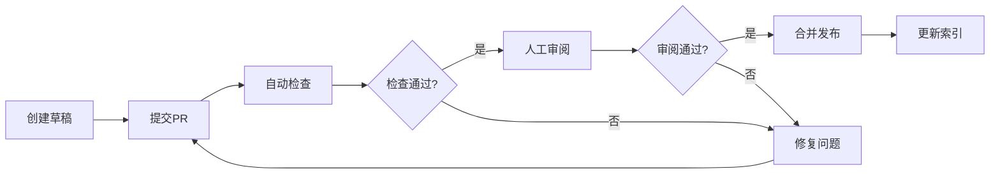

# 文档编写与维护指南

- **维护人**：Claude Code
- **最后更新**：2025-01-12
- **版本**：v3.0（Phase 2 SSOT合并）

本文档定义LYBT项目文档的编写规范、质量标准、维护流程和自动化机制，确保知识体系统一、可维护、高质量。

---

## 📌 核心原则

### 1. SSOT原则（Single Source of Truth）

**定义**：每个知识点只在一个权威位置维护，其他地方通过引用而非复制来使用。

**实践**：
- ✅ **一个主题 = 一个权威文档**
- ✅ **其他文档通过链接引用**，而非复制粘贴
- ✅ **定期审查并合并重复内容**
- ❌ **禁止多处维护相同内容**

**示例**：
- 错误❌：在 `standards.md` 和 `coding-spec.md` 中重复编写命名规范
- 正确✅：在 `standards.md` 中统一编写，`coding-spec.md` 通过链接引用

### 2. 文档分层原则

| 层级 | 说明 | 示例 |
|------|------|------|
| **索引层** | 导航和组织文档 | `docs/index.md`, `docs/architecture/README.md` |
| **规范层** | 约束和标准 | `docs/development/standards.md` |
| **指南层** | 实践和教程 | `docs/development/testing-guide.md` |
| **报告层** | 分析和总结 | `docs/reports/` |

### 3. 最小维护原则

- **能合并就合并**：相似主题文档优先合并（如Phase 2: 4→1, 5→2）
- **能引用就引用**：避免重复编写，使用链接引用
- **能自动化就自动化**：索引、检查、统计尽量自动化

---

## 📝 命名规范

### 文件命名

1. **日期型文档**（报告、分析）：`yyyy-mm-dd-主题.md`
   - 示例：`2025-10-11-architecture-refactoring-summary.md`

2. **永久型文档**（规范、指南）：语义化名称
   - 示例：`standards.md`, `testing-guide.md`, `README.md`

3. **索引型文档**：`README.md` 或 `INDEX.md`
   - 目录索引优先使用 `README.md`
   - 列表索引使用 `INDEX.md`

4. **版本标记**（重大更新）：`-v2`, `-v3` 后缀
   - 示例：`coding-spec-v2.md`
   - 在文首注明变更摘要

### 目录命名

| 目录 | 用途 | 命名规则 |
|------|------|---------|
| `docs/development/` | 开发规范、指南 | 小写+连字符 |
| `docs/architecture/` | 架构设计、ADR | 小写+连字符 |
| `docs/reports/` | 分析报告、总结 | 日期前缀 |
| `docs/tasks/` | 任务计划、总结 | 按状态分类 |
| `docs/api/` | API文档 | 按模块分类 |

---

## 📂 目录与索引管理

### 索引更新规则

**新增文档后必须更新**：
1. **主索引**：`docs/index.md`（所有重要文档）
2. **分类索引**：
   - `docs/architecture/README.md`（架构文档）
   - `docs/development/README.md`（开发文档）
   - `docs/reports/INDEX.md`（报告文档）
   - `docs/tasks/README.md`（任务文档）

### 归档规则

**触发条件**：
- 文档被新版本取代
- 超过3个月未更新的分析报告
- 已完成的一次性任务文档

**归档流程**：
1. 移动到 `docs/reports/archive/` 或 `docs/tasks/archive/`
2. 在 `docs/ARCHIVE.md` 记录（归档日期、原因、新版本链接）
3. 更新所有相关索引
4. 检查并移除失效引用

### 临时文件管理

| 文件类型 | 存放位置 | 说明 |
|---------|---------|------|
| 草稿 | `.claude/drafts/` | 未完成的文档 |
| 临时分析 | `.claude/tmp/` | 临时输出 |
| 个人笔记 | 个人分支 | 不提交到主分支 |

❌ **禁止在根目录或 `docs/` 散落临时文件**

---

## ✍️ 内容编写规范

### 语言规范

- **描述语言**：中文（包括注释、说明）
- **代码示例**：英文变量名、注释可中英混合
- **专业术语**：首次出现时中英对照，如"依赖注入（Dependency Injection, DI）"

### 文档结构模板

#### 规范类文档
```markdown
# 标题

- **维护人**：[姓名/工具名]
- **最后更新**：[日期]
- **版本**：[版本号]

## 目标与范围
## 核心规范
## 示例
## 常见问题
## 参考资料
```

#### 报告类文档
```markdown
# 标题

**版本**：[版本]
**创建时间**：[日期]
**状态**：[进行中/已完成]

## 背景与目标
## 现状分析
## 解决方案
## 实施计划
## 验收标准
## 附件/参考
```

#### 任务类文档
```markdown
# 标题

## 任务描述
## 验收标准
## 实施步骤
## 风险与依赖
## 产出物
```

### 链接规范

1. **使用相对路径**：
   ```markdown
   [架构标准](../architecture/server-module-design-standard.md)
   ```

2. **带行号引用**（精确定位）：
   ```markdown
   [WebAPI入口](../../src/Server/Services/LYBT.WebAPI/Program.cs:39)
   ```

3. **GitHub Issue/PR引用**：
   ```markdown
   参见 #1147, PR #1146
   ```

### 元信息规范

**文首必须包含**：
```markdown
- **维护人**：[负责人]
- **最后更新**：[YYYY-MM-DD]
- **版本**：[v1.0/v2.0等]
```

**可选元信息**：
- 编写人（首次创建者）
- Issue追踪（关联的Issue编号）
- 状态（草稿/审查中/已发布）

---

## 🎯 文档质量标准

### 五维质量模型

| 维度 | 标准 | 检查要点 |
|------|------|---------|
| **准确性** | 内容与代码实现一致 | 代码引用行号正确、API签名匹配、数据准确 |
| **完整性** | 涵盖所有必要信息 | 背景、目标、方案、验收、参考一应俱全 |
| **可读性** | 结构清晰、表达简洁 | 分层合理、段落适中、术语统一、格式规范 |
| **时效性** | 反映最新状态 | 更新日期、版本号、标记过时内容 |
| **可追溯性** | 能找到上下文 | 引用完整、链接有效、Issue/PR关联明确 |

### 质量检查清单

以下提供6类文档操作的质量检查清单，确保文档符合项目标准。

#### 📝 新建文档检查清单

**基础要求**
- [ ] **文件命名**：符合命名规范（日期型/永久型/索引型）
- [ ] **文件位置**：放置在正确的目录（development/architecture/reports/tasks等）
- [ ] **文件编码**：UTF-8 with BOM

**元信息**
- [ ] **维护人**：已声明维护人
- [ ] **创建日期**：已标注创建/最后更新日期
- [ ] **版本号**：已标注版本号（v1.0起）
- [ ] **Issue关联**：已关联相关Issue编号（如适用）

**内容质量（五维标准）**
- [ ] **准确性**：内容与代码实现一致，无事实错误
- [ ] **完整性**：包含背景、目标、方案、验收、参考等必要章节
- [ ] **可读性**：结构清晰、分层合理、术语统一、格式规范
- [ ] **时效性**：反映最新状态，标记了所有时间敏感信息
- [ ] **可追溯性**：引用完整、链接有效、Issue/PR关联明确

**SSOT原则**
- [ ] **无重复内容**：搜索确认无重复主题文档
- [ ] **合理引用**：引用已有文档而非复制粘贴
- [ ] **单一真相源**：确保本文档是该主题的唯一权威来源

**索引更新**
- [ ] **主索引**：已更新 `docs/index.md`
- [ ] **分类索引**：已更新相关分类索引（README/INDEX）
- [ ] **模块索引**：已更新模块级索引（如适用）

**Markdown规范**
- [ ] **格式检查**：通过Markdown lint检查
- [ ] **链接检查**：所有链接有效（相对路径正确）
- [ ] **代码块**：代码示例有语言标记，格式正确
- [ ] **表格对齐**：表格列对齐，易读性好

#### 🔄 文档更新检查清单

**更新追溯**
- [ ] **更新日期**：已更新"最后更新"日期
- [ ] **版本号**：重大更新时递增版本号
- [ ] **变更记录**：在变更历史表中记录本次更新
- [ ] **Issue关联**：更新关联的Issue/PR编号

**内容一致性**
- [ ] **代码引用**：验证代码引用行号仍然正确
- [ ] **链接有效**：检查所有链接仍然有效
- [ ] **数据准确**：统计数据、配置信息已更新
- [ ] **示例有效**：代码示例与当前版本匹配

**影响范围**
- [ ] **引用检查**：搜索并更新引用本文档的其他文档
- [ ] **索引同步**：相关索引已同步更新
- [ ] **关联文档**：相关文档已知晓本次更新

**质量保持**
- [ ] **准确性**：更新内容与实际实现一致
- [ ] **完整性**：新增内容不破坏原有结构
- [ ] **可读性**：保持一致的风格和术语
- [ ] **SSOT**：未引入与其他文档的重复内容

#### 📦 文档归档检查清单

**归档前提**
- [ ] **归档理由**：明确归档原因（被取代/过期/已完成）
- [ ] **新版本**：如被取代，新版本已就绪
- [ ] **通知**：已通知相关人员即将归档

**归档操作**
- [ ] **文件移动**：移动到 `docs/reports/archive/` 或 `docs/tasks/archive/`
- [ ] **归档记录**：在 `docs/ARCHIVE.md` 中记录（归档日期、原因说明、新版本链接）
- [ ] **状态标记**：在原文档顶部添加"已归档"标记（如保留副本）

**清理工作**
- [ ] **引用更新**：所有引用已指向新版本或移除
- [ ] **索引更新**：从活跃索引中移除
- [ ] **链接检查**：确认无死链遗留

**保留价值**
- [ ] **历史价值**：评估是否有历史参考价值
- [ ] **可检索**：归档后仍可通过ARCHIVE.md检索
- [ ] **元数据**：保留足够的元信息便于未来查找

#### 🔀 文档合并检查清单

**合并前分析**
- [ ] **合并理由**：符合合并条件（内容重复>60%/受众相同/主题一致）
- [ ] **受众评估**：明确目标受众，确认合并后仍满足需求
- [ ] **内容清单**：列出所有待合并文档的核心内容
- [ ] **Issue创建**：已创建合并Issue，说明理由和计划

**内容整合**
- [ ] **共性识别**：识别共性内容，合并为核心章节
- [ ] **差异保留**：识别差异内容，作为专题或子章节
- [ ] **过时清理**：识别并删除过时、无效内容
- [ ] **结构优化**：优化合并后的文档结构，符合分层原则

**质量保证**
- [ ] **准确性**：合并过程中未引入错误
- [ ] **完整性**：所有重要内容已覆盖
- [ ] **可读性**：合并后文档流畅、逻辑清晰
- [ ] **SSOT验证**：确认成为该主题的唯一权威来源

**后续清理**
- [ ] **源文档删除**：删除被合并的源文档
- [ ] **引用更新**：所有引用已指向新文档
- [ ] **索引更新**：所有索引已更新
- [ ] **编译验证**：编译通过，无死链

#### 📊 PR提交前检查清单

**PR基础**
- [ ] **分支命名**：feature/issue-XXXX-描述
- [ ] **PR标题**：清晰描述变更内容
- [ ] **PR描述**：包含清单完成情况、变更统计、验证结果
- [ ] **Issue关联**：使用 `Fixes #XXXX` 自动关闭Issue

**CI检查**
- [ ] **编译验证**：`dotnet build LYBT.All.sln -c Release` 通过
- [ ] **Markdown lint**：格式检查通过
- [ ] **链接检查**：无死链
- [ ] **索引完整性**：索引完整无遗漏

**审查准备**
- [ ] **自检清单**：已完成本检查清单所有适用项
- [ ] **变更摘要**：PR中包含清晰的变更摘要
- [ ] **影响范围**：已说明影响范围和验证方法
- [ ] **回滚方案**：重大变更已准备回滚方案（如需要）

#### 🎯 定期审查检查清单（季度）

**文档健康度**
- [ ] **更新状态**：超过3个月未更新的文档已评估
- [ ] **引用有效**：高频引用的文档链接已检查
- [ ] **重复内容**：已识别并计划合并重复文档

**索引完整性**
- [ ] **主索引**：`docs/index.md` 包含所有重要文档
- [ ] **分类索引**：各分类索引完整无遗漏
- [ ] **孤立文档**：无未被索引的孤立文档

**自动化机制**
- [ ] **CI状态**：文档检查CI正常运行
- [ ] **脚本更新**：维护脚本与文档结构匹配
- [ ] **统计报告**：生成文档统计报告并分析

---

## 🔄 文档合并与重构策略

### 何时合并文档

**合并条件**（满足2项以上）：
- ✅ 内容重复率 >60%
- ✅ 目标受众相同
- ✅ 更新频率一致
- ✅ 逻辑上属于同一主题

**Phase 2经验**：
- 开发规范：4→1（standards.md整合4份规范）
- 测试指南：5→2（testing-guide.md + testing-training-materials.md）
- 架构文档：删除占位+增强索引（保留互补文档）

### 合并流程

1. **创建Issue**：说明合并理由、目标受众、预期结构
2. **内容分析**：
   - 识别共性内容（合并为核心章节）
   - 识别差异内容（作为专题章节）
   - 识别过时内容（删除或归档）
3. **执行合并**：
   - 创建新文档或重写目标文档
   - 删除源文档
   - 更新所有引用
4. **验证**：编译检查、链接检查、索引更新

### 文档拆分策略

**拆分条件**（满足2项以上）：
- ✅ 单文档超过1000行
- ✅ 包含3个以上独立主题
- ✅ 不同受众需要不同深度
- ✅ 更新频率差异大

**拆分原则**：
- 按主题拆分（如架构、安全、性能）
- 按受众拆分（如开发者、运维、测试）
- 按层次拆分（如概览、详细设计、实施指南）

---

## 👥 审阅流程（GitHub集成）

### 文档生命周期



### PR检查清单

**CI自动检查**（必须通过）：
- ✅ Markdown格式检查
- ✅ 链接有效性检查
- ✅ 索引完整性检查
- ✅ 文件编码检查（UTF-8 with BOM）

**人工审阅要点**：
- [ ] 符合SSOT原则（无重复内容）
- [ ] 符合质量五维标准
- [ ] 元信息完整
- [ ] 索引已更新
- [ ] 引用正确

### 角色与职责

| 角色 | 职责 | 关注点 |
|------|------|--------|
| **文档作者** | 编写、提交PR、响应反馈 | 内容准确、结构清晰 |
| **AI审查** | 自动检查格式、链接、索引 | 格式规范、链接有效 |
| **人工审查** | 验证内容质量、逻辑完整性 | 准确性、完整性 |
| **维护者** | 批准合并、管理索引 | 体系一致性 |

---

## 🤖 自动化机制

文档自动化维护包含三个层次：
1. **CI集成检查**：PR提交时自动运行
2. **维护脚本**：按需或定期执行
3. **监控报告**：定期生成文档健康度报告

### 1. CI集成检查

#### 当前CI检查（已实现）

| 检查项 | 工作流 | 状态 |
|-------|--------|------|
| Claude Code自动审查 | `.github/workflows/pr-review.yml` | ✅ 已实现 |
| 架构合规测试 | `.github/workflows/pr-review.yml` | ✅ 已实现 |
| 根目录文件检查 | `.github/workflows/root-directory-guard.yml` | ✅ 已实现 |

#### 建议新增CI检查

**Markdown格式检查**：
- 工作流：`.github/workflows/doc-quality-check.yml`
- 使用 `DavidAnson/markdownlint-cli2-action@v11`
- 配置文件：`.markdownlint.json`

**链接有效性检查**：
- 使用 `gaurav-nelson/github-action-markdown-link-check@v1`
- 配置文件：`.markdown-link-check.json`
- 支持超时重试和429错误处理

**索引完整性检查**：
- 脚本：`scripts/check-index-completeness.ps1`
- 检查所有文档是否被索引
- 报告未被索引的孤立文档

**文件编码检查**：
- 脚本：`scripts/check-file-encoding.ps1`
- 验证所有Markdown文件为UTF-8 with BOM
- CI集成自动检测

### 2. 维护脚本

#### 死链检测脚本

**脚本**：`scripts/check-dead-links.ps1`

**功能**：
- 扫描Markdown文档中的所有链接
- 验证本地文件链接和Web链接有效性
- 生成死链报告（可导出CSV）

**使用示例**：
```powershell
# 检测死链
.\scripts\check-dead-links.ps1 -Path docs/

# 生成报告
.\scripts\check-dead-links.ps1 -Path docs/ -OutputReport dead-links-report.txt
```

**核心功能**：
- 支持相对路径解析
- 自动跳过锚点和localhost链接
- Web链接状态码验证（HEAD请求）
- 结果表格化输出

#### 文档统计脚本

**脚本**：`scripts/doc-stats.ps1`

**功能**：
- 统计文档数量、行数、文件大小
- 提取元信息（维护人、更新日期、版本号）
- 生成统计摘要和详细CSV报告

**使用示例**：
```powershell
# 生成统计报告
.\scripts\doc-stats.ps1 -Output docs/reports/doc-stats.csv
```

**输出内容**：
- 总文档数、总行数、总大小
- 维护人分布统计
- 最近更新文档列表（Top 10）
- 详细的文档清单（CSV格式）

#### 索引同步脚本

**脚本**：`scripts/sync-index.ps1`

**功能**：
- 扫描指定目录下的Markdown文件
- 自动提取文档标题和描述
- 生成格式化的索引表格
- 交互式确认更新

**使用示例**：
```powershell
# 同步开发文档索引
.\scripts\sync-index.ps1 -Scan docs/development/ -Index docs/development/README.md

# 同步架构文档索引
.\scripts\sync-index.ps1 -Scan docs/architecture/ -Index docs/architecture/README.md
```

### 3. 监控报告

#### 文档健康度报告（季度）

**脚本**：`scripts/generate-health-report.ps1`

**功能**：
- 分析文档质量和更新频率
- 识别过期文档（>3个月未更新）
- 检查索引完整性和链接有效性
- 计算文档健康度评分

**使用示例**：
```powershell
# 生成健康度报告
.\scripts\generate-health-report.ps1 -OutputDir docs/reports/
```

**报告内容**：
- 总体统计（文档数、过期文档数、健康度评分）
- 详细分析（更新时效性、死链统计）
- 改进建议（归档、修复、更新）
- 下一步行动清单

### 4. 使用场景和频率

| 场景 | 工具 | 频率 | 触发方式 |
|------|------|------|---------|
| PR提交 | CI自动检查 | 每次PR | 自动触发 |
| 文档新增 | 索引同步脚本 | 按需 | 手动运行 |
| 链接检查 | 死链检测脚本 | 每周 | 定时任务 |
| 文档统计 | 统计脚本 | 每月 | 手动运行 |
| 健康度报告 | 健康度脚本 | 每季度 | 手动运行 |

### 5. 实施计划

**Phase 1: CI基础检查（优先级：高）**
- [ ] 实现Markdown lint检查
- [ ] 实现链接有效性检查
- [ ] 实现索引完整性检查
- [ ] 实现文件编码检查

**Phase 2: 维护脚本（优先级：中）**
- [ ] 创建死链检测脚本
- [ ] 创建文档统计脚本
- [ ] 创建索引同步脚本

**Phase 3: 监控报告（优先级：低）**
- [ ] 创建健康度报告脚本
- [ ] 建立定期报告机制

---

## ❓ 常见问题

### Q1: 如何处理命名冲突？
**A**:
1. 检查是否已有同主题文档
2. 若存在，评估是否需要合并
3. 若需独立，在名称中加入子系统或阶段标识
4. 示例：`server-testing-guide.md` vs `desktop-testing-guide.md`

### Q2: 如何避免重复内容？
**A**:
1. 编写前搜索已有文档（`grep -r "关键词" docs/`）
2. 发现重复时，优先引用而非复制
3. 定期运行文档审查（每季度），识别并合并重复内容

### Q3: 老旧文档如何处理？
**A**:
1. 超过3个月未更新的分析报告 → 评估归档
2. 被新版本取代的规范 → 归档并注明新版本链接
3. 一次性任务完成后 → 归档到 `docs/tasks/archive/`

### Q4: 如何保证文档与代码一致？
**A**:
1. 代码变更时同步更新文档（PR检查项）
2. 使用精确的代码引用（文件:行号）
3. 定期审查高频引用的代码位置
4. CI检查代码引用的行号有效性（可选）

### Q5: 新人如何快速了解文档体系？
**A**:
1. 从 `docs/index.md` 开始
2. 阅读本文档（文档规范）
3. 查看 `docs/architecture/README.md`（架构导航）
4. 参考 `docs/development/README.md`（开发指南）

---

## 📚 参考资料

- [文件组织规范](file-organization-guidelines.md)
- [开发标准](standards.md)
- [架构文档索引](../architecture/README.md)
- [GitHub Actions文档](https://docs.github.com/en/actions)
- [PowerShell文档](https://learn.microsoft.com/en-us/powershell/)

---

## 📋 变更历史

| 版本 | 日期 | 变更内容 | Issue |
|------|------|---------|-------|
| v1.0 | 2025-09-25 | 初始版本 | - |
| v2.0 | 2025-10-11 | Phase 3重构：增加SSOT原则、质量标准、合并策略、自动化机制 | #1147 |
| v3.0 | 2025-01-12 | Phase 2 SSOT合并：整合quality-checklist和automation-guide，形成统一权威文档 | #1181 |

---

请在新文档中引用本指南，并严格遵守上述规范。如需新增规范，请提交Issue并在审阅通过后更新此文件。

🤖 最后更新：Phase 3 - 文档治理规则建立
