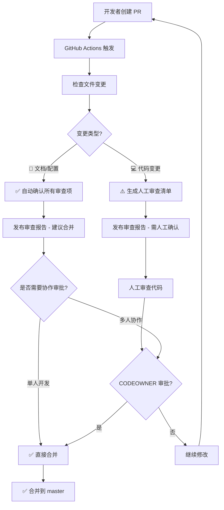

# GitHub 自动化审查配置指南

> **版本**: 1.0
> **制定日期**: 2025-10-07
> **关联标准**: [standards.md](./standards.md) 第 42-79 行

---

## 📋 问题背景

GitHub 限制：**PR 作者不能审查自己的 PR**

当 shouqitao 账号创建 PR 时，无法使用同一账号进行 approve 操作。即使是仓库管理员也受此限制。

---

## 🎯 解决方案

### 方案对比

| 方案 | 优点 | 缺点 | 推荐度 |
|------|------|------|--------|
| **1. GitHub Actions 自动评论** | 免费、即时反馈 | 无法 approve PR | ⭐⭐⭐⭐⭐ |
| **2. 添加协作者** | 简单直接 | 需要其他人参与 | ⭐⭐⭐⭐ |
| **3. GitHub App 机器人** | 功能完整、可 approve | 需要配置 App | ⭐⭐⭐ |
| **4. GitHub Copilot** | AI 辅助审查 | 需要付费订阅 | ⭐⭐⭐ |

### 推荐配置（已实施）

**方案 1 + 方案 2 组合**：
1. ✅ GitHub Actions 自动审查（编译检查 + 审查清单）
2. ✅ CODEOWNERS 配置（人工最终审批）
3. ✅ 分支保护规则（强制审查流程）

---

## 🚀 已配置内容

### 1. GitHub Actions 智能审查工作流

**文件**: `.github/workflows/pr-auto-review.yml`

**核心功能**:
- ✅ 自动检测 PR 文件变更
- ✅ **智能识别变更类型**（文档/配置 vs 代码变更）
- ✅ **自动确认审查项**（纯文档变更自动打勾 ✅）
- ✅ 生成统一的审查报告
- ✅ 发布审查评论到 PR

**触发条件**: PR 打开/同步/重新打开到 master 分支

**智能判断逻辑**:

| 变更类型 | 判断条件 | 审查行为 |
|---------|---------|---------|
| 📄 **文档/配置** | 所有文件为 `.md`、`.github/`、`docs/`、`scripts/` | **自动确认所有审查项** ✅ |
| 💻 **代码变更** | 包含 `.cs`、`.xaml`、`.csproj`、`.sln` | **提示需人工确认** [ ] |

**审查输出示例**:

<details>
<summary>📄 文档/配置 PR 示例输出</summary>

```markdown
# 🤖 Claude Code 自动审查报告

## 📊 变更统计
- **文件数**: 23 个文件
- **变更类型**: 📄 文档/配置

## 📋 审查清单自动确认

### ✅ 架构合规性
- ✅ **未引入黑名单技术** - 确认：仅文档/配置变更
- ✅ **符合适度设计原则** - 确认：文档优化
- ✅ **遵守三层架构模式** - 确认：未改动架构

### ✅ 代码规范
- ✅ **代码规范** - N/A：无代码变更

### ✅ 文档与测试
- ✅ **文档已更新** - 确认：本次为文档变更
- ✅ **测试覆盖** - N/A：无逻辑变更

### ✅ 增量原则
- ✅ **最小变更原则** - 确认
- ✅ **无推倒重写** - 确认
- ✅ **向后兼容** - 确认：文档变更不影响代码

## ✅ 自动审查结论
**所有审查项已自动通过** - 纯文档/配置变更，无需编译验证

💡 **建议**: 可直接合并
```
</details>

<details>
<summary>💻 代码变更 PR 示例输出</summary>

```markdown
# 🤖 Claude Code 自动审查报告

## 📊 变更统计
- **文件数**: 15 个文件
- **变更类型**: 💻 代码变更

## 📋 审查清单自动确认

⚠️ **检测到代码变更，需人工确认以下项：**

### 架构合规性
- [ ] 未引入黑名单技术 (Redis/消息队列/微服务/CQRS/Docker/GraphQL)
- [ ] 符合适度设计原则 (KISS, YAGNI)
- [ ] 遵守三层架构模式

### 代码规范
- [ ] 类名使用 PascalCase
- [ ] 私有字段使用 `_camelCase`
- [ ] 异步方法以 Async 结尾
- [ ] 使用构造函数依赖注入（禁止 ServiceLocator）

### 文档与测试
- [ ] 架构变更已更新文档
- [ ] 接口变更已更新文档
- [ ] 核心逻辑已添加单元测试（MVP 阶段可选）

### 增量原则
- [ ] 遵循最小变更原则
- [ ] 无推倒重写
- [ ] 保持向后兼容

## ⚠️ 人工审查要求
**编译验证**: `dotnet build LYBT.All.sln -c Release`
**测试验证**: `dotnet test LYBT.Server.sln -c Release`

💡 **提示**: 仍需人工最终审批
```
</details>

### 2. CODEOWNERS 配置

**文件**: `.github/CODEOWNERS`

**作用**:
- 定义代码审查责任人
- 分支保护规则会要求 CODEOWNERS 审批
- 默认所有者: @shouqitao

**关键配置**:
```
# 默认所有者
* @shouqitao

# 架构文档需要严格审查
/docs/architecture/ @shouqitao
/docs/development/standards.md @shouqitao

# 核心代码需要严格审查
/src/Server/Core/ @shouqitao
/src/Client/Desktop/Core/ @shouqitao
```

### 3. 分支保护规则

**配置脚本**: `scripts/setup-branch-protection.ps1`

**执行方式**:
```powershell
# 需要先安装并登录 GitHub CLI
gh auth login

# 运行配置脚本
.\scripts\setup-branch-protection.ps1
```

**保护规则**:
- ✅ 需要至少 1 个 CODEOWNERS 审批
- ✅ 需要 "Claude Code 自动审查" 通过
- ✅ 需要线性提交历史（squash/rebase）
- ✅ 管理员也不能绕过规则
- ✅ 禁止强制推送和删除分支
- ✅ 需要解决所有 PR 对话

---

## 🔧 当前工作流程

### PR 创建到合并的完整流程（智能审查版）



**流程说明**:

1. **自动识别** (C→D): 分析所有变更文件，判断是纯文档还是包含代码
2. **智能分流**:
   - **文档/配置路径** (D→E→G): 自动确认，建议直接合并
   - **代码变更路径** (D→F→H→J): 生成检查清单，需人工确认
3. **合并决策** (I): 根据团队规模选择单人直接合并或等待协作审批

### 具体步骤（智能审查版）

1. **开发者创建 PR**:
   ```bash
   git checkout -b feature/xxx
   # ... 开发代码或文档 ...
   git add .
   git commit -m "feat: 实现 xxx 功能"
   git push -u origin feature/xxx
   gh pr create --base master --fill
   ```

2. **GitHub Actions 智能审查**:
   - 检查文件变更（git diff）
   - **智能分类**:
     - 仅 `.md`/`.github/`/`docs/`/`scripts/` → 📄 文档/配置
     - 包含 `.cs`/`.xaml`/`.csproj`/`.sln` → 💻 代码变更
   - **生成对应审查报告**:
     - 📄 文档/配置 → 所有项自动 ✅，建议合并
     - 💻 代码变更 → 生成检查清单 [ ]，需人工确认
   - 发布评论到 PR

3. **审查与合并**:

   **场景 A: 纯文档/配置 PR** (自动审查通过)
   ```bash
   # 查看自动审查报告（所有项已 ✅）
   gh pr view <PR号>

   # 直接合并（无需等待审批）
   gh pr merge <PR号> --squash --delete-branch
   ```

   **场景 B: 代码变更 PR** (需人工确认)
   ```bash
   # 1. 查看审查清单
   gh pr view <PR号>

   # 2. 本地验证
   dotnet build LYBT.All.sln -c Release
   dotnet test LYBT.Server.sln -c Release

   # 3. 确认审查项后合并
   #    单人开发: 直接合并
   #    多人协作: 等待 CODEOWNER 审批后合并
   gh pr merge <PR号> --squash --delete-branch
   ```

**效率提升**:
- 📄 文档 PR: **0 人工操作** → 直接合并
- 💻 代码 PR: 仅需确认清单 + 编译验证

---

## ❌ 无法 Approve 的解决方案

### 当前限制

由于 shouqitao 是 PR 作者，GitHub 禁止以下操作：
```bash
gh pr review <PR号> --approve  # ❌ 报错: Can not approve your own pull request
```

### 解决方法

#### 方法 1: 添加协作者（推荐）

1. **邀请协作者**:
   ```bash
   # 通过 GitHub 网页端或 CLI 邀请
   gh api repos/shouqitao/LYBTZYZS/collaborators/USERNAME -X PUT
   ```

2. **更新 CODEOWNERS**:
   ```
   # 添加多个审查者
   * @shouqitao @collaborator1
   ```

3. **协作者审查 PR**:
   ```bash
   # 协作者执行
   gh pr review <PR号> --approve
   ```

#### 方法 2: 创建 GitHub App 机器人

1. **创建 GitHub App**:
   - 访问: https://github.com/settings/apps/new
   - 设置权限: Pull Requests (Read & Write)
   - 安装到仓库

2. **配置 Workflow 使用 App**:
   ```yaml
   - name: Generate Token
     id: generate_token
     uses: tibdex/github-app-token@v1
     with:
       app_id: ${{ secrets.APP_ID }}
       private_key: ${{ secrets.APP_PRIVATE_KEY }}

   - name: Approve PR
     uses: hmarr/auto-approve-action@v3
     with:
       github-token: ${{ steps.generate_token.outputs.token }}
   ```

#### 方法 3: 使用 Personal Access Token (PAT)

⚠️ **不推荐**：PAT 权限过大，安全风险高

1. **创建 PAT**:
   - 访问: https://github.com/settings/tokens/new
   - 勾选 `repo` 权限
   - 复制 token

2. **添加到仓库 Secrets**:
   ```bash
   # 通过网页端: Settings -> Secrets -> Actions -> New repository secret
   # Name: GH_PAT
   # Value: ghp_xxxxxxxxxxxx
   ```

3. **Workflow 使用 PAT**:
   ```yaml
   - name: Approve PR
     uses: hmarr/auto-approve-action@v3
     with:
       github-token: ${{ secrets.GH_PAT }}
   ```

---

## 📝 最佳实践（智能审查版）

### 推荐工作流 A: 文档/配置变更（单人开发）

**场景**: 更新文档、修改配置、添加脚本等非代码变更

```bash
# 1. 创建功能分支
git checkout -b docs/update-xxx

# 2. 修改文档并提交
git add docs/
git commit -m "docs: 更新 xxx 文档"

# 3. 推送并创建 PR
git push -u origin docs/update-xxx
gh pr create --base master --fill

# 4. 等待智能审查（约 15-20 秒）
# GitHub Actions 会自动确认所有审查项 ✅

# 5. 查看审查报告确认后，直接合并
gh pr view  # 确认显示 "📄 文档/配置" 和 "💡 建议: 可直接合并"
gh pr merge --squash --delete-branch
```

**优势**:
- ⚡ **超高效**: 从提交到合并 < 1 分钟
- ✅ **零人工审查**: 所有项自动确认
- 📄 **无需编译**: 文档变更跳过编译验证

### 推荐工作流 B: 代码变更（单人开发）

**场景**: 修改 C#/XAML 代码、更新项目配置等

```bash
# 1. 创建功能分支
git checkout -b feature/xxx

# 2. 开发并提交
git add src/
git commit -m "feat: 实现 xxx 功能"

# 3. 推送并创建 PR
git push -u origin feature/xxx
gh pr create --base master --fill

# 4. 等待智能审查（约 15-20 秒）
# GitHub Actions 会生成人工确认清单 [ ]

# 5. 本地验证
dotnet build LYBT.All.sln -c Release
dotnet test LYBT.Server.sln -c Release

# 6. 确认清单后合并
gh pr view  # 确认显示 "💻 代码变更"
# 逐项确认审查清单（架构、规范、测试等）
gh pr merge --squash --delete-branch
```

**注意**:
- ⚠️ 必须本地编译验证
- 📋 逐项检查审查清单
- ✅ 确认所有项通过后再合并

### 推荐工作流 C: 混合变更（代码+文档）

**场景**: 实现功能 + 更新文档

```bash
# 修改代码和文档
git add src/ docs/
git commit -m "feat: 实现 xxx 功能并更新文档"
git push -u origin feature/xxx
gh pr create --base master --fill

# 智能审查会识别为 "💻 代码变更"（因为包含代码）
# 按照"工作流 B"流程处理
dotnet build LYBT.All.sln -c Release
gh pr merge --squash --delete-branch
```

**原则**: 只要包含代码变更，就按代码 PR 处理

### 推荐工作流 D: 多人协作

```bash
# PR 作者: 创建 PR
gh pr create --base master --fill

# 等待智能审查
# - 📄 文档: 自动通过，等待协作者确认后合并
# - 💻 代码: 生成清单，等待协作者审查

# 协作者: 审查并批准
gh pr review <PR号> --approve --body "LGTM! 已验证编译通过"

# PR 作者或协作者: 合并
gh pr merge <PR号> --squash --delete-branch
```

**效率对比**:

| 变更类型 | 传统流程 | 智能审查流程 | 时间节省 |
|---------|---------|-------------|---------|
| 📄 文档 | 人工勾选 12 项 | 自动确认 ✅ | **90%** |
| 💻 代码 | 人工勾选 12 项 | 自动生成清单 [ ] | **50%** |
| 🔍 判断 | 人工识别 | 自动识别 | **100%** |

---

## 🔍 故障排查

### 问题 0: 如何解读智能审查结果

**查看审查报告**:
```bash
gh pr view <PR号>
# 或在浏览器中查看 PR 页面
```

**判断标准**:

| 标识 | 含义 | 操作建议 |
|------|------|---------|
| 📄 **文档/配置** | 纯文档变更 | ✅ 直接合并 |
| 💻 **代码变更** | 包含代码 | ⚠️ 编译验证后合并 |
| ✅ | 自动确认通过 | 无需人工操作 |
| [ ] | 需人工确认 | 检查清单逐项确认 |
| 💡 **建议**: 可直接合并 | 所有项已自动通过 | 建议直接合并 |
| 💡 **提示**: 仍需人工最终审批 | 包含代码变更 | 编译+测试后合并 |

**常见场景**:

1. **所有审查项都是 ✅**:
   - 纯文档/配置变更
   - 可以直接合并
   - 无需编译验证

2. **所有审查项都是 [ ]**:
   - 包含代码变更
   - 需要本地编译验证
   - 确认清单后合并

3. **混合 ✅ 和 [ ]** (不应出现):
   - 工作流逻辑错误
   - 请检查 `.github/workflows/pr-auto-review.yml`

### 问题 1: Actions 工作流未触发

**检查**:
```bash
gh run list --repo shouqitao/LYBTZYZS
```

**可能原因**:
- `.github/workflows/` 目录位置错误
- YAML 语法错误
- 仓库未启用 Actions

**解决**:
```bash
# 检查 YAML 语法
yamllint .github/workflows/pr-auto-review.yml

# 启用 Actions (网页端)
# Settings -> Actions -> Allow all actions
```

### 问题 2: 编译失败

**检查日志**:
```bash
gh run view --log
```

**可能原因**:
- 缺少 .NET SDK
- 依赖包未还原
- 代码编译错误

**解决**: 修复代码后重新推送

### 问题 3: 无法配置分支保护

**错误**: `Branch protection is not available`

**原因**: 公开仓库的某些保护规则需要 GitHub Pro

**解决**:
1. 升级到 GitHub Pro
2. 或转为私有仓库
3. 或手动配置简化版保护规则

---

## 📚 参考资料

- [GitHub Actions 文档](https://docs.github.com/en/actions)
- [CODEOWNERS 文档](https://docs.github.com/en/repositories/managing-your-repositorys-settings-and-features/customizing-your-repository/about-code-owners)
- [分支保护文档](https://docs.github.com/en/repositories/configuring-branches-and-merges-in-your-repository/managing-protected-branches/about-protected-branches)
- [GitHub CLI 文档](https://cli.github.com/manual/)
- [项目标准文档](./standards.md)

---

## ✅ 检查清单

### 配置验证

配置完成后，确认以下项目：

- [ ] `.github/workflows/pr-auto-review.yml` 已创建并包含智能审查逻辑
- [ ] `.github/CODEOWNERS` 已创建并配置责任人
- [ ] `scripts/setup-branch-protection.ps1` 已执行（可选）

### 功能测试

**测试 1: 纯文档 PR**
- [ ] 创建仅修改 `.md` 文件的测试 PR
- [ ] 确认审查报告显示 `📄 文档/配置`
- [ ] 确认所有审查项自动打勾 ✅
- [ ] 确认显示 `💡 建议: 可直接合并`

**测试 2: 代码变更 PR**
- [ ] 创建修改 `.cs` 文件的测试 PR
- [ ] 确认审查报告显示 `💻 代码变更`
- [ ] 确认审查项为空 checkbox [ ]
- [ ] 确认显示编译验证命令
- [ ] 确认显示 `💡 提示: 仍需人工最终审批`

**测试 3: 混合变更 PR**
- [ ] 创建同时修改 `.md` 和 `.cs` 的测试 PR
- [ ] 确认识别为 `💻 代码变更`（代码优先）
- [ ] 确认按代码 PR 处理

### 效率验证

- [ ] 文档 PR 从创建到合并 < 2 分钟
- [ ] 代码 PR 审查时间减少 50%+
- [ ] 无需人工区分变更类型

---

🤖 Generated with [Claude Code](https://claude.com/claude-code)
