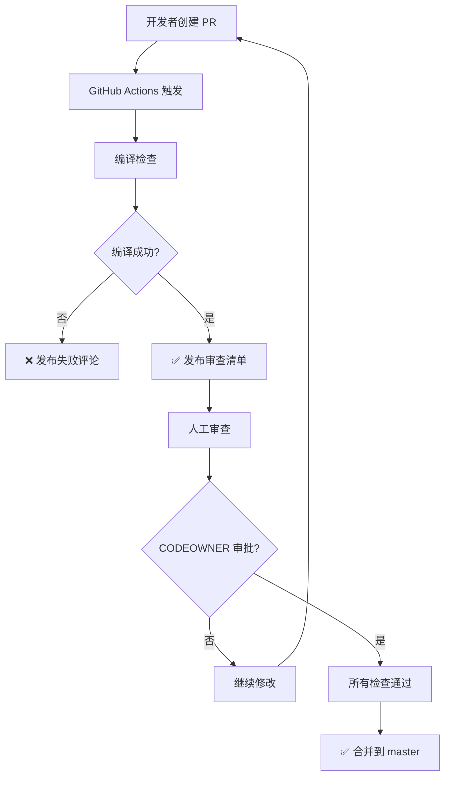

# GitHub 自动化审查配置指南

> **版本**: 1.0
> **制定日期**: 2025-10-07
> **关联标准**: [standards.md](./standards.md) 第 42-79 行

---

## 📋 问题背景

GitHub 限制：**PR 作者不能审查自己的 PR**

当 shouqitao 账号创建 PR 时，无法使用同一账号进行 approve 操作。即使是仓库管理员也受此限制。

---

## 🎯 解决方案

### 方案对比

| 方案 | 优点 | 缺点 | 推荐度 |
|------|------|------|--------|
| **1. GitHub Actions 自动评论** | 免费、即时反馈 | 无法 approve PR | ⭐⭐⭐⭐⭐ |
| **2. 添加协作者** | 简单直接 | 需要其他人参与 | ⭐⭐⭐⭐ |
| **3. GitHub App 机器人** | 功能完整、可 approve | 需要配置 App | ⭐⭐⭐ |
| **4. GitHub Copilot** | AI 辅助审查 | 需要付费订阅 | ⭐⭐⭐ |

### 推荐配置（已实施）

**方案 1 + 方案 2 组合**：
1. ✅ GitHub Actions 自动审查（编译检查 + 审查清单）
2. ✅ CODEOWNERS 配置（人工最终审批）
3. ✅ 分支保护规则（强制审查流程）

---

## 🚀 已配置内容

### 1. GitHub Actions 工作流

**文件**: `.github/workflows/pr-auto-review.yml`

**功能**:
- 自动检测 PR 文件变更
- 编译检查 Desktop.sln 和 Server.sln
- 生成标准化审查报告
- 发布审查评论到 PR

**触发条件**: PR 打开/同步/重新打开到 master 分支

### 2. CODEOWNERS 配置

**文件**: `.github/CODEOWNERS`

**作用**:
- 定义代码审查责任人
- 分支保护规则会要求 CODEOWNERS 审批
- 默认所有者: @shouqitao

**关键配置**:
```
# 默认所有者
* @shouqitao

# 架构文档需要严格审查
/docs/architecture/ @shouqitao
/docs/development/standards.md @shouqitao

# 核心代码需要严格审查
/src/Server/Core/ @shouqitao
/src/Client/Desktop/Core/ @shouqitao
```

### 3. 分支保护规则

**配置脚本**: `scripts/setup-branch-protection.ps1`

**执行方式**:
```powershell
# 需要先安装并登录 GitHub CLI
gh auth login

# 运行配置脚本
.\scripts\setup-branch-protection.ps1
```

**保护规则**:
- ✅ 需要至少 1 个 CODEOWNERS 审批
- ✅ 需要 "Claude Code 自动审查" 通过
- ✅ 需要线性提交历史（squash/rebase）
- ✅ 管理员也不能绕过规则
- ✅ 禁止强制推送和删除分支
- ✅ 需要解决所有 PR 对话

---

## 🔧 当前工作流程

### PR 创建到合并的完整流程



### 具体步骤

1. **开发者**:
   ```bash
   git checkout -b feature/xxx
   # ... 开发代码 ...
   git push -u origin feature/xxx
   gh pr create --base master
   ```

2. **GitHub Actions 自动执行**:
   - 拉取代码
   - 编译 Desktop.sln
   - 编译 Server.sln
   - 生成审查报告
   - 发布评论到 PR

3. **人工审查**（CODEOWNER）:
   - 查看自动审查报告
   - 检查审查清单
   - 进行 approve 或 request changes

4. **合并 PR**:
   ```bash
   gh pr merge <PR号> --squash --delete-branch
   ```

---

## ❌ 无法 Approve 的解决方案

### 当前限制

由于 shouqitao 是 PR 作者，GitHub 禁止以下操作：
```bash
gh pr review <PR号> --approve  # ❌ 报错: Can not approve your own pull request
```

### 解决方法

#### 方法 1: 添加协作者（推荐）

1. **邀请协作者**:
   ```bash
   # 通过 GitHub 网页端或 CLI 邀请
   gh api repos/shouqitao/LYBTZYZS/collaborators/USERNAME -X PUT
   ```

2. **更新 CODEOWNERS**:
   ```
   # 添加多个审查者
   * @shouqitao @collaborator1
   ```

3. **协作者审查 PR**:
   ```bash
   # 协作者执行
   gh pr review <PR号> --approve
   ```

#### 方法 2: 创建 GitHub App 机器人

1. **创建 GitHub App**:
   - 访问: https://github.com/settings/apps/new
   - 设置权限: Pull Requests (Read & Write)
   - 安装到仓库

2. **配置 Workflow 使用 App**:
   ```yaml
   - name: Generate Token
     id: generate_token
     uses: tibdex/github-app-token@v1
     with:
       app_id: ${{ secrets.APP_ID }}
       private_key: ${{ secrets.APP_PRIVATE_KEY }}

   - name: Approve PR
     uses: hmarr/auto-approve-action@v3
     with:
       github-token: ${{ steps.generate_token.outputs.token }}
   ```

#### 方法 3: 使用 Personal Access Token (PAT)

⚠️ **不推荐**：PAT 权限过大，安全风险高

1. **创建 PAT**:
   - 访问: https://github.com/settings/tokens/new
   - 勾选 `repo` 权限
   - 复制 token

2. **添加到仓库 Secrets**:
   ```bash
   # 通过网页端: Settings -> Secrets -> Actions -> New repository secret
   # Name: GH_PAT
   # Value: ghp_xxxxxxxxxxxx
   ```

3. **Workflow 使用 PAT**:
   ```yaml
   - name: Approve PR
     uses: hmarr/auto-approve-action@v3
     with:
       github-token: ${{ secrets.GH_PAT }}
   ```

---

## 📝 最佳实践

### 推荐工作流（单人开发）

```bash
# 1. 创建功能分支
git checkout -b feature/xxx

# 2. 开发并提交
git add .
git commit -m "feat: 实现 xxx 功能"

# 3. 推送并创建 PR
git push -u origin feature/xxx
gh pr create --base master --fill

# 4. 等待自动审查通过
# GitHub Actions 会自动发布审查报告

# 5. 检查审查清单后，直接合并（不需要 approve）
gh pr merge --squash --delete-branch
```

**注意**: 如果未配置分支保护，可以直接合并 PR 而不需要审批。

### 推荐工作流（多人协作）

```bash
# PR 作者: 创建并等待审查
gh pr create --base master --fill

# 协作者: 审查并批准
gh pr review <PR号> --approve

# PR 作者或协作者: 合并
gh pr merge <PR号> --squash --delete-branch
```

---

## 🔍 故障排查

### 问题 1: Actions 工作流未触发

**检查**:
```bash
gh run list --repo shouqitao/LYBTZYZS
```

**可能原因**:
- `.github/workflows/` 目录位置错误
- YAML 语法错误
- 仓库未启用 Actions

**解决**:
```bash
# 检查 YAML 语法
yamllint .github/workflows/pr-auto-review.yml

# 启用 Actions (网页端)
# Settings -> Actions -> Allow all actions
```

### 问题 2: 编译失败

**检查日志**:
```bash
gh run view --log
```

**可能原因**:
- 缺少 .NET SDK
- 依赖包未还原
- 代码编译错误

**解决**: 修复代码后重新推送

### 问题 3: 无法配置分支保护

**错误**: `Branch protection is not available`

**原因**: 公开仓库的某些保护规则需要 GitHub Pro

**解决**:
1. 升级到 GitHub Pro
2. 或转为私有仓库
3. 或手动配置简化版保护规则

---

## 📚 参考资料

- [GitHub Actions 文档](https://docs.github.com/en/actions)
- [CODEOWNERS 文档](https://docs.github.com/en/repositories/managing-your-repositorys-settings-and-features/customizing-your-repository/about-code-owners)
- [分支保护文档](https://docs.github.com/en/repositories/configuring-branches-and-merges-in-your-repository/managing-protected-branches/about-protected-branches)
- [GitHub CLI 文档](https://cli.github.com/manual/)
- [项目标准文档](./standards.md)

---

## ✅ 检查清单

配置完成后，确认以下项目：

- [ ] `.github/workflows/pr-auto-review.yml` 已创建
- [ ] `.github/CODEOWNERS` 已创建并配置责任人
- [ ] `scripts/setup-branch-protection.ps1` 已执行（可选）
- [ ] 创建测试 PR 验证自动审查工作
- [ ] 确认审查评论正确发布
- [ ] 确认编译检查正确执行

---

🤖 Generated with [Claude Code](https://claude.com/claude-code)
