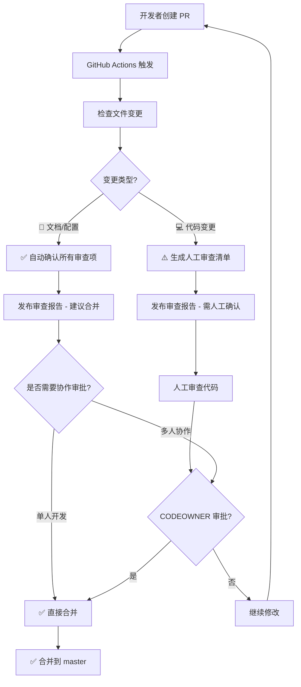

# GitHub 工作流程指南

**维护人**：Claude Code
**最后更新**：2025-01-12
**版本**：v1.0（Phase 2 SSOT合并）

本文档整合GitHub Issue管理、标签体系、PR流程和自动化配置，提供完整的GitHub工作流指引。

---

## 📋 1. Issue 管理规范

### 1.1 Issue 类型

#### 单任务 Issue
**特征**：一个 Issue 对应一个 PR，完成即关闭

**PR 引用语法**：
```markdown
Closes #123
Fixes #123
Resolves #123
```

**示例**：
```markdown
## 关联 Issue

Fixes #995

## 实现内容
修复 HerbDto JSON 序列化冲突问题
```

#### 多阶段 Epic Issue
**特征**：一个 Issue 包含多个 Phase，需多个 PR 逐步完成

**PR 引用语法** ⚠️ **重要**：
```markdown
# Phase 1-4 的 PR 使用（不会关闭 Issue）:
Part of #1013
Refs #1013

# 只在最后一个 Phase 使用（自动关闭 Issue）:
Closes #1013
```

**✅ 正确示例 - 分阶段引用**：

**Issue #1013**: Client端业务模块统一设计规范（5个Phase）

```markdown
# PR #1014 (Phase 1-2)
## 关联 Issue

Part of #1013  ✅ 正确！不会关闭 Issue

## 实现内容
Phase 1: 文档与标准制定
Phase 2: 清理冗余目录
```

```markdown
# PR #1017 (Phase 5 - 最后一个)
## 关联 Issue

Closes #1013  ✅ 正确！所有 Phase 完成后关闭

## 实现内容
Phase 5: 验证与文档更新
```

### 1.2 Epic Issue 模板

创建多阶段 Issue 时，使用以下模板：

```markdown
# [EPIC] 任务标题

## 目标
简要描述整体目标

## 背景
说明为什么需要这个改造

## 实施计划

### Phase 1: 阶段1名称 (预计工期)
- [ ] 子任务 1
- [ ] 子任务 2

### Phase 2: 阶段2名称 (预计工期)
- [ ] 子任务 1
- [ ] 子任务 2

## 验收标准

- [ ] 验收标准 1
- [ ] 验收标准 2

## 预期工期

总计 X-Y 天

## 优先级

P1/P2/P3

---

## 📝 PR 提交规范

⚠️ **重要**: 各 Phase 的 PR 使用 `Part of #<Issue号>`，**只在最后一个 Phase 使用 `Closes #<Issue号>`**

## 进度跟踪

- [ ] Phase 1 - PR #xxx (状态)
- [ ] Phase 2 - PR #xxx (状态)
```

### 1.3 常见错误

#### 错误 1: 中间 Phase 使用 Closes
```markdown
# PR #1016 (Phase 4/5)
Closes #1013  ❌ 导致 Issue 提前关闭
```

**后果**：Issue 在未完成所有 Phase 时就被关闭

**修复**：重新打开 Issue
```bash
gh issue reopen <Issue号>
```

#### 错误 2: 最后 Phase 未关闭 Issue
```markdown
# PR #1017 (Phase 5/5 - 最后一个)
Part of #1013  ⚠️ Issue 不会自动关闭，需人工关闭
```

**后果**：Issue 保持打开状态

**修复**：人工关闭 Issue
```bash
gh issue close <Issue号> --comment "所有 Phase 已完成"
```

#### 错误 3: 忘记引用 Issue
```markdown
# PR #1015
## 实现内容
重构 ViewModel 构造函数
```

**后果**：PR 和 Issue 无法关联，难以追踪进度

**修复**：在 PR 描述中补充
```markdown
Part of #1013
```

### 1.4 Issue 状态管理

#### 标签使用

| 标签 | 用途 | 何时添加 |
|------|------|---------|
| `epic` | 多阶段大型任务 | 创建时 |
| `status:todo` | 待开始 | 创建时自动添加 |
| `status:in-progress` | 进行中 | 开始第一个 Phase 时 |
| `status:blocked` | 被阻塞 | 遇到阻塞时 |
| `status:done` | 已完成 | 关闭时自动添加 |

#### Phase 完成后的更新

每个 Phase 的 PR 合并后，在 Issue 中更新进度：

```markdown
## 进度跟踪

- [x] Phase 1 - PR #1014 ✅ 已合并 (2025-10-07)
- [x] Phase 2 - PR #1014 ✅ 已合并 (2025-10-07)
- [x] Phase 3 - PR #1015 ✅ 已合并 (2025-10-07)
- [ ] Phase 4 - 待执行
```

### 1.5 GitHub 自动关闭语法

#### 自动关闭 Issue 的关键字

在 PR 描述或提交信息中使用以下关键字会**自动关闭** Issue：

| 关键字 | 示例 | 效果 |
|--------|------|------|
| `Closes` | `Closes #123` | PR 合并后关闭 #123 |
| `Fixes` | `Fixes #123` | PR 合并后关闭 #123 |
| `Resolves` | `Resolves #123` | PR 合并后关闭 #123 |

#### 不会关闭 Issue 的关键字

| 关键字 | 示例 | 效果 |
|--------|------|------|
| `Part of` | `Part of #123` | 仅引用，不关闭 |
| `Refs` | `Refs #123` | 仅引用，不关闭 |
| `Related to` | `Related to #123` | 仅引用，不关闭 |

---

## 🏷️ 2. 标签体系

### 2.1 标签分类

#### 类型标签 (type:*) - 必选

用于标识改动的性质，**必选标签**之一。

| 标签 | 颜色 | 说明 | 使用场景 |
|------|------|------|----------|
| `type:feature` | 🟢 #22C55E | 新功能开发 | 添加新功能、新模块 |
| `type:bug` | 🔴 #DC2626 | Bug 修复 | 修复缺陷、异常行为 |
| `type:refactor` | 🟠 #F59E0B | 代码重构 | 不改变功能的代码优化 |
| `type:test` | 🟢 #26A641 | 测试相关改动 | 添加/修复测试代码 |
| `type:documentation` | 🔵 #0075CA | 文档改进 | 文档更新、注释完善 |
| `type:security` | 🔴 #b60205 | 安全相关改动 | 安全漏洞修复、权限调整 |

#### 模块标签 (module:*) - 必选

用于标识改动影响的模块，**必选标签**之一。

| 标签 | 颜色 | 说明 |
|------|------|------|
| `module:server` | 🔵 #3B82F6 | Server 后端模块 |
| `module:desktop` | 🟣 #8B5CF6 | Desktop 客户端模块 |
| `module:shared` | 🔵 #0052CC | Shared 共享模块 |
| `module:tests` | 🟢 #10B981 | 测试模块 |

#### 优先级标签 (priority:*) - 推荐

用于标识任务的紧急程度，**推荐使用**。

| 标签 | 颜色 | 说明 | SLA |
|------|------|------|-----|
| `priority:p0` | 🔴 #ff0000 | Critical - 紧急 | 24h |
| `priority:p1` | 🟠 #ff6600 | High - 高 | 3天 |
| `priority:p2` | 🟡 #ffaa00 | Medium - 中 | 1周 |
| `priority:p3` | ⚪ #94A3B8 | Low - 低 | 灵活 |

#### Epic 标签 (epic:*)

用于跟踪多个相关 Issue 的大型任务。

| 标签 | 说明 |
|------|------|
| `epic` | 通用 Epic 标记 |
| `epic:server-tests-coverage` | 服务端单元测试全覆盖 |
| `epic:entity-consistency` | Server 实体一致性优化 |

### 2.2 标签使用规范

#### 必选标签组合

创建 Issue 时，**至少**包含以下标签：
1. **类型标签**（type:*）- 说明改动性质
2. **模块标签**（module:*）- 说明影响范围

#### 推荐标签组合

根据任务特点，添加以下标签：
1. **优先级标签**（priority:*）- 说明紧急程度
2. **Epic 标签**（epic:*）- 归属大型任务

#### 常见场景示例

**场景 1：Server 模块 Bug 修复（高优先级）**
```bash
gh issue create \
  --label "type:bug,module:server,priority:p1" \
  --title "fix(server): 修复用户认证失败问题"
```

**场景 2：Desktop 测试创建（中优先级）**
```bash
gh issue create \
  --label "type:test,module:desktop,module:tests,priority:p2" \
  --title "test(desktop): 创建 Desktop 模块单元测试"
```

**场景 3：文档更新（低优先级）**
```bash
gh issue create \
  --label "type:documentation,priority:p3" \
  --title "docs: 更新 API 文档"
```

**场景 4：Epic 子任务**
```bash
gh issue create \
  --label "type:feature,module:server,epic:server-tests-coverage,priority:p1" \
  --title "feat(server): 实现 Patients 模块测试"
```

### 2.3 标签查询

#### 查看所有标签
```bash
gh label list
```

#### 查询特定标签的 Issue
```bash
# 查询所有测试相关 Issue
gh issue list --label "type:test"

# 查询 Server 模块的 Bug
gh issue list --label "type:bug,module:server"

# 查询高优先级未完成任务
gh issue list --label "priority:p1" --state open
```

#### 筛选 Epic 相关 Issue
```bash
gh issue list --label "epic:server-tests-coverage"
```

### 2.4 标签管理

#### 创建新标签
```bash
gh label create "type:example" \
  --description "示例标签" \
  --color "3B82F6"
```

#### 更新标签
```bash
gh label edit "type:example" \
  --description "新的描述" \
  --color "22C55E"
```

#### 删除标签
```bash
gh label delete "type:example"
```

### 2.5 最佳实践

#### DO ✅

1. **明确标识类型和模块**
   ```bash
   # 好的示例
   gh issue create --label "type:test,module:server,priority:p2"
   ```

2. **使用结构化命名**
   - Epic: `epic:{name}-{date}`
   - 任务: `task:{epic-name}`

3. **保持标签简洁**
   - 单个 Issue 不超过 5 个标签

4. **优先级明确**
   - P0/P1 任务必须有 SLA 承诺

#### DON'T ❌

1. **避免标签冗余**
   ```bash
   # 不推荐：同时使用 bug 和 type:bug
   gh issue create --label "bug,type:bug"

   # 推荐：只使用 type:bug
   gh issue create --label "type:bug"
   ```

2. **避免过度细分**
   - 不要为单一 Issue 创建 Epic

3. **避免优先级滥用**
   - 不要所有任务都标记为 P0

---

## 🚀 3. PR 流程与自动化

### 3.1 GitHub Actions 智能审查工作流

**文件**：`.github/workflows/pr-auto-review.yml`

**核心功能**：
- ✅ 自动检测 PR 文件变更
- ✅ **智能识别变更类型**（文档/配置 vs 代码变更）
- ✅ **自动确认审查项**（纯文档变更自动打勾 ✅）
- ✅ 生成统一的审查报告
- ✅ 发布审查评论到 PR

**触发条件**：PR 打开/同步/重新打开到 master 分支

**智能判断逻辑**：

| 变更类型 | 判断条件 | 审查行为 |
|---------|---------|---------|
| 📄 **文档/配置** | 所有文件为 `.md`、`.github/`、`docs/`、`scripts/` | **自动确认所有审查项** ✅ |
| 💻 **代码变更** | 包含 `.cs`、`.xaml`、`.csproj`、`.sln` | **提示需人工确认** [ ] |

### 3.2 PR 创建到合并的完整流程



**流程说明**：

1. **自动识别**：分析所有变更文件，判断是纯文档还是包含代码
2. **智能分流**：
   - **文档/配置路径**：自动确认，建议直接合并
   - **代码变更路径**：生成检查清单，需人工确认
3. **合并决策**：根据团队规模选择单人直接合并或等待协作审批

### 3.3 推荐工作流

#### 工作流 A: 文档/配置变更（单人开发）

**场景**：更新文档、修改配置、添加脚本等非代码变更

```bash
# 1. 创建功能分支
git checkout -b docs/update-xxx

# 2. 修改文档并提交
git add docs/
git commit -m "docs: 更新 xxx 文档"

# 3. 推送并创建 PR
git push -u origin docs/update-xxx
gh pr create --base master --fill

# 4. 等待智能审查（约 15-20 秒）
# GitHub Actions 会自动确认所有审查项 ✅

# 5. 查看审查报告确认后，直接合并
gh pr view  # 确认显示 "📄 文档/配置" 和 "💡 建议: 可直接合并"
gh pr merge --squash --delete-branch
```

**优势**：
- ⚡ **超高效**：从提交到合并 < 1 分钟
- ✅ **零人工审查**：所有项自动确认
- 📄 **无需编译**：文档变更跳过编译验证

#### 工作流 B: 代码变更（单人开发）

**场景**：修改 C#/XAML 代码、更新项目配置等

```bash
# 1. 创建功能分支
git checkout -b feature/xxx

# 2. 开发并提交
git add src/
git commit -m "feat: 实现 xxx 功能"

# 3. 推送并创建 PR
git push -u origin feature/xxx
gh pr create --base master --fill

# 4. 等待智能审查（约 15-20 秒）
# GitHub Actions 会生成人工确认清单 [ ]

# 5. 本地验证
dotnet build LYBT.All.sln -c Release
dotnet test LYBT.Server.sln -c Release

# 6. 确认清单后合并
gh pr view  # 确认显示 "💻 代码变更"
# 逐项确认审查清单（架构、规范、测试等）
gh pr merge --squash --delete-branch
```

**注意**：
- ⚠️ 必须本地编译验证
- 📋 逐项检查审查清单
- ✅ 确认所有项通过后再合并

#### 工作流 C: 多人协作

```bash
# PR 作者: 创建 PR
gh pr create --base master --fill

# 等待智能审查
# - 📄 文档: 自动通过，等待协作者确认后合并
# - 💻 代码: 生成清单，等待协作者审查

# 协作者: 审查并批准
gh pr review <PR号> --approve --body "LGTM! 已验证编译通过"

# PR 作者或协作者: 合并
gh pr merge <PR号> --squash --delete-branch
```

**效率对比**：

| 变更类型 | 传统流程 | 智能审查流程 | 时间节省 |
|---------|---------|-------------|---------|
| 📄 文档 | 人工勾选 12 项 | 自动确认 ✅ | **90%** |
| 💻 代码 | 人工勾选 12 项 | 自动生成清单 [ ] | **50%** |
| 🔍 判断 | 人工识别 | 自动识别 | **100%** |

### 3.4 CODEOWNERS 配置

**文件**：`.github/CODEOWNERS`

**作用**：
- 定义代码审查责任人
- 分支保护规则会要求 CODEOWNERS 审批
- 默认所有者：@shouqitao

**关键配置**：
```
# 默认所有者
* @shouqitao

# 架构文档需要严格审查
/docs/architecture/ @shouqitao
/docs/development/standards.md @shouqitao

# 核心代码需要严格审查
/src/Server/Core/ @shouqitao
/src/Client/Desktop/Core/ @shouqitao
```

### 3.5 分支保护规则

**配置脚本**：`scripts/setup-branch-protection.ps1`

**执行方式**：
```powershell
# 需要先安装并登录 GitHub CLI
gh auth login

# 运行配置脚本
.\scripts\setup-branch-protection.ps1
```

**保护规则**：
- ✅ 需要至少 1 个 CODEOWNERS 审批
- ✅ 需要 "Claude Code 自动审查" 通过
- ✅ 需要线性提交历史（squash/rebase）
- ✅ 管理员也不能绕过规则
- ✅ 禁止强制推送和删除分支
- ✅ 需要解决所有 PR 对话

---

## 🔍 4. 故障排查

### 4.1 如何解读智能审查结果

**查看审查报告**：
```bash
gh pr view <PR号>
# 或在浏览器中查看 PR 页面
```

**判断标准**：

| 标识 | 含义 | 操作建议 |
|------|------|---------|
| 📄 **文档/配置** | 纯文档变更 | ✅ 直接合并 |
| 💻 **代码变更** | 包含代码 | ⚠️ 编译验证后合并 |
| ✅ | 自动确认通过 | 无需人工操作 |
| [ ] | 需人工确认 | 检查清单逐项确认 |
| 💡 **建议**: 可直接合并 | 所有项已自动通过 | 建议直接合并 |
| 💡 **提示**: 仍需人工最终审批 | 包含代码变更 | 编译+测试后合并 |

### 4.2 Actions 工作流未触发

**检查**：
```bash
gh run list --repo shouqitao/LYBTZYZS
```

**可能原因**：
- `.github/workflows/` 目录位置错误
- YAML 语法错误
- 仓库未启用 Actions

**解决**：
```bash
# 检查 YAML 语法
yamllint .github/workflows/pr-auto-review.yml

# 启用 Actions (网页端)
# Settings -> Actions -> Allow all actions
```

### 4.3 编译失败

**检查日志**：
```bash
gh run view --log
```

**可能原因**：
- 缺少 .NET SDK
- 依赖包未还原
- 代码编译错误

**解决**：修复代码后重新推送

### 4.4 无法配置分支保护

**错误**：`Branch protection is not available`

**原因**：公开仓库的某些保护规则需要 GitHub Pro

**解决**：
1. 升级到 GitHub Pro
2. 或转为私有仓库
3. 或手动配置简化版保护规则

---

## ✅ 5. 最佳实践总结

### 5.1 Issue 管理最佳实践

1. **Epic Issue 创建时**
   - 明确标注各 Phase
   - 预估每个 Phase 的工期
   - 列出清晰的验收标准
   - 添加 `epic` 标签

2. **每个 Phase 的 PR**
   - 标题包含 `[Phase X]` 前缀
   - 使用 `Part of #<Issue号>` 引用
   - 在 PR 描述中说明完成的 Phase 内容
   - 合并后更新 Issue 进度

3. **最后一个 Phase 的 PR**
   - 使用 `Closes #<Issue号>` 自动关闭
   - 确认所有验收标准已满足
   - 在 PR 描述中总结整体完成情况

4. **遇到问题时**
   - 及时在 Issue 中更新阻塞原因
   - 添加 `status:blocked` 标签
   - 说明预计解决时间

### 5.2 标签使用最佳实践

- ✅ 明确标识类型和模块
- ✅ 使用结构化命名
- ✅ 保持标签简洁（≤5个）
- ✅ 优先级明确（P0/P1 有SLA承诺）
- ❌ 避免标签冗余
- ❌ 避免过度细分
- ❌ 避免优先级滥用

### 5.3 PR 流程最佳实践

- 📄 文档PR：从提交到合并 < 2 分钟
- 💻 代码PR：编译验证后合并
- 🔍 善用智能审查，节省90%审查时间
- ✅ 单人开发可直接合并，多人协作需审批

---

## 📚 6. 参考资料

### 内部文档
- [Issue 驱动工作流](./minimal-practice.md)
- [项目开发规范](./standards.md)
- [CLAUDE.md 工作约束](../CLAUDE.md)

### GitHub 文档
- [Linking a pull request to an issue](https://docs.github.com/en/issues/tracking-your-work-with-issues/linking-a-pull-request-to-an-issue)
- [About task lists](https://docs.github.com/en/get-started/writing-on-github/working-with-advanced-formatting/about-task-lists)
- [GitHub Actions 文档](https://docs.github.com/en/actions)
- [CODEOWNERS 文档](https://docs.github.com/en/repositories/managing-your-repositorys-settings-and-features/customizing-your-repository/about-code-owners)
- [分支保护文档](https://docs.github.com/en/repositories/configuring-branches-and-merges-in-your-repository/managing-protected-branches/about-protected-branches)
- [GitHub CLI 文档](https://cli.github.com/manual/)

---

🤖 Generated with [Claude Code](https://claude.com/claude-code)

Co-Authored-By: Claude <noreply@anthropic.com>
