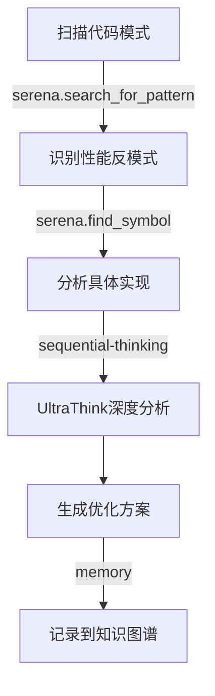
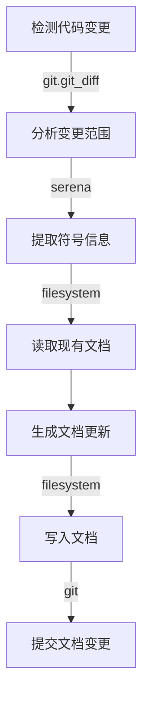
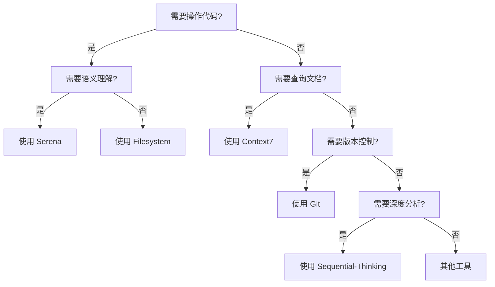

# MCP工具参考手册

**版本**: 1.0.0
**创建日期**: 2025-10-09
**用途**: LYBTZYZS项目AI协同工作的MCP工具完整参考

本文档提供8个MCP工具的完整参数规范、调用示例、工作流模式与错误处理策略。

---

## 📚 目录

- [1. MCP工具概览](#1-mcp工具概览)
- [2. 工具详细规范](#2-工具详细规范)
  - [2.1 Serena - 语义代码分析](#21-serena---语义代码分析)
  - [2.2 Context7 - 库文档查询](#22-context7---库文档查询)
  - [2.3 Memory - 知识图谱](#23-memory---知识图谱)
  - [2.4 Git - 版本控制](#24-git---版本控制)
  - [2.5 Sequential-Thinking - 结构化推理](#25-sequential-thinking---结构化推理)
  - [2.6 Time - 时间工具](#26-time---时间工具)
  - [2.7 Filesystem - 文件操作](#27-filesystem---文件操作)
  - [2.8 Playwright - 浏览器自动化](#28-playwright---浏览器自动化)
- [3. 工作流模式](#3-工作流模式)
- [4. 错误处理策略](#4-错误处理策略)
- [5. 最佳实践](#5-最佳实践)

---

## 1. MCP工具概览

| 工具 | 参数约定 | 主要用途 | 使用频率 |
|------|---------|---------|---------|
| **serena** | snake_case | 语义代码检索与编辑（基于LSP） | 🔥 高频 |
| **context7** | camelCase | 查询库文档与代码示例 | 🔥 高频 |
| **memory** | camelCase | 知识图谱存储（实体-关系模型） | 🔶 中频 |
| **git** | camelCase | 版本控制（status, diff, commit等） | 🔥 高频 |
| **sequential-thinking** | camelCase | 结构化推理与步骤分解（UltraThink） | 🔥 高频 |
| **time** | snake_case | 时区转换与时间标准化 | 🔷 低频 |
| **filesystem** | camelCase | 文件读写、目录遍历、批量操作 | 🔥 高频 |
| **playwright** | camelCase | 浏览器自动化（按需使用） | 🔷 低频 |

---

## 2. 工具详细规范

### 2.1 Serena - 语义代码分析

**命名约定**: `mcp__serena__<function_name>` （snake_case）

#### 核心功能

##### A. `find_symbol` - 查找符号
根据名称路径查找代码符号（类、方法、属性等）。

**参数**:
```json
{
  "name_path": "string",           // 必填：符号名称路径（如 "PatientService/GetByIdAsync"）
  "relative_path": "string",       // 可选：限定搜索范围（文件或目录）
  "substring_matching": boolean,   // 可选：是否启用子串匹配（默认false）
  "depth": integer,                // 可选：返回子符号的深度（如 1 返回类的方法）
  "include_body": boolean,         // 可选：是否包含符号体（默认false）
  "include_kinds": [integer],      // 可选：LSP符号类型过滤（如 [5] 只返回类）
  "exclude_kinds": [integer],      // 可选：排除的LSP符号类型
  "max_answer_chars": integer      // 可选：最大返回字符数（-1使用默认值）
}
```

**LSP符号类型速查表**:
```
5  = Class         12 = Function      6  = Method
7  = Property      8  = Field         13 = Variable
14 = Constant      4  = Namespace     2  = Module
```

**调用示例**:

```javascript
// 示例1：查找类定义（不包含方法体）
mcp__serena__find_symbol({
  "name_path": "PatientService",
  "relative_path": "src/Server/Modules/LYBT.Module.Patients",
  "include_kinds": [5],  // 只返回Class
  "depth": 1,            // 返回类的直接成员
  "include_body": false
})

// 示例2：查找方法并包含完整实现
mcp__serena__find_symbol({
  "name_path": "PatientService/GetByIdAsync",
  "relative_path": "src/Server/Modules/LYBT.Module.Patients/Services/PatientService.cs",
  "include_body": true
})

// 示例3：模糊查找（子串匹配）
mcp__serena__find_symbol({
  "name_path": "Patient",
  "substring_matching": true,
  "include_kinds": [5],  // 只返回类
  "relative_path": "src/Server/Modules/LYBT.Module.Patients"
})
```

##### B. `find_referencing_symbols` - 查找引用
查找所有引用指定符号的位置。

**参数**:
```json
{
  "name_path": "string",       // 必填：目标符号名称路径
  "relative_path": "string",   // 必填：目标符号所在文件
  "include_kinds": [integer],  // 可选：引用位置符号类型过滤
  "exclude_kinds": [integer],  // 可选：排除的符号类型
  "max_answer_chars": integer  // 可选：最大返回字符数
}
```

**调用示例**:
```javascript
// 查找所有调用 GetByIdAsync 的位置
mcp__serena__find_referencing_symbols({
  "name_path": "PatientService/GetByIdAsync",
  "relative_path": "src/Server/Modules/LYBT.Module.Patients/Services/PatientService.cs"
})
```

##### C. `replace_symbol_body` - 替换符号体
替换符号的完整实现（方法体、类体等）。

**参数**:
```json
{
  "name_path": "string",      // 必填：目标符号名称路径
  "relative_path": "string",  // 必填：目标文件路径
  "body": "string"            // 必填：新的符号体（无需包含签名）
}
```

**调用示例**:
```javascript
mcp__serena__replace_symbol_body({
  "name_path": "PatientService/GetByIdAsync",
  "relative_path": "src/Server/Modules/LYBT.Module.Patients/Services/PatientService.cs",
  "body": `{
    if (id <= 0) throw new ArgumentException("Invalid ID");
    return await _repository.GetByIdAsync(id);
}`
})
```

##### D. `search_for_pattern` - 正则搜索
在代码中搜索正则表达式模式。

**参数**:
```json
{
  "substring_pattern": "string",        // 必填：正则表达式模式
  "relative_path": "string",            // 可选：搜索范围（目录或文件）
  "restrict_search_to_code_files": boolean,  // 可选：仅搜索代码文件（默认false）
  "paths_include_glob": "string",       // 可选：包含文件模式（如 "*.cs"）
  "paths_exclude_glob": "string",       // 可选：排除文件模式（如 "*test*"）
  "context_lines_before": integer,      // 可选：返回匹配前N行
  "context_lines_after": integer,       // 可选：返回匹配后N行
  "max_answer_chars": integer           // 可选：最大返回字符数
}
```

**调用示例**:
```javascript
// 查找所有 TODO 注释
mcp__serena__search_for_pattern({
  "substring_pattern": "//\\s*TODO:.*",
  "relative_path": "src/Server",
  "restrict_search_to_code_files": true,
  "context_lines_before": 2,
  "context_lines_after": 2
})

// 查找所有异步方法定义
mcp__serena__search_for_pattern({
  "substring_pattern": "async\\s+Task<.*?>.*Async\\(",
  "paths_include_glob": "*.cs",
  "paths_exclude_glob": "*Test.cs"
})
```

##### E. `get_symbols_overview` - 获取符号概览
获取文件的顶层符号列表（不含实现）。

**参数**:
```json
{
  "relative_path": "string",    // 必填：目标文件路径
  "max_answer_chars": integer   // 可选：最大返回字符数
}
```

**调用示例**:
```javascript
mcp__serena__get_symbols_overview({
  "relative_path": "src/Server/Modules/LYBT.Module.Patients/Services/PatientService.cs"
})
```

---

### 2.2 Context7 - 库文档查询

**命名约定**: `mcp__context7__<function_name>` （camelCase）

#### A. `resolve-library-id` - 解析库ID
将库名称解析为Context7兼容的库ID。

**参数**:
```json
{
  "libraryName": "string"  // 必填：库名称（如 "EntityFrameworkCore"）
}
```

**调用示例**:
```javascript
mcp__context7__resolve-library-id({
  "libraryName": "Entity Framework Core"
})
// 返回: "/dotnet/efcore" 或类似的库ID列表
```

#### B. `get-library-docs` - 获取库文档
获取指定库的文档和代码示例。

**参数**:
```json
{
  "context7CompatibleLibraryID": "string",  // 必填：库ID（如 "/dotnet/efcore"）
  "topic": "string",                        // 可选：具体主题（如 "migrations"）
  "tokens": number                          // 可选：最大返回token数（默认5000）
}
```

**调用示例**:
```javascript
// 查询 EF Core 迁移文档
mcp__context7__get-library-docs({
  "context7CompatibleLibraryID": "/dotnet/efcore",
  "topic": "migrations",
  "tokens": 5000
})

// 查询 Prism MVVM 文档
mcp__context7__get-library-docs({
  "context7CompatibleLibraryID": "/prismlib/prism",
  "topic": "dependency injection"
})
```

---

### 2.3 Memory - 知识图谱

**命名约定**: `mcp__memory__<function_name>` （camelCase）

#### A. `create_entities` - 创建实体
在知识图谱中创建新实体。

**参数**:
```json
{
  "entities": [
    {
      "name": "string",            // 实体名称
      "entityType": "string",      // 实体类型
      "observations": ["string"]   // 观察记录数组
    }
  ]
}
```

**调用示例**:
```javascript
mcp__memory__create_entities({
  "entities": [
    {
      "name": "PatientService",
      "entityType": "Service",
      "observations": [
        "位于 LYBT.Module.Patients",
        "实现患者CRUD操作",
        "依赖 IPatientRepository 和 IMapper"
      ]
    }
  ]
})
```

#### B. `create_relations` - 创建关系
在实体之间创建关系。

**参数**:
```json
{
  "relations": [
    {
      "from": "string",         // 起始实体名称
      "to": "string",           // 目标实体名称
      "relationType": "string"  // 关系类型（主动语态）
    }
  ]
}
```

**调用示例**:
```javascript
mcp__memory__create_relations({
  "relations": [
    {
      "from": "PatientService",
      "to": "IPatientRepository",
      "relationType": "depends on"
    }
  ]
})
```

#### C. `search_nodes` - 搜索节点
根据查询搜索知识图谱中的节点。

**参数**:
```json
{
  "query": "string"  // 搜索查询
}
```

**调用示例**:
```javascript
mcp__memory__search_nodes({
  "query": "PatientService dependencies"
})
```

---

### 2.4 Git - 版本控制

**命名约定**: `mcp__git__git_<operation>` （camelCase）

#### A. `git_status` - 获取状态
获取Git仓库状态。

**参数**:
```json
{
  "path": "string"  // 可选：仓库路径（默认 "."）
}
```

**调用示例**:
```javascript
mcp__git__git_status({
  "path": "."
})
```

#### B. `git_diff` - 查看差异
查看文件差异。

**参数**:
```json
{
  "path": "string",           // 可选：仓库路径
  "staged": boolean,          // 可选：查看暂存区差异
  "commit1": "string",        // 可选：比较起始提交
  "commit2": "string",        // 可选：比较结束提交
  "file": "string",           // 可选：指定文件
  "includeUntracked": boolean // 可选：包含未跟踪文件
}
```

**调用示例**:
```javascript
// 查看工作区差异
mcp__git__git_diff({
  "path": "."
})

// 查看暂存区差异
mcp__git__git_diff({
  "path": ".",
  "staged": true
})

// 比较两个提交
mcp__git__git_diff({
  "path": ".",
  "commit1": "HEAD~1",
  "commit2": "HEAD"
})
```

#### C. `git_log` - 查看历史
查看提交历史。

**参数**:
```json
{
  "path": "string",           // 可选：仓库路径
  "maxCount": number,         // 可选：最大返回数量
  "author": "string",         // 可选：作者筛选
  "since": "string",          // 可选：起始日期
  "until": "string",          // 可选：结束日期
  "branchOrFile": "string",   // 可选：分支或文件
  "showSignature": boolean    // 可选：显示签名
}
```

**调用示例**:
```javascript
// 查看最近10条提交
mcp__git__git_log({
  "path": ".",
  "maxCount": 10
})

// 查看特定作者的提交
mcp__git__git_log({
  "path": ".",
  "author": "Claude Code",
  "since": "1 week ago"
})
```

#### D. `git_commit` - 提交更改
创建Git提交。

**参数**:
```json
{
  "message": "string",              // 必填：提交信息
  "path": "string",                 // 可选：仓库路径
  "filesToStage": ["string"],       // 可选：要暂存的文件
  "amend": boolean,                 // 可选：修改上一次提交
  "allowEmpty": boolean,            // 可选：允许空提交
  "author": {                       // 可选：覆盖作者
    "name": "string",
    "email": "string"
  },
  "forceUnsignedOnFailure": boolean // 可选：签名失败时回退
}
```

**调用示例**:
```javascript
mcp__git__git_commit({
  "message": "feat(patients): 添加患者批量导入功能\n\n- 实现CSV批量导入\n- 添加数据验证\n- 完成单元测试\n\nCloses #123",
  "filesToStage": [
    "src/Server/Modules/LYBT.Module.Patients/Services/PatientImportService.cs",
    "tests/UnitTests/Server/Modules/LYBT.Module.Patients.Tests/PatientImportServiceTests.cs"
  ]
})
```

---

### 2.5 Sequential-Thinking - 结构化推理

**命名约定**: `mcp__sequential-thinking__sequentialthinking` （camelCase）

**用途**: 复杂问题的结构化分析（UltraThink模式）

**参数**:
```json
{
  "thought": "string",              // 必填：当前思考步骤
  "nextThoughtNeeded": boolean,     // 必填：是否需要下一步
  "thoughtNumber": integer,         // 必填：当前步骤编号
  "totalThoughts": integer,         // 必填：预计总步数
  "isRevision": boolean,            // 可选：是否修订先前思考
  "revisesThought": integer,        // 可选：修订的步骤编号
  "branchFromThought": integer,     // 可选：分支起点编号
  "branchId": "string",             // 可选：分支标识
  "needsMoreThoughts": boolean      // 可选：是否需要更多步骤
}
```

**调用示例 - 重构规划**:
```javascript
// Step 1: 问题识别
mcp__sequential-thinking__sequentialthinking({
  "thought": "分析PatientService当前的性能瓶颈：\n1. GetAllAsync() 一次性加载所有患者数据\n2. 缺少分页和过滤机制\n3. 未使用异步流（IAsyncEnumerable）",
  "nextThoughtNeeded": true,
  "thoughtNumber": 1,
  "totalThoughts": 20
})

// Step 2: 根因分析
mcp__sequential-thinking__sequentialthinking({
  "thought": "根本原因：\n- 早期MVP设计未考虑大数据量场景\n- Repository接口设计过于简单\n- 缺少查询对象（Query Object）模式",
  "nextThoughtNeeded": true,
  "thoughtNumber": 2,
  "totalThoughts": 20
})

// Step 11: 方案设计
mcp__sequential-thinking__sequentialthinking({
  "thought": "重构方案：\n1. 添加 PagedRequest<T> 和 PagedResponse<T>\n2. Repository 增加分页方法\n3. Service 层实现流式查询\n4. 保持向后兼容（保留原 GetAllAsync）",
  "nextThoughtNeeded": true,
  "thoughtNumber": 11,
  "totalThoughts": 20
})

// Step 20: 完成
mcp__sequential-thinking__sequentialthinking({
  "thought": "总结：重构可以分3个PR完成\n- PR1: 添加分页基础设施\n- PR2: Repository层实现\n- PR3: Service层重构\n预计工作量：5-8小时",
  "nextThoughtNeeded": false,
  "thoughtNumber": 20,
  "totalThoughts": 20
})
```

---

### 2.6 Time - 时间工具

**命名约定**: `mcp__time__<function_name>` （snake_case）

#### A. `get_current_time` - 获取当前时间
获取指定时区的当前时间。

**参数**:
```json
{
  "timezone": "string"  // 必填：IANA时区名称（如 "Asia/Shanghai"）
}
```

**调用示例**:
```javascript
mcp__time__get_current_time({
  "timezone": "Asia/Shanghai"
})
```

#### B. `convert_time` - 转换时间
在时区之间转换时间。

**参数**:
```json
{
  "source_timezone": "string",  // 必填：源时区
  "target_timezone": "string",  // 必填：目标时区
  "time": "string"              // 必填：时间（24小时格式 HH:MM）
}
```

**调用示例**:
```javascript
mcp__time__convert_time({
  "source_timezone": "Asia/Shanghai",
  "target_timezone": "America/New_York",
  "time": "14:00"
})
```

---

### 2.7 Filesystem - 文件操作

**命名约定**: `mcp__filesystem__<function_name>` （camelCase）

#### A. `read_text_file` - 读取文本文件
读取文件内容。

**参数**:
```json
{
  "path": "string",    // 必填：文件路径
  "head": number,      // 可选：只读前N行
  "tail": number       // 可选：只读后N行
}
```

**调用示例**:
```javascript
// 读取完整文件
mcp__filesystem__read_text_file({
  "path": "src/Server/Modules/LYBT.Module.Patients/Services/PatientService.cs"
})

// 只读前50行
mcp__filesystem__read_text_file({
  "path": "docs/development/standards.md",
  "head": 50
})
```

#### B. `write_file` - 写入文件
创建或覆盖文件。

**参数**:
```json
{
  "path": "string",     // 必填：文件路径
  "content": "string"   // 必填：文件内容
}
```

**调用示例**:
```javascript
mcp__filesystem__write_file({
  "path": "docs/reports/performance-analysis-2025-10-09.md",
  "content": "# 性能分析报告\n\n## 摘要\n..."
})
```

#### C. `list_directory` - 列出目录
列出目录内容。

**参数**:
```json
{
  "path": "string"  // 必填：目录路径
}
```

**调用示例**:
```javascript
mcp__filesystem__list_directory({
  "path": "src/Server/Modules"
})
```

#### D. `search_files` - 搜索文件
递归搜索文件。

**参数**:
```json
{
  "path": "string",              // 必填：搜索起始路径
  "pattern": "string",           // 必填：搜索模式
  "excludePatterns": ["string"]  // 可选：排除模式
}
```

**调用示例**:
```javascript
mcp__filesystem__search_files({
  "path": "src/Server",
  "pattern": "*Service.cs",
  "excludePatterns": ["*Test.cs", "*Mock.cs"]
})
```

---

### 2.8 Playwright - 浏览器自动化

**命名约定**: `mcp__playwright__browser_<action>` （camelCase）

**常用操作**:

```javascript
// 导航到URL
mcp__playwright__browser_navigate({
  "url": "http://localhost:5001/swagger"
})

// 截图
mcp__playwright__browser_take_screenshot({
  "filename": "swagger-ui.png"
})

// 获取页面快照
mcp__playwright__browser_snapshot({})

// 点击元素
mcp__playwright__browser_click({
  "element": "登录按钮",
  "ref": "button#login"
})
```

---

## 3. 工作流模式

### 3.1 代码审查流程


**工具链**:
```javascript
// 1. 读取标准
context7.get-library-docs({
  libraryID: "/docs/development/standards"
})

// 2. 获取代码符号
serena.get_symbols_overview({
  relative_path: "target/file.cs"
})

// 3. 查找关键符号
serena.find_symbol({
  name_path: "TargetClass",
  include_body: true,
  depth: 1
})

// 4. 检查引用
serena.find_referencing_symbols({
  name_path: "TargetClass/CriticalMethod",
  relative_path: "target/file.cs"
})

// 5. 结构化分析
sequential-thinking.sequentialthinking({
  thought: "检查点1: 命名规范...",
  thoughtNumber: 1,
  totalThoughts: 10
})
```

---

### 3.2 性能分析流程



**工具链**:
```javascript
// 1. 搜索N+1查询模式
serena.search_for_pattern({
  substring_pattern: "foreach.*await.*Repository",
  relative_path: "src/Server/Modules",
  restrict_search_to_code_files: true
})

// 2. 分析具体方法
serena.find_symbol({
  name_path: "ServiceClass/ProblematicMethod",
  include_body: true
})

// 3. 深度分析（20-30步）
sequential-thinking.sequentialthinking({
  thought: "Step 1: 识别到N+1查询...",
  thoughtNumber: 1,
  totalThoughts: 25
})

// 4. 记录分析结果
memory.create_entities({
  entities: [{
    name: "N+1 Query in PatientService",
    entityType: "Performance Issue",
    observations: ["位置: GetAllWithDetailsAsync", "影响: 1000+患者时超5秒"]
  }]
})
```

---

### 3.3 重构规划流程


**工具链**:
```javascript
// 1. 查找目标符号
serena.find_symbol({
  name_path: "TargetClass",
  depth: 1,
  include_body: true
})

// 2. 分析引用影响
serena.find_referencing_symbols({
  name_path: "TargetClass",
  relative_path: "target/file.cs"
})

// 3. UltraThink规划（20-30步）
sequential-thinking.sequentialthinking({
  thought: "Step 1: 当前实现分析...",
  thoughtNumber: 1,
  totalThoughts: 25
})
// ... 后续19-24步

// 4. 检查Git状态
git.git_status({ path: "." })

// 5. 创建重构分支
git.git_branch({
  mode: "create",
  branchName: "refactor/patient-service-pagination"
})
```

---

### 3.4 文档同步流程



**工具链**:
```javascript
// 1. 查看代码变更
git.git_diff({
  commit1: "HEAD~1",
  commit2: "HEAD"
})

// 2. 分析新增符号
serena.get_symbols_overview({
  relative_path: "changed/file.cs"
})

// 3. 读取现有文档
filesystem.read_text_file({
  path: "docs/architecture/modules/patients/README.md"
})

// 4. 更新文档
filesystem.write_file({
  path: "docs/architecture/modules/patients/README.md",
  content: "更新后的文档内容..."
})

// 5. 提交文档
git.git_commit({
  message: "docs(patients): 同步 PatientService API 文档",
  filesToStage: ["docs/architecture/modules/patients/README.md"]
})
```

---

## 4. 错误处理策略

### 4.1 通用错误处理

```javascript
function callMcpToolWithRetry(tool, params, maxRetries = 1) {
  try {
    return mcp.run(tool, params);
  } catch (error) {
    console.log(`错误: ${error.message}`);

    // 解析错误并修正参数
    if (error.type === 'INVALID_PARAMETER') {
      const fixedParams = fixParameters(params, error);
      return mcp.run(tool, fixedParams);
    }

    // 达到最大重试次数
    if (maxRetries === 0) {
      throw new Error(`MCP工具 ${tool} 调用失败: ${error.message}`);
    }

    // 重试
    return callMcpToolWithRetry(tool, params, maxRetries - 1);
  }
}
```

### 4.2 常见错误与解决方案

| 错误类型 | 常见原因 | 解决方案 |
|---------|---------|---------|
| **符号未找到** | name_path 不正确 | 使用 `get_symbols_overview` 先获取符号列表 |
| **参数类型错误** | snake_case vs camelCase | 检查工具命名约定表 |
| **文件不存在** | 路径错误 | 使用 `filesystem.list_directory` 验证路径 |
| **权限拒绝** | 文件被占用 | 检查文件锁定状态 |
| **超时** | 操作耗时过长 | 减少搜索范围或分批处理 |
| **Git冲突** | 并发修改 | 先 `git pull`，解决冲突后重试 |

### 4.3 错误日志记录

所有MCP工具调用失败都应记录：
```javascript
{
  "timestamp": "2025-10-09T10:30:00Z",
  "tool": "mcp__serena__find_symbol",
  "params": { ... },
  "error": "Symbol 'NonExistentClass' not found",
  "context": "执行 /review-arch 命令时"
}
```

---

## 5. 最佳实践

### 5.1 性能优化

#### A. 批量操作优先
```javascript
// ❌ 避免：循环调用
for (const file of files) {
  await filesystem.read_text_file({ path: file });
}

// ✅ 推荐：批量读取
await filesystem.read_multiple_files({ paths: files });
```

#### B. 限定搜索范围
```javascript
// ❌ 避免：全仓库搜索
serena.find_symbol({
  name_path: "PatientService"
})

// ✅ 推荐：限定模块
serena.find_symbol({
  name_path: "PatientService",
  relative_path: "src/Server/Modules/LYBT.Module.Patients"
})
```

#### C. 按需包含符号体
```javascript
// ❌ 避免：总是包含符号体
serena.find_symbol({
  name_path: "LargeClass",
  include_body: true,
  depth: 2  // 返回大量代码
})

// ✅ 推荐：先概览，后详细
serena.get_symbols_overview({ relative_path: "file.cs" });
// 然后只读取需要的方法
serena.find_symbol({
  name_path: "LargeClass/SpecificMethod",
  include_body: true
})
```

---

### 5.2 工具选择决策树



---

### 5.3 命令与工具映射表

| Slash命令 | 主要工具链 | 次要工具 |
|----------|-----------|---------|
| `/review-arch` | serena, context7, sequential-thinking | git, filesystem |
| `/code-review` | serena, context7 | git |
| `/analyze-perf` | serena, sequential-thinking | memory |
| `/refactor-plan` | sequential-thinking, serena | git |
| `/analyze-queries` | serena | - |
| `/security-scan` | serena, context7 | - |
| `/generate-dto` | serena, filesystem | - |
| `/generate-tests` | serena, filesystem | context7 |
| `/generate-pr` | git, serena | - |
| `/update-docs` | filesystem, git, serena | - |
| `/brainstorm` | sequential-thinking | context7 |
| `/deep-research` | context7, serena | memory |

---

### 5.4 并行调用优化

当多个操作独立时，使用并行调用：
```javascript
// ✅ 推荐：并行执行独立操作
Promise.all([
  git.git_status({ path: "." }),
  git.git_diff({ staged: true }),
  serena.get_symbols_overview({ relative_path: "file.cs" })
]);

// ❌ 避免：串行执行独立操作
await git.git_status({ path: "." });
await git.git_diff({ staged: true });
await serena.get_symbols_overview({ relative_path: "file.cs" });
```

---

### 5.5 容错与优雅降级

```javascript
// 示例：查询库文档，失败时回退到本地文档
try {
  const libDocs = await context7.get_library_docs({
    context7CompatibleLibraryID: "/dotnet/efcore",
    topic: "migrations"
  });
  return libDocs;
} catch (error) {
  console.warn("Context7查询失败，回退到本地文档");
  return filesystem.read_text_file({
    path: "docs/references/efcore-migrations.md"
  });
}
```

---

## 6. 版本历史

| 版本 | 日期 | 变更说明 |
|------|------|---------|
| 1.0.0 | 2025-10-09 | 初始版本，包含8个MCP工具完整规范 |

---

## 7. 参考资料

- [CLAUDE.md - MCP工具使用准则](../../CLAUDE.md#6-mcp-工具使用准则全过程协同效率优先)
- [.claude/commands/README.md - Slash命令索引](../../.claude/commands/README.md)
- [MCP协议规范](https://github.com/anthropics/mcp)

---

**📝 维护说明**:
- 新增MCP工具时必须更新本文档
- 工具参数变更时同步更新示例
- 发现错误处理新模式时补充到第4节

**🤖 Created with Claude Code**

Version: 1.0.0 | Last Updated: 2025-10-09
