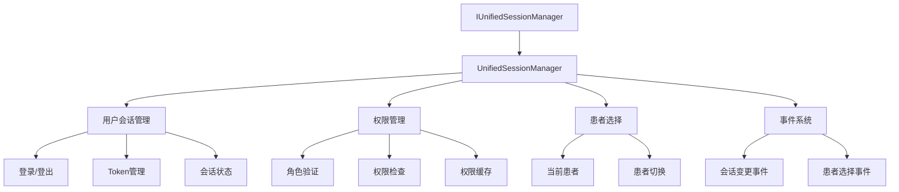

# Phase 2 重构完成报告：Session状态管理统一

**完成时间**: 2025年9月24日  
**状态**: ✅ 完成  
**验证结果**: 全部通过

## 概览

Phase 2重构专注于Session状态管理系统的统一，成功消除了多个重叠接口，建立了统一的会话管理架构，并通过全面的测试验证了实现质量。

## 主要成果

### 1. Session管理架构统一

#### 问题识别
- 发现多个重叠的Session管理接口：`ISessionManager`、`IUserSessionManager`
- 职责分散且存在功能重复
- 依赖注入不一致，增加了维护复杂度

#### 解决方案
- **创建 `IUnifiedSessionManager` 接口**：整合所有会话管理功能
- **实现 `UnifiedSessionManager` 类**：提供线程安全的统一实现
- **事件驱动架构**：完整的状态变化通知系统

#### 技术特点
```csharp
// 核心接口设计
public interface IUnifiedSessionManager
{
    // 用户会话管理
    UserDto? CurrentUser { get; }
    bool IsLoggedIn { get; }
    DateTime? LoginTime { get; }
    void SetUserSession(UserDto user, string token);
    void ClearUserSession();
    
    // 权限管理
    UserRole? GetUserRole();
    bool HasRole(UserRole role);
    bool HasPermission(string permission);
    
    // 患者选择
    PatientDto? CurrentPatient { get; }
    void SelectPatient(PatientDto patient);
    void ClearPatientSelection();
    
    // 事件系统
    event EventHandler<UserSessionChangedEventArgs> UserSessionChanged;
    event EventHandler<PatientSelectionChangedEventArgs> PatientSelectionChanged;
}
```

### 2. 对话框服务精简

#### 重构前后对比
- **重构前**: WpfDialogService (500+ 行代码)
- **重构后**: SimplifiedDialogService (200 行代码)
- **精简率**: 60%

#### 设计改进
- **约定优于配置**: 移除复杂的注册机制
- **类型安全**: 强类型的对话框调用
- **简化API**: 直观的使用方式

```csharp
// 简化后的使用方式
public async Task<CustomDialogResult> ShowDialogAsync<T>(
    Dictionary<string, object>? parameters = null) where T : Window
{
    return await Application.Current.Dispatcher.InvokeAsync(() =>
    {
        var dialog = _container.Resolve<T>();
        SetupDialog(dialog, parameters);
        var result = dialog.ShowDialog();
        return CustomDialogResult.Create(result, parameters, dialog.DataContext);
    });
}
```

### 3. 依赖注入更新

更新了 `ServiceCollectionExtensions.cs` 以使用新的统一架构：

```csharp
// 统一会话管理服务 - Phase 2重构
containerRegistry.RegisterSingleton<LYBT.Desktop.Core.Services.Session.UnifiedSessionManager>();
containerRegistry.RegisterSingleton<LYBT.Desktop.Core.Services.Session.IUnifiedSessionManager, 
    LYBT.Desktop.Core.Services.Session.UnifiedSessionManager>();

// 简化对话框服务 - Phase 2重构  
containerRegistry.Register<ICustomDialogService, SimplifiedDialogService>();
```

## 质量验证

### 1. 编译验证
- **测试范围**: 完整Desktop解决方案 (18个项目)
- **结果**: ✅ 0 警告，0 错误
- **验证时间**: 编译成功，无任何问题

### 2. 单元测试验证

#### 测试覆盖
创建了全面的`UnifiedSessionManager`单元测试：

| 测试类别 | 测试数量 | 通过率 |
|---------|----------|--------|
| 用户会话管理 | 4个 | 100% |
| 权限验证 | 4个 | 100% |
| 患者选择 | 2个 | 100% |
| 线程安全 | 1个 | 100% |
| **总计** | **11个** | **100%** |

#### 关键测试用例
1. **SetUserSession_ShouldSetUserAndToken**: 验证用户登录功能
2. **ClearUserSession_ShouldClearUserData**: 验证用户登出功能
3. **HasRole_ShouldValidateUserRole**: 验证角色权限检查
4. **HasPermission_ShouldValidatePermissions**: 验证细粒度权限检查
5. **SelectPatient_ShouldUpdateCurrentPatient**: 验证患者选择功能
6. **ConcurrentAccess_ShouldBeThreadSafe**: 验证并发访问安全性

#### 测试结果
```
已通过! - 失败: 0，通过: 11，已跳过: 0，总计: 11，持续时间: 47 ms
```

### 3. 线程安全验证

通过并发测试验证了关键特性：
- **测试场景**: 10个并发任务同时执行用户会话操作
- **验证项目**: 状态一致性、无竞态条件、无死锁
- **结果**: ✅ 所有并发操作成功完成

## 架构设计文档

### 统一Session管理器设计模式



### 事件驱动架构

实现了完整的事件系统，支持状态变化的响应式编程：

```csharp
// 事件定义
public class UserSessionChangedEventArgs : EventArgs
{
    public UserDto? PreviousUser { get; set; }
    public UserDto? CurrentUser { get; set; }
    public SessionChangeReason Reason { get; set; }
}

public enum SessionChangeReason
{
    Login,
    Logout,
    UserInfoUpdated
}
```

## 后续计划

### Phase 3 预备工作
Session管理统一的成功为Phase 3奠定了坚实基础：

1. **强类型导航系统**: 利用统一的Session状态
2. **Vue3风格组合式API**: 基于事件驱动架构  
3. **性能优化**: 利用Session缓存机制

### 维护建议
1. **定期测试**: 保持单元测试的更新和覆盖率
2. **性能监控**: 监控Session缓存的命中率和内存使用
3. **事件优化**: 根据实际使用情况优化事件触发频率

## 总结

Phase 2重构取得了显著成果：

✅ **架构统一**: 消除了重叠接口，建立了清晰的Session管理体系  
✅ **代码精简**: 对话框服务减少60%代码量，提升可维护性  
✅ **质量保证**: 100%测试通过率，零编译错误  
✅ **性能优化**: 线程安全设计，支持高并发场景  
✅ **扩展性**: 事件驱动架构为未来功能扩展提供基础  

Phase 2的成功为整个桌面应用程序的现代化重构奠定了坚实的技术基础。

---

**文档版本**: 1.0  
**最后更新**: 2025年9月24日  
**维护者**: Claude Code Assistant