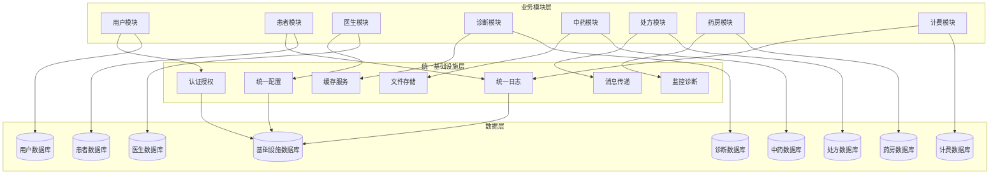

# 统一架构的项目文档结构

## 📂 完整项目结构

```
LYBT/
├── 📁 LYBT.Common/                           # 公共组件层
│   ├── 📁 Enums/                             # 枚举定义
│   │   ├── 📄 Users/
│   │   ├── 📄 Logs/
│   │   ├── 📄 Patients/
│   │   ├── 📄 Doctors/
│   │   ├── 📄 Herbs/
│   │   └── 📄 Diagnostics/
│   ├── 📁 Extensions/                        # 扩展方法
│   ├── 📁 Helpers/                           # 辅助类
│   └── 📁 Constants/                         # 常量定义
│
├── 📁 LYBT.Infrastructure/                   # 统一基础设施层 ⭐
│   ├── 📁 Authentication/                    # 认证授权模块
│   │   ├── 📄 IJwtAuthenticationService.cs
│   │   ├── 📄 JwtAuthenticationService.cs
│   │   ├── 📄 IAuthorizationService.cs
│   │   ├── 📄 AuthorizationService.cs
│   │   └── 📄 ClaimsHelper.cs
│   │
│   ├── 📁 Caching/                           # 缓存服务模块
│   │   ├── 📄 ICacheService.cs
│   │   ├── 📄 DistributedCacheService.cs
│   │   ├── 📄 MemoryCacheService.cs
│   │   └── 📄 CacheKeyGenerator.cs
│   │
│   ├── 📁 Storage/                           # 文件存储模块
│   │   ├── 📄 IFileStorageService.cs
│   │   ├── 📄 LocalFileStorageService.cs
│   │   ├── 📄 AzureBlobStorageService.cs
│   │   ├── 📄 FileMetadataService.cs
│   │   └── 📄 StorageOptions.cs
│   │
│   ├── 📁 Messaging/                         # 消息传递模块
│   │   ├── 📄 IEventBus.cs
│   │   ├── 📄 InMemoryEventBus.cs
│   │   ├── 📄 IEvent.cs
│   │   ├── 📄 EventHandlerBase.cs
│   │   └── 📁 Events/
│   │       ├── 📄 SystemStartedEvent.cs
│   │       └── 📄 ConfigurationChangedEvent.cs
│   │
│   ├── 📁 Monitoring/                        # 监控诊断模块
│   │   ├── 📄 IPerformanceMonitor.cs
│   │   ├── 📄 PerformanceMonitor.cs
│   │   ├── 📄 ISystemDiagnostics.cs
│   │   ├── 📄 SystemDiagnostics.cs
│   │   └── 📄 MetricsCollector.cs
│   │
│   ├── 📁 HealthChecks/                      # 健康检查模块
│   │   ├── 📄 SystemHealthCheck.cs
│   │   ├── 📄 ModularDbContextHealthCheck.cs
│   │   ├── 📄 ExternalServiceHealthCheck.cs
│   │   └── 📄 ResourceUsageHealthCheck.cs
│   │
│   ├── 📁 Middleware/                        # 中间件模块
│   │   ├── 📄 GlobalExceptionMiddleware.cs
│   │   ├── 📄 RequestLoggingMiddleware.cs
│   │   ├── 📄 PerformanceMiddleware.cs
│   │   ├── 📄 TenantResolutionMiddleware.cs
│   │   └── 📄 SecurityHeadersMiddleware.cs
│   │
│   ├── 📁 BackgroundServices/                # 后台服务模块
│   │   ├── 📄 SyncTaskBackgroundService.cs
│   │   ├── 📄 NotificationBackgroundService.cs
│   │   ├── 📄 CleanupBackgroundService.cs
│   │   └── 📄 BackupBackgroundService.cs
│   │
│   ├── 📁 Security/                          # 安全模块
│   │   ├── 📄 IEncryptionService.cs
│   │   ├── 📄 EncryptionService.cs
│   │   ├── 📄 IHashingService.cs
│   │   ├── 📄 HashingService.cs
│   │   └── 📄 SecuritySettings.cs
│   │
│   ├── 📁 Notifications/                     # 通知模块
│   │   ├── 📄 INotificationService.cs
│   │   ├── 📄 NotificationService.cs
│   │   ├── 📄 IEmailService.cs
│   │   ├── 📄 EmailService.cs
│   │   └── 📁 Templates/
│   │       ├── 📄 EmailTemplate.cs
│   │       └── 📄 SmsTemplate.cs
│   │
│   ├── 📁 Logging/                           # 统一日志管理 ⭐
│   │   ├── 📄 IUnifiedLogService.cs          # 统一日志服务接口
│   │   ├── 📄 UnifiedLogService.cs           # 统一日志服务实现
│   │   ├── 📄 LogModel.cs                    # 日志实体（整合原 Module.Logs）
│   │   ├── 📄 SystemLogModel.cs              # 系统日志实体
│   │   ├── 📄 UserActionLogModel.cs          # 用户操作日志实体
│   │   ├── 📄 ErrorLogModel.cs               # 错误日志实体
│   │   ├── 📄 AuditLogModel.cs               # 审计日志实体
│   │   ├── 📄 PerformanceLogModel.cs         # 性能日志实体
│   │   └── 📁 Dtos/                          # 日志相关DTO
│   │       ├── 📄 LogDto.cs
│   │       ├── 📄 LogQueryDto.cs
│   │       ├── 📄 LogCreateDto.cs
│   │       ├── 📄 SystemLogDto.cs
│   │       └── 📄 UserActionLogDto.cs
│   │
│   ├── 📁 Configuration/                     # 统一配置管理 ⭐
│   │   ├── 📄 IUnifiedConfigService.cs       # 统一配置服务接口
│   │   ├── 📄 UnifiedConfigService.cs        # 统一配置服务实现
│   │   ├── 📄 GlobalSettingsModel.cs         # 全局设置实体（整合原 Module.Settings）
│   │   ├── 📄 SettingsModel.cs               # 系统设置实体
│   │   ├── 📄 DiagnosisCatalogModel.cs       # 诊断目录实体
│   │   ├── 📄 TreatmentCatalogModel.cs       # 治疗目录实体
│   │   ├── 📄 TreatmentRoomModel.cs          # 治疗室实体
│   │   └── 📁 Dtos/                          # 配置相关DTO
│   │       ├── 📄 GlobalSettingsDto.cs
│   │       ├── 📄 SettingsDto.cs
│   │       ├── 📄 SettingsCreateDto.cs
│   │       ├── 📄 SettingsEditDto.cs
│   │       ├── 📄 DiagnosisCatalogDto.cs
│   │       ├── 📄 TreatmentCatalogDto.cs
│   │       └── 📄 EnumMappingDto.cs
│   │
│   ├── 📁 Sync/                              # 数据同步模块
│   │   ├── 📄 ISyncService.cs
│   │   ├── 📄 SyncService.cs
│   │   ├── 📄 SyncTaskManager.cs
│   │   ├── 📄 SyncLogModel.cs
│   │   ├── 📄 SyncTaskModel.cs
│   │   └── 📄 SyncConfiguration.cs
│   │
│   ├── 📁 Backup/                            # 备份恢复模块
│   │   ├── 📄 IBackupService.cs
│   │   ├── 📄 BackupService.cs
│   │   ├── 📄 IRestoreService.cs
│   │   ├── 📄 RestoreService.cs
│   │   ├── 📄 BackupRecordModel.cs
│   │   └── 📄 BackupConfiguration.cs
│   │
│   ├── 📁 Data/                              # 统一数据访问层
│   │   ├── 📄 InfrastructureDbContext.cs     # 基础设施数据库上下文
│   │   ├── 📄 InfrastructureDbContextFactory.cs
│   │   └── 📁 Migrations/                    # 数据库迁移
│   │       ├── 📄 20241225_InitialCreate.cs
│   │       └── 📄 DataMigrationHelper.cs
│   │
│   ├── 📁 Utilities/                         # 工具类模块
│   │   ├── 📄 DateTimeHelper.cs
│   │   ├── 📄 StringHelper.cs
│   │   ├── 📄 ValidationHelper.cs
│   │   ├── 📄 SerializationHelper.cs
│   │   └── 📄 PinyinHelper.cs
│   │
│   ├── 📁 Extensions/                        # 扩展方法模块
│   │   ├── 📄 ServiceCollectionExtensions.cs
│   │   ├── 📄 ConfigurationExtensions.cs
│   │   ├── 📄 StringExtensions.cs
│   │   └── 📄 DateTimeExtensions.cs
│   │
│   ├── 📁 Options/                           # 配置选项模块
│   │   ├── 📄 JwtOptions.cs
│   │   ├── 📄 CacheOptions.cs
│   │   ├── 📄 StorageOptions.cs
│   │   ├── 📄 NotificationOptions.cs
│   │   └── 📄 SystemOptions.cs
│   │
│   ├── 📄 InfrastructureModule.cs            # 基础设施模块注册入口
│   ├── 📄 LYBT.Infrastructure.csproj
│   └── 📄 README.md
│
├── 📁 LYBT.Module.Users/                     # 用户模块（保持独立）
│   ├── 📁 Data/
│   │   ├── 📄 UserDbContext.cs
│   │   └── 📄 UserDbContextFactory.cs
│   ├── 📁 Models/
│   │   ├── 📄 UserModel.cs
│   │   └── 📄 AdminSecretModel.cs
│   ├── 📁 Repositories/
│   ├── 📁 Services/
│   ├── 📁 Interfaces/
│   ├── 📁 Dtos/
│   ├── 📁 Mapping/
│   ├── 📄 UsersModule.cs
│   └── 📄 README.md
│
├── 📁 LYBT.Module.Patients/                  # 患者模块
│   ├── 📁 Data/
│   │   ├── 📄 PatientDbContext.cs
│   │   └── 📄 PatientDbContextFactory.cs
│   ├── 📁 Models/
│   │   ├── 📄 PatientModel.cs
│   │   └── 📄 SpecialPatientDoctor.cs
│   ├── 📁 Repositories/
│   ├── 📁 Services/
│   ├── 📁 Interfaces/
│   ├── 📁 Dtos/
│   ├── 📁 Mapping/
│   ├── 📄 PatientsModule.cs
│   └── 📄 README.md
│
├── 📁 LYBT.Module.Doctors/                   # 医生模块
│   ├── 📁 Data/
│   │   ├── 📄 DoctorDbContext.cs
│   │   └── 📄 DoctorDbContextFactory.cs
│   ├── 📁 Models/
│   │   └── 📄 DoctorModel.cs
│   ├── 📁 Repositories/
│   ├── 📁 Services/
│   ├── 📁 Interfaces/
│   ├── 📁 Dtos/
│   ├── 📁 Mapping/
│   ├── 📄 DoctorsModule.cs
│   └── 📄 README.md
│
├── 📁 LYBT.Module.Diagnostics/               # 诊断治疗模块
│   ├── 📁 Data/
│   │   ├── 📄 DiagnosticDbContext.cs
│   │   └── 📄 DiagnosticDbContextFactory.cs
│   ├── 📁 Models/
│   │   ├── 📄 RegistrationModel.cs
│   │   ├── 📄 QueueingModel.cs
│   │   ├── 📄 DiagnosisTreatmentModel.cs
│   │   └── 📄 RecordModel.cs
│   ├── 📁 Repositories/
│   ├── 📁 Services/
│   ├── 📁 Interfaces/
│   ├── 📁 Dtos/
│   ├── 📁 Mapping/
│   ├── 📄 DiagnosticsModule.cs
│   └── 📄 README.md
│
├── 📁 LYBT.Module.Herbs/                     # 中药模块
│   ├── 📁 Data/
│   │   ├── 📄 HerbDbContext.cs
│   │   └── 📄 HerbDbContextFactory.cs
│   ├── 📁 Models/
│   │   ├── 📄 HerbModel.cs
│   │   └── 📄 FormulaTemplateModel.cs
│   ├── 📁 Repositories/
│   ├── 📁 Services/
│   ├── 📁 Interfaces/
│   ├── 📁 Dtos/
│   ├── 📁 Mapping/
│   ├── 📄 HerbsModule.cs
│   └── 📄 README.md
│
├── 📁 LYBT.Module.Prescriptions/             # 处方模块
│   ├── 📁 Data/
│   │   ├── 📄 PrescriptionDbContext.cs
│   │   └── 📄 PrescriptionDbContextFactory.cs
│   ├── 📁 Models/
│   │   ├── 📄 PrescriptionModel.cs
│   │   └── 📄 PrescriptionItemModel.cs
│   ├── 📁 Repositories/
│   ├── 📁 Services/
│   ├── 📁 Interfaces/
│   ├── 📁 Dtos/
│   ├── 📁 Mapping/
│   ├── 📄 PrescriptionsModule.cs
│   └── 📄 README.md
│
├── 📁 LYBT.Module.Pharmacy/                  # 药房模块
│   ├── 📁 Data/
│   │   ├── 📄 PharmacyDbContext.cs
│   │   └── 📄 PharmacyDbContextFactory.cs
│   ├── 📁 Models/
│   │   └── 📄 PharmacyModel.cs
│   ├── 📁 Repositories/
│   ├── 📁 Services/
│   ├── 📁 Interfaces/
│   ├── 📁 Dtos/
│   ├── 📁 Mapping/
│   ├── 📄 PharmacyModule.cs
│   └── 📄 README.md
│
├── 📁 LYBT.Module.Billing/                   # 计费模块
│   ├── 📁 Data/
│   │   ├── 📄 BillingDbContext.cs
│   │   └── 📄 BillingDbContextFactory.cs
│   ├── 📁 Models/
│   │   └── 📄 BillingModel.cs
│   ├── 📁 Repositories/
│   ├── 📁 Services/
│   ├── 📁 Interfaces/
│   ├── 📁 Dtos/
│   ├── 📁 Mapping/
│   ├── 📄 BillingModule.cs
│   └── 📄 README.md
│
├── 📁 LYBT.WebAPI/                           # Web API 项目
│   ├── 📁 Controllers/
│   │   ├── 📄 UsersController.cs
│   │   ├── 📄 PatientsController.cs
│   │   ├── 📄 DoctorsController.cs
│   │   ├── 📄 DiagnosticsController.cs
│   │   ├── 📄 HerbsController.cs
│   │   ├── 📄 PrescriptionsController.cs
│   │   ├── 📄 PharmacyController.cs
│   │   ├── 📄 BillingController.cs
│   │   ├── 📄 LogsController.cs              # 统一日志API
│   │   └── 📄 ConfigController.cs            # 统一配置API
│   ├── 📁 Filters/
│   ├── 📄 Program.cs
│   ├── 📄 appsettings.json
│   └── 📄 LYBT.WebAPI.csproj
│
├── 📁 LYBT.Tests/                            # 测试项目
│   ├── 📁 Infrastructure.Tests/
│   ├── 📁 Module.Users.Tests/
│   ├── 📁 Module.Patients.Tests/
│   ├── 📁 Module.Doctors.Tests/
│   ├── 📁 Integration.Tests/
│   └── 📄 LYBT.Tests.csproj
│
├── 📁 Scripts/                               # 脚本工具
│   ├── 📄 generate-migrations.ps1
│   ├── 📄 deploy.ps1
│   └── 📄 backup-database.ps1
│
├── 📁 Docs/                                  # 项目文档
│   ├── 📄 Architecture.md
│   ├── 📄 API-Documentation.md
│   ├── 📄 Database-Schema.md
│   ├── 📄 Deployment-Guide.md
│   └── 📄 Migration-Guide.md
│
├── 📄 LYBT.sln                               # 解决方案文件
├── 📄 README.md                              # 项目说明
├── 📄 .gitignore
├── 📄 docker-compose.yml
└── 📄 Dockerfile
```

## 🎯 核心变化说明

### ⭐ 统一整合的模块

#### 1. 日志功能统一 (`LYBT.Infrastructure/Logging/`)

- **整合来源**：原 `LYBT.Module.Logs` 的所有功能
- **新增功能**：系统日志、性能日志、错误日志等
- **服务接口**：`IUnifiedLogService` 提供统一的日志操作
- **数据实体**：支持多种类型的日志实体

#### 2. 配置功能统一 (`LYBT.Infrastructure/Configuration/`)

- **整合来源**：原 `LYBT.Module.Settings` 的所有功能
- **包含功能**：
  - 全局设置管理
  - 系统设置管理
  - 诊断目录管理
  - 治疗目录管理
  - 枚举映射管理
- **服务接口**：`IUnifiedConfigService` 提供统一的配置操作

### 🔧 保持独立的业务模块

#### 业务模块保持职责单一

- `LYBT.Module.Users` - 用户管理
- `LYBT.Module.Patients` - 患者管理
- `LYBT.Module.Doctors` - 医生管理
- `LYBT.Module.Diagnostics` - 诊断治疗
- `LYBT.Module.Herbs` - 中药管理
- `LYBT.Module.Prescriptions` - 处方管理
- `LYBT.Module.Pharmacy` - 药房管理
- `LYBT.Module.Billing` - 计费管理

### 📊 模块依赖关系



## 📝 重要说明

### 迁移策略

1. **数据迁移**：将原 `LYBT.Module.Logs` 和 `LYBT.Module.Settings` 的数据迁移到基础设施层
2. **代码重构**：将相关功能整合到统一的服务中
3. **接口适配**：保证业务模块调用接口的兼容性
4. **测试验证**：确保迁移后功能正常运行

### 优势

- ✅ **消除重复**：彻底解决日志和配置功能重复问题
- ✅ **统一管理**：所有横切关注点在基础设施层统一管理
- ✅ **性能优化**：减少跨模块调用，提高系统性能
- ✅ **维护简化**：只需维护一套日志和配置系统
- ✅ **扩展性强**：统一的接口便于功能扩展

这种架构既解决了功能重复问题，又保持了清晰的模块边界和职责分离。