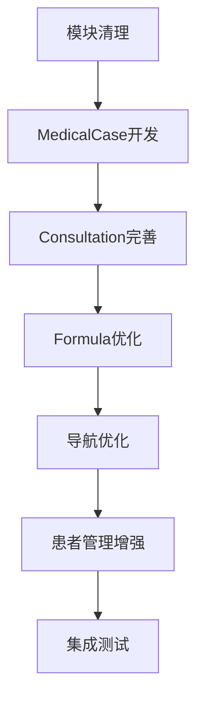

# 前端开发任务评估报告

基于后端8个业务模块的前端开发任务评估

**评估日期**: 2025年1月8日

## 一、后端业务模块对照表

| 后端模块 | 前端实现状态 | 服务层 | UI层 | 完成度 |
|---------|-------------|--------|------|--------|
| **Auth** | ✅ 已实现 | AuthenticationService | Authentication模块 | 100% |
| **Users** | ✅ 已实现 | UserService | SystemManagement/Users | 100% |
| **Patients** | ✅ 已实现 | PatientService | SystemManagement/Patients | 100% |
| **Herbs** | ✅ 已实现 | HerbService | SystemManagement/Herbs | 100% |
| **Formula** | ⚠️ 部分实现 | FormulaService | SystemManagement/Formulas | 80% |
| **Consultation** | ⚠️ 部分实现 | ConsultationService | Consultation模块 | 60% |
| **MedicalCase** | ❌ 缺少UI | MedicalCaseService | 无独立UI模块 | 30% |
| **Prescriptions** | ✅ 已实现 | PrescriptionService | SystemManagement/Prescriptions | 100% |

## 二、需要清理的前端模块

### 1. Registration模块（删除）
- **位置**: `src/Frontend/Desktop/Modules/Registration/`
- **原因**: 后端已移除，功能整合到Patients模块
- **状态**: 代码存在但未在App.xaml.cs中注册，实际未使用
- **任务**: 完全删除该模块目录及相关引用

### 2. RecordManagement（调整）
- **位置**: SystemManagement中的导航项
- **原因**: 后端Records已并入MedicalCase
- **任务**: 移除导航，或重定向到MedicalCase界面

### 3. PrescriptionTemplates（重命名）
- **位置**: SystemManagement/PrescriptionTemplates
- **原因**: 应对应后端的Formula（验方）模块
- **任务**: 统一命名为Formula相关

## 三、前端开发任务清单

### 🔴 高优先级任务

#### 1. MedicalCase UI模块开发
**优先级**: P0  
**工作量**: 3-5天  
**任务详情**:
- [ ] 创建MedicalCase独立模块
- [ ] 开发医疗案例列表界面
- [ ] 实现案例详情查看（包含完整病历）
- [ ] 支持案例的创建、编辑、查询
- [ ] 整合原Records（病历）功能
- [ ] 实现与Consultation的联动

#### 2. Consultation模块完善
**优先级**: P0  
**工作量**: 2-3天  
**任务详情**:
- [ ] 完善看诊主界面
- [ ] 实现中医四诊录入表单
- [ ] 添加望闻问切详细输入控件
- [ ] 实现诊断和治疗原则录入
- [ ] 集成MedicalCase创建流程
- [ ] 添加处方开具快捷入口

### 🟡 中优先级任务

#### 3. 模块清理与重构
**优先级**: P1  
**工作量**: 1天  
**任务详情**:
- [ ] 删除Registration模块目录
- [ ] 移除RecordManagement导航项
- [ ] 重命名PrescriptionTemplates为FormulaTemplates
- [ ] 更新相关引用和命名空间
- [ ] 清理未使用的代码和资源

#### 4. Formula模块优化
**优先级**: P1  
**工作量**: 1-2天  
**任务详情**:
- [ ] 统一验方模板管理界面
- [ ] 实现经典验方库管理
- [ ] 支持医生个人验方创建
- [ ] 添加验方快速应用到处方功能

### 🟢 低优先级任务

#### 5. 导航结构优化
**优先级**: P2  
**工作量**: 1天  
**任务详情**:
- [ ] 调整主菜单结构，反映新的业务流程
- [ ] 优化SystemManagement导航菜单
- [ ] 添加快捷操作工具栏
- [ ] 实现工作流引导界面

#### 6. 患者管理增强
**优先级**: P2  
**工作量**: 1天  
**任务详情**:
- [ ] 整合基础接待功能（原挂号）
- [ ] 添加快速创建患者功能
- [ ] 实现患者就诊历史查看
- [ ] 优化患者搜索和筛选

## 四、技术债务清理

### 需要处理的技术问题
1. **命名不一致**: PrescriptionTemplates vs Formula
2. **未使用代码**: Registration模块相关代码
3. **导航错误**: RecordManagement指向不存在的功能
4. **API调用**: 确保所有API调用与后端8个模块对齐

### 代码清理清单
```
删除文件/目录:
- src/Frontend/Desktop/Modules/Registration/
- 相关的RegistrationApiService引用
- RecordManagementView相关文件

重命名:
- PrescriptionTemplates → FormulaTemplates
- 相关的ViewModel和Service
```

## 五、开发路线图

### 第一阶段（1周）
1. **Day 1-3**: MedicalCase UI模块开发
2. **Day 4-5**: Consultation模块完善
3. **Day 6**: 模块清理与重构
4. **Day 7**: 测试与调试

### 第二阶段（3天）
1. **Day 1**: Formula模块优化
2. **Day 2**: 导航结构优化
3. **Day 3**: 患者管理增强

### 第三阶段（持续）
- 性能优化
- UI美化
- 用户体验改进
- 错误处理完善

## 六、资源需求

### 开发资源
- 前端开发人员：1-2名
- UI/UX设计支持：按需
- 测试人员：1名

### 技术栈确认
- WPF + .NET 8
- Prism.DryIoc 9.0.537
- Refit HTTP客户端
- MVVM模式

## 七、风险评估

### 潜在风险
1. **MedicalCase复杂度**: 作为核心聚合根，功能较复杂
2. **数据迁移**: Records数据需要迁移到MedicalCase
3. **用户习惯**: 简化流程可能需要用户适应

### 缓解措施
1. 分阶段实现MedicalCase功能
2. 提供数据迁移工具或脚本
3. 提供用户培训和操作指南

## 八、验收标准

### 功能验收
- [ ] 8个后端模块都有对应的前端UI
- [ ] 核心业务流程（患者→看诊→开方）完整可用
- [ ] MedicalCase能够贯穿整个诊疗流程
- [ ] 所有API调用正常工作

### 代码质量
- [ ] 无编译警告和错误
- [ ] 命名规范统一
- [ ] 删除所有未使用的代码
- [ ] 通过基本的UI测试

## 九、建议执行顺序



## 十、总结

### 当前状态
- **已完成模块**: 5个（Auth、Users、Patients、Herbs、Prescriptions）
- **部分完成**: 2个（Formula、Consultation）
- **缺失模块**: 1个（MedicalCase UI）
- **需要清理**: Registration模块及相关引用

### 核心任务
1. **最紧急**: 开发MedicalCase UI模块
2. **重要**: 完善Consultation看诊功能
3. **必要**: 清理冗余代码和统一命名

### 预期成果
完成所有任务后，前端将完全对齐后端的8个业务模块，实现简化但完整的中医诊所管理系统核心功能。

---

**报告编制**: Claude Code Assistant  
**审核状态**: 待审核  
**下一步行动**: 确认优先级后开始MedicalCase UI模块开发