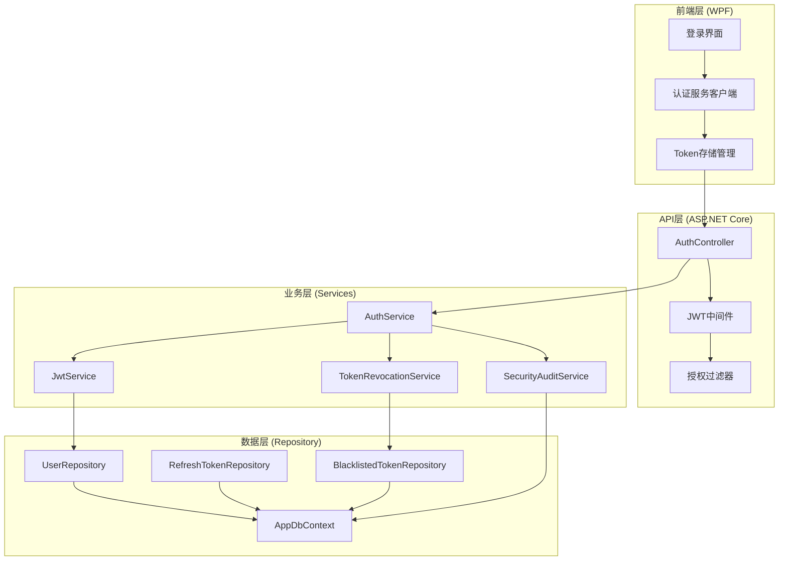
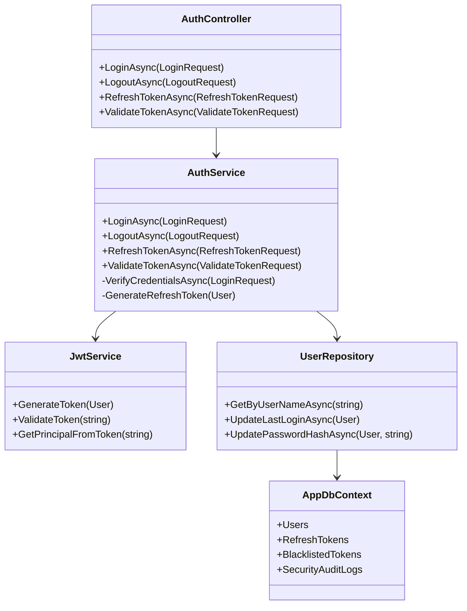
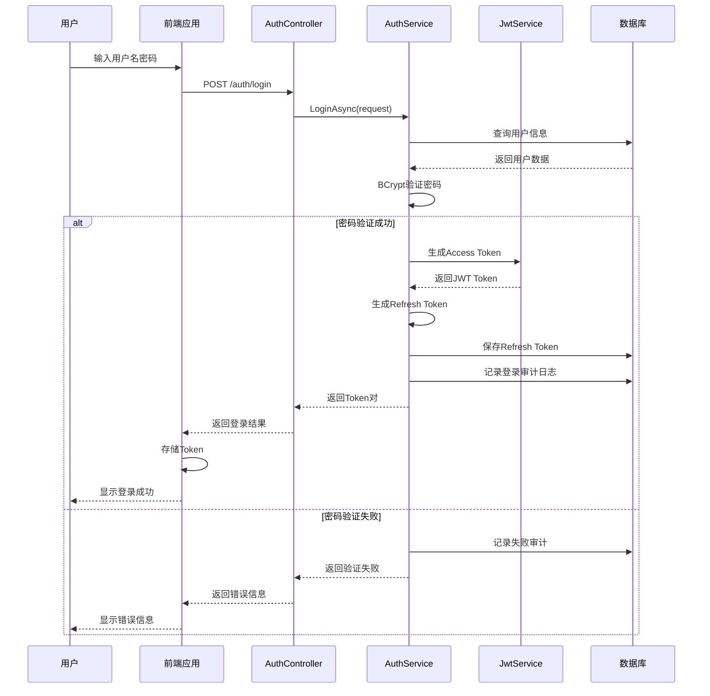
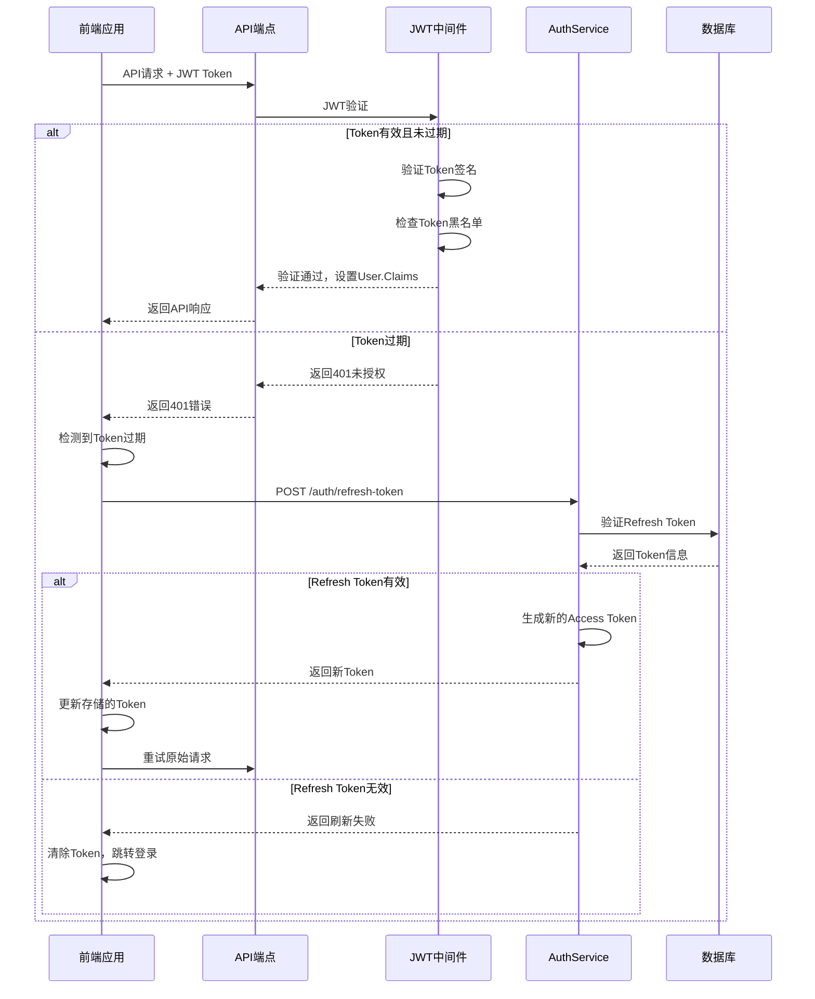
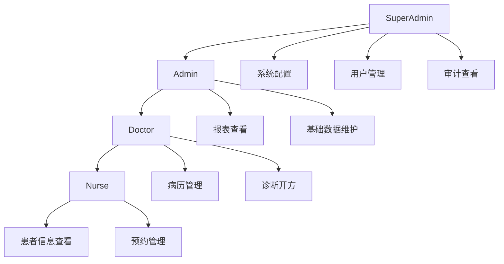

# 认证系统架构设计 (Authentication System Architecture)

> **理解导向**: 深入理解LYBTZYZS认证授权系统的设计原理和架构决策
> **适合人群**: 架构师、技术负责人、高级开发者
> **使用方式**: 深度理解、背景学习、决策支持

## 🏗️ 系统架构概览

### 设计理念

LYBTZYZS认证系统基于**适度设计原则**构建，针对中医诊所的实际需求进行了精简优化：

1. **简化复杂性**: 移除企业级系统的复杂功能，专注核心认证需求
2. **安全性优先**: 在简化的同时保持高级别的安全标准
3. **易于维护**: 采用清晰的分层架构，便于理解和维护
4. **可扩展性**: 预留扩展接口，支持未来功能增强

### 整体架构图



### 核心组件关系



## 🔐 认证机制深度解析

### JWT认证流程

#### 1. 用户登录认证



#### 2. Token验证和刷新



### JWT Token结构分析

#### Token头 (Header)
```json
{
  "alg": "HS256",
  "typ": "JWT"
}
```

#### Token载荷 (Payload)
```json
{
  "sub": "00000000-0000-0000-0000-000000000001",
  "name": "doctor_zhang",
  "role": "Doctor",
  "iat": 1640995200,
  "exp": 1640996100,
  "iss": "LYBTZYZS",
  "aud": "LYBTZYZS-Users",
  "jti": "d3b0a8d2-c5f1-4e8b-9a7d-1e2f3a4b5c6d",
  "sid": "session_123456",
  "device_fingerprint": "web_chrome_windows"
}
```

**声明说明**
- **标准声明**: `sub`, `iat`, `exp`, `iss`, `aud`, `jti`
- **自定义声明**: `name` (用户名), `role` (角色), `sid` (会话ID), `device_fingerprint` (设备指纹)

#### Token签名 (Signature)
```
HMACSHA256(
  base64UrlEncode(header) + "." + base64UrlEncode(payload),
  your-256-bit-secret-key
)
```

## 🏥 中医诊所场景适配

### 业务场景分析

#### 场景1: 医生工作站认证
- **需求特点**: 医生在固定诊室工作，需要快速登录
- **解决方案**: 支持"记住登录状态"，7天内免登录
- **安全考虑**: 绑定工作站MAC地址，防止异地登录

#### 场景2: 管理员远程管理
- **需求特点**: 管理员需要从办公室或远程访问系统
- **解决方案**: 强制双因素认证，严格的会话管理
- **安全考虑**: 短期Token（15分钟），强制重新认证

#### 场景3: 护士站多点登录
- **需求特点**: 护士在多个工作站切换使用
- **解决方案**: 支持同一账户多设备登录
- **安全考虑**: 限制同时登录设备数（最多3台）

#### 场景4: 紧急情况访问
- **需求特点**: 医生需要紧急访问患者信息
- **解决方案**: 紧急登录通道，临时权限提升
- **安全考虑**: 详细审计日志，事后权限复核

### 权限模型设计

#### 角色定义矩阵

| 角色 | 描述 | 主要权限 | 典型用户 |
|------|------|----------|----------|
| SuperAdmin | 系统超级管理员 | 系统配置、用户管理、审计查看 | 系统管理员 |
| Admin | 诊所管理员 | 用户管理、基础数据维护、报表查看 | 诊所主管 |
| Doctor | 医生 | 病历管理、诊断开方、患者查看 | 执业医师 |
| Nurse | 护士 | 患者信息查看、协助记录、预约管理 | 护士 |

#### 权限继承关系



### 会话管理策略

#### 多设备会话控制
```csharp
public class SessionManager
{
    private readonly IMemoryCache _cache;
    private const int MaxSessionsPerUser = 3;

    public async Task<bool> CanCreateSessionAsync(string userId)
    {
        var activeSessions = await GetActiveSessionsCountAsync(userId);
        return activeSessions < MaxSessionsPerUser;
    }

    public async Task CreateSessionAsync(string userId, string deviceId)
    {
        // 记录新会话
        await AddActiveSessionAsync(userId, deviceId);

        // 清理过期会话
        await CleanupExpiredSessionsAsync(userId);

        // 强制下线最旧会话（如果超限）
        await EnforceSessionLimitAsync(userId);
    }
}
```

#### 会话安全特性
- **设备指纹**: 绑定浏览器和操作系统信息
- **地理位置检查**: 检测异常登录地点
- **时间窗口限制**: 医生工作时间访问限制
- **操作频率监控**: 防止异常操作行为

## 🔧 技术实现细节

### 密码安全实现

#### BCrypt哈希配置
```csharp
public class PasswordService
{
    private const int SaltRounds = 12;

    public string HashPassword(string password)
    {
        // 生成盐值并哈希密码
        return BCrypt.Net.BCrypt.HashPassword(password, SaltRounds);
    }

    public bool VerifyPassword(string password, string hashedPassword)
    {
        return BCrypt.Net.BCrypt.Verify(password, hashedPassword);
    }
}
```

**安全参数选择**
- **盐值轮数**: 12轮（2^12 = 4096次迭代）
- **计算时间**: 约100ms（防止暴力破解）
- **内存消耗**: 约4MB（抵抗GPU攻击）

#### 密码策略验证
```csharp
public class PasswordValidator
{
    public ValidationResult ValidatePassword(string password)
    {
        var result = new ValidationResult();

        // 长度检查
        if (password.Length < 8)
            result.AddError("密码长度至少8位");

        // 复杂度检查
        if (!Regex.IsMatch(password, "[A-Z]"))
            result.AddError("密码必须包含大写字母");

        if (!Regex.IsMatch(password, "[a-z]"))
            result.AddError("密码必须包含小写字母");

        if (!Regex.IsMatch(password, "[0-9]"))
            result.AddError("密码必须包含数字");

        if (!Regex.IsMatch(password, "[!@#$%^&*]"))
            result.AddError("密码必须包含特殊字符");

        return result;
    }
}
```

### Token刷新机制

#### 刷新令牌生成
```csharp
public class RefreshTokenService
{
    public async Task<string> GenerateRefreshTokenAsync(User user, string deviceId)
    {
        var token = GenerateRandomToken(); // 32字节随机数
        var hashedToken = SHA256.HashData(Encoding.UTF8.GetBytes(token));

        var refreshToken = new RefreshToken
        {
            UserId = user.Id,
            TokenHash = Convert.ToBase64String(hashedToken),
            DeviceId = deviceId,
            ExpiresAt = DateTime.UtcNow.AddDays(7),
            CreatedAt = DateTime.UtcNow
        };

        await _refreshTokenRepository.AddAsync(refreshToken);
        return token; // 返回原始Token，存储哈希值
    }
}
```

#### Token撤销实现
```csharp
public class TokenRevocationService
{
    public async Task RevokeTokenAsync(string token, string reason)
    {
        var tokenHash = ComputeTokenHash(token);

        // 加入黑名单
        var blacklistedToken = new BlacklistedToken
        {
            TokenHash = tokenHash,
            RevokeReason = reason,
            RevokedAt = DateTime.UtcNow,
            ExpiresAt = GetTokenExpiry(token) // 使用Token原过期时间
        };

        await _blacklistRepository.AddAsync(blacklistedToken);

        // 删除相关的刷新令牌
        await _refreshTokenRepository.RevokeByTokenHashAsync(tokenHash);
    }
}
```

### 安全审计系统

#### 审计事件定义
```csharp
public enum SecurityEventType
{
    LoginSuccess = 1001,
    LoginFailed = 1002,
    Logout = 1003,
    PasswordChanged = 1004,
    TokenRefreshed = 1005,
    TokenRevoked = 1006,
    PrivilegeEscalation = 1007,
    SuspiciousActivity = 1008
}

public class SecurityAuditLog
{
    public Guid Id { get; set; }
    public SecurityEventType EventType { get; set; }
    public string UserId { get; set; }
    public string UserName { get; set; }
    public string IPAddress { get; set; }
    public string UserAgent { get; set; }
    public string DeviceFingerprint { get; set; }
    public string Description { get; set; }
    public DateTime Timestamp { get; set; }
    public bool IsSuccess { get; set; }
}
```

#### 异常行为检测
```csharp
public class SecurityAnalyzer
{
    public async Task<List<SecurityAlert>> AnalyzeUserBehaviorAsync(string userId, TimeSpan timeWindow)
    {
        var alerts = new List<SecurityAlert>();
        var logs = await _auditRepository.GetUserLogsAsync(userId, timeWindow);

        // 检测登录频率异常
        var loginAttempts = logs.Count(l => l.EventType == SecurityEventType.LoginFailed);
        if (loginAttempts > 5)
        {
            alerts.Add(new SecurityAlert
            {
                Type = AlertType.BruteForceAttempt,
                Severity = AlertSeverity.High,
                Description = $"用户在{timeWindow.TotalMinutes}分钟内有{loginAttempts}次失败登录"
            });
        }

        // 检测地理位置异常
        var locations = logs.Select(l => l.IPAddress).Distinct().ToList();
        if (locations.Count > 2)
        {
            alerts.Add(new SecurityAlert
            {
                Type = AlertType.UnusualLocation,
                Severity = AlertSeverity.Medium,
                Description = $"用户在{locations.Count}个不同地理位置登录"
            });
        }

        return alerts;
    }
}
```

## 📊 性能优化策略

### 数据库优化

#### 索引策略
```sql
-- 用户查询优化
CREATE INDEX IX_Users_UserName ON Users(UserName);
CREATE INDEX IX_Users_IsActive_Role ON Users(IsActive, Role);

-- 刷新令牌查询优化
CREATE INDEX IX_RefreshTokens_UserId_ExpiresAt ON RefreshTokens(UserId, ExpiresAt);
CREATE INDEX IX_RefreshTokens_TokenHash ON RefreshTokens(TokenHash);

-- 审计日志查询优化
CREATE INDEX IX_SecurityAuditLogs_UserId_Timestamp ON SecurityAuditLogs(UserId, Timestamp);
CREATE INDEX IX_SecurityAuditLogs_EventType_Timestamp ON SecurityAuditLogs(EventType, Timestamp);
```

#### 查询优化
```csharp
public class UserRepository
{
    private readonly AppDbContext _context;
    private readonly IMemoryCache _cache;

    public async Task<User> GetByUserNameAsync(string userName)
    {
        var cacheKey = $"user_by_name_{userName}";

        return await _cache.GetOrCreateAsync(cacheKey, async entry =>
        {
            entry.AbsoluteExpirationRelativeToNow = TimeSpan.FromMinutes(30);

            return await _context.Users
                .AsNoTracking()
                .FirstOrDefaultAsync(u => u.UserName == userName && u.IsActive);
        });
    }
}
```

### 缓存策略

#### 多级缓存架构
```csharp
public class AuthenticationCacheManager
{
    private readonly IMemoryCache _memoryCache;
    private readonly IDistributedCache _distributedCache;

    // L1缓存：内存缓存（毫秒级响应）
    public async Task<User> GetUserFromMemoryAsync(string userName)
    {
        return await _memoryCache.GetOrCreateAsync($"user_{userName}", async entry =>
        {
            entry.AbsoluteExpirationRelativeToNow = TimeSpan.FromMinutes(5);
            return await GetUserFromDistributedCacheAsync(userName);
        });
    }

    // L2缓存：分布式缓存（Redis，10ms级响应）
    public async Task<User> GetUserFromDistributedCacheAsync(string userName)
    {
        var cachedUser = await _distributedCache.GetStringAsync($"user_{userName}");
        if (cachedUser != null)
        {
            return JsonSerializer.Deserialize<User>(cachedUser);
        }

        // 从数据库加载并缓存
        var user = await LoadUserFromDatabaseAsync(userName);
        if (user != null)
        {
            await _distributedCache.SetStringAsync(
                $"user_{userName}",
                JsonSerializer.Serialize(user),
                new DistributedCacheEntryOptions
                {
                    AbsoluteExpirationRelativeToNow = TimeSpan.FromMinutes(30)
                });
        }

        return user;
    }
}
```

## 🔮 扩展性设计

### 插件化认证机制

#### 认证提供者接口
```csharp
public interface IAuthenticationProvider
{
    string Name { get; }
    Task<AuthenticationResult> AuthenticateAsync(AuthenticationRequest request);
    Task<bool> SupportsUserAsync(string userName);
}

public class LdapAuthenticationProvider : IAuthenticationProvider
{
    public string Name => "LDAP";

    public async Task<AuthenticationResult> AuthenticateAsync(AuthenticationRequest request)
    {
        // LDAP认证实现
        // 支持与Active Directory集成
    }
}

public class SsoAuthenticationProvider : IAuthenticationProvider
{
    public string Name => "SSO";

    public async Task<AuthenticationResult> AuthenticateAsync(AuthenticationRequest request)
    {
        // 单点登录实现
        // 支持SAML、OAuth2等协议
    }
}
```

#### 多因素认证预留
```csharp
public interface IMfaProvider
{
    Task<bool> SendCodeAsync(string userId, string code);
    Task<bool> VerifyCodeAsync(string userId, string code);
}

public class SmsMfaProvider : IMfaProvider
{
    // 短信验证码实现
}

public class EmailMfaProvider : IMfaProvider
{
    // 邮箱验证码实现
}
```

### 微服务化准备

#### 服务边界定义
```csharp
// 认证服务接口
public interface IAuthService
{
    Task<LoginResult> LoginAsync(LoginRequest request);
    Task<RefreshTokenResult> RefreshTokenAsync(RefreshTokenRequest request);
    Task<bool> ValidateTokenAsync(string token);
    Task LogoutAsync(LogoutRequest request);
}

// 用户服务接口
public interface IUserService
{
    Task<UserDto> GetUserAsync(string userId);
    Task<bool> UpdateUserAsync(UpdateUserRequest request);
}

// 审计服务接口
public interface ISecurityAuditService
{
    Task LogSecurityEventAsync(SecurityEvent securityEvent);
    Task<List<SecurityEvent>> GetSecurityEventsAsync(string userId, DateTime from, DateTime to);
}
```

#### API网关集成预留
```csharp
public class AuthGatewayFilter : IAsyncActionFilter
{
    public async Task OnActionExecutionAsync(ActionExecutingContext context, ActionExecutionDelegate next)
    {
        var token = ExtractTokenFromRequest(context.HttpContext);

        if (!string.IsNullOrEmpty(token))
        {
            var validationResult = await _authService.ValidateTokenAsync(token);
            if (validationResult.IsValid)
            {
                // 设置用户上下文
                context.HttpContext.Items["User"] = validationResult.User;
            }
        }

        await next();
    }
}
```

## 🎯 设计决策分析

### 技术选型决策

#### JWT vs Session
**决策**: 选择JWT无状态认证

**理由分析**:
1. **扩展性**: 支持微服务架构，便于水平扩展
2. **性能**: 减少数据库查询，提高响应速度
3. **移动端友好**: 支持跨平台客户端访问
4. **无状态**: 服务端无需维护会话状态

**权衡考虑**:
- **缺点**: 无法主动撤销Token，需要黑名单机制
- **缓解措施**: 短期Token + 刷新Token + 黑名单机制

#### BCrypt vs 其他哈希算法
**决策**: 选择BCrypt

**理由分析**:
1. **安全强度**: 内置盐值，可配置计算成本
2. **抗彩虹表**: 每个密码使用唯一盐值
3. **抗GPU**: 可调整迭代次数抵抗GPU攻击
4. **成熟稳定**: 经过广泛验证的算法

#### 自定义认证 vs Identity Server
**决策**: 自定义认证实现

**理由分析**:
1. **简洁性**: 针对具体需求，避免过度复杂
2. **可控性**: 完全掌握认证逻辑和数据处理
3. **维护性**: 代码简单，便于团队理解和维护
4. **性能**: 针对使用场景优化，无额外开销

### 安全策略决策

#### Token有效期策略
**决策**: Access Token 15分钟，Refresh Token 7天

**理由分析**:
1. **安全性与便利性平衡**: 15分钟保证安全性，7天提供便利性
2. **行业最佳实践**: 符合OWASP安全建议
3. **用户体验**: 避免频繁重新登录
4. **风险控制**: 短期Token降低泄露风险

#### 多设备登录策略
**决策**: 允许多设备登录，限制设备数量

**理由分析**:
1. **业务需求**: 医生护士需要在多个工作站工作
2. **安全控制**: 限制同时登录设备数（3台）
3. **用户体验**: 提供会话管理界面
4. **审计支持**: 记录所有登录设备信息

## 📚 总结

LYBTZYZS认证系统的架构设计体现了**适度设计原则**的精髓：

1. **精简而不简单**: 在保持功能完整的同时移除不必要的复杂性
2. **安全与性能并重**: 采用现代安全标准，同时优化系统性能
3. **业务驱动设计**: 紧密结合中医诊所的实际使用场景
4. **面向未来的扩展**: 预留扩展接口，支持未来功能增强

这种设计既满足了当前的需求，又为未来的发展奠定了坚实的基础，是一个平衡了功能性、安全性、性能和可维护性的成功案例。

## 🔗 相关资源

### 设计文档
- [系统架构总览](system-overview.md)
- [安全设计规范](security-design.md)
- [微服务架构规划](microservices-design.md)

### 实现细节
- [JWT实现详解](../technology/jwt-implementation.md)
- [密码安全实现](../technology/password-security.md)
- [审计系统设计](../technology/audit-system.md)

### 外部参考
- [OWASP认证备忘单](https://cheatsheetseries.owasp.org/cheatsheets/Authentication_Cheat_Sheet.html)
- [JWT最佳实践](https://auth0.com/blog/json-web-token-best-practices/)
- [ASP.NET Core安全指南](https://docs.microsoft.com/aspnet/core/security/)

---

**文档类型**: Explanation Architecture
**架构版本**: v1.0
**更新时间**: 2025-11-22
**维护团队**: 架构组
**设计原则**: 适度设计、安全优先、易于维护