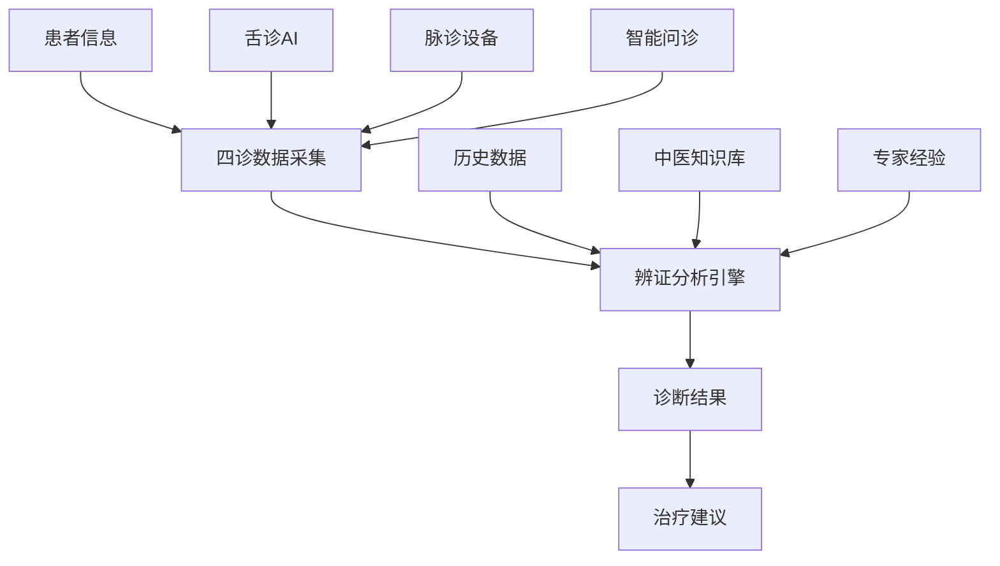
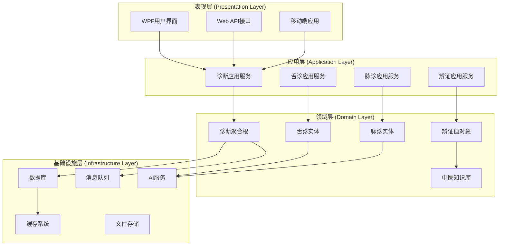
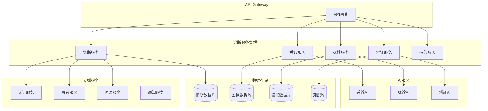
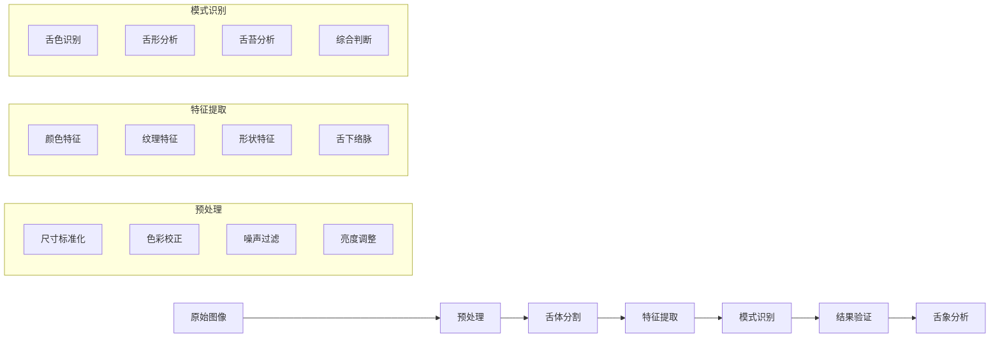
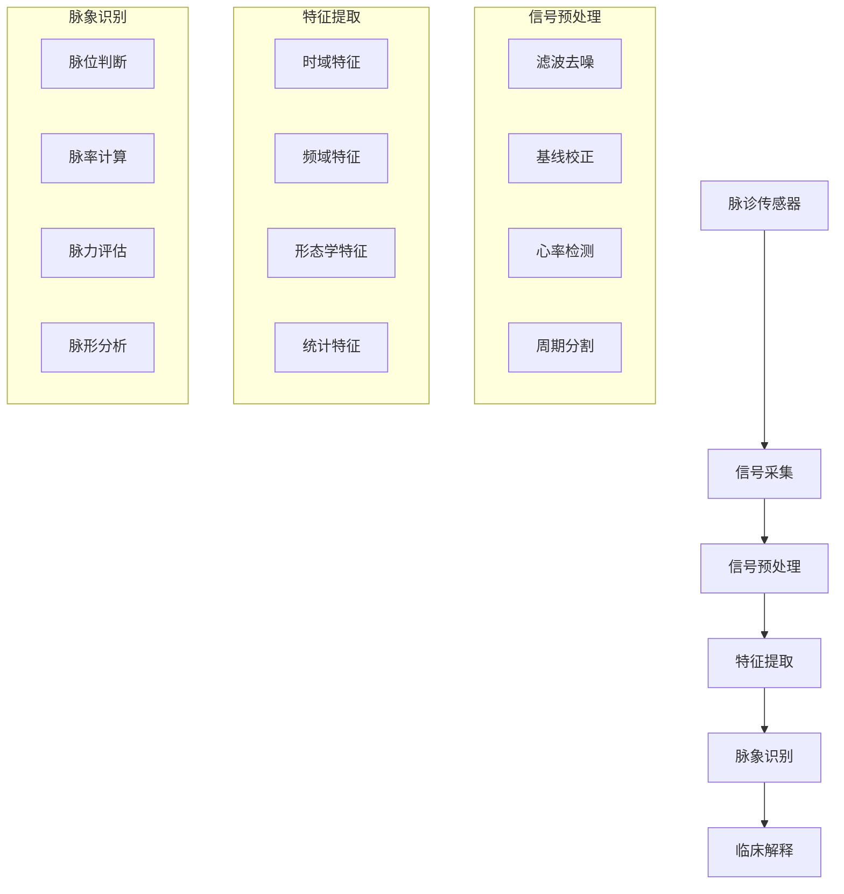
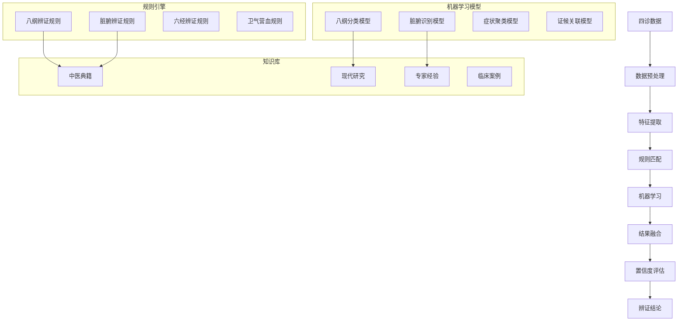
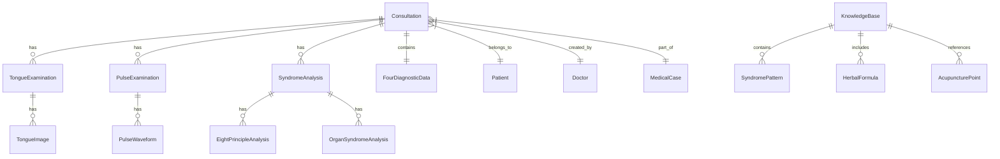
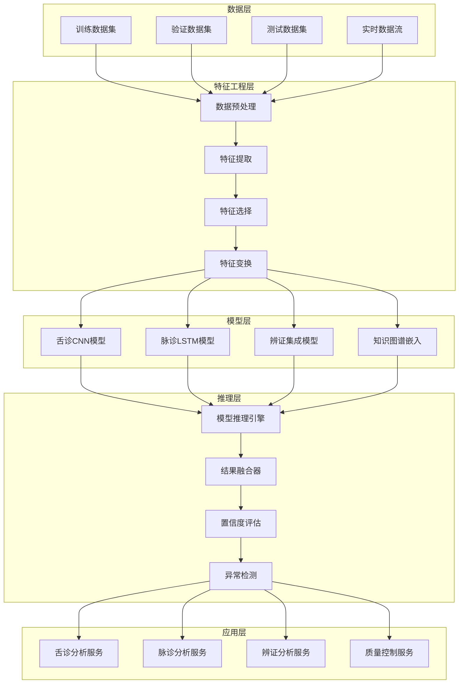
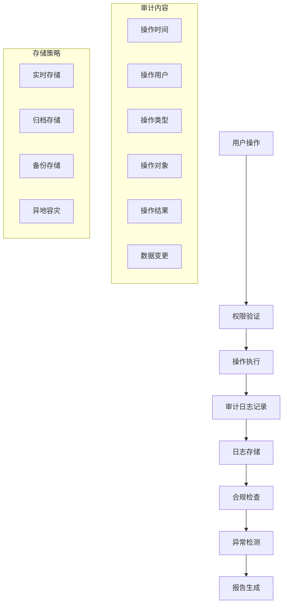

# 中医诊断系统架构设计

## 概述

本文档深入解析LYBTZYZS中医诊断系统的架构设计，包括整体架构原理、核心组件设计、数据流转机制、系统集成策略和技术实现细节。该系统基于现代软件工程原理，融合传统中医理论，实现了中医诊断过程的数字化和智能化。

## 目录

- [设计理念](#设计理念)
- [整体架构](#整体架构)
- [核心组件架构](#核心组件架构)
- [数据架构设计](#数据架构设计)
- [AI诊断引擎](#ai诊断引擎)
- [集成架构](#集成架构)
- [性能架构](#性能架构)
- [安全架构](#安全架构)
- [扩展架构](#扩展架构)
- [技术决策](#技术决策)

---

## 设计理念

### 中医现代化原则

中医诊断系统的架构设计遵循以下核心原则：

#### 1. 中医理论数字化
- **四诊合参**: 望闻问切四诊信息的数字化采集和存储
- **辨证论治**: 传统辨证方法的算法化实现
- **整体观念**: 患者信息的全方位整合分析
- **同病异治**: 个体化诊断和治疗方案生成

#### 2. 系统化思维


#### 3. 可扩展架构
- 模块化设计，支持新的辨证方法
- 插件式架构，支持新的AI模型
- 标准化接口，支持第三方设备集成
- 微服务架构，支持独立部署和扩展

### 软件工程原则

#### SOLID原则应用

**单一职责原则 (SRP)**:
```csharp
// 每个类只负责一个职责
public class TongueImageAnalyzer    // 只负责舌诊图像分析
public class PulseDataProcessor    // 只负责脉诊数据处理
public class SyndromeAnalyzer      // 只负责辨证分析
public class DiagnosticReporter   // 只负责报告生成
```

**开闭原则 (OCP)**:
```csharp
// 对扩展开放，对修改关闭
public interface ISyndromeAnalyzer
{
    SyndromeAnalysisResult Analyze(DiagnosticData data);
}

public class EightPrincipleAnalyzer : ISyndromeAnalyzer { }
public class OrganSyndromeAnalyzer : ISyndromeAnalyzer { }
public class SixMeridianAnalyzer : ISyndromeAnalyzer { } // 新增
```

**依赖倒置原则 (DIP)**:
```csharp
// 高层模块不依赖低层模块，都依赖抽象
public class DiagnosticService
{
    private readonly ISyndromeAnalyzer _syndromeAnalyzer;
    private readonly ITongueAnalyzer _tongueAnalyzer;
    private readonly IPulseAnalyzer _pulseAnalyzer;

    public DiagnosticService(
        ISyndromeAnalyzer syndromeAnalyzer,
        ITongueAnalyzer tongueAnalyzer,
        IPulseAnalyzer pulseAnalyzer)
    {
        _syndromeAnalyzer = syndromeAnalyzer;
        _tongueAnalyzer = tongueAnalyzer;
        _pulseAnalyzer = pulseAnalyzer;
    }
}
```

---

## 整体架构

### 分层架构设计



### 微服务架构



---

## 核心组件架构

### 1. 诊断数据管理组件

#### 聚合根设计

```csharp
public class Consultation : AggregateRoot<Guid>
{
    // 基础信息
    public Guid PatientId { get; private set; }
    public Guid MedicalCaseId { get; private set; }
    public Guid DoctorId { get; private set; }

    // 四诊信息
    private FourDiagnosticData _fourDiagnosticData;
    public FourDiagnosticData FourDiagnosticData => _fourDiagnosticData;

    // 辨证分析结果
    private List<SyndromeAnalysis> _syndromeAnalyses;
    public IReadOnlyCollection<SyndromeAnalysis> SyndromeAnalyses => _syndromeAnalyses.AsReadOnly();

    // 舌诊数据
    private List<TongueExamination> _tongueExaminations;
    public IReadOnlyCollection<TongueExamination> TongueExaminations => _tongueExaminations.AsReadOnly();

    // 脉诊数据
    private List<PulseExamination> _pulseExaminations;
    public IReadOnlyCollection<PulseExamination> PulseExaminations => _pulseExaminations.AsReadOnly();

    // 状态管理
    public ConsultationStatus Status { get; private set; }
    public bool IsCompleted => Status == ConsultationStatus.Completed;

    // 业务规则
    public Result CompleteDiagnosis(string tcmDiagnosis, string treatmentPrinciple)
    {
        if (IsCompleted)
            return Result.Failure("诊断已完成，无法重复完成");

        if (string.IsNullOrWhiteSpace(tcmDiagnosis))
            return Result.Failure("中医诊断不能为空");

        if (string.IsNullOrWhiteSpace(treatmentPrinciple))
            return Result.Failure("治疗原则不能为空");

        // 验证四诊信息完整性
        var validationResult = ValidateFourDiagnosticData();
        if (!validationResult.IsSuccess)
            return validationResult;

        // 更新诊断信息
        var diagnosis = new TCMDiagnosis(tcmDiagnosis, treatmentPrinciple);

        // 发布领域事件
        AddDomainEvent(new ConsultationCompletedEvent(Id, PatientId, DoctorId, diagnosis));

        // 更新状态
        Status = ConsultationStatus.Completed;

        return Result.Success();
    }

    private Result ValidateFourDiagnosticData()
    {
        var validator = new FourDiagnosticDataValidator();
        return validator.Validate(_fourDiagnosticData);
    }
}
```

#### 值对象设计

```csharp
public record FourDiagnosticData
{
    public string ChiefComplaint { get; }
    public string PresentIllness { get; }
    public InspectionData Inspection { get; }
    public AuscultationOlfactionData AuscultationOlfaction { get; }
    public InquiryData Inquiry { get; }
    public PalpationData Palpation { get; }

    public FourDiagnosticData(
        string chiefComplaint,
        string presentIllness,
        InspectionData inspection,
        AuscultationOlfactionData auscultationOlfaction,
        InquiryData inquiry,
        PalpationData palpation)
    {
        ChiefComplaint = chiefComplaint ?? throw new ArgumentNullException(nameof(chiefComplaint));
        PresentIllness = presentIllness ?? throw new ArgumentNullException(nameof(presentIllness));
        Inspection = inspection ?? throw new ArgumentNullException(nameof(inspection));
        AuscultationOlfaction = auscultationOlfaction ?? throw new ArgumentNullException(nameof(auscultationOlfaction));
        Inquiry = inquiry ?? throw new ArgumentNullException(nameof(inquiry));
        Palpation = palpation ?? throw new ArgumentNullException(nameof(palpation));
    }
}

public record InspectionData
{
    public string GeneralAppearance { get; }
    public string FacialColor { get; }
    public string MentalState { get; }
    public string SkinCondition { get; }
    public string HairCondition { get; }

    // 方法
    public bool IsComplete() =>
        !string.IsNullOrWhiteSpace(GeneralAppearance) &&
        !string.IsNullOrWhiteSpace(FacialColor) &&
        !string.IsNullOrWhiteSpace(MentalState);
}
```

### 2. 舌诊分析组件

#### 图像处理流水线



#### 核心算法实现

```csharp
public class TongueImageAnalyzer
{
    private readonly IImageProcessor _imageProcessor;
    private readonly ITongueSegmentator _segmentator;
    private readonly IFeatureExtractor _featureExtractor;
    private readonly IPatternRecognizer _recognizer;
    private readonly IResultValidator _validator;

    public async Task<TongueAnalysisResult> AnalyzeTongueImageAsync(
        Stream imageStream,
        AnalysisOptions options = null)
    {
        // 1. 图像预处理
        using var image = await _imageProcessor.PreprocessAsync(imageStream);

        // 2. 舌体分割
        var tongueRegion = await _segmentator.SegmentTongueAsync(image);
        if (!tongueRegion.IsSuccess)
            return TongueAnalysisResult.Failure("舌体分割失败");

        // 3. 特征提取
        var features = await _featureExtractor.ExtractFeaturesAsync(image, tongueRegion.Data);

        // 4. 模式识别
        var recognitionResult = await _recognizer.RecognizePatternsAsync(features);

        // 5. 结果验证
        var validationResult = await _validator.ValidateAsync(recognitionResult);
        if (!validationResult.IsValid)
        {
            // 应用校正规则
            recognitionResult = await ApplyCorrectionRules(recognitionResult, validationResult);
        }

        // 6. 生成分析结果
        return new TongueAnalysisResult
        {
            TongueBody = BuildTongueBodyAnalysis(recognitionResult.TongueBodyFeatures),
            TongueCoating = BuildTongueCoatingAnalysis(recognitionResult.CoatingFeatures),
            SublingualVeins = BuildSublingualVeinAnalysis(recognitionResult.SublingualFeatures),
            Confidence = recognitionResult.Confidence,
            QualityScore = validationResult.QualityScore
        };
    }

    private async Task<RecognitionResult> ApplyCorrectionRules(
        RecognitionResult originalResult,
        ValidationResult validation)
    {
        var corrected = originalResult.Clone();

        // 应用颜色校正规则
        if (validation.NeedsColorCorrection)
        {
            corrected.TongueBodyFeatures = await ApplyColorCorrection(
                originalResult.TongueBodyFeatures);
        }

        // 应用光照补偿规则
        if (validation.NeedsLightCompensation)
        {
            corrected = await ApplyLightCompensation(corrected);
        }

        return corrected;
    }
}
```

### 3. 脉诊分析组件

#### 信号处理架构



#### 脉诊数据处理

```csharp
public class PulseDataProcessor
{
    private readonly ISignalFilter _signalFilter;
    private readonly IHeartbeatDetector _heartbeatDetector;
    private readonly IFeatureExtractor _featureExtractor;
    private readonly IPulseClassifier _classifier;

    public async Task<PulseAnalysisResult> ProcessPulseDataAsync(
        PulseSignalData signalData,
        PulseAnalysisOptions options = null)
    {
        // 1. 信号滤波和去噪
        var filteredSignal = await _signalFilter.FilterAsync(signalData.WaveformData);

        // 2. 心跳检测
        var heartbeats = await _heartbeatDetector.DetectHeartbeatsAsync(filteredSignal);
        if (heartbeats.Count < 3)
            return PulseAnalysisResult.Failure("心跳信号不足，无法分析");

        // 3. 特征提取
        var features = new PulseFeatures();

        // 时域特征
        features.TimeDomain = await ExtractTimeDomainFeatures(filteredSignal, heartbeats);

        // 频域特征
        features.FrequencyDomain = await ExtractFrequencyDomainFeatures(filteredSignal);

        // 形态学特征
        features.Morphology = await ExtractMorphologyFeatures(filteredSignal, heartbeats);

        // 4. 脉象分类
        var classificationResult = await _classifier.ClassifyAsync(features);

        // 5. 生成分析结果
        return new PulseAnalysisResult
        {
            PulseCharacteristics = BuildPulseCharacteristics(classificationResult),
            WaveformData = features,
            Confidence = classificationResult.Confidence,
            ClinicalInterpretation = GenerateClinicalInterpretation(classificationResult)
        };
    }

    private async Task<TimeDomainFeatures> ExtractTimeDomainFeatures(
        double[] signal,
        List<Heartbeat> heartbeats)
    {
        var intervals = CalculateRRIntervals(heartbeats);

        return new TimeDomainFeatures
        {
            HeartRate = CalculateHeartRate(intervals),
            RRIntervals = intervals,
            HeartRateVariability = CalculateHRV(intervals),
            PulseStrength = CalculatePulseStrength(signal, heartbeats),
            RhythmRegularity = AnalyzeRhythmRegularity(intervals)
        };
    }
}
```

### 4. 辨证分析组件

#### 辨证引擎架构



#### 辨证分析实现

```csharp
public class SyndromeAnalyzer
{
    private readonly ISyndromeRuleEngine _ruleEngine;
    private readonly IMLSyndromeClassifier _mlClassifier;
    private readonly IKnowledgeBase _knowledgeBase;
    private readonly IConfidenceCalculator _confidenceCalculator;

    public async Task<SyndromeAnalysisResult> AnalyzeSyndromeAsync(
        DiagnosticData diagnosticData,
        SyndromeAnalysisOptions options = null)
    {
        // 1. 数据预处理和特征提取
        var features = await ExtractSyndromeFeatures(diagnosticData);

        // 2. 规则引擎分析
        var ruleBasedResult = await _ruleEngine.AnalyzeAsync(features);

        // 3. 机器学习分析
        var mlBasedResult = await _mlClassifier.ClassifyAsync(features);

        // 4. 知识库查询
        var knowledgeResult = await _knowledgeBase.QueryAsync(features);

        // 5. 结果融合
        var fusedResult = await FuseAnalysisResults(
            ruleBasedResult,
            mlBasedResult,
            knowledgeResult);

        // 6. 置信度评估
        var confidence = await _confidenceCalculator.CalculateAsync(fusedResult);

        // 7. 生成最终分析结果
        return new SyndromeAnalysisResult
        {
            EightPrincipleSyndrome = fusedResult.EightPrinciples,
            OrganSyndromes = fusedResult.Organs,
            OverallDiagnosis = fusedResult.PrimaryDiagnosis,
            Confidence = confidence,
            Evidence = BuildEvidence(fusedResult),
            Recommendations = GenerateRecommendations(fusedResult)
        };
    }

    private async Task<SyndromeFeatures> ExtractSyndromeFeatures(DiagnosticData data)
    {
        var features = new SyndromeFeatures();

        // 症状特征
        features.SymptomFeatures = await ExtractSymptomFeatures(data.Inquiry);

        // 舌象特征
        features.TongueFeatures = await ExtractTongueFeatures(data.TongueExaminations);

        // 脉象特征
        features.PulseFeatures = await ExtractPulseFeatures(data.PulseExaminations);

        // 望诊特征
        features.InspectionFeatures = await ExtractInspectionFeatures(data.Inspection);

        // 闻诊特征
        features.AuscultationFeatures = await ExtractAuscultationFeatures(data.AuscultationOlfaction);

        return features;
    }
}
```

---

## 数据架构设计

### 数据模型关系



### 数据库设计

#### 核心表结构

```sql
-- 诊断主表
CREATE TABLE Consultations (
    Id UNIQUEIDENTIFIER PRIMARY KEY,
    PatientId UNIQUEIDENTIFIER NOT NULL,
    MedicalCaseId UNIQUEIDENTIFIER NOT NULL,
    DoctorId UNIQUEIDENTIFIER NOT NULL,
    ChiefComplaint NVARCHAR(500) NOT NULL,
    PresentIllness NVARCHAR(MAX),
    Inspection NVARCHAR(MAX),
    AuscultationOlfaction NVARCHAR(MAX),
    Inquiry NVARCHAR(MAX),
    Palpation NVARCHAR(MAX),
    TCMDiagnosis NVARCHAR(200),
    TreatmentPrinciple NVARCHAR(500),
    Status INT NOT NULL,
    CreatedAt DATETIME2 NOT NULL,
    LastModified DATETIME2 NOT NULL,

    INDEX IX_Consultations_PatientId (PatientId),
    INDEX IX_Consultations_DoctorId (DoctorId),
    INDEX IX_Consultations_CreatedAt (CreatedAt),
    INDEX IX_Consultations_Status (Status)
);

-- 舌诊检查表
CREATE TABLE TongueExaminations (
    Id UNIQUEIDENTIFIER PRIMARY KEY,
    ConsultationId UNIQUEIDENTIFIER NOT NULL,
    ExaminationTime DATETIME2 NOT NULL,
    TongueColor NVARCHAR(50),
    TongueShape NVARCHAR(50),
    TongueSize NVARCHAR(50),
    CoatingColor NVARCHAR(50),
    CoatingThickness NVARCHAR(50),
    CoatingDistribution NVARCHAR(50),
    SublingualVeinColor NVARCHAR(50),
    SublingualVeinThickness NVARCHAR(50),
    Mobility NVARCHAR(50),
    Confidence DECIMAL(5,2),
    Notes NVARCHAR(MAX),

    FOREIGN KEY (ConsultationId) REFERENCES Consultations(Id),
    INDEX IX_TongueExaminations_ConsultationId (ConsultationId)
);

-- 舌诊图像表
CREATE TABLE TongueImages (
    Id UNIQUEIDENTIFIER PRIMARY KEY,
    TongueExaminationId UNIQUEIDENTIFIER NOT NULL,
    ImageType NVARCHAR(50) NOT NULL,
    OriginalImagePath NVARCHAR(500) NOT NULL,
    ProcessedImagePath NVARCHAR(500),
    ImageFormat NVARCHAR(10) NOT NULL,
    FileSize BIGINT NOT NULL,
    ResolutionWidth INT NOT NULL,
    ResolutionHeight INT NOT NULL,
    QualityScore DECIMAL(5,2),
    UploadedAt DATETIME2 NOT NULL,

    FOREIGN KEY (TongueExaminationId) REFERENCES TongueExaminations(Id),
    INDEX IX_TongueImages_ExaminationId (TongueExaminationId)
);

-- 脉诊检查表
CREATE TABLE PulseExaminations (
    Id UNIQUEIDENTIFIER PRIMARY KEY,
    ConsultationId UNIQUEIDENTIFIER NOT NULL,
    ExaminationTime DATETIME2 NOT NULL,
    Position NVARCHAR(20) NOT NULL,
    Rate INT,
    Rhythm NVARCHAR(20),
    Strength NVARCHAR(20),
    Shape NVARCHAR(20),
    Tension DECIMAL(5,2),
    Length NVARCHAR(20),
    Width NVARCHAR(20),
    WaveformData NVARCHAR(MAX),  -- JSON格式存储波形数据
    Confidence DECIMAL(5,2),

    FOREIGN KEY (ConsultationId) REFERENCES Consultations(Id),
    INDEX IX_PulseExaminations_ConsultationId (ConsultationId)
);

-- 辨证分析表
CREATE TABLE SyndromeAnalyses (
    Id UNIQUEIDENTIFIER PRIMARY KEY,
    ConsultationId UNIQUEIDENTIFIER NOT NULL,
    AnalysisType NVARCHAR(50) NOT NULL,  -- EightPrinciples, Organ, etc.
    PrimarySyndrome NVARCHAR(100) NOT NULL,
    SecondarySyndromes NVARCHAR(MAX),    -- JSON数组
    AnalysisDetails NVARCHAR(MAX),      -- 详细分析结果
    Confidence DECIMAL(5,2),
    Evidences NVARCHAR(MAX),             -- JSON格式的证据
    Recommendations NVARCHAR(MAX),       -- JSON格式的建议
    AnalyzedAt DATETIME2 NOT NULL,

    FOREIGN KEY (ConsultationId) REFERENCES Consultations(Id),
    INDEX IX_SyndromeAnalyses_ConsultationId (ConsultationId),
    INDEX IX_SyndromeAnalyses_Type (AnalysisType)
);
```

### 数据流转机制

#### CQRS模式实现

```csharp
// 命令端 - 写模型
public class ConsultationCommandHandler :
    ICommandHandler<CreateConsultationCommand>,
    ICommandHandler<UpdateConsultationCommand>,
    ICommandHandler<CompleteDiagnosisCommand>
{
    private readonly IConsultationRepository _repository;
    private readonly IEventBus _eventBus;

    public async Task<Result> Handle(CreateConsultationCommand command)
    {
        // 创建诊断聚合根
        var consultation = new Consultation(
            command.Id,
            command.PatientId,
            command.MedicalCaseId,
            command.DoctorId,
            command.ChiefComplaint);

        // 保存到写数据库
        await _repository.SaveAsync(consultation);

        // 发布领域事件
        await _eventBus.PublishAsync(new ConsultationCreatedEvent(consultation));

        return Result.Success();
    }
}

// 查询端 - 读模型
public class ConsultationQueryHandler :
    IQueryHandler<GetConsultationQuery, ConsultationDto>,
    IQueryHandler<GetPatientDiagnosticHistoryQuery, List<DiagnosticHistoryDto>>
{
    private readonly IConsultationReadRepository _readRepository;

    public async Task<ConsultationDto> Handle(GetConsultationQuery query)
    {
        // 从读数据库获取预聚合数据
        var consultation = await _readRepository.GetByIdAsync(query.ConsultationId);

        return new ConsultationDto
        {
            Id = consultation.Id,
            PatientInfo = consultation.PatientInfo,
            DoctorInfo = consultation.DoctorInfo,
            ChiefComplaint = consultation.ChiefComplaint,
            TCMDiagnosis = consultation.TCMDiagnosis,
            TongueAnalysis = consultation.TongueAnalysis,
            PulseAnalysis = consultation.PulseAnalysis,
            SyndromeAnalysis = consultation.SyndromeAnalysis
        };
    }
}
```

---

## AI诊断引擎

### 机器学习架构



### 舌诊AI模型

#### CNN架构设计

```python
class TongueCNN(nn.Module):
    def __init__(self, num_classes=10):
        super(TongueCNN, self).__init__()

        # 特征提取层
        self.features = nn.Sequential(
            # 第一层卷积块
            nn.Conv2d(3, 64, kernel_size=3, stride=1, padding=1),
            nn.BatchNorm2d(64),
            nn.ReLU(inplace=True),
            nn.MaxPool2d(kernel_size=2, stride=2),

            # 第二层卷积块
            nn.Conv2d(64, 128, kernel_size=3, stride=1, padding=1),
            nn.BatchNorm2d(128),
            nn.ReLU(inplace=True),
            nn.MaxPool2d(kernel_size=2, stride=2),

            # 第三层卷积块
            nn.Conv2d(128, 256, kernel_size=3, stride=1, padding=1),
            nn.BatchNorm2d(256),
            nn.ReLU(inplace=True),
            nn.MaxPool2d(kernel_size=2, stride=2),

            # 第四层卷积块
            nn.Conv2d(256, 512, kernel_size=3, stride=1, padding=1),
            nn.BatchNorm2d(512),
            nn.ReLU(inplace=True),
            nn.AdaptiveAvgPool2d((1, 1))
        )

        # 分类头
        self.classifier = nn.Sequential(
            nn.Dropout(0.5),
            nn.Linear(512, 256),
            nn.ReLU(inplace=True),
            nn.Dropout(0.5),
            nn.Linear(256, num_classes)
        )

    def forward(self, x):
        x = self.features(x)
        x = torch.flatten(x, 1)
        x = self.classifier(x)
        return x
```

#### 模型训练管道

```csharp
public class TongueModelTrainer
{
    private readonly IDataLoader _dataLoader;
    private readonly IModelValidator _validator;
    private readonly IModelSaver _modelSaver;

    public async Task<TrainingResult> TrainModelAsync(
        TrainingConfiguration config)
    {
        // 1. 数据加载和预处理
        var trainingData = await _dataLoader.LoadTrainingDataAsync(config.TrainingDataPath);
        var validationData = await _dataLoader.LoadValidationDataAsync(config.ValidationDataPath);

        var dataProcessor = new TongueDataProcessor();
        var processedTrainingData = await dataProcessor.ProcessAsync(trainingData);
        var processedValidationData = await dataProcessor.ProcessAsync(validationData);

        // 2. 模型初始化
        var model = new TongueCNN(config.NumClasses);
        var optimizer = CreateOptimizer(config.OptimizerConfig, model);
        var criterion = CreateLossFunction(config.LossFunction);

        // 3. 训练循环
        var trainingHistory = new TrainingHistory();
        var bestValidationLoss = float.MaxValue;

        for (int epoch = 0; epoch < config.NumEpochs; epoch++)
        {
            // 训练阶段
            var trainingLoss = await TrainEpochAsync(
                model, processedTrainingData, optimizer, criterion);

            // 验证阶段
            var validationLoss = await ValidateEpochAsync(
                model, processedValidationData, criterion);

            // 记录历史
            trainingHistory.AddEpoch(epoch, trainingLoss, validationLoss);

            // 保存最佳模型
            if (validationLoss < bestValidationLoss)
            {
                bestValidationLoss = validationLoss;
                await _modelSaver.SaveBestModelAsync(model, epoch);
            }

            // 早停检查
            if (ShouldStopEarly(trainingHistory, config.EarlyStoppingPatience))
                break;
        }

        // 4. 最终评估
        var finalMetrics = await _validator.EvaluateModelAsync(
            model, processedValidationData);

        return new TrainingResult
        {
            BestValidationLoss = bestValidationLoss,
            FinalMetrics = finalMetrics,
            TrainingHistory = trainingHistory,
            ModelPath = await _modelSaver.GetModelPathAsync()
        };
    }
}
```

---

## 集成架构

### 第三方系统集成

#### 脉诊设备集成

```csharp
public interface IPulseDeviceProvider
{
    Task<DeviceConnectionResult> ConnectAsync(string deviceId);
    Task<PulseData> CollectPulseDataAsync(TimeSpan duration);
    Task DisconnectAsync();
    DeviceStatus GetDeviceStatus();
}

public class PulseDeviceManager
{
    private readonly Dictionary<string, IPulseDeviceProvider> _providers;

    public PulseDeviceManager()
    {
        _providers = new Dictionary<string, IPulseDeviceProvider>
        {
            ["ZhinangDevice"] = new ZhinangPulseDeviceProvider(),
            ["TaijiDevice"] = new TaijiPulseDeviceProvider(),
            ["GenericDevice"] = new GenericPulseDeviceProvider()
        };
    }

    public async Task<PulseData> CollectPulseDataAsync(
        string deviceType,
        string deviceId,
        TimeSpan duration)
    {
        if (!_providers.TryGetValue(deviceType, out var provider))
            throw new UnsupportedDeviceException($"不支持的设备类型: {deviceType}");

        try
        {
            // 连接设备
            var connectionResult = await provider.ConnectAsync(deviceId);
            if (!connectionResult.IsSuccess)
                throw new DeviceConnectionException(connectionResult.ErrorMessage);

            // 采集数据
            var pulseData = await provider.CollectPulseDataAsync(duration);

            // 数据验证
            var validation = ValidatePulseData(pulseData);
            if (!validation.IsValid)
                throw new InvalidPulseDataException(validation.ErrorMessage);

            return pulseData;
        }
        finally
        {
            await provider.DisconnectAsync();
        }
    }
}
```

### 事件驱动架构

```csharp
// 领域事件定义
public class ConsultationCompletedEvent : IDomainEvent
{
    public Guid ConsultationId { get; }
    public Guid PatientId { get; }
    public Guid DoctorId { get; }
    public TCMDiagnosis Diagnosis { get; }
    public DateTime CompletedAt { get; }

    public ConsultationCompletedEvent(
        Guid consultationId,
        Guid patientId,
        Guid doctorId,
        TCMDiagnosis diagnosis)
    {
        ConsultationId = consultationId;
        PatientId = patientId;
        DoctorId = doctorId;
        Diagnosis = diagnosis;
        CompletedAt = DateTime.UtcNow;
    }
}

// 事件处理器
public class ConsultationCompletedEventHandler :
    IEventHandler<ConsultationCompletedEvent>
{
    private readonly INotificationService _notificationService;
    private readonly IReportGenerator _reportGenerator;
    private readonly IStatisticsService _statisticsService;

    public async Task Handle(ConsultationCompletedEvent @event)
    {
        // 并行处理多个任务
        var tasks = new[]
        {
            SendNotificationsAsync(@event),
            GenerateReportAsync(@event),
            UpdateStatisticsAsync(@event)
        };

        await Task.WhenAll(tasks);
    }

    private async Task SendNotificationsAsync(ConsultationCompletedEvent @event)
    {
        var notification = new DiagnosisCompletedNotification
        {
            PatientId = @event.PatientId,
            DoctorId = @event.DoctorId,
            Diagnosis = @event.Diagnosis
        };

        await _notificationService.SendAsync(notification);
    }

    private async Task GenerateReportAsync(ConsultationCompletedEvent @event)
    {
        await _reportGenerator.GenerateAsync(@event.ConsultationId);
    }

    private async Task UpdateStatisticsAsync(ConsultationCompletedEvent @event)
    {
        await _statisticsService.UpdateDiagnosisStatisticsAsync(@event);
    }
}
```

---

## 性能架构

### 缓存策略

#### 多层缓存架构

```csharp
public class ConsultationCacheManager
{
    private readonly IMemoryCache _memoryCache;     // L1: 内存缓存
    private readonly IDistributedCache _redisCache; // L2: Redis缓存
    private readonly IConsultationRepository _repository;

    public async Task<ConsultationDto> GetConsultationAsync(Guid id)
    {
        var cacheKey = $"consultation:{id}";

        // L1: 检查内存缓存
        if (_memoryCache.TryGetValue(cacheKey, out ConsultationDto cached))
        {
            return cached;
        }

        // L2: 检查Redis缓存
        var redisData = await _redisCache.GetAsync<ConsultationDto>(cacheKey);
        if (redisData != null)
        {
            // 回填内存缓存
            _memoryCache.Set(cacheKey, redisData, TimeSpan.FromMinutes(5));
            return redisData;
        }

        // L3: 从数据库获取
        var consultation = await _repository.GetByIdAsync(id);
        var dto = MapToDto(consultation);

        // 缓存数据
        await _redisCache.SetAsync(cacheKey, dto, TimeSpan.FromHours(1));
        _memoryCache.Set(cacheKey, dto, TimeSpan.FromMinutes(5));

        return dto;
    }
}
```

### 数据库优化

#### 分表分库策略

```csharp
public class ShardingStrategy
{
    // 按患者ID分片
    public string GetShardForPatient(Guid patientId)
    {
        var hash = patientId.GetHashCode();
        var shardIndex = Math.Abs(hash) % _shardCount;
        return $"Consultations_Shard{shardIndex:D2}";
    }

    // 按时间分表
    public string GetTableForDate(DateTime date)
    {
        return $"Consultations_{date:yyyyMM}";
    }

    public async Task<List<Consultation>> GetPatientHistoryAsync(
        Guid patientId,
        DateTime startDate,
        DateTime endDate)
    {
        var results = new List<Consultation>();

        // 遍历时间范围
        var currentDate = new DateTime(startDate.Year, startDate.Month, 1);
        while (currentDate <= endDate)
        {
            var tableName = GetTableForDate(currentDate);
            var shardName = GetShardForPatient(patientId);

            var consultations = await QueryShardedTableAsync(
                shardName, tableName, patientId);

            results.AddRange(consultations);

            currentDate = currentDate.AddMonths(1);
        }

        return results
            .Where(c => c.CreatedAt >= startDate && c.CreatedAt <= endDate)
            .OrderByDescending(c => c.CreatedAt)
            .ToList();
    }
}
```

---

## 安全架构

### 数据隐私保护

#### 敏感数据加密

```csharp
public class ConsultationDataProtector
{
    private readonly IEncryptionService _encryptionService;
    private readonly IAccessControlService _accessControl;

    public async Task<ProtectedConsultationData> ProtectConsultationDataAsync(
        ConsultationData consultation,
        string requestUserId)
    {
        // 1. 权限检查
        var hasAccess = await _accessControl.HasReadAccessAsync(
            requestUserId, consultation.PatientId);
        if (!hasAccess)
            throw new UnauthorizedAccessException("无权访问该患者数据");

        // 2. 敏感字段识别
        var sensitiveFields = IdentifySensitiveFields(consultation);

        // 3. 数据脱敏
        var maskedData = await MaskSensitiveDataAsync(
            consultation, sensitiveFields, requestUserId);

        // 4. 加密存储
        var encryptedData = await _encryptionService.EncryptAsync(maskedData);

        return new ProtectedConsultationData
        {
            EncryptedContent = encryptedData,
            AccessMetadata = CreateAccessMetadata(requestUserId, sensitiveFields),
            CreatedAt = DateTime.UtcNow
        };
    }

    private Dictionary<string, SensitiveFieldType> IdentifySensitiveFields(
        ConsultationData consultation)
    {
        var sensitiveFields = new Dictionary<string, SensitiveFieldType>();

        // 个人身份信息
        if (ContainsPersonalInfo(consultation.ChiefComplaint))
            sensitiveFields["ChiefComplaint"] = SensitiveFieldType.PersonalInfo;

        // 隐私医疗信息
        if (ContainsPrivateInfo(consultation.PresentIllness))
            sensitiveFields["PresentIllness"] = SensitiveFieldType.PrivateMedicalInfo;

        return sensitiveFields;
    }
}
```

### 审计日志



```csharp
public class ConsultationAuditService
{
    private readonly IAuditLogger _auditLogger;
    private readonly ISecurityService _securityService;

    public async Task LogConsultationAccessAsync(
        Guid consultationId,
        string userId,
        AccessOperation operation)
    {
        // 获取用户信息和权限
        var user = await _securityService.GetUserAsync(userId);
        var hasPermission = await _securityService.HasPermissionAsync(
            userId, $"consultation.{operation.ToString().ToLower()}");

        // 构建审计记录
        var auditRecord = new AuditRecord
        {
            Timestamp = DateTime.UtcNow,
            UserId = userId,
            UserName = user.Name,
            UserRole = user.Role,
            Operation = operation.ToString(),
            ResourceType = "Consultation",
            ResourceId = consultationId.ToString(),
            IpAddress = GetCurrentIpAddress(),
            UserAgent = GetUserAgent(),
            Success = hasPermission,
            Details = new Dictionary<string, object>
            {
                ["ConsultationId"] = consultationId,
                ["Permission"] = hasPermission,
                ["Department"] = user.Department
            }
        };

        // 记录审计日志
        await _auditLogger.LogAsync(auditRecord);

        // 安全检查
        if (!hasPermission)
        {
            await _securityService.ReportUnauthorizedAccessAsync(auditRecord);
        }
    }
}
```

---

## 扩展架构

### 插件化设计

#### 辨证方法插件接口

```csharp
public interface ISyndromeAnalysisPlugin
{
    string Name { get; }
    string Description { get; }
    string Version { get; }

    bool Supports(SyndromeType type);
    Task<SyndromeAnalysisResult> AnalyzeAsync(SyndromeFeatures features);
    Task<ValidationResult> ValidateAsync(SyndromeFeatures features);
}

public class SixMeridianSyndromePlugin : ISyndromeAnalysisPlugin
{
    public string Name => "六经辨证";
    public string Description => "基于《伤寒论》的六经辨证分析方法";
    public string Version => "1.0.0";

    public bool Supports(SyndromeType type) => type == SyndromeType.SixMeridian;

    public async Task<SyndromeAnalysisResult> AnalyzeAsync(SyndromeFeatures features)
    {
        // 六经辨证分析逻辑
        var analyzer = new SixMeridianAnalyzer();
        return await analyzer.AnalyzeAsync(features);
    }

    public async Task<ValidationResult> ValidateAsync(SyndromeFeatures features)
    {
        // 六经辨证数据验证
        var validator = new SixMeridianValidator();
        return await validator.ValidateAsync(features);
    }
}

// 插件管理器
public class SyndromePluginManager
{
    private readonly List<ISyndromeAnalysisPlugin> _plugins;

    public SyndromePluginManager()
    {
        _plugins = new List<ISyndromeAnalysisPlugin>();
        LoadPlugins();
    }

    private void LoadPlugins()
    {
        // 从配置文件加载插件
        var pluginConfigs = LoadPluginConfigurations();

        foreach (var config in pluginConfigs)
        {
            var plugin = CreatePlugin(config);
            if (plugin != null)
            {
                _plugins.Add(plugin);
            }
        }
    }

    public async Task<List<SyndromeAnalysisResult>> AnalyzeWithAllPluginsAsync(
        SyndromeFeatures features,
        SyndromeType type)
    {
        var supportedPlugins = _plugins.Where(p => p.Supports(type));
        var tasks = supportedPlugins.Select(p => p.AnalyzeAsync(features));

        var results = await Task.WhenAll(tasks);
        return results.ToList();
    }
}
```

---

## 技术决策

### 架构决策记录 (ADR)

#### ADR-001: 选择微服务架构

**状态**: 已接受
**日期**: 2024-06-15

**背景**: 中医诊断系统需要支持多种诊断方法、AI模型、设备集成，单体架构难以满足扩展和维护需求。

**决策**: 采用微服务架构，将诊断、舌诊、脉诊、辨证等功能拆分为独立服务。

**后果**:
- 正面：独立部署、技术栈灵活、故障隔离、团队自治
- 负面：分布式复杂性、网络延迟、运维成本增加

#### ADR-002: 选择事件驱动架构

**状态**: 已接受
**日期**: 2024-06-20

**背景**: 诊断过程涉及多个系统和模块的协作，需要实现松耦合的通信机制。

**决策**: 采用领域事件驱动架构，通过事件总线实现系统间的异步通信。

**后果**:
- 正面：系统解耦、可扩展性、最终一致性、易于测试
- 负面：调试复杂性、事件版本管理、需要监控机制

#### ADR-003: 选择CQRS模式

**状态**: 已接受
**日期**: 2024-07-01

**背景**: 诊断系统的读操作（查询）和写操作（创建、更新）具有不同的性能和一致性要求。

**决策**: 采用CQRS模式，分离读写模型，优化查询性能。

**后果**:
- 正面：查询性能优化、读写独立、易于扩展
- 负面：系统复杂性增加、需要数据同步机制

#### ADR-004: 选择AI模型集成策略

**状态**: 已接受
**日期**: 2024-07-15

**背景**: 需要集成多种AI模型（舌诊图像识别、脉诊信号处理、辨证分析）。

**决策**: 采用模型服务化的方式，将AI模型封装为独立的微服务，通过标准API接口调用。

**后果**:
- 正面：模型独立部署、易于更新、技术栈灵活
- 负面：网络延迟、服务管理复杂性

### 技术栈选择

#### 后端技术栈

| 组件 | 技术选择 | 理由 |
|------|----------|------|
| 框架 | ASP.NET Core 8 | 高性能、跨平台、生态完善 |
| 数据库 | SQL Server 2022 | 企业级特性、JSON支持、高性能 |
| ORM | Entity Framework Core 8 | 官方支持、性能优化、易用性 |
| 缓存 | Redis | 高性能、丰富数据结构、持久化 |
| 消息队列 | RabbitMQ | 可靠性、灵活性、管理界面 |
| AI框架 | ML.NET + Python | .NET生态兼容、丰富算法库 |
| 监控 | Application Insights | 集成度高、详细指标 |

#### 前端技术栈

| 组件 | 技术选择 | 理由 |
|------|----------|------|
| 框架 | WPF + Prism 9 | 企业级应用、MVVM模式、丰富控件 |
| 图表 | OxyPlot | 开源、功能丰富、自定义性强 |
| 图像处理 | OpenCVSharp | 跨平台、算法丰富、性能良好 |
| 通信 | Refit | 类型安全、易用性、HTTP客户端 |

### 部署架构

#### 容器化部署

```yaml
# docker-compose.yml
version: '3.8'

services:
  # API网关
  api-gateway:
    image: lybt/api-gateway:latest
    ports:
      - "80:80"
      - "443:443"
    environment:
      - ASPNETCORE_ENVIRONMENT=Production
      - ConnectionStrings__Redis=redis:6379

  # 诊断服务
  consultation-service:
    image: lybt/consultation-service:latest
    environment:
      - ConnectionStrings__SqlServer=Server=sqlserver;Database=LYBT_Consultation
      - ConnectionStrings__Redis=redis:6379
    depends_on:
      - sqlserver
      - redis

  # 舌诊AI服务
  tongue-ai-service:
    image: lybt/tongue-ai-service:latest
    environment:
      - MODEL_PATH=/models/tongue-cnn.onnx
    volumes:
      - ./models:/models:ro
    deploy:
      resources:
        limits:
          memory: 4G
          cpus: '2'

  # 脉诊AI服务
  pulse-ai-service:
    image: lybt/pulse-ai-service:latest
    environment:
      - MODEL_PATH=/models/pulse-lstm.onnx
    volumes:
      - ./models:/models:ro

  # 数据库
  sqlserver:
    image: mcr.microsoft.com/mssql/server:2022-latest
    environment:
      - ACCEPT_EULA=Y
      - SA_PASSWORD=YourPassword123
    volumes:
      - sqlserver_data:/var/opt/mssql

  # 缓存
  redis:
    image: redis:7-alpine
    volumes:
      - redis_data:/data

volumes:
  sqlserver_data:
  redis_data:
```

通过这种全面的架构设计，LYBTZYZS中医诊断系统实现了传统中医理论与现代软件工程的完美结合，为中医诊断提供了可靠、高效、可扩展的技术支撑。