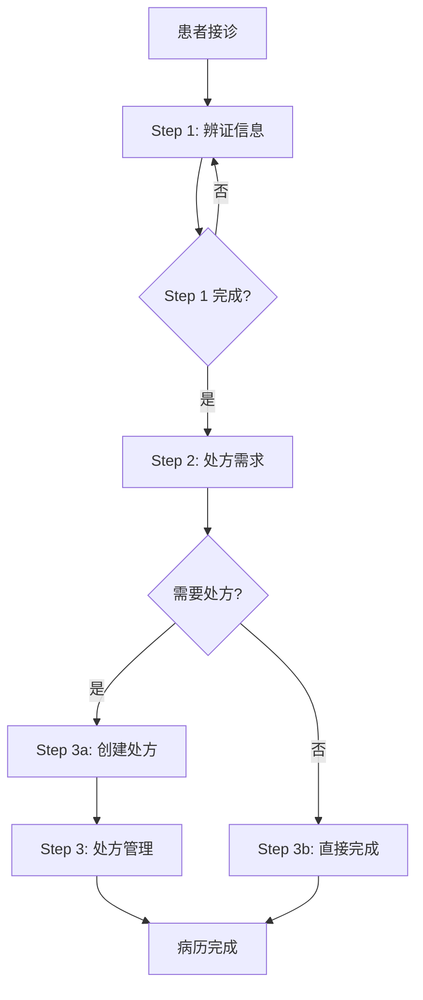
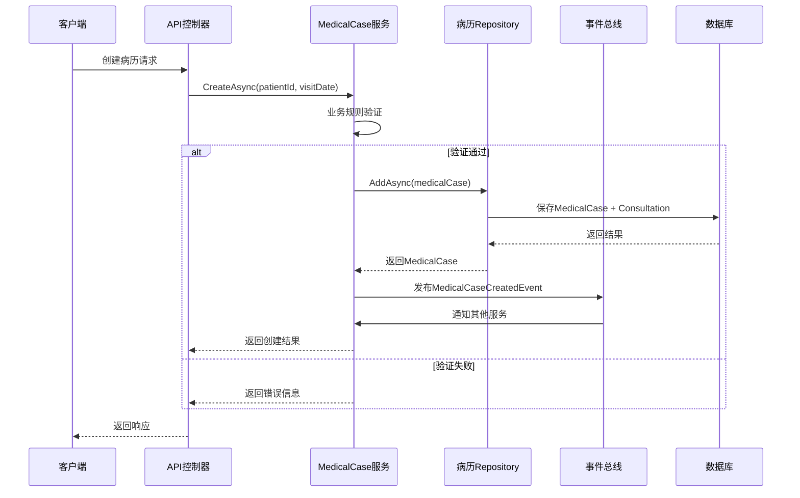

# 病历管理系统架构设计

> **深度理解**: 面向架构师和技术负责人，深入解析病历管理系统的设计理念和技术实现
> **目标读者**: 系统架构师、高级开发者、技术决策者
> **核心价值**: 理解系统设计思路、掌握架构演进方向、指导技术决策

## 🏗️ 架构设计理念

### 整体设计思想

病历管理系统作为LYBTZYZS中医诊所系统的业务核心，其架构设计遵循以下核心理念：

#### 1. 聚合根驱动设计 (Aggregate Root-Driven Design)

病历管理采用DDD（领域驱动设计）的聚合根模式，确保业务规则的一致性和数据的完整性：

```csharp
// 病历聚合根 - 统一管理整个诊疗过程
public class MedicalCase : AggregateRoot<Guid>, IAggregateRoot
{
    // 核心原则：一病案一诊断，一病案至多一处方
    private readonly List<DomainEvent> _domainEvents = new();

    // 聚合根 invariant：确保业务规则一致性
    public Result UpdateConsultation(ConsultationInputDto input, Guid currentUserId)
    {
        // 业务规则1: 只有Active状态可编辑
        if (Status != MedicalCaseStatus.Active)
            return Result.Failure("只有Active状态的病历可编辑");

        // 业务规则2: 创建者权限验证
        if (!CanEdit(currentUserId))
            return Result.Failure("无权限编辑此病历");

        // 业务规则3: 通过聚合根操作子实体
        Consultation.UpdateFrom(input);
        Consultation.MarkStep1Completed();

        // 发布领域事件
        AddDomainEvent(new ConsultationUpdatedEvent(Id, Consultation.Id));

        return Result.Success();
    }

    public void AddDomainEvent(DomainEvent @event)
    {
        _domainEvents.Add(@event);
    }

    public IReadOnlyCollection<DomainEvent> GetDomainEvents() => _domainEvents.AsReadOnly();
}
```

**聚合根优势**:
- **业务规则封装**: 核心业务逻辑封装在聚合根内部
- **一致性保证**: 通过聚合根统一管理，避免数据不一致
- **事务边界**: 聚合根作为事务边界，确保原子性操作
- **领域事件**: 支持事件驱动架构，松耦合系统集成

#### 2. 三步流程驱动架构 (Three-Step Process-Driven Architecture)

系统采用标准化的中医诊疗三步流程，通过流程控制确保医疗质量：



**流程控制实现**:
```csharp
public class MedicalCaseProcessController
{
    // 流程状态管理器
    private readonly IProcessStateManager _stateManager;

    public async Task<ProcessResult> ExecuteStepAsync(
        Guid medicalCaseId,
        ProcessStep step,
        object stepData,
        Guid currentUserId)
    {
        // 1. 获取当前流程状态
        var currentState = await _stateManager.GetCurrentStateAsync(medicalCaseId);

        // 2. 验证流程顺序
        if (!IsValidStepTransition(currentState, step))
        {
            return ProcessResult.Failure($"无法从{currentState}执行{step}");
        }

        // 3. 执行具体步骤
        var result = step switch
        {
            ProcessStep.Consultation => await ExecuteConsultationStepAsync(medicalCaseId, stepData, currentUserId),
            ProcessStep.PrescriptionNeed => await ExecutePrescriptionNeedStepAsync(medicalCaseId, stepData, currentUserId),
            ProcessStep.Prescription => await ExecutePrescriptionStepAsync(medicalCaseId, stepData, currentUserId),
            _ => throw new NotSupportedException($"不支持的流程步骤: {step}")
        };

        // 4. 更新流程状态
        if (result.IsSuccess)
        {
            await _stateManager.UpdateStepCompletionAsync(medicalCaseId, step, DateTime.Now);
        }

        return result;
    }

    private bool IsValidStepTransition(MedicalCaseProcessState currentState, ProcessStep targetStep)
    {
        return targetStep switch
        {
            ProcessStep.Consultation => currentState.Step1CompletedAt == null,
            ProcessStep.PrescriptionNeed => currentState.Step1CompletedAt.HasValue && currentState.Step2CompletedAt == null,
            ProcessStep.Prescription => currentState.Step2CompletedAt == true,
            _ => false
        };
    }
}
```

#### 3. 事件驱动架构 (Event-Driven Architecture)

系统采用事件驱动架构，通过领域事件实现松耦合的业务集成：

```csharp
// 领域事件基类
public abstract class DomainEvent
{
    public Guid Id { get; } = Guid.NewGuid();
    public DateTime OccurredAt { get; } = DateTime.Now;
    public string EventType { get; }
    public Guid AggregateId { get; }
    public int Version { get; protected set; }
}

// 具体领域事件
public class ConsultationCompletedEvent : DomainEvent
{
    public Guid MedicalCaseId { get; }
    public Guid ConsultationId { get; }
    public Guid DoctorId { get; }
    public string TcmDiagnosis { get; }

    public ConsultationCompletedEvent(Guid medicalCaseId, Guid consultationId,
        Guid doctorId, string tcmDiagnosis)
    {
        EventType = nameof(ConsultationCompletedEvent);
        AggregateId = medicalCaseId;
        MedicalCaseId = medicalCaseId;
        ConsultationId = consultationId;
        DoctorId = doctorId;
        TcmDiagnosis = tcmDiagnosis;
    }
}

// 事件处理器
public class ConsultationCompletedEventHandler : IDomainEventHandler<ConsultationCompletedEvent>
{
    private readonly IAnalyticsService _analyticsService;
    private readonly INotificationService _notificationService;
    private readonly ICacheService _cacheService;

    public async Task HandleAsync(ConsultationCompletedEvent @event)
    {
        // 1. 更新统计数据
        await _analyticsService.RecordDiagnosisAsync(@event.TcmDiagnosis);

        // 2. 发送通知（如果需要）
        if (ShouldSendNotification(@event))
        {
            await _notificationService.NotifyConsultationCompletedAsync(@event);
        }

        // 3. 清除相关缓存
        await _cacheService.InvalidateMedicalCaseCacheAsync(@event.MedicalCaseId);

        // 4. 记录审计日志
        await LogConsultationCompletionAsync(@event);
    }
}
```

## 🔧 核心组件架构

### 1. 数据访问层架构

#### Repository模式实现

```csharp
// 通用Repository接口
public interface IRepository<T> where T : class
{
    Task<T?> GetByIdAsync(Guid id);
    Task<IReadOnlyList<T>> GetAllAsync();
    Task<T> AddAsync(T entity);
    Task<T> UpdateAsync(T entity);
    Task<bool> DeleteAsync(Guid id);
}

// 病历专用Repository接口
public interface IMedicalCaseRepository : IRepository<MedicalCaseEntity>
{
    Task<MedicalCaseEntity?> GetByIdWithDetailsAsync(Guid id);
    Task<PagedResult<MedicalCaseEntity>> GetPagedWithDetailsAsync(int page, int pageSize);
    Task<IReadOnlyList<MedicalCaseEntity>> GetByPatientIdAsync(Guid patientId);
    Task<IReadOnlyList<MedicalCaseEntity>> GetByDoctorIdAsync(Guid doctorId);
    Task<MedicalCaseEntity?> GetUnfinishedCaseByPatientIdAsync(Guid patientId);
    Task<IReadOnlyList<MedicalCaseEntity>> GetByDateRangeAsync(DateTime startDate, DateTime endDate);
}

// Repository实现
public class MedicalCaseRepository : Repository<MedicalCaseEntity>, IMedicalCaseRepository
{
    private readonly ApplicationDbContext _context;

    public MedicalCaseRepository(ApplicationDbContext context) : base(context)
    {
        _context = context;
    }

    public async Task<MedicalCaseEntity?> GetByIdWithDetailsAsync(Guid id)
    {
        return await _context.MedicalCases
            .Include(m => m.Consultation)
            .Include(m => m.Prescription)
                .ThenInclude(p => p.Details)
            .FirstOrDefaultAsync(m => m.Id == id && !m.IsDeleted);
    }

    public async Task<PagedResult<MedicalCaseEntity>> GetPagedWithDetailsAsync(int page, int pageSize)
    {
        var query = _context.MedicalCases
            .Include(m => m.Consultation)
            .Include(m => m.Prescription)
            .Where(m => !m.IsDeleted)
            .OrderByDescending(m => m.ConsultationDate);

        var totalCount = await query.CountAsync();
        var items = await query
            .Skip((page - 1) * pageSize)
            .Take(pageSize)
            .ToListAsync();

        return new PagedResult<MedicalCaseEntity>(items, totalCount, page, pageSize);
    }

    // 性能优化：使用投影减少数据传输
    public async Task<IReadOnlyList<MedicalCaseListDto>> GetListWithProjectionAsync(
        MedicalCaseSearchCriteria criteria)
    {
        var query = _context.MedicalCases
            .Where(m => !m.IsDeleted)
            .AsNoTracking();

        // 应用过滤条件
        query = ApplyFilters(query, criteria);

        // 使用投影
        return await query
            .Select(m => new MedicalCaseListDto
            {
                Id = m.Id,
                PatientId = m.PatientId,
                PatientName = m.PatientName,
                DoctorId = m.DoctorId,
                DoctorName = m.DoctorName,
                ConsultationDate = m.ConsultationDate,
                Status = m.Status,
                ChiefComplaint = m.Consultation != null ? m.Consultation.ChiefComplaint : null,
                TcmDiagnosis = m.Consultation != null ? m.Consultation.TcmDiagnosis : null,
                HasPrescription = m.Prescription != null,
                IsPrinted = m.Prescription != null && m.Prescription.IsPrinted,
                CreatedAt = m.CreatedAt,
                CompletedAt = m.Consultation != null ? m.Consultation.Step3CompletedAt : null
            })
            .OrderByDescending(m => m.ConsultationDate)
            .ToListAsync();
    }
}
```

#### 缓存策略实现

```csharp
public class MedicalCaseCacheService : IMedicalCaseCacheService
{
    private readonly IMemoryCache _localCache;
    private readonly IDistributedCache _distributedCache;
    private readonly IMedicalCaseRepository _repository;

    // 多级缓存策略
    public async Task<MedicalCaseDto?> GetAsync(Guid id)
    {
        var cacheKey = $"medical_case:{id}";

        // Level 1: 本地内存缓存 (最快)
        if (_localCache.TryGetValue(cacheKey, out MedicalCaseDto cachedValue))
        {
            return cachedValue;
        }

        // Level 2: 分布式缓存 (Redis)
        var distributedValue = await _distributedCache.GetStringAsync(cacheKey);
        if (distributedValue != null)
        {
            var medicalCase = JsonSerializer.Deserialize<MedicalCaseDto>(distributedValue);

            // 回填本地缓存
            _localCache.Set(cacheKey, medicalCase, TimeSpan.FromMinutes(5));

            return medicalCase;
        }

        // Level 3: 数据库查询
        var entity = await _repository.GetByIdWithDetailsAsync(id);
        if (entity == null) return null;

        var dto = _mapper.Map<MedicalCaseDto>(entity);

        // 设置多级缓存
        await SetAsync(id, dto);

        return dto;
    }

    public async Task SetAsync(Guid id, MedicalCaseDto dto)
    {
        var cacheKey = $"medical_case:{id}";
        var serialized = JsonSerializer.Serialize(dto);

        // 分布式缓存（较长有效期）
        await _distributedCache.SetStringAsync(
            cacheKey,
            serialized,
            new DistributedCacheEntryOptions
            {
                AbsoluteExpirationRelativeToNow = TimeSpan.FromMinutes(30)
            });

        // 本地缓存（较短有效期）
        _localCache.Set(cacheKey, dto, TimeSpan.FromMinutes(5));
    }

    // 智能缓存失效
    public async Task InvalidateAsync(Guid id)
    {
        var cacheKey = $"medical_case:{id}";

        // 清除所有缓存层
        _localCache.Remove(cacheKey);
        await _distributedCache.RemoveAsync(cacheKey);

        // 发布缓存失效事件
        await _eventBus.PublishAsync(new MedicalCaseCacheInvalidatedEvent(id));
    }

    // 批量缓存操作
    public async Task InvalidateMultipleAsync(IEnumerable<Guid> ids)
    {
        var tasks = ids.Select(InvalidateAsync);
        await Task.WhenAll(tasks);
    }
}
```

### 2. 业务服务层架构

#### 服务接口设计

```csharp
// 病历服务接口
public interface IMedicalCaseService : IService<MedicalCaseEntity>
{
    // Write Layer - 通过聚合根操作
    Task<MedicalCaseEntity?> CreateAsync(Guid patientId, DateTime visitDate);
    Task<MedicalCaseEntity?> UpdateConsultationAsync(Guid medicalCaseId,
        ConsultationInputDto request, Guid currentUserId, bool isAdmin = false);
    Task<MedicalCaseEntity?> SetPrescriptionFlagAsync(Guid medicalCaseId,
        bool needsPrescription, Guid currentUserId, bool isAdmin = false);
    Task<PrescriptionEntity?> CreatePrescriptionAsync(Guid medicalCaseId,
        PrescriptionCreateDto request);
    Task<PrescriptionEntity?> UpdatePrescriptionAsync(Guid medicalCaseId,
        Guid prescriptionId, PrescriptionEditDto request, Guid currentUserId, bool isAdmin = false);
    Task<bool> DeletePrescriptionAsync(Guid medicalCaseId, Guid prescriptionId,
        Guid currentUserId, bool isAdmin = false);
    Task<MedicalCaseEntity?> UpdateStatusAsync(Guid medicalCaseId, MedicalCaseStatus status);
    Task<MedicalCaseEntity?> CompleteAsync(Guid medicalCaseId);
    Task<bool> CloseCaseAsync(Guid id);

    // Read Layer - 独立查询操作
    Task<MedicalCaseEntity?> GetByIdAsync(Guid id);
    Task<PagedResult<MedicalCaseEntity>> GetListAsync(MedicalCaseStatus? status,
        Guid? patientId, int page, int pageSize);
    Task<List<ConsultationDto>> GetConsultationListAsync(Guid medicalCaseId);
    Task<List<MedicalCasePrescriptionDto>> GetPrescriptionListAsync(Guid medicalCaseId);
    Task<MedicalCaseEntity?> GetUnfinishedCaseByPatientIdAsync(Guid patientId);

    // Helper Layer - 辅助功能
    Task<CanEditResponse> CanEditAsync(Guid id);
    Task<CanDeleteResponse> CanDeletePrescriptionAsync(Guid medicalCaseId, Guid prescriptionId);
}
```

#### 服务实现架构

```csharp
public class MedicalCaseService : BaseService<MedicalCaseEntity>, IMedicalCaseService
{
    private readonly IMedicalCaseRepository _repository;
    private readonly IPrescriptionService _prescriptionService;
    private readonly IPermissionService _permissionService;
    private readonly IEventBus _eventBus;
    private readonly IMapper _mapper;

    public MedicalCaseService(
        IMedicalCaseRepository repository,
        IPrescriptionService prescriptionService,
        IPermissionService permissionService,
        IEventBus eventBus,
        IMapper mapper,
        ILogger<MedicalCaseService> logger)
        : base(logger)
    {
        _repository = repository;
        _prescriptionService = prescriptionService;
        _permissionService = permissionService;
        _eventBus = eventBus;
        _mapper = mapper;
    }

    // 统一权限验证
    protected async Task<PermissionResult> ValidateEditPermissionAsync(
        Guid medicalCaseId, Guid currentUserId, bool isAdmin)
    {
        var medicalCase = await _repository.GetByIdAsync(medicalCaseId);
        if (medicalCase == null)
        {
            return new PermissionResult { IsAuthorized = false, ErrorMessage = "病历不存在" };
        }

        return await _permissionService.ValidateMedicalCaseEditPermissionAsync(
            medicalCase, currentUserId, isAdmin);
    }

    // 统一更新方法 - Phase 2 Task 2.3 统一更新方法
    public async Task<MedicalCaseEntity?> UpdateMedicalCaseAsync(
        Guid id,
        UpdateMedicalCaseRequest request,
        Guid currentUserId,
        bool isAdmin = false)
    {
        using var transaction = await _repository.BeginTransactionAsync();

        try
        {
            // 1. 获取聚合根
            var medicalCase = await _repository.GetByIdWithDetailsAsync(id);
            if (medicalCase == null)
                return null;

            // 2. 权限验证
            var permissionResult = await ValidateEditPermissionAsync(id, currentUserId, isAdmin);
            if (!permissionResult.IsAuthorized)
                throw new UnauthorizedAccessException(permissionResult.ErrorMessage);

            // 3. 模式验证
            if (request.Mode == UpdateMode.ValidateOnly)
                return medicalCase;

            // 4. 执行更新
            var hasUpdates = false;

            if (request.Consultation != null)
            {
                await UpdateConsultationInternalAsync(medicalCase, request.Consultation);
                hasUpdates = true;
            }

            if (request.NeedsPrescription.HasValue)
            {
                await SetPrescriptionFlagInternalAsync(medicalCase, request.NeedsPrescription.Value);
                hasUpdates = true;
            }

            if (request.CreatePrescription != null)
            {
                await CreatePrescriptionInternalAsync(medicalCase, request.CreatePrescription);
                hasUpdates = true;
            }

            if (hasUpdates)
            {
                medicalCase.UpdatedAt = DateTime.Now;
                await _repository.UpdateAsync(medicalCase);

                // 发布领域事件
                await _eventBus.PublishAsync(new MedicalCaseUpdatedEvent(medicalCase));
            }

            await transaction.CommitAsync();
            return medicalCase;
        }
        catch (Exception ex)
        {
            await transaction.RollbackAsync();
            _logger.LogError(ex, "更新病历失败: {MedicalCaseId}", id);
            throw;
        }
    }

    private async Task UpdateConsultationInternalAsync(
        MedicalCaseEntity medicalCase,
        ConsultationInputDto consultationDto)
    {
        if (medicalCase.Consultation == null)
            throw new InvalidOperationException("辨证记录不存在");

        _mapper.Map(consultationDto, medicalCase.Consultation);
        medicalCase.Consultation.UpdatedAt = DateTime.Now;

        // 标记Step 1完成
        if (medicalCase.Consultation.Step1CompletedAt == null)
        {
            medicalCase.Consultation.Step1CompletedAt = DateTime.Now;
        }
    }
}
```

### 3. 权限控制架构

#### RBAC权限模型

```csharp
// 权限控制接口
public interface IPermissionService
{
    Task<PermissionResult> ValidateMedicalCaseEditPermissionAsync(
        MedicalCaseEntity medicalCase, Guid userId, bool isAdmin);
    Task<PermissionResult> ValidatePrescriptionEditPermissionAsync(
        PrescriptionEntity prescription, Guid userId, bool isAdmin);
    Task<bool> HasPermissionAsync(Guid userId, string permission);
}

// 权限控制实现
public class PermissionService : IPermissionService
{
    private readonly IUserRepository _userRepository;
    private readonly IRoleRepository _roleRepository;
    private readonly ILogger<PermissionService> _logger;

    public async Task<PermissionResult> ValidateMedicalCaseEditPermissionAsync(
        MedicalCaseEntity medicalCase, Guid userId, bool isAdmin)
    {
        // 规则1: 管理员特权
        if (isAdmin)
        {
            _logger.LogDebug("管理员权限验证通过: UserId={UserId}, MedicalCaseId={MedicalCaseId}",
                userId, medicalCase.Id);
            return new PermissionResult { IsAuthorized = true, PermissionLevel = "Admin" };
        }

        // 规则2: 创建者当天可编辑
        var isCreator = medicalCase.DoctorId == userId;
        var isSameDay = medicalCase.CreatedAt.Date == DateTime.Today;

        if (!isCreator)
        {
            return new PermissionResult
            {
                IsAuthorized = false,
                ErrorMessage = "只能编辑自己创建的病历",
                ErrorCode = "NOT_CREATOR"
            };
        }

        if (!isSameDay)
        {
            return new PermissionResult
            {
                IsAuthorized = false,
                ErrorMessage = "只能编辑当天创建的病历",
                ErrorCode = "NOT_SAME_DAY",
                AdditionalInfo = new
                {
                    CreatedDate = medicalCase.CreatedAt.Date,
                    CurrentDate = DateTime.Today,
                    Rule = "当天可改原则"
                }
            };
        }

        // 规则3: 病历状态检查
        if (medicalCase.Status != MedicalCaseStatus.Active)
        {
            return new PermissionResult
            {
                IsAuthorized = false,
                ErrorMessage = $"病历状态为{medicalCase.Status}，不允许编辑",
                ErrorCode = "INVALID_STATUS"
            };
        }

        return new PermissionResult { IsAuthorized = true, PermissionLevel = "Creator" };
    }
}
```

#### 权限装饰器

```csharp
// 权限验证装饰器
public class PermissionValidationDecorator<T> where T : class
{
    private readonly T _innerService;
    private readonly IPermissionService _permissionService;

    public PermissionValidationDecorator(T innerService, IPermissionService permissionService)
    {
        _innerService = innerService;
        _permissionService = permissionService;
    }

    public async Task<TResult> ExecuteWithPermissionAsync<TResult>(
        Func<T, Task<TResult>> operation,
        Guid medicalCaseId,
        Guid userId,
        bool isAdmin = false)
    {
        // 1. 权限验证
        var permissionResult = await _permissionService
            .ValidateMedicalCaseEditPermissionAsync(medicalCaseId, userId, isAdmin);

        if (!permissionResult.IsAuthorized)
        {
            throw new UnauthorizedAccessException(permissionResult.ErrorMessage);
        }

        // 2. 记录审计日志
        await LogPermissionUsageAsync(medicalCaseId, userId, permissionResult.PermissionLevel);

        // 3. 执行操作
        return await operation(_innerService);
    }

    private async Task LogPermissionUsageAsync(Guid medicalCaseId, Guid userId, string permissionLevel)
    {
        _logger.LogInformation("权限验证通过 - MedicalCaseId: {MedicalCaseId}, UserId: {UserId}, Level: {Level}",
            medicalCaseId, userId, permissionLevel);

        // 可以添加审计日志记录
    }
}
```

## 🔄 数据流架构

### 1. 病历创建数据流



**数据流特点**:
- **事务一致性**: MedicalCase和Consultation在同一事务中保存
- **事件驱动**: 创建成功后发布领域事件
- **异常处理**: 完整的错误处理和回滚机制
- **性能优化**: 批量操作减少数据库往返

### 2. 查询数据流架构

```csharp
public class MedicalCaseQueryService : IMedicalCaseQueryService
{
    private readonly IMedicalCaseRepository _repository;
    private readonly IMedicalCaseCacheService _cacheService;
    private readonly IPermissionService _permissionService;

    public async Task<PagedResult<MedicalCaseDto>> GetMedicalCasesAsync(
        MedicalCaseSearchCriteria criteria,
        Guid userId,
        bool isAdmin = false)
    {
        // 1. 权限过滤
        criteria = await ApplyPermissionFilterAsync(criteria, userId, isAdmin);

        // 2. 缓存检查
        var cacheKey = GenerateCacheKey(criteria, userId);
        var cachedResult = await _cacheService.GetAsync<PagedResult<MedicalCaseDto>>(cacheKey);
        if (cachedResult != null)
            return cachedResult;

        // 3. 数据库查询
        var result = await _repository.GetListWithProjectionAsync(criteria);

        // 4. 数据脱敏
        var maskedResult = await ApplyDataMaskingAsync(result, userId, isAdmin);

        // 5. 缓存结果
        await _cacheService.SetAsync(cacheKey, maskedResult, TimeSpan.FromMinutes(15));

        return maskedResult;
    }

    private async Task<MedicalCaseSearchCriteria> ApplyPermissionFilterAsync(
        MedicalCaseSearchCriteria criteria, Guid userId, bool isAdmin)
    {
        if (isAdmin) return criteria;

        // 非管理员只能查看自己创建的病历
        criteria.DoctorId = userId;
        return criteria;
    }

    private async Task<PagedResult<MedicalCaseDto>> ApplyDataMaskingAsync(
        PagedResult<MedicalCaseDto> result, Guid userId, bool isAdmin)
    {
        if (isAdmin) return result;

        foreach (var item in result.Items)
        {
            // 脱敏敏感信息
            item = await _dataMaskingService.MedicalCaseDataMasking(item, userId);
        }

        return result;
    }
}
```

## 📊 性能优化策略

### 1. 数据库优化

#### 索引策略设计

```sql
-- 核心索引设计
CREATE INDEX IX_MedicalCases_PatientId ON MedicalCases(PatientId, CreatedAt DESC) INCLUDE (Status, DoctorId);
CREATE INDEX IX_MedicalCases_DoctorId ON MedicalCases(DoctorId, ConsultationDate DESC) INCLUDE (PatientId, Status);
CREATE INDEX IX_MedicalCases_Status_Date ON MedicalCases(Status, ConsultationDate DESC) INCLUDE (PatientId, DoctorId);

-- 全文搜索索引（支持中医术语搜索）
CREATE FULLTEXT INDEX FT_MedicalCases_Search ON MedicalCases(PatientName)
    WITH (STOPLIST = 'chinese', LANGUAGE = 'Chinese');

-- 分区表策略（按年分区）
CREATE TABLE MedicalCases_2024 (
    -- 字段定义与MedicalCases相同
) ON PARTITIONSCHEME_MedicalCases(2024);

-- 复合索引（优化常用查询组合）
CREATE INDEX IX_MedicalCases_Patient_Status_Date
    ON MedicalCases(PatientId, Status, ConsultationDate DESC)
    INCLUDE (DoctorId, NeedsPrescription);
```

#### 查询优化实现

```csharp
public class MedicalCaseQueryOptimizer
{
    // 查询优化器
    public IQueryable<MedicalCaseEntity> OptimizeQuery(
        IQueryable<MedicalCaseEntity> query,
        MedicalCaseSearchCriteria criteria)
    {
        // 1. 优先使用SARGable查询条件
        if (criteria.StartDate.HasValue)
        {
            query = query.Where(m => m.ConsultationDate >= criteria.StartDate.Value);
        }

        if (criteria.EndDate.HasValue)
        {
            query = query.Where(m => m.ConsultationDate <= criteria.EndDate.Value);
        }

        // 2. 状态过滤（使用索引）
        if (criteria.Status.HasValue)
        {
            query = query.Where(m => m.Status == criteria.Status.Value);
        }

        // 3. 用户权限过滤（使用索引）
        if (!criteria.IsAdmin && criteria.CurrentUserId.HasValue)
        {
            query = query.Where(m => m.DoctorId == criteria.CurrentUserId.Value);
        }

        // 4. 关键词搜索（最后执行，成本较高）
        if (!string.IsNullOrEmpty(criteria.Keyword))
        {
            query = query.Where(m =>
                EF.Functions.FreeText(m.PatientName, criteria.Keyword) ||
                (m.Consultation != null && EF.Functions.FreeText(
                    new[] { m.Consultation.ChiefComplaint, m.Consultation.TcmDiagnosis },
                    criteria.Keyword)));
        }

        return query;
    }

    // 投影优化 - 只查询需要的字段
    public IQueryable<MedicalCaseListDto> GetOptimizedProjection(
        IQueryable<MedicalCaseEntity> query)
    {
        return query.AsNoTracking()
            .Select(m => new MedicalCaseListDto
            {
                Id = m.Id,
                PatientId = m.PatientId,
                PatientName = m.PatientName,
                DoctorId = m.DoctorId,
                DoctorName = m.DoctorName,
                ConsultationDate = m.ConsultationDate,
                Status = m.Status,
                // 只投影必要的关联数据
                ChiefComplaint = m.Consultation != null ? m.Consultation.ChiefComplaint : null,
                TcmDiagnosis = m.Consultation != null ? m.Consultation.TcmDiagnosis : null,
                HasPrescription = m.Prescription != null,
                CreatedAt = m.CreatedAt
            });
    }
}
```

### 2. 缓存架构

#### 分层缓存设计

```csharp
public class CacheArchitecture
{
    // L1: 本地内存缓存 (最快，但容量小)
    private readonly IMemoryCache _localCache;

    // L2: 分布式缓存 (中等速度，容量大)
    private readonly IDistributedCache _distributedCache;

    // L3: 数据库查询 (最慢，但数据最新)
    private readonly IMedicalCaseRepository _repository;

    public async Task<T?> GetAsync<T>(string key, Func<Task<T>> dataLoader)
        where T : class
    {
        // L1: 本地缓存检查
        if (_localCache.TryGetValue(key, out T localResult))
        {
            return localResult;
        }

        // L2: 分布式缓存检查
        var distributedData = await _distributedCache.GetStringAsync(key);
        if (distributedData != null)
        {
            var result = JsonSerializer.Deserialize<T>(distributedData);

            // 回填L1缓存（短时间）
            _localCache.Set(key, result, TimeSpan.FromMinutes(5));

            return result;
        }

        // L3: 数据库查询
        var dbResult = await dataLoader();
        if (dbResult != null)
        {
            // 设置L2缓存（中等时间）
            var serialized = JsonSerializer.Serialize(dbResult);
            await _distributedCache.SetStringAsync(
                key,
                serialized,
                new DistributedCacheEntryOptions
                {
                    AbsoluteExpirationRelativeToNow = GetCacheDuration<T>()
                });

            // 设置L1缓存（短时间）
            _localCache.Set(key, dbResult, TimeSpan.FromMinutes(2));
        }

        return dbResult;
    }

    private TimeSpan GetCacheDuration<T>()
    {
        return typeof(T) switch
        {
            // 病历详情 - 中等缓存时间
            _ when typeof(T) == typeof(MedicalCaseDto) => TimeSpan.FromMinutes(30),

            // 统计数据 - 长缓存时间
            _ when typeof(T) == typeof(MedicalCaseAnalyticsDto) => TimeSpan.FromHours(2),

            // 列表数据 - 短缓存时间
            _ when typeof(T) == typeof(PagedResult<MedicalCaseDto>) => TimeSpan.FromMinutes(10),

            // 默认 - 短缓存时间
            _ => TimeSpan.FromMinutes(5)
        };
    }
}
```

### 3. 异步处理架构

#### 后台任务队列

```csharp
public class MedicalCaseBackgroundProcessor : IBackgroundTaskProcessor
{
    private readonly IBackgroundJobQueue _jobQueue;
    private readonly IServiceScopeFactory _scopeFactory;

    public async Task ProcessMedicalCaseAnalyticsAsync(
        AnalyticsRequest request)
    {
        // 创建后台任务
        var job = new BackgroundJob
        {
            Id = Guid.NewGuid(),
            Type = "MedicalCaseAnalytics",
            Data = request,
            Priority = JobPriority.Low,
            CreatedAt = DateTime.Now
        };

        await _jobQueue.EnqueueAsync(job);
    }

    public async Task ProcessJobAsync(BackgroundJob job)
    {
        using var scope = _scopeFactory.CreateScope();
        var analyticsService = scope.ServiceProvider.GetRequiredService<IMedicalCaseAnalyticsService>();

        switch (job.Type)
        {
            case "MedicalCaseAnalytics":
                var request = (AnalyticsRequest)job.Data;
                await analyticsService.GenerateAnalyticsAsync(request);
                break;

            case "PrescriptionPrint":
                var printRequest = (PrintRequest)job.Data;
                await ProcessPrintRequestAsync(printRequest);
                break;
        }
    }

    private async Task ProcessPrintRequestAsync(PrintRequest request)
    {
        // 生成PDF
        var pdfBytes = await _pdfGenerator.GeneratePrescriptionPdfAsync(request.PrescriptionId);

        // 保存到文件存储
        var fileName = $"prescription_{request.PrescriptionId}_{DateTime.Now:yyyyMMddHHmmss}.pdf";
        var filePath = await _fileStorage.SaveAsync(fileName, pdfBytes);

        // 通知用户
        await _notificationService.NotifyPrintCompletedAsync(request.UserId, filePath);
    }
}
```

## 🔮 架构演进规划

### 近期优化 (3-6个月)

1. **微服务拆分**
   - MedicalCase服务独立部署
   - Consultation专业化服务
   - Prescription独立服务

2. **事件驱动架构**
   - 完善领域事件系统
   - 引入EventStore
   - 实现CQRS模式

3. **性能优化**
   - 读写分离架构
   - 专用查询数据库
   - 实时统计预计算

### 中期规划 (6-12个月)

1. **分布式架构**
   - 多数据中心部署
   - 数据同步机制
   - 灾难恢复方案

2. **AI能力集成**
   - 中医智能诊断辅助
   - 处方自动推荐
   - 疗效预测分析

3. **API网关优化**
   - 统一认证授权
   - 请求限流熔断
   - API版本管理

### 长期愿景 (1-2年)

1. **云原生架构**
   - Kubernetes容器编排
   - 服务网格治理
   - 自动扩缩容

2. **大数据分析**
   - 机器学习模型训练
   - 流式数据处理
   - 实时数据可视化

3. **标准化平台**
   - 中医标准化知识库
   - 跨机构数据交换
   - 行业标准制定

## 📋 架构质量标准

### 设计原则

| 原则 | 说明 | 实现方式 |
|------|------|----------|
| 单一职责 | 每个类只有一个变化的原因 | 服务分层、模块化设计 |
| 开闭原则 | 对扩展开放，对修改封闭 | 接口抽象、策略模式 |
| 依赖倒置 | 高层模块不依赖低层模块 | 依赖注入、接口编程 |
| 接口隔离 | 客户端不应依赖不需要的接口 | 细粒度接口设计 |

### 性能指标

| 指标类型 | 目标值 | 监控方式 |
|---------|-------|----------|
| 查询响应时间 | < 300ms | APM监控 |
| 创建病历时间 | < 500ms | 性能测试 |
| 并发用户数 | > 1000 | 压力测试 |
| 系统可用性 | > 99.9% | 健康检查 |
| 数据一致性 | 100% | 事务监控 |

### 安全指标

| 安全维度 | 要求 | 实现方式 |
|---------|------|----------|
| 身份认证 | JWT + 多因素 | 认证服务 |
| 权限控制 | RBAC + ABAC | 权限系统 |
| 数据加密 | AES-256 | 加密服务 |
| 审计日志 | 100%覆盖 | 日志系统 |
| 数据脱敏 | 字段级控制 | 脱敏服务 |

---

**文档类型**: Architecture Explanation
**复杂度**: 高级
**更新时间**: 2025-11-22
**相关资源**: [病历管理教程](../../../tutorials/modules/medicalcase/medical-case-management-tutorial.md) | [API参考文档](../../../reference/api/medical-case.md) | [问题解决指南](../../../how-to-guides/modules/medicalcase/medical-case-management-issues.md)