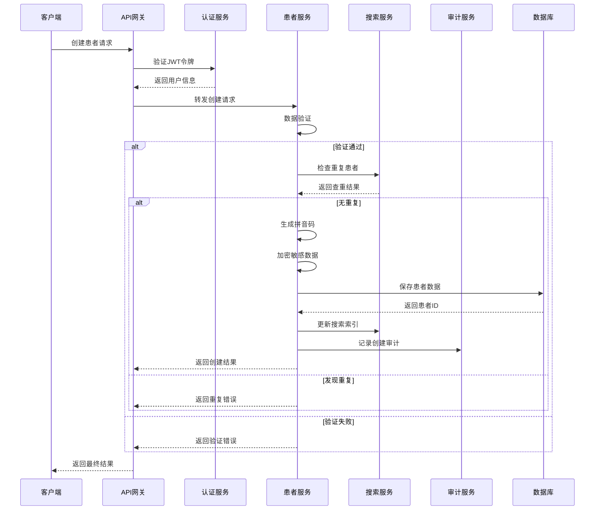
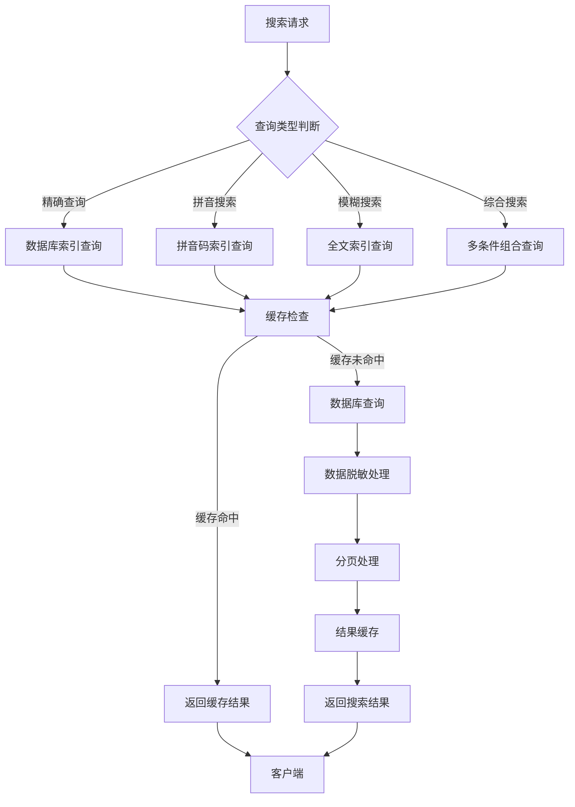

# 患者管理系统架构设计

> **深度理解**: 面向架构师和技术负责人，深入解析患者管理系统的设计理念和技术实现
> **目标读者**: 系统架构师、高级开发者、技术决策者
> **核心价值**: 理解系统设计思路、掌握架构演进方向、指导技术决策

## 🏗️ 架构设计理念

### 整体设计思想

患者管理系统作为LYBTZYZS中医诊所系统的核心模块，其架构设计遵循以下核心理念：

#### 1. 数据安全第一 (Security First)
在医疗信息系统中，患者数据的安全性和隐私保护是最高优先级。我们从架构层面设计了多层安全防护：

```
┌─────────────────────────────────────────────────────────────┐
│                    访问控制层 (Access Control)               │
│  • 基于角色的访问控制 (RBAC)                                  │
│  • JWT令牌认证                                               │
│  • API权限验证                                               │
└─────────────────────────────────────────────────────────────┘
┌─────────────────────────────────────────────────────────────┐
│                    数据脱敏层 (Data Masking)                 │
│  • 字段级数据脱敏                                             │
│  • 动态权限适配                                               │
│  • 审计日志记录                                               │
└─────────────────────────────────────────────────────────────┘
┌─────────────────────────────────────────────────────────────┐
│                    数据加密层 (Data Encryption)              │
│  • 敏感字段加密存储                                           │
│  • 传输加密 (HTTPS)                                          │
│  • 密钥轮换机制                                               │
└─────────────────────────────────────────────────────────────┘
┌─────────────────────────────────────────────────────────────┐
│                    存储层 (Secure Storage)                   │
│  • 数据库访问控制                                             │
│  • 备份加密                                                   │
│  • 数据完整性校验                                             │
└─────────────────────────────────────────────────────────────┘
```

**架构优势**:
- **多层防护**: 即使某一层被突破，其他层仍能提供保护
- **最小权限**: 每个角色只能访问必要的数据
- **可审计性**: 所有数据访问都有完整日志记录
- **合规性**: 符合HIPAA等医疗数据保护标准

#### 2. 性能导向设计 (Performance-Oriented)
针对患者管理的高频访问场景，设计了多级性能优化策略：

```csharp
// 性能优化架构设计
public class PatientArchitecture
{
    // 1. 多级缓存策略
    private readonly IMemoryCache _localCache;      // 应用内缓存
    private readonly IDistributedCache _redisCache; // 分布式缓存
    private readonly ISearchIndex _searchIndex;     // 搜索索引缓存

    // 2. 数据库优化
    // 2.1 索引策略
    // - 主键索引：Patient.Id (聚集索引)
    // - 查询索引：Name, PinYinCode, IdNumber (非聚集索引)
    // - 复合索引：Status + RegistrationDate
    // - 全文索引：Name + Address (用于模糊搜索)

    // 2.2 分区策略
    // - 按注册时间分区：2023年、2024年、2025年
    // - 按状态分区：正常、停诊、已故

    // 3. 异步处理
    // - 非实时操作异步化（如拼音码生成）
    // - 批量操作队列化
    // - 数据导出后台处理
}
```

#### 3. 可扩展性设计 (Scalability First)
架构设计支持系统从小型诊所到大型连锁机构的平滑扩展：

```
┌─────────────────────────────────────────────────────────────┐
│                    应用层 (Application Layer)               │
│  • 无状态设计                                                 │
│  • 水平扩展支持                                               │
│  • 负载均衡                                                   │
└─────────────────────────────────────────────────────────────┘
┌─────────────────────────────────────────────────────────────┐
│                    服务层 (Service Layer)                   │
│  • 微服务架构                                                 │
│  • 服务发现                                                   │
│  • 熔断降级                                                   │
└─────────────────────────────────────────────────────────────┘
┌─────────────────────────────────────────────────────────────┐
│                    数据层 (Data Layer)                       │
│  • 读写分离                                                   │
│  • 分库分表                                                   │
│  • 数据同步                                                   │
└─────────────────────────────────────────────────────────────┘
```

## 🔧 核心组件架构

### 1. 患者实体模型架构

患者实体模型采用了**领域驱动设计 (DDD)** 的思想，将复杂的患者信息进行合理拆分：

```csharp
// 核心患者实体
public class Patient : AggregateRoot<Guid>
{
    // 身份信息
    private PatientIdentity _identity;

    // 联系信息
    private PatientContact _contact;

    // 健康信息
    private PatientHealthInfo _healthInfo;

    // 状态信息
    private PatientStatus _status;

    // 元数据
    private PatientMetadata _metadata;

    // 领域方法 - 封装业务逻辑
    public Result UpdateContactInfo(PatientContactDto dto)
    {
        // 业务规则验证
        if (!IsValidPhoneNumber(dto.PhoneNumber))
            return Result.Failure("手机号格式错误");

        if (!IsValidEmail(dto.Email))
            return Result.Failure("邮箱格式错误");

        // 更新联系信息
        _contact.Update(dto);

        // 发布领域事件
        AddDomainEvent(new PatientContactUpdatedEvent(Id, _contact));

        return Result.Success();
    }

    public Result RegisterVisit(DateTime visitDate, Guid doctorId)
    {
        // 业务规则验证
        if (_status.IsInactive())
            return Result.Failure("患者状态不允许就诊");

        // 更新最后就诊时间
        _metadata.UpdateLastVisitDate(visitDate);

        // 发布领域事件
        AddDomainEvent(new PatientVisitRegisteredEvent(Id, visitDate, doctorId));

        return Result.Success();
    }
}
```

**设计优势**:
- **单一职责**: 每个子对象负责特定类型的信息
- **封装性**: 业务逻辑封装在实体内部，保证数据一致性
- **可扩展性**: 新增患者信息类型时，不影响现有结构
- **测试性**: 每个子对象可以独立测试

### 2. 搜索引擎架构

患者搜索是最高频的操作之一，我们设计了专门的高性能搜索引擎：

```csharp
// 搜索引擎架构
public class PatientSearchEngine
{
    private readonly ISearchIndex _searchIndex;
    private readonly IPinYinService _pinYinService;
    private readonly ICacheService _cacheService;

    public async Task<SearchResult<PatientDto>> SearchAsync(PatientSearchQuery query)
    {
        // 1. 查询优化 - 多级缓存
        var cacheKey = GenerateCacheKey(query);
        var cachedResult = await _cacheService.GetAsync<SearchResult<PatientDto>>(cacheKey);
        if (cachedResult != null)
            return cachedResult;

        // 2. 搜索策略 - 智能路由
        var searchStrategy = SelectSearchStrategy(query);
        var result = await searchStrategy.ExecuteAsync(query);

        // 3. 结果优化 - 分页和排序
        result = OptimizeSearchResult(result, query);

        // 4. 缓存结果
        await _cacheService.SetAsync(cacheKey, result, TimeSpan.FromMinutes(15));

        return result;
    }

    private ISearchStrategy SelectSearchStrategy(PatientSearchQuery query)
    {
        // 精确匹配策略
        if (IsExactMatchQuery(query))
            return new ExactMatchSearchStrategy();

        // 拼音搜索策略
        if (IsChineseNameQuery(query))
            return new PinYinSearchStrategy(_pinYinService);

        // 模糊搜索策略
        if (IsFuzzySearchQuery(query))
            return new FuzzySearchStrategy();

        // 综合搜索策略
        return new CompositeSearchStrategy();
    }
}

// 拼音搜索策略实现
public class PinYinSearchStrategy : ISearchStrategy
{
    private readonly IPinYinService _pinYinService;

    public async Task<SearchResult<PatientDto>> ExecuteAsync(PatientSearchQuery query)
    {
        var keywords = query.Keyword.Split(' ', StringSplitOptions.RemoveEmptyEntries);
        var searchTerms = new List<string>();

        foreach (var keyword in keywords)
        {
            // 生成多级拼音码
            var pinyinInfo = await _pinYinService.GeneratePinYinInfoAsync(keyword);
            searchTerms.Add(keyword);               // 原始中文
            searchTerms.Add(pinyinInfo.ShortCode);  // 简码 (如：zs)
            searchTerms.Add(pinyinInfo.FullCode);   // 全码 (如：zhangsan)
            searchTerms.Add(pinyinInfo.InitialCode); // 首字母码 (如：zs)
        }

        // 构建多条件查询
        var searchQuery = BuildMultiTermQuery(searchTerms);

        return await ExecuteSearchQuery(searchQuery);
    }
}
```

**搜索引擎特性**:
- **多级拼音码**: 支持简码、全码、首字母码搜索
- **智能纠错**: 支持拼音输入错误的模糊匹配
- **性能优化**: 多级缓存 + 索引优化
- **可扩展**: 插件化的搜索策略架构

### 3. 数据保护架构

数据保护是患者管理系统的核心关切点，我们设计了端到端的数据保护方案：

```csharp
// 数据保护服务架构
public class PatientDataProtectionService : IDataProtectionService
{
    private readonly IDataProtector _dataProtector;
    private readonly IAuditService _auditService;
    private readonly IPermissionService _permissionService;

    // 数据脱敏策略
    public PatientDto ApplyDataMasking(Patient patient, IUserContext user)
    {
        var maskingLevel = GetMaskingLevel(user.Role);
        var dto = _mapper.Map<PatientDto>(patient);

        // 动态脱敏 - 根据用户角色决定脱敏级别
        switch (maskingLevel)
        {
            case MaskingLevel.None: // 管理员 - 完整信息
                break;

            case MaskingLevel.Low: // 医生 - 基础脱敏
                dto.PhoneNumber = MaskPhoneNumber(patient.PhoneNumber, 4, 4);
                dto.Address = MaskAddress(patient.Address, 6, 6);
                break;

            case MaskingLevel.Medium: // 护士 - 中度脱敏
                dto.PhoneNumber = MaskPhoneNumber(patient.PhoneNumber, 3, 2);
                dto.Address = MaskAddress(patient.Address, 3, 3);
                break;

            case MaskingLevel.High: // 其他人员 - 高度脱敏
                dto.IdNumber = MaskIdNumber(patient.IdNumber, 6, 4);
                dto.PhoneNumber = MaskPhoneNumber(patient.PhoneNumber, 3, 4);
                dto.Address = "***";
                break;
        }

        // 记录数据访问审计
        _auditService.LogDataAccess(new DataAccessAudit
        {
            UserId = user.Id,
            PatientId = patient.Id,
            AccessLevel = maskingLevel,
            Timestamp = DateTime.UtcNow,
            IPAddress = user.IPAddress
        });

        return dto;
    }

    // 数据加密存储
    public async Task StoreSensitiveDataAsync(Patient patient)
    {
        // 加密敏感字段
        patient.IdNumber = _dataProtector.Protect(patient.IdNumber);
        patient.PhoneNumber = _dataProtector.Protect(patient.PhoneNumber);
        patient.Address = _dataProtector.Protect(patient.Address);

        await _repository.UpdateAsync(patient);
    }

    // 数据解密 - 仅限有权限的操作
    public async Task<Patient> DecryptSensitiveDataAsync(Guid patientId, IUserContext user)
    {
        // 权限验证
        if (!await _permissionService.HasPermissionAsync(user, Permission.ViewSensitiveData))
            throw new UnauthorizedAccessException("无权限查看敏感数据");

        var patient = await _repository.GetByIdAsync(patientId);

        // 解密敏感字段
        patient.IdNumber = _dataProtector.Unprotect(patient.IdNumber);
        patient.PhoneNumber = _dataProtector.Unprotect(patient.PhoneNumber);
        patient.Address = _dataProtector.Unprotect(patient.Address);

        // 记录敏感数据访问
        _auditService.LogSensitiveDataAccess(new SensitiveDataAccessAudit
        {
            UserId = user.Id,
            PatientId = patientId,
            AccessType = "Decrypt",
            Timestamp = DateTime.UtcNow,
            RequiresApproval = true
        });

        return patient;
    }
}
```

### 4. 批量处理架构

大批量数据处理是患者管理系统的常见需求，我们设计了高效的批量处理架构：

```csharp
// 批量处理引擎
public class PatientBatchProcessor : IBatchProcessor<PatientBatchOperation>
{
    private readonly IBackgroundJobQueue _jobQueue;
    private readonly IBatchOperationValidator _validator;
    private readonly IBatchChunkProcessor _chunkProcessor;

    public async Task<BatchProcessResult> ProcessAsync(PatientBatchOperation operation)
    {
        // 1. 操作验证
        var validationResult = await _validator.ValidateAsync(operation);
        if (!validationResult.IsValid)
            return BatchProcessResult.Failure(validationResult.Errors);

        // 2. 分块处理 - 避免内存溢出
        var chunks = SplitIntoChunks(operation.Data, operation.ChunkSize);
        var totalChunks = chunks.Count;
        var processedChunks = 0;
        var results = new List<ChunkProcessResult>();

        foreach (var chunk in chunks)
        {
            // 3. 异步处理 - 提高吞吐量
            var job = new BatchProcessJob
            {
                ChunkId = processedChunks,
                Data = chunk,
                OperationType = operation.Type,
                Priority = operation.Priority
            };

            // 提交后台任务
            var jobId = await _jobQueue.EnqueueAsync(job);

            // 4. 进度跟踪
            processedChunks++;
            UpdateProgress(operation.Id, processedChunks, totalChunks);
        }

        // 5. 结果聚合
        return await AggregateResultsAsync(operation.Id, totalChunks);
    }
}

// 批量操作实现
public class PatientBatchImportOperation : IBatchOperation
{
    public async Task<ChunkProcessResult> ExecuteChunkAsync(List<PatientCreateDto> chunk)
    {
        var result = new ChunkProcessResult();
        var batchSize = chunk.Count;

        // 使用事务确保数据一致性
        using var transaction = await _dbContext.Database.BeginTransactionAsync();

        try
        {
            foreach (var patientDto in chunk)
            {
                try
                {
                    // 数据验证
                    var validationResult = await ValidatePatientAsync(patientDto);
                    if (!validationResult.IsValid)
                    {
                        result.AddError(patientDto, validationResult.Errors);
                        continue;
                    }

                    // 重复检查
                    var isDuplicate = await CheckDuplicateAsync(patientDto);
                    if (isDuplicate)
                    {
                        result.AddDuplicate(patientDto);
                        continue;
                    }

                    // 创建患者
                    var patient = await CreatePatientAsync(patientDto);
                    result.AddSuccess(patient);
                }
                catch (Exception ex)
                {
                    result.AddError(patientDto, ex.Message);
                }
            }

            await transaction.CommitAsync();
        }
        catch (Exception ex)
        {
            await transaction.RollbackAsync();
            result.AddGlobalError($"批次处理失败: {ex.Message}");
        }

        return result;
    }
}
```

## 🔄 数据流架构

### 1. 患者注册数据流

患者注册涉及多个系统的协同工作，数据流设计如下：



**数据流特点**:
- **异步非阻塞**: 搜索索引更新异步执行
- **事务一致性**: 数据库操作使用事务保证一致性
- **完整性检查**: 多重验证确保数据质量
- **可追溯性**: 每个步骤都有审计日志

### 2. 患者搜索数据流

患者搜索是高频操作，数据流设计优先考虑性能：



## 📊 性能优化策略

### 1. 数据库优化

#### 索引策略设计

```sql
-- 核心索引设计
CREATE INDEX IX_Patients_Name ON Patients(Name) INCLUDE (PinYinCode, Status);
CREATE INDEX IX_Patients_PinYinCode ON Patients(PinYinCode) INCLUDE (Name, Status);
CREATE INDEX IX_Patients_IdNumber ON Patients(IdNumber) WHERE IdNumber IS NOT NULL;
CREATE INDEX IX_Patients_Status_CreatedAt ON Patients(Status, CreatedAt);

-- 全文索引支持模糊搜索
CREATE FULLTEXT INDEX FT_Patients_Name_Address ON Patients(Name, Address);

-- 分区表策略 (按注册时间分区)
CREATE TABLE Patients_Partition2023 (
    -- 字段定义
) ON PartitionScheme2023(CreatedAt);
```

#### 查询优化

```csharp
public class PatientQueryOptimizer
{
    // 查询优化器
    public IQueryable<Patient> OptimizeQuery(IQueryable<Patient> query, PatientSearchCriteria criteria)
    {
        // 1. 索引友好的查询条件
        if (criteria.Gender.HasValue)
            query = query.Where(p => p.Gender == criteria.Gender.Value);

        // 2. SARGable (Search Argumentable) 查询
        if (criteria.StartDate.HasValue)
            query = query.Where(p => p.CreatedAt >= criteria.StartDate.Value);

        if (criteria.EndDate.HasValue)
            query = query.Where(p => p.CreatedAt <= criteria.EndDate.Value);

        // 3. 避免函数包装的列 (优化前)
        // query = query.Where(p => p.Name.Contains(criteria.Keyword));

        // 3. 使用全文索引 (优化后)
        if (!string.IsNullOrEmpty(criteria.Keyword))
            query = query.Where(p =>
                EF.Functions.FreeText(p.Name, criteria.Keyword) ||
                EF.Functions.FreeText(p.PinYinCode, criteria.Keyword) ||
                p.IdNumber.Contains(criteria.Keyword) ||
                p.PhoneNumber.Contains(criteria.Keyword)
            );

        return query;
    }

    // 分页优化
    public async Task<PagedResult<T>> GetPagedResultAsync<T>(
        IQueryable<T> query,
        int pageIndex,
        int pageSize)
    {
        // 使用KeySet分页提高性能
        var totalCount = await query.CountAsync();

        var items = await query
            .Skip((pageIndex - 1) * pageSize)
            .Take(pageSize)
            .ToListAsync();

        return new PagedResult<T>(items, totalCount, pageIndex, pageSize);
    }
}
```

### 2. 缓存策略

```csharp
public class PatientCacheStrategy
{
    private readonly IMemoryCache _localCache;
    private readonly IDistributedCache _distributedCache;

    // 多级缓存策略
    public async Task<PatientDto> GetPatientAsync(Guid id)
    {
        var cacheKey = $"patient:{id}";

        // 1. 本地缓存 (最快)
        if (_localCache.TryGetValue(cacheKey, out PatientDto cachedPatient))
            return cachedPatient;

        // 2. 分布式缓存 (Redis)
        var distributedCachedPatient = await _distributedCache.GetStringAsync(cacheKey);
        if (distributedCachedPatient != null)
        {
            var patient = JsonSerializer.Deserialize<PatientDto>(distributedCachedPatient);

            // 回填本地缓存
            _localCache.Set(cacheKey, patient, TimeSpan.FromMinutes(5));

            return patient;
        }

        // 3. 数据库查询
        var patient = await LoadFromDatabaseAsync(id);

        // 设置多级缓存
        await _distributedCache.SetStringAsync(
            cacheKey,
            JsonSerializer.Serialize(patient),
            new DistributedCacheEntryOptions
            {
                AbsoluteExpirationRelativeToNow = TimeSpan.FromMinutes(30)
            });

        _localCache.Set(cacheKey, patient, TimeSpan.FromMinutes(5));

        return patient;
    }

    // 缓存失效策略
    public async Task InvalidatePatientCacheAsync(Guid id)
    {
        var cacheKey = $"patient:{id}";

        // 清除多级缓存
        _localCache.Remove(cacheKey);
        await _distributedCache.RemoveAsync(cacheKey);

        // 发布缓存失效事件
        await _eventBus.PublishAsync(new PatientCacheInvalidatedEvent(id));
    }
}
```

## 🔮 架构演进规划

### 近期优化 (3-6个月)

1. **搜索性能优化**
   - 引入Elasticsearch专业搜索引擎
   - 实现智能搜索建议
   - 优化中文分词算法

2. **数据安全增强**
   - 实现字段级权限控制
   - 添加数据脱敏规则配置化
   - 强化审计日志分析

3. **批量处理优化**
   - 实现流式批量导入
   - 添加批量处理进度可视化
   - 优化内存使用效率

### 中期规划 (6-12个月)

1. **微服务架构**
   - 患者服务独立部署
   - 服务间通信优化
   - 分布式事务处理

2. **AI能力集成**
   - 智能患者画像
   - 预测性健康管理
   - 自然语言搜索

3. **多租户支持**
   - 数据隔离策略
   - 配置管理优化
   - 性能隔离机制

### 长期愿景 (1-2年)

1. **云原生架构**
   - 容器化部署
   - 服务网格治理
   - 自动扩缩容

2. **大数据分析**
   - 患者行为分析
   - 疾病趋势预测
   - 个性化推荐

3. **全球化支持**
   - 多语言支持
   - 多地区部署
   - 合规性适配

## 📋 架构质量标准

### 性能指标

| 指标类型 | 目标值 | 监控方法 |
|---------|-------|----------|
| 查询响应时间 | < 200ms | APM监控 |
| 搜索响应时间 | < 500ms | 性能测试 |
| 批量导入吞吐量 | > 1000条/秒 | 压力测试 |
| 系统可用性 | > 99.9% | 健康检查 |
| 数据一致性 | 100% | 事务监控 |

### 安全指标

| 安全维度 | 要求 | 实现方式 |
|---------|------|----------|
| 数据传输加密 | TLS 1.3 | HTTPS协议 |
| 数据存储加密 | AES-256 | 字段级加密 |
| 访问控制 | RBAC | 权限系统 |
| 审计完整性 | 100%覆盖 | 审计日志 |
| 漏洞修复 | 7天内 | 安全扫描 |

### 可维护性指标

| 维护维度 | 目标 | 评估方式 |
|---------|------|----------|
| 代码覆盖率 | > 80% | 单元测试 |
| 文档完整性 | 100% | 文档检查 |
| 部署频率 | 每周1次 | CI/CD监控 |
| 故障恢复时间 | < 30分钟 | 故障演练 |
| 技术债务 | < 5天 | 代码审查 |

---

**文档类型**: Architecture Explanation
**复杂度**: 高级
**更新时间**: 2025-11-22
**相关资源**: [患者管理教程](../../../tutorials/modules/patients/patient-management-tutorial.md) | [API参考](../../../reference/api/patients.md) | [问题解决指南](../../../how-to-guides/modules/patients/patient-data-management-issues.md)