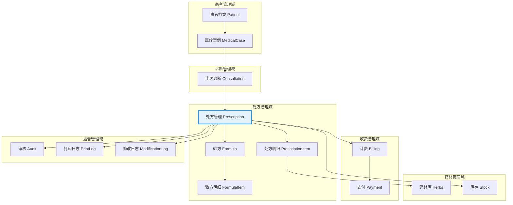
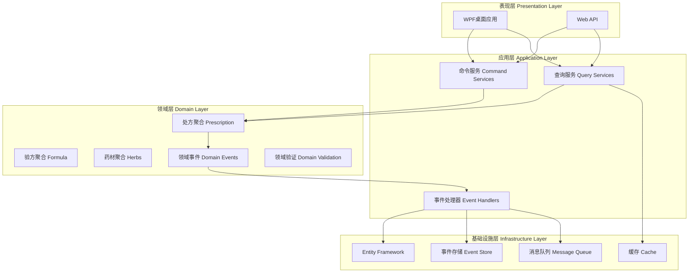
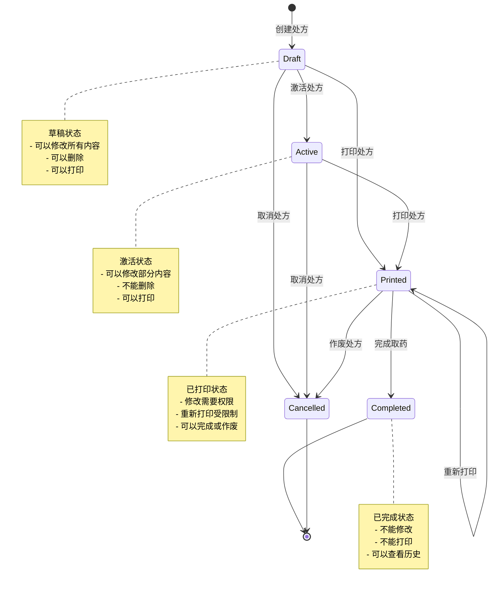
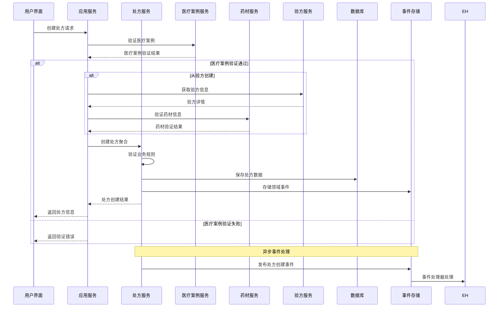
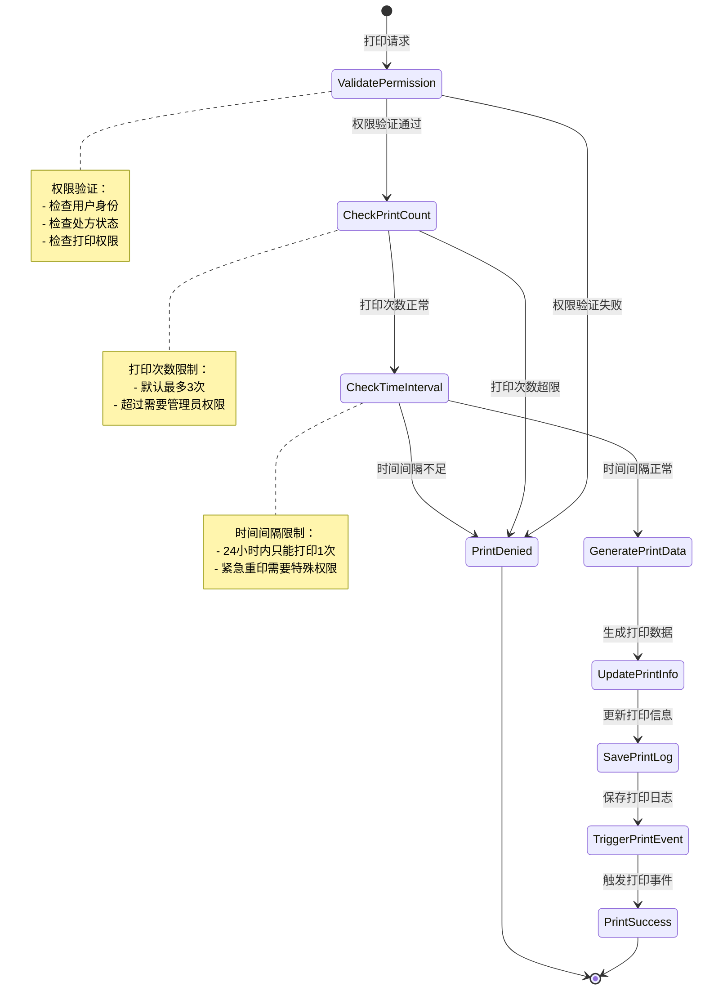
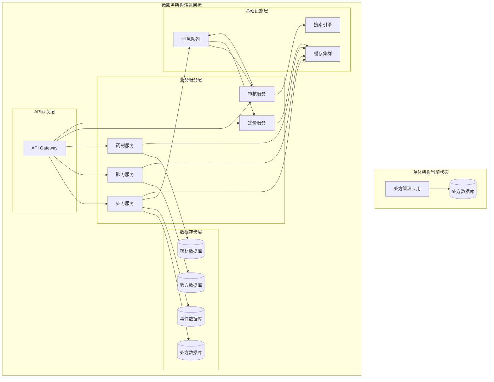

# 处方管理系统架构设计详解
**深入解析LYBTZYZS中医诊所处方管理系统的技术架构、业务逻辑和设计理念**

## 📋 目录

1. [系统概览](#1-系统概览)
2. [核心架构设计](#2-核心架构设计)
3. [数据模型设计](#3-数据模型设计)
4. [业务流程设计](#4-业务流程设计)
5. [服务层架构](#5-服务层架构)
6. [安全架构设计](#6-安全架构设计)
7. [性能优化设计](#7-性能优化设计)
8. [扩展性设计](#8-扩展性设计)

---

## 1. 系统概览

### 1.1 处方管理在系统中的定位

处方管理系统是LYBTZYZS中医诊所管理系统的核心业务模块，承接着中医诊断和药材管理的关键环节。



### 1.2 核心业务价值

**医疗价值**:
- 确保处方质量和用药安全
- 支持中医辨证论治的临床实践
- 维护处方修改和打印的合规性

**技术价值**:
- 实现处方管理的数字化和标准化
- 支持验方知识的复用和传承
- 提供完整的审计追溯能力

### 1.3 技术特性

```csharp
// 处方管理系统的核心特性
public class PrescriptionSystemCharacteristics
{
    // 业务特性
    public bool SupportsFormulaIntegration { get; } = true;     // 验方集成
    public bool SupportsPriceCalculation { get; } = true;      // 价格计算
    public bool SupportsVersionControl { get; } = true;        // 版本控制
    public bool SupportsAuditTrail { get; } = true;            // 审计追踪
    
    // 技术特性
    public bool UseEventSourcing { get; } = true;              // 事件溯源
    public bool UseCQRS { get; } = true;                       // CQRS模式
    public bool UseDomainEvents { get; } = true;               // 领域事件
    public bool UseSagaPattern { get; } = true;                // Saga模式
}
```

---

## 2. 核心架构设计

### 2.1 整体架构模式

LYBTZYZS处方管理系统采用**领域驱动设计(DDD)** + **CQRS** + **事件溯源**的混合架构模式。



### 2.2 聚合根设计

#### 2.2.1 处方聚合根 (Prescription Aggregate Root)

```csharp
/// <summary>
/// 处方聚合根 - 管理处方的完整生命周期和业务规则
/// </summary>
public class Prescription : AggregateRoot<Guid>
{
    // 聚合根标识
    public Guid Id { get; private set; }
    
    // 业务标识
    public string PrescriptionNumber { get; private set; }
    
    // 关联信息
    public Guid MedicalCaseId { get; private set; }
    
    // 处方内容
    public string? Indication { get; private set; }
    public int DosageCount { get; private set; }
    public string? Advice { get; private set; }
    public decimal Discount { get; private set; }
    
    // 状态管理
    public PrescriptionStatus Status { get; private set; }
    public bool IsPrinted { get; private set; }
    public int PrintVersion { get; private set; }
    public DateTime? LastPrintedAt { get; private set; }
    public int PrintCount { get; private set; }
    
    // 实体集合
    private readonly List<PrescriptionItem> _items = new();
    public IReadOnlyCollection<PrescriptionItem> Items => _items.AsReadOnly();
    
    // 领域事件
    private readonly List<IDomainEvent> _domainEvents = new();
    public IReadOnlyCollection<IDomainEvent> GetUncommittedEvents() => _domainEvents.AsReadOnly();
    public void MarkEventsAsCommitted() => _domainEvents.Clear();
    
    // 私有构造函数
    private Prescription() { }
    
    // 工厂方法：创建新处方
    public static Prescription Create(
        Guid medicalCaseId, 
        string indication, 
        int dosageCount = 7,
        decimal discount = 1.0m)
    {
        var prescription = new Prescription
        {
            Id = Guid.NewGuid(),
            MedicalCaseId = medicalCaseId,
            PrescriptionNumber = GeneratePrescriptionNumber(DateTime.UtcNow),
            Indication = indication,
            DosageCount = dosageCount,
            Discount = discount,
            Status = PrescriptionStatus.Draft,
            CreatedAt = DateTime.UtcNow
        };
        
        // 添加领域事件
        prescription.AddDomainEvent(new PrescriptionCreatedEvent(prescription.Id, medicalCaseId));
        
        return prescription;
    }
    
    // 工厂方法：从验方创建处方
    public static Prescription CreateFromFormula(
        Guid medicalCaseId,
        Formula formula,
        int dosageCount = 7,
        decimal discount = 1.0m,
        List<FormulaModification> modifications = null)
    {
        var prescription = Create(medicalCaseId, formula.Indication, dosageCount, discount);
        
        // 添加验方来源信息
        prescription.FormulaSource = formula.Name;
        prescription.ReferencedFormulas = formula.Name;
        
        // 添加验方药材
        foreach (var formulaItem in formula.Items)
        {
            var item = PrescriptionItem.CreateFromFormulaItem(formulaItem, formula.Id, formula.Name);
            prescription._items.Add(item);
        }
        
        // 应用修改
        if (modifications?.Any() == true)
        {
            prescription.ApplyModifications(modifications);
        }
        
        // 验证处方完整性
        prescription.ValidatePrescription();
        
        // 添加领域事件
        prescription.AddDomainEvent(new PrescriptionCreatedFromFormulaEvent(
            prescription.Id, 
            formula.Id, 
            modifications?.Count ?? 0));
        
        return prescription;
    }
    
    // 业务方法：添加药材
    public void AddItem(Guid herbId, string herbName, int quantity, string unit, decimal unitPrice, string? usage = null)
    {
        // 业务规则验证
        ValidateAddItem(herbId, herbName, quantity, unit, unitPrice);
        
        // 检查是否已存在相同药材
        var existingItem = _items.FirstOrDefault(i => i.HerbId == herbId);
        if (existingItem != null)
        {
            // 合并剂量
            existingItem.IncreaseQuantity(quantity);
            AddDomainEvent(new PrescriptionItemQuantityModifiedEvent(
                Id, existingItem.Id, existingItem.Quantity, quantity));
        }
        else
        {
            // 创建新药材项
            var newItem = PrescriptionItem.Create(herbId, herbName, quantity, unit, unitPrice, usage);
            _items.Add(newItem);
            
            AddDomainEvent(new PrescriptionItemAddedEvent(Id, newItem.Id, herbName, quantity));
        }
        
        ValidatePrescription();
        UpdatedAt = DateTime.UtcNow;
    }
    
    // 业务方法：修改处方
    public void ModifyPrescription(ModificationRequest request, string userId)
    {
        ValidateModificationPermission(userId);
        
        switch (request.ModificationType)
        {
            case ModificationType.AddItem:
                ApplyAddItemModification(request);
                break;
            case ModificationType.RemoveItem:
                ApplyRemoveItemModification(request);
                break;
            case ModificationType.ModifyItem:
                ApplyModifyItemModification(request);
                break;
            case ModificationType.ModifyBasicInfo:
                ApplyBasicInfoModification(request);
                break;
        }
        
        ValidatePrescription();
        
        AddDomainEvent(new PrescriptionModifiedEvent(Id, request.ModificationType, userId));
        UpdatedAt = DateTime.UtcNow;
    }
    
    // 业务方法：打印处方
    public PrintResult Print(PrintRequest request)
    {
        ValidatePrintPermission(request);
        
        var printVersion = PrintVersion + 1;
        var printTime = DateTime.UtcNow;
        
        // 更新打印状态
        PrintVersion = printVersion;
        LastPrintedAt = printTime;
        PrintCount++;
        IsPrinted = true;
        
        if (Status == PrescriptionStatus.Draft)
        {
            Status = PrescriptionStatus.Printed;
        }
        
        var printResult = new PrintResult
        {
            PrescriptionId = Id,
            PrescriptionNumber = PrescriptionNumber,
            PrintVersion = printVersion,
            PrintTime = printTime,
            PrintData = GeneratePrintData()
        };
        
        AddDomainEvent(new PrescriptionPrintedEvent(Id, printVersion, request.PrintedBy));
        
        return printResult;
    }
    
    // 业务方法：价格计算
    public PriceCalculationResult CalculatePrice()
    {
        var perDosePrice = _items.Sum(item => item.CalculateAmount());
        var subtotalPrice = perDosePrice * DosageCount;
        var discountAmount = subtotalPrice * (1 - Discount);
        var finalPrice = subtotalPrice * Discount;
        
        return new PriceCalculationResult
        {
            PerDosePrice = perDosePrice,
            SubtotalPrice = subtotalPrice,
            DiscountAmount = discountAmount,
            FinalPrice = finalPrice,
            ItemDetails = _items.Select(item => new ItemPriceDetail
            {
                HerbName = item.HerbName,
                Quantity = item.Quantity,
                UnitPrice = item.UnitPrice,
                Amount = item.CalculateAmount(),
                TotalAmount = item.CalculateAmount() * DosageCount * Discount
            }).ToList()
        };
    }
    
    // 私有验证方法
    private void ValidatePrescription()
    {
        if (!_items.Any())
        {
            throw new DomainException("处方不能为空");
        }
        
        if (_items.Count > 30)
        {
            throw new DomainException("处方药材数量不能超过30味");
        }
        
        if (DosageCount <= 0 || DosageCount > 30)
        {
            throw new DomainException("处方帖数必须在1-30之间");
        }
        
        if (Discount <= 0 || Discount > 1)
        {
            throw new DomainException("折扣必须在0-1之间");
        }
    }
    
    private void ValidateAddItem(Guid herbId, string herbName, int quantity, string unit, decimal unitPrice)
    {
        if (herbId == Guid.Empty)
            throw new DomainException("药材ID不能为空");
            
        if (string.IsNullOrWhiteSpace(herbName))
            throw new DomainException("药材名称不能为空");
            
        if (quantity <= 0)
            throw new DomainException("药材数量必须大于0");
            
        if (unitPrice < 0)
            throw new DomainException("药材单价不能为负数");
    }
    
    private void ValidatePrintPermission(PrintRequest request)
    {
        if (PrintCount >= 3 && !request.HasAdminPermission)
        {
            throw new DomainException("打印次数已达上限，需要管理员权限");
        }
        
        if (LastPrintedAt.HasValue && 
            LastPrintedAt.Value > DateTime.UtcNow.AddHours(-24) && 
            !request.HasImmediateReprintPermission)
        {
            throw new DomainException("24小时内不能重复打印");
        }
    }
    
    private static string GeneratePrescriptionNumber(DateTime date)
    {
        // 简化实现，实际需要考虑并发和唯一性
        return $"RX-{date:yyyyMMdd}-0001";
    }
}
```

#### 2.2.2 处方项实体 (PrescriptionItem Entity)

```csharp
/// <summary>
/// 处方药材项实体
/// </summary>
public class PrescriptionItem : Entity<Guid>
{
    public Guid PrescriptionId { get; private set; }
    public Guid HerbId { get; private set; }
    public string HerbName { get; private set; }
    public int Quantity { get; private set; }
    public string Unit { get; private set; }
    public decimal UnitPrice { get; private set; }
    public string? Usage { get; private set; }
    public string? Remark { get; private set; }
    
    // 计算属性
    public decimal Amount => Quantity * UnitPrice;
    
    private PrescriptionItem() { }
    
    public static PrescriptionItem Create(
        Guid herbId, 
        string herbName, 
        int quantity, 
        string unit, 
        decimal unitPrice, 
        string? usage = null)
    {
        return new PrescriptionItem
        {
            Id = Guid.NewGuid(),
            HerbId = herbId,
            HerbName = herbName,
            Quantity = quantity,
            Unit = unit,
            UnitPrice = unitPrice,
            Usage = usage
        };
    }
    
    public static PrescriptionItem CreateFromFormulaItem(
        FormulaItem formulaItem, 
        Guid formulaId, 
        string formulaName)
    {
        return new PrescriptionItem
        {
            Id = Guid.NewGuid(),
            HerbId = formulaItem.HerbId,
            HerbName = formulaItem.HerbName,
            Quantity = formulaItem.Quantity,
            Unit = formulaItem.Unit,
            UnitPrice = 0, // 需要从药材库获取当前价格
            Usage = formulaItem.Usage,
            Remark = $"来自验方: {formulaName}"
        };
    }
    
    public void IncreaseQuantity(int additionalQuantity)
    {
        if (additionalQuantity <= 0)
            throw new DomainException("增加的数量必须大于0");
            
        Quantity += additionalQuantity;
    }
    
    public void UpdateQuantity(int newQuantity)
    {
        if (newQuantity <= 0)
            throw new DomainException("数量必须大于0");
            
        Quantity = newQuantity;
    }
    
    public decimal CalculateAmount()
    {
        return Math.Round(Quantity * UnitPrice, 2);
    }
}
```

### 2.3 领域事件设计

```csharp
// 领域事件接口
public interface IDomainEvent
{
    Guid EventId { get; }
    DateTime OccurredOn { get; }
    string EventType { get; }
}

// 处方创建事件
public record PrescriptionCreatedEvent : IDomainEvent
{
    public Guid EventId { get; } = Guid.NewGuid();
    public DateTime OccurredOn { get; } = DateTime.UtcNow;
    public string EventType { get; } = nameof(PrescriptionCreatedEvent);
    
    public Guid PrescriptionId { get; init; }
    public Guid MedicalCaseId { get; init; }
}

// 处方打印事件
public record PrescriptionPrintedEvent : IDomainEvent
{
    public Guid EventId { get; } = Guid.NewGuid();
    public DateTime OccurredOn { get; } = DateTime.UtcNow;
    public string EventType { get; } = nameof(PrescriptionPrintedEvent);
    
    public Guid PrescriptionId { get; init; }
    public int PrintVersion { get; init; }
    public string PrintedBy { get; init; }
}

// 处方修改事件
public record PrescriptionModifiedEvent : IDomainEvent
{
    public Guid EventId { get; } = Guid.NewGuid();
    public DateTime OccurredOn { get; } = DateTime.UtcNow;
    public string EventType { get; } = nameof(PrescriptionModifiedEvent);
    
    public Guid PrescriptionId { get; init; }
    public ModificationType ModificationType { get; init; }
    public string ModifiedBy { get; init; }
    public Dictionary<string, object> Changes { get; init; } = new();
}
```

---

## 3. 数据模型设计

### 3.1 实体关系图

```mermaid
erDiagram
    PRESCRIPTION {
        Guid PK "处方ID"
        string "处方编号"
        Guid FK "医疗案例ID"
        string "主治"
        int "帖数"
        decimal "折扣"
        string "医嘱"
        string "验方来源"
        string "引用验方"
        enum "状态"
        bool "是否已打印"
        int "打印版本"
        datetime "最后打印时间"
        int "打印次数"
        string "备注"
        datetime "创建时间"
        string "创建人"
        datetime "更新时间"
        string "更新人"
    }
    
    PRESCRIPTION_ITEM {
        Guid PK "处方项ID"
        Guid FK "处方ID"
        Guid FK "药材ID"
        string "药材名称"
        int "用量"
        string "单位"
        decimal "单价"
        string "用法"
        string "备注"
    }
    
    PRESCRIPTION_PRINT_LOG {
        Guid PK "打印日志ID"
        Guid FK "处方ID"
        int "打印版本"
        datetime "打印时间"
        string FK "打印人"
        string "打印机名称"
        string "打印原因"
        string "IP地址"
        string "用户代理"
        string "数据哈希"
    }
    
    PRESCRIPTION_MODIFICATION_LOG {
        Guid PK "修改日志ID"
        Guid FK "处方ID"
        string FK "修改人"
        datetime "修改时间"
        string "修改类型"
        string "修改原因"
        string "修改前数据"
        string "修改后数据"
        string "修改字段"
        string "警告信息"
        string "IP地址"
        string "用户代理"
    }
    
    MEDICAL_CASE {
        Guid PK "医疗案例ID"
        Guid FK "患者ID"
        Guid FK "医生ID"
        datetime "诊疗日期"
        bool "需要处方"
        Guid FK "处方ID"
        enum "状态"
    }
    
    FORMULA {
        Guid PK "验方ID"
        string "验方名称"
        string "拼音"
        string "分类"
        string "来源"
        string "主治"
        string "功效"
        string "用法"
        bool "是否激活"
        datetime "创建时间"
    }
    
    FORMULA_ITEM {
        Guid PK "验方项ID"
        Guid FK "验方ID"
        Guid FK "药材ID"
        string "药材名称"
        int "用量"
        string "单位"
        string "用法"
        string "备注"
        int "排序"
    }
    
    HERB {
        Guid PK "药材ID"
        string "药材名称"
        string "拼音"
        string "分类"
        string "性味"
        string "归经"
        string "功效"
        string "用法用量"
        decimal "单价"
        string "单位"
        bool "是否激活"
        string "备注"
    }
    
    PRESCRIPTION ||--o{ PRESCRIPTION_ITEM : contains
    PRESCRIPTION ||--o{ PRESCRIPTION_PRINT_LOG : prints
    PRESCRIPTION ||--o{ PRESCRIPTION_MODIFICATION_LOG : modifies
    PRESCRIPTION }o--|| MEDICAL_CASE : belongs_to
    PRESCRIPTION_ITEM }o--|| HERB : references
    FORMULA ||--o{ FORMULA_ITEM : contains
    FORMULA_ITEM }o--|| HERB : references
```

### 3.2 状态机设计



### 3.3 数据库设计策略

#### 3.3.1 表结构设计

```sql
-- 处方表
CREATE TABLE Prescriptions (
    Id UNIQUEIDENTIFIER NOT NULL PRIMARY KEY,
    PrescriptionNumber NVARCHAR(20) UNIQUE,
    MedicalCaseId UNIQUEIDENTIFIER NOT NULL,
    PatientId UNIQUEIDENTIFIER NULL,
    UserId UNIQUEIDENTIFIER NULL,
    Indication NVARCHAR(500) NULL,
    DosageCount INT NOT NULL DEFAULT 7,
    Advice NVARCHAR(500) NULL,
    FormulaSource NVARCHAR(200) NULL,
    ReferencedFormulas NVARCHAR(500) NULL,
    Discount DECIMAL(5,4) NOT NULL DEFAULT 1.0,
    Status INT NOT NULL DEFAULT 0, -- PrescriptionStatus enum
    IsPrinted BIT NOT NULL DEFAULT 0,
    PrintVersion INT NOT NULL DEFAULT 1,
    LastPrintedAt DATETIME2 NULL,
    PrintCount INT NOT NULL DEFAULT 0,
    Remark NVARCHAR(500) NULL,
    CreatedAt DATETIME2 NOT NULL DEFAULT GETUTCDATE(),
    CreatedBy NVARCHAR(100) NULL,
    UpdatedAt DATETIME2 NULL,
    UpdatedBy NVARCHAR(100) NULL,
    
    -- 外键约束
    CONSTRAINT FK_Prescriptions_MedicalCases 
        FOREIGN KEY (MedicalCaseId) REFERENCES MedicalCases(Id),
    CONSTRAINT FK_Prescriptions_Patients 
        FOREIGN KEY (PatientId) REFERENCES Patients(Id),
    CONSTRAINT FK_Prescriptions_Users 
        FOREIGN KEY (UserId) REFERENCES Users(Id)
);

-- 处方药材项表
CREATE TABLE PrescriptionItems (
    Id UNIQUEIDENTIFIER NOT NULL PRIMARY KEY,
    PrescriptionId UNIQUEIDENTIFIER NOT NULL,
    HerbId UNIQUEIDENTIFIER NOT NULL,
    HerbName NVARCHAR(100) NOT NULL,
    Quantity INT NOT NULL,
    Unit NVARCHAR(16) NOT NULL DEFAULT 'g',
    UnitPrice DECIMAL(18,2) NOT NULL DEFAULT 0,
    Usage NVARCHAR(200) NULL,
    Remark NVARCHAR(200) NULL,
    
    -- 外键约束
    CONSTRAINT FK_PrescriptionItems_Prescriptions 
        FOREIGN KEY (PrescriptionId) REFERENCES Prescriptions(Id) ON DELETE CASCADE,
    CONSTRAINT FK_PrescriptionItems_Herbs 
        FOREIGN KEY (HerbId) REFERENCES Herbs(Id)
);

-- 处方打印日志表
CREATE TABLE PrescriptionPrintLogs (
    Id UNIQUEIDENTIFIER NOT NULL PRIMARY KEY,
    PrescriptionId UNIQUEIDENTIFIER NOT NULL,
    PrintVersion INT NOT NULL,
    PrintedAt DATETIME2 NOT NULL DEFAULT GETUTCDATE(),
    PrintedBy NVARCHAR(100) NOT NULL,
    PrinterName NVARCHAR(100) NULL,
    PrintReason NVARCHAR(200) NULL,
    IPAddress NVARCHAR(45) NULL,
    UserAgent NVARCHAR(500) NULL,
    PrintDataHash NVARCHAR(64) NULL,
    
    -- 外键约束
    CONSTRAINT FK_PrescriptionPrintLogs_Prescriptions 
        FOREIGN KEY (PrescriptionId) REFERENCES Prescriptions(Id)
);

-- 处方修改日志表
CREATE TABLE PrescriptionModificationLogs (
    Id UNIQUEIDENTIFIER NOT NULL PRIMARY KEY,
    PrescriptionId UNIQUEIDENTIFIER NOT NULL,
    ModifiedBy NVARCHAR(100) NOT NULL,
    ModifiedAt DATETIME2 NOT NULL DEFAULT GETUTCDATE(),
    ModificationType NVARCHAR(50) NOT NULL,
    ModificationReason NVARCHAR(500) NULL,
    BeforeSnapshot NVARCHAR(MAX) NULL,
    AfterSnapshot NVARCHAR(MAX) NULL,
    ModifiedFields NVARCHAR(MAX) NULL,
    Warnings NVARCHAR(MAX) NULL,
    IPAddress NVARCHAR(45) NULL,
    UserAgent NVARCHAR(500) NULL,
    
    -- 外键约束
    CONSTRAINT FK_PrescriptionModificationLogs_Prescriptions 
        FOREIGN KEY (PrescriptionId) REFERENCES Prescriptions(Id)
);
```

#### 3.3.2 索引策略

```sql
-- 处方表索引
CREATE INDEX IX_Prescriptions_MedicalCaseId ON Prescriptions(MedicalCaseId);
CREATE INDEX IX_Prescriptions_PatientId ON Prescriptions(PatientId);
CREATE INDEX IX_Prescriptions_UserId ON Prescriptions(UserId);
CREATE INDEX IX_Prescriptions_Status ON Prescriptions(Status);
CREATE INDEX IX_Prescriptions_CreatedAt ON Prescriptions(CreatedAt);
CREATE INDEX IX_Prescriptions_PrescriptionNumber ON Prescriptions(PrescriptionNumber);

-- 处方药材项表索引
CREATE INDEX IX_PrescriptionItems_PrescriptionId ON PrescriptionItems(PrescriptionId);
CREATE INDEX IX_PrescriptionItems_HerbId ON PrescriptionItems(HerbId);
CREATE INDEX IX_PrescriptionItems_HerbName ON PrescriptionItems(HerbName);

-- 打印日志表索引
CREATE INDEX IX_PrescriptionPrintLogs_PrescriptionId ON PrescriptionPrintLogs(PrescriptionId);
CREATE INDEX IX_PrescriptionPrintLogs_PrintedAt ON PrescriptionPrintLogs(PrintedAt);

-- 修改日志表索引
CREATE INDEX IX_PrescriptionModificationLogs_PrescriptionId ON PrescriptionModificationLogs(PrescriptionId);
CREATE INDEX IX_PrescriptionModificationLogs_ModifiedAt ON PrescriptionModificationLogs(ModifiedAt);
```

---

## 4. 业务流程设计

### 4.1 处方创建流程



### 4.2 处方审核流程

```mermaid
flowchart TD
    START([开始审核]) --> VALIDATE{验证处方状态}
    
    VALIDATE -->|有效处方| BASIC_CHECK[基础检查]
    VALIDATE -->|无效处方| END_ERROR[审核失败]
    
    BASIC_CHECK --> COMPLIANCE_CHECK{配伍禁忌检查}
    COMPLIENCE_CHECK -->|无冲突| DOSAGE_CHECK[剂量安全检查]
    COMPLIENCE_CHECK -->|严重冲突| END_ERROR
    COMPLIENCE_CHECK -->|轻微冲突| WARNING[添加警告]
    
    DOSAGE_CHECK --> CONTRAINDICATION_CHECK[禁忌检查]
    WARNING --> CONTRAINDICATION_CHECK
    
    CONTRAINDICATION_CHECK --> PRICE_CHECK[价格合理性检查]
    
    PRICE_CHECK --> RESULT{汇总审核结果}
    
    RESULT -->|全部通过| END_PASS[审核通过]
    RESULT -->|有警告| END_WARNING[审核通过(带警告)]
    RESULT -->|有错误| END_ERROR[审核失败]
    
    style END_PASS fill:#4caf50,color:#fff
    style END_WARNING fill:#ff9800,color:#fff
    style END_ERROR fill:#f44336,color:#fff
```

### 4.3 处方打印流程



---

## 5. 服务层架构

### 5.1 命令查询职责分离 (CQRS)

```csharp
// 命令接口
public interface ICommandHandler<TCommand, TResult>
{
    Task<TResult> HandleAsync(TCommand command, CancellationToken cancellationToken = default);
}

// 查询接口
public interface IQueryHandler<TQuery, TResult>
{
    Task<TResult> HandleAsync(TQuery query, CancellationToken cancellationToken = default);
}

// 创建处方命令处理器
public class CreatePrescriptionCommandHandler : ICommandHandler<CreatePrescriptionCommand, PrescriptionDto>
{
    private readonly IPrescriptionRepository _prescriptionRepository;
    private readonly IMedicalCaseRepository _medicalCaseRepository;
    private readonly IHerbRepository _herbRepository;
    private readonly IDomainEventDispatcher _eventDispatcher;
    private readonly ILogger<CreatePrescriptionCommandHandler> _logger;

    public async Task<PrescriptionDto> HandleAsync(CreatePrescriptionCommand command, CancellationToken cancellationToken = default)
    {
        // 验证前置条件
        var medicalCase = await _medicalCaseRepository.GetByIdAsync(command.MedicalCaseId);
        if (medicalCase == null)
            throw new NotFoundException("医疗案例不存在");

        if (!medicalCase.NeedsPrescription)
            throw new BusinessException("该医疗案例未确认需要处方");

        // 创建处方聚合
        var prescription = command.FormulaId.HasValue
            ? Prescription.CreateFromFormula(
                command.MedicalCaseId,
                await GetFormulaAsync(command.FormulaId.Value),
                command.DosageCount,
                command.Discount,
                command.Modifications)
            : Prescription.Create(
                command.MedicalCaseId,
                command.Indication,
                command.DosageCount,
                command.Discount);

        // 添加处方药材
        if (command.Items?.Any() == true)
        {
            foreach (var item in command.Items)
            {
                var herb = await _herbRepository.GetByIdAsync(item.HerbId);
                if (herb == null || !herb.IsActive)
                    throw new BusinessException($"药材 {item.HerbName} 不可用");

                prescription.AddItem(
                    item.HerbId,
                    item.HerbName,
                    item.Quantity,
                    herb.Unit,
                    herb.UnitPrice ?? 0,
                    item.Usage);
            }
        }

        // 保存聚合
        await _prescriptionRepository.AddAsync(prescription);
        await _prescriptionRepository.SaveChangesAsync();

        // 发布领域事件
        await _eventDispatcher.DispatchAsync(prescription.GetUncommittedEvents());

        _logger.LogInformation("处方创建成功: {PrescriptionId}", prescription.Id);

        // 返回DTO
        return MapToPrescriptionDto(prescription);
    }

    private async Task<Formula> GetFormulaAsync(Guid formulaId)
    {
        // 获取验方逻辑
        throw new NotImplementedException();
    }

    private PrescriptionDto MapToPrescriptionDto(Prescription prescription)
    {
        // 映射逻辑
        throw new NotImplementedException();
    }
}

// 处方查询处理器
public class GetPrescriptionQueryHandler : IQueryHandler<GetPrescriptionQuery, PrescriptionDto>
{
    private readonly IPrescriptionReadRepository _readRepository;

    public async Task<PrescriptionDto> HandleAsync(GetPrescriptionQuery query, CancellationToken cancellationToken = default)
    {
        // 从读模型获取数据
        var prescription = await _readRepository.GetByIdAsync(query.PrescriptionId);
        
        if (prescription == null)
            throw new NotFoundException("处方不存在");

        return prescription;
    }
}
```

### 5.2 领域服务设计

```csharp
// 处方审核领域服务
public class PrescriptionAuditDomainService
{
    private readonly IHerbCompatibilityService _compatibilityService;
    private readonly IHerbDosageService _dosageService;
    private readonly IPrescriptionPricingService _pricingService;

    public async Task<PrescriptionAuditResult> AuditPrescriptionAsync(Prescription prescription)
    {
        var auditResult = new PrescriptionAuditResult
        {
            PrescriptionId = prescription.Id,
            OverallResult = AuditResult.Pass,
            AuditItems = new List<AuditItem>()
        };

        // 1. 基础检查
        var basicAudit = await PerformBasicAuditAsync(prescription);
        auditResult.AuditItems.Add(basicAudit);

        if (basicAudit.Result == AuditResult.Fail)
        {
            auditResult.OverallResult = AuditResult.Fail;
            return auditResult;
        }

        // 2. 安全检查
        var safetyAudit = await PerformSafetyAuditAsync(prescription);
        auditResult.AuditItems.Add(safetyAudit);

        // 3. 价格检查
        var priceAudit = await PerformPriceAuditAsync(prescription);
        auditResult.AuditItems.Add(priceAudit);

        // 4. 综合判断
        auditResult.OverallResult = DetermineOverallResult(auditResult.AuditItems);

        return auditResult;
    }

    private async Task<AuditItem> PerformSafetyAuditAsync(Prescription prescription)
    {
        var auditItem = new AuditItem
        {
            Category = "安全检查",
            Level = AuditLevel.Warning,
            Issues = new List<string>()
        };

        // 配伍禁忌检查
        var herbNames = prescription.Items.Select(i => i.HerbName).ToList();
        var compatibilityResult = await _compatibilityService.CheckCompatibilityAsync(herbNames);

        if (!compatibilityResult.IsCompatible)
        {
            auditItem.Result = compatibilityResult.Conflicts.Any(c => c.Severity == SeverityLevel.High)
                ? AuditResult.Fail
                : AuditResult.Warning;
            
            auditItem.Issues.AddRange(compatibilityResult.Conflicts.Select(c => 
                $"配伍禁忌: {c.HerbA} 与 {c.HerbB} - {c.Description}"));
        }

        // 剂量安全检查
        var dosageResult = await _dosageService.CheckDosageSafetyAsync(prescription.Items);
        
        if (!dosageResult.IsSafe)
        {
            auditItem.Result = dosageResult.DosageIssues.Any(d => d.Severity == SeverityLevel.High)
                ? AuditResult.Fail
                : AuditResult.Warning;
            
            auditItem.Issues.AddRange(dosageResult.DosageIssues.Select(d => 
                $"剂量问题: {d.HerbName} - {d.Description}"));
        }

        if (auditItem.Issues.Count == 0)
        {
            auditItem.Result = AuditResult.Pass;
        }

        return auditItem;
    }
}

// 处方价格领域服务
public class PrescriptionPricingDomainService
{
    public PriceCalculationResult CalculatePrice(Prescription prescription)
    {
        // 计算每帖价格
        var perDoseItems = prescription.Items.Select(item => new ItemPriceDetail
        {
            HerbName = item.HerbName,
            Quantity = item.Quantity,
            UnitPrice = item.UnitPrice,
            Amount = item.CalculateAmount()
        }).ToList();

        var perDosePrice = perDoseItems.Sum(item => item.Amount);

        // 计算总价
        var subtotalPrice = perDosePrice * prescription.DosageCount;
        var discountAmount = subtotalPrice * (1 - prescription.Discount);
        var finalPrice = subtotalPrice * prescription.Discount;

        return new PriceCalculationResult
        {
            PerDosePrice = perDosePrice,
            SubtotalPrice = subtotalPrice,
            DiscountAmount = discountAmount,
            FinalPrice = finalPrice,
            ItemDetails = perDoseItems.Select(item => new ItemPriceDetail
            {
                HerbName = item.HerbName,
                Quantity = item.Quantity,
                UnitPrice = item.UnitPrice,
                Amount = item.Amount,
                TotalAmount = item.Amount * prescription.DosageCount * prescription.Discount
            }).ToList()
        };
    }

    public async Task<PriceValidationResult> ValidatePriceAsync(Prescription prescription)
    {
        var result = new PriceValidationResult
        {
            IsValid = true,
            Warnings = new List<string>(),
            Errors = new List<string>()
        };

        var priceResult = CalculatePrice(prescription);

        // 价格合理性检查
        if (priceResult.FinalPrice < 10)
        {
            result.Warnings.Add("处方价格过低");
        }
        else if (priceResult.FinalPrice > 5000)
        {
            result.Warnings.Add("处方价格过高");
        }

        // 单味药比例检查
        var maxItemPrice = priceResult.ItemDetails.Max(i => i.TotalAmount);
        var maxItemPercentage = maxItemPrice / priceResult.FinalPrice;

        if (maxItemPercentage > 0.5)
        {
            var expensiveItem = priceResult.ItemDetails.First(i => i.TotalAmount == maxItemPrice);
            result.Warnings.Add($"单味药 {expensiveItem.HerbName} 价格占比过高: {maxItemPercentage:P1}");
        }

        return result;
    }
}
```

### 5.3 应用服务协调

```csharp
// 处方应用服务
public class PrescriptionApplicationService
{
    private readonly IPrescriptionRepository _prescriptionRepository;
    private readonly IMedicalCaseRepository _medicalCaseRepository;
    private readonly IHerbRepository _herbRepository;
    private readonly IFormulaRepository _formulaRepository;
    private readonly PrescriptionAuditDomainService _auditService;
    private readonly PrescriptionPricingDomainService _pricingService;
    private readonly IDomainEventDispatcher _eventDispatcher;
    private readonly IUnitOfWork _unitOfWork;

    public async Task<PrescriptionDto> CreatePrescriptionAsync(CreatePrescriptionRequest request)
    {
        await _unitOfWork.BeginTransactionAsync();

        try
        {
            // 1. 验证前置条件
            await ValidateCreationPrerequisitesAsync(request.MedicalCaseId);

            // 2. 创建处方聚合
            Prescription prescription;
            if (request.FormulaId.HasValue)
            {
                prescription = await CreateFromFormulaAsync(request);
            }
            else
            {
                prescription = await CreateFromScratchAsync(request);
            }

            // 3. 处方审核
            var auditResult = await _auditService.AuditPrescriptionAsync(prescription);
            if (auditResult.OverallResult == AuditResult.Fail)
            {
                throw new BusinessException($"处方审核失败: {string.Join(", ", auditResult.AuditItems.Where(a => a.Result == AuditResult.Fail).SelectMany(a => a.Issues))}");
            }

            // 4. 价格计算和验证
            var priceValidation = await _pricingService.ValidatePriceAsync(prescription);
            if (!priceValidation.IsValid)
            {
                throw new BusinessException($"处方价格验证失败: {string.Join(", ", priceValidation.Errors)}");
            }

            // 5. 保存聚合
            await _prescriptionRepository.AddAsync(prescription);
            await _unitOfWork.SaveChangesAsync();

            // 6. 发布领域事件
            await _eventDispatcher.DispatchAsync(prescription.GetUncommittedEvents());

            await _unitOfWork.CommitAsync();

            return MapToPrescriptionDto(prescription);
        }
        catch
        {
            await _unitOfWork.RollbackAsync();
            throw;
        }
    }

    private async Task ValidateCreationPrerequisitesAsync(Guid medicalCaseId)
    {
        var medicalCase = await _medicalCaseRepository.GetByIdAsync(medicalCaseId);
        if (medicalCase == null)
            throw new NotFoundException("医疗案例不存在");

        if (!medicalCase.NeedsPrescription)
            throw new BusinessException("该医疗案例未确认需要处方");

        if (medicalCase.Prescription != null)
            throw new BusinessException("该医疗案例已存在处方");
    }

    private async Task<Prescription> CreateFromFormulaAsync(CreatePrescriptionRequest request)
    {
        var formula = await _formulaRepository.GetByIdWithItemsAsync(request.FormulaId.Value);
        if (formula == null)
            throw new NotFoundException("验方不存在");

        return Prescription.CreateFromFormula(
            request.MedicalCaseId,
            formula,
            request.DosageCount,
            request.Discount,
            request.Modifications);
    }

    private async Task<Prescription> CreateFromScratchAsync(CreatePrescriptionRequest request)
    {
        var prescription = Prescription.Create(
            request.MedicalCaseId,
            request.Indication,
            request.DosageCount,
            request.Discount);

        if (request.Items?.Any() == true)
        {
            foreach (var item in request.Items)
            {
                var herb = await _herbRepository.GetByIdAsync(item.HerbId);
                if (herb == null || !herb.IsActive)
                    throw new BusinessException($"药材 {item.HerbName} 不可用");

                prescription.AddItem(
                    item.HerbId,
                    item.HerbName,
                    item.Quantity,
                    herb.Unit,
                    herb.UnitPrice ?? 0,
                    item.Usage);
            }
        }

        return prescription;
    }
}
```

---

## 6. 安全架构设计

### 6.1 权限控制模型

```csharp
// 权限枚举
public enum PrescriptionPermission
{
    // 基础权限
    Read = 1,              // 查看处方
    Create = 2,            // 创建处方
    Update = 4,            // 更新处方
    Delete = 8,            // 删除处方
    
    // 高级权限
    EditOld = 16,          // 编辑历史处方
    OverPrint = 32,        // 超限打印
    ImmediateReprint = 64, // 立即重印
    AdvancedEdit = 128,    // 高级编辑
    AdminPrint = 256,      // 管理员打印
    AdminEdit = 512,       // 管理员编辑
    
    // 审核权限
    Audit = 1024,          // 审核处方
    OverrideAudit = 2048   // 覆盖审核结果
}

// 权限服务
public class PrescriptionPermissionService
{
    private readonly IUserRepository _userRepository;
    private readonly IRoleRepository _roleRepository;

    public async Task<bool> HasPermissionAsync(string userId, PrescriptionPermission permission)
    {
        var user = await _userRepository.GetByIdAsync(userId);
        if (user == null) return false;

        // 检查用户直接权限
        var userPermission = (PrescriptionPermission?)user.Permissions?.FirstOrDefault(p => p.StartsWith("Prescription."));
        if (userPermission.HasValue && (userPermission.Value & permission) == permission)
            return true;

        // 检查角色权限
        var role = await _roleRepository.GetByIdAsync(user.RoleId);
        return role?.Permissions?.Contains($"Prescription.{permission}") == true;
    }

    public async Task<bool> CanModifyPrescriptionAsync(string userId, Prescription prescription)
    {
        // 基础检查：处方状态
        if (prescription.Status == PrescriptionStatus.Completed || prescription.Status == PrescriptionStatus.Cancelled)
            return false;

        // 时间限制检查
        if (prescription.CreatedAt.Date < DateTime.Today)
        {
            return await HasPermissionAsync(userId, PrescriptionPermission.EditOld);
        }

        // 创建人检查
        if (prescription.CreatedBy != userId)
        {
            return await HasPermissionAsync(userId, PrescriptionPermission.AdminEdit);
        }

        return true;
    }

    public async Task<bool> CanPrintPrescriptionAsync(string userId, Prescription prescription)
    {
        // 打印次数检查
        if (prescription.PrintCount >= 3)
        {
            return await HasPermissionAsync(userId, PrescriptionPermission.OverPrint);
        }

        // 时间间隔检查
        if (prescription.LastPrintedAt.HasValue && 
            prescription.LastPrintedAt.Value > DateTime.UtcNow.AddHours(-24))
        {
            return await HasPermissionAsync(userId, PrescriptionPermission.ImmediateReprint);
        }

        return true;
    }
}
```

### 6.2 数据加密与隐私保护

```csharp
// 敏感数据加密服务
public class PrescriptionDataEncryptionService
{
    private readonly IEncryptionProvider _encryptionProvider;

    public async Task<PrescriptionPrintData> EncryptSensitiveDataAsync(PrescriptionPrintData printData)
    {
        var encryptedData = new PrescriptionPrintData
        {
            BasicInfo = printData.BasicInfo,
            PatientInfo = await EncryptPatientInfoAsync(printData.PatientInfo),
            DoctorInfo = await EncryptDoctorInfoAsync(printData.DoctorInfo),
            PrescriptionContent = printData.PrescriptionContent
        };

        return encryptedData;
    }

    private async Task<PatientPrintInfo> EncryptPatientInfoAsync(PatientPrintInfo patientInfo)
    {
        return new PatientPrintInfo
        {
            Name = MaskName(patientInfo.Name),
            Age = patientInfo.Age, // 年龄不敏感
            Gender = patientInfo.Gender,
            PhoneNumber = MaskPhoneNumber(patientInfo.PhoneNumber)
        };
    }

    private string MaskName(string name)
    {
        if (string.IsNullOrEmpty(name) || name.Length <= 2)
            return name;

        return name.Substring(0, 1) + new string('*', name.Length - 2) + name.Substring(name.Length - 1);
    }

    private string MaskPhoneNumber(string phoneNumber)
    {
        if (string.IsNullOrEmpty(phoneNumber) || phoneNumber.Length < 7)
            return phoneNumber;

        return phoneNumber.Substring(0, 3) + new string('*', phoneNumber.Length - 6) + phoneNumber.Substring(phoneNumber.Length - 3);
    }
}
```

### 6.3 审计日志设计

```csharp
// 审计日志接口
public interface IAuditLogService
{
    Task LogPrescriptionActionAsync(PrescriptionAuditLog auditLog);
    Task LogDataAccessAsync(DataAccessLog dataAccessLog);
    Task LogSecurityEventAsync(SecurityEventLog securityEvent);
}

// 处方审计日志
public class PrescriptionAuditLog
{
    public Guid Id { get; set; } = Guid.NewGuid();
    public Guid PrescriptionId { get; set; }
    public string ActionType { get; set; }
    public string UserId { get; set; }
    public string UserName { get; set; }
    public DateTime Timestamp { get; set; } = DateTime.UtcNow;
    public string IPAddress { get; set; }
    public string UserAgent { get; set; }
    public string RequestData { get; set; }
    public string ResponseData { get; set; }
    public string ModifiedFields { get; set; }
    public string BusinessRuleViolations { get; set; }
    public AuditResult AuditResult { get; set; }
}

// 审计日志服务实现
public class PrescriptionAuditLogService : IAuditLogService
{
    private readonly IAuditLogRepository _auditLogRepository;
    private readonly ILogger<PrescriptionAuditLogService> _logger;
    private readonly IConfiguration _configuration;

    public async Task LogPrescriptionActionAsync(PrescriptionAuditLog auditLog)
    {
        try
        {
            // 敏感数据脱敏
            auditLog.RequestData = await SanitizeDataAsync(auditLog.RequestData);
            auditLog.ResponseData = await SanitizeDataAsync(auditLog.ResponseData);

            // 保存审计日志
            await _auditLogRepository.AddAsync(auditLog);
            await _auditLogRepository.SaveChangesAsync();

            // 异步写入日志文件
            _ = Task.Run(() => WriteToFileAsync(auditLog));

            // 检查是否需要实时告警
            await CheckAlertConditionsAsync(auditLog);
        }
        catch (Exception ex)
        {
            _logger.LogError(ex, "审计日志保存失败: {PrescriptionId}", auditLog.PrescriptionId);
            // 审计日志失败不应该影响主业务流程
        }
    }

    private async Task<string> SanitizeDataAsync(string data)
    {
        if (string.IsNullOrEmpty(data))
            return data;

        // 移除敏感信息
        var sanitized = data;

        // 移除身份证号
        sanitized = Regex.Replace(sanitized, @"\b\d{17}[\dXx]\b", "[ID_CARD]");
        
        // 移除手机号
        sanitized = Regex.Replace(sanitized, @"\b1[3-9]\d{9}\b", "[PHONE]");
        
        // 移除银行卡号
        sanitized = Regex.Replace(sanitized, @"\b\d{16,19}\b", "[BANK_CARD]");

        return sanitized;
    }

    private async Task CheckAlertConditionsAsync(PrescriptionAuditLog auditLog)
    {
        var alertConditions = _configuration.GetSection("AuditAlerts").Get<List<AlertCondition>>();
        
        foreach (var condition in alertConditions)
        {
            if (await ShouldTriggerAlertAsync(auditLog, condition))
            {
                await TriggerAlertAsync(auditLog, condition);
            }
        }
    }
}
```

---

## 7. 性能优化设计

### 7.1 缓存策略

```csharp
// 处方缓存服务
public class PrescriptionCacheService : IPrescriptionCacheService
{
    private readonly IDistributedCache _distributedCache;
    private readonly IMemoryCache _memoryCache;
    private readonly ICacheKeyGenerator _keyGenerator;

    private static readonly TimeSpan PrescriptionDetailCacheDuration = TimeSpan.FromMinutes(30);
    private static readonly TimeSpan PrescriptionListCacheDuration = TimeSpan.FromMinutes(10);
    private static readonly TimeSpan HerbInfoCacheDuration = TimeSpan.FromHours(1);

    public async Task<PrescriptionDto> GetPrescriptionAsync(Guid prescriptionId)
    {
        var cacheKey = _keyGenerator.GeneratePrescriptionKey(prescriptionId);
        
        // 首先检查内存缓存
        if (_memoryCache.TryGetValue(cacheKey, out PrescriptionDto cachedPrescription))
        {
            return cachedPrescription;
        }

        // 然后检查分布式缓存
        var serializedPrescription = await _distributedCache.GetStringAsync(cacheKey);
        if (!string.IsNullOrEmpty(serializedPrescription))
        {
            var prescription = JsonSerializer.Deserialize<PrescriptionDto>(serializedPrescription);
            
            // 回填内存缓存
            _memoryCache.Set(cacheKey, prescription, PrescriptionDetailCacheDuration);
            
            return prescription;
        }

        return null;
    }

    public async Task SetPrescriptionAsync(PrescriptionDto prescription)
    {
        var cacheKey = _keyGenerator.GeneratePrescriptionKey(prescription.Id);
        var serializedPrescription = JsonSerializer.Serialize(prescription);

        // 设置分布式缓存
        await _distributedCache.SetStringAsync(
            cacheKey, 
            serializedPrescription, 
            new DistributedCacheEntryOptions
            {
                AbsoluteExpirationRelativeToNow = PrescriptionDetailCacheDuration
            });

        // 设置内存缓存
        _memoryCache.Set(cacheKey, prescription, PrescriptionDetailCacheDuration);
    }

    public async Task InvalidatePrescriptionAsync(Guid prescriptionId)
    {
        var cacheKey = _keyGenerator.GeneratePrescriptionKey(prescriptionId);
        
        // 移除分布式缓存
        await _distributedCache.RemoveAsync(cacheKey);
        
        // 移除内存缓存
        _memoryCache.Remove(cacheKey);
    }

    public async Task<List<HerbInfoDto>> GetPopularHerbsAsync()
    {
        const string cacheKey = "popular_herbs";
        
        if (_memoryCache.TryGetValue(cacheKey, out List<HerbInfoDto> cachedHerbs))
        {
            return cachedHerbs;
        }

        var serializedHerbs = await _distributedCache.GetStringAsync(cacheKey);
        if (!string.IsNullOrEmpty(serializedHerbs))
        {
            var herbs = JsonSerializer.Deserialize<List<HerbInfoDto>>(serializedHerbs);
            _memoryCache.Set(cacheKey, herbs, HerbInfoCacheDuration);
            return herbs;
        }

        return null;
    }

    // 缓存预热
    public async Task WarmupCacheAsync()
    {
        // 预加载热门药材信息
        var popularHerbs = await LoadPopularHerbsFromDatabaseAsync();
        await SetPopularHerbsAsync(popularHerbs);

        // 预加载常用验方信息
        var commonFormulas = await LoadCommonFormulasFromDatabaseAsync();
        foreach (var formula in commonFormulas)
        {
            await SetFormulaAsync(formula);
        }
    }
}
```

### 7.2 数据库优化

```csharp
// 处方查询优化器
public class PrescriptionQueryOptimizer
{
    private readonly ILogger<PrescriptionQueryOptimizer> _logger;

    public IQueryable<Prescription> OptimizePrescriptionQuery(IQueryable<Prescription> query, PrescriptionQueryOptions options)
    {
        // 1. 索引提示
        query = ApplyIndexHints(query, options);

        // 2. 分页优化
        query = ApplyPaginationOptimization(query, options);

        // 3. 连接优化
        query = ApplyJoinOptimization(query, options);

        // 4. 投影优化
        query = ApplyProjectionOptimization(query, options);

        return query;
    }

    private IQueryable<Prescription> ApplyIndexHints(IQueryable<Prescription> query, PrescriptionQueryOptions options)
    {
        // 根据查询条件使用合适的索引
        if (options.PatientId.HasValue)
        {
            // 使用患者ID索引
            query = query.TagWith("INDEX(IX_Prescriptions_PatientId)");
        }
        else if (options.DoctorId.HasValue)
        {
            // 使用医生ID索引
            query = query.TagWith("INDEX(IX_Prescriptions_UserId)");
        }
        else if (options.StartDate.HasValue || options.EndDate.HasValue)
        {
            // 使用日期索引
            query = query.TagWith("INDEX(IX_Prescriptions_CreatedAt)");
        }
        else if (!string.IsNullOrEmpty(options.SearchTerm))
        {
            // 使用搜索索引
            query = query.TagWith("INDEX(IX_Prescriptions_PrescriptionNumber)");
        }

        return query;
    }

    private IQueryable<Prescription> ApplyProjectionOptimization(IQueryable<Prescription> query, PrescriptionQueryOptions options)
    {
        // 只查询需要的字段
        if (options.Fields?.Any() == true)
        {
            query = query.Select(p => new Prescription
            {
                Id = p.Id,
                PrescriptionNumber = p.PrescriptionNumber,
                PatientId = p.PatientId,
                UserId = p.UserId,
                Status = p.Status,
                TotalPrice = p.Items.Sum(i => i.Amount * options.DosageCount),
                CreatedAt = p.CreatedAt
                // 只包含需要的字段
            });
        }

        return query;
    }
}

// 读写分离配置
public class PrescriptionReadRepository : IPrescriptionReadRepository
{
    private readonly DbContext _readOnlyContext;
    private readonly PrescriptionQueryOptimizer _queryOptimizer;

    public async Task<PagedResult<PrescriptionSummaryDto>> GetPrescriptionsAsync(PrescriptionQueryRequest request)
    {
        var query = _readOnlyContext.Set<Prescription>()
            .Include(p => p.MedicalCase)
                .ThenInclude(m => m.Patient)
            .Include(p => p.Items)
            .AsNoTracking() // 只读查询使用 NoTracking
            .AsSplitQuery() // 拆分查询优化
            .TagWith("PrescriptionListQuery"); // 查询标签

        // 应用查询优化
        query = _queryOptimizer.OptimizePrescriptionQuery(query, request.Options);

        // 应用筛选条件
        query = ApplyFilters(query, request);

        // 执行查询
        var totalCount = await query.CountAsync();
        var prescriptions = await query
            .OrderByDescending(p => p.CreatedAt)
            .Skip((request.PageIndex - 1) * request.PageSize)
            .Take(request.PageSize)
            .ToListAsync();

        return new PagedResult<PrescriptionSummaryDto>
        {
            Items = prescriptions.Select(MapToSummaryDto).ToList(),
            TotalCount = totalCount,
            PageIndex = request.PageIndex,
            PageSize = request.PageSize
        };
    }
}
```

### 7.3 异步处理优化

```csharp
// 处方事件处理器
public class PrescriptionEventHandler :
    INotificationHandler<PrescriptionCreatedEvent>,
    INotificationHandler<PrescriptionPrintedEvent>,
    INotificationHandler<PrescriptionModifiedEvent>
{
    private readonly IBackgroundTaskQueue _taskQueue;
    private readonly ILogger<PrescriptionEventHandler> _logger;

    public async Task Handle(PrescriptionCreatedEvent notification, CancellationToken cancellationToken)
    {
        // 异步处理非关键任务
        await _taskQueue.QueueBackgroundWorkItemAsync(async (serviceScope) =>
        {
            try
            {
                var services = serviceScope.ServiceProvider;
                
                // 1. 更新患者统计
                await UpdatePatientStatisticsAsync(services, notification);
                
                // 2. 发送通知
                await SendNotificationAsync(services, notification);
                
                // 3. 更新搜索索引
                await UpdateSearchIndexAsync(services, notification);
                
                // 4. 记录分析数据
                await RecordAnalyticsDataAsync(services, notification);
            }
            catch (Exception ex)
            {
                _logger.LogError(ex, "处理处方创建事件失败: {PrescriptionId}", notification.PrescriptionId);
            }
        }, cancellationToken);
    }

    private async Task UpdatePatientStatisticsAsync(IServiceProvider services, PrescriptionCreatedEvent notification)
    {
        var patientStatisticsService = services.GetRequiredService<IPatientStatisticsService>();
        await patientStatisticsService.UpdatePrescriptionCountAsync(notification.MedicalCaseId);
    }

    private async Task SendNotificationAsync(IServiceProvider services, PrescriptionCreatedEvent notification)
    {
        var notificationService = services.GetRequiredService<INotificationService>();
        await notificationService.SendPrescriptionCreatedNotificationAsync(notification.PrescriptionId);
    }

    private async Task UpdateSearchIndexAsync(IServiceProvider services, PrescriptionCreatedEvent notification)
    {
        var searchService = services.GetRequiredService<ISearchService>();
        await searchService.IndexPrescriptionAsync(notification.PrescriptionId);
    }

    private async Task RecordAnalyticsDataAsync(IServiceProvider services, PrescriptionCreatedEvent notification)
    {
        var analyticsService = services.GetRequiredService<IAnalyticsService>();
        await analyticsService.RecordPrescriptionCreatedEventAsync(notification);
    }
}

// 后台任务队列
public class BackgroundTaskQueue : IBackgroundTaskQueue
{
    private readonly Channel<Func<IServiceScope, Task>> _queue;
    private readonly ChannelWriter<Func<IServiceScope, Task>> _queueWriter;
    private readonly ChannelReader<Func<IServiceScope, Task>> _queueReader;

    public BackgroundTaskQueue(IServiceScopeFactory serviceScopeFactory)
    {
        var options = new BoundedChannelOptions(1000)
        {
            FullMode = BoundedChannelFullMode.Wait,
            SingleReader = false,
            SingleWriter = false
        };

        _queue = Channel.CreateBounded<Func<IServiceScope, Task>>(options);
        _queueWriter = _queue.Writer;
        _queueReader = _queue.Reader;

        // 启动后台处理线程
        _ = Task.Run(StartProcessingAsync(serviceScopeFactory));
    }

    public async ValueTask QueueBackgroundWorkItemAsync(Func<IServiceScope, Task> workItem, CancellationToken cancellationToken = default)
    {
        await _queueWriter.WriteAsync(workItem, cancellationToken);
    }

    private async Task StartProcessingAsync(IServiceScopeFactory serviceScopeFactory)
    {
        await foreach (var workItem in _queueReader.ReadAllAsync())
        {
            try
            {
                using var scope = serviceScopeFactory.CreateScope();
                await workItem(scope);
            }
            catch (Exception ex)
            {
                // 记录错误但继续处理下一个任务
                // 错误应该在具体的workItem中处理
                Console.WriteLine($"Background task failed: {ex.Message}");
            }
        }
    }
}
```

---

## 8. 扩展性设计

### 8.1 插件化架构

```csharp
// 处方插件接口
public interface IPrescriptionPlugin
{
    string Name { get; }
    string Version { get; }
    string Description { get; }
    
    Task<PluginValidationResult> ValidateAsync(Prescription prescription);
    Task<PluginProcessingResult> ProcessAsync(Prescription prescription, PluginContext context);
}

// 审核插件基类
public abstract class PrescriptionAuditPlugin : IPrescriptionPlugin
{
    public abstract string Name { get; }
    public abstract string Version { get; }
    public abstract string Description { get; }
    
    public abstract Task<PluginValidationResult> ValidateAsync(Prescription prescription);
    
    public virtual async Task<PluginProcessingResult> ProcessAsync(Prescription prescription, PluginContext context)
    {
        var validationResult = await ValidateAsync(prescription);
        
        return new PluginProcessingResult
        {
            PluginName = Name,
            IsValid = validationResult.IsValid,
            Messages = validationResult.Messages,
            Data = validationResult.Data
        };
    }
}

// 具体审核插件示例：中药配伍审核
public class HerbCompatibilityAuditPlugin : PrescriptionAuditPlugin
{
    public override string Name => "中药配伍审核";
    public override string Version => "1.0.0";
    public override string Description => "检查中药配伍禁忌和配伍慎用";

    private readonly IHerbCompatibilityService _compatibilityService;

    public override async Task<PluginValidationResult> ValidateAsync(Prescription prescription)
    {
        var herbNames = prescription.Items.Select(i => i.HerbName).ToList();
        var compatibilityResult = await _compatibilityService.CheckCompatibilityAsync(herbNames);

        return new PluginValidationResult
        {
            IsValid = compatibilityResult.IsCompatible,
            Messages = compatibilityResult.Conflicts.Select(c => $"配伍禁忌: {c.HerbA} 与 {c.HerbB} - {c.Description}")
                           .Concat(compatibilityResult.Warnings.Select(w => $"配伍慎用: {w.HerbA} 与 {w.HerbB} - {w.Recommendation}"))
                           .ToList(),
            Data = new
            {
                Conflicts = compatibilityResult.Conflicts,
                Warnings = compatibilityResult.Warnings
            }
        };
    }
}

// 插件管理器
public class PrescriptionPluginManager
{
    private readonly List<IPrescriptionPlugin> _plugins = new();
    private readonly ILogger<PrescriptionPluginManager> _logger;

    public void RegisterPlugin(IPrescriptionPlugin plugin)
    {
        if (_plugins.Any(p => p.Name == plugin.Name))
        {
            throw new InvalidOperationException($"插件 {plugin.Name} 已经注册");
        }

        _plugins.Add(plugin);
        _logger.LogInformation("插件注册成功: {PluginName} v{PluginVersion}", plugin.Name, plugin.Version);
    }

    public async Task<PluginExecutionResult> ExecutePluginsAsync(Prescription prescription, PluginType pluginType)
    {
        var result = new PluginExecutionResult
        {
            PrescriptionId = prescription.Id,
            ExecutionTime = DateTime.UtcNow,
            Results = new List<PluginProcessingResult>()
        };

        var applicablePlugins = _plugins.Where(p => GetPluginType(p) == pluginType).ToList();

        foreach (var plugin in applicablePlugins)
        {
            try
            {
                var context = new PluginContext
                {
                    PrescriptionId = prescription.Id,
                    ExecutionMode = PluginExecutionMode.Validation
                };

                var pluginResult = await plugin.ProcessAsync(prescription, context);
                result.Results.Add(pluginResult);

                if (!pluginResult.IsValid)
                {
                    result.OverallSuccess = false;
                }
            }
            catch (Exception ex)
            {
                _logger.LogError(ex, "插件执行失败: {PluginName}", plugin.Name);
                
                result.Results.Add(new PluginProcessingResult
                {
                    PluginName = plugin.Name,
                    IsValid = false,
                    Messages = new List<string> { $"插件执行异常: {ex.Message}" }
                });
                
                result.OverallSuccess = false;
            }
        }

        return result;
    }

    private PluginType GetPluginType(IPrescriptionPlugin plugin)
    {
        return plugin switch
        {
            PrescriptionAuditPlugin => PluginType.Audit,
            PrescriptionPricingPlugin => PluginType.Pricing,
            PrescriptionValidationPlugin => PluginType.Validation,
            _ => PluginType.General
        };
    }
}
```

### 8.2 微服务架构演进



### 8.3 事件驱动架构

```csharp
// 处方事件总线
public class PrescriptionEventBus : IEventBus
{
    private readonly IEventPublisher _publisher;
    private readonly IEventSubscriber _subscriber;
    private readonly ILogger<PrescriptionEventBus> _logger;

    public async Task PublishAsync<TEvent>(TEvent @event) where TEvent : IDomainEvent
    {
        try
        {
            // 1. 本地事件处理
            await PublishLocallyAsync(@event);

            // 2. 远程事件发布
            await PublishRemotelyAsync(@event);

            // 3. 事件存储
            await StoreEventAsync(@event);

            _logger.LogInformation("事件发布成功: {EventType} {EventId}", @event.EventType, @event.EventId);
        }
        catch (Exception ex)
        {
            _logger.LogError(ex, "事件发布失败: {EventType} {EventId}", @event.EventType, @event.EventId);
            throw;
        }
    }

    private async Task PublishLocallyAsync<TEvent>(TEvent @event) where TEvent : IDomainEvent
    {
        var handlers = _subscriber.GetHandlers<TEvent>();
        
        foreach (var handler in handlers)
        {
            try
            {
                await handler.HandleAsync(@event);
            }
            catch (Exception ex)
            {
                _logger.LogError(ex, "本地事件处理器执行失败: {EventType} {HandlerType}", 
                    @event.EventType, handler.GetType().Name);
                // 本地处理器失败不应该影响其他处理器
            }
        }
    }

    private async Task PublishRemotelyAsync<TEvent>(TEvent @event) where TEvent : IDomainEvent
    {
        // 发布到消息队列
        var eventName = @event.GetType().Name;
        var eventData = JsonSerializer.Serialize(@event);

        await _publisher.PublishAsync(eventName, eventData);
    }

    public async Task SubscribeAsync<TEvent>(string eventName, Func<TEvent, Task> handler) where TEvent : IDomainEvent
    {
        await _subscriber.SubscribeAsync(eventName, handler);
    }
}

// 事件溯源实现
public class PrescriptionEventStore : IEventStore
{
    private readonly IEventRepository _eventRepository;
    private readonly ILogger<PrescriptionEventStore> _logger;

    public async Task AppendEventsAsync(Guid aggregateId, IEnumerable<IDomainEvent> events)
    {
        var eventStream = await GetEventStreamAsync(aggregateId);
        var expectedVersion = eventStream.Events.Count;

        foreach (var @event in events)
        {
            var eventRecord = new EventRecord
            {
                Id = Guid.NewGuid(),
                AggregateId = aggregateId,
                AggregateType = nameof(Prescription),
                EventType = @event.EventType,
                EventData = JsonSerializer.Serialize(@event),
                EventNumber = expectedVersion + 1,
                OccurredOn = @event.OccurredOn
            };

            await _eventRepository.AddAsync(eventRecord);
            expectedVersion++;
        }

        await _eventRepository.SaveChangesAsync();
    }

    public async Task<EventStream> GetEventStreamAsync(Guid aggregateId)
    {
        var events = await _eventRepository.GetEventsAsync(aggregateId);
        
        return new EventStream
        {
            AggregateId = aggregateId,
            Events = events.Select(e => DeserializeEvent(e.EventType, e.EventData)).ToList()
        };
    }

    private IDomainEvent DeserializeEvent(string eventType, string eventData)
    {
        return eventType switch
        {
            nameof(PrescriptionCreatedEvent) => JsonSerializer.Deserialize<PrescriptionCreatedEvent>(eventData),
            nameof(PrescriptionPrintedEvent) => JsonSerializer.Deserialize<PrescriptionPrintedEvent>(eventData),
            nameof(PrescriptionModifiedEvent) => JsonSerializer.Deserialize<PrescriptionModifiedEvent>(eventData),
            _ => throw new NotSupportedException($"不支持的事件类型: {eventType}")
        };
    }
}
```

---

## ✅ 架构设计总结

通过这个处方管理系统的架构设计详解，我们建立了一个完整的、可扩展的、高性能的处方管理平台：

### ✅ 核心架构特点

1. **领域驱动设计** - 清晰的聚合根、实体和值对象设计
2. **CQRS模式** - 命令查询职责分离，优化读写性能
3. **事件驱动** - 完整的领域事件和事件溯源机制
4. **插件化架构** - 支持审核、定价等功能的热插拔扩展
5. **微服务就绪** - 模块化设计，易于拆分为微服务

### ✅ 技术实现亮点

1. **聚合根管理** - 完整的处方生命周期和业务规则封装
2. **权限控制** - 细粒度的权限模型和安全验证机制
3. **性能优化** - 多层缓存策略、数据库优化、异步处理
4. **安全设计** - 数据加密、隐私保护、审计日志
5. **扩展性** - 插件系统、事件总线、微服务演进路径

### ✅ 业务价值实现

1. **医疗合规** - 完整的审核机制和版本控制
2. **用户体验** - 响应快速的界面和智能提示
3. **数据安全** - 敏感信息保护和完整审计追踪
4. **系统稳定** - 高可用性和容错处理机制
5. **未来演进** - 支持业务增长和技术升级的架构基础

这个架构设计为LYBTZYZS中医诊所的处方管理提供了坚实的技术基础，既能满足当前的业务需求，又为未来的扩展和演进提供了灵活的架构支持。