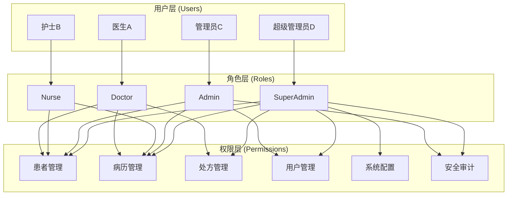
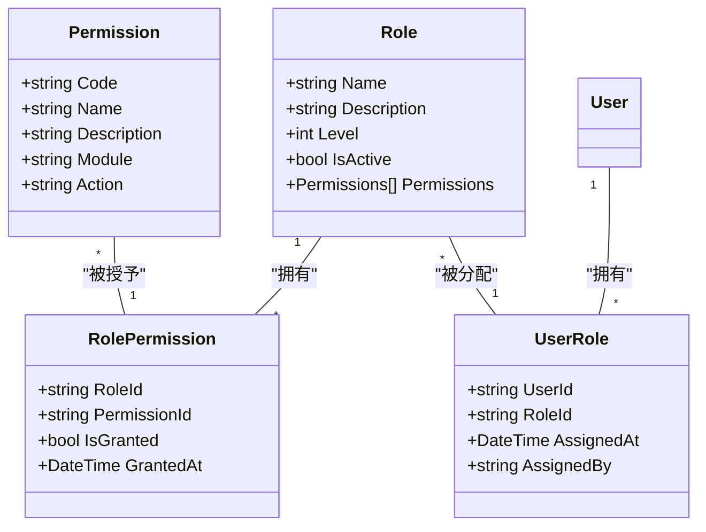

# RBAC权限系统架构设计 (RBAC System Architecture)

> **理解导向**: 深入理解LYBTZYZS基于角色的访问控制(RBAC)系统设计
> **适合人群**: 架构师、安全工程师、技术负责人
> **使用方式**: 深度理解、架构决策、安全设计

## 🏗️ 系统架构概览

### 设计理念

LYBTZYZS RBAC系统基于**最小权限原则**和**职责分离原则**设计，针对中医诊所的组织结构和业务流程进行了专门优化：

1. **最小权限**: 每个用户只获得完成工作所需的最小权限
2. **职责分离**: 不同角色承担不同职责，避免权限过度集中
3. **层次化管理**: 基于诊所组织架构的层次化权限管理
4. **动态权限**: 支持权限的动态调整和实时生效

### RBAC核心模型



### 权限继承关系



## 🏥 中医诊所场景适配

### 组织架构模型

#### 典型中医诊所组织结构
```
诊所
├── 院长 (SuperAdmin)
├── 行政管理部 (Admin)
│   ├── 人事管理员
│   ├── 财务管理员
│   └── IT管理员
├── 医疗部 (Doctor)
│   ├── 内科组
│   │   ├── 主任医师
│   │   ├── 主治医师
│   │   └── 住院医师
│   ├── 外科组
│   ├── 针灸科
│   └── 推拿科
└── 护理部 (Nurse)
    ├── 主管护师
    ├── 护师
    └── 护士
```

### 角色定义矩阵

#### SuperAdmin（超级管理员）
**职责范围**:
- 系统级配置和维护
- 所有用户和权限管理
- 数据备份和恢复
- 安全审计和监控
- 第三方系统集成

**权限列表**:
```json
{
  "system": [
    "system.config.read",
    "system.config.write",
    "system.backup.create",
    "system.backup.restore",
    "system.monitor.view",
    "system.audit.view"
  ],
  "users": [
    "users.create",
    "users.read",
    "users.update",
    "users.delete",
    "users.assign_role",
    "users.reset_password"
  ],
  "medical": [
    "patients.read",
    "patients.create",
    "patients.update",
    "medical_cases.read",
    "prescriptions.read"
  ]
}
```

#### Admin（诊所管理员）
**职责范围**:
- 诊所内用户管理（医生、护士）
- 基础数据维护
- 报表查看和导出
- 诊所配置管理
- 排班管理

**权限列表**:
```json
{
  "users": [
    "users.create",
    "users.read",
    "users.update",
    "users.delete",
    "users.assign_role",
    "users.reset_password"
  ],
  "data": [
    "data.medicine.read",
    "data.formula.read",
    "data.treatment.read"
  ],
  "reports": [
    "reports.patient.read",
    "reports.treatment.read",
    "reports.financial.read",
    "reports.export"
  ],
  "medical": [
    "patients.read",
    "patients.create",
    "patients.update",
    "medical_cases.read"
  ]
}
```

#### Doctor（医生）
**职责范围**:
- 患者诊疗和管理
- 病历创建和更新
- 处方开具和管理
- 诊断信息录入
- 个人资料管理

**权限列表**:
```json
{
  "patients": [
    "patients.read",
    "patients.create",
    "patients.update",
    "patients.search",
    "patients.export"
  ],
  "medical_cases": [
    "medical_cases.read",
    "medical_cases.create",
    "medical_cases.update",
    "medical_cases.template.use"
  ],
  "consultation": [
    "consultation.read",
    "consultation.create",
    "consultation.update",
    "consultation.four_diagnostics"
  ],
  "prescriptions": [
    "prescriptions.read",
    "prescriptions.create",
    "prescriptions.update",
    "prescriptions.sign",
    "prescriptions.print"
  ],
  "personal": [
    "profile.read",
    "profile.update",
    "password.change"
  ]
}
```

#### Nurse（护士）
**职责范围**:
- 患者信息管理
- 基础病历协助
- 预约管理
- 数据录入协助
- 医嘱执行

**权限列表**:
```json
{
  "patients": [
    "patients.read",
    "patients.create",
    "patients.update",
    "patients.search"
  ],
  "medical_cases": [
    "medical_cases.read",
    "medical_cases.create",
    "medical_cases.update_basic",
    "medical_cases.template.use"
  ],
  "consultation": [
    "consultation.read",
    "consultation.create_basic",
    "consultation.assist"
  ],
  "appointments": [
    "appointments.read",
    "appointments.create",
    "appointments.update",
    "appointments.cancel"
  ],
  "personal": [
    "profile.read",
    "profile.update",
    "password.change"
  ]
}
```

## 🔐 权限控制实现

### 数据模型设计

#### 核心实体
```csharp
// 用户实体
public class User
{
    public Guid Id { get; set; }
    public string UserName { get; set; }
    public string RealName { get; set; }
    public string PinYinCode { get; set; }
    public UserRole Role { get; set; }
    public UserStatus Status { get; set; }
    public string Department { get; set; }
    // ... 其他属性
}

// 权限定义
public class Permission
{
    public Guid Id { get; set; }
    public string Code { get; set; }        // 权限代码，如 "patients.create"
    public string Name { get; set; }        // 权限名称，如 "创建患者"
    public string Description { get; set; }  // 权限描述
    public string Module { get; set; }      // 所属模块
    public string Action { get; set; }      // 操作类型
    public int Level { get; set; }          // 权限级别
}

// 角色定义
public class Role
{
    public Guid Id { get; set; }
    public string Name { get; set; }
    public string Description { get; set; }
    public int Level { get; set; }           // 角色级别（数值越大权限越高）
    public bool IsActive { get; set; }
    public DateTime CreatedAt { get; set; }
}

// 角色权限关联
public class RolePermission
{
    public Guid RoleId { get; set; }
    public Guid PermissionId { get; set; }
    public bool IsGranted { get; set; }      // 是否授予权限
    public DateTime GrantedAt { get; set; }
    public string GrantedBy { get; set; }
}
```

### 权限验证机制

#### 基于策略的权限检查
```csharp
// 权限需求特性
[AttributeUsage(AttributeTargets.Class | AttributeTargets.Method, AllowMultiple = true)]
public class RequirePermissionAttribute : Attribute
{
    public string[] Permissions { get; }
    public string Resource { get; }

    public RequirePermissionAttribute(params string[] permissions)
    {
        Permissions = permissions;
    }
}

// 权限检查中间件
public class PermissionAuthorizationMiddleware
{
    private readonly RequestDelegate _next;
    private readonly IPermissionService _permissionService;

    public async Task InvokeAsync(HttpContext context)
    {
        var endpoint = context.GetEndpoint();
        if (endpoint == null)
        {
            await _next(context);
            return;
        }

        // 获取权限需求
        var requiredPermissions = GetRequiredPermissions(endpoint);
        if (requiredPermissions.Any())
        {
            var user = context.GetUser();
            var hasPermission = await _permissionService.HasPermissionsAsync(
                user.Id,
                requiredPermissions
            );

            if (!hasPermission)
            {
                context.Response.StatusCode = 403;
                await context.Response.WriteAsync("权限不足");
                return;
            }
        }

        await _next(context);
    }
}
```

#### 服务层权限控制
```csharp
public class UserService : IUserService
{
    private readonly IPermissionService _permissionService;
    private readonly ICurrentUserService _currentUserService;

    public async Task<ServiceResult<UserDto>> UpdateAsync(Guid userId, UpdateUserRequest request)
    {
        // 获取目标用户
        var targetUser = await _userRepository.GetByIdAsync(userId);
        if (targetUser == null)
            return ServiceResult<UserDto>.Failure("用户不存在");

        // 检查权限
        var currentUserId = _currentUserService.GetUserId();
        var canManageUser = await CanManageUserAsync(currentUserId, targetUser.Role);
        if (!canManageUser)
            return ServiceResult<UserDto>.Failure("您没有权限管理该用户");

        // 执行更新逻辑
        var user = _mapper.Map<UpdateUserRequest, User>(request);
        await _userRepository.UpdateAsync(user);

        // 记录权限操作日志
        await LogPermissionOperationAsync("User.Update", userId, currentUserId);

        return ServiceResult<UserDto>.Success(_mapper.Map<UserDto>(user));
    }

    private async Task<bool> CanManageUserAsync(string currentUserId, UserRole targetRole)
    {
        var currentUser = await _userRepository.GetByIdAsync(Guid.Parse(currentUserId));
        if (currentUser == null) return false;

        // SuperAdmin可以管理所有用户
        if (currentUser.Role == UserRole.SuperAdmin) return true;

        // Admin只能管理Doctor和Nurse
        if (currentUser.Role == UserRole.Admin)
        {
            return targetRole == UserRole.Doctor || targetRole == UserRole.Nurse;
        }

        return false;
    }
}
```

### 前端权限控制

#### WPF权限绑定
```csharp
public class PermissionToVisibilityConverter : IValueConverter
{
    private readonly IPermissionService _permissionService;

    public object Convert(object value, Type targetType, object parameter, CultureInfo culture)
    {
        if (value == null || parameter == null)
            return Visibility.Collapsed;

        var userId = value.ToString();
        var requiredPermission = parameter.ToString();

        var hasPermission = _permissionService.HasPermissionsAsync(userId, new[] { requiredPermission }).Result;
        return hasPermission ? Visibility.Visible : Visibility.Collapsed;
    }

    public object ConvertBack(object value, Type targetType, object parameter, CultureInfo culture)
    {
        throw new NotImplementedException();
    }
}
```

#### XAML权限控制
```xml
<!-- 用户管理按钮 - 需要users.create权限 -->
<Button Content="新建用户"
        Visibility="{Binding CurrentUserId,
                  Converter={StaticResource PermissionToVisibilityConverter},
                  ConverterParameter='users.create'}"
        Command="{Binding CreateUserCommand}" />

<!-- 删除用户按钮 - 需要users.delete权限 -->
Button Content="删除用户"
        Visibility="{Binding CurrentUserId,
                  Converter={StaticResource PermissionToVisibilityConverter},
                  ConverterParameter='users.delete'}"
        Command="{Binding DeleteUserCommand}" />
```

#### ViewModel权限检查
```csharp
public class UserManagementViewModel
{
    private readonly IPermissionService _permissionService;
    private readonly ICurrentUserService _currentUserService;

    public bool CanCreateUsers => HasPermission("users.create");
    public bool CanDeleteUsers => HasPermission("users.delete");
    public bool CanManageAdmins => HasPermission("users.manage_admin");

    private bool HasPermission(string permission)
    {
        var userId = _currentUserService.GetUserId();
        return _permissionService.HasPermissionsAsync(userId, new[] { permission }).Result;
    }

    public async Task InitializeAsync()
    {
        // 异步检查权限
        await RefreshPermissionsAsync();
        OnPropertyChanged(nameof(CanCreateUsers));
        OnPropertyChanged(nameof(CanDeleteUsers));
        OnPropertyChanged(nameof(CanManageAdmins));
    }

    private async Task RefreshPermissionsAsync()
    {
        var userId = _currentUserService.GetUserId();
        var permissions = await _permissionService.GetUserPermissionsAsync(userId);

        // 缓存权限信息
        _permissionCache.Clear();
        foreach (var permission in permissions)
        {
            _permissionCache[permission.Code] = permission.IsGranted;
        }
    }
}
```

## 🔍 权限查询和优化

### 权限查询算法

#### 高效权限检查实现
```csharp
public class PermissionService : IPermissionService
{
    private readonly IMemoryCache _cache;
    private readonly AppDbContext _dbContext;

    public async Task<bool> HasPermissionsAsync(string userId, string[] permissions)
    {
        var cacheKey = $"user_permissions_{userId}";

        // 从缓存获取用户权限
        if (!_cache.TryGetValue(cacheKey, out HashSet<string> userPermissions))
        {
            userPermissions = await GetUserPermissionsAsync(userId);
            _cache.Set(cacheKey, userPermissions, TimeSpan.FromMinutes(30));
        }

        // 检查是否有所有需要的权限
        return permissions.All(permission => userPermissions.Contains(permission));
    }

    private async Task<HashSet<string>> GetUserPermissionsAsync(string userId)
    {
        var user = await _dbContext.Users
            .AsNoTracking()
            .Include(u => u.Role)
            .ThenInclude(r => r.RolePermissions)
            .ThenInclude(rp => rp.Permission)
            .FirstOrDefaultAsync(u => u.Id.ToString() == userId);

        if (user == null) return new HashSet<string>();

        var permissions = new HashSet<string>();

        foreach (var rolePermission in user.Role.RolePermissions)
        {
            if (rolePermission.IsGranted)
            {
                permissions.Add(rolePermission.Permission.Code);
            }
        }

        return permissions;
    }
}
```

#### 权限继承实现
```csharp
public class RoleHierarchyService : IRoleHierarchyService
{
    // 角色层次定义
    private readonly Dictionary<UserRole, UserRole[]> _roleHierarchy = new()
    {
        { UserRole.SuperAdmin, new UserRole[] { UserRole.Admin, UserRole.Doctor, UserRole.Nurse } },
        { UserRole.Admin, new UserRole[] { UserRole.Doctor, UserRole.Nurse } },
        { UserRole.Doctor, Array.Empty<UserRole>() },
        { UserRole.Nurse, Array.Empty<UserRole>() }
    };

    public async Task<bool> CanManageRoleAsync(UserRole currentRole, UserRole targetRole)
    {
        if (currentRole == UserRole.SuperAdmin) return true;

        var manageableRoles = _roleHierarchy[currentRole];
        return manageableRoles.Contains(targetRole);
    }

    public async Task<List<UserRole>> GetManageableRolesAsync(UserRole currentRole)
    {
        if (currentRole == UserRole.SuperAdmin)
        {
            return new List<UserRole> { UserRole.Admin, UserRole.Doctor, UserRole.Nurse };
        }

        return _roleHierarchy[currentRole]?.ToList() ?? new List<UserRole>();
    }
}
```

### 权限缓存策略

#### 多级缓存架构
```csharp
public class PermissionCacheManager
{
    private readonly IMemoryCache _l1Cache;     // 内存缓存（毫秒级）
    private readonly IDistributedCache _l2Cache; // 分布式缓存（Redis，10ms级）

    // L1缓存：用户权限（30分钟）
    public async Task<HashSet<string>> GetUserPermissionsAsync(string userId)
    {
        var cacheKey = $"user_permissions_{userId}";

        // 尝试从L1缓存获取
        if (_l1Cache.TryGetValue(cacheKey, out HashSet<string> permissions))
        {
            return permissions;
        }

        // 尝试从L2缓存获取
        var cachedData = await _l2Cache.GetStringAsync(cacheKey);
        if (!string.IsNullOrEmpty(cachedData))
        {
            permissions = JsonSerializer.Deserialize<HashSet<string>>(cachedData);
            _l1Cache.Set(cacheKey, permissions, TimeSpan.FromMinutes(30));
            return permissions;
        }

        // 从数据库加载
        permissions = await LoadPermissionsFromDatabaseAsync(userId);

        // 写入缓存
        await _l2Cache.SetStringAsync(
            cacheKey,
            JsonSerializer.Serialize(permissions),
            new DistributedCacheEntryOptions { AbsoluteExpirationRelativeToNow = TimeSpan.FromHours(2) }
        );
        _l1Cache.Set(cacheKey, permissions, TimeSpan.FromMinutes(30));

        return permissions;
    }

    // 权限变更时清除缓存
    public async Task InvalidateUserPermissionsAsync(string userId)
    {
        var cacheKey = $"user_permissions_{userId}";
        _l1Cache.Remove(cacheKey);
        await _l2Cache.RemoveAsync(cacheKey);
    }
}
```

## 📊 权限审计和监控

### 操作审计

#### 权限操作日志
```csharp
public class PermissionAuditService
{
    public async Task LogPermissionOperationAsync(
        string operation,
        string resource,
        string resourceId,
        string userId)
    {
        var audit = new PermissionAuditLog
        {
            Id = Guid.NewGuid(),
            Operation = operation,
            Resource = resource,
            ResourceId = resourceId,
            UserId = userId,
            UserAgent = GetCurrentUserAgent(),
            IPAddress = GetClientIPAddress(),
            Timestamp = DateTime.UtcNow,
            Success = true
        };

        await _auditRepository.AddAsync(audit);
    }

    public async Task LogPermissionDeniedAsync(
        string requiredPermission,
        string operation,
        string userId)
    {
        var audit = new PermissionDeniedLog
        {
            Id = Guid.NewGuid(),
            RequiredPermission = requiredPermission,
            Operation = operation,
            UserId = userId,
            UserAgent = GetCurrentUserAgent(),
            IPAddress = GetClientIPAddress(),
            Timestamp = DateTime.UtcNow
        };

        await _auditRepository.AddAsync(audit);
    }
}
```

#### 权限使用统计
```csharp
public class PermissionUsageAnalyzer
{
    public async Task<PermissionUsageReport> AnalyzePermissionUsageAsync(
        DateTime startDate,
        DateTime endDate)
    {
        var auditLogs = await _auditRepository
            .GetByDateRangeAsync(startDate, endDate);

        var report = new PermissionUsageReport
        {
            Period = $"{startDate:yyyy-MM-dd} 到 {endDate:yyyy-MM-dd}",
            TotalOperations = auditLogs.Count,
            SuccessfulOperations = auditLogs.Count(l => l.Success),
            FailedOperations = auditLogs.Count(l => !l.Success),
            UsageByPermission = auditLogs
                .GroupBy(l => l.RequiredPermission)
                .Select(g => new PermissionUsage
                {
                    Permission = g.Key,
                    UsageCount = g.Count(),
                    SuccessRate = (double)g.Count(l => l.Success) / g.Count() * 100
                })
                .OrderByDescending(p => p.UsageCount)
                .ToList(),
            TopUsers = auditLogs
                .GroupBy(l => l.UserId)
                .Select(g => new UserUsage
                {
                    UserId = g.Key,
                    OperationCount = g.Count(),
                    UniquePermissions = g.Select(l => l.RequiredPermission).Distinct().Count()
                })
                .OrderByDescending(u => u.OperationCount)
                .Take(10)
                .ToList()
        };

        return report;
    }
}
```

### 权限监控和告警

#### 异常权限行为检测
```csharp
public class PermissionAnomalyDetector
{
    public async Task<List<PermissionAlert>> DetectAnomaliesAsync(TimeSpan timeWindow)
    {
        var alerts = new List<PermissionAlert>();
        var auditLogs = await _auditRepository.GetRecentLogsAsync(timeWindow);

        // 检测权限提升异常
        var privilegeEscalations = auditLogs
            .Where(l => l.Operation.StartsWith("Role.Upgrade"))
            .GroupBy(l => l.UserId)
            .Where(g => g.Count() > 3)
            .Select(g => new PermissionAlert
            {
                Type = AlertType.PrivilegeEscalation,
                UserId = g.Key,
                Count = g.Count(),
                TimeWindow = timeWindow,
                Severity = AlertSeverity.High
            });

        alerts.AddRange(privilegeEscalations);

        // 检测批量权限操作
        var bulkOperations = auditLogs
            .GroupBy(l => new { l.UserId, l.Timestamp.Date })
            .Where(g => g.Count() > 50)
            .Select(g => new PermissionAlert
            {
                Type = AlertType.BulkOperations,
                UserId = g.Key.UserId,
                Count = g.Count(),
                TimeWindow = timeWindow,
                Severity = AlertSeverity.Medium
            });

        alerts.AddRange(bulkOperations);

        return alerts;
    }
}
```

## 🚨 安全最佳实践

### 最小权限原则实现

#### 动态权限分配
```csharp
public class DynamicPermissionService
{
    public async Task<bool> HasPermissionAsync(string userId, string permission, string context)
    {
        // 获取用户基础权限
        var basePermissions = await _permissionService.GetUserPermissionsAsync(userId);
        if (!basePermissions.Contains(permission))
            return false;

        // 根据上下文进行额外检查
        return await CheckContextualPermissionsAsync(userId, permission, context);
    }

    private async Task<bool> CheckContextualPermissionsAsync(
        string userId,
        string permission,
        string context)
    {
        switch (permission)
        {
            case "patients.delete":
                // 检查是否可以删除该患者（有关联病历的不能删除）
                var patientId = ExtractResourceId(context);
                return await CanDeletePatientAsync(userId, patientId);

            case "medical_cases.modify":
                // 检查病历修改权限（只能修改自己的或本科室的病历）
                var medicalCaseId = ExtractResourceId(context);
                return await CanModifyMedicalCaseAsync(userId, medicalCaseId);

            default:
                return true;
        }
    }
}
```

### 权限分离和验证

#### 操作权限验证
```csharp
public class SeparationOfDutiesService
{
    public async Task<bool> ValidateOperationAsync(
        string userId,
        string operation,
        Dictionary<string, object> context)
    {
        // 检查操作是否违反职责分离原则
        var violations = new List<string>();

        // 检查处方审核分离
        if (operation == "prescriptions.approve")
        {
            var prescriptionId = context.GetValueOrDefault("prescriptionId")?.ToString();
            if (await IsPrescriptionCreatorAsync(userId, prescriptionId))
            {
                violations.Add("不能审核自己创建的处方");
            }
        }

        // 检查财务操作分离
        if (operation == "financial.approve_payment")
        {
            var paymentId = context.GetValueOrDefault("paymentId")?.ToString();
            if (await IsPaymentCreatorAsync(userId, paymentId))
            {
                violations.Add("不能批准自己创建的付款");
            }
        }

        return violations.Count == 0;
    }
}
```

## 🔮 扩展性设计

### 权限系统扩展

#### 插件化权限验证
```csharp
public interface IPermissionValidator
{
    string Name { get; }
    Task<PermissionValidationResult> ValidateAsync(
        string userId,
        string permission,
        Dictionary<string, object> context);
}

public class MedicalPermissionValidator : IPermissionValidator
{
    public string Name => "Medical";

    public async Task<PermissionValidationResult> ValidateAsync(
        string userId,
        string permission,
        Dictionary<string, object> context)
    {
        // 医疗相关的特殊权限验证逻辑
        switch (permission)
        {
            case "prescriptions.controlled_substance":
                return await ValidateControlledSubstancePermissionAsync(userId, context);

            case "medical_cases.sensitive_info":
                return await ValidateSensitiveInfoAccessAsync(userId, context);

            default:
                return PermissionValidationResult.Success();
        }
    }
}
```

#### 动态权限配置
```csharp
public class DynamicPermissionConfiguration
{
    public async Task<bool> CreateCustomPermissionAsync(
        CustomPermissionDefinition definition)
    {
        // 验证权限定义
        var validationResult = ValidatePermissionDefinition(definition);
        if (!validationResult.IsValid)
        {
            throw new InvalidOperationException(validationResult.ErrorMessage);
        }

        // 创建权限
        var permission = new Permission
        {
            Id = Guid.NewGuid(),
            Code = definition.Code,
            Name = definition.Name,
            Description = definition.Description,
            Module = definition.Module,
            Action = definition.Action,
            Level = definition.Level,
            IsCustom = true,
            CreatedAt = DateTime.UtcNow
        };

        await _permissionRepository.AddAsync(permission);

        // 自动分配给指定角色
        if (definition.DefaultRoles?.Any() == true)
        {
            await AssignPermissionToRolesAsync(permission.Id, definition.DefaultRoles);
        }

        return true;
    }
}
```

## 🎯 设计决策分析

### 权限粒度选择

**决策**: 选择中等粒度权限控制

**理由分析**:
1. **业务匹配**: 中医诊所的业务复杂度适中，中等粒度最合适
2. **管理成本**: 细粒度权限管理复杂，粗粒度权限控制不足
3. **扩展性**: 中等粒度便于未来功能扩展
4. **用户体验**: 权限检查性能良好，用户感知不到延迟

**权限粒度对比**:
| 粒度级别 | 示例 | 优点 | 缺点 |
|----------|------|------|------|
| 粗粒度 | 医疗权限 | 简单易管理 | 控制不够精确 |
| 中粒度 | 患者创建、病历更新 | 平衡性好 | 需要合理设计 |
| 细粒度 | 患者姓名修改、病历删除 | 精确控制 | 管理复杂 |

### 权限缓存策略

**决策**: 采用L1+L2多级缓存架构

**理由分析**:
1. **性能要求**: 权限检查频繁，需要毫秒级响应
2. **一致性要求**: 权限变更需要及时生效
3. **扩展性**: 支持集群部署的缓存同步
4. **可靠性**: 缓存故障不影响权限检查

**缓存策略对比**:
| 策略 | 响应时间 | 一致性 | 复杂度 | 可靠性 |
|------|----------|--------|--------|--------|
| 无缓存 | 50ms | 强 | 低 | 高 |
| 单层缓存 | 5ms | 中 | 中 | 中 |
| 多级缓存 | 2ms | 中-高 | 高 | 中-高 |

### 权限审计深度

**决策**: 完整记录所有权限相关操作

**理由分析**:
1. **合规要求**: 医疗行业需要完整的操作审计
2. **安全分析**: 便于分析异常权限行为
3. **责任追溯**: 问题发生时能够准确定位责任
4. **流程优化**: 通过数据分析优化权限分配

## 📚 总结

LYBTZYZS RBAC权限系统设计体现了**安全性和实用性平衡**的设计理念：

1. **层次化权限管理**: 基于组织架构的权限层次设计
2. **最小权限原则**: 确保用户只获得必需的权限
3. **动态权限控制**: 支持权限的实时调整和验证
4. **全面审计监控**: 完整记录和监控权限使用情况
5. **高性能实现**: 多级缓存确保权限检查的高效性

这种设计既满足了中医诊所的实际业务需求，又保证了系统的安全性和可扩展性，是一个成功的RBAC系统实现案例。

## 🔗 相关资源

### 设计文档
- [认证系统架构](auth-system-design.md)
- [安全设计规范](security-design.md)
- [微服务权限设计](microservices-security.md)

### 实现细节
- [权限服务实现](../technology/permission-service.md)
- [JWT权限集成](../technology/jwt-permission-integration.md)
- [权限缓存优化](../technology/permission-caching.md)

### 外部参考
- [NIST RBAC标准](https://csrc.nist.gov/News/2020/NIST-Releases-Final-Report-on-Role-Based-Access-Control/)
- [OWASP权限控制指南](https://owasp.org/www-project-access-control/)
- [ASP.NET Core授权文档](https://docs.microsoft.com/aspnet/core/security/authorization/)

---

**文档类型**: Explanation Architecture
**架构版本**: v1.0
**更新时间**: 2025-11-22
**维护团队**: 架构组 + 安全团队
**设计原则**: 最小权限、职责分离、层次管理