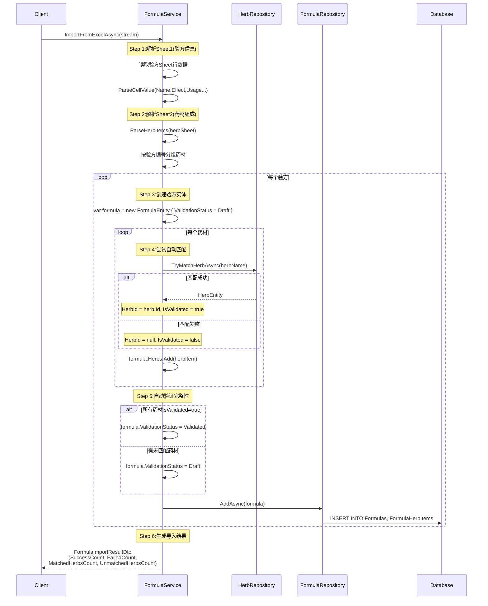
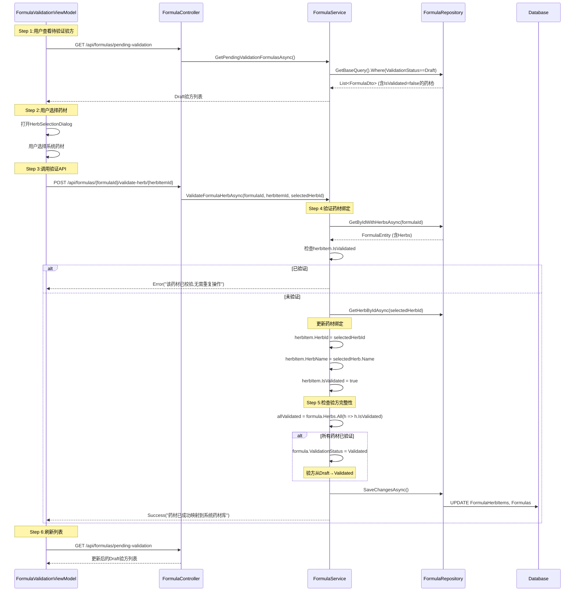
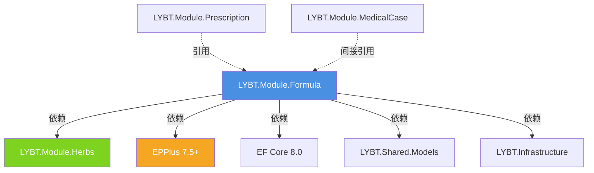

# LYBT.Module.Formula - Server端验方管理模块架构设计

## 文档元信息

| 属性 | 值 |
|------|-----|
| 文档类型 | 架构设计文档 |
| 目标读者 | Server端开发人员、架构师、技术负责人 |
| 层级范围 | Server端 - LYBT.Module.Formula模块 |
| 最后更新 | 2025-10-30 |
| 文档版本 | v1.0 |
| 对齐文档 | [Client端验方管理设计](../client/formula-design.md) |

---

## 第1章：Formula模块定位与职责

### 1.1 核心定位

**LYBT.Module.Formula** 是Server端的**验方模板管理模块**,在三层架构中扮演以下角色:

```
核心定位:
┌─────────────────────────────────────────────────────────┐
│ Formula(验方/方剂)                                      │
│ ┌─────────────────────────────────────────────────────┐ │
│ │ 📦 验方模板容器(Template Container)                 │ │
│ │   - 验方定义(名称、功效、用法)                       │ │
│ │   - 药材组成(FormulaHerbItem列表)                   │ │
│ │   - 延迟绑定(HerbId可空,支持导入后验证)             │ │
│ │   - 验证状态(Draft/Validated)                        │ │
│ └─────────────────────────────────────────────────────┘ │
│                                                          │
│ 🔐 验证管理中心                                          │
│   - 导入验证:自动匹配药材 + 人工补充校验                 │
│   - 状态迁移:Draft → Validated                          │
│   - 药材绑定:ValidateFormulaHerbAsync                   │
│   - 完整性验证:所有药材IsValidated = true才能完成       │
│                                                          │
│ 🔗 跨模块协作                                            │
│   - 关联Herbs模块(药材基础数据)                          │
│   - 支持Prescription模块(处方引用验方)                  │
│   - Excel导入导出(EPPlus,主从表格式)                    │
│   - 批量操作(最大100条记录/批次)                         │
└─────────────────────────────────────────────────────────┘
```

**三层架构定位**:
```
Controller层(FormulaController):
  ├── 14个API端点(CRUD、导入导出、验证、批量删除...)
  ├── Swagger文档注解([SwaggerOperation])
  └── HTTP响应封装(Ok、CreatedAtAction、NoContent)

Service层(FormulaService):
  ├── 14个业务方法(完整验方生命周期管理)
  ├── Excel导入/导出(EPPlus 7.5+)
  ├── 延迟绑定验证(TryMatchHerbAsync + ValidateFormulaHerbAsync)
  ├── 批量操作(BatchDeleteAsync,最大100条)
  └── 模板管理(GenerateImportTemplate)

Repository层(FormulaRepository):
  ├── 7个数据方法(CRUD、分页查询、权限过滤)
  ├── GetBaseQuery(统一Include策略+软删除过滤)
  ├── GetByUserIdAsync(权限逻辑:userId OR IsShared)
  └── GetPendingValidationFormulasAsync(Draft状态验方)
```

### 1.2 核心职责

| 职责类别 | 具体职责 | 实现位置 |
|---------|---------|---------|
| **验方模板管理** | 创建、修改、删除验方定义 | FormulaService.CreateAsync, UpdateAsync |
| **药材组成管理** | 管理验方中的药材列表(FormulaHerbItem) | FormulaEntity.Herbs |
| **延迟绑定验证** | 导入时HerbId可空,后续人工匹配 | ValidateFormulaHerbAsync |
| **Excel导入导出** | Sheet1验方+Sheet2药材的主从导入/导出 | ImportFromExcelAsync, ExportAsync |
| **自动匹配** | 导入时自动匹配药材库 | TryMatchHerbAsync |
| **批量操作** | 批量删除(最大100条/次) | BatchDeleteAsync |
| **权限控制** | 验方共享(IsShared)与用户隔离 | GetByUserIdAsync |
| **模板生成** | 生成Excel导入模板 | GenerateImportTemplate |

### 1.3 设计原则

**延迟绑定原则**(Issue #1348):
1. **导入阶段宽松**:允许HerbId=null,保存OriginalHerbName
2. **自动匹配优先**:TryMatchHerbAsync尝试自动绑定
3. **人工校验补充**:未匹配的药材通过FormulaValidationViewModel手动绑定
4. **完整性验证**:只有所有药材IsValidated=true,验方状态才能从Draft→Validated

**代码示例**:
```csharp
// ❌ 错误:导入时强制要求HerbId(无法处理老系统数据)
var herbItem = new FormulaHerbItem
{
    HerbId = Guid.Parse(herbId), // 若找不到药材则导入失败
    HerbName = "当归",
    Quantity = 10
};

// ✅ 正确:延迟绑定允许先保存原始名称
var herbItem = new FormulaHerbItem
{
    HerbId = matchedHerb?.Id, // 可空,自动匹配成功则填充
    OriginalHerbName = "当归", // 保留原始名称
    HerbName = matchedHerb?.Name ?? "当归",
    IsValidated = matchedHerb != null, // 标记是否已验证
    Quantity = 10
};

// 后续人工校验
await _formulaService.ValidateFormulaHerbAsync(
    formulaId: formula.Id,
    herbItemId: herbItem.Id,
    selectedHerbId: userSelectedHerbId
);
```

---

## 第2章:核心架构设计(三层架构)

### 2.1 架构层次图

```
┌─────────────────────────────────────────────────────────────────┐
│ Controller层 - FormulaController                                │
│ ┌─────────────────────────────────────────────────────────────┐ │
│ │ • 14个API端点(POST/GET/PUT/DELETE)                           │ │
│ │ • 导入导出:[HttpPost("import")],[HttpGet("export")]          │ │
│ │ • 验证端点:[HttpPost("{id}/validate-herb/{herbItemId}")]     │ │
│ │ • 批量操作:[HttpPost("batch-delete")]                        │ │
│ │ • Swagger注解([SwaggerOperation])                           │ │
│ └─────────────────────────────────────────────────────────────┘ │
└─────────────────────────────────────────────────────────────────┘
                               ↓
┌─────────────────────────────────────────────────────────────────┐
│ Service层 - FormulaService                                      │
│ ┌─────────────────────────────────────────────────────────────┐ │
│ │ 核心业务逻辑(14个方法)                                       │ │
│ │ ├── CreateAsync() - 创建验方                                 │ │
│ │ ├── UpdateAsync() - 更新验方                                 │ │
│ │ ├── DeleteAsync() - 软删除验方                               │ │
│ │ ├── BatchDeleteAsync() - 批量删除(最大100条)                 │ │
│ │ ├── GetByIdAsync() - 查询验方详情                            │ │
│ │ ├── GetPagedAsync() - 分页查询(支持Category过滤)             │ │
│ │ ├── GetTemplatesAsync() - 获取验方模板                       │ │
│ │ ├── SearchAsync() - 关键词搜索                               │ │
│ │ ├── CloneFormulaAsync() - 克隆验方(不含药材)                 │ │
│ │ ├── ImportFromExcelAsync() - Excel导入(主从表)               │ │
│ │ ├── ExportAsync() - Excel导出                                │ │
│ │ ├── GenerateImportTemplate() - 生成导入模板                  │ │
│ │ ├── ValidateFormulaHerbAsync() - 验证药材绑定(Issue #1348)   │ │
│ │ └── GetPendingValidationFormulasAsync() - 获取待验证验方     │ │
│ │                                                               │ │
│ │ 辅助方法                                                       │ │
│ │ ├── TryMatchHerbAsync() - 自动匹配药材库                     │ │
│ │ ├── ParseHerbItems() - 解析Excel药材Sheet                   │ │
│ │ └── ParseCellValue() - Excel单元格解析                       │ │
│ └─────────────────────────────────────────────────────────────┘ │
└─────────────────────────────────────────────────────────────────┘
                               ↓
┌─────────────────────────────────────────────────────────────────┐
│ Repository层 - FormulaRepository                                │
│ ┌─────────────────────────────────────────────────────────────┐ │
│ │ 数据访问层(7个方法)                                          │ │
│ │ ├── GetBaseQuery() - 统一查询(Include Herbs+软删除)          │ │
│ │ ├── GetTemplatesAsync() - 获取启用的验方模板                 │ │
│ │ ├── GetByIdWithHerbsAsync() - 按ID查询含药材                 │ │
│ │ ├── GetPagedWithDetailsAsync() - 分页查询(Name+Effect搜索)   │ │
│ │ ├── GetByUserIdAsync() - 按用户ID+共享过滤                   │ │
│ │ ├── GetSharedFormulasAsync() - 获取共享验方                  │ │
│ │ └── GetByCategoryAsync() - 按分类查询                        │ │
│ └─────────────────────────────────────────────────────────────┘ │
└─────────────────────────────────────────────────────────────────┘
                               ↓
┌─────────────────────────────────────────────────────────────────┐
│ 数据库层 - Entity Framework Core 8                              │
│ ┌─────────────────────────────────────────────────────────────┐ │
│ │ FormulaModel(验方实体)                                        │ │
│ │ ├── Id (Guid, Primary Key)                                   │ │
│ │ ├── Name (string, Required, 验方名称)                        │ │
│ │ ├── Effect (string?, 功效)                                   │ │
│ │ ├── Usage (string?, 用法)                                    │ │
│ │ ├── Property (string?, 性味归经)                             │ │
│ │ ├── ValidationStatus (enum: Draft/Validated)                │ │
│ │ ├── IsShared (bool, 是否共享)                                │ │
│ │ ├── Category (string?, 分类)                                 │ │
│ │ ├── UserId (Guid?, 创建用户ID)                               │ │
│ │ └── Herbs (List<FormulaHerbItem>, 1:N)                       │ │
│ │                                                               │ │
│ │ FormulaHerbItem(药材明细实体)                                 │ │
│ │ ├── Id (Guid, Primary Key)                                   │ │
│ │ ├── FormulaId (Guid, Foreign Key)                            │ │
│ │ ├── HerbId (Guid?, Nullable,延迟绑定)                        │ │
│ │ ├── OriginalHerbName (string?, 原始名称)                     │ │
│ │ ├── IsValidated (bool, 是否已验证)                           │ │
│ │ ├── HerbName (string, Required, 药材名称)                    │ │
│ │ ├── Quantity (int, 剂量)                                      │ │
│ │ ├── Unit (string, 单位,默认"g")                              │ │
│ │ ├── ProcessingMethod (string?, 炮制方法)                     │ │
│ │ └── Usage (string?, 用法说明)                                │ │
│ └─────────────────────────────────────────────────────────────┘ │
└─────────────────────────────────────────────────────────────────┘
```

### 2.2 IFormulaService接口定义

**完整接口方法(14个)**:

```csharp
public interface IFormulaService
{
    // ========== 基础CRUD(5个方法) ==========

    /// <summary>
    /// 创建验方
    /// </summary>
    /// <param name="dto">创建验方DTO</param>
    /// <returns>创建成功的验方DTO</returns>
    Task<ServiceResult<FormulaDto>> CreateAsync(FormulaCreateDto dto);

    /// <summary>
    /// 按ID查询验方详情(含药材组成)
    /// </summary>
    Task<ServiceResult<FormulaDto>> GetByIdAsync(Guid id);

    /// <summary>
    /// 更新验方
    /// </summary>
    Task<ServiceResult<FormulaDto>> UpdateAsync(Guid id, FormulaUpdateDto dto);

    /// <summary>
    /// 删除验方(软删除)
    /// </summary>
    Task<ServiceResult> DeleteAsync(Guid id);

    /// <summary>
    /// 批量删除验方(最大100条/批次,Issue #1169)
    /// </summary>
    /// <param name="ids">验方ID列表(最大100个)</param>
    Task<ServiceResult<BatchOperationResultDto>> BatchDeleteAsync(List<Guid> ids);

    // ========== 查询方法(4个) ==========

    /// <summary>
    /// 分页查询验方列表
    /// </summary>
    /// <param name="pageNumber">页码(从1开始)</param>
    /// <param name="pageSize">每页数量</param>
    /// <param name="keyword">可选:关键词搜索(Name+Effect)</param>
    /// <param name="category">可选:按分类过滤(内存过滤)</param>
    Task<ServiceResult<PagedResult<FormulaDto>>> GetPagedAsync(
        int pageNumber,
        int pageSize,
        string? keyword = null,
        string? category = null);

    /// <summary>
    /// 获取验方模板列表(启用状态的验方)
    /// </summary>
    Task<ServiceResult<List<FormulaDto>>> GetTemplatesAsync();

    /// <summary>
    /// 搜索验方(关键词搜索Name+Effect)
    /// </summary>
    Task<ServiceResult<List<FormulaDto>>> SearchAsync(string keyword);

    /// <summary>
    /// 获取待验证的验方列表(Draft状态,Issue #1349)
    /// </summary>
    Task<ServiceResult<List<FormulaDto>>> GetPendingValidationFormulasAsync();

    // ========== Excel导入导出(3个方法,Issue #1347 #1166) ==========

    /// <summary>
    /// 从Excel导入验方(主从表格式:Sheet1验方+Sheet2药材)
    /// </summary>
    /// <param name="stream">Excel文件流</param>
    /// <param name="fileName">文件名(可选)</param>
    /// <returns>导入结果(成功数、失败数、匹配统计)</returns>
    Task<ServiceResult<FormulaImportResultDto>> ImportFromExcelAsync(
        Stream stream,
        string? fileName = null);

    /// <summary>
    /// 导出验方到Excel
    /// </summary>
    /// <param name="formulaIds">要导出的验方ID列表(空则导出所有)</param>
    /// <returns>Excel文件流</returns>
    Task<ServiceResult<byte[]>> ExportAsync(List<Guid>? formulaIds = null);

    /// <summary>
    /// 生成Excel导入模板(包含示例数据和说明)
    /// </summary>
    /// <returns>模板文件流</returns>
    ServiceResult<byte[]> GenerateImportTemplate();

    // ========== 验证与克隆(2个方法) ==========

    /// <summary>
    /// 验证药材绑定(人工校验,Issue #1348 FORMULA-10)
    /// </summary>
    /// <param name="formulaId">验方ID</param>
    /// <param name="herbItemId">药材明细ID</param>
    /// <param name="selectedHerbId">用户选择的药材ID</param>
    Task<ServiceResult> ValidateFormulaHerbAsync(
        Guid formulaId,
        Guid herbItemId,
        Guid selectedHerbId);

    /// <summary>
    /// 克隆验方(复制核心信息,不复制药材组成)
    /// </summary>
    Task<ServiceResult<FormulaDto>> CloneFormulaAsync(Guid sourceId);
}
```

---

## 第3章:数据模型设计

### 3.1 FormulaModel实体设计

```csharp
/// <summary>
/// 验方实体 - UltraThink v2.0架构简化版
/// 合并了原BaseFormula和FormulaModel,包含完整的验方信息
/// 验方为模板,不含价格计算,只定义药材组成和剂量
/// </summary>
[Table("Formulas")]
public class Formula : BaseEntity
{
    /// <summary>验方名称</summary>
    [Required]
    [StringLength(100)]
    public string Name { get; set; } = string.Empty;

    /// <summary>功效</summary>
    [StringLength(500)]
    public string? Effect { get; set; }

    /// <summary>用法</summary>
    [StringLength(500)]
    public string? Usage { get; set; }

    /// <summary>备注</summary>
    [StringLength(500)]
    public string? Remark { get; set; }

    /// <summary>性味归经</summary>
    [StringLength(200)]
    public string? Property { get; set; }

    /// <summary>验方状态</summary>
    public CommonStatus Status { get; set; } = CommonStatus.Enabled;

    /// <summary>是否共享</summary>
    public bool IsShared { get; set; } = false;

    /// <summary>
    /// 验证状态 - 标识验方是否已验证(Draft=草稿/未验证,Validated=已验证)
    /// 从老系统导入的验方初始为Draft状态,经过医生审核后标记为Validated
    /// </summary>
    public FormulaValidationStatus ValidationStatus { get; set; } = FormulaValidationStatus.Draft;

    /// <summary>方剂分类</summary>
    [StringLength(50)]
    public string? Category { get; set; }

    /// <summary>方剂类型(经典方/经验方)</summary>
    public FormulaType FormulaType { get; set; } = FormulaType.Experience;

    /// <summary>创建用户ID</summary>
    public Guid? UserId { get; set; }

    /// <summary>药材组成(方剂中包含的药材列表)</summary>
    public List<FormulaHerbItem> Herbs { get; set; } = new();
}
```

**关键字段说明**:

| 字段 | 类型 | 必需 | 说明 |
|-----|------|------|------|
| Name | string | ✅ | 验方名称,最大100字符 |
| Effect | string? | ❌ | 功效,最大500字符 |
| Usage | string? | ❌ | 用法,最大500字符 |
| ValidationStatus | enum | ✅ | Draft/Validated,默认Draft |
| IsShared | bool | ✅ | 是否共享,影响权限控制 |
| Category | string? | ❌ | 分类(内科方/外科方/妇科方/儿科方) |
| UserId | Guid? | ❌ | 创建用户ID,权限隔离 |
| Herbs | List | ✅ | 药材组成(1:N关系) |

### 3.2 FormulaHerbItem实体设计(延迟绑定)

```csharp
/// <summary>
/// 验方明细 - 验方中的药材组成,包含药材名称和剂量
/// 根据用户要求:剂量使用整数,不继承IHerbItem接口
/// 支持延迟绑定:允许先保存原始药材名称,稍后再绑定到药材库
/// </summary>
[Table("FormulaHerbItems")]
public class FormulaHerbItem
{
    [Key]
    public Guid Id { get; set; }

    /// <summary>所属验方ID</summary>
    public Guid FormulaId { get; set; }

    /// <summary>关联的验方实体</summary>
    [ForeignKey("FormulaId")]
    public Formula? Formula { get; set; }

    /// <summary>
    /// 药材ID(可空,支持延迟绑定)
    /// </summary>
    public Guid? HerbId { get; set; }

    /// <summary>
    /// 原始药材名称(从老系统导入时保存,用于延迟绑定)
    /// </summary>
    [StringLength(100)]
    public string? OriginalHerbName { get; set; }

    /// <summary>
    /// 是否已验证绑定(true表示HerbId已绑定到药材库,默认false)
    /// </summary>
    public bool IsValidated { get; set; } = false;

    /// <summary>药材名称</summary>
    [Required]
    [StringLength(100)]
    public string HerbName { get; set; } = string.Empty;

    /// <summary>剂量(整数,根据用户要求)</summary>
    public int Quantity { get; set; } = 1;

    /// <summary>单位(从药材库继承,如:克、钱、两等)</summary>
    [StringLength(16)]
    public string Unit { get; set; } = "g";

    /// <summary>用法说明(该药材的特殊用法)</summary>
    [StringLength(200)]
    public string? Usage { get; set; }

    /// <summary>炮制方法</summary>
    [StringLength(100)]
    public string? ProcessingMethod { get; set; }
}
```

**延迟绑定字段组合**:

| 字段 | 类型 | 必需 | 延迟绑定作用 |
|-----|------|------|-------------|
| HerbId | Guid? | ❌ | **可空**:导入时自动匹配失败则为null |
| OriginalHerbName | string? | ❌ | **保留原始名称**:用于后续人工匹配 |
| IsValidated | bool | ✅ | **验证标志**:true表示HerbId已绑定 |
| HerbName | string | ✅ | **当前名称**:匹配成功后更新为系统名称 |

### 3.3 枚举定义

```csharp
/// <summary>
/// 验方验证状态枚举
/// </summary>
public enum FormulaValidationStatus
{
    /// <summary>草稿/未验证</summary>
    Draft = 1,
    /// <summary>已验证</summary>
    Validated = 2
}

/// <summary>
/// 方剂类型枚举
/// </summary>
public enum FormulaType
{
    /// <summary>经典方</summary>
    Classic = 1,
    /// <summary>经验方</summary>
    Experience = 2
}
```

---

## 第4章:Repository层设计(FormulaRepository)

### 4.1 统一查询策略(GetBaseQuery)

```csharp
/// <summary>
/// 统一的查询方法 - 合并原有的多个查询方法
/// </summary>
private IQueryable<FormulaEntity> GetBaseQuery()
{
    return _dbSet
        .Include(f => f.Herbs) // Eager load herbs,避免N+1查询
        .Where(f => !f.IsDeleted); // 软删除过滤
}
```

**设计原则**:
1. **统一Include策略**:所有查询都Include(f => f.Herbs),避免N+1查询问题
2. **软删除过滤**:统一Where(f => !f.IsDeleted),隐藏已删除记录
3. **简化查询方法**:所有查询方法复用GetBaseQuery,减少代码重复

### 4.2 核心Repository方法(7个)

```csharp
public interface IFormulaRepository : IRepository<FormulaEntity>
{
    /// <summary>
    /// 获取启用的验方模板
    /// </summary>
    Task<List<FormulaEntity>> GetTemplatesAsync();

    /// <summary>
    /// 根据ID获取验方(包含药材组成)
    /// </summary>
    Task<FormulaEntity> GetByIdWithHerbsAsync(Guid id);

    /// <summary>
    /// 获取分页列表(简化版,支持Name+Effect搜索)
    /// </summary>
    Task<PagedResult<FormulaEntity>> GetPagedWithDetailsAsync(
        int pageNumber,
        int pageSize,
        string? keyword = null);

    /// <summary>
    /// 根据用户ID和权限获取验方列表
    /// (简化权限逻辑:自己的+共享的)
    /// </summary>
    Task<List<FormulaEntity>> GetByUserIdAsync(Guid userId);

    /// <summary>
    /// 获取共享的验方列表
    /// </summary>
    Task<List<FormulaEntity>> GetSharedFormulasAsync();

    /// <summary>
    /// 根据类别获取验方列表
    /// </summary>
    Task<List<FormulaEntity>> GetByCategoryAsync(string category);

    /// <summary>
    /// 获取待验证的验方列表(Draft状态)
    /// </summary>
    Task<List<FormulaEntity>> GetPendingValidationFormulasAsync();
}
```

### 4.3 权限过滤逻辑

```csharp
/// <summary>
/// 根据用户ID和权限获取验方列表(合并权限逻辑)
/// </summary>
public async Task<List<FormulaEntity>> GetByUserIdAsync(Guid userId)
{
    return await GetBaseQuery()
        .Where(f => f.UserId == userId || f.IsShared) // 简化权限逻辑:自己的+共享的
        .OrderByDescending(f => f.CreatedAt)
        .ToListAsync();
}
```

**权限规则**:
- **自己的验方**:UserId == currentUserId
- **共享验方**:IsShared == true
- **组合逻辑**:userId OR IsShared(OR关系,简化实现)

---

## 第5章:Service层核心业务逻辑

### 5.1 Excel导入流程(主从表格式,Issue #1347)

**导入格式要求**:
- **Sheet1(验方基本信息)**:
  - 列:验方编号、验方名称、功效、用法、性味归经、备注、是否共享、分类
- **Sheet2(药材组成)**:
  - 列:验方编号、药材名称、用量、单位、炮制方法、用法说明

**核心流程Mermaid图**:



**核心代码片段**:
```csharp
public async Task<ServiceResult<FormulaImportResultDto>> ImportFromExcelAsync(Stream stream, string? fileName = null)
{
    // Step 1: 打开Excel文件
    using var package = new ExcelPackage(stream);
    var formulaSheet = package.Workbook.Worksheets.FirstOrDefault(ws => ws.Name.Contains("验方") || ws.Index == 0);
    var herbSheet = package.Workbook.Worksheets.FirstOrDefault(ws => ws.Name.Contains("药材") || ws.Index == 1);

    // Step 2: 解析药材组成(按验方编号分组)
    var herbItemsByFormulaCode = ParseHerbItems(herbSheet);

    // Step 3: 逐行导入验方
    var result = new FormulaImportResultDto();
    for (int row = 2; row <= formulaRowCount; row++)
    {
        var formula = new FormulaEntity
        {
            Name = ParseCellValue(formulaSheet.Cells[row, 2]),
            ValidationStatus = FormulaValidationStatus.Draft, // 初始状态
            Herbs = new List<FormulaHerbItem>()
        };

        // Step 4: 匹配药材
        foreach (var herbItem in herbItems)
        {
            var matchedHerb = await TryMatchHerbAsync(herbItem.HerbName);

            formula.Herbs.Add(new FormulaHerbItem
            {
                HerbId = matchedHerb?.Id, // Nullable延迟绑定
                HerbName = matchedHerb?.Name ?? herbItem.HerbName,
                OriginalHerbName = herbItem.HerbName, // 保存原始名称
                IsValidated = matchedHerb != null,
                Quantity = herbItem.Quantity
            });

            if (matchedHerb != null)
                result.MatchedHerbsCount++;
            else
                result.UnmatchedHerbsCount++;
        }

        // Step 5: 自动验证完整性
        if (formula.Herbs.Any() && formula.Herbs.All(h => h.IsValidated))
        {
            formula.ValidationStatus = FormulaValidationStatus.Validated;
        }

        await _repository.AddAsync(formula);
        result.SuccessCount++;
    }

    return ServiceResult<FormulaImportResultDto>.Success(result);
}
```

### 5.2 人工验证药材绑定流程(Issue #1348 FORMULA-10)



### 5.3 批量删除逻辑(Issue #1169)

```csharp
/// <summary>
/// 批量删除验方(最大100条记录/批次)
/// </summary>
public async Task<ServiceResult<BatchOperationResultDto>> BatchDeleteAsync(List<Guid> ids)
{
    // Step 1:验证批量大小
    if (ids == null || !ids.Any())
        return ServiceResult<BatchOperationResultDto>.Failure("删除ID列表不能为空");

    if (ids.Count > 100)
        return ServiceResult<BatchOperationResultDto>.Failure("单次批量删除不能超过100条记录");

    var result = new BatchOperationResultDto();

    // Step 2:逐个删除(软删除)
    foreach (var id in ids)
    {
        try
        {
            var formula = await _repository.GetByIdAsync(id);
            if (formula == null)
            {
                result.FailedCount++;
                result.Errors.Add($"验方 {id} 不存在");
                continue;
            }

            formula.IsDeleted = true;
            await _repository.UpdateAsync(formula);
            result.SuccessCount++;
        }
        catch (Exception ex)
        {
            _logger.LogError(ex, "删除验方时发生异常: {FormulaId}", id);
            result.FailedCount++;
            result.Errors.Add($"删除验方 {id} 失败: {ex.Message}");
        }
    }

    return ServiceResult<BatchOperationResultDto>.Success(result);
}
```

---

## 第6章:API端点设计(FormulaController)

### 6.1 RESTful API端点清单(14个)

| HTTP方法 | 路由 | 操作 | Swagger描述 |
|---------|------|------|-----------|
| POST | /api/formulas | CreateAsync | 创建验方 |
| GET | /api/formulas/{id} | GetByIdAsync | 查询验方详情 |
| PUT | /api/formulas/{id} | UpdateAsync | 更新验方 |
| DELETE | /api/formulas/{id} | DeleteAsync | 删除验方 |
| POST | /api/formulas/batch-delete | BatchDeleteAsync | 批量删除(最大100条) |
| GET | /api/formulas | GetPagedAsync | 分页查询 |
| GET | /api/formulas/templates | GetTemplatesAsync | 获取验方模板 |
| GET | /api/formulas/search | SearchAsync | 关键词搜索 |
| POST | /api/formulas/{id}/clone | CloneFormulaAsync | 克隆验方 |
| POST | /api/formulas/import | ImportFromExcelAsync | Excel导入 |
| GET | /api/formulas/export | ExportAsync | Excel导出 |
| GET | /api/formulas/import-template | GenerateImportTemplate | 生成导入模板 |
| POST | /api/formulas/{id}/validate-herb/{herbItemId} | ValidateFormulaHerbAsync | 验证药材绑定 |
| GET | /api/formulas/pending-validation | GetPendingValidationFormulasAsync | 获取待验证验方 |

### 6.2 核心端点示例

```csharp
/// <summary>
/// 验方管理控制器
/// </summary>
[ApiController]
[Route("api/[controller]")]
[ApiVersion("1.0")]
public class FormulaController : ControllerBase
{
    private readonly IFormulaService _formulaService;

    /// <summary>
    /// 创建验方
    /// </summary>
    [HttpPost]
    [SwaggerOperation(Summary = "创建验方", Description = "创建新的验方记录")]
    public async Task<ActionResult<FormulaDto>> CreateAsync([FromBody] FormulaCreateDto dto)
    {
        var result = await _formulaService.CreateAsync(dto);
        if (result.Succeeded)
            return CreatedAtAction(nameof(GetByIdAsync), new { id = result.Data!.Id }, result.Data);
        return BadRequest(result.Message);
    }

    /// <summary>
    /// Excel导入验方(主从表格式)
    /// </summary>
    [HttpPost("import")]
    [SwaggerOperation(Summary = "导入验方", Description = "从Excel文件导入验方(Sheet1验方+Sheet2药材)")]
    public async Task<ActionResult<FormulaImportResultDto>> ImportFromExcelAsync(IFormFile file)
    {
        if (file == null || file.Length == 0)
            return BadRequest("文件不能为空");

        using var stream = file.OpenReadStream();
        var result = await _formulaService.ImportFromExcelAsync(stream, file.FileName);

        if (result.Succeeded)
            return Ok(result.Data);
        return BadRequest(result.Message);
    }

    /// <summary>
    /// 验证药材绑定(Issue #1348 FORMULA-10)
    /// </summary>
    [HttpPost("{id}/validate-herb/{herbItemId}")]
    [SwaggerOperation(Summary = "验证药材绑定", Description = "为未验证的药材绑定系统药材库ID")]
    public async Task<ActionResult> ValidateFormulaHerbAsync(
        Guid id,
        Guid herbItemId,
        [FromBody] ValidateFormulaHerbRequest request)
    {
        var result = await _formulaService.ValidateFormulaHerbAsync(id, herbItemId, request.SelectedHerbId);
        if (result.Succeeded)
            return NoContent();
        return BadRequest(result.Message);
    }

    /// <summary>
    /// 获取待验证的验方列表(Issue #1349)
    /// </summary>
    [HttpGet("pending-validation")]
    [SwaggerOperation(Summary = "获取待验证验方", Description = "获取Draft状态的验方列表(包含未验证的药材)")]
    public async Task<ActionResult<List<FormulaDto>>> GetPendingValidationFormulasAsync()
    {
        var result = await _formulaService.GetPendingValidationFormulasAsync();
        if (result.Succeeded)
            return Ok(result.Data);
        return BadRequest(result.Message);
    }

    /// <summary>
    /// 批量删除验方(Issue #1169)
    /// </summary>
    [HttpPost("batch-delete")]
    [SwaggerOperation(Summary = "批量删除验方", Description = "批量删除验方(最大100条/批次)")]
    public async Task<ActionResult<BatchOperationResultDto>> BatchDeleteAsync([FromBody] List<Guid> ids)
    {
        var result = await _formulaService.BatchDeleteAsync(ids);
        if (result.Succeeded)
            return Ok(result.Data);
        return BadRequest(result.Message);
    }
}
```

---

## 第7章:DTO设计(Shared Contracts)

### 7.1 FormulaDto(主DTO,15+属性)

```csharp
public class FormulaDto : StatusDto, IRemarkable
{
    public string Name { get; set; } = string.Empty;
    public string? Effect { get; set; }
    public string? Usage { get; set; }
    public string? Property { get; set; }
    public string? Remark { get; set; }
    public FormulaValidationStatus ValidationStatus { get; set; } = FormulaValidationStatus.Draft;
    public bool IsShared { get; set; } = false;
    public string? Category { get; set; }
    public Guid? UserId { get; set; }
    public List<FormulaHerbItemDto> Herbs { get; set; } = new();

    // 计算属性
    public int HerbCount => Herbs?.Count ?? 0;
    public decimal TotalPrice => Herbs?.Sum(h => (h.Herb?.Price ?? 0m) * h.Quantity) ?? 0m;
    public string HerbNames
    {
        get
        {
            if (Herbs == null || !Herbs.Any())
                return "暂无药材";

            var herbNames = Herbs
                .Where(h => h.Herb != null)
                .Select(h => $"{h.Herb!.Name}({h.Quantity}g)")
                .ToList();
            return herbNames.Any() ? string.Join("、", herbNames) : "暂无药材";
        }
    }
}
```

### 7.2 FormulaHerbItemDto(延迟绑定支持)

```csharp
public class FormulaHerbItemDto : BaseDto
{
    /// <summary>药材ID(可空,支持延迟绑定)</summary>
    public Guid? HerbId { get; set; }

    /// <summary>原始药材名称(从老系统导入时保存,用于延迟绑定)</summary>
    public string? OriginalHerbName { get; set; }

    /// <summary>是否已验证绑定(true表示HerbId已绑定到药材库)</summary>
    public bool IsValidated { get; set; }

    public string HerbName { get; set; } = string.Empty;
    public decimal Quantity { get; set; }
    public string Unit { get; set; } = string.Empty;
    public string? ProcessingMethod { get; set; }
    public string? Usage { get; set; }

    /// <summary>药材导航属性</summary>
    public HerbDto? Herb { get; set; }
}
```

### 7.3 FormulaImportResultDto(导入结果)

```csharp
public class FormulaImportResultDto : ImportResultDto
{
    public DateTime StartTime { get; set; }
    public DateTime EndTime { get; set; }

    /// <summary>成功匹配药材数</summary>
    public int MatchedHerbsCount { get; set; }

    /// <summary>未匹配药材数</summary>
    public int UnmatchedHerbsCount { get; set; }

    /// <summary>成功的验方列表</summary>
    public List<FormulaDto> SuccessfulFormulas { get; set; } = new();

    /// <summary>失败的记录</summary>
    public List<FormulaImportErrorDto> FailedItems { get; set; } = new();
}
```

---

## 第8章:依赖关系与模块交互

### 8.1 模块依赖图



### 8.2 跨模块交互场景

**场景1:处方引用验方**
```
1. Prescription模块创建处方
2. 调用FormulaService.GetByIdAsync()获取验方模板
3. 复制验方的药材组成到处方
4. 处方保存FormulaId作为关联(可选)
```

**场景2:药材管理同步**
```
1. Herbs模块更新药材信息(Name, Price, Unit)
2. FormulaHerbItem.HerbId关联保持不变
3. 下次查询时通过导航属性Herb获取最新信息
4. 验方模板不受影响(因为只保存HerbId)
```

**场景3:导入验证流程**
```
1. FormulaService调用TryMatchHerbAsync()
2. 内部调用IHerbRepository.GetAllAsync()
3. 按名称模糊匹配药材库
4. 匹配成功:HerbId + IsValidated = true
5. 匹配失败:保留OriginalHerbName,等待人工校验
```

---

## 第9章:技术约束与最佳实践

### 9.1 EPPlus配置(非商业许可证)

```csharp
// 在FormulaService构造函数中设置
ExcelPackage.LicenseContext = LicenseContext.NonCommercial;
```

**注意事项**:
- EPPlus 5.0+需要显式设置LicenseContext
- 本项目为非商业诊所系统,使用NonCommercial许可证
- 商业部署需购买EPPlus商业许可证

### 9.2 软删除vs硬删除

**验方模块采用软删除**:
```csharp
// ✅ 推荐:软删除
public async Task<ServiceResult> DeleteAsync(Guid id)
{
    var formula = await _repository.GetByIdAsync(id);
    formula.IsDeleted = true;
    await _repository.UpdateAsync(formula);
}

// ❌ 不推荐:硬删除(会导致关联数据丢失)
await _repository.DeleteAsync(id);
```

**原因**:
1. 处方可能引用验方(FormulaId外键)
2. 医案历史需要保留验方信息
3. 数据审计和恢复需求

### 9.3 N+1查询问题优化

**问题代码**:
```csharp
// ❌ N+1查询问题
var formulas = await _repository.GetAllAsync();
foreach (var formula in formulas)
{
    var herbs = await _herbRepository.GetByFormulaIdAsync(formula.Id); // N次查询
}
```

**优化方案**:
```csharp
// ✅ Include策略避免N+1查询
private IQueryable<FormulaEntity> GetBaseQuery()
{
    return _dbSet
        .Include(f => f.Herbs) // Eager load,单次查询
        .Where(f => !f.IsDeleted);
}
```

### 9.4 批量操作限制

**批量删除限制**:
```csharp
if (ids.Count > 100)
    return ServiceResult.Failure("单次批量删除不能超过100条记录");
```

**原因**:
1. **性能保护**:避免长时间事务锁定
2. **内存限制**:避免一次性加载过多实体
3. **用户体验**:防止界面长时间无响应

---

## 第10章:未来扩展点

### 10.1 验方统计分析

**扩展方向**:
- 验方使用频率统计
- 药材组合分析
- 疗效跟踪(关联处方和病案)

**接口示例**:
```csharp
/// <summary>
/// 获取验方使用统计
/// </summary>
Task<FormulaUsageStatisticsDto> GetUsageStatisticsAsync(Guid formulaId);
```

### 10.2 智能推荐算法

**扩展方向**:
- 基于症状推荐验方
- 基于协同过滤推荐药材组合
- 药物相互作用检查

### 10.3 版本控制

**扩展方向**:
- 验方历史版本管理
- 变更审计日志
- 版本对比和回滚

**实体扩展**:
```csharp
public class FormulaVersion
{
    public Guid Id { get; set; }
    public Guid FormulaId { get; set; }
    public int Version { get; set; }
    public string Snapshot { get; set; } // JSON序列化
    public DateTime CreatedAt { get; set; }
    public Guid CreatedBy { get; set; }
}
```

---

## 附录A:相关文档链接

- [Client端验方管理设计](../client/formula-design.md) - Client端架构设计
- [Server端三层架构指南](../README.md) - Server端架构总览
- [药材管理设计](herbs-design.md) - Herbs模块架构(Formula依赖)
- [处方管理设计](prescriptions-design.md) - Prescription模块(引用Formula)
- [API快速参考](../../../quick-reference/api-reference.md) - API端点速查
- [Issue #1347](https://github.com/shouqitao/LYBTZYZS/issues/1347) - Excel导入功能
- [Issue #1348](https://github.com/shouqitao/LYBTZYZS/issues/1348) - 药材验证功能
- [Issue #1349](https://github.com/shouqitao/LYBTZYZS/issues/1349) - 待验证验方查询

---

**文档结束** | 最后更新: 2025-10-30 | v1.0
