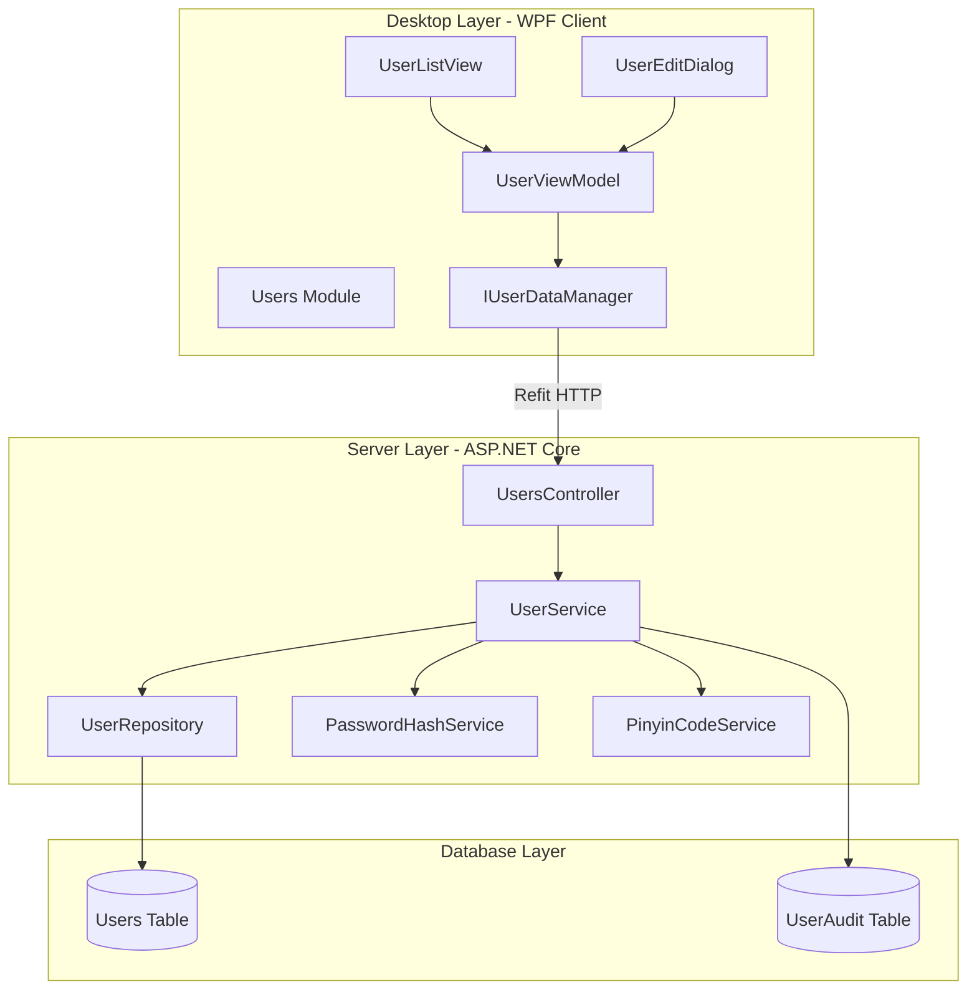
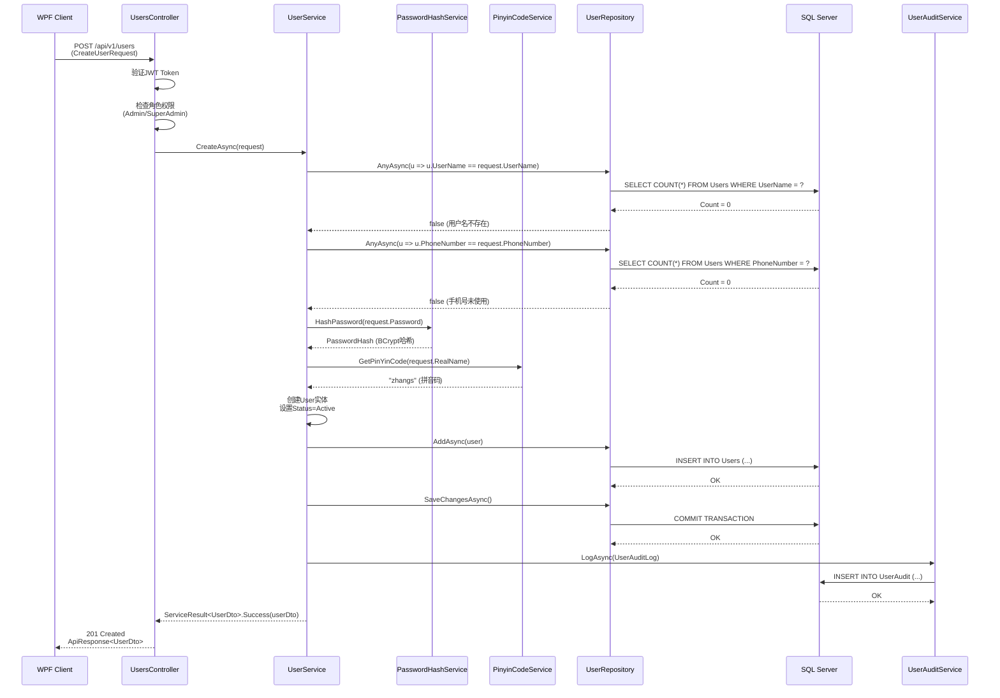
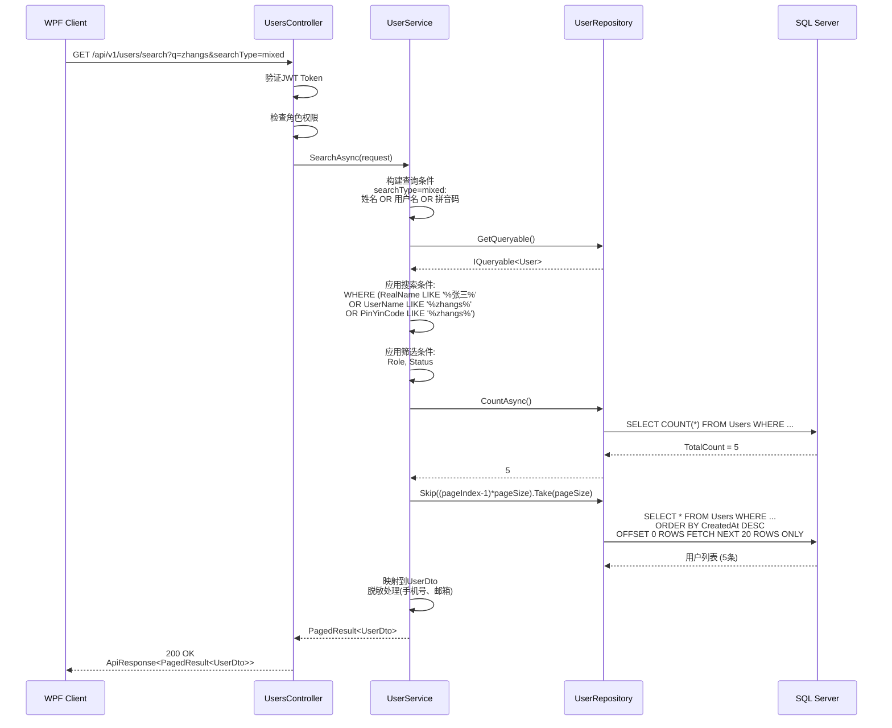
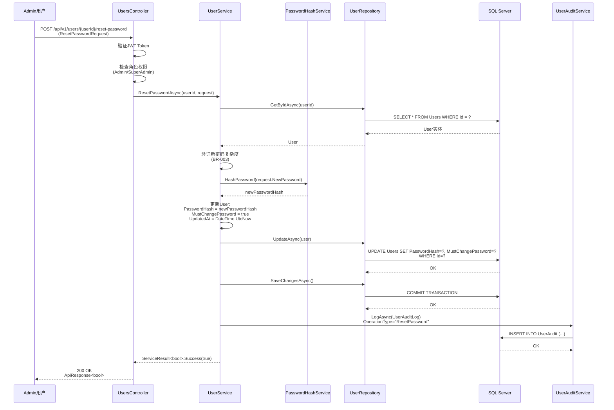
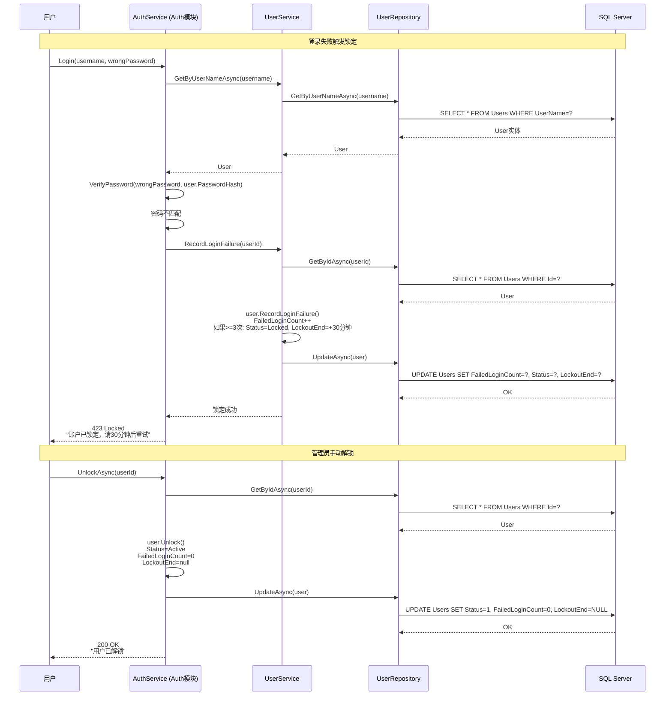
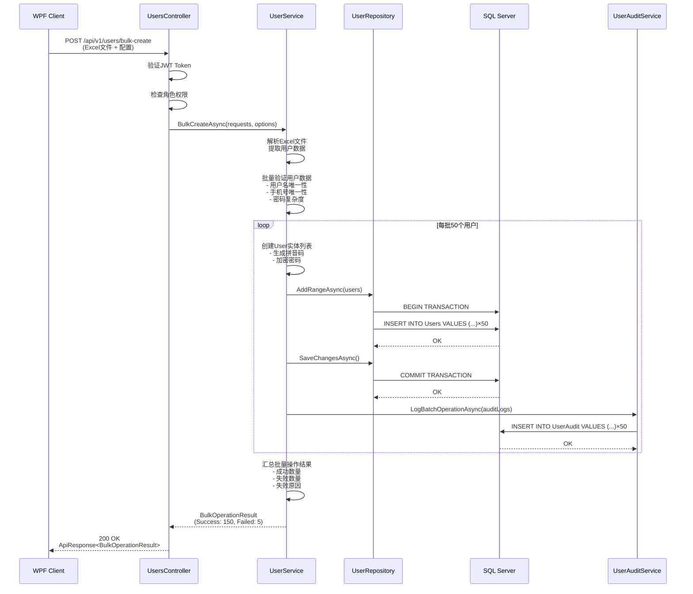

# Users模块架构设计 (Users Module Architecture)

> **文档类型**: Explanation - Architecture Overview
> **适合人群**: 架构师、开发者、技术负责人
> **维护团队**: 架构组
> **最后更新**: 2025-11-22

## 📋 目录

- [1. 模块概述](#1-模块概述)
- [2. 三层架构设计](#2-三层架构设计)
- [3. 核心领域模型](#3-核心领域模型)
- [4. 业务规则体系](#4-业务规则体系)
- [5. 数据流与交互](#5-数据流与交互)
- [6. 技术决策](#6-技术决策)
- [7. 模块依赖关系](#7-模块依赖关系)
- [8. 扩展性设计](#8-扩展性设计)

---

## 1. 模块概述

### 1.1 业务定位

Users模块是LYBTZYZS系统的**基础支撑模块**，负责系统用户的全生命周期管理。作为认证授权体系的核心组成部分，Users模块提供用户账户管理、角色分配、权限控制的基础设施。

**模块特点**：
- **基础支撑**：为所有业务模块提供用户身份验证基础
- **安全第一**：密码加密、账户锁定、操作审计等安全机制
- **中文优化**：拼音码搜索系统，提升中文环境用户体验
- **角色驱动**：基于RBAC的权限控制体系

### 1.2 核心职责

| 职责编号 | 职责名称 | 说明 |
|---------|---------|------|
| **R1** | 用户账户管理 | 创建、更新、删除用户账户，维护用户基本信息 |
| **R2** | 用户状态管理 | 启用/禁用用户、账户锁定/解锁、状态切换 |
| **R3** | 密码安全管理 | 密码加密存储、重置密码、修改密码、密码策略 |
| **R4** | 角色权限分配 | 用户角色分配、权限验证、权限矩阵管理 |
| **R5** | 拼音码搜索 | 智能拼音码生成、全拼/简拼/混合搜索 |
| **R6** | 批量操作支持 | 批量创建、更新、删除、状态管理 |
| **R7** | 操作审计日志 | 记录用户操作历史、安全审计、异常检测 |
| **R8** | 统计分析报告 | 用户统计、活跃度分析、登录行为分析 |

### 1.3 角色体系

```
系统角色层级（按权限从高到低）
├── SuperAdmin（超级管理员）
│   └── 权限：完全控制权限，系统配置、所有用户管理
├── Admin（诊所管理员）
│   └── 权限：诊所内用户管理、基础数据维护、报表查看
├── Doctor（医生）
│   └── 权限：患者诊疗、病历管理、处方开立
└── Nurse（护士）
    └── 权限：患者信息维护、协助医生工作、基础记录
```

### 1.4 模块边界

**包含功能**：
- ✅ 用户基本信息管理（姓名、手机、邮箱、科室、职称等）
- ✅ 用户状态管理（启用、禁用、锁定、解锁）
- ✅ 密码安全管理（加密存储、重置、修改、策略验证）
- ✅ 拼音码自动生成和搜索
- ✅ 批量操作（创建、更新、删除）
- ✅ 用户统计和活跃度分析

**不包含功能**：
- ❌ 身份认证（由Auth模块负责，JWT token生成、验证）
- ❌ 权限规则定义（由RBAC模块负责，权限策略配置）
- ❌ 登录日志记录（由Auth模块负责，登录审计）
- ❌ 组织架构管理（未来扩展，部门/科室层级管理）

---

## 2. 三层架构设计

### 2.1 整体架构图



### 2.2 Desktop层（WPF客户端）

#### Module层 - 委托和路由
```csharp
// src/Client/Desktop/Modules/LYBT.Desktop.Users/UsersModule.cs
public class UsersModule : IModule
{
    private readonly IUserDataManager _userDataManager;
    private readonly IRegionManager _regionManager;

    public void RegisterTypes(IContainerRegistry containerRegistry)
    {
        // 注册ViewModel和DataManager
        containerRegistry.RegisterSingleton<IUserDataManager, UserDataManager>();
        containerRegistry.Register<UserListViewModel>();
        containerRegistry.Register<UserEditViewModel>();

        // 注册导航
        containerRegistry.RegisterForNavigation<UserListView>();
        containerRegistry.RegisterForNavigation<UserEditDialog>();
    }

    public void OnInitialized(IContainerProvider containerProvider)
    {
        var regionManager = containerProvider.Resolve<IRegionManager>();

        // 系统工作台：注册用户管理菜单
        regionManager.RegisterViewWithRegion(
            "SystemMenuRegion",
            () => new MenuItem { Header = "用户管理", Command = NavigateToUsersCommand }
        );
    }
}
```

#### ViewModel层 - MVVM模式
```csharp
// src/Client/Desktop/Modules/LYBT.Desktop.Users/ViewModels/UserListViewModel.cs
public class UserListViewModel : ViewModelBase
{
    private readonly IUserDataManager _userDataManager;
    private readonly IDialogService _dialogService;

    // 数据绑定
    public ObservableCollection<UserDto> Users { get; set; }
    public UserDto SelectedUser { get; set; }
    public string SearchKeyword { get; set; }

    // 分页属性
    public int PageIndex { get; set; } = 1;
    public int PageSize { get; set; } = 20;
    public int TotalCount { get; set; }

    // 筛选条件
    public string? SelectedRole { get; set; }
    public string? SelectedStatus { get; set; }

    // 命令定义
    public ICommand SearchCommand { get; }
    public ICommand CreateUserCommand { get; }
    public ICommand EditUserCommand { get; }
    public ICommand DeleteUserCommand { get; }
    public ICommand ToggleStatusCommand { get; }
    public ICommand ResetPasswordCommand { get; }

    public UserListViewModel(IUserDataManager userDataManager, IDialogService dialogService)
    {
        _userDataManager = userDataManager;
        _dialogService = dialogService;

        SearchCommand = new DelegateCommand(async () => await SearchAsync());
        CreateUserCommand = new DelegateCommand(async () => await CreateUserAsync());
        EditUserCommand = new DelegateCommand<UserDto>(async (user) => await EditUserAsync(user));
        DeleteUserCommand = new DelegateCommand<UserDto>(async (user) => await DeleteUserAsync(user));
        ToggleStatusCommand = new DelegateCommand<UserDto>(async (user) => await ToggleStatusAsync(user));
        ResetPasswordCommand = new DelegateCommand<UserDto>(async (user) => await ResetPasswordAsync(user));
    }

    // 搜索功能（支持拼音码）
    private async Task SearchAsync()
    {
        var request = new UserSearchRequest
        {
            SearchKeyword = SearchKeyword,
            SearchType = "mixed",  // 支持姓名+拼音混合搜索
            Role = SelectedRole,
            Status = SelectedStatus,
            PageIndex = PageIndex,
            PageSize = PageSize
        };

        var response = await _userDataManager.SearchUsersAsync(request);
        if (response.Success)
        {
            Users.Clear();
            foreach (var user in response.Data.Items)
            {
                Users.Add(user);
            }
            TotalCount = response.Data.TotalCount;
        }
    }

    // 创建用户（打开对话框）
    private async Task CreateUserAsync()
    {
        var parameters = new DialogParameters();
        _dialogService.ShowDialog("UserEditDialog", parameters, async result =>
        {
            if (result.Result == ButtonResult.OK)
            {
                await SearchAsync();  // 刷新列表
            }
        });
    }

    // 状态切换（启用/禁用）
    private async Task ToggleStatusAsync(UserDto user)
    {
        var confirmMessage = user.Status == "Active"
            ? $"确认禁用用户 '{user.RealName}' 吗？"
            : $"确认启用用户 '{user.RealName}' 吗？";

        var confirmed = await _dialogService.ShowConfirmAsync(confirmMessage);
        if (!confirmed) return;

        var response = await _userDataManager.ToggleUserStatusAsync(user.Id);
        if (response.Success)
        {
            await SearchAsync();  // 刷新列表
        }
    }
}
```

#### DataManager层 - 数据访问接口
```csharp
// src/Client/Desktop/Modules/LYBT.Desktop.Users/Services/IUserDataManager.cs
public interface IUserDataManager
{
    // 查询操作
    Task<ApiResponse<PagedResult<UserDto>>> GetUsersAsync(UserQueryRequest request);
    Task<ApiResponse<UserDto>> GetUserByIdAsync(Guid userId);
    Task<ApiResponse<PagedResult<UserDto>>> SearchUsersAsync(UserSearchRequest request);

    // 写操作
    Task<ApiResponse<UserDto>> CreateUserAsync(CreateUserRequest request);
    Task<ApiResponse<UserDto>> UpdateUserAsync(Guid userId, UpdateUserRequest request);
    Task<ApiResponse<bool>> DeleteUserAsync(Guid userId, DeleteUserRequest request);

    // 状态管理
    Task<ApiResponse<bool>> EnableUserAsync(Guid userId);
    Task<ApiResponse<bool>> DisableUserAsync(Guid userId, DisableUserRequest request);
    Task<ApiResponse<UserStatusDto>> ToggleUserStatusAsync(Guid userId);
    Task<ApiResponse<bool>> UnlockUserAsync(Guid userId);

    // 密码管理
    Task<ApiResponse<bool>> ResetPasswordAsync(Guid userId, ResetPasswordRequest request);
    Task<ApiResponse<bool>> ChangePasswordAsync(ChangePasswordRequest request);

    // 批量操作
    Task<ApiResponse<BulkOperationResult>> BulkCreateUsersAsync(IEnumerable<CreateUserRequest> requests);
    Task<ApiResponse<BulkOperationResult>> BulkUpdateUsersAsync(BulkUpdateRequest request);
    Task<ApiResponse<BulkOperationResult>> BulkDeleteUsersAsync(BulkDeleteRequest request);

    // 统计分析
    Task<ApiResponse<UserStatistics>> GetStatisticsAsync(StatisticsQueryRequest request);
    Task<ApiResponse<UserActivityReport>> GetActivityReportAsync(ActivityQueryRequest request);
}
```

#### Refit API接口定义
```csharp
// src/Client/Desktop/Core/LYBT.Desktop.Contracts/Api/IUsersApi.cs
public interface IUsersApi
{
    [Get("/api/v1/users")]
    Task<ApiResponse<PagedResult<UserDto>>> GetUsersAsync(
        [Query] int pageIndex = 1,
        [Query] int pageSize = 20,
        [Query] string? sortBy = null,
        [Query] string? sortOrder = null,
        [Query] string? role = null,
        [Query] string? status = null,
        [Query] string? search = null);

    [Get("/api/v1/users/{userId}")]
    Task<ApiResponse<UserDto>> GetUserByIdAsync(Guid userId);

    [Get("/api/v1/users/search")]
    Task<ApiResponse<PagedResult<UserDto>>> SearchAsync(
        [Query] string q,
        [Query] string? searchType = "mixed",
        [Query] string? role = null,
        [Query] string? status = null,
        [Query] int pageIndex = 1,
        [Query] int pageSize = 20);

    [Post("/api/v1/users")]
    Task<ApiResponse<UserDto>> CreateAsync([Body] CreateUserRequest request);

    [Put("/api/v1/users/{userId}")]
    Task<ApiResponse<UserDto>> UpdateAsync(Guid userId, [Body] UpdateUserRequest request);

    [Delete("/api/v1/users/{userId}")]
    Task<ApiResponse<bool>> DeleteAsync(Guid userId, [Body] DeleteUserRequest request);

    [Post("/api/v1/users/{userId}/enable")]
    Task<ApiResponse<bool>> EnableAsync(Guid userId);

    [Post("/api/v1/users/{userId}/disable")]
    Task<ApiResponse<bool>> DisableAsync(Guid userId, [Body] DisableUserRequest request);

    [Post("/api/v1/users/{userId}/toggle-status")]
    Task<ApiResponse<UserStatusDto>> ToggleStatusAsync(Guid userId);

    [Post("/api/v1/users/{userId}/unlock")]
    Task<ApiResponse<bool>> UnlockAsync(Guid userId);

    [Post("/api/v1/users/{userId}/reset-password")]
    Task<ApiResponse<bool>> ResetPasswordAsync(Guid userId, [Body] ResetPasswordRequest request);

    [Post("/api/v1/users/change-password")]
    Task<ApiResponse<bool>> ChangePasswordAsync([Body] ChangePasswordRequest request);

    [Get("/api/v1/users/statistics")]
    Task<ApiResponse<UserStatistics>> GetStatisticsAsync([Query] StatisticsQueryRequest request);
}
```

### 2.3 Server层（ASP.NET Core）

#### Controller层 - RESTful API端点
```csharp
// src/Server/Services/LYBT.WebAPI/Controllers/UsersController.cs
[ApiController]
[Route("api/v1/users")]
[Authorize]  // 所有端点需要认证
public class UsersController : ControllerBase
{
    private readonly IUserService _userService;
    private readonly ILogger<UsersController> _logger;

    public UsersController(IUserService userService, ILogger<UsersController> logger)
    {
        _userService = userService;
        _logger = logger;
    }

    /// <summary>
    /// 获取用户列表（分页查询）
    /// </summary>
    [HttpGet]
    [Authorize(Roles = "Admin,SuperAdmin")]
    public async Task<ActionResult<ApiResponse<PagedResult<UserDto>>>> GetUsers(
        [FromQuery] int pageIndex = 1,
        [FromQuery] int pageSize = 20,
        [FromQuery] string? sortBy = null,
        [FromQuery] string? sortOrder = null,
        [FromQuery] string? role = null,
        [FromQuery] string? status = null,
        [FromQuery] string? search = null)
    {
        var query = new UserQueryRequest
        {
            PageIndex = pageIndex,
            PageSize = pageSize,
            SortBy = sortBy,
            SortOrder = sortOrder,
            Role = role,
            Status = status,
            SearchKeyword = search
        };

        var result = await _userService.GetUsersAsync(query);
        return Ok(ApiResponse<PagedResult<UserDto>>.CreateSuccess(result, "查询成功"));
    }

    /// <summary>
    /// 获取用户详情
    /// </summary>
    [HttpGet("{userId}")]
    public async Task<ActionResult<ApiResponse<UserDto>>> GetById(Guid userId)
    {
        // 权限检查：只能查看自己或需要管理员权限
        var currentUserId = GetCurrentUserId();
        if (userId != currentUserId && !User.IsInRole("Admin") && !User.IsInRole("SuperAdmin"))
        {
            return Forbid();
        }

        var user = await _userService.GetByIdAsync(userId);
        if (user == null)
        {
            return NotFound(ApiResponse<UserDto>.CreateFail("用户不存在"));
        }

        return Ok(ApiResponse<UserDto>.CreateSuccess(user, "查询成功"));
    }

    /// <summary>
    /// 创建新用户
    /// </summary>
    [HttpPost]
    [Authorize(Roles = "Admin,SuperAdmin")]
    public async Task<ActionResult<ApiResponse<UserDto>>> Create([FromBody] CreateUserRequest request)
    {
        // 权限检查：Admin只能创建Doctor和Nurse
        if (User.IsInRole("Admin") && request.Role != "Doctor" && request.Role != "Nurse")
        {
            return Forbid();
        }

        var result = await _userService.CreateAsync(request);
        if (!result.Success)
        {
            return BadRequest(ApiResponse<UserDto>.CreateFail(result.Message));
        }

        return CreatedAtAction(nameof(GetById), new { userId = result.Data.Id },
            ApiResponse<UserDto>.CreateSuccess(result.Data, "用户创建成功"));
    }

    /// <summary>
    /// 更新用户信息
    /// </summary>
    [HttpPut("{userId}")]
    [Authorize(Roles = "Admin,SuperAdmin")]
    public async Task<ActionResult<ApiResponse<UserDto>>> Update(
        Guid userId,
        [FromBody] UpdateUserRequest request)
    {
        var result = await _userService.UpdateAsync(userId, request);
        if (!result.Success)
        {
            return BadRequest(ApiResponse<UserDto>.CreateFail(result.Message));
        }

        return Ok(ApiResponse<UserDto>.CreateSuccess(result.Data, "用户信息更新成功"));
    }

    /// <summary>
    /// 删除用户（软删除）
    /// </summary>
    [HttpDelete("{userId}")]
    [Authorize(Roles = "SuperAdmin")]  // 仅SuperAdmin可删除
    public async Task<ActionResult<ApiResponse<bool>>> Delete(
        Guid userId,
        [FromBody] DeleteUserRequest request)
    {
        var result = await _userService.DeleteAsync(userId, request);
        if (!result.Success)
        {
            return BadRequest(ApiResponse<bool>.CreateFail(result.Message));
        }

        return Ok(ApiResponse<bool>.CreateSuccess(true, "用户删除成功"));
    }

    /// <summary>
    /// 启用用户
    /// </summary>
    [HttpPost("{userId}/enable")]
    [Authorize(Roles = "Admin,SuperAdmin")]
    public async Task<ActionResult<ApiResponse<bool>>> Enable(Guid userId)
    {
        var result = await _userService.EnableAsync(userId);
        return result.Success
            ? Ok(ApiResponse<bool>.CreateSuccess(true, "用户已启用"))
            : BadRequest(ApiResponse<bool>.CreateFail(result.Message));
    }

    /// <summary>
    /// 禁用用户
    /// </summary>
    [HttpPost("{userId}/disable")]
    [Authorize(Roles = "Admin,SuperAdmin")]
    public async Task<ActionResult<ApiResponse<bool>>> Disable(
        Guid userId,
        [FromBody] DisableUserRequest request)
    {
        var result = await _userService.DisableAsync(userId, request);
        return result.Success
            ? Ok(ApiResponse<bool>.CreateSuccess(true, "用户已禁用"))
            : BadRequest(ApiResponse<bool>.CreateFail(result.Message));
    }

    /// <summary>
    /// 切换用户状态（启用/禁用）
    /// </summary>
    [HttpPost("{userId}/toggle-status")]
    [Authorize(Roles = "Admin,SuperAdmin")]
    public async Task<ActionResult<ApiResponse<UserStatusDto>>> ToggleStatus(Guid userId)
    {
        var result = await _userService.ToggleStatusAsync(userId);
        return result.Success
            ? Ok(ApiResponse<UserStatusDto>.CreateSuccess(result.Data, "状态切换成功"))
            : BadRequest(ApiResponse<UserStatusDto>.CreateFail(result.Message));
    }

    /// <summary>
    /// 解锁用户账户
    /// </summary>
    [HttpPost("{userId}/unlock")]
    [Authorize(Roles = "Admin,SuperAdmin")]
    public async Task<ActionResult<ApiResponse<bool>>> Unlock(Guid userId)
    {
        var result = await _userService.UnlockAsync(userId);
        return result.Success
            ? Ok(ApiResponse<bool>.CreateSuccess(true, "用户已解锁"))
            : BadRequest(ApiResponse<bool>.CreateFail(result.Message));
    }

    /// <summary>
    /// 重置用户密码（管理员操作）
    /// </summary>
    [HttpPost("{userId}/reset-password")]
    [Authorize(Roles = "Admin,SuperAdmin")]
    public async Task<ActionResult<ApiResponse<bool>>> ResetPassword(
        Guid userId,
        [FromBody] ResetPasswordRequest request)
    {
        var result = await _userService.ResetPasswordAsync(userId, request);
        return result.Success
            ? Ok(ApiResponse<bool>.CreateSuccess(true, "密码重置成功"))
            : BadRequest(ApiResponse<bool>.CreateFail(result.Message));
    }

    /// <summary>
    /// 修改密码（用户自己操作）
    /// </summary>
    [HttpPost("change-password")]
    public async Task<ActionResult<ApiResponse<bool>>> ChangePassword(
        [FromBody] ChangePasswordRequest request)
    {
        var currentUserId = GetCurrentUserId();
        var result = await _userService.ChangePasswordAsync(currentUserId, request);
        return result.Success
            ? Ok(ApiResponse<bool>.CreateSuccess(true, "密码修改成功"))
            : BadRequest(ApiResponse<bool>.CreateFail(result.Message));
    }

    /// <summary>
    /// 智能搜索用户（支持拼音码）
    /// </summary>
    [HttpGet("search")]
    [Authorize(Roles = "Admin,SuperAdmin")]
    public async Task<ActionResult<ApiResponse<PagedResult<UserDto>>>> Search(
        [FromQuery] string q,
        [FromQuery] string? searchType = "mixed",
        [FromQuery] string? role = null,
        [FromQuery] string? status = null,
        [FromQuery] int pageIndex = 1,
        [FromQuery] int pageSize = 20)
    {
        var request = new UserSearchRequest
        {
            SearchKeyword = q,
            SearchType = searchType,
            Role = role,
            Status = status,
            PageIndex = pageIndex,
            PageSize = pageSize
        };

        var result = await _userService.SearchAsync(request);
        return Ok(ApiResponse<PagedResult<UserDto>>.CreateSuccess(result, "搜索完成"));
    }

    /// <summary>
    /// 获取用户统计信息
    /// </summary>
    [HttpGet("statistics")]
    [Authorize(Roles = "Admin,SuperAdmin")]
    public async Task<ActionResult<ApiResponse<UserStatistics>>> GetStatistics(
        [FromQuery] string? groupBy = "role",
        [FromQuery] string? dateRange = "last30days")
    {
        var request = new StatisticsQueryRequest
        {
            GroupBy = groupBy,
            DateRange = dateRange
        };

        var result = await _userService.GetStatisticsAsync(request);
        return Ok(ApiResponse<UserStatistics>.CreateSuccess(result, "统计查询成功"));
    }

    // Helper方法
    private Guid GetCurrentUserId()
    {
        var userIdClaim = User.FindFirst("sub") ?? User.FindFirst("userId");
        return Guid.Parse(userIdClaim!.Value);
    }
}
```

#### Service层 - 业务逻辑
```csharp
// src/Server/Modules/LYBT.Module.Users/Services/UserService.cs
public class UserService : IUserService
{
    private readonly IRepository<User> _userRepository;
    private readonly IPasswordHashService _passwordHashService;
    private readonly IPinyinCodeService _pinyinCodeService;
    private readonly IUserAuditService _auditService;
    private readonly ILogger<UserService> _logger;

    public UserService(
        IRepository<User> userRepository,
        IPasswordHashService passwordHashService,
        IPinyinCodeService pinyinCodeService,
        IUserAuditService auditService,
        ILogger<UserService> logger)
    {
        _userRepository = userRepository;
        _passwordHashService = passwordHashService;
        _pinyinCodeService = pinyinCodeService;
        _auditService = auditService;
        _logger = logger;
    }

    public async Task<PagedResult<UserDto>> GetUsersAsync(UserQueryRequest query)
    {
        var users = _userRepository.GetQueryable();

        // 角色筛选
        if (!string.IsNullOrEmpty(query.Role))
        {
            users = users.Where(u => u.Role == query.Role);
        }

        // 状态筛选
        if (!string.IsNullOrEmpty(query.Status))
        {
            users = users.Where(u => u.Status.ToString() == query.Status);
        }

        // 搜索关键词（姓名、用户名、拼音码）
        if (!string.IsNullOrEmpty(query.SearchKeyword))
        {
            var keyword = query.SearchKeyword.ToLower();
            users = users.Where(u =>
                u.UserName.ToLower().Contains(keyword) ||
                u.RealName.Contains(keyword) ||
                u.PinYinCode.ToLower().Contains(keyword));
        }

        // 排序
        users = ApplySorting(users, query.SortBy, query.SortOrder);

        // 分页
        var totalCount = await users.CountAsync();
        var items = await users
            .Skip((query.PageIndex - 1) * query.PageSize)
            .Take(query.PageSize)
            .Select(u => MapToDto(u))
            .ToListAsync();

        return new PagedResult<UserDto>
        {
            Items = items,
            TotalCount = totalCount,
            PageIndex = query.PageIndex,
            PageSize = query.PageSize
        };
    }

    public async Task<ServiceResult<UserDto>> CreateAsync(CreateUserRequest request)
    {
        // 验证用户名唯一性
        if (await _userRepository.AnyAsync(u => u.UserName == request.UserName))
        {
            return ServiceResult<UserDto>.Fail("用户名已存在");
        }

        // 验证手机号唯一性
        if (await _userRepository.AnyAsync(u => u.PhoneNumber == request.PhoneNumber))
        {
            return ServiceResult<UserDto>.Fail("手机号已被使用");
        }

        // 创建用户实体
        var user = new User
        {
            Id = Guid.NewGuid(),
            UserName = request.UserName,
            RealName = request.RealName,
            PinYinCode = _pinyinCodeService.GetPinYinCode(request.RealName),
            PhoneNumber = request.PhoneNumber,
            Email = request.Email,
            Role = request.Role,
            Department = request.Department,
            Title = request.Title,
            Qualification = request.Qualification,
            LicenseNumber = request.LicenseNumber,
            WorkYears = request.WorkYears,
            Remark = request.Remark,
            Status = UserStatus.Active,
            PasswordHash = _passwordHashService.HashPassword(request.Password),
            CreatedAt = DateTime.UtcNow
        };

        // 保存到数据库
        await _userRepository.AddAsync(user);
        await _userRepository.SaveChangesAsync();

        // 记录审计日志
        await _auditService.LogAsync(new UserAuditLog
        {
            UserId = user.Id,
            OperationType = "Create",
            OperationData = $"创建用户: {user.RealName} ({user.UserName})",
            OperatorId = GetCurrentUserId(),
            Timestamp = DateTime.UtcNow
        });

        return ServiceResult<UserDto>.Success(MapToDto(user));
    }

    public async Task<ServiceResult<UserDto>> UpdateAsync(Guid userId, UpdateUserRequest request)
    {
        var user = await _userRepository.GetByIdAsync(userId);
        if (user == null)
        {
            return ServiceResult<UserDto>.Fail("用户不存在");
        }

        // 更新基本信息
        user.RealName = request.RealName ?? user.RealName;
        user.PhoneNumber = request.PhoneNumber ?? user.PhoneNumber;
        user.Email = request.Email;
        user.Department = request.Department;
        user.Title = request.Title;
        user.Qualification = request.Qualification;
        user.LicenseNumber = request.LicenseNumber;
        user.WorkYears = request.WorkYears ?? user.WorkYears;
        user.Remark = request.Remark;
        user.UpdatedAt = DateTime.UtcNow;

        // 如果姓名变化，重新生成拼音码
        if (request.RealName != null && request.RealName != user.RealName)
        {
            user.PinYinCode = _pinyinCodeService.GetPinYinCode(request.RealName);
        }

        await _userRepository.UpdateAsync(user);
        await _userRepository.SaveChangesAsync();

        // 记录审计日志
        await _auditService.LogAsync(new UserAuditLog
        {
            UserId = user.Id,
            OperationType = "Update",
            OperationData = $"更新用户信息: {user.RealName}",
            OperatorId = GetCurrentUserId(),
            Timestamp = DateTime.UtcNow
        });

        return ServiceResult<UserDto>.Success(MapToDto(user));
    }

    public async Task<ServiceResult<bool>> EnableAsync(Guid userId)
    {
        var user = await _userRepository.GetByIdAsync(userId);
        if (user == null)
        {
            return ServiceResult<bool>.Fail("用户不存在");
        }

        user.Status = UserStatus.Active;
        user.UpdatedAt = DateTime.UtcNow;

        await _userRepository.UpdateAsync(user);
        await _userRepository.SaveChangesAsync();

        await _auditService.LogAsync(new UserAuditLog
        {
            UserId = user.Id,
            OperationType = "Enable",
            OperationData = $"启用用户: {user.RealName}",
            OperatorId = GetCurrentUserId(),
            Timestamp = DateTime.UtcNow
        });

        return ServiceResult<bool>.Success(true);
    }

    public async Task<ServiceResult<bool>> DisableAsync(Guid userId, DisableUserRequest request)
    {
        var user = await _userRepository.GetByIdAsync(userId);
        if (user == null)
        {
            return ServiceResult<bool>.Fail("用户不存在");
        }

        user.Status = UserStatus.Disabled;
        user.UpdatedAt = DateTime.UtcNow;

        await _userRepository.UpdateAsync(user);
        await _userRepository.SaveChangesAsync();

        await _auditService.LogAsync(new UserAuditLog
        {
            UserId = user.Id,
            OperationType = "Disable",
            OperationData = $"禁用用户: {user.RealName}, 原因: {request.Reason}",
            OperatorId = GetCurrentUserId(),
            Timestamp = DateTime.UtcNow
        });

        return ServiceResult<bool>.Success(true);
    }

    public async Task<ServiceResult<bool>> ResetPasswordAsync(Guid userId, ResetPasswordRequest request)
    {
        var user = await _userRepository.GetByIdAsync(userId);
        if (user == null)
        {
            return ServiceResult<bool>.Fail("用户不存在");
        }

        // 重置密码
        user.PasswordHash = _passwordHashService.HashPassword(request.NewPassword);
        user.MustChangePassword = request.ForceChangeOnNextLogin;
        user.UpdatedAt = DateTime.UtcNow;

        await _userRepository.UpdateAsync(user);
        await _userRepository.SaveChangesAsync();

        await _auditService.LogAsync(new UserAuditLog
        {
            UserId = user.Id,
            OperationType = "ResetPassword",
            OperationData = $"重置密码: {user.RealName}, 原因: {request.Reason}",
            OperatorId = GetCurrentUserId(),
            Timestamp = DateTime.UtcNow
        });

        return ServiceResult<bool>.Success(true);
    }

    public async Task<PagedResult<UserDto>> SearchAsync(UserSearchRequest request)
    {
        var users = _userRepository.GetQueryable();

        // 根据搜索类型执行不同的搜索逻辑
        switch (request.SearchType?.ToLower())
        {
            case "name":
                users = users.Where(u => u.RealName.Contains(request.SearchKeyword));
                break;

            case "pinyin":
                users = users.Where(u => u.PinYinCode.ToLower().Contains(request.SearchKeyword.ToLower()));
                break;

            case "phone":
                users = users.Where(u => u.PhoneNumber.Contains(request.SearchKeyword));
                break;

            case "mixed":
            default:
                // 混合搜索：姓名、用户名、拼音码
                var keyword = request.SearchKeyword.ToLower();
                users = users.Where(u =>
                    u.RealName.Contains(request.SearchKeyword) ||
                    u.UserName.ToLower().Contains(keyword) ||
                    u.PinYinCode.ToLower().Contains(keyword));
                break;
        }

        // 角色筛选
        if (!string.IsNullOrEmpty(request.Role))
        {
            users = users.Where(u => u.Role == request.Role);
        }

        // 状态筛选
        if (!string.IsNullOrEmpty(request.Status))
        {
            users = users.Where(u => u.Status.ToString() == request.Status);
        }

        // 分页
        var totalCount = await users.CountAsync();
        var items = await users
            .Skip((request.PageIndex - 1) * request.PageSize)
            .Take(request.PageSize)
            .Select(u => MapToDto(u))
            .ToListAsync();

        return new PagedResult<UserDto>
        {
            Items = items,
            TotalCount = totalCount,
            PageIndex = request.PageIndex,
            PageSize = request.PageSize
        };
    }

    // DTO映射
    private UserDto MapToDto(User user)
    {
        return new UserDto
        {
            Id = user.Id,
            UserName = user.UserName,
            RealName = user.RealName,
            PinYinCode = user.PinYinCode,
            PhoneNumber = MaskPhoneNumber(user.PhoneNumber),  // 脱敏处理
            Email = MaskEmail(user.Email),  // 脱敏处理
            Role = user.Role,
            Status = user.Status.ToString(),
            Department = user.Department,
            Title = user.Title,
            Qualification = user.Qualification,
            LicenseNumber = user.LicenseNumber,
            WorkYears = user.WorkYears,
            LastLoginTime = user.LastLoginTime,
            FailedLoginCount = user.FailedLoginCount,
            LockoutEnd = user.LockoutEnd,
            CreatedAt = user.CreatedAt,
            CreatedBy = user.CreatedBy,
            UpdatedAt = user.UpdatedAt,
            UpdatedBy = user.UpdatedBy,
            Remark = user.Remark
        };
    }

    // 手机号脱敏
    private string MaskPhoneNumber(string phone)
    {
        if (string.IsNullOrEmpty(phone) || phone.Length != 11)
        {
            return phone;
        }
        return $"{phone.Substring(0, 3)}****{phone.Substring(7)}";
    }

    // 邮箱脱敏
    private string? MaskEmail(string? email)
    {
        if (string.IsNullOrEmpty(email) || !email.Contains("@"))
        {
            return email;
        }
        var parts = email.Split('@');
        var localPart = parts[0].Length > 3
            ? $"{parts[0].Substring(0, 3)}***"
            : "***";
        return $"{localPart}@{parts[1]}";
    }
}
```

#### Repository层 - 数据访问
```csharp
// src/Server/Core/LYBT.Infrastructure/Repositories/Repository.cs
// 使用泛型Repository，User实体无需自定义Repository
public class Repository<T> : IRepository<T> where T : BaseEntity
{
    private readonly AppDbContext _context;
    private readonly DbSet<T> _dbSet;

    public Repository(AppDbContext context)
    {
        _context = context;
        _dbSet = context.Set<T>();
    }

    public IQueryable<T> GetQueryable() => _dbSet.AsQueryable();

    public async Task<T?> GetByIdAsync(Guid id) => await _dbSet.FindAsync(id);

    public async Task<bool> AnyAsync(Expression<Func<T, bool>> predicate)
        => await _dbSet.AnyAsync(predicate);

    public async Task AddAsync(T entity) => await _dbSet.AddAsync(entity);

    public Task UpdateAsync(T entity)
    {
        _dbSet.Update(entity);
        return Task.CompletedTask;
    }

    public Task DeleteAsync(T entity)
    {
        _dbSet.Remove(entity);
        return Task.CompletedTask;
    }

    public async Task<int> SaveChangesAsync() => await _context.SaveChangesAsync();
}
```

### 2.4 Database层（SQL Server）

#### Users表结构
```sql
CREATE TABLE Users (
    Id UNIQUEIDENTIFIER PRIMARY KEY DEFAULT NEWID(),

    -- 账户信息
    UserName NVARCHAR(50) NOT NULL UNIQUE,
    PasswordHash NVARCHAR(256) NOT NULL,
    RealName NVARCHAR(50) NOT NULL,
    PinYinCode NVARCHAR(100) NOT NULL,

    -- 联系方式
    PhoneNumber NVARCHAR(20) NOT NULL,
    Email NVARCHAR(100),

    -- 角色和状态
    Role NVARCHAR(20) NOT NULL,  -- Doctor/Nurse/Admin/SuperAdmin
    Status INT NOT NULL DEFAULT 1,  -- 1=Active, 0=Disabled, 2=Locked

    -- 职业信息
    Department NVARCHAR(50),
    Title NVARCHAR(50),
    Qualification NVARCHAR(100),
    LicenseNumber NVARCHAR(50),
    WorkYears INT,

    -- 安全信息
    FailedLoginCount INT NOT NULL DEFAULT 0,
    LockoutEnd DATETIME2,
    MustChangePassword BIT NOT NULL DEFAULT 0,
    PasswordExpiredAt DATETIME2,
    LastLoginTime DATETIME2,
    LastLoginIP NVARCHAR(50),

    -- 审计字段
    CreatedAt DATETIME2 NOT NULL DEFAULT GETUTCDATE(),
    CreatedBy NVARCHAR(50),
    UpdatedAt DATETIME2,
    UpdatedBy NVARCHAR(50),
    DeletedAt DATETIME2,
    DeletedBy NVARCHAR(50),
    IsDeleted BIT NOT NULL DEFAULT 0,

    -- 备注
    Remark NVARCHAR(500),

    -- 索引
    INDEX IX_Users_UserName (UserName),
    INDEX IX_Users_PinYinCode (PinYinCode),
    INDEX IX_Users_PhoneNumber (PhoneNumber),
    INDEX IX_Users_Role (Role),
    INDEX IX_Users_Status (Status),
    INDEX IX_Users_IsDeleted (IsDeleted)
);
```

#### UserAudit表结构
```sql
CREATE TABLE UserAudit (
    Id UNIQUEIDENTIFIER PRIMARY KEY DEFAULT NEWID(),
    UserId UNIQUEIDENTIFIER NOT NULL,
    OperationType NVARCHAR(50) NOT NULL,  -- Create/Update/Delete/Enable/Disable/ResetPassword等
    OperationData NVARCHAR(MAX),
    OperatorId UNIQUEIDENTIFIER NOT NULL,
    OperatorName NVARCHAR(50),
    IPAddress NVARCHAR(50),
    UserAgent NVARCHAR(500),
    Timestamp DATETIME2 NOT NULL DEFAULT GETUTCDATE(),

    FOREIGN KEY (UserId) REFERENCES Users(Id),
    INDEX IX_UserAudit_UserId (UserId),
    INDEX IX_UserAudit_OperatorId (OperatorId),
    INDEX IX_UserAudit_Timestamp (Timestamp)
);
```

---

## 3. 核心领域模型

### 3.1 User实体（聚合根）

```csharp
// src/Server/Core/LYBT.Entities/Users/User.cs
public class User : BaseEntity
{
    // 账户信息
    public string UserName { get; set; } = string.Empty;
    public string PasswordHash { get; set; } = string.Empty;
    public string RealName { get; set; } = string.Empty;
    public string PinYinCode { get; set; } = string.Empty;

    // 联系方式
    public string PhoneNumber { get; set; } = string.Empty;
    public string? Email { get; set; }

    // 角色和状态
    public string Role { get; set; } = "Doctor";  // Doctor/Nurse/Admin/SuperAdmin
    public UserStatus Status { get; set; } = UserStatus.Active;

    // 职业信息
    public string? Department { get; set; }
    public string? Title { get; set; }
    public string? Qualification { get; set; }
    public string? LicenseNumber { get; set; }
    public int? WorkYears { get; set; }

    // 安全信息
    public int FailedLoginCount { get; set; } = 0;
    public DateTime? LockoutEnd { get; set; }
    public bool MustChangePassword { get; set; } = false;
    public DateTime? PasswordExpiredAt { get; set; }
    public DateTime? LastLoginTime { get; set; }
    public string? LastLoginIP { get; set; }

    // 备注
    public string? Remark { get; set; }

    // 业务方法

    /// <summary>
    /// 检查用户是否被锁定
    /// </summary>
    public bool IsLockedOut()
    {
        return Status == UserStatus.Locked &&
               LockoutEnd.HasValue &&
               LockoutEnd.Value > DateTime.UtcNow;
    }

    /// <summary>
    /// 检查密码是否过期
    /// </summary>
    public bool IsPasswordExpired()
    {
        return PasswordExpiredAt.HasValue && PasswordExpiredAt.Value < DateTime.UtcNow;
    }

    /// <summary>
    /// 记录登录失败
    /// </summary>
    public void RecordLoginFailure(int maxFailedAttempts = 3, TimeSpan lockoutDuration = default)
    {
        FailedLoginCount++;

        if (FailedLoginCount >= maxFailedAttempts)
        {
            Status = UserStatus.Locked;
            LockoutEnd = DateTime.UtcNow.Add(lockoutDuration == default
                ? TimeSpan.FromMinutes(30)
                : lockoutDuration);
        }
    }

    /// <summary>
    /// 记录登录成功
    /// </summary>
    public void RecordLoginSuccess(string ipAddress)
    {
        FailedLoginCount = 0;
        LastLoginTime = DateTime.UtcNow;
        LastLoginIP = ipAddress;

        if (Status == UserStatus.Locked && (!LockoutEnd.HasValue || LockoutEnd.Value < DateTime.UtcNow))
        {
            Status = UserStatus.Active;
            LockoutEnd = null;
        }
    }

    /// <summary>
    /// 解锁账户
    /// </summary>
    public void Unlock()
    {
        Status = UserStatus.Active;
        FailedLoginCount = 0;
        LockoutEnd = null;
    }

    /// <summary>
    /// 启用账户
    /// </summary>
    public void Enable()
    {
        Status = UserStatus.Active;
    }

    /// <summary>
    /// 禁用账户
    /// </summary>
    public void Disable()
    {
        Status = UserStatus.Disabled;
    }

    /// <summary>
    /// 设置密码过期时间
    /// </summary>
    public void SetPasswordExpiry(int daysToExpire = 90)
    {
        PasswordExpiredAt = DateTime.UtcNow.AddDays(daysToExpire);
    }
}
```

### 3.2 UserStatus枚举
```csharp
public enum UserStatus
{
    Disabled = 0,   // 禁用（管理员手动禁用）
    Active = 1,     // 正常（可以登录）
    Locked = 2      // 锁定（登录失败次数过多自动锁定）
}
```

### 3.3 UserAuditLog实体
```csharp
// src/Server/Core/LYBT.Entities/Users/UserAuditLog.cs
public class UserAuditLog : BaseEntity
{
    public Guid UserId { get; set; }
    public string OperationType { get; set; } = string.Empty;  // Create/Update/Delete/Enable/Disable等
    public string? OperationData { get; set; }  // JSON格式的操作详情
    public Guid OperatorId { get; set; }
    public string? OperatorName { get; set; }
    public string? IPAddress { get; set; }
    public string? UserAgent { get; set; }
    public DateTime Timestamp { get; set; } = DateTime.UtcNow;

    // 导航属性
    public virtual User User { get; set; } = null!;
}
```

### 3.4 DTO模型

#### UserDto（查询响应）
```csharp
public class UserDto
{
    public Guid Id { get; set; }
    public string UserName { get; set; } = string.Empty;
    public string RealName { get; set; } = string.Empty;
    public string PinYinCode { get; set; } = string.Empty;
    public string PhoneNumber { get; set; } = string.Empty;  // 已脱敏
    public string? Email { get; set; }  // 已脱敏
    public string Role { get; set; } = string.Empty;
    public string Status { get; set; } = string.Empty;
    public string? Department { get; set; }
    public string? Title { get; set; }
    public string? Qualification { get; set; }
    public string? LicenseNumber { get; set; }
    public int? WorkYears { get; set; }
    public DateTime? LastLoginTime { get; set; }
    public int FailedLoginCount { get; set; }
    public DateTime? LockoutEnd { get; set; }
    public DateTime CreatedAt { get; set; }
    public string? CreatedBy { get; set; }
    public DateTime? UpdatedAt { get; set; }
    public string? UpdatedBy { get; set; }
    public string? Remark { get; set; }
}
```

#### CreateUserRequest（创建请求）
```csharp
public class CreateUserRequest
{
    [Required(ErrorMessage = "用户名不能为空")]
    [StringLength(50, MinimumLength = 3, ErrorMessage = "用户名长度为3-50字符")]
    [RegularExpression(@"^[a-zA-Z0-9_]+$", ErrorMessage = "用户名只能包含字母、数字和下划线")]
    public string UserName { get; set; } = string.Empty;

    [Required(ErrorMessage = "密码不能为空")]
    [StringLength(128, MinimumLength = 8, ErrorMessage = "密码长度为8-128字符")]
    [RegularExpression(@"^(?=.*[a-z])(?=.*[A-Z])(?=.*\d)(?=.*[@$!%*?&])[A-Za-z\d@$!%*?&]{8,}$",
        ErrorMessage = "密码必须包含大小写字母、数字和特殊字符")]
    public string Password { get; set; } = string.Empty;

    [Required(ErrorMessage = "真实姓名不能为空")]
    [StringLength(50, MinimumLength = 2, ErrorMessage = "姓名长度为2-50字符")]
    public string RealName { get; set; } = string.Empty;

    [Required(ErrorMessage = "手机号不能为空")]
    [RegularExpression(@"^1[3-9]\d{9}$", ErrorMessage = "手机号格式不正确")]
    public string PhoneNumber { get; set; } = string.Empty;

    [EmailAddress(ErrorMessage = "邮箱格式不正确")]
    public string? Email { get; set; }

    [Required(ErrorMessage = "角色不能为空")]
    public string Role { get; set; } = "Doctor";

    [StringLength(50)]
    public string? Department { get; set; }

    [StringLength(50)]
    public string? Title { get; set; }

    [StringLength(100)]
    public string? Qualification { get; set; }

    [StringLength(50)]
    public string? LicenseNumber { get; set; }

    [Range(0, 50, ErrorMessage = "工作年限范围为0-50年")]
    public int? WorkYears { get; set; }

    [StringLength(500)]
    public string? Remark { get; set; }
}
```

#### UpdateUserRequest（更新请求）
```csharp
public class UpdateUserRequest
{
    [StringLength(50, MinimumLength = 2)]
    public string? RealName { get; set; }

    [RegularExpression(@"^1[3-9]\d{9}$", ErrorMessage = "手机号格式不正确")]
    public string? PhoneNumber { get; set; }

    [EmailAddress(ErrorMessage = "邮箱格式不正确")]
    public string? Email { get; set; }

    [StringLength(50)]
    public string? Department { get; set; }

    [StringLength(50)]
    public string? Title { get; set; }

    [StringLength(100)]
    public string? Qualification { get; set; }

    [StringLength(50)]
    public string? LicenseNumber { get; set; }

    [Range(0, 50)]
    public int? WorkYears { get; set; }

    [StringLength(500)]
    public string? Remark { get; set; }
}
```

---

## 4. 业务规则体系

### 4.1 BR-001: 用户名唯一性约束
**规则描述**: 系统中所有用户的用户名必须唯一，不区分大小写

**验证时机**: 创建用户时

**验证逻辑**:
```csharp
// 检查用户名是否已存在
var exists = await _userRepository.AnyAsync(u =>
    u.UserName.ToLower() == request.UserName.ToLower());

if (exists)
{
    return ServiceResult<UserDto>.Fail("用户名已存在");
}
```

**错误处理**: 返回409 Conflict，提示用户名已存在

---

### 4.2 BR-002: 手机号唯一性约束
**规则描述**: 系统中所有用户的手机号必须唯一

**验证时机**: 创建用户、更新手机号时

**验证逻辑**:
```csharp
// 创建时检查
var exists = await _userRepository.AnyAsync(u => u.PhoneNumber == request.PhoneNumber);

// 更新时排除当前用户
var exists = await _userRepository.AnyAsync(u =>
    u.PhoneNumber == request.PhoneNumber && u.Id != userId);

if (exists)
{
    return ServiceResult.Fail("手机号已被使用");
}
```

---

### 4.3 BR-003: 密码复杂度策略
**规则描述**: 用户密码必须满足以下复杂度要求
- 长度：8-128字符
- 包含大写字母（A-Z）
- 包含小写字母（a-z）
- 包含数字（0-9）
- 包含特殊字符（@$!%*?&）

**验证时机**: 创建用户、重置密码、修改密码时

**验证逻辑**:
```csharp
private bool ValidatePasswordComplexity(string password)
{
    if (password.Length < 8 || password.Length > 128)
        return false;

    var hasUpperCase = password.Any(char.IsUpper);
    var hasLowerCase = password.Any(char.IsLower);
    var hasDigit = password.Any(char.IsDigit);
    var hasSpecialChar = password.Any(c => "@$!%*?&".Contains(c));

    return hasUpperCase && hasLowerCase && hasDigit && hasSpecialChar;
}
```

---

### 4.4 BR-004: 账户锁定策略
**规则描述**: 用户连续登录失败达到阈值后，账户自动锁定
- 失败次数阈值：3次
- 锁定时长：30分钟
- 锁定后自动解锁

**触发时机**: 登录失败时

**业务逻辑**:
```csharp
public void RecordLoginFailure(int maxFailedAttempts = 3)
{
    FailedLoginCount++;

    if (FailedLoginCount >= maxFailedAttempts)
    {
        Status = UserStatus.Locked;
        LockoutEnd = DateTime.UtcNow.AddMinutes(30);
    }
}
```

---

### 4.5 BR-005: 拼音码自动生成规则
**规则描述**: 创建或更新用户姓名时，自动生成拼音码
- 全拼：张三 → zhangsan
- 简拼：张三 → zs
- 存储：简拼优先，兼顾全拼

**生成时机**: 创建用户、更新姓名时

**生成逻辑**:
```csharp
public string GetPinYinCode(string realName)
{
    if (string.IsNullOrEmpty(realName))
        return string.Empty;

    var result = new StringBuilder();

    foreach (var ch in realName)
    {
        if (char.IsWhiteSpace(ch))
            continue;

        // 获取拼音首字母
        var pinyin = GetPinYinFirstLetter(ch);
        result.Append(pinyin);
    }

    return result.ToString().ToLower();
}
```

---

### 4.6 BR-006: 角色权限矩阵
**规则描述**: 不同角色对用户管理功能有不同权限

| 功能 | SuperAdmin | Admin | Doctor | Nurse |
|------|-----------|-------|--------|-------|
| 查看所有用户 | ✅ | ✅ | ❌ | ❌ |
| 创建Doctor/Nurse | ✅ | ✅ | ❌ | ❌ |
| 创建Admin | ✅ | ❌ | ❌ | ❌ |
| 创建SuperAdmin | ✅ | ❌ | ❌ | ❌ |
| 更新用户信息 | ✅ | ✅ (非Admin) | ❌ | ❌ |
| 删除用户 | ✅ | ❌ | ❌ | ❌ |
| 重置密码 | ✅ | ✅ (Doctor/Nurse) | ❌ | ❌ |
| 启用/禁用用户 | ✅ | ✅ (Doctor/Nurse) | ❌ | ❌ |
| 查看自己信息 | ✅ | ✅ | ✅ | ✅ |
| 修改自己密码 | ✅ | ✅ | ✅ | ✅ |

**验证逻辑**:
```csharp
// Controller层权限检查示例
[Authorize(Roles = "Admin,SuperAdmin")]
public async Task<ActionResult> CreateUser([FromBody] CreateUserRequest request)
{
    // Admin只能创建Doctor和Nurse
    if (User.IsInRole("Admin") &&
        request.Role != "Doctor" &&
        request.Role != "Nurse")
    {
        return Forbid();
    }

    // 执行创建逻辑
    ...
}
```

---

### 4.7 BR-007: 敏感信息脱敏规则
**规则描述**: API返回的用户信息中，敏感数据必须脱敏
- 手机号：138****8000
- 邮箱：doctor***@clinic.com
- 密码：永不返回

**处理时机**: DTO映射时

**脱敏逻辑**:
```csharp
// 手机号脱敏：138****8000
private string MaskPhoneNumber(string phone)
{
    if (string.IsNullOrEmpty(phone) || phone.Length != 11)
        return phone;

    return $"{phone.Substring(0, 3)}****{phone.Substring(7)}";
}

// 邮箱脱敏：doctor***@clinic.com
private string? MaskEmail(string? email)
{
    if (string.IsNullOrEmpty(email) || !email.Contains("@"))
        return email;

    var parts = email.Split('@');
    var localPart = parts[0].Length > 3
        ? $"{parts[0].Substring(0, 3)}***"
        : "***";

    return $"{localPart}@{parts[1]}";
}
```

---

### 4.8 BR-008: 用户删除规则
**规则描述**: 用户删除采用软删除机制
- 默认模式：软删除（IsDeleted=true）
- 硬删除：仅SuperAdmin可执行，需要额外确认
- 关联数据：检查用户是否有关联的业务数据（病历、处方等）

**删除前检查**:
```csharp
public async Task<ServiceResult<bool>> DeleteAsync(Guid userId, DeleteUserRequest request)
{
    var user = await _userRepository.GetByIdAsync(userId);
    if (user == null)
    {
        return ServiceResult<bool>.Fail("用户不存在");
    }

    // 检查关联数据
    var hasMedicalCases = await _medicalCaseRepository.AnyAsync(mc => mc.DoctorId == userId);
    if (hasMedicalCases && request.DeleteMode == "Hard")
    {
        return ServiceResult<bool>.Fail("该用户有关联的病历数据，无法硬删除");
    }

    // 软删除
    if (request.DeleteMode == "Soft")
    {
        user.IsDeleted = true;
        user.DeletedAt = DateTime.UtcNow;
        user.DeletedBy = GetCurrentUserId();
        await _userRepository.UpdateAsync(user);
    }
    else  // 硬删除（需SuperAdmin权限）
    {
        await _userRepository.DeleteAsync(user);
    }

    await _userRepository.SaveChangesAsync();
    return ServiceResult<bool>.Success(true);
}
```

---

## 5. 数据流与交互

### 5.1 用户创建流程



### 5.2 用户搜索流程（拼音码智能搜索）



### 5.3 密码重置流程



### 5.4 账户锁定与解锁流程



### 5.5 批量操作流程



---

## 6. 技术决策

### 6.1 TD-001: 密码加密算法选择 - BCrypt

**决策内容**: 使用BCrypt算法进行密码哈希存储

**理由**:
1. **安全性**: BCrypt是专为密码哈希设计的自适应哈希函数，内置盐值
2. **抗暴力破解**: 计算成本可调节（work factor），随硬件性能提升可增加成本
3. **行业标准**: OWASP推荐的密码存储方案
4. **成熟稳定**: 经过20+年实战验证

**实现**:
```csharp
// 使用BCrypt.Net-Next库
public class PasswordHashService : IPasswordHashService
{
    public string HashPassword(string password)
    {
        // workFactor=12，约250ms计算时间
        return BCrypt.Net.BCrypt.HashPassword(password, workFactor: 12);
    }

    public bool VerifyPassword(string password, string hashedPassword)
    {
        return BCrypt.Net.BCrypt.Verify(password, hashedPassword);
    }
}
```

**权衡**:
- ✅ 安全性高于MD5/SHA256
- ✅ 自动处理盐值
- ⚠️ 计算成本较高（防御手段，非缺点）

---

### 6.2 TD-002: 拼音码生成方案 - 简拼优先

**决策内容**: 使用简拼（首字母）作为拼音码主要存储形式

**理由**:
1. **存储效率**: 简拼占用空间小（张三 → zs，2字符 vs 8字符）
2. **搜索速度**: 索引性能更好，查询更快
3. **用户习惯**: 中文用户习惯拼音首字母搜索

**实现**:
```csharp
public class PinyinCodeService : IPinyinCodeService
{
    public string GetPinYinCode(string realName)
    {
        if (string.IsNullOrEmpty(realName))
            return string.Empty;

        var result = new StringBuilder();

        foreach (var ch in realName)
        {
            if (char.IsWhiteSpace(ch))
                continue;

            // 获取拼音首字母
            var pinyin = GetPinYinFirstLetter(ch);
            result.Append(pinyin);
        }

        return result.ToString().ToLower();
    }

    private string GetPinYinFirstLetter(char ch)
    {
        // 使用TinyPinyin.NET库
        return PinyinHelper.GetPinyin(ch.ToString())[0].ToString();
    }
}
```

**权衡**:
- ✅ 存储高效
- ✅ 搜索快速
- ⚠️ 可能出现重复（通过姓名+用户名联合索引缓解）

---

### 6.3 TD-003: 软删除机制

**决策内容**: 用户删除采用软删除（逻辑删除）为主，硬删除为辅

**理由**:
1. **数据安全**: 防止误删除，支持数据恢复
2. **审计合规**: 保留历史数据用于审计追溯
3. **关联完整性**: 避免破坏外键关联（病历、处方等）

**实现**:
```csharp
public class User : BaseEntity
{
    public bool IsDeleted { get; set; } = false;
    public DateTime? DeletedAt { get; set; }
    public string? DeletedBy { get; set; }
}

// Entity Framework全局查询过滤器
protected override void OnModelCreating(ModelBuilder modelBuilder)
{
    modelBuilder.Entity<User>()
        .HasQueryFilter(u => !u.IsDeleted);
}
```

**权衡**:
- ✅ 数据安全可恢复
- ✅ 审计追溯完整
- ⚠️ 存储空间占用（定期归档解决）

---

### 6.4 TD-004: 账户锁定策略 - 3次失败锁定30分钟

**决策内容**: 登录失败3次后锁定账户30分钟

**理由**:
1. **安全防护**: 防止暴力破解攻击
2. **用户体验**: 30分钟锁定时间适中，不会过度影响正常用户
3. **自动解锁**: 减少管理员工作量

**实现**:
```csharp
public void RecordLoginFailure(int maxFailedAttempts = 3, TimeSpan lockoutDuration = default)
{
    FailedLoginCount++;

    if (FailedLoginCount >= maxFailedAttempts)
    {
        Status = UserStatus.Locked;
        LockoutEnd = DateTime.UtcNow.Add(lockoutDuration == default
            ? TimeSpan.FromMinutes(30)
            : lockoutDuration);
    }
}

public bool IsLockedOut()
{
    return Status == UserStatus.Locked &&
           LockoutEnd.HasValue &&
           LockoutEnd.Value > DateTime.UtcNow;
}
```

**权衡**:
- ✅ 安全性提升
- ✅ 自动解锁减少运维
- ⚠️ 可能被用于拒绝服务攻击（通过IP限流缓解）

---

### 6.5 TD-005: 敏感信息脱敏 - API返回层脱敏

**决策内容**: 在DTO映射层对敏感信息进行脱敏处理

**理由**:
1. **隐私保护**: 防止敏感信息泄露
2. **合规要求**: 满足个人信息保护法要求
3. **分层处理**: DTO层脱敏不影响业务逻辑层

**实现**:
```csharp
private UserDto MapToDto(User user)
{
    return new UserDto
    {
        Id = user.Id,
        UserName = user.UserName,
        RealName = user.RealName,
        PhoneNumber = MaskPhoneNumber(user.PhoneNumber),  // 138****8000
        Email = MaskEmail(user.Email),  // doctor***@clinic.com
        // ... 其他字段
    };
}

private string MaskPhoneNumber(string phone)
{
    if (string.IsNullOrEmpty(phone) || phone.Length != 11)
        return phone;

    return $"{phone.Substring(0, 3)}****{phone.Substring(7)}";
}
```

**权衡**:
- ✅ 隐私保护到位
- ✅ 符合法律合规要求
- ⚠️ 某些管理场景需要完整信息（通过专门端点提供）

---

### 6.6 TD-006: 拼音搜索类型 - 混合模式优先

**决策内容**: 默认使用混合搜索模式（姓名 + 用户名 + 拼音码）

**理由**:
1. **用户体验**: 用户无需关心搜索字段，直接输入即可
2. **容错性强**: 支持多种输入方式（中文、拼音、用户名）
3. **匹配率高**: 提高搜索命中率

**实现**:
```csharp
public async Task<PagedResult<UserDto>> SearchAsync(UserSearchRequest request)
{
    var users = _userRepository.GetQueryable();

    switch (request.SearchType?.ToLower())
    {
        case "name":
            users = users.Where(u => u.RealName.Contains(request.SearchKeyword));
            break;

        case "pinyin":
            users = users.Where(u => u.PinYinCode.ToLower().Contains(request.SearchKeyword.ToLower()));
            break;

        case "phone":
            users = users.Where(u => u.PhoneNumber.Contains(request.SearchKeyword));
            break;

        case "mixed":
        default:
            // 混合搜索：姓名 OR 用户名 OR 拼音码
            var keyword = request.SearchKeyword.ToLower();
            users = users.Where(u =>
                u.RealName.Contains(request.SearchKeyword) ||
                u.UserName.ToLower().Contains(keyword) ||
                u.PinYinCode.ToLower().Contains(keyword));
            break;
    }

    // ... 分页查询
}
```

**权衡**:
- ✅ 用户体验好
- ✅ 容错性强
- ⚠️ 查询性能略低于单字段（通过索引优化）

---

### 6.7 TD-007: 操作审计日志 - 异步记录

**决策内容**: 用户操作审计日志采用异步记录机制

**理由**:
1. **性能优化**: 不阻塞主业务流程
2. **可靠性**: 主业务成功后再记录日志，避免事务回滚导致日志丢失
3. **解耦**: 审计逻辑与业务逻辑分离

**实现**:
```csharp
public async Task<ServiceResult<UserDto>> CreateAsync(CreateUserRequest request)
{
    // 主业务逻辑
    var user = new User { ... };
    await _userRepository.AddAsync(user);
    await _userRepository.SaveChangesAsync();

    // 异步记录审计日志（不等待完成）
    _ = _auditService.LogAsync(new UserAuditLog
    {
        UserId = user.Id,
        OperationType = "Create",
        OperationData = $"创建用户: {user.RealName}",
        OperatorId = GetCurrentUserId(),
        Timestamp = DateTime.UtcNow
    });

    return ServiceResult<UserDto>.Success(MapToDto(user));
}
```

**权衡**:
- ✅ 主业务性能不受影响
- ✅ 审计逻辑解耦
- ⚠️ 极端情况下日志可能丢失（通过消息队列缓解）

---

## 7. 模块依赖关系

### 7.1 依赖关系图

```mermaid
graph LR
    Users[Users模块]
    Auth[Auth模块]
    RBAC[RBAC模块]
    MedicalCase[MedicalCase模块]
    Patients[Patients模块]
    Prescriptions[Prescriptions模块]
    Audit[Audit模块]
    Notification[Notification模块]

    Users -->|身份认证| Auth
    Users -->|权限验证| RBAC
    Users <--.|医生信息| MedicalCase
    Users <--.|医生信息| Patients
    Users <--.|医生信息| Prescriptions
    Users -->|审计日志| Audit
    Users -->|密码重置通知| Notification

    style Users fill:#f9f,stroke:#333,stroke-width:4px
```

### 7.2 上游依赖（Users依赖的模块）

#### Auth模块 - 身份认证
**依赖原因**: Users模块需要Auth模块提供JWT token验证

**接口调用**:
```csharp
// Users模块Controller中使用Auth模块提供的JWT认证
[Authorize]  // 由Auth模块提供的认证中间件
public class UsersController : ControllerBase
{
    private Guid GetCurrentUserId()
    {
        var userIdClaim = User.FindFirst("sub") ?? User.FindFirst("userId");
        return Guid.Parse(userIdClaim!.Value);
    }
}
```

**解耦策略**: 通过ASP.NET Core的标准认证中间件解耦，Users模块不直接调用Auth模块的Service

---

#### RBAC模块 - 角色权限
**依赖原因**: Users模块需要RBAC模块提供权限验证

**接口调用**:
```csharp
// 使用RBAC提供的Authorize特性
[Authorize(Roles = "Admin,SuperAdmin")]
public async Task<ActionResult> CreateUser([FromBody] CreateUserRequest request)
{
    // 业务逻辑
}
```

**解耦策略**: 通过ASP.NET Core的标准授权框架解耦

---

#### Audit模块 - 操作审计
**依赖原因**: Users模块需要记录所有用户操作日志

**接口调用**:
```csharp
public interface IUserAuditService
{
    Task LogAsync(UserAuditLog auditLog);
    Task LogBatchOperationAsync(IEnumerable<UserAuditLog> auditLogs);
}
```

**解耦策略**: 通过接口依赖倒置，Audit模块实现IUserAuditService接口

---

#### Notification模块 - 消息通知
**依赖原因**: 密码重置、账户锁定等操作需要发送通知

**接口调用**:
```csharp
public interface INotificationService
{
    Task SendPasswordResetNotificationAsync(Guid userId, string newPassword);
    Task SendAccountLockedNotificationAsync(Guid userId, DateTime lockoutEnd);
}
```

**解耦策略**: 通过接口依赖倒置，Notification模块实现接口

---

### 7.3 下游依赖（依赖Users模块的模块）

#### MedicalCase模块
**依赖场景**: 病历需要关联医生信息

**数据依赖**:
```csharp
public class MedicalCase : BaseEntity
{
    public Guid DoctorId { get; set; }  // 外键关联Users
    public string DoctorName { get; set; }  // 冗余字段

    // 导航属性（可选）
    public virtual User? Doctor { get; set; }
}
```

**查询示例**:
```csharp
// MedicalCase模块查询医生信息
var doctor = await _userRepository.GetByIdAsync(medicalCase.DoctorId);
```

---

#### Patients模块
**依赖场景**: 患者档案需要记录创建人（通常是医生或护士）

**数据依赖**:
```csharp
public class Patient : BaseEntity
{
    public Guid CreatedByUserId { get; set; }  // 外键关联Users
    public string CreatedByUserName { get; set; }  // 冗余字段
}
```

---

#### Prescriptions模块
**依赖场景**: 处方需要关联开方医生

**数据依赖**:
```csharp
public class Prescription : BaseEntity
{
    public Guid DoctorId { get; set; }  // 外键关联Users（通过MedicalCase）
    public string DoctorName { get; set; }  // 冗余字段
}
```

---

### 7.4 依赖管理原则

#### 1. 最小依赖原则
Users模块仅依赖必要的基础设施模块（Auth、RBAC、Audit、Notification），不依赖业务模块

#### 2. 接口隔离原则
所有依赖通过接口定义，避免直接依赖具体实现

#### 3. 冗余字段策略
下游模块（MedicalCase、Patients、Prescriptions）冗余存储用户姓名，减少联表查询

```csharp
// 推荐：冗余字段
public class MedicalCase
{
    public Guid DoctorId { get; set; }
    public string DoctorName { get; set; }  // 冗余存储，提升查询性能
}

// 不推荐：每次都联表查询
var medicalCases = await _medicalCaseRepository
    .GetQueryable()
    .Include(mc => mc.Doctor)  // 每次查询都Join Users表
    .ToListAsync();
```

---

## 8. 扩展性设计

### 8.1 拼音码生成策略扩展

**当前实现**: 简拼策略

**扩展方式**: 策略模式支持多种拼音生成策略

```csharp
// 拼音码生成策略接口
public interface IPinyinCodeStrategy
{
    string GeneratePinyinCode(string realName);
}

// 简拼策略（当前默认）
public class ShortPinyinStrategy : IPinyinCodeStrategy
{
    public string GeneratePinyinCode(string realName)
    {
        // 张三 → zs
        return GetFirstLetters(realName);
    }
}

// 全拼策略（扩展）
public class FullPinyinStrategy : IPinyinCodeStrategy
{
    public string GeneratePinyinCode(string realName)
    {
        // 张三 → zhangsan
        return GetFullPinyin(realName);
    }
}

// 混合策略（扩展）
public class HybridPinyinStrategy : IPinyinCodeStrategy
{
    public string GeneratePinyinCode(string realName)
    {
        // 张三 → zs|zhangsan（存储多个拼音码）
        var shortPinyin = GetFirstLetters(realName);
        var fullPinyin = GetFullPinyin(realName);
        return $"{shortPinyin}|{fullPinyin}";
    }
}

// 服务配置
public class PinyinCodeService : IPinyinCodeService
{
    private readonly IPinyinCodeStrategy _strategy;

    public PinyinCodeService(IOptions<PinyinOptions> options)
    {
        _strategy = options.Value.Strategy switch
        {
            "short" => new ShortPinyinStrategy(),
            "full" => new FullPinyinStrategy(),
            "hybrid" => new HybridPinyinStrategy(),
            _ => new ShortPinyinStrategy()
        };
    }

    public string GetPinYinCode(string realName)
        => _strategy.GeneratePinyinCode(realName);
}
```

---

### 8.2 密码策略扩展

**当前实现**: 固定密码复杂度策略

**扩展方式**: 可配置的密码策略

```csharp
// appsettings.json配置
{
  "PasswordPolicy": {
    "MinLength": 8,
    "MaxLength": 128,
    "RequireUppercase": true,
    "RequireLowercase": true,
    "RequireDigit": true,
    "RequireSpecialChar": true,
    "SpecialChars": "@$!%*?&",
    "ExpirationDays": 90,
    "PreventReuse": 5,  // 禁止重复使用最近5个密码
    "MaxFailedAttempts": 3,
    "LockoutMinutes": 30
  }
}

// 密码策略验证器
public class PasswordPolicyValidator
{
    private readonly PasswordPolicy _policy;

    public PasswordPolicyValidator(IOptions<PasswordPolicy> options)
    {
        _policy = options.Value;
    }

    public ValidationResult Validate(string password)
    {
        var errors = new List<string>();

        if (password.Length < _policy.MinLength || password.Length > _policy.MaxLength)
        {
            errors.Add($"密码长度必须为{_policy.MinLength}-{_policy.MaxLength}字符");
        }

        if (_policy.RequireUppercase && !password.Any(char.IsUpper))
        {
            errors.Add("密码必须包含大写字母");
        }

        if (_policy.RequireLowercase && !password.Any(char.IsLower))
        {
            errors.Add("密码必须包含小写字母");
        }

        if (_policy.RequireDigit && !password.Any(char.IsDigit))
        {
            errors.Add("密码必须包含数字");
        }

        if (_policy.RequireSpecialChar &&
            !password.Any(c => _policy.SpecialChars.Contains(c)))
        {
            errors.Add($"密码必须包含特殊字符：{_policy.SpecialChars}");
        }

        return errors.Any()
            ? ValidationResult.Fail(errors)
            : ValidationResult.Success();
    }
}
```

---

### 8.3 用户角色扩展

**当前实现**: 4种固定角色（SuperAdmin、Admin、Doctor、Nurse）

**扩展方式**: 支持自定义角色

```csharp
// 角色配置表
CREATE TABLE Roles (
    Id UNIQUEIDENTIFIER PRIMARY KEY,
    RoleName NVARCHAR(50) NOT NULL UNIQUE,
    DisplayName NVARCHAR(100) NOT NULL,
    Description NVARCHAR(500),
    Permissions NVARCHAR(MAX),  -- JSON格式的权限列表
    IsSystemRole BIT NOT NULL DEFAULT 0,  -- 系统内置角色不可删除
    CreatedAt DATETIME2 NOT NULL,
    CreatedBy NVARCHAR(50)
);

// 用户角色关联表（支持多角色）
CREATE TABLE UserRoles (
    UserId UNIQUEIDENTIFIER NOT NULL,
    RoleId UNIQUEIDENTIFIER NOT NULL,
    AssignedAt DATETIME2 NOT NULL,
    AssignedBy UNIQUEIDENTIFIER,
    PRIMARY KEY (UserId, RoleId),
    FOREIGN KEY (UserId) REFERENCES Users(Id),
    FOREIGN KEY (RoleId) REFERENCES Roles(Id)
);

// 实体模型扩展
public class User : BaseEntity
{
    // 保留Role字段用于向后兼容
    [Obsolete("Use UserRoles collection instead")]
    public string Role { get; set; } = "Doctor";

    // 多角色支持
    public virtual ICollection<UserRole> UserRoles { get; set; }

    // 获取所有角色名称
    public List<string> GetRoleNames()
        => UserRoles.Select(ur => ur.Role.RoleName).ToList();

    // 检查是否有指定角色
    public bool HasRole(string roleName)
        => UserRoles.Any(ur => ur.Role.RoleName == roleName);
}

public class Role : BaseEntity
{
    public string RoleName { get; set; } = string.Empty;
    public string DisplayName { get; set; } = string.Empty;
    public string? Description { get; set; }
    public string? Permissions { get; set; }  // JSON: ["users.read", "patients.write"]
    public bool IsSystemRole { get; set; } = false;

    public virtual ICollection<UserRole> UserRoles { get; set; }
}

public class UserRole
{
    public Guid UserId { get; set; }
    public Guid RoleId { get; set; }
    public DateTime AssignedAt { get; set; } = DateTime.UtcNow;
    public Guid? AssignedBy { get; set; }

    public virtual User User { get; set; } = null!;
    public virtual Role Role { get; set; } = null!;
}
```

---

### 8.4 批量操作扩展

**当前实现**: 批量创建、更新、删除

**扩展方式**: 支持自定义批量操作

```csharp
// 批量操作接口
public interface IBulkOperation<TRequest, TResult>
{
    Task<BulkOperationResult<TResult>> ExecuteAsync(
        IEnumerable<TRequest> requests,
        BulkOperationOptions options);
}

// 批量操作基类
public abstract class BulkOperationBase<TRequest, TResult>
    : IBulkOperation<TRequest, TResult>
{
    protected readonly ILogger _logger;
    protected readonly int _defaultBatchSize = 50;

    public async Task<BulkOperationResult<TResult>> ExecuteAsync(
        IEnumerable<TRequest> requests,
        BulkOperationOptions options)
    {
        var result = new BulkOperationResult<TResult>();
        var batches = requests.Chunk(options.BatchSize ?? _defaultBatchSize);

        foreach (var batch in batches)
        {
            try
            {
                var batchResult = await ProcessBatchAsync(batch, options);
                result.Merge(batchResult);
            }
            catch (Exception ex)
            {
                _logger.LogError(ex, "批量操作失败");

                if (!options.ContinueOnError)
                {
                    throw;
                }

                result.FailedCount += batch.Count();
                result.Errors.Add($"批次处理失败: {ex.Message}");
            }
        }

        return result;
    }

    protected abstract Task<BulkOperationResult<TResult>> ProcessBatchAsync(
        IEnumerable<TRequest> batch,
        BulkOperationOptions options);
}

// 自定义批量操作示例：批量禁用用户
public class BulkDisableUsersOperation
    : BulkOperationBase<BulkDisableRequest, UserDto>
{
    private readonly IUserService _userService;

    public BulkDisableUsersOperation(IUserService userService, ILogger<BulkDisableUsersOperation> logger)
        : base(logger)
    {
        _userService = userService;
    }

    protected override async Task<BulkOperationResult<UserDto>> ProcessBatchAsync(
        IEnumerable<BulkDisableRequest> batch,
        BulkOperationOptions options)
    {
        var result = new BulkOperationResult<UserDto>();

        foreach (var request in batch)
        {
            var disableResult = await _userService.DisableAsync(request.UserId, request);

            if (disableResult.Success)
            {
                result.SuccessCount++;
                result.SuccessItems.Add(disableResult.Data);
            }
            else
            {
                result.FailedCount++;
                result.Errors.Add($"用户 {request.UserId} 禁用失败: {disableResult.Message}");
            }
        }

        return result;
    }
}
```

---

### 8.5 搜索引擎扩展

**当前实现**: SQL LIKE查询

**扩展方式**: 支持Elasticsearch全文搜索

```csharp
// 搜索服务接口
public interface IUserSearchService
{
    Task<PagedResult<UserDto>> SearchAsync(UserSearchRequest request);
}

// SQL实现（当前）
public class SqlUserSearchService : IUserSearchService
{
    private readonly IRepository<User> _repository;

    public async Task<PagedResult<UserDto>> SearchAsync(UserSearchRequest request)
    {
        var users = _repository.GetQueryable();

        // LIKE查询
        users = users.Where(u => u.RealName.Contains(request.SearchKeyword));

        return await ExecutePagedQueryAsync(users, request);
    }
}

// Elasticsearch实现（扩展）
public class ElasticsearchUserSearchService : IUserSearchService
{
    private readonly IElasticClient _elasticClient;

    public async Task<PagedResult<UserDto>> SearchAsync(UserSearchRequest request)
    {
        var searchResponse = await _elasticClient.SearchAsync<UserDocument>(s => s
            .Index("users")
            .From((request.PageIndex - 1) * request.PageSize)
            .Size(request.PageSize)
            .Query(q => q
                .MultiMatch(m => m
                    .Fields(f => f
                        .Field(u => u.RealName, boost: 2.0)
                        .Field(u => u.PinYinCode)
                        .Field(u => u.UserName))
                    .Query(request.SearchKeyword)
                    .Fuzziness(Fuzziness.Auto)))  // 支持模糊搜索
        );

        return MapToPagedResult(searchResponse);
    }
}

// 配置选择实现
services.AddScoped<IUserSearchService>(sp =>
{
    var config = sp.GetRequiredService<IConfiguration>();
    var searchEngine = config.GetValue<string>("SearchEngine");

    return searchEngine switch
    {
        "elasticsearch" => sp.GetRequiredService<ElasticsearchUserSearchService>(),
        "sql" => sp.GetRequiredService<SqlUserSearchService>(),
        _ => sp.GetRequiredService<SqlUserSearchService>()
    };
});
```

---

### 8.6 审计日志扩展

**当前实现**: 数据库存储

**扩展方式**: 支持多种存储后端（数据库、文件、ELK）

```csharp
// 审计日志存储接口
public interface IAuditLogStore
{
    Task StoreAsync(UserAuditLog auditLog);
    Task StoreBatchAsync(IEnumerable<UserAuditLog> auditLogs);
    Task<PagedResult<UserAuditLog>> QueryAsync(AuditLogQuery query);
}

// 数据库存储实现（当前）
public class DatabaseAuditLogStore : IAuditLogStore
{
    private readonly IRepository<UserAuditLog> _repository;

    public async Task StoreAsync(UserAuditLog auditLog)
    {
        await _repository.AddAsync(auditLog);
        await _repository.SaveChangesAsync();
    }
}

// 文件存储实现（扩展）
public class FileAuditLogStore : IAuditLogStore
{
    private readonly string _logDirectory;

    public async Task StoreAsync(UserAuditLog auditLog)
    {
        var fileName = $"audit_{DateTime.UtcNow:yyyyMMdd}.log";
        var filePath = Path.Combine(_logDirectory, fileName);
        var logEntry = JsonSerializer.Serialize(auditLog);

        await File.AppendAllTextAsync(filePath, logEntry + Environment.NewLine);
    }
}

// ELK存储实现（扩展）
public class ElkAuditLogStore : IAuditLogStore
{
    private readonly IElasticClient _elasticClient;

    public async Task StoreAsync(UserAuditLog auditLog)
    {
        await _elasticClient.IndexAsync(auditLog, i => i.Index("user-audit-logs"));
    }
}

// 组合存储实现（同时写入多个存储后端）
public class CompositeAuditLogStore : IAuditLogStore
{
    private readonly List<IAuditLogStore> _stores;

    public CompositeAuditLogStore(IEnumerable<IAuditLogStore> stores)
    {
        _stores = stores.ToList();
    }

    public async Task StoreAsync(UserAuditLog auditLog)
    {
        var tasks = _stores.Select(store => store.StoreAsync(auditLog));
        await Task.WhenAll(tasks);
    }
}
```

---

## 📚 相关文档

### Tutorial文档
- [Users模块管理教程](../../tutorials/modules/users/user-management-tutorial.md) - 手把手学习用户管理

### Reference文档
- [Users API参考文档](../../reference/api/users.md) - API接口技术文档

### 其他Explanation文档
- [Auth系统设计](./auth-system-design.md) - 认证授权系统架构
- [RBAC权限系统](./rbac-system.md) - 基于角色的访问控制设计

---

**文档版本**: v1.0
**最后更新**: 2025-11-22
**维护团队**: 架构组
**审核状态**: 待审核
