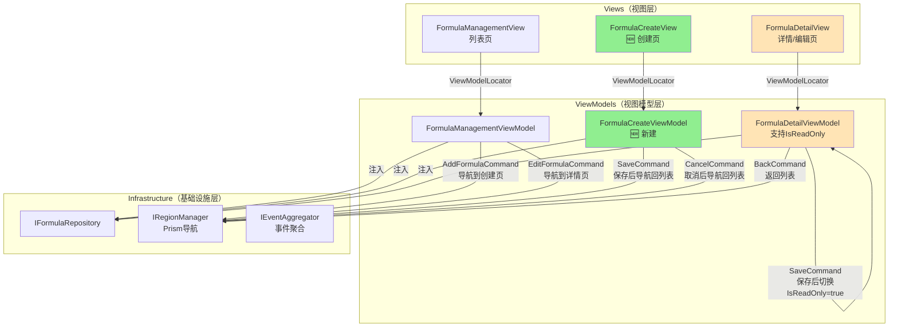

# Formula（验方）模块CRUD功能完善技术设计文档

## 📋 元数据

- **需求文档**: [formula-crud-enhancement-requirements.md](../requirements/formula-crud-enhancement-requirements.md)
- **设计版本**: v1.0
- **创建日期**: 2025-11-11
- **架构类型**: Client端UI/UX改进（Server端无需改动）
- **参考模块**: Users, Herbs, Patients

---

## 🎯 设计目标

基于需求文档，本次设计的核心目标是**对齐参考模块的UI/UX模式**，实现Formula模块的CRUD功能完善：

1. **补充缺失功能**: 创建独立的FormulaCreateView（新增验方页面）
2. **修复UI不一致**: 删除FormulaDetailView的重复内容和不必要按钮
3. **废弃Dialog模式**: 统一使用全页面导航，废弃EditFormulaDialog
4. **对齐交互模式**: 使用IsReadOnly模式切换（参考Herbs模块）

**范围界定**:
- ✅ Client端UI/UX改进（本设计文档重点）
- ✅ ViewModel逻辑完善
- ⚠️ Server端已完整，无需改动
- ❌ 不涉及业务规则变更

---

## 🏗️ 架构设计

### Client端MVVM架构（Phase 4优化版）

根据 `docs/explanation/architecture/client/README.md`，Formula模块采用Client端四层架构：

```
LYBT.Desktop.Formula - 业务模块层
├── Views/              # XAML视图
│   ├── FormulaManagementView.xaml          # 列表页（已有，无需改动）
│   ├── FormulaCreateView.xaml              # 🆕 创建页（新建）
│   ├── FormulaDetailView.xaml              # 详情/编辑页（需清理）
│   └── EditFormulaDialog.xaml              # 🗑️ Dialog（废弃）
├── ViewModels/         # 视图模型
│   ├── FormulaManagementViewModel.cs       # 列表页VM（需修改导航逻辑）
│   ├── FormulaCreateViewModel.cs           # 🆕 创建页VM（新建）
│   ├── FormulaDetailViewModel.cs           # 详情/编辑VM（已有IsReadOnly支持）
│   └── EditFormulaDialogViewModel.cs       # 🗑️ DialogVM（废弃）
├── Interfaces/         # 接口定义
│   └── IFormulaRepository.cs               # Repository接口（已有）
└── Repositories/       # 数据访问
    └── FormulaRepository.cs                # HTTP API封装（已有）
```

### 组件关系图



**图例说明**:
- 🆕 绿色：新建组件
- ⚠️ 橙色：需要修改的组件
- ⚪ 白色：无需改动的组件

### 数据流设计

#### 1. 创建验方流程（新增）

```
用户操作：FormulaManagementView 点击"+ 新增验方"按钮
    ↓
FormulaManagementViewModel.AddFormulaCommand 执行
    ↓
IRegionManager.RequestNavigate("MainRegion", "FormulaCreateView")
    ↓
FormulaCreateView 加载，ViewModelLocator 自动绑定 FormulaCreateViewModel
    ↓
用户填写验方信息（基本信息 + 药材组成）
    ↓
FormulaCreateViewModel.SaveCommand 执行
    ↓
IFormulaRepository.CreateAsync(FormulaInputDto)
    ↓
HTTP POST /api/v1/formulas → Server端 FormulaController
    ↓
保存成功 → IRegionManager.RequestNavigate("MainRegion", "FormulaManagementView")
    ↓
返回列表页，显示创建成功提示
```

#### 2. 编辑验方流程（改进）

**现状**（使用Dialog，不符合参考模块）:
```
FormulaManagementView 点击"编辑"
    ↓
FormulaManagementViewModel.EditCommand
    ↓
IDialogService.ShowDialog("EditFormulaDialog") ❌ 弹窗模式
```

**改进后**（全页面导航 + IsReadOnly切换）:
```
FormulaManagementView 点击"编辑"
    ↓
FormulaManagementViewModel.EditCommand
    ↓
IRegionManager.RequestNavigate("MainRegion", "FormulaDetailView", parameters: { "id": formulaId })
    ↓
FormulaDetailView 加载，IsReadOnly = true（查看模式）
    ↓
用户点击"编辑"按钮
    ↓
FormulaDetailViewModel.EditCommand 执行
    ↓
IsReadOnly = false（编辑模式）
    ↓
用户修改验方信息
    ↓
FormulaDetailViewModel.SaveCommand 执行
    ↓
IFormulaRepository.UpdateAsync(formulaId, FormulaInputDto)
    ↓
HTTP PUT /api/v1/formulas/{id} → Server端 FormulaController
    ↓
保存成功 → IsReadOnly = true（切换回查看模式）
```

#### 3. 查看验方详情流程（现有）

```
FormulaManagementView 点击某一行或"查看详情"
    ↓
FormulaManagementViewModel.ViewDetailCommand
    ↓
IRegionManager.RequestNavigate("MainRegion", "FormulaDetailView", parameters: { "id": formulaId })
    ↓
FormulaDetailView 加载，IsReadOnly = true（查看模式）
    ↓
FormulaDetailViewModel.OnNavigatedTo() 加载数据
    ↓
IFormulaRepository.GetByIdAsync(formulaId)
    ↓
HTTP GET /api/v1/formulas/{id} → Server端 FormulaController
    ↓
显示验方详情（基本信息 + 药材组成）
```

### 架构约束遵循

根据需求文档第10.3节，本设计严格遵循以下架构约束：

| 架构约束 | 设计遵循情况 | 说明 |
|---------|-------------|------|
| **三层对齐** | ✅ 完全遵循 | Client端MVVM（View → ViewModel → Repository）|
| **依赖方向** | ✅ 完全遵循 | View → ViewModel → Repository（Phase 4架构，无中间Service层）|
| **接口统一** | ✅ 完全遵循 | IFormulaRepository继承自Shared层的IRepository<T> |
| **软删除** | ✅ 已实现 | Server端DeleteAsync使用IsDeleted标记（无需改动）|
| **异步优先** | ✅ 完全遵循 | 所有Repository方法使用async/await |

---

## 🎨 UI/UX设计规范

### 对齐参考模块

根据需求文档第1.2节，本次UI/UX设计对齐以下参考模块：

| 参考模块 | UI模式 | 对齐方案 |
|---------|-------|---------|
| **Users模块** | 独立的查看/编辑/删除页面 | ✅ FormulaDetailView支持查看/编辑切换 |
| **Herbs模块** | IsReadOnly模式切换（单页面） | ✅ FormulaDetailView使用IsReadOnly |
| **Patients模块** | 独立的创建/查看/编辑页面 | ✅ 新建FormulaCreateView（创建页）|

### UI清理清单

根据需求文档第9节，FormulaDetailView需要进行以下清理：

| 序号 | 问题 | 位置 | 修复方案 | 优先级 |
|-----|------|------|---------|--------|
| 1 | 顶部重复卡片 | FormulaDetailView.xaml:116-184 | 删除Grid.Row="0"的Border（80x80图标、验方名称、分类、药材数、总价、难度、状态徽章）| 🟡 P1 |
| 2 | 打印按钮 | FormulaDetailView.xaml:95-100 | 删除标题栏的PrintCommand按钮 | 🟡 P1 |
| 3 | 使用记录按钮 | FormulaDetailView.xaml:85-93 | 删除标题栏的ViewUsageHistoryCommand按钮 | 🟡 P1 |

**清理前后对比**:

```xml
<!-- ❌ 清理前：FormulaDetailView有重复的顶部卡片（Grid.Row="0"） -->
<ScrollViewer Grid.Row="1">
    <Grid>
        <Grid.RowDefinitions>
            <RowDefinition Height="Auto" />  <!-- 重复卡片 -->
            <RowDefinition Height="Auto" />  <!-- 基本信息 -->
            <RowDefinition Height="Auto" />  <!-- 药材组成 -->
            <RowDefinition Height="*" />     <!-- 详细描述 -->
        </Grid.RowDefinitions>

        <!-- 🗑️ 删除：验方基本信息卡片（Grid.Row="0"）-->
        <Border Grid.Row="0" Style="{StaticResource CardStyle}">
            <!-- 80x80图标、验方名称、分类、药材数、总价、难度、状态徽章 -->
            <!-- 这些信息在Grid.Row="1"的基本信息卡片中已经有了 -->
        </Border>

        <!-- ✅ 保留：基本信息（Grid.Row="1"） -->
        <Border Grid.Row="1" Style="{StaticResource CardStyle}">
            <Expander Header="基本信息" IsExpanded="True">
                <!-- 验方名称、配制难度、性味归经、功效、用法、创建时间、更新时间 -->
            </Expander>
        </Border>

        <!-- ... 其他内容 ... -->
    </Grid>
</ScrollViewer>
```

```xml
<!-- ✅ 清理后：删除重复卡片，调整Grid.RowDefinitions -->
<ScrollViewer Grid.Row="1">
    <Grid>
        <Grid.RowDefinitions>
            <!-- 删除 <RowDefinition Height="Auto" /> -->
            <RowDefinition Height="Auto" />  <!-- 基本信息 -->
            <RowDefinition Height="Auto" />  <!-- 药材组成 -->
            <RowDefinition Height="*" />     <!-- 详细描述 -->
        </Grid.RowDefinitions>

        <!-- ✅ 基本信息从Grid.Row="1"改为Grid.Row="0" -->
        <Border Grid.Row="0" Style="{StaticResource CardStyle}">
            <Expander Header="基本信息" IsExpanded="True">
                <!-- 验方名称、配制难度、性味归经、功效、用法、创建时间、更新时间 -->
            </Expander>
        </Border>

        <!-- ✅ 药材组成从Grid.Row="2"改为Grid.Row="1" -->
        <Border Grid.Row="1" Style="{StaticResource CardStyle}">
            <Expander Header="药材组成" IsExpanded="True">
                <!-- ... -->
            </Expander>
        </Border>

        <!-- ✅ 详细描述从Grid.Row="3"改为Grid.Row="2" -->
        <Border Grid.Row="2" Style="{StaticResource CardStyle}">
            <Expander Header="详细描述" IsExpanded="False">
                <!-- ... -->
            </Expander>
        </Border>
    </Grid>
</ScrollViewer>
```

### UI标准化规范

根据Issue #1840（统一组件体系），Formula模块已使用统一组件：

| 组件 | 使用位置 | 说明 |
|-----|---------|------|
| `UnifiedManagementToolBar` | FormulaManagementView | 列表页工具栏（搜索、新增、批量删除）|
| `UnifiedManagementTable` | FormulaManagementView | 列表页表格（数据展示、行操作）|
| `UnifiedPaginationBar` | FormulaManagementView | 列表页分页器 |
| `UnifiedStatusBadge` | FormulaDetailView | 状态徽章（启用/停用）|

✅ **FormulaManagementView已完全符合统一组件规范，无需改动。**

---

## 💻 代码示例

### 1. FormulaCreateViewModel（新建）

```csharp
using LYBT.Desktop.Infrastructure.ViewModels;
using LYBT.Desktop.Formula.Interfaces;
using LYBT.Shared.Models.Contracts.Formula;
using Prism.Commands;
using Prism.Regions;
using System.Collections.ObjectModel;
using System.Threading.Tasks;

namespace LYBT.Desktop.Formula.ViewModels
{
    /// <summary>
    /// 验方创建视图模型 - Phase 4架构（直接使用Repository）
    /// 对齐Users/Herbs/Patients模块的独立创建页模式
    /// </summary>
    public class FormulaCreateViewModel : UnifiedViewModelBase, INavigationAware
    {
        private readonly IFormulaRepository _formulaRepository;
        private readonly IRegionManager _regionManager;

        // 基本信息属性
        private string _name = string.Empty;
        private string _effect = string.Empty;  // ⭐ 必填字段（需求文档用户确认）
        private string _indications = string.Empty;  // ⭐ 必填字段（需求文档用户确认）
        private string _usage = string.Empty;
        private string _property = string.Empty;
        private string _difficulty = string.Empty;
        private string? _description;
        private string? _remark;

        // 药材组成
        private ObservableCollection<FormulaHerbItemDto> _herbItems = new();

        // UI状态
        private bool _isSaving;

        public FormulaCreateViewModel(
            IFormulaRepository formulaRepository,
            IRegionManager regionManager)
        {
            _formulaRepository = formulaRepository;
            _regionManager = regionManager;

            // 命令初始化
            SaveCommand = new DelegateCommand(async () => await SaveFormulaAsync(), CanSave)
                .ObservesProperty(() => Name)
                .ObservesProperty(() => Effect)
                .ObservesProperty(() => Indications)
                .ObservesProperty(() => Usage);
            CancelCommand = new DelegateCommand(NavigateBack);
            AddHerbCommand = new DelegateCommand(AddHerbItem);
            RemoveHerbCommand = new DelegateCommand<FormulaHerbItemDto>(RemoveHerbItem);
        }

        #region 属性

        public string Name
        {
            get => _name;
            set => SetProperty(ref _name, value);
        }

        /// <summary>
        /// 功效 - ⭐ 必填字段（需求文档用户确认）
        /// </summary>
        public string Effect
        {
            get => _effect;
            set => SetProperty(ref _effect, value);
        }

        /// <summary>
        /// 主治 - ⭐ 必填字段（需求文档用户确认）
        /// </summary>
        public string Indications
        {
            get => _indications;
            set => SetProperty(ref _indications, value);
        }

        public string Usage
        {
            get => _usage;
            set => SetProperty(ref _usage, value);
        }

        public string Property
        {
            get => _property;
            set => SetProperty(ref _property, value);
        }

        public string Difficulty
        {
            get => _difficulty;
            set => SetProperty(ref _difficulty, value);
        }

        public string? Description
        {
            get => _description;
            set => SetProperty(ref _description, value);
        }

        public string? Remark
        {
            get => _remark;
            set => SetProperty(ref _remark, value);
        }

        public ObservableCollection<FormulaHerbItemDto> HerbItems
        {
            get => _herbItems;
            set => SetProperty(ref _herbItems, value);
        }

        public bool IsSaving
        {
            get => _isSaving;
            set => SetProperty(ref _isSaving, value);
        }

        #endregion

        #region 命令

        public DelegateCommand SaveCommand { get; }
        public DelegateCommand CancelCommand { get; }
        public DelegateCommand AddHerbCommand { get; }
        public DelegateCommand<FormulaHerbItemDto> RemoveHerbCommand { get; }

        #endregion

        #region 命令执行

        private bool CanSave()
        {
            // 验证必填字段
            return !string.IsNullOrWhiteSpace(Name) &&
                   !string.IsNullOrWhiteSpace(Effect) &&      // ⭐ 必填
                   !string.IsNullOrWhiteSpace(Indications) && // ⭐ 必填
                   !string.IsNullOrWhiteSpace(Usage) &&
                   !IsSaving;
        }

        private async Task SaveFormulaAsync()
        {
            try
            {
                IsSaving = true;

                // 构建FormulaInputDto
                var dto = new FormulaInputDto
                {
                    Name = Name,
                    Effect = Effect,
                    Indications = Indications,
                    Usage = Usage,
                    Property = Property,
                    Difficulty = Difficulty,
                    Description = Description,
                    Remark = Remark,
                    HerbItems = HerbItems.ToList()
                };

                // 调用Repository创建验方
                await _formulaRepository.CreateAsync(dto);

                // 保存成功，导航回列表页
                NavigateBack();

                // TODO: 显示成功提示（通过EventAggregator发布事件）
            }
            catch (Exception ex)
            {
                // TODO: 显示错误提示
                // Logger.LogError(ex, "创建验方失败");
            }
            finally
            {
                IsSaving = false;
            }
        }

        private void NavigateBack()
        {
            _regionManager.RequestNavigate("MainRegion", "FormulaManagementView");
        }

        private void AddHerbItem()
        {
            // TODO: 打开药材选择对话框或内联编辑
            var newItem = new FormulaHerbItemDto
            {
                SortOrder = HerbItems.Count + 1,
                Quantity = 0,
                Unit = "g"
            };
            HerbItems.Add(newItem);
        }

        private void RemoveHerbItem(FormulaHerbItemDto? item)
        {
            if (item != null)
            {
                HerbItems.Remove(item);
                // 重新排序
                for (int i = 0; i < HerbItems.Count; i++)
                {
                    HerbItems[i].SortOrder = i + 1;
                }
            }
        }

        #endregion

        #region INavigationAware

        public void OnNavigatedTo(NavigationContext navigationContext)
        {
            // 创建页无需加载数据
        }

        public bool IsNavigationTarget(NavigationContext navigationContext)
        {
            return true;
        }

        public void OnNavigatedFrom(NavigationContext navigationContext)
        {
            // 清理资源
        }

        #endregion
    }
}
```

### 2. FormulaCreateView.xaml（新建）

```xml
<UserControl x:Class="LYBT.Desktop.Formula.Views.FormulaCreateView"
             xmlns="http://schemas.microsoft.com/winfx/2006/xaml/presentation"
             xmlns:x="http://schemas.microsoft.com/winfx/2006/xaml"
             xmlns:mc="http://schemas.openxmlformats.org/markup-compatibility/2006"
             xmlns:d="http://schemas.microsoft.com/expression/blend/2008"
             xmlns:prism="http://prismlibrary.com/"
             prism:ViewModelLocator.AutoWireViewModel="True"
             mc:Ignorable="d"
             d:DesignHeight="700" d:DesignWidth="1200">

    <Grid>
        <Grid.RowDefinitions>
            <RowDefinition Height="Auto" />
            <RowDefinition Height="*" />
        </Grid.RowDefinitions>

        <!-- 标题栏 -->
        <Border Grid.Row="0" Background="{DynamicResource PrimaryHueMidBrush}" Padding="16">
            <Grid>
                <Grid.ColumnDefinitions>
                    <ColumnDefinition Width="Auto" />
                    <ColumnDefinition Width="*" />
                    <ColumnDefinition Width="Auto" />
                </Grid.ColumnDefinitions>

                <Button Grid.Column="0"
                        Command="{Binding CancelCommand}"
                        Background="Transparent" BorderThickness="0" Padding="8"
                        Foreground="White"
                        Margin="0,0,16,0">
                    <StackPanel Orientation="Horizontal">
                        <TextBlock Text="←" VerticalAlignment="Center" FontSize="16" />
                        <TextBlock Text="返回" Margin="4,0,0,0" />
                    </StackPanel>
                </Button>

                <TextBlock Grid.Column="1"
                           Text="新增验方"
                           FontSize="20"
                           FontWeight="Bold"
                           Foreground="White"
                           VerticalAlignment="Center" />

                <StackPanel Grid.Column="2" Orientation="Horizontal">
                    <Button Command="{Binding SaveCommand}"
                            Background="Transparent" BorderThickness="0" Padding="8"
                            Foreground="White"
                            Margin="4">
                        <StackPanel Orientation="Horizontal">
                            <TextBlock Text="💾" VerticalAlignment="Center" FontSize="16" />
                            <TextBlock Text="保存" Margin="4,0,0,0" />
                        </StackPanel>
                    </Button>

                    <Button Command="{Binding CancelCommand}"
                            Background="Transparent" BorderThickness="0" Padding="8"
                            Foreground="White"
                            Margin="4">
                        <TextBlock Text="✖" FontSize="16" VerticalAlignment="Center" />
                    </Button>
                </StackPanel>
            </Grid>
        </Border>

        <!-- 内容区域 -->
        <ScrollViewer Grid.Row="1" VerticalScrollBarVisibility="Auto">
            <Grid Margin="16">
                <Grid.RowDefinitions>
                    <RowDefinition Height="Auto" />
                    <RowDefinition Height="Auto" />
                    <RowDefinition Height="*" />
                </Grid.RowDefinitions>

                <!-- 基本信息 -->
                <Border Grid.Row="0" Style="{StaticResource CardStyle}" Margin="0,0,0,16">
                    <Expander Header="基本信息" IsExpanded="True">
                        <Grid Margin="16">
                            <Grid.RowDefinitions>
                                <RowDefinition Height="Auto" />
                                <RowDefinition Height="Auto" />
                                <RowDefinition Height="Auto" />
                                <RowDefinition Height="Auto" />
                                <RowDefinition Height="Auto" />
                            </Grid.RowDefinitions>
                            <Grid.ColumnDefinitions>
                                <ColumnDefinition Width="120" />
                                <ColumnDefinition Width="*" />
                                <ColumnDefinition Width="120" />
                                <ColumnDefinition Width="*" />
                            </Grid.ColumnDefinitions>

                            <!-- 第一行 -->
                            <TextBlock Grid.Row="0" Grid.Column="0"
                                       Text="验方名称*:"
                                       FontWeight="Bold"
                                       VerticalAlignment="Center"
                                       Margin="0,8" />
                            <TextBox Grid.Row="0" Grid.Column="1"
                                     Text="{Binding Name, Mode=TwoWay, UpdateSourceTrigger=PropertyChanged}"
                                     Margin="0,8,16,8" />

                            <TextBlock Grid.Row="0" Grid.Column="2"
                                       Text="配制难度:"
                                       FontWeight="Bold"
                                       VerticalAlignment="Center"
                                       Margin="0,8" />
                            <TextBox Grid.Row="0" Grid.Column="3"
                                     Text="{Binding Difficulty, Mode=TwoWay}"
                                     Margin="0,8" />

                            <!-- 第二行 -->
                            <TextBlock Grid.Row="1" Grid.Column="0"
                                       Text="性味归经:"
                                       FontWeight="Bold"
                                       VerticalAlignment="Top"
                                       Margin="0,8" />
                            <TextBox Grid.Row="1" Grid.Column="1" Grid.ColumnSpan="3"
                                     Text="{Binding Property, Mode=TwoWay}"
                                     TextWrapping="Wrap"
                                     MinHeight="40"
                                     Margin="0,8" />

                            <!-- 第三行 - ⭐ 必填字段 -->
                            <TextBlock Grid.Row="2" Grid.Column="0"
                                       Text="功效*:"
                                       FontWeight="Bold"
                                       Foreground="Red"
                                       VerticalAlignment="Top"
                                       Margin="0,8" />
                            <TextBox Grid.Row="2" Grid.Column="1" Grid.ColumnSpan="3"
                                     Text="{Binding Effect, Mode=TwoWay, UpdateSourceTrigger=PropertyChanged}"
                                     TextWrapping="Wrap"
                                     MinHeight="60"
                                     Margin="0,8" />

                            <!-- 第四行 - ⭐ 必填字段 -->
                            <TextBlock Grid.Row="3" Grid.Column="0"
                                       Text="主治*:"
                                       FontWeight="Bold"
                                       Foreground="Red"
                                       VerticalAlignment="Top"
                                       Margin="0,8" />
                            <TextBox Grid.Row="3" Grid.Column="1" Grid.ColumnSpan="3"
                                     Text="{Binding Indications, Mode=TwoWay, UpdateSourceTrigger=PropertyChanged}"
                                     TextWrapping="Wrap"
                                     MinHeight="80"
                                     Margin="0,8" />

                            <!-- 第五行 -->
                            <TextBlock Grid.Row="4" Grid.Column="0"
                                       Text="用法*:"
                                       FontWeight="Bold"
                                       VerticalAlignment="Top"
                                       Margin="0,8" />
                            <TextBox Grid.Row="4" Grid.Column="1" Grid.ColumnSpan="3"
                                     Text="{Binding Usage, Mode=TwoWay, UpdateSourceTrigger=PropertyChanged}"
                                     TextWrapping="Wrap"
                                     MinHeight="60"
                                     Margin="0,8" />
                        </Grid>
                    </Expander>
                </Border>

                <!-- 药材组成 -->
                <Border Grid.Row="1" Style="{StaticResource CardStyle}" Margin="0,0,0,16">
                    <Expander Header="药材组成" IsExpanded="True">
                        <Grid Margin="16">
                            <Grid.RowDefinitions>
                                <RowDefinition Height="Auto" />
                                <RowDefinition Height="*" />
                            </Grid.RowDefinitions>

                            <!-- 工具栏 -->
                            <StackPanel Grid.Row="0" Orientation="Horizontal" Margin="0,0,0,16">
                                <Button Content="+ 添加药材"
                                        Command="{Binding AddHerbCommand}"
                                        Style="{StaticResource SuccessButton}" />
                            </StackPanel>

                            <!-- 药材列表 -->
                            <DataGrid Grid.Row="1"
                                      ItemsSource="{Binding HerbItems}"
                                      AutoGenerateColumns="False"
                                      CanUserAddRows="False"
                                      CanUserDeleteRows="True"
                                      GridLinesVisibility="Horizontal"
                                      HeadersVisibility="Column"
                                      SelectionMode="Single"
                                      AlternationCount="2"
                                      MaxHeight="300">
                                <DataGrid.Columns>
                                    <DataGridTextColumn Header="序号"
                                                        Binding="{Binding SortOrder}"
                                                        Width="60"
                                                        IsReadOnly="True" />
                                    <DataGridTextColumn Header="药材名称*"
                                                        Binding="{Binding HerbName}"
                                                        Width="120" />
                                    <DataGridTextColumn Header="用量*"
                                                        Binding="{Binding Quantity, StringFormat=F1}"
                                                        Width="80" />
                                    <DataGridTextColumn Header="单位*"
                                                        Binding="{Binding Unit}"
                                                        Width="60" />
                                    <DataGridTextColumn Header="炮制方法"
                                                        Binding="{Binding Preparation}"
                                                        Width="100" />
                                    <DataGridTextColumn Header="用法"
                                                        Binding="{Binding Usage}"
                                                        Width="*" />
                                    <DataGridTemplateColumn Header="操作" Width="80">
                                        <DataGridTemplateColumn.CellTemplate>
                                            <DataTemplate>
                                                <Button Content="删除"
                                                        Command="{Binding DataContext.RemoveHerbCommand, RelativeSource={RelativeSource AncestorType=DataGrid}}"
                                                        CommandParameter="{Binding}"
                                                        Style="{StaticResource DangerButton}"
                                                        Padding="4,2" />
                                            </DataTemplate>
                                        </DataGridTemplateColumn.CellTemplate>
                                    </DataGridTemplateColumn>
                                </DataGrid.Columns>
                            </DataGrid>
                        </Grid>
                    </Expander>
                </Border>

                <!-- 详细描述和备注 -->
                <Border Grid.Row="2" Style="{StaticResource CardStyle}">
                    <Expander Header="详细描述" IsExpanded="False">
                        <Grid Margin="16">
                            <Grid.RowDefinitions>
                                <RowDefinition Height="Auto" />
                                <RowDefinition Height="Auto" />
                            </Grid.RowDefinitions>

                            <!-- 描述 -->
                            <TextBlock Grid.Row="0"
                                       Text="验方描述:"
                                       FontWeight="Bold"
                                       VerticalAlignment="Top"
                                       Margin="0,8" />
                            <TextBox Grid.Row="0"
                                     Text="{Binding Description, Mode=TwoWay}"
                                     TextWrapping="Wrap"
                                     MinHeight="60"
                                     Margin="0,32,0,8" />

                            <!-- 备注 -->
                            <TextBlock Grid.Row="1"
                                       Text="备注:"
                                       FontWeight="Bold"
                                       VerticalAlignment="Top"
                                       Margin="0,8" />
                            <TextBox Grid.Row="1"
                                     Text="{Binding Remark, Mode=TwoWay}"
                                     TextWrapping="Wrap"
                                     MinHeight="40"
                                     Margin="0,32,0,8" />
                        </Grid>
                    </Expander>
                </Border>
            </Grid>
        </ScrollViewer>

        <!-- 保存遮罩 -->
        <Grid Grid.Row="0" Grid.RowSpan="2"
              Visibility="{Binding IsSaving, Converter={StaticResource BooleanToVisibilityConverter}}"
              Background="#80000000">
            <StackPanel HorizontalAlignment="Center" VerticalAlignment="Center">
                <ProgressBar Width="50" Height="50"
                             IsIndeterminate="True"
                             Margin="0,0,0,16" />
                <TextBlock Text="正在保存验方..."
                           Foreground="White"
                           HorizontalAlignment="Center" />
            </StackPanel>
        </Grid>
    </Grid>
</UserControl>
```

### 3. FormulaManagementViewModel.cs（修改导航逻辑）

修改AddFormulaCommand和EditCommand的导航逻辑：

```csharp
// ❌ 修改前：使用Dialog弹窗
private void ExecuteAddFormula()
{
    var parameters = new DialogParameters();
    _dialogService.ShowDialog("EditFormulaDialog", parameters, result =>
    {
        if (result.Result == ButtonResult.OK)
        {
            // 刷新列表
            _ = LoadFormulasAsync();
        }
    });
}

private void ExecuteEditFormula(FormulaDto? formula)
{
    if (formula == null) return;

    var parameters = new DialogParameters
    {
        { "formulaId", formula.Id }
    };
    _dialogService.ShowDialog("EditFormulaDialog", parameters, result =>
    {
        if (result.Result == ButtonResult.OK)
        {
            // 刷新列表
            _ = LoadFormulasAsync();
        }
    });
}
```

```csharp
// ✅ 修改后：使用全页面导航
private void ExecuteAddFormula()
{
    // 导航到FormulaCreateView（新增验方页面）
    _regionManager.RequestNavigate("MainRegion", "FormulaCreateView");
}

private void ExecuteEditFormula(FormulaDto? formula)
{
    if (formula == null) return;

    // 导航到FormulaDetailView（详情页，IsReadOnly=true初始）
    var parameters = new NavigationParameters
    {
        { "id", formula.Id }
    };
    _regionManager.RequestNavigate("MainRegion", "FormulaDetailView", parameters);
}
```

### 4. FormulaDetailView.xaml（清理）

```xml
<!-- ❌ 删除：顶部重复卡片（Grid.Row="0"，行116-184） -->
<!--
<Border Grid.Row="0" Style="{StaticResource CardStyle}" Margin="0,0,0,16">
    <Grid Margin="16">
        <Grid.ColumnDefinitions>
            <ColumnDefinition Width="Auto" />
            <ColumnDefinition Width="*" />
            <ColumnDefinition Width="Auto" />
        </Grid.ColumnDefinitions>

        <Border Grid.Column="0"
                Width="80" Height="80"
                CornerRadius="8"
                Background="{DynamicResource AccentBrush}"
                VerticalAlignment="Center"
                HorizontalAlignment="Center"
                Margin="0,0,20,0">
            <TextBlock Text="📜"
                       FontSize="36"
                       HorizontalAlignment="Center"
                       VerticalAlignment="Center"
                       Foreground="White" />
        </Border>

        <StackPanel Grid.Column="1" VerticalAlignment="Center">
            <TextBlock Text="{Binding FormulaName}"
                       FontSize="24"
                       FontWeight="Bold" />

            <TextBlock FontSize="16" Foreground="Gray" Margin="0,4,0,0">
                <TextBlock.Text>
                    <MultiBinding StringFormat="{}{0} · {1}味药材">
                        <Binding Path="Category" />
                        <Binding Path="HerbCount" />
                    </MultiBinding>
                </TextBlock.Text>
            </TextBlock>

            <TextBlock FontSize="14" Foreground="Gray" Margin="0,4,0,0">
                <TextBlock.Text>
                    <MultiBinding StringFormat="总价: ¥{0:F2} · 难度: {1}">
                        <Binding Path="TotalPrice" />
                        <Binding Path="Difficulty" />
                    </MultiBinding>
                </TextBlock.Text>
            </TextBlock>
        </StackPanel>

        <StackPanel Grid.Column="2" VerticalAlignment="Center">
            <Border Background="{DynamicResource SuccessBrush}"
                    CornerRadius="12"
                    Padding="12,4"
                    Margin="0,0,0,8">
                <TextBlock Text="{Binding StatusMessage}"
                           Foreground="White"
                           FontWeight="Bold"
                           FontSize="12" />
            </Border>

            <Border Background="{DynamicResource WarningBrush}"
                    CornerRadius="8"
                    Padding="8,3"
                    Visibility="{Binding IsShared, Converter={StaticResource BooleanToVisibilityConverter}}">
                <TextBlock Text="共享"
                           Foreground="White"
                           FontWeight="Bold"
                           FontSize="10" />
            </Border>
        </StackPanel>
    </Grid>
</Border>
-->

<!-- ❌ 删除：打印按钮（行95-100） -->
<!--
<Button Command="{Binding PrintCommand}"
        Background="Transparent" BorderThickness="0" Padding="8"
        Foreground="White"
        Margin="4">
    <TextBlock Text="🖨" FontSize="16" VerticalAlignment="Center" />
</Button>
-->

<!-- ❌ 删除：使用记录按钮（行85-93） -->
<!--
<Button Command="{Binding ViewUsageHistoryCommand}"
        Background="Transparent" BorderThickness="0" Padding="8"
        Foreground="White"
        Margin="4">
    <StackPanel Orientation="Horizontal">
        <TextBlock Text="📈" VerticalAlignment="Center" FontSize="16" />
        <TextBlock Text="使用记录" Margin="4,0,0,0" />
    </StackPanel>
</Button>
-->
```

**清理后的Grid.RowDefinitions调整**：

```xml
<!-- ❌ 修改前：4个RowDefinition -->
<Grid.RowDefinitions>
    <RowDefinition Height="Auto" />  <!-- 重复卡片（需删除）-->
    <RowDefinition Height="Auto" />  <!-- 基本信息 -->
    <RowDefinition Height="Auto" />  <!-- 药材组成 -->
    <RowDefinition Height="*" />     <!-- 详细描述 -->
</Grid.RowDefinitions>
```

```xml
<!-- ✅ 修改后：3个RowDefinition -->
<Grid.RowDefinitions>
    <RowDefinition Height="Auto" />  <!-- 基本信息 -->
    <RowDefinition Height="Auto" />  <!-- 药材组成 -->
    <RowDefinition Height="*" />     <!-- 详细描述 -->
</Grid.RowDefinitions>
```

**同时调整所有Border的Grid.Row索引**：

```xml
<!-- ✅ 基本信息：从Grid.Row="1"改为Grid.Row="0" -->
<Border Grid.Row="0" Style="{StaticResource CardStyle}" Margin="0,0,0,16">
    <Expander Header="基本信息" IsExpanded="True">
        <!-- ... -->
    </Expander>
</Border>

<!-- ✅ 药材组成：从Grid.Row="2"改为Grid.Row="1" -->
<Border Grid.Row="1" Style="{StaticResource CardStyle}" Margin="0,0,0,16">
    <Expander Header="药材组成" IsExpanded="True">
        <!-- ... -->
    </Expander>
</Border>

<!-- ✅ 详细描述：从Grid.Row="3"改为Grid.Row="2" -->
<Border Grid.Row="2" Style="{StaticResource CardStyle}">
    <Expander Header="详细描述" IsExpanded="False">
        <!-- ... -->
    </Expander>
</Border>
```

### 5. FormulaDetailViewModel.cs（已有IsReadOnly支持，无需改动）

根据需求文档分析，FormulaDetailViewModel已经支持IsReadOnly模式切换（参考Herbs模块模式）：

```csharp
// ✅ 已有代码（FormulaDetailViewModel.cs:240行附近）
public string Effect
{
    get => _effect;
    set => SetProperty(ref _effect, value);
}

// ✅ XAML中已绑定IsReadOnly（FormulaDetailView.xaml:246行）
<TextBox Grid.Row="2" Grid.Column="1" Grid.ColumnSpan="3"
         Text="{Binding Formula.Effect, Mode=TwoWay}"
         IsReadOnly="{Binding IsReadOnly}"  <!-- ⭐ 已支持IsReadOnly -->
         TextWrapping="Wrap"
         MinHeight="60"
         Margin="0,8" />
```

**✅ FormulaDetailViewModel无需改动，已完全支持IsReadOnly模式切换。**

---

## 📋 Phase拆分与实施计划

### Phase 1：清理和修复（1-2天）

**任务清单**：
- [ ] 删除FormulaDetailView.xaml顶部重复卡片（Grid.Row="0"，行116-184）
- [ ] 调整Grid.RowDefinitions（从4个改为3个）
- [ ] 调整所有Border的Grid.Row索引（-1）
- [ ] 删除FormulaDetailView标题栏的打印按钮（行95-100）
- [ ] 删除FormulaDetailView标题栏的"使用记录"按钮（行85-93）
- [ ] 为Effect和Indications字段添加红星(*)必填提示（FormulaDetailView.xaml:241和257行）

**验收标准**：
- ✅ 编译通过：0 errors, 0 warnings
- ✅ FormulaDetailView无重复内容
- ✅ 标题栏仅保留：返回、编辑/保存/取消、复制按钮
- ✅ 必填字段有红星提示

**预计工时**：1-2天

---

### Phase 2：新增创建页面（2-3天）

**任务清单**：
- [ ] 创建FormulaCreateView.xaml（参考上述代码示例）
- [ ] 创建FormulaCreateViewModel.cs（参考上述代码示例）
- [ ] 实现SaveCommand（调用IFormulaRepository.CreateAsync）
- [ ] 实现CancelCommand（导航回列表页）
- [ ] 实现药材组成的添加/删除逻辑（AddHerbCommand/RemoveHerbCommand）
- [ ] 必填字段验证（Name、Effect、Indications、Usage）
- [ ] 在FormulaModule.cs中注册FormulaCreateView导航

**验收标准**：
- ✅ 编译通过：0 errors, 0 warnings
- ✅ 可以从FormulaManagementView导航到FormulaCreateView
- ✅ 可以填写验方基本信息和药材组成
- ✅ SaveCommand可以成功创建验方
- ✅ 创建成功后自动返回列表页

**预计工时**：2-3天

---

### Phase 3：废弃Dialog模式（1天）

**任务清单**：
- [ ] 修改FormulaManagementViewModel.AddFormulaCommand（导航到FormulaCreateView）
- [ ] 修改FormulaManagementViewModel.EditCommand（导航到FormulaDetailView）
- [ ] 删除EditFormulaDialog.xaml
- [ ] 删除EditFormulaDialogViewModel.cs
- [ ] 从FormulaModule.cs中移除EditFormulaDialog注册

**验收标准**：
- ✅ 编译通过：0 errors, 0 warnings
- ✅ "新增验方"按钮导航到FormulaCreateView
- ✅ "编辑"按钮导航到FormulaDetailView（IsReadOnly=false）
- ✅ EditFormulaDialog相关文件已删除

**预计工时**：1天

---

### Phase 4：测试和完善（1-2天）

**任务清单**：
- [ ] 编写FormulaCreateViewModel单元测试
- [ ] 编写FormulaDetailViewModel单元测试
- [ ] 手动测试完整CRUD流程：
  - 创建验方 → 查看详情 → 编辑 → 保存 → 删除
- [ ] 验证必填字段（Effect、Indications）的验证逻辑
- [ ] 验证UI一致性（对齐Users/Herbs/Patients模块）
- [ ] 修复发现的Bug
- [ ] 更新模块文档（如需要）

**验收标准**：
- ✅ 编译通过：0 errors, 0 warnings
- ✅ 所有单元测试通过
- ✅ 完整CRUD流程可正常运行
- ✅ Effect和Indications字段必填验证生效
- ✅ UI风格与Users/Herbs/Patients模块一致
- ✅ 运行时验证：启动应用 → 验证CRUD功能 → 确认数据库状态

**预计工时**：1-2天

---

**总工期预计**：5-8天

---

## ✅ 质量标准

### 1. 编译要求

**标准**：0 errors, 0 warnings

**验证命令**：
```bash
cd D:\source\repos\LYBTZYZS
dotnet build LYBT.All.sln -c Release --no-restore
```

**预期输出**：
```
Build succeeded.
    0 Warning(s)
    0 Error(s)
```

### 2. 运行时验证（⚠️ 强制）

**运行时验证清单**：

1. **启动应用**：
   ```bash
   # 启动Server端
   cd src/Server/LYBT.WebAPI
   dotnet run

   # 启动Client端
   cd src/Client/Desktop/LYBT.Desktop.Shell
   dotnet run
   ```

2. **验证创建流程**：
   - 点击"验方管理"菜单
   - 点击"+ 新增验方"按钮
   - 填写必填字段：验方名称、功效、主治、用法
   - 添加至少2味药材
   - 点击"保存"按钮
   - ✅ 验证：自动返回列表页，新验方显示在列表中

3. **验证查看详情**：
   - 点击列表中某一行
   - ✅ 验证：导航到FormulaDetailView，IsReadOnly=true
   - ✅ 验证：顶部无重复卡片
   - ✅ 验证：标题栏无"打印"和"使用记录"按钮

4. **验证编辑流程**：
   - 在FormulaDetailView点击"编辑"按钮
   - ✅ 验证：IsReadOnly=false，字段可编辑
   - 修改"功效"字段
   - 点击"保存"按钮
   - ✅ 验证：IsReadOnly=true，修改已保存

5. **验证必填字段**：
   - 创建验方时，清空"功效"或"主治"字段
   - 点击"保存"按钮
   - ✅ 验证："保存"按钮禁用或显示验证错误

6. **验证数据库状态**：
   ```sql
   -- 查询最新创建的验方
   SELECT TOP 1 * FROM Formulas ORDER BY CreatedAt DESC;

   -- 查询药材组成
   SELECT * FROM FormulaHerbItems WHERE FormulaId = [上一步查询的Id];
   ```
   - ✅ 验证：数据库中存在新验方记录
   - ✅ 验证：FormulaHerbItems表中存在关联的药材记录

### 3. 单元测试要求

**覆盖率目标**：ViewModel层 ≥ 70%

**测试用例清单**：

#### FormulaCreateViewModelTests
- [ ] Constructor_ShouldInitializeViewModel
- [ ] SaveCommand_CanExecute_WhenAllRequiredFieldsFilled_ShouldReturnTrue
- [ ] SaveCommand_CanExecute_WhenEffectMissing_ShouldReturnFalse
- [ ] SaveCommand_CanExecute_WhenIndicationsMissing_ShouldReturnFalse
- [ ] SaveCommand_Execute_ShouldCallRepositoryCreateAsync
- [ ] SaveCommand_Execute_AfterSuccess_ShouldNavigateToListPage
- [ ] CancelCommand_Execute_ShouldNavigateToListPage
- [ ] AddHerbCommand_Execute_ShouldAddNewHerbItem
- [ ] RemoveHerbCommand_Execute_ShouldRemoveHerbItem

#### FormulaDetailViewModelTests
- [ ] Constructor_ShouldInitializeViewModel
- [ ] OnNavigatedTo_WithValidId_ShouldLoadFormula
- [ ] EditCommand_Execute_ShouldSetIsReadOnlyToFalse
- [ ] SaveCommand_Execute_ShouldCallRepositoryUpdateAsync
- [ ] SaveCommand_Execute_AfterSuccess_ShouldSetIsReadOnlyToTrue
- [ ] CancelEditCommand_Execute_ShouldRevertChangesAndSetIsReadOnlyToTrue

### 4. UI/UX一致性检查

**对齐检查清单**：

| 检查项 | 参考模块 | Formula模块 | 状态 |
|-------|---------|------------|------|
| 独立创建页面 | Users/Patients有独立创建页 | ✅ FormulaCreateView | 待实现 |
| IsReadOnly切换 | Herbs使用IsReadOnly | ✅ FormulaDetailView已支持 | 已实现 |
| 全页面导航 | 所有模块使用IRegionManager | ✅ 废弃Dialog | 待实现 |
| 统一组件 | UnifiedManagementToolBar等 | ✅ FormulaManagementView已使用 | 已实现 |
| 标题栏按钮 | 返回、编辑/保存/取消、复制 | ✅ 清理后一致 | 待实现 |
| 必填字段提示 | 红星(*)标记 | ✅ 需添加 | 待实现 |

### 5. 文档同步要求

**需要更新的文档**：

- [ ] `docs/how-to/client/formula-management.md` - Formula管理操作指南（如不存在，可跳过）
- [ ] `docs/explanation/architecture/client/modules/formula.md` - Formula模块架构文档（如不存在，可跳过）
- [ ] `docs/reference/modules/README.md` - 模块总览（如有Formula模块条目，更新状态）

**文档更新内容**：
- ✅ 新增FormulaCreateView和FormulaCreateViewModel说明
- ✅ 更新FormulaDetailView的IsReadOnly模式说明
- ✅ 废弃EditFormulaDialog的说明
- ✅ 更新UI/UX对齐参考模块的说明

---

## 📚 参考资料

### 需求与架构文档

- **需求文档**: [formula-crud-enhancement-requirements.md](../requirements/formula-crud-enhancement-requirements.md)
- **业务规则**: [business-rules.md](business-rules.md)
- **Client端架构**: [architecture/client/README.md](architecture/client/README.md)
- **MVVM模式**: [architecture/client/foundation-design.md](architecture/client/foundation-design.md)

### 参考模块实现

- **Herbs模块架构**: [architecture/server/modules/herbs.md](architecture/server/modules/herbs.md)
- **Patients模块架构**: [architecture/server/modules/patients.md](architecture/server/modules/patients.md)
- **Users模块架构**: [architecture/server/modules/users.md](architecture/server/modules/users.md)

### 代码规范

- **C#编码规范**: [.claude/reference/coding-standards.md](../../.claude/reference/coding-standards.md)
- **XAML规范**: [architecture/client/presentation-design.md](architecture/client/presentation-design.md)
- **命名规范**: PascalCase（类型）、_camelCase（私有字段）、camelCase（参数）

---

## 🔄 后续步骤

1. **用户确认设计文档**：等待用户确认本设计文档
2. **任务分解**：使用lybtzyzs-task-breakdown生成详细任务清单
3. **Issue创建**：使用lybtzyzs-issue-template批量创建GitHub Issues
4. **实施开发**：按照Phase顺序实施（Phase 1 → Phase 2 → Phase 3 → Phase 4）
5. **代码审查**：使用lybtzyzs-code-review检查代码规范
6. **合规性检查**：使用lybtzyzs-arch-compliance检查架构合规
7. **质量报告**：使用lybtzyzs-quality-reporter生成质量报告

---

**设计文档版本**：v1.0
**创建日期**：2025-11-11
**维护者**：Claude Code
**反馈渠道**：GitHub Issues

