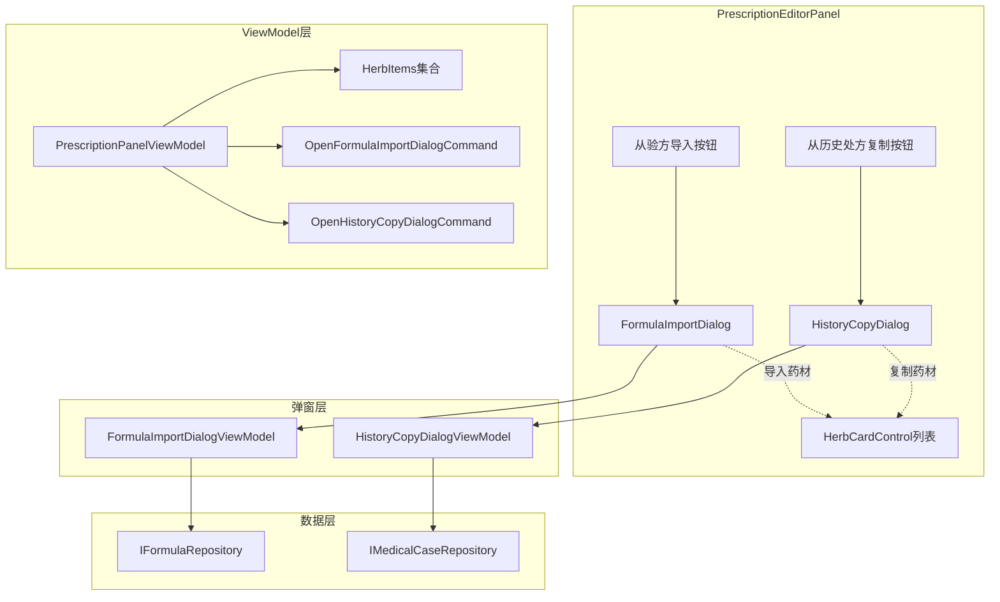

# 设计方案文档：处方编辑器重构

> **文档版本**: v1.1
> **创建日期**: 2025-11-26
> **更新日期**: 2025-11-26
> **基于需求**: prescription-editor-refactoring-discussion.md v1.1
> **设计复杂度**: 中等
> **设计范围**: Client端

---

## 设计概述

### 设计目标
1. 实现验方导入弹窗功能 - 从经验方库搜索选择并批量导入药材
2. 实现历史复制弹窗功能 - 从患者历史处方搜索选择并复制药材
3. 完善重复药材警告逻辑

### 设计原则
- [x] 遵循MVVM架构
- [x] 复用现有控件(HerbCardControl)
- [x] 保持代码简洁
- [x] 符合MVP约束
- [x] 弹窗方式实现导入功能

---

## 架构设计

### 整体架构图


### 模块划分
- **修改模块**: LYBT.Desktop.MedicalCase
- **修改文件**:
  - PrescriptionEditorPanel.xaml（添加导入按钮）
  - PrescriptionPanelViewModel.cs（添加弹窗命令）
- **新增文件**:
  - Dialogs/FormulaImportDialog.xaml + FormulaImportDialogViewModel.cs（验方导入弹窗）
  - Dialogs/HistoryCopyDialog.xaml + HistoryCopyDialogViewModel.cs（历史复制弹窗）

---

## Client端设计

### UI设计 - 验方导入弹窗 (FormulaImportDialog)

#### 布局方案
```
+--------------------------------------------------+
| [X] 从验方导入                                    |
+--------------------------------------------------+
| [搜索框: 输入验方名称或拼音码搜索...]              |
+--------------------------------------------------+
| 验方列表 (ListView)                               |
| +----------------------------------------------+ |
| | 验方名称   | 药材数量 | 创建时间              | |
| +----------------------------------------------+ |
| | 补中益气方 | 8味     | 2024-01-15            | |
| | 四君子汤   | 4味     | 2024-02-20            | |
| | ...                                          | |
| +----------------------------------------------+ |
+--------------------------------------------------+
| [预览区域]                                        |
| 药材组成: 黄芪30g, 党参15g, 白术10g...            |
+--------------------------------------------------+
|                    [取消] [确认导入]              |
+--------------------------------------------------+
```

#### XAML结构 (FormulaImportDialog.xaml)
```xml
<Window x:Class="LYBT.Desktop.MedicalCase.Dialogs.FormulaImportDialog"
        Title="从验方导入" Height="500" Width="600"
        WindowStartupLocation="CenterOwner">
    <Grid Margin="15">
        <Grid.RowDefinitions>
            <RowDefinition Height="Auto"/>  <!-- 搜索框 -->
            <RowDefinition Height="*"/>      <!-- 验方列表 -->
            <RowDefinition Height="Auto"/>  <!-- 预览区域 -->
            <RowDefinition Height="Auto"/>  <!-- 操作按钮 -->
        </Grid.RowDefinitions>

        <!-- 搜索框 -->
        <TextBox Grid.Row="0"
                 Text="{Binding SearchText, UpdateSourceTrigger=PropertyChanged}"
                 Margin="0,0,0,10"/>

        <!-- 验方列表 -->
        <ListView Grid.Row="1"
                  ItemsSource="{Binding FilteredFormulas}"
                  SelectedItem="{Binding SelectedFormula}">
            <!-- GridView列定义 -->
        </ListView>

        <!-- 预览区域 -->
        <Border Grid.Row="2" Padding="10" Background="#F5F5F5" Margin="0,10">
            <StackPanel>
                <TextBlock Text="药材组成预览:" FontWeight="Bold"/>
                <TextBlock Text="{Binding PreviewText}" TextWrapping="Wrap"/>
            </StackPanel>
        </Border>

        <!-- 操作按钮 -->
        <StackPanel Grid.Row="3" Orientation="Horizontal" HorizontalAlignment="Right">
            <Button Content="取消" Command="{Binding CancelCommand}" Margin="0,0,10,0"/>
            <Button Content="确认导入" Command="{Binding ConfirmCommand}"/>
        </StackPanel>
    </Grid>
</Window>
```

### UI设计 - 历史复制弹窗 (HistoryCopyDialog)

#### 布局方案
```
+--------------------------------------------------+
| [X] 从历史处方复制                                |
+--------------------------------------------------+
| 患者: 张三                                        |
| [搜索框: 输入诊断或日期筛选...]                    |
+--------------------------------------------------+
| 历史处方列表 (ListView)                           |
| +----------------------------------------------+ |
| | 就诊日期   | 中医诊断   | 药材数量            | |
| +----------------------------------------------+ |
| | 2024-11-20 | 气虚证     | 12味               | |
| | 2024-10-15 | 血瘀证     | 8味                | |
| | ...                                          | |
| +----------------------------------------------+ |
+--------------------------------------------------+
| [预览区域]                                        |
| 药材组成: 黄芪30g, 当归15g, 川芎10g...            |
+--------------------------------------------------+
|                    [取消] [确认复制]              |
+--------------------------------------------------+
```

### ViewModel设计

#### PrescriptionPanelViewModel - 新增弹窗命令
```csharp
#region 弹窗命令

public DelegateCommand OpenFormulaImportDialogCommand { get; }
public DelegateCommand OpenHistoryCopyDialogCommand { get; }

// 构造函数中初始化
OpenFormulaImportDialogCommand = new DelegateCommand(ExecuteOpenFormulaImportDialog);
OpenHistoryCopyDialogCommand = new DelegateCommand(ExecuteOpenHistoryCopyDialog);

#endregion

#region 弹窗方法

/// <summary>
/// 打开验方导入弹窗
/// </summary>
private void ExecuteOpenFormulaImportDialog()
{
    var dialog = new FormulaImportDialog();
    var viewModel = new FormulaImportDialogViewModel(_formulaRepository);
    dialog.DataContext = viewModel;

    if (dialog.ShowDialog() == true && viewModel.SelectedFormula != null)
    {
        ImportFormulaItems(viewModel.SelectedFormulaItems);
    }
}

/// <summary>
/// 打开历史复制弹窗
/// </summary>
private void ExecuteOpenHistoryCopyDialog()
{
    var dialog = new HistoryCopyDialog();
    var viewModel = new HistoryCopyDialogViewModel(_medicalCaseRepository, _currentPatientId);
    dialog.DataContext = viewModel;

    if (dialog.ShowDialog() == true && viewModel.SelectedPrescription != null)
    {
        ImportPrescriptionItems(viewModel.SelectedPrescriptionItems);
    }
}

/// <summary>
/// 导入验方药材
/// </summary>
private void ImportFormulaItems(IEnumerable<FormulaItemDto> items)
{
    // 检查重复药材
    var duplicates = CheckDuplicateHerbs(items);
    if (duplicates.Any())
    {
        UpdateDuplicateWarning(duplicates);
    }

    // 添加药材到当前处方
    foreach (var item in items)
    {
        var herbItem = new PrescriptionItemViewModel
        {
            HerbId = item.HerbId,
            HerbName = item.HerbName,
            Dosage = item.Dosage,
            UnitPrice = item.UnitPrice ?? 0
        };
        HerbItems.Add(herbItem);
    }

    CalculatePrices();
}

/// <summary>
/// 检查重复药材
/// </summary>
private List<string> CheckDuplicateHerbs<T>(IEnumerable<T> newItems) where T : IHerbItem
{
    var existingHerbIds = HerbItems.Select(h => h.HerbId).ToHashSet();
    return newItems
        .Where(item => existingHerbIds.Contains(item.HerbId))
        .Select(item => item.HerbName)
        .ToList();
}

#endregion
```

#### FormulaImportDialogViewModel - 验方导入弹窗ViewModel
```csharp
public class FormulaImportDialogViewModel : BindableBase
{
    private readonly IFormulaRepository _formulaRepository;
    private List<FormulaDto> _allFormulas = new();

    #region 属性

    private string _searchText = string.Empty;
    public string SearchText
    {
        get => _searchText;
        set
        {
            if (SetProperty(ref _searchText, value))
            {
                FilterFormulas();
            }
        }
    }

    private ObservableCollection<FormulaDto> _filteredFormulas = new();
    public ObservableCollection<FormulaDto> FilteredFormulas
    {
        get => _filteredFormulas;
        set => SetProperty(ref _filteredFormulas, value);
    }

    private FormulaDto? _selectedFormula;
    public FormulaDto? SelectedFormula
    {
        get => _selectedFormula;
        set
        {
            if (SetProperty(ref _selectedFormula, value))
            {
                LoadFormulaPreview();
            }
        }
    }

    private string _previewText = string.Empty;
    public string PreviewText
    {
        get => _previewText;
        set => SetProperty(ref _previewText, value);
    }

    public IEnumerable<FormulaItemDto> SelectedFormulaItems { get; private set; }

    #endregion

    #region 命令

    public DelegateCommand ConfirmCommand { get; }
    public DelegateCommand CancelCommand { get; }

    #endregion

    public FormulaImportDialogViewModel(IFormulaRepository formulaRepository)
    {
        _formulaRepository = formulaRepository;
        ConfirmCommand = new DelegateCommand(ExecuteConfirm, CanConfirm)
            .ObservesProperty(() => SelectedFormula);
        CancelCommand = new DelegateCommand(ExecuteCancel);

        LoadFormulas();
    }

    private async void LoadFormulas()
    {
        _allFormulas = (await _formulaRepository.GetAllAsync()).ToList();
        FilteredFormulas = new ObservableCollection<FormulaDto>(_allFormulas);
    }

    private void FilterFormulas()
    {
        // 支持名称和拼音码搜索
        var filtered = string.IsNullOrWhiteSpace(SearchText)
            ? _allFormulas
            : _allFormulas.Where(f =>
                f.Name.Contains(SearchText, StringComparison.OrdinalIgnoreCase) ||
                (f.PinyinCode?.Contains(SearchText, StringComparison.OrdinalIgnoreCase) ?? false));

        FilteredFormulas = new ObservableCollection<FormulaDto>(filtered);
    }

    private async void LoadFormulaPreview()
    {
        if (SelectedFormula == null)
        {
            PreviewText = string.Empty;
            return;
        }

        var detail = await _formulaRepository.GetByIdAsync(SelectedFormula.Id);
        if (detail?.Items != null)
        {
            SelectedFormulaItems = detail.Items;
            PreviewText = string.Join(", ", detail.Items.Select(i => $"{i.HerbName}{i.Dosage}g"));
        }
    }

    private bool CanConfirm() => SelectedFormula != null;
    private void ExecuteConfirm() { /* 关闭弹窗并返回true */ }
    private void ExecuteCancel() { /* 关闭弹窗并返回false */ }
}
```

#### HistoryCopyDialogViewModel - 历史复制弹窗ViewModel
```csharp
public class HistoryCopyDialogViewModel : BindableBase
{
    private readonly IMedicalCaseRepository _medicalCaseRepository;
    private readonly Guid _patientId;

    #region 属性

    private string _patientName = string.Empty;
    public string PatientName
    {
        get => _patientName;
        set => SetProperty(ref _patientName, value);
    }

    private string _searchText = string.Empty;
    public string SearchText
    {
        get => _searchText;
        set
        {
            if (SetProperty(ref _searchText, value))
            {
                FilterPrescriptions();
            }
        }
    }

    private ObservableCollection<PrescriptionHistoryDto> _prescriptionHistory = new();
    public ObservableCollection<PrescriptionHistoryDto> PrescriptionHistory
    {
        get => _prescriptionHistory;
        set => SetProperty(ref _prescriptionHistory, value);
    }

    private PrescriptionHistoryDto? _selectedPrescription;
    public PrescriptionHistoryDto? SelectedPrescription
    {
        get => _selectedPrescription;
        set
        {
            if (SetProperty(ref _selectedPrescription, value))
            {
                LoadPrescriptionPreview();
            }
        }
    }

    private string _previewText = string.Empty;
    public string PreviewText
    {
        get => _previewText;
        set => SetProperty(ref _previewText, value);
    }

    public IEnumerable<PrescriptionItemDto> SelectedPrescriptionItems { get; private set; }

    #endregion

    #region 命令

    public DelegateCommand ConfirmCommand { get; }
    public DelegateCommand CancelCommand { get; }

    #endregion

    public HistoryCopyDialogViewModel(IMedicalCaseRepository repository, Guid patientId)
    {
        _medicalCaseRepository = repository;
        _patientId = patientId;

        ConfirmCommand = new DelegateCommand(ExecuteConfirm, CanConfirm)
            .ObservesProperty(() => SelectedPrescription);
        CancelCommand = new DelegateCommand(ExecuteCancel);

        LoadPrescriptionHistory();
    }

    private async void LoadPrescriptionHistory()
    {
        var history = await _medicalCaseRepository.GetPatientPrescriptionHistoryAsync(_patientId);
        PrescriptionHistory = new ObservableCollection<PrescriptionHistoryDto>(
            history.OrderByDescending(h => h.VisitDate));
    }

    private void FilterPrescriptions() { /* 按诊断或日期筛选 */ }
    private async void LoadPrescriptionPreview() { /* 加载选中处方的药材预览 */ }
    private bool CanConfirm() => SelectedPrescription != null;
    private void ExecuteConfirm() { /* 关闭弹窗并返回true */ }
    private void ExecuteCancel() { /* 关闭弹窗并返回false */ }
}
```

---

## 数据依赖

### 需要的Repository方法

#### IFormulaRepository
```csharp
// 已存在
Task<IEnumerable<FormulaDto>> GetAllAsync();
Task<FormulaDetailDto?> GetByIdAsync(Guid id);
```

#### IMedicalCaseRepository
```csharp
// 可能需要新增
Task<IEnumerable<PrescriptionHistoryDto>> GetPatientPrescriptionHistoryAsync(Guid patientId);
Task<PrescriptionDetailDto?> GetPrescriptionAsync(Guid prescriptionId);
```

### DTO定义

#### PrescriptionHistoryDto（如需新增）
```csharp
public class PrescriptionHistoryDto
{
    public Guid PrescriptionId { get; set; }
    public Guid MedicalCaseId { get; set; }
    public DateTime VisitDate { get; set; }
    public string TCMDiagnosis { get; set; } = string.Empty;
    public int HerbCount { get; set; }
}
```

---

## 实施计划

### Task 1: 验方导入弹窗功能
- [ ] 1.1 创建FormulaImportDialog.xaml和FormulaImportDialogViewModel.cs
- [ ] 1.2 实现验方列表加载和搜索过滤逻辑
- [ ] 1.3 实现验方预览功能
- [ ] 1.4 在PrescriptionPanelViewModel中添加OpenFormulaImportDialogCommand
- [ ] 1.5 实现导入药材到处方的逻辑

### Task 2: 历史复制弹窗功能
- [ ] 2.1 确认/新增获取患者历史处方的API
- [ ] 2.2 创建HistoryCopyDialog.xaml和HistoryCopyDialogViewModel.cs
- [ ] 2.3 实现历史处方列表加载和搜索过滤逻辑
- [ ] 2.4 实现处方预览功能
- [ ] 2.5 在PrescriptionPanelViewModel中添加OpenHistoryCopyDialogCommand
- [ ] 2.6 实现复制药材到处方的逻辑

### Task 3: 重复药材警告完善
- [ ] 3.1 完善CheckDuplicateHerbs逻辑
- [ ] 3.2 实现重复警告UI交互
- [ ] 3.3 测试各场景下的重复检测

---

## 测试策略

### 单元测试
- [ ] FormulaImportDialogViewModel搜索过滤逻辑测试
- [ ] HistoryCopyDialogViewModel搜索过滤逻辑测试
- [ ] 验方导入逻辑测试
- [ ] 历史复制逻辑测试
- [ ] 重复药材检测测试
- [ ] 价格计算测试

### 集成测试
- [ ] 验方导入弹窗端到端测试
- [ ] 历史复制弹窗端到端测试

---

**设计人**: Claude Code **日期**: 2025-11-26 **更新日期**: 2025-11-26
