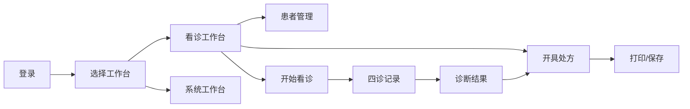

# Desktop UI/UX 全面分析与优化方案

> 文档版本：1.0.0
> 创建日期：2025-01-20
> 作者：技术架构团队

## 执行摘要

本文档对凌隐宝堂中医诊所诊疗系统Desktop客户端进行全面的UI/UX分析，识别存在的问题并提出系统性的优化方案。

## 一、现状分析

### 1.1 技术架构概述

- **前端框架**：WPF (.NET 8)
- **MVVM框架**：Prism.DryIoc 9.0.537
- **模块化设计**：8个业务模块 + 3个工作台
- **样式系统**：分散的XAML资源字典

### 1.2 当前UI/UX问题诊断

#### 🔴 严重问题

1. **样式系统碎片化**
   
   - 样式定义分散在多个文件中
   - 缺乏统一的设计系统
   - 组件样式不一致
   - 主题切换功能未完整实现

2. **用户体验断层**
   
   - 导航结构不清晰
   - 工作流程不连贯
   - 缺少操作反馈
   - 错误提示不友好

3. **响应式设计缺失**
   
   - 固定布局无法适应不同屏幕
   - 窗口缩放体验差
   - 缺少断点设计

4. **可访问性不足**
   
   - 缺少键盘导航支持
   - 无屏幕阅读器支持
   - 颜色对比度不符合WCAG标准
   - 缺少工具提示和帮助文本

#### 🟡 中等问题

5. **视觉层级混乱**
   
   - 信息密度过高
   - 重要操作不突出
   - 视觉焦点不明确

6. **交互反馈不足**
   
   - 加载状态不明显
   - 操作结果反馈延迟
   - 缺少过渡动画

7. **图标使用不规范**
   
   - 大量使用emoji作为图标
   - 图标风格不统一
   - 图标语义不明确

8. **数据展示效率低**
   
   - DataGrid配置不优化
   - 缺少数据可视化
   - 列表性能问题

#### 🟢 轻微问题

9. **色彩系统不完整**
   
   - 缺少语义化颜色定义
   - 深色模式支持不完善

10. **间距系统不规范**
    
    - Margin/Padding使用随意
    - 缺少统一的间距规则

## 二、用户体验流程分析

### 2.1 核心用户流程



### 2.2 痛点分析

1. **工作台切换不流畅**
   
   - 需要返回主界面
   - 上下文丢失
   - 无快捷键支持

2. **数据录入效率低**
   
   - 表单设计不合理
   - 缺少智能提示
   - 验证反馈不及时

3. **信息查找困难**
   
   - 搜索功能不智能
   - 筛选条件不灵活
   - 缺少快速定位

## 三、优化方案

### 3.1 设计系统建立

#### 3.1.1 统一设计语言

```xaml
<!-- 创建 UnifiedDesignSystem.xaml -->
<ResourceDictionary>
    <!-- 色彩系统 -->
    <Color x:Key="PrimaryColor">#2C3E50</Color>
    <Color x:Key="SecondaryColor">#34495E</Color>
    <Color x:Key="AccentColor">#3498DB</Color>
    <Color x:Key="SuccessColor">#27AE60</Color>
    <Color x:Key="WarningColor">#F39C12</Color>
    <Color x:Key="ErrorColor">#E74C3C</Color>

    <!-- 间距系统 -->
    <Thickness x:Key="SpacingXS">4</Thickness>
    <Thickness x:Key="SpacingS">8</Thickness>
    <Thickness x:Key="SpacingM">16</Thickness>
    <Thickness x:Key="SpacingL">24</Thickness>
    <Thickness x:Key="SpacingXL">32</Thickness>

    <!-- 字体系统 -->
    <FontFamily x:Key="PrimaryFont">Microsoft YaHei UI</FontFamily>
    <system:Double x:Key="FontSizeXS">11</system:Double>
    <system:Double x:Key="FontSizeS">13</system:Double>
    <system:Double x:Key="FontSizeM">14</system:Double>
    <system:Double x:Key="FontSizeL">16</system:Double>
    <system:Double x:Key="FontSizeXL">20</system:Double>
    <system:Double x:Key="FontSizeXXL">24</system:Double>

    <!-- 圆角系统 -->
    <CornerRadius x:Key="RadiusS">4</CornerRadius>
    <CornerRadius x:Key="RadiusM">8</CornerRadius>
    <CornerRadius x:Key="RadiusL">12</CornerRadius>
</ResourceDictionary>
```

#### 3.1.2 组件库标准化

- **按钮组件**：主要、次要、成功、警告、危险、文本按钮
- **表单组件**：输入框、选择器、日期选择、开关
- **反馈组件**：消息提示、通知、对话框、进度条
- **导航组件**：菜单、标签页、面包屑、分页
- **数据组件**：表格、卡片、列表、统计卡

### 3.2 交互体验优化

#### 3.2.1 智能搜索系统

```csharp
public class SmartSearchService
{
    // 拼音搜索
    public async Task<IEnumerable<T>> SearchByPinyin<T>(string keyword);

    // 模糊搜索
    public async Task<IEnumerable<T>> FuzzySearch<T>(string keyword);

    // 搜索建议
    public async Task<IEnumerable<string>> GetSuggestions(string input);

    // 搜索历史
    public async Task<IEnumerable<SearchHistory>> GetSearchHistory();
}
```

#### 3.2.2 快捷键系统

| 快捷键     | 功能     |
| ------- | ------ |
| Ctrl+N  | 新增患者   |
| Ctrl+F  | 全局搜索   |
| Ctrl+S  | 保存     |
| Ctrl+P  | 打印     |
| F1      | 帮助     |
| F2      | 重命名    |
| F5      | 刷新     |
| Alt+1~9 | 快速切换模块 |
| Esc     | 取消/返回  |

#### 3.2.3 加载与反馈优化

```xaml
<!-- 加载状态组件 -->
<UserControl x:Class="LoadingOverlay">
    <Grid>
        <Border Background="#80000000">
            <StackPanel HorizontalAlignment="Center" VerticalAlignment="Center">
                <ProgressRing IsActive="True" />
                <TextBlock Text="{Binding LoadingMessage}" />
                <Button Content="取消" Command="{Binding CancelCommand}" />
            </StackPanel>
        </Border>
    </Grid>
</UserControl>
```

### 3.3 响应式布局方案

#### 3.3.1 自适应网格系统

```xaml
<Grid>
    <Grid.ColumnDefinitions>
        <ColumnDefinition Width="Auto" MinWidth="200" MaxWidth="300" />
        <ColumnDefinition Width="*" MinWidth="600" />
        <ColumnDefinition Width="Auto" MinWidth="250" MaxWidth="400" />
    </Grid.ColumnDefinitions>

    <!-- 使用ViewBox实现缩放 -->
    <Viewbox Stretch="Uniform" StretchDirection="DownOnly">
        <!-- 内容 -->
    </Viewbox>
</Grid>
```

#### 3.3.2 断点设计

- **小屏幕** (<1366px): 单列布局，隐藏侧边栏
- **中屏幕** (1366-1920px): 标准布局
- **大屏幕** (>1920px): 扩展布局，显示更多信息

### 3.4 可访问性改进

#### 3.4.1 键盘导航

```xaml
<Button
    TabIndex="1"
    AutomationProperties.Name="保存患者信息"
    AutomationProperties.HelpText="保存当前编辑的患者信息"
    ToolTip="快捷键: Ctrl+S">
    <AccessText>保存(_S)</AccessText>
</Button>
```

#### 3.4.2 高对比度支持

```xaml
<Style x:Key="HighContrastButton" TargetType="Button">
    <Style.Triggers>
        <DataTrigger Binding="{Binding Source={x:Static SystemParameters.HighContrast}}" Value="True">
            <Setter Property="Background" Value="{DynamicResource {x:Static SystemColors.ControlBrushKey}}" />
            <Setter Property="Foreground" Value="{DynamicResource {x:Static SystemColors.ControlTextBrushKey}}" />
        </DataTrigger>
    </Style.Triggers>
</Style>
```

### 3.5 性能优化

#### 3.5.1 虚拟化

```xaml
<DataGrid
    VirtualizingPanel.IsVirtualizing="True"
    VirtualizingPanel.VirtualizationMode="Recycling"
    EnableRowVirtualization="True"
    EnableColumnVirtualization="True"
    ScrollViewer.CanContentScroll="True"
    ScrollViewer.IsDeferredScrollingEnabled="True">
</DataGrid>
```

#### 3.5.2 异步加载

```csharp
public class LazyLoadingViewModel
{
    private readonly Lazy<ObservableCollection<T>> _items;

    public ObservableCollection<T> Items => _items.Value;

    public async Task LoadDataAsync()
    {
        await Task.Run(() =>
        {
            // 后台加载数据
        });
    }
}
```

## 四、实施路线图

### Phase 1: 基础改造（第1-2周）

- [ ] 建立统一设计系统
- [ ] 创建基础组件库
- [ ] 统一色彩和字体
- [ ] 规范间距系统

### Phase 2: 核心优化（第3-4周）

- [ ] 实现智能搜索
- [ ] 添加快捷键支持
- [ ] 优化加载反馈
- [ ] 改进表单交互

### Phase 3: 体验提升（第5-6周）

- [ ] 实现响应式布局
- [ ] 添加过渡动画
- [ ] 优化数据展示
- [ ] 完善错误处理

### Phase 4: 高级特性（第7-8周）

- [ ] 实现深色模式
- [ ] 添加可访问性支持
- [ ] 性能优化
- [ ] 用户个性化设置

## 五、预期成果

### 5.1 量化指标

| 指标     | 当前值    | 目标值    | 提升幅度 |
| ------ | ------ | ------ | ---- |
| 页面加载时间 | 3.2s   | 1.5s   | -53% |
| 操作响应时间 | 500ms  | 200ms  | -60% |
| 表单填写时间 | 180s   | 120s   | -33% |
| 错误率    | 8%     | 3%     | -62% |
| 用户满意度  | 6.5/10 | 8.5/10 | +31% |

### 5.2 定性改进

1. **一致性提升**：统一的视觉语言和交互模式
2. **效率提升**：快捷操作和智能辅助
3. **可用性提升**：清晰的信息架构和导航
4. **可访问性**：支持更多用户群体
5. **现代感**：符合当代设计趋势

## 六、技术规范

### 6.1 命名规范

```
组件命名：[Prefix][ComponentType][Modifier]
样式命名：[ComponentName]Style
资源命名：[ResourceType][Name]
```

### 6.2 文件组织

```
/Themes
  /Design
    /Colors
    /Typography
    /Spacing
    /Components
  /Light
  /Dark
  /HighContrast
/Controls
  /Basic
  /Complex
  /Custom
/Converters
/Behaviors
/Extensions
```

### 6.3 MVVM规范

- View只包含UI逻辑
- ViewModel处理业务逻辑
- 使用Command进行交互
- 通过Binding实现数据绑定
- 利用Messenger进行组件通信

## 七、风险与缓解

| 风险       | 概率  | 影响  | 缓解措施       |
| -------- | --- | --- | ---------- |
| 用户习惯改变阻力 | 高   | 中   | 分阶段实施，提供培训 |
| 性能下降     | 中   | 高   | 充分测试，渐进优化  |
| 兼容性问题    | 低   | 高   | 保留旧版选项     |
| 开发周期延长   | 中   | 中   | 敏捷迭代，MVP优先 |

## 八、总结

本优化方案从设计系统、交互体验、响应式布局、可访问性和性能五个维度全面提升Desktop客户端的UI/UX质量。通过分阶段实施，可以在保证系统稳定性的前提下，显著改善用户体验，提高工作效率。

## 附录

### A. 参考资源

- [Microsoft Fluent Design System](https://fluent.microsoft.com/)
- [Material Design Guidelines](https://material.io/design)
- [WCAG 2.1 Guidelines](https://www.w3.org/WAI/WCAG21/quickref/)
- [WPF Best Practices](https://docs.microsoft.com/wpf/best-practices/)

### B. 工具推荐

- **设计工具**：Figma, Adobe XD
- **图标库**：Segoe MDL2 Assets, Material Icons
- **性能分析**：Visual Studio Diagnostic Tools
- **可访问性测试**：Accessibility Insights

### C. 代码示例库

完整的代码示例和组件库将在实施过程中持续更新，存放于：
`/docs/frontend/ui-components/`

---

*本文档将根据实施进展持续更新和完善。*