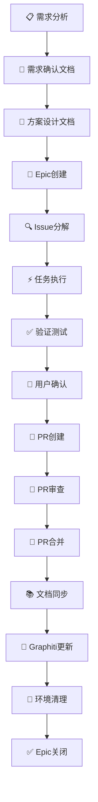
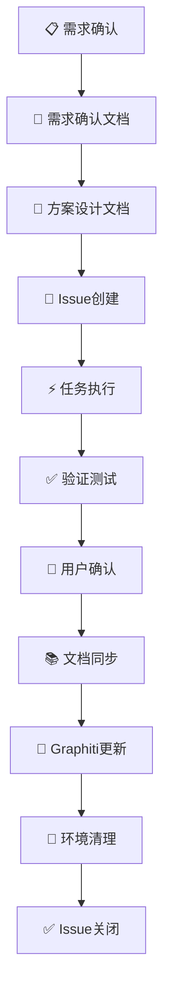

# 需求驱动工作流程指南

> **文档版本**: v1.0
> **最后更新**: 2025-11-13
> **适用范围**: LYBTZYZS项目所有开发任务

## 🔄 需求驱动的完整工作流程

### 需求分类标准
- **大需求**: Epic级别，涉及多个模块或重大架构变更（>1周工作量）
- **小需求**: 单一Issue，独立功能点或Bug修复（<3天工作量）

---

## 🔄 大需求工作流程 (Epic驱动)



### 详细步骤：

**📋 1. 需求分析**
- 从用户或业务需求出发
- 分析影响范围和复杂度
- 确定是否为Epic级别
- 使用 `docs/templates/requirement-confirmation-template.md`

**📝 2. 需求确认文档**
- 调用 `lybtzyzs-requirements-generator` skill
- 生成详细的需求确认文档
- 包含功能性需求、业务规则、约束条件
- 存档到 `docs/explanation/architecture/{client|server|shared}/`

**🎯 3. 方案设计文档**
- 调用 `lybtzyzs-design-generator` skill
- 生成详细的技术方案设计文档
- 包含架构设计、API设计、数据库设计
- 使用 `docs/templates/design-proposal-template.md`

**📝 4. Epic创建**
- GitHub创建Epic Issue
- 明确验收标准和范围
- 设置里程碑和依赖关系
- 标签: `Epic`, `Module-[名称]`

**🔍 5. Issue分解**
- 将Epic分解为具体Issues
- 按模块或功能点划分
- 设置优先级和依赖
- 使用 `lybtzyzs-task-breakdown` skill

**⚡ 6. 任务执行**
- 逐个实现Issues
- 调用 `lybtzyzs-task-executor` skill自动执行
- 遵循四阶段：RETRIEVE → EXECUTE → STORE → CLEANUP
- 持续集成验证

**✅ 7. 验证测试**
- 自动化测试执行
- 手动功能验证
- 性能和稳定性测试
- 确保符合验收标准

**👤 8. 用户确认**
- 功能演示
- 验收标准确认
- 用户反馈收集和处理
- 获得用户签字确认

**🔀 9. PR创建**
- 汇总所有相关commits
- 调用 `lybtzyzs-pr-generator` 生成PR描述
- 关联Epic和相关Issues
- 标记为Ready for Review

**👀 10. PR审查**
- 代码审查（至少2人）
- 架构审查（影响架构时）
- 测试覆盖率检查（≥80%）
- 自动化质量检查通过

**🔀 11. PR合并**
- 解决所有审查意见
- 合并到主分支
- 触发CI/CD流程
- 删除功能分支

**📚 12. 文档同步**
- 更新技术文档
- 更新用户手册
- 同步架构设计文档
- 更新API文档

**🧠 13. Graphiti更新**
- 存储关键决策
- 记录解决方案和经验
- 更新最佳实践
- 记录失败教训

**🧹 14. 环境清理**
- 执行标准清理流程
- 代码环境清理
- 临时文件删除
- 工作区状态验证

**✅ 15. Epic关闭**
- 验收完成确认
- Epic Issue关闭
- 项目归档
- 经验总结

---

## 🔄 小需求工作流程 (Issue驱动)



### 详细步骤：

**📋 1. 需求确认**
- 明确需求范围和目标
- 评估实现复杂度
- 确认为小需求（单一Issue）
- 使用需求确认模板

**📝 2. 需求确认文档**
- 简化版本的需求确认文档
- 重点描述核心功能和验收标准
- 可选择性地调用skill生成

**🎯 3. 方案设计文档**
- 简化的技术方案设计
- 重点描述实现方法和影响范围
- 使用设计文档模板

**📝 4. Issue创建**
- GitHub创建Issue
- 明确验收标准
- 设置标签和优先级
- 标签: `Enhancement`/`Bug`/`Feature`, `Module-[名称]`

**⚡ 5. 任务执行**
- 调用 `lybtzyzs-task-executor` 执行Issue
- 四阶段流程：RETRIEVE → EXECUTE → STORE → CLEANUP
- 直接实现功能
- 单分支开发

**✅ 6. 验证测试**
- 单元测试
- 集成测试
- 功能验证
- 简化的手动测试

**👤 7. 用户确认**
- 功能演示
- 验收确认
- 反馈处理
- 可选择性地创建PR

**📚 8. 文档同步**
- 相关文档更新
- API文档同步
- 用户指南更新

**🧠 9. Graphiti更新**
- 决策记录
- 经验存储
- 最佳实践更新

**🧹 10. 环境清理**
- 标准清理流程
- 工作区验证
- 提交相关更改

**✅ 11. Issue关闭**
- 验收完成
- Issue关闭

---

## 🚨 关键控制点和决策点

### 1. 需求分类决策
**评估标准**：
- **影响范围**: 多模块协作、架构变更 → 大需求
- **复杂度**: 涉及复杂业务逻辑 → 大需求
- **工作量**: >1周 → 大需求；<3天 → 小需求
- **依赖关系**: 跨团队依赖 → 大需求

**决策工具**：
```bash
# 使用lybtzyzs-workload-estimator skill
lybtzyzs-workload-estimator "需求描述"
```

### 2. 用户确认关口
- **大需求**: 每个milestone确认 + 最终验收
- **小需求**: 完成后的功能验收

**确认方法**：
- 功能演示
- 验收标准检查清单
- 用户签字确认
- UAT测试报告

### 3. PR策略
- **大需求**: 必须创建PR，需要代码审查和架构审查
- **小需求**: 可选PR，风险低时可直接合并

**PR要求**：
- 代码覆盖率 ≥ 80%
- 至少2人审查
- 自动化质量检查通过
- 关联相关Issues

### 4. 技术决策
所有重要的技术决策必须：
1. 从Graphiti检索历史经验
2. 符合MVP约束和项目架构
3. 记录到Graphiti记忆
4. 更新相关文档

---

## 🔧 Skill调用指南

### 必须调用的Skills
- **需求确认**: `lybtzyzs-requirements-generator`
- **方案设计**: `lybtzyzs-design-generator`
- **任务执行**: `lybtzyzs-task-executor`
- **PR生成**: `lybtzyzs-pr-generator`
- **任务反思**: `lybtzyzs-task-reflector`

### 可选调用的Skills
- **工作量估算**: `lybtzyzs-workload-estimator`
- **任务分解**: `lybtzyzs-task-breakdown`
- **测试生成**: `lybtzyzs-test-generator`
- **质量报告**: `lybtzyzs-quality-reporter`

### 调用时机
```
需求分析 → requirements-generator
方案设计 → design-generator
任务实施 → task-executor
PR创建 → pr-generator
完成总结 → task-reflector
```

---

## 📋 检查清单

### 大需求检查清单
- [ ] 需求分析文档完整
- [ ] 方案设计文档通过审核
- [ ] Epic Issue已创建
- [ ] Issue已分解并分配
- [ ] 所有Issues已执行
- [ ] 验收测试完成
- [ ] 用户确认获得
- [ ] PR已创建并审查
- [ ] 文档已更新
- [ ] Graphiti已同步
- [ ] Epic已关闭

### 小需求检查清单
- [ ] 需求确认完成
- [ ] 方案设计完成
- [ ] Issue已创建
- [ ] 任务已执行
- [ ] 测试已验证
- [ ] 用户已确认
- [ ] 文档已更新
- [ ] Graphiti已同步
- [ ] Issue已关闭

---

## 🎯 质量标准

### 文档质量
- 需求文档：完整的功能规格和验收标准
- 设计文档：清晰的架构和实现方案
- 代码文档：充分的注释和API文档

### 代码质量
- 代码覆盖率 ≥ 80%
- 无编译警告和错误
- 符合项目编码规范
- 通过自动化质量检查

### 流程质量
- 遵循完整的工作流程
- 关键决策点有确认
- 用户反馈及时处理
- 经验及时总结和分享

---

## 📊 指标跟踪

### 效率指标
- 需求响应时间：≤ 2工作日
- 大需求周期：≤ 4周
- 小需求周期：≤ 1周
- PR审查时间：≤ 2工作日

### 质量指标
- 需求变更率：≤ 20%
- 缺陷密度：≤ 1个/KLOC
- 用户满意度：≥ 90%
- 代码覆盖率：≥ 80%

---

## 🔗 相关文档

- [需求确认文档模板](../templates/requirement-confirmation-template.md)
- [方案设计文档模板](../templates/design-proposal-template.md)
- [项目架构标准](../README.md)
- [编码规范](../../src/Client/Desktop/DESKTOP_ARCHITECTURE_STANDARD.md)
- [MVP约束清单](../reference/mvp-constraints.md)
- [Graphiti使用指南](graphiti-usage-guide.md)

---

## 🔄 流程改进

### 定期回顾
- 每月回顾流程执行情况
- 每季度优化流程细节
- 收集团队反馈持续改进

### 持续优化
- 基于实际项目经验优化流程
- 学习行业最佳实践
- 改进工具和自动化程度

---

**文档维护**: 项目架构师
**更新频率**: 季度性或重大流程变更时