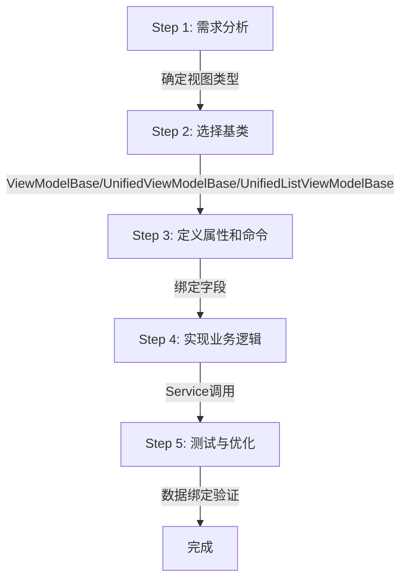

# LYBT.Desktop.Models层使用指南 - ViewModelBase实战开发

## 📋 文档元数据

- **文档类型**: 开发指南（How-To Guide）
- **适用范围**: Client端 - Desktop WPF应用
- **目标读者**: Client端ViewModel开发者
- **前置知识**: C#基础、MVVM模式、WPF数据绑定
- **版本**: v1.0
- **最后更新**: 2025-10-29
- **相关Epic**: Issue #1718 Phase 1 - 开发指南完善

## 📖 文档概述

本文档是 `LYBT.Desktop.Models` 层的实战开发指南,指导开发者如何使用ViewModelBase基类体系创建标准化的ViewModel。通过完整的代码示例和实战案例,帮助开发者快速掌握MVVM模式开发,包括属性绑定、命令处理、异步操作、数据验证、导航支持等核心功能。

### 本文档的目标

- ✅ **快速上手**: 5分钟创建第一个ViewModel
- ✅ **标准化开发**: 统一的ViewModel开发模式
- ✅ **避免常见陷阱**: 列举常见错误和最佳实践
- ✅ **实战案例**: 完整的患者列表和编辑ViewModel

### 前置阅读

- **架构设计**: [docs/explanation/architecture/client/models-layer-design.md](../../explanation/architecture/client/models-layer-design.md) - Models层架构设计
- **DTO使用**: [docs/how-to-guides/shared/dto-development.md](../shared/dto-development.md) - DTO开发指南
- **快速参考**: [docs/quick-reference/code-patterns.md](../../quick-reference/code-patterns.md) - MVVM模式速查

---

## 1. 开发流程总览

### 1.1 ViewModel创建五步法



### 1.2 关键决策点

| 决策点 | 选项 | 适用场景 |
|--------|------|---------|
| **基类选择** | ViewModelBase | 基础状态管理,不需要导航和对话框 |
|             | UnifiedViewModelBase | 需要导航、对话框、会话管理 |
|             | UnifiedListViewModelBase\<T\> | 列表页面（分页、搜索、批量操作） |
| **属性定义** | 普通属性 | 简单数据展示 |
|             | 计算属性 | 基于其他属性计算的只读属性 |
|             | ObservableCollection\<T\> | 列表数据（自动通知UI） |
| **命令处理** | DelegateCommand | 无参数命令 |
|             | DelegateCommand\<T\> | 带参数命令 |
|             | ExecuteSafelyAsync | 异步操作（自动状态管理） |
| **验证方式** | DataAnnotations | 简单字段验证（[Required], [StringLength]） |
|             | FluentValidation | 复杂验证（条件验证、跨字段验证） |

---

## 2. 环境准备

### 2.1 项目结构

```
LYBT.Desktop.{ModuleName}/
├── ViewModels/
│   ├── {Entity}ListViewModel.cs      # 列表ViewModel
│   ├── {Entity}DetailViewModel.cs    # 详情ViewModel
│   ├── {Entity}EditViewModel.cs      # 编辑ViewModel
│   └── {Entity}CreateViewModel.cs    # 创建ViewModel
└── Views/
    ├── {Entity}ListView.xaml          # 列表视图
    ├── {Entity}DetailView.xaml        # 详情视图
    ├── {Entity}EditView.xaml          # 编辑视图
    └── {Entity}CreateView.xaml        # 创建视图
```

### 2.2 依赖注入注册

**在模块的Module.cs中注册ViewModel**：

```csharp
using Microsoft.Extensions.DependencyInjection;
using Prism.Ioc;
using Prism.Modularity;

namespace LYBT.Desktop.Patients
{
    public class PatientsModule : IModule
    {
        public void RegisterTypes(IContainerRegistry containerRegistry)
        {
            // 注册ViewModel（Transient生命周期）
            containerRegistry.Register<PatientListViewModel>();
            containerRegistry.Register<PatientDetailViewModel>();
            containerRegistry.Register<PatientEditViewModel>();
            containerRegistry.Register<PatientCreateViewModel>();

            // 注册View与ViewModel的关联
            containerRegistry.RegisterForNavigation<PatientListView, PatientListViewModel>();
            containerRegistry.RegisterForNavigation<PatientDetailView, PatientDetailViewModel>();
            containerRegistry.RegisterForNavigation<PatientEditView, PatientEditViewModel>();
            containerRegistry.RegisterForNavigation<PatientCreateView, PatientCreateViewModel>();
        }

        public void OnInitialized(IContainerProvider containerProvider)
        {
            // 模块初始化逻辑
        }
    }
}
```

### 2.3 必需的using语句

```csharp
// 基础
using System;
using System.Collections.Generic;
using System.Collections.ObjectModel;
using System.ComponentModel.DataAnnotations;
using System.Threading.Tasks;
using System.Windows;

// Prism
using Prism.Commands;
using Prism.Events;
using Prism.Ioc;
using Prism.Mvvm;
using Prism.Regions;

// Logging
using Microsoft.Extensions.Logging;

// Models层基础设施
using LYBT.Desktop.Models.ViewModels.Base;

// DTO和Service接口
using LYBT.Shared.Models.Contracts.Patients;
using LYBT.Server.Interfaces.Services;
```

---

## 3. 创建基础ViewModel

### 3.1 最简单的ViewModel（无导航）

**适用场景**：对话框、弹出窗口、嵌入式控件

```csharp
using LYBT.Desktop.Models.ViewModels.Base;
using Microsoft.Extensions.Logging;
using Prism.Events;

namespace LYBT.Desktop.Patients.ViewModels
{
    /// <summary>
    /// 患者详情ViewModel - 最简单示例
    /// </summary>
    public class PatientDetailViewModel : ViewModelBase
    {
        #region 依赖服务

        private readonly IPatientService _patientService;

        #endregion

        #region 属性

        private PatientDto? _currentPatient;

        /// <summary>
        /// 当前患者
        /// </summary>
        public PatientDto? CurrentPatient
        {
            get => _currentPatient;
            set => SetProperty(ref _currentPatient, value);
        }

        #endregion

        #region 构造函数

        public PatientDetailViewModel(
            IEventAggregator eventAggregator,
            ILoggerFactory loggerFactory,
            IPatientService patientService)
            : base(eventAggregator, loggerFactory)
        {
            _patientService = patientService;
        }

        #endregion

        #region 公开方法

        /// <summary>
        /// 加载患者详情
        /// </summary>
        public async Task LoadPatientAsync(Guid patientId)
        {
            await ExecuteSafelyAsync(async () =>
            {
                var patient = await _patientService.GetByIdAsync(patientId);
                CurrentPatient = patient;
            }, "加载患者详情");
        }

        #endregion
    }
}
```

**XAML数据绑定**：

```xml
<UserControl x:Class="LYBT.Desktop.Patients.Views.PatientDetailView"
             xmlns:prism="http://prismlibrary.com/">
    <Grid>
        <!-- 加载指示器 -->
        <ProgressBar IsIndeterminate="{Binding IsLoading}"
                     Visibility="{Binding IsLoading, Converter={StaticResource BoolToVisibilityConverter}}"
                     VerticalAlignment="Top" Height="4" />

        <!-- 患者信息 -->
        <StackPanel DataContext="{Binding CurrentPatient}">
            <TextBlock Text="{Binding Name}" FontSize="24" FontWeight="Bold" />
            <TextBlock Text="{Binding Gender}" />
            <TextBlock Text="{Binding Age, StringFormat='年龄: {0}岁'}" />
            <TextBlock Text="{Binding PhoneNumber, StringFormat='电话: {0}'}" />
        </StackPanel>

        <!-- 状态栏 -->
        <StatusBar DockPanel.Dock="Bottom">
            <StatusBarItem>
                <TextBlock Text="{Binding StatusMessage}" />
            </StatusBarItem>
        </StatusBar>
    </Grid>
</UserControl>
```

### 3.2 带导航支持的ViewModel（推荐）

**适用场景**：页面导航、参数传递

```csharp
using LYBT.Desktop.Models.ViewModels.Base;
using Microsoft.Extensions.Logging;
using Prism.Events;
using Prism.Regions;
using Prism.Services.Dialogs;

namespace LYBT.Desktop.Patients.ViewModels
{
    /// <summary>
    /// 患者详情ViewModel - 带导航支持
    /// </summary>
    public class PatientDetailViewModel : UnifiedViewModelBase
    {
        #region 依赖服务

        private readonly IPatientService _patientService;

        #endregion

        #region 属性

        private Guid _patientId;
        private PatientDto? _currentPatient;

        public PatientDto? CurrentPatient
        {
            get => _currentPatient;
            set => SetProperty(ref _currentPatient, value);
        }

        #endregion

        #region 构造函数

        public PatientDetailViewModel(
            IEventAggregator eventAggregator,
            ILoggerFactory loggerFactory,
            IRegionManager regionManager,
            IPatientService patientService,
            ISessionManager sessionManager,
            IUserNotificationService userNotificationService)
            : base(eventAggregator, loggerFactory, regionManager, sessionManager, userNotificationService)
        {
            _patientService = patientService;
            PageTitle = "患者详情";
        }

        #endregion

        #region INavigationAware实现

        /// <summary>
        /// 处理导航参数（同步）
        /// </summary>
        protected override void ProcessNavigationParameters(NavigationParameters parameters)
        {
            // 提取PatientId参数
            if (parameters.TryGetValue("PatientId", out Guid patientId))
            {
                _patientId = patientId;
            }
            else
            {
                Logger.LogWarning("导航参数缺少PatientId");
            }
        }

        /// <summary>
        /// 异步初始化数据
        /// </summary>
        protected override async Task InitializeAsync(NavigationParameters parameters)
        {
            await ExecuteSafelyAsync(async () =>
            {
                if (_patientId != Guid.Empty)
                {
                    var patient = await _patientService.GetByIdAsync(_patientId);
                    CurrentPatient = patient;
                }
            }, "加载患者详情");
        }

        #endregion
    }
}
```

**导航到该页面**：

```csharp
// 从其他ViewModel导航到患者详情
private void OnPatientSelected(PatientDto patient)
{
    var parameters = new NavigationParameters
    {
        { "PatientId", patient.Id }
    };

    NavigateTo(
        regionName: "ContentRegion",
        viewName: "PatientDetailView",
        parameters: parameters);
}
```

---

## 4. 实现INotifyPropertyChanged（属性绑定）

### 4.1 简单属性绑定

```csharp
public class PatientEditViewModel : UnifiedViewModelBase
{
    private string _name = string.Empty;
    private Gender _gender = Gender.Unknown;
    private DateTime? _birthDate;

    /// <summary>
    /// 患者姓名
    /// </summary>
    public string Name
    {
        get => _name;
        set => SetProperty(ref _name, value); // 自动触发PropertyChanged
    }

    /// <summary>
    /// 性别
    /// </summary>
    public Gender Gender
    {
        get => _gender;
        set => SetProperty(ref _gender, value);
    }

    /// <summary>
    /// 出生日期
    /// </summary>
    public DateTime? BirthDate
    {
        get => _birthDate;
        set
        {
            if (SetProperty(ref _birthDate, value))
            {
                // 出生日期变化时，触发Age属性更新
                RaisePropertyChanged(nameof(Age));
            }
        }
    }
}
```

### 4.2 计算属性（只读属性）

```csharp
/// <summary>
/// 年龄（基于出生日期计算）
/// </summary>
public int? Age
{
    get
    {
        if (BirthDate == null) return null;

        var today = DateTime.Today;
        var age = today.Year - BirthDate.Value.Year;

        // 如果今年的生日还没到，年龄减1
        if (BirthDate.Value.Date > today.AddYears(-age))
        {
            age--;
        }

        return age;
    }
}

/// <summary>
/// 是否有未保存的修改
/// </summary>
public bool HasUnsavedChanges
{
    get
    {
        if (_originalPatient == null) return false;

        return Name != _originalPatient.Name ||
               Gender != _originalPatient.Gender ||
               BirthDate != _originalPatient.BirthDate;
    }
}
```

**XAML绑定**：

```xml
<!-- 显示计算属性 -->
<TextBlock Text="{Binding Age, StringFormat='年龄: {0}岁'}" />

<!-- 基于计算属性控制按钮可见性 -->
<Button Content="保存"
        Visibility="{Binding HasUnsavedChanges, Converter={StaticResource BoolToVisibilityConverter}}"
        Command="{Binding SaveCommand}" />
```

### 4.3 ObservableCollection集合绑定

```csharp
public class PatientListViewModel : UnifiedViewModelBase
{
    private ObservableCollection<PatientDto> _patients;
    private PatientDto? _selectedPatient;

    /// <summary>
    /// 患者列表（自动通知UI）
    /// </summary>
    public ObservableCollection<PatientDto> Patients
    {
        get => _patients;
        set => SetProperty(ref _patients, value);
    }

    /// <summary>
    /// 选中的患者
    /// </summary>
    public PatientDto? SelectedPatient
    {
        get => _selectedPatient;
        set
        {
            if (SetProperty(ref _selectedPatient, value))
            {
                // 选中项变化时，触发命令状态刷新
                DeleteCommand?.RaiseCanExecuteChanged();
            }
        }
    }

    /// <summary>
    /// 加载患者列表
    /// </summary>
    private async Task LoadPatientsAsync()
    {
        await ExecuteSafelyAsync(async () =>
        {
            var result = await _patientService.GetAllAsync();

            // 替换整个集合（UI自动刷新）
            Patients = new ObservableCollection<PatientDto>(result);
        }, "加载患者列表");
    }
}
```

**XAML绑定**：

```xml
<!-- ListBox绑定ObservableCollection -->
<ListBox ItemsSource="{Binding Patients}"
         SelectedItem="{Binding SelectedPatient}">
    <ListBox.ItemTemplate>
        <DataTemplate>
            <StackPanel>
                <TextBlock Text="{Binding Name}" FontWeight="Bold" />
                <TextBlock Text="{Binding Age, StringFormat='年龄: {0}岁'}" />
            </StackPanel>
        </DataTemplate>
    </ListBox.ItemTemplate>
</ListBox>

<!-- 显示选中患者的详情 -->
<Grid DataContext="{Binding SelectedPatient}">
    <TextBlock Text="{Binding Name}" />
    <TextBlock Text="{Binding PhoneNumber}" />
</Grid>
```

---

## 5. 使用ExecuteSafelyAsync（异步安全执行）

### 5.1 无返回值的异步操作

```csharp
/// <summary>
/// 保存患者
/// </summary>
private async Task SavePatientAsync()
{
    await ExecuteSafelyAsync(async () =>
    {
        // 调用Service保存数据
        await _patientService.UpdateAsync(_currentPatient);

        // 保存成功后的操作
        await ShowSuccessMessageAsync("保存成功");

        // 导航回列表页面
        NavigateBack("ContentRegion");
    }, "保存患者");
}
```

**ExecuteSafelyAsync自动处理**：
- ✅ 设置 `IsBusy = true`（禁用按钮）
- ✅ 清除错误状态 `ClearError()`
- ✅ 显示状态消息 `StatusMessage = "正在保存患者..."`
- ✅ 捕获异常并转换为友好消息
- ✅ 显示错误对话框
- ✅ 操作完成后设置 `IsBusy = false`
- ✅ 3秒后自动清除StatusMessage

### 5.2 有返回值的异步操作

```csharp
/// <summary>
/// 搜索患者
/// </summary>
private async Task SearchPatientsAsync()
{
    var result = await ExecuteSafelyAsync(
        async () =>
        {
            return await _patientService.SearchAsync(SearchText);
        },
        operationName: "搜索患者",
        defaultValue: new List<PatientDto>() // 异常时返回空列表
    );

    // result不会为null（异常时返回defaultValue）
    Patients = new ObservableCollection<PatientDto>(result);
}
```

### 5.3 禁用进度提示

```csharp
/// <summary>
/// 后台静默加载（不显示进度条和状态消息）
/// </summary>
private async Task SilentLoadAsync()
{
    await ExecuteSafelyAsync(
        async () =>
        {
            await _patientService.GetAllAsync();
        },
        operationName: "后台加载",
        showProgress: false // 禁用进度提示
    );
}
```

---

## 6. 命令绑定（DelegateCommand）

### 6.1 无参数命令

```csharp
public class PatientEditViewModel : UnifiedViewModelBase
{
    public DelegateCommand SaveCommand { get; private set; }
    public DelegateCommand CancelCommand { get; private set; }
    public DelegateCommand RefreshCommand { get; private set; }

    protected override void InitializeCommands()
    {
        // 保存命令（异步 + CanExecute）
        SaveCommand = new DelegateCommand(
            async () => await SaveAsync(),
            () => !HasErrors && !IsBusy); // CanExecute条件

        // 取消命令（同步）
        CancelCommand = new DelegateCommand(
            OnCancel,
            () => !IsBusy);

        // 刷新命令（异步 + 始终可执行）
        RefreshCommand = new DelegateCommand(
            async () => await RefreshAsync());
    }

    private async Task SaveAsync()
    {
        await ExecuteSafelyAsync(async () =>
        {
            await _patientService.UpdateAsync(CurrentPatient);
            await ShowSuccessMessageAsync("保存成功");
        }, "保存患者");
    }

    private void OnCancel()
    {
        NavigateBack("ContentRegion");
    }

    private async Task RefreshAsync()
    {
        await ExecuteSafelyAsync(async () =>
        {
            CurrentPatient = await _patientService.GetByIdAsync(_patientId);
        }, "刷新数据");
    }

    // 状态变化时刷新命令
    protected override void RefreshCommands()
    {
        SaveCommand?.RaiseCanExecuteChanged();
        CancelCommand?.RaiseCanExecuteChanged();
    }
}
```

**XAML绑定**：

```xml
<StackPanel Orientation="Horizontal">
    <!-- 保存按钮（CanExecute自动控制IsEnabled） -->
    <Button Content="保存" Command="{Binding SaveCommand}" />

    <!-- 取消按钮 -->
    <Button Content="取消" Command="{Binding CancelCommand}" />

    <!-- 刷新按钮 -->
    <Button Content="刷新" Command="{Binding RefreshCommand}" />
</StackPanel>
```

### 6.2 带参数命令

```csharp
public class PatientListViewModel : UnifiedViewModelBase
{
    public DelegateCommand<PatientDto> DeleteCommand { get; private set; }
    public DelegateCommand<PatientDto> ViewDetailsCommand { get; private set; }

    protected override void InitializeCommands()
    {
        // 删除命令（带参数）
        DeleteCommand = new DelegateCommand<PatientDto>(
            async patient => await ExecuteDeleteAsync(patient),
            CanExecuteDelete);

        // 查看详情命令
        ViewDetailsCommand = new DelegateCommand<PatientDto>(
            OnViewDetails);
    }

    private async Task ExecuteDeleteAsync(PatientDto patient)
    {
        if (!await ShowConfirmationAsync($"确定要删除患者 {patient.Name} 吗？", "确认删除"))
        {
            return;
        }

        await ExecuteSafelyAsync(async () =>
        {
            await _patientService.DeleteAsync(patient.Id);
            Patients.Remove(patient); // 从集合中移除
            await ShowSuccessMessageAsync("删除成功");
        }, "删除患者");
    }

    private bool CanExecuteDelete(PatientDto patient)
    {
        return patient != null && !IsBusy;
    }

    private void OnViewDetails(PatientDto patient)
    {
        var parameters = new NavigationParameters
        {
            { "PatientId", patient.Id }
        };

        NavigateTo("ContentRegion", "PatientDetailView", parameters);
    }
}
```

**XAML绑定（在DataTemplate中）**：

```xml
<ListBox ItemsSource="{Binding Patients}">
    <ListBox.ItemTemplate>
        <DataTemplate>
            <StackPanel Orientation="Horizontal">
                <TextBlock Text="{Binding Name}" Width="150" />
                <TextBlock Text="{Binding Age}" Width="50" />

                <!-- 查看详情按钮（传递当前项作为参数） -->
                <Button Content="详情"
                        Command="{Binding DataContext.ViewDetailsCommand, RelativeSource={RelativeSource AncestorType=ListBox}}"
                        CommandParameter="{Binding}" />

                <!-- 删除按钮（传递当前项作为参数） -->
                <Button Content="删除"
                        Command="{Binding DataContext.DeleteCommand, RelativeSource={RelativeSource AncestorType=ListBox}}"
                        CommandParameter="{Binding}" />
            </StackPanel>
        </DataTemplate>
    </ListBox.ItemTemplate>
</ListBox>
```

---

## 7. 数据验证（INotifyDataErrorInfo）

### 7.1 使用DataAnnotations验证

```csharp
public class PatientEditViewModel : UnifiedViewModelBase
{
    private string _name = string.Empty;
    private string _phoneNumber = string.Empty;

    [Required(ErrorMessage = "患者姓名不能为空")]
    [StringLength(50, ErrorMessage = "患者姓名不能超过50个字符")]
    public string Name
    {
        get => _name;
        set
        {
            if (SetProperty(ref _name, value))
            {
                ValidateProperty(); // 自动触发DataAnnotations验证
            }
        }
    }

    [RegularExpression(@"^1[3-9]\d{9}$", ErrorMessage = "手机号码格式不正确")]
    public string PhoneNumber
    {
        get => _phoneNumber;
        set
        {
            if (SetProperty(ref _phoneNumber, value))
            {
                ValidateProperty();
            }
        }
    }

    private async Task SaveAsync()
    {
        // 保存前验证所有属性
        ValidateAllProperties();

        if (HasErrors)
        {
            await ShowErrorMessageAsync("请修正输入错误后再保存");
            return;
        }

        // 继续保存逻辑...
    }
}
```

**XAML验证错误绑定**：

```xml
<!-- 方式1: 使用索引器绑定（推荐） -->
<TextBox Text="{Binding Name, UpdateSourceTrigger=PropertyChanged}">
    <TextBox.Style>
        <Style TargetType="TextBox">
            <Style.Triggers>
                <DataTrigger Binding="{Binding HasErrorsDictionary[Name]}" Value="True">
                    <Setter Property="BorderBrush" Value="Red" />
                    <Setter Property="BorderThickness" Value="2" />
                </DataTrigger>
            </Style.Triggers>
        </Style>
    </TextBox.Style>
</TextBox>
<TextBlock Text="{Binding Errors[Name]}" Foreground="Red" FontSize="12" />

<!-- 方式2: 使用INotifyDataErrorInfo自动显示 -->
<TextBox Text="{Binding Name, ValidatesOnNotifyDataErrors=True, UpdateSourceTrigger=PropertyChanged}" />
```

### 7.2 使用FluentValidation验证

```csharp
using FluentValidation;

// FluentValidation验证器定义
public class PatientValidator : AbstractValidator<PatientDto>
{
    private readonly IPatientRepository _patientRepository;

    public PatientValidator(IPatientRepository patientRepository)
    {
        _patientRepository = patientRepository;

        RuleFor(x => x.Name)
            .NotEmpty().WithMessage("患者姓名不能为空")
            .MaximumLength(50).WithMessage("患者姓名不能超过50个字符");

        RuleFor(x => x.PhoneNumber)
            .Matches(@"^1[3-9]\d{9}$").WithMessage("手机号码格式不正确")
            .When(x => !string.IsNullOrEmpty(x.PhoneNumber));

        RuleFor(x => x.BirthDate)
            .LessThan(DateTime.Now).WithMessage("出生日期不能是未来日期")
            .When(x => x.BirthDate.HasValue);

        // 异步验证：手机号码唯一性
        RuleFor(x => x.PhoneNumber)
            .MustAsync(async (phoneNumber, cancellation) =>
            {
                if (string.IsNullOrEmpty(phoneNumber)) return true;
                var existing = await _patientRepository.GetByPhoneNumberAsync(phoneNumber);
                return existing == null;
            })
            .WithMessage("手机号码已被使用")
            .When(x => !string.IsNullOrEmpty(x.PhoneNumber));
    }
}

// ViewModel中使用FluentValidation
public class PatientEditViewModel : UnifiedViewModelBase
{
    private readonly IValidator<PatientDto> _validator;

    public PatientEditViewModel(
        IEventAggregator eventAggregator,
        ILoggerFactory loggerFactory,
        IRegionManager regionManager,
        IPatientService patientService,
        IValidator<PatientDto> validator)
        : base(eventAggregator, loggerFactory, regionManager)
    {
        _patientService = patientService;
        _validator = validator;
    }

    private async Task SaveAsync()
    {
        // FluentValidation验证
        var validationResult = await _validator.ValidateAsync(CurrentPatient);

        if (!validationResult.IsValid)
        {
            // 将FluentValidation错误转换为INotifyDataErrorInfo
            foreach (var error in validationResult.Errors)
            {
                AddValidationError(error.PropertyName, error.ErrorMessage);
            }

            await ShowErrorMessageAsync("请修正输入错误后再保存");
            return;
        }

        // 继续保存逻辑...
        await ExecuteSafelyAsync(async () =>
        {
            await _patientService.UpdateAsync(CurrentPatient);
        }, "保存患者");
    }
}
```

---

## 8. 导航支持（INavigationAware）

### 8.1 导航到其他页面

```csharp
public class PatientListViewModel : UnifiedViewModelBase
{
    /// <summary>
    /// 导航到患者详情
    /// </summary>
    private void OnViewDetails(PatientDto patient)
    {
        var parameters = new NavigationParameters
        {
            { "PatientId", patient.Id },
            { "Mode", "View" }
        };

        NavigateTo(
            regionName: "ContentRegion",
            viewName: "PatientDetailView",
            parameters: parameters);
    }

    /// <summary>
    /// 导航到患者编辑
    /// </summary>
    private void OnEditPatient(PatientDto patient)
    {
        var parameters = new NavigationParameters
        {
            { "PatientId", patient.Id },
            { "Mode", "Edit" }
        };

        NavigateTo("ContentRegion", "PatientEditView", parameters);
    }

    /// <summary>
    /// 导航到创建患者
    /// </summary>
    private void OnCreatePatient()
    {
        NavigateTo("ContentRegion", "PatientCreateView");
    }
}
```

### 8.2 接收导航参数

```csharp
public class PatientDetailViewModel : UnifiedViewModelBase
{
    private Guid _patientId;
    private string _mode = "View";

    /// <summary>
    /// 处理导航参数（同步）
    /// </summary>
    protected override void ProcessNavigationParameters(NavigationParameters parameters)
    {
        // 提取PatientId参数
        if (parameters.TryGetValue("PatientId", out Guid patientId))
        {
            _patientId = patientId;
        }

        // 提取Mode参数
        if (parameters.TryGetValue("Mode", out string mode))
        {
            _mode = mode;
        }

        Logger.LogDebug("导航参数: PatientId={PatientId}, Mode={Mode}", _patientId, _mode);
    }

    /// <summary>
    /// 异步初始化数据
    /// </summary>
    protected override async Task InitializeAsync(NavigationParameters parameters)
    {
        await ExecuteSafelyAsync(async () =>
        {
            if (_patientId != Guid.Empty)
            {
                var patient = await _patientService.GetByIdAsync(_patientId);
                CurrentPatient = patient;
            }

            // 根据Mode调整UI状态
            IsReadOnly = _mode == "View";
        }, "加载患者详情");
    }
}
```

### 8.3 控制视图缓存（KeepAlive）

```csharp
// 场景1: 工作站主页（需要缓存，避免重复加载）
public class MainWorkstationViewModel : UnifiedViewModelBase
{
    public override bool KeepAlive => true; // 缓存视图
}

// 场景2: 编辑对话框（不缓存，每次创建新实例）
public class PatientEditViewModel : UnifiedViewModelBase
{
    public override bool KeepAlive => false; // 每次创建新实例
}

// 场景3: 列表页面（根据业务需求决定）
public class PatientListViewModel : UnifiedListViewModelBase<PatientDto>
{
    // 如果列表数据频繁变化，不缓存
    public override bool KeepAlive => false;
}
```

---

## 9. 事件聚合器（EventAggregator）

### 9.1 定义事件

```csharp
using Prism.Events;

namespace LYBT.Desktop.Patients.Events
{
    /// <summary>
    /// 患者选中事件
    /// </summary>
    public class PatientSelectedEvent : PubSubEvent<PatientDto>
    {
    }

    /// <summary>
    /// 患者更新事件
    /// </summary>
    public class PatientUpdatedEvent : PubSubEvent<PatientDto>
    {
    }

    /// <summary>
    /// 患者删除事件
    /// </summary>
    public class PatientDeletedEvent : PubSubEvent<Guid>
    {
    }
}
```

### 9.2 发布事件

```csharp
public class PatientListViewModel : UnifiedViewModelBase
{
    /// <summary>
    /// 患者选中时发布事件
    /// </summary>
    private void OnPatientSelectionChanged()
    {
        if (SelectedPatient != null)
        {
            // 发布患者选中事件
            EventAggregator.GetEvent<PatientSelectedEvent>()
                .Publish(SelectedPatient);
        }
    }

    /// <summary>
    /// 删除患者后发布事件
    /// </summary>
    private async Task ExecuteDeleteAsync(PatientDto patient)
    {
        await ExecuteSafelyAsync(async () =>
        {
            await _patientService.DeleteAsync(patient.Id);
            Patients.Remove(patient);

            // 发布患者删除事件
            EventAggregator.GetEvent<PatientDeletedEvent>()
                .Publish(patient.Id);
        }, "删除患者");
    }
}
```

### 9.3 订阅事件

```csharp
public class MedicalCaseListViewModel : UnifiedViewModelBase
{
    protected override void SubscribeToEvents()
    {
        base.SubscribeToEvents();

        // 订阅患者选中事件（UI线程）
        var subscription1 = EventAggregator.GetEvent<PatientSelectedEvent>()
            .Subscribe(OnPatientSelected, ThreadOption.UIThread);
        AddDisposable(subscription1); // 自动取消订阅

        // 订阅患者删除事件（后台线程）
        var subscription2 = EventAggregator.GetEvent<PatientDeletedEvent>()
            .Subscribe(OnPatientDeleted, ThreadOption.BackgroundThread);
        AddDisposable(subscription2);
    }

    private void OnPatientSelected(PatientDto patient)
    {
        CurrentPatient = patient;
        _ = LoadMedicalCasesAsync();
    }

    private void OnPatientDeleted(Guid patientId)
    {
        // 从列表中移除该患者的病案
        var casesToRemove = MedicalCases.Where(mc => mc.PatientId == patientId).ToList();
        foreach (var caseItem in casesToRemove)
        {
            MedicalCases.Remove(caseItem);
        }
    }
}
```

**事件聚合器优势**：
- ✅ **解耦ViewModel**: 发布者和订阅者无需直接依赖
- ✅ **线程安全**: 支持UIThread、BackgroundThread、PublisherThread选项
- ✅ **自动取消订阅**: 通过AddDisposable实现资源管理

---

## 10. 资源管理（IDisposable）

### 10.1 自动资源清理

```csharp
public class PatientListViewModel : UnifiedViewModelBase
{
    private readonly System.Timers.Timer _refreshTimer;

    public PatientListViewModel(...)
        : base(...)
    {
        // 自动订阅事件
        var subscription = EventAggregator.GetEvent<PatientSelectedEvent>()
            .Subscribe(OnPatientSelected, ThreadOption.UIThread);
        AddDisposable(subscription); // 注册到资源清理队列

        // 定时器
        _refreshTimer = new System.Timers.Timer(60000); // 60秒刷新
        _refreshTimer.Elapsed += (s, e) => _ = RefreshAsync();
        _refreshTimer.Start();
        AddDisposable(_refreshTimer); // 注册到资源清理队列
    }

    protected override void OnDisposing()
    {
        base.OnDisposing();

        // 清理其他资源（如HttpClient、CancellationTokenSource等）
        _cancellationTokenSource?.Cancel();
        _cancellationTokenSource?.Dispose();
    }
}
```

### 10.2 防止内存泄漏

```csharp
// ❌ 错误示例：事件订阅未取消，导致ViewModel无法释放
public class PatientListViewModel : ViewModelBase
{
    public PatientListViewModel(...)
    {
        EventAggregator.GetEvent<PatientSelectedEvent>()
            .Subscribe(OnPatientSelected); // 未注册到_disposables
    }
}

// ✅ 正确示例：通过AddDisposable自动取消订阅
public class PatientListViewModel : ViewModelBase
{
    public PatientListViewModel(...)
    {
        var subscription = EventAggregator.GetEvent<PatientSelectedEvent>()
            .Subscribe(OnPatientSelected);

        AddDisposable(subscription); // 注册到资源清理队列
    }
}
```

---

## 11. 列表ViewModel（UnifiedListViewModelBase\<T\>）

### 11.1 基础列表ViewModel

```csharp
using LYBT.Desktop.Models.ViewModels.Base;
using System.Collections.ObjectModel;

namespace LYBT.Desktop.Patients.ViewModels
{
    /// <summary>
    /// 患者列表ViewModel
    /// </summary>
    public class PatientListViewModel : UnifiedListViewModelBase<PatientDto>
    {
        #region 依赖服务

        private readonly IPatientService _patientService;

        #endregion

        #region 构造函数

        public PatientListViewModel(
            IEventAggregator eventAggregator,
            ILoggerFactory loggerFactory,
            IRegionManager regionManager,
            IPatientService patientService,
            ISessionManager sessionManager,
            IUserNotificationService userNotificationService)
            : base(eventAggregator, loggerFactory, regionManager, sessionManager, userNotificationService)
        {
            _patientService = patientService;
            PageTitle = "患者列表";
            PageSize = 20; // 设置每页大小
        }

        #endregion

        #region 重写方法

        /// <summary>
        /// 加载分页数据
        /// </summary>
        protected override async Task LoadPageAsync()
        {
            await ExecuteSafelyAsync(async () =>
            {
                var result = await _patientService.GetPagedAsync(CurrentPage, PageSize);
                Items = new ObservableCollection<PatientDto>(result.Items);
                TotalCount = result.TotalCount;
            }, "加载患者列表");
        }

        /// <summary>
        /// 搜索数据
        /// </summary>
        protected override async Task SearchAsync()
        {
            await ExecuteSafelyAsync(async () =>
            {
                CurrentPage = 1; // 重置到第一页
                var result = await _patientService.SearchAsync(SearchText, CurrentPage, PageSize);
                Items = new ObservableCollection<PatientDto>(result.Items);
                TotalCount = result.TotalCount;
            }, "搜索患者");
        }

        /// <summary>
        /// 添加患者
        /// </summary>
        protected override async Task OnExecuteAddAsync()
        {
            NavigateTo("ContentRegion", "PatientCreateView");
        }

        /// <summary>
        /// 删除患者
        /// </summary>
        protected override async Task ExecuteDeleteAsync(PatientDto patient)
        {
            if (!await ShowConfirmationAsync($"确定要删除患者 {patient.Name} 吗？", "确认删除"))
            {
                return;
            }

            await ExecuteSafelyAsync(async () =>
            {
                await _patientService.DeleteAsync(patient.Id);
                await RefreshAsync(); // 刷新列表
            }, "删除患者");
        }

        /// <summary>
        /// CanExecute: 是否可以删除
        /// </summary>
        protected override bool CanExecuteDelete(PatientDto patient)
        {
            return patient != null && !IsBusy;
        }

        /// <summary>
        /// CanExecute: 是否可以添加
        /// </summary>
        protected override bool CanExecuteAdd()
        {
            return !IsBusy && IsUserLoggedIn();
        }

        #endregion
    }
}
```

### 11.2 列表页面XAML

```xml
<UserControl x:Class="LYBT.Desktop.Patients.Views.PatientListView"
             xmlns:prism="http://prismlibrary.com/">
    <Grid>
        <Grid.RowDefinitions>
            <RowDefinition Height="Auto" />
            <RowDefinition Height="*" />
            <RowDefinition Height="Auto" />
            <RowDefinition Height="Auto" />
        </Grid.RowDefinitions>

        <!-- 工具栏 -->
        <StackPanel Grid.Row="0" Orientation="Horizontal" Margin="10">
            <!-- 搜索框 -->
            <TextBox Text="{Binding SearchText, UpdateSourceTrigger=PropertyChanged}"
                     Width="300" Height="30" Margin="5,0" />
            <Button Content="搜索" Command="{Binding SearchCommand}" Margin="5,0" />
            <Button Content="清除" Command="{Binding ClearSearchCommand}" Margin="5,0" />
            <Button Content="刷新" Command="{Binding RefreshCommand}" Margin="5,0" />
            <Button Content="添加" Command="{Binding AddCommand}" Margin="5,0" />
            <Button Content="批量删除" Command="{Binding BatchDeleteCommand}" Margin="5,0" />
        </StackPanel>

        <!-- 数据列表 -->
        <DataGrid Grid.Row="1"
                  ItemsSource="{Binding Items}"
                  SelectedItem="{Binding SelectedItem}"
                  AutoGenerateColumns="False"
                  IsReadOnly="True">
            <DataGrid.Columns>
                <DataGridTextColumn Header="姓名" Binding="{Binding Name}" Width="150" />
                <DataGridTextColumn Header="性别" Binding="{Binding Gender}" Width="100" />
                <DataGridTextColumn Header="年龄" Binding="{Binding Age}" Width="80" />
                <DataGridTextColumn Header="电话" Binding="{Binding PhoneNumber}" Width="150" />
                <DataGridTemplateColumn Header="操作" Width="200">
                    <DataGridTemplateColumn.CellTemplate>
                        <DataTemplate>
                            <StackPanel Orientation="Horizontal">
                                <Button Content="详情"
                                        Command="{Binding DataContext.ViewDetailsCommand, RelativeSource={RelativeSource AncestorType=DataGrid}}"
                                        CommandParameter="{Binding}"
                                        Margin="5,0" />
                                <Button Content="删除"
                                        Command="{Binding DataContext.DeleteCommand, RelativeSource={RelativeSource AncestorType=DataGrid}}"
                                        CommandParameter="{Binding}"
                                        Margin="5,0" />
                            </StackPanel>
                        </DataTemplate>
                    </DataGridTemplateColumn.CellTemplate>
                </DataGridTemplateColumn>
            </DataGrid.Columns>
        </DataGrid>

        <!-- 分页工具栏 -->
        <StackPanel Grid.Row="2" Orientation="Horizontal" HorizontalAlignment="Center" Margin="10">
            <Button Content="上一页"
                    Command="{Binding PreviousPageCommand}"
                    IsEnabled="{Binding CanGoPreviousPage}"
                    Margin="5,0" />
            <TextBlock Text="{Binding CurrentPage, StringFormat='第 {0} 页'}" VerticalAlignment="Center" Margin="10,0" />
            <TextBlock Text="{Binding TotalPages, StringFormat='共 {0} 页'}" VerticalAlignment="Center" Margin="10,0" />
            <TextBlock Text="{Binding TotalCount, StringFormat='共 {0} 条记录'}" VerticalAlignment="Center" Margin="10,0" />
            <Button Content="下一页"
                    Command="{Binding NextPageCommand}"
                    IsEnabled="{Binding CanGoNextPage}"
                    Margin="5,0" />
        </StackPanel>

        <!-- 状态栏 -->
        <StatusBar Grid.Row="3">
            <StatusBarItem>
                <TextBlock Text="{Binding StatusMessage}" />
            </StatusBarItem>
            <StatusBarItem HorizontalAlignment="Right">
                <ProgressBar Width="150" Height="16"
                             IsIndeterminate="{Binding IsLoading}"
                             Visibility="{Binding IsLoading, Converter={StaticResource BoolToVisibilityConverter}}" />
            </StatusBarItem>
        </StatusBar>
    </Grid>
</UserControl>
```

---

## 12. 完整实战案例：患者管理

### 12.1 患者列表ViewModel（完整版）

```csharp
using LYBT.Desktop.Models.ViewModels.Base;
using LYBT.Shared.Models.Contracts.Patients;
using LYBT.Server.Interfaces.Services;
using Microsoft.Extensions.Logging;
using Prism.Commands;
using Prism.Events;
using Prism.Regions;
using System;
using System.Collections.ObjectModel;
using System.Threading.Tasks;

namespace LYBT.Desktop.Patients.ViewModels
{
    /// <summary>
    /// 患者列表ViewModel - 完整实战案例
    /// </summary>
    public class PatientListViewModel : UnifiedListViewModelBase<PatientDto>
    {
        #region 依赖服务

        private readonly IPatientService _patientService;

        #endregion

        #region 自定义命令

        public DelegateCommand<PatientDto> ViewDetailsCommand { get; private set; }
        public DelegateCommand<PatientDto> EditCommand { get; private set; }

        #endregion

        #region 构造函数

        public PatientListViewModel(
            IEventAggregator eventAggregator,
            ILoggerFactory loggerFactory,
            IRegionManager regionManager,
            IPatientService patientService,
            ISessionManager sessionManager,
            IUserNotificationService userNotificationService)
            : base(eventAggregator, loggerFactory, regionManager, sessionManager, userNotificationService)
        {
            _patientService = patientService;
            PageTitle = "患者列表";
            PageSize = 20;
        }

        #endregion

        #region 重写命令初始化

        protected override void InitializeCommands()
        {
            base.InitializeCommands();

            // 查看详情命令
            ViewDetailsCommand = new DelegateCommand<PatientDto>(
                OnViewDetails,
                patient => patient != null);

            // 编辑命令
            EditCommand = new DelegateCommand<PatientDto>(
                OnEdit,
                patient => patient != null && !IsBusy);
        }

        #endregion

        #region 重写数据加载方法

        /// <summary>
        /// 加载分页数据
        /// </summary>
        protected override async Task LoadPageAsync()
        {
            await ExecuteSafelyAsync(async () =>
            {
                var result = await _patientService.GetPagedAsync(CurrentPage, PageSize);
                Items = new ObservableCollection<PatientDto>(result.Items);
                TotalCount = result.TotalCount;
            }, "加载患者列表");
        }

        /// <summary>
        /// 搜索数据
        /// </summary>
        protected override async Task SearchAsync()
        {
            await ExecuteSafelyAsync(async () =>
            {
                CurrentPage = 1;
                var result = await _patientService.SearchAsync(SearchText, CurrentPage, PageSize);
                Items = new ObservableCollection<PatientDto>(result.Items);
                TotalCount = result.TotalCount;
            }, "搜索患者");
        }

        /// <summary>
        /// 刷新数据
        /// </summary>
        protected override async Task RefreshAsync()
        {
            await LoadPageAsync();
        }

        #endregion

        #region 重写操作方法

        /// <summary>
        /// 添加患者
        /// </summary>
        protected override async Task OnExecuteAddAsync()
        {
            NavigateTo("ContentRegion", "PatientCreateView");
        }

        /// <summary>
        /// 删除患者
        /// </summary>
        protected override async Task ExecuteDeleteAsync(PatientDto patient)
        {
            if (!await ShowConfirmationAsync($"确定要删除患者 {patient.Name} 吗？", "确认删除"))
            {
                return;
            }

            await ExecuteSafelyAsync(async () =>
            {
                await _patientService.DeleteAsync(patient.Id);
                await RefreshAsync();
                await ShowSuccessMessageAsync("删除成功");
            }, "删除患者");
        }

        /// <summary>
        /// 批量删除患者
        /// </summary>
        protected override async Task ExecuteBatchDeleteAsync()
        {
            if (SelectedItems.Count == 0)
            {
                await ShowWarningMessageAsync("请选择要删除的患者");
                return;
            }

            if (!await ShowConfirmationAsync($"确定要删除选中的 {SelectedItems.Count} 个患者吗？", "确认批量删除"))
            {
                return;
            }

            await ExecuteSafelyAsync(async () =>
            {
                foreach (var patient in SelectedItems)
                {
                    await _patientService.DeleteAsync(patient.Id);
                }

                SelectedItems.Clear();
                await RefreshAsync();
                await ShowSuccessMessageAsync("批量删除成功");
            }, "批量删除患者");
        }

        /// <summary>
        /// CanExecute: 是否可以删除
        /// </summary>
        protected override bool CanExecuteDelete(PatientDto patient)
        {
            return patient != null && !IsBusy && IsUserLoggedIn();
        }

        /// <summary>
        /// CanExecute: 是否可以批量删除
        /// </summary>
        protected override bool CanExecuteBatchDelete()
        {
            return SelectedItems.Count > 0 && !IsBusy && IsUserLoggedIn();
        }

        /// <summary>
        /// CanExecute: 是否可以添加
        /// </summary>
        protected override bool CanExecuteAdd()
        {
            return !IsBusy && IsUserLoggedIn();
        }

        #endregion

        #region 自定义命令处理

        /// <summary>
        /// 查看患者详情
        /// </summary>
        private void OnViewDetails(PatientDto patient)
        {
            var parameters = new NavigationParameters
            {
                { "PatientId", patient.Id },
                { "Mode", "View" }
            };

            NavigateTo("ContentRegion", "PatientDetailView", parameters);
        }

        /// <summary>
        /// 编辑患者
        /// </summary>
        private void OnEdit(PatientDto patient)
        {
            var parameters = new NavigationParameters
            {
                { "PatientId", patient.Id },
                { "Mode", "Edit" }
            };

            NavigateTo("ContentRegion", "PatientEditView", parameters);
        }

        #endregion

        #region 导航支持

        /// <summary>
        /// 初始化异步数据
        /// </summary>
        protected override async Task InitializeAsync(NavigationParameters parameters)
        {
            await LoadPageAsync();
        }

        #endregion

        #region 刷新命令状态

        protected override void RefreshCommands()
        {
            base.RefreshCommands();

            ViewDetailsCommand?.RaiseCanExecuteChanged();
            EditCommand?.RaiseCanExecuteChanged();
        }

        #endregion
    }
}
```

### 12.2 患者编辑ViewModel（完整版）

```csharp
using LYBT.Desktop.Models.ViewModels.Base;
using LYBT.Shared.Models.Contracts.Patients;
using LYBT.Server.Interfaces.Services;
using Microsoft.Extensions.Logging;
using Prism.Commands;
using Prism.Events;
using Prism.Regions;
using System;
using System.ComponentModel.DataAnnotations;
using System.Threading.Tasks;

namespace LYBT.Desktop.Patients.ViewModels
{
    /// <summary>
    /// 患者编辑ViewModel - 完整实战案例
    /// </summary>
    public class PatientEditViewModel : UnifiedViewModelBase
    {
        #region 依赖服务

        private readonly IPatientService _patientService;

        #endregion

        #region 属性

        private Guid _patientId;
        private PatientDto? _originalPatient;
        private string _name = string.Empty;
        private Gender _gender = Gender.Unknown;
        private DateTime? _birthDate;
        private string _phoneNumber = string.Empty;
        private string _address = string.Empty;

        [Required(ErrorMessage = "患者姓名不能为空")]
        [StringLength(50, ErrorMessage = "患者姓名不能超过50个字符")]
        public string Name
        {
            get => _name;
            set
            {
                if (SetProperty(ref _name, value))
                {
                    ValidateProperty();
                    RaisePropertyChanged(nameof(HasUnsavedChanges));
                }
            }
        }

        public Gender Gender
        {
            get => _gender;
            set
            {
                if (SetProperty(ref _gender, value))
                {
                    RaisePropertyChanged(nameof(HasUnsavedChanges));
                }
            }
        }

        public DateTime? BirthDate
        {
            get => _birthDate;
            set
            {
                if (SetProperty(ref _birthDate, value))
                {
                    RaisePropertyChanged(nameof(Age));
                    RaisePropertyChanged(nameof(HasUnsavedChanges));
                }
            }
        }

        [RegularExpression(@"^1[3-9]\d{9}$", ErrorMessage = "手机号码格式不正确")]
        public string PhoneNumber
        {
            get => _phoneNumber;
            set
            {
                if (SetProperty(ref _phoneNumber, value))
                {
                    ValidateProperty();
                    RaisePropertyChanged(nameof(HasUnsavedChanges));
                }
            }
        }

        public string Address
        {
            get => _address;
            set
            {
                if (SetProperty(ref _address, value))
                {
                    RaisePropertyChanged(nameof(HasUnsavedChanges));
                }
            }
        }

        /// <summary>
        /// 年龄（计算属性）
        /// </summary>
        public int? Age
        {
            get
            {
                if (BirthDate == null) return null;

                var today = DateTime.Today;
                var age = today.Year - BirthDate.Value.Year;

                if (BirthDate.Value.Date > today.AddYears(-age))
                {
                    age--;
                }

                return age;
            }
        }

        /// <summary>
        /// 是否有未保存的修改
        /// </summary>
        public bool HasUnsavedChanges
        {
            get
            {
                if (_originalPatient == null) return false;

                return Name != _originalPatient.Name ||
                       Gender != _originalPatient.Gender ||
                       BirthDate != _originalPatient.BirthDate ||
                       PhoneNumber != _originalPatient.PhoneNumber ||
                       Address != _originalPatient.Address;
            }
        }

        #endregion

        #region 命令

        public DelegateCommand SaveCommand { get; private set; }
        public DelegateCommand CancelCommand { get; private set; }

        #endregion

        #region 构造函数

        public PatientEditViewModel(
            IEventAggregator eventAggregator,
            ILoggerFactory loggerFactory,
            IRegionManager regionManager,
            IPatientService patientService,
            ISessionManager sessionManager,
            IUserNotificationService userNotificationService)
            : base(eventAggregator, loggerFactory, regionManager, sessionManager, userNotificationService)
        {
            _patientService = patientService;
            PageTitle = "编辑患者";
        }

        #endregion

        #region 命令初始化

        protected override void InitializeCommands()
        {
            base.InitializeCommands();

            SaveCommand = new DelegateCommand(
                async () => await SaveAsync(),
                () => !HasErrors && !IsBusy && HasUnsavedChanges);

            CancelCommand = new DelegateCommand(
                OnCancel,
                () => !IsBusy);
        }

        #endregion

        #region 命令处理

        /// <summary>
        /// 保存患者
        /// </summary>
        private async Task SaveAsync()
        {
            // 验证所有属性
            ValidateAllProperties();

            if (HasErrors)
            {
                await ShowErrorMessageAsync("请修正输入错误后再保存");
                return;
            }

            await ExecuteSafelyAsync(async () =>
            {
                // 构建UpdateDto
                var updateDto = new PatientUpdateDto
                {
                    Id = _patientId,
                    Name = Name,
                    Gender = Gender,
                    BirthDate = BirthDate,
                    PhoneNumber = PhoneNumber,
                    Address = Address
                };

                // 调用Service保存
                await _patientService.UpdateAsync(updateDto);

                // 发布患者更新事件
                EventAggregator.GetEvent<PatientUpdatedEvent>()
                    .Publish(_originalPatient);

                await ShowSuccessMessageAsync("保存成功");

                // 导航回列表页面
                NavigateBack("ContentRegion");
            }, "保存患者");
        }

        /// <summary>
        /// 取消编辑
        /// </summary>
        private void OnCancel()
        {
            if (HasUnsavedChanges)
            {
                if (ShowConfirmMessage("有未保存的修改，确定要取消吗？", "确认取消"))
                {
                    NavigateBack("ContentRegion");
                }
            }
            else
            {
                NavigateBack("ContentRegion");
            }
        }

        #endregion

        #region 导航支持

        protected override void ProcessNavigationParameters(NavigationParameters parameters)
        {
            if (parameters.TryGetValue("PatientId", out Guid patientId))
            {
                _patientId = patientId;
            }
        }

        protected override async Task InitializeAsync(NavigationParameters parameters)
        {
            await ExecuteSafelyAsync(async () =>
            {
                if (_patientId != Guid.Empty)
                {
                    var patient = await _patientService.GetByIdAsync(_patientId);
                    _originalPatient = patient;

                    // 填充属性
                    Name = patient.Name;
                    Gender = patient.Gender;
                    BirthDate = patient.BirthDate;
                    PhoneNumber = patient.PhoneNumber ?? string.Empty;
                    Address = patient.Address ?? string.Empty;
                }
            }, "加载患者详情");
        }

        #endregion

        #region 刷新命令状态

        protected override void RefreshCommands()
        {
            base.RefreshCommands();

            SaveCommand?.RaiseCanExecuteChanged();
            CancelCommand?.RaiseCanExecuteChanged();
        }

        #endregion
    }
}
```

---

## 13. 常见问题与陷阱

### 问题1：在ViewModel中直接操作View

**❌ 错误示例**：

```csharp
// 违反MVVM模式
public class PatientListViewModel : ViewModelBase
{
    private readonly PatientListView _view;

    public PatientListViewModel(PatientListView view)
    {
        _view = view;
    }

    private void UpdateUI()
    {
        _view.ListBox.SelectedIndex = 0; // 破坏数据绑定
    }
}
```

**✅ 正确做法**：

```csharp
public class PatientListViewModel : ViewModelBase
{
    public int SelectedIndex { get; set; } // XAML绑定：ListBox.SelectedIndex
}
```

### 问题2：构造函数中执行耗时操作

**❌ 错误示例**：

```csharp
public PatientListViewModel(...)
{
    // 阻塞UI线程
    var patients = _patientService.GetAllAsync().Result;
    Patients = new ObservableCollection<PatientDto>(patients);
}
```

**✅ 正确做法**：

```csharp
protected override async Task InitializeAsync(NavigationParameters parameters)
{
    await ExecuteSafelyAsync(async () =>
    {
        var result = await _patientService.GetAllAsync();
        Patients = new ObservableCollection<PatientDto>(result);
    }, "加载患者列表");
}
```

### 问题3：事件订阅未取消（内存泄漏）

**❌ 错误示例**：

```csharp
protected override void SubscribeToEvents()
{
    EventAggregator.GetEvent<PatientSelectedEvent>()
        .Subscribe(OnPatientSelected); // 未注册到_disposables
}
```

**✅ 正确做法**：

```csharp
protected override void SubscribeToEvents()
{
    var subscription = EventAggregator.GetEvent<PatientSelectedEvent>()
        .Subscribe(OnPatientSelected);

    AddDisposable(subscription); // 自动取消订阅
}
```

### 问题4：后台线程直接修改ObservableCollection

**❌ 错误示例**：

```csharp
private async Task LoadPatientsAsync()
{
    var result = await _patientService.GetAllAsync();

    // 可能导致跨线程异常
    Patients.Clear();
    foreach (var patient in result)
    {
        Patients.Add(patient);
    }
}
```

**✅ 正确做法**：

```csharp
private async Task LoadPatientsAsync()
{
    var result = await _patientService.GetAllAsync();

    // 在UI线程更新集合
    RunOnUIThread(() =>
    {
        Patients = new ObservableCollection<PatientDto>(result);
    });
}
```

### 问题5：同步阻塞异步方法（死锁风险）

**❌ 错误示例**：

```csharp
private void LoadPatients()
{
    var result = _patientService.GetAllAsync().Result; // 死锁风险
    Patients = new ObservableCollection<PatientDto>(result);
}
```

**✅ 正确做法**：

```csharp
private async Task LoadPatientsAsync()
{
    await ExecuteSafelyAsync(async () =>
    {
        var result = await _patientService.GetAllAsync();
        Patients = new ObservableCollection<PatientDto>(result);
    }, "加载患者列表");
}
```

### 问题6：忘记刷新命令状态

**❌ 错误示例**：

```csharp
public bool IsBusy
{
    get => _isBusy;
    set => SetProperty(ref _isBusy, value); // 未刷新命令
}
```

**✅ 正确做法**：

```csharp
public bool IsBusy
{
    get => _isBusy;
    set
    {
        if (SetProperty(ref _isBusy, value))
        {
            RefreshCommands(); // 自动刷新命令状态
        }
    }
}
```

### 问题7：CreateDto包含ID字段

**❌ 错误示例**：

```csharp
var createDto = new PatientCreateDto
{
    Id = Guid.NewGuid(), // ❌ 错误 - ID由Server端生成
    Name = Name
};
```

**✅ 正确做法**：

```csharp
var createDto = new PatientCreateDto
{
    Name = Name // ID由Server端生成
};
```

---

## 14. 检查清单

### ViewModel创建检查清单

- [ ] **基类选择正确** - ViewModelBase/UnifiedViewModelBase/UnifiedListViewModelBase
- [ ] **依赖注入注册** - 在Module.cs中注册ViewModel
- [ ] **构造函数依赖** - 只接收依赖服务，不执行耗时操作
- [ ] **InitializeCommands实现** - 初始化所有命令
- [ ] **SubscribeToEvents实现** - 订阅事件并注册到AddDisposable

### 属性定义检查清单

- [ ] **私有字段命名** - _camelCase格式
- [ ] **公开属性命名** - PascalCase格式
- [ ] **SetProperty调用** - 触发PropertyChanged事件
- [ ] **计算属性触发** - 依赖属性变化时调用RaisePropertyChanged
- [ ] **验证特性添加** - [Required], [StringLength], [RegularExpression]

### 命令定义检查清单

- [ ] **命令命名** - {Action}Command格式
- [ ] **Execute方法** - async () => await XXXAsync()
- [ ] **CanExecute方法** - () => !IsBusy && OtherConditions
- [ ] **RefreshCommands调用** - 状态变化时刷新命令
- [ ] **参数命令类型** - DelegateCommand\<T\>用于带参数命令

### 异步操作检查清单

- [ ] **使用ExecuteSafelyAsync** - 自动状态管理和异常处理
- [ ] **操作名称提供** - operationName参数
- [ ] **避免.Result和.Wait()** - 使用async/await
- [ ] **ConfigureAwait使用** - 非UI操作使用ConfigureAwait(false)
- [ ] **CancellationToken支持** - 长时间操作支持取消

### 验证检查清单

- [ ] **DataAnnotations特性** - 简单验证
- [ ] **ValidateProperty调用** - 属性变更时触发
- [ ] **ValidateAllProperties调用** - 保存前验证
- [ ] **HasErrors检查** - 验证失败时阻止保存
- [ ] **错误消息绑定** - XAML绑定Errors[PropertyName]

### 导航检查清单

- [ ] **ProcessNavigationParameters实现** - 同步处理参数
- [ ] **InitializeAsync实现** - 异步初始化数据
- [ ] **KeepAlive设置** - 控制视图缓存策略
- [ ] **导航参数类型安全** - 使用TryGetValue获取参数
- [ ] **NavigateTo调用正确** - 指定regionName和viewName

### 事件聚合器检查清单

- [ ] **事件定义** - PubSubEvent\<T\>
- [ ] **订阅注册** - AddDisposable(subscription)
- [ ] **线程选项** - ThreadOption.UIThread/BackgroundThread
- [ ] **发布时机** - 操作完成后发布事件
- [ ] **事件参数** - 传递必要的数据

### 资源管理检查清单

- [ ] **AddDisposable调用** - 注册事件订阅、Timer等资源
- [ ] **OnDisposing重写** - 清理自定义资源
- [ ] **CancellationTokenSource释放** - Cancel + Dispose
- [ ] **HttpClient释放** - 自己创建的需要释放
- [ ] **防止重复释放** - _disposed标志检查

---

## 15. 参考资料

### 15.1 项目内部文档

- **架构设计**: [docs/explanation/architecture/client/models-layer-design.md](../../explanation/architecture/client/models-layer-design.md) - Models层架构设计
- **DTO开发**: [docs/how-to-guides/shared/dto-development.md](../shared/dto-development.md) - DTO开发指南
- **快速参考**: [docs/quick-reference/code-patterns.md](../../quick-reference/code-patterns.md) - MVVM模式速查

### 15.2 外部参考

- **Prism官方文档**: https://prismlibrary.com/ - Prism MVVM框架
- **WPF MVVM模式**: https://learn.microsoft.com/en-us/dotnet/desktop/wpf/data/data-binding-overview - WPF数据绑定
- **INotifyDataErrorInfo**: https://learn.microsoft.com/en-us/dotnet/api/system.componentmodel.inotifydataerrorinfo - 验证接口
- **DelegateCommand**: https://prismlibrary.com/docs/commanding.html - Prism命令模式

### 15.3 相关代码文件

- **ViewModelBase.cs**: `src/Client/Desktop/Core/LYBT.Desktop.Models/ViewModels/Base/ViewModelBase.cs`
- **UnifiedViewModelBase.cs**: `src/Client/Desktop/Core/LYBT.Desktop.Models/ViewModels/Base/UnifiedViewModelBase.cs`
- **UnifiedListViewModelBase.cs**: `src/Client/Desktop/Core/LYBT.Desktop.Models/ViewModels/Base/UnifiedListViewModelBase.cs`
- **示例ViewModel**: `src/Client/Desktop/Modules/LYBT.Desktop.Patients/ViewModels/PatientListViewModel.cs`

---

## 16. 更新历史

| 版本 | 日期 | 变更内容 | 作者 |
|-----|------|---------|------|
| v1.0 | 2025-10-29 | 初始版本，完整开发指南 | Claude Code |

---

**文档维护**: Client端开发组
**审核状态**: 待审核
**Epic关联**: Issue #1718 Phase 1 - 开发指南完善
