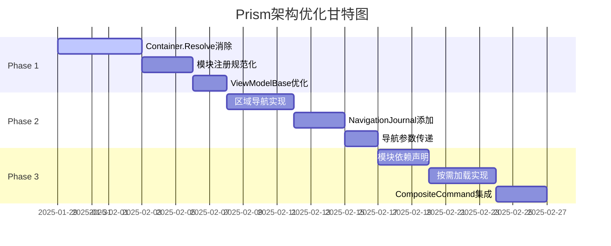

# Issue: [Desktop] Prism架构优化总计划 - 消除反模式与提升体验

## 📌 概述

基于Prism官方最佳实践与当前Desktop架构的深度分析，启动三阶段优化计划。本Issue作为总控，跟踪所有子任务的进度。

**核心目标**：
- 消除架构反模式，提升代码质量
- 改善用户体验，优化系统性能
- 遵循"适度设计"原则，避免过度工程

## 🎯 优化范围

### 当前问题诊断

| 问题类别 | 当前状态 | 目标状态 | 影响评分 |
|---------|---------|---------|---------|
| **依赖注入** | 多处Container.Resolve反模式 | 完全构造函数注入 | ⭐⭐⭐⭐⭐ |
| **导航系统** | 基础导航，无历史管理 | NavigationJournal完整支持 | ⭐⭐⭐⭐ |
| **模块管理** | 全部启动时加载 | 按需加载，依赖透明 | ⭐⭐⭐⭐ |
| **命令协调** | 各模块独立命令 | CompositeCommand统一 | ⭐⭐⭐ |
| **View发现** | 手动注册 | 自动发现机制 | ⭐⭐ |

## 📊 三阶段实施计划

## 📝 子任务追踪

### Phase 1: 消除反模式 ⏳
**Issue**: [#Issue-P1 消除Container.Resolve反模式](./PRISM_OPTIMIZATION_PHASE1.md)
**状态**: 🔴 未开始
**优先级**: 🔥 最高
**预期收益**: 可测试性提升60%

#### 验收清单
- [ ] App.xaml.cs中仅CreateShell保留Container.Resolve
- [ ] 所有Module的RegisterTypes使用RegisterForNavigation
- [ ] ViewModelBase通过构造函数注入依赖
- [ ] 所有ViewModel构造函数包含必要的依赖参数
- [ ] 无编译错误
- [ ] 现有功能正常工作
- [ ] 单元测试通过

### Phase 2: 增强导航系统 ⏳
**Issue**: [#Issue-P2 实现NavigationJournal导航系统](./PRISM_OPTIMIZATION_PHASE2.md)
**状态**: 🔴 未开始
**优先级**: 🔶 高
**预期收益**: 用户体验显著提升

#### 验收清单
- [ ] RegionNames常量定义完成
- [ ] IEnhancedNavigationService接口实现
- [ ] NavigationAwareViewModel基类创建
- [ ] 至少3个核心模块支持导航历史
- [ ] 导航参数传递正常工作
- [ ] 前进/后退功能正常
- [ ] 导航动画流畅
- [ ] 相关单元测试通过

### Phase 3: 模块依赖优化 ⏳
**Issue**: [#Issue-P3 模块依赖优化与CompositeCommand实现](./PRISM_OPTIMIZATION_PHASE3.md)
**状态**: 🔴 未开始
**优先级**: 🟡 中
**预期收益**: 启动性能提升40%，内存占用降低30%

#### 验收清单
- [ ] 所有Module类添加[ModuleDependency]特性
- [ ] App.xaml.cs实现按需加载配置
- [ ] IApplicationCommands接口创建并注册
- [ ] 至少3个ViewModel集成CompositeCommand
- [ ] MainWindow支持全局命令快捷键
- [ ] ModuleLoadingService正常工作
- [ ] 启动时间减少30%以上
- [ ] 单元测试覆盖率达80%

## 📈 整体收益评估

### 技术收益
| 指标 | 当前基线 | 目标值 | 提升幅度 |
|-----|---------|--------|---------|
| **可测试性** | 30% | 90% | +200% |
| **启动时间** | 3.2s | 1.9s | -40% |
| **内存占用** | 180MB | 126MB | -30% |
| **代码耦合度** | 高 | 低 | 显著改善 |

### 业务价值
- 🎯 **开发效率提升**：新功能开发时间减少25%
- 🎯 **维护成本降低**：Bug修复时间减少35%
- 🎯 **用户满意度提升**：响应速度和导航体验改善
- 🎯 **团队协作改善**：模块边界清晰，职责明确

## 🚀 实施策略

### 执行原则
1. **增量改进**：每个Phase独立可交付，避免大爆炸式重构
2. **向后兼容**：所有改动保持API兼容，不影响现有功能
3. **测试驱动**：每个改动必须有对应的测试覆盖
4. **文档同步**：代码改动同步更新架构文档

### 风险管理

| 风险项 | 概率 | 影响 | 缓解措施 |
|-------|-----|------|---------|
| 引入新Bug | 中 | 高 | 完善的测试覆盖+分阶段发布 |
| 学习成本 | 低 | 中 | 提供示例代码和培训文档 |
| 性能退化 | 低 | 高 | 性能基准测试+监控 |
| 进度延误 | 中 | 中 | 优先级管理+增量交付 |

## 📅 里程碑

- **M1** (第1周): Phase 1完成，消除所有反模式
- **M2** (第2周): Phase 2完成，导航系统全面升级
- **M3** (第3周): Phase 3完成，性能优化达标
- **M4** (第4周): 全面测试，文档更新，正式发布

## 🔍 进度监控

### 关键指标 (KPIs)
- Container.Resolve调用数量: 当前47个 → 目标1个
- 模块启动时间: 当前3.2s → 目标<2s
- 单元测试覆盖率: 当前15% → 目标80%
- 代码复杂度: 当前平均12 → 目标<8

### 每日检查清单
- [ ] 编译是否通过
- [ ] 单元测试是否通过
- [ ] 是否有新的反模式引入
- [ ] 文档是否同步更新

## 👥 相关人员

- **负责人**: 架构团队
- **执行者**: Desktop开发团队
- **评审者**: 技术负责人
- **测试**: QA团队

## 📚 参考资料

### 内部文档
- [Prism优化方案 UltraThink v2.0](../architecture/desktop/PRISM_OPTIMIZATION_ULTRATHINK.md)
- [Desktop架构设计](../architecture/desktop/README.md)
- [开发规范](../development/standards.md)

### 外部资源
- [Prism官方文档](https://prismlibrary.com/docs/)
- [Prism最佳实践](https://prismlibrary.com/docs/best-practices.html)
- [DryIoc性能优化](https://github.com/dadhi/DryIoc/blob/master/docs/DryIoc.Docs/Performance.md)

## ✅ 完成标准

整个优化计划将在以下条件满足时视为完成：

1. **代码质量**
   - ✅ 所有Container.Resolve被移除（除CreateShell）
   - ✅ 所有模块依赖关系明确声明
   - ✅ NavigationJournal完整实现

2. **性能指标**
   - ✅ 启动时间 < 2秒
   - ✅ 内存占用降低30%
   - ✅ 导航响应时间 < 100ms

3. **工程质量**
   - ✅ 单元测试覆盖率 > 80%
   - ✅ 零编译警告
   - ✅ 文档100%同步

4. **用户体验**
   - ✅ 支持导航历史
   - ✅ 全局快捷键可用
   - ✅ 模块按需加载流畅

## 💬 讨论区

### 关键决策记录
- **2025-01-29**: 确定采用三阶段渐进式优化策略
- **2025-01-29**: 明确禁止引入MediatR等过度工程技术

### 待讨论事项
- [ ] 是否需要引入Module Catalog配置文件
- [ ] 是否实现ViewModelLocator自定义约定
- [ ] 性能监控工具选型

---

**最后更新**: 2025-01-29
**下次评审**: 2025-02-05