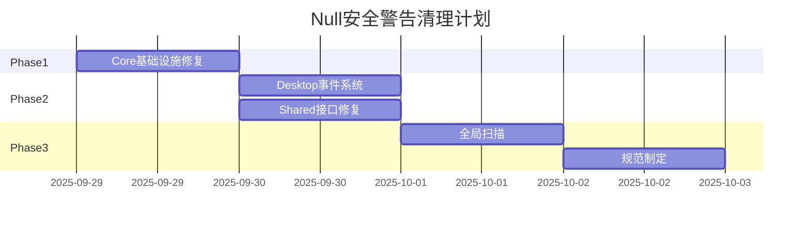

# Null安全与代码质量警告清理 - Issue #790

## 问题概述

在Issue #789解决XML文档警告后，LYBT.All.sln仍存在886个有实际意义的编译警告，主要涉及null引用安全问题。这些警告反映了真实的代码质量问题，需要逐一修复而非简单抑制。

## 📊 当前警告分析

### 警告类型分布

| 警告代码 | 描述 | 数量估计 | 严重程度 |
|---------|------|---------|---------|
| **CS8625** | 无法将null字面量转换为非null引用类型 | ~400 | 🔴 高 |
| **CS8618** | 非null属性在构造函数退出时必须包含非null值 | ~300 | 🔴 高 |
| **CS8604** | 可能传入null引用实参 | ~100 | 🟡 中 |
| **CS8603** | 可能返回null引用 | ~50 | 🟡 中 |
| **CS8619** | 值中引用类型的Null性与目标类型不匹配 | ~30 | 🟡 中 |
| **CS0105** | using指令重复出现 | ~6 | 🟢 低 |

### 影响模块分析

```
警告分布热点：
├── LYBT.Core (60%)
│   ├── Infrastructure/Caching (~200)
│   ├── Infrastructure/Repositories (~150)
│   └── Infrastructure/Web (~50)
├── LYBT.Desktop.Core (25%)
│   ├── Events/EventManager (~100)
│   └── Interfaces/Services (~50)
├── LYBT.Shared.Interfaces (10%)
│   └── Services/IMedicalCaseService (~50)
└── 其他模块 (5%)
```

## 🎯 修复目标

### 核心目标
1. **消除null引用风险**：修复所有CS8625、CS8618警告
2. **提升代码健壮性**：处理CS8604、CS8603可能的null情况
3. **清理代码冗余**：移除CS0105重复using
4. **建立null安全规范**：制定团队null处理标准

### 量化指标
- 警告总数从886个降至<50个（94%改善）
- null相关警告全部解决（0容忍）
- 代码覆盖null检查率>95%

## 🔧 修复方案

### 策略一：CS8625 - null字面量赋值问题

**问题示例**：
```csharp
// 错误
string name = null;  // CS8625

// 修复方案
string? name = null;  // 声明为可null
string name = string.Empty;  // 使用默认值
string name = "default";  // 使用有意义的默认值
```

### 策略二：CS8618 - 构造函数属性初始化

**问题示例**：
```csharp
// 错误
public class CacheStats
{
    public Statistics Statistics { get; set; }  // CS8618
}

// 修复方案1：初始化器
public class CacheStats
{
    public Statistics Statistics { get; set; } = new();
}

// 修复方案2：required修饰符 (C# 11)
public class CacheStats
{
    public required Statistics Statistics { get; set; }
}

// 修复方案3：可null类型
public class CacheStats
{
    public Statistics? Statistics { get; set; }
}
```

### 策略三：CS8604/CS8603 - null传递和返回

**问题示例**：
```csharp
// 错误
public async Task<User> GetUserAsync(string? id)
{
    return await repository.FindAsync(id);  // CS8604: id可能为null
}

// 修复方案
public async Task<User?> GetUserAsync(string? id)
{
    if (string.IsNullOrEmpty(id))
        return null;

    return await repository.FindAsync(id);
}
```

### 策略四：CS0105 - 重复using

**问题示例**：
```csharp
// 错误
using System.Linq.Expressions;
using System.Linq.Expressions;  // CS0105

// 修复：简单删除重复项
using System.Linq.Expressions;
```

## 📋 分模块修复计划

### [NULL-1] LYBT.Core基础设施层修复
- **范围**: `src/Server/Core/LYBT.Core/Infrastructure/`
- **重点文件**:
  - CacheKeyBuilder.cs (6个CS8625)
  - BaseRepository.cs (5个CS8625 + 2个CS8604)
  - ICacheDiagnosticsService.cs (9个CS8618)
  - MemoryCacheAdapter.cs (混合警告)
- **预计工时**: 1天
- **验收标准**: Infrastructure目录0警告

### [NULL-2] Desktop.Core事件系统修复
- **范围**: `src/Client/Desktop/Core/Events/`
- **重点文件**:
  - EventManager.cs (4个CS8625)
  - IUserExperienceService.cs (1个CS8625)
- **预计工时**: 0.5天
- **验收标准**: Events目录0警告

### [NULL-3] Shared.Interfaces服务接口修复
- **范围**: `src/Shared/LYBT.Shared.Interfaces/`
- **重点文件**:
  - IMedicalCaseService.cs (1个CS8625)
- **预计工时**: 0.5天
- **验收标准**: Interfaces项目0警告

### [NULL-4] 全局代码质量扫描
- **范围**: 整个解决方案
- **任务**:
  - 运行代码分析器
  - 修复遗漏警告
  - 建立CI质量门禁
- **预计工时**: 0.5天
- **验收标准**: 总警告<50个

### [NULL-5] Null安全规范制定
- **产出物**: `docs/development/null-safety-guidelines.md`
- **内容**:
  - Nullable引用类型使用规范
  - null检查最佳实践
  - 默认值选择指南
- **预计工时**: 0.5天
- **验收标准**: 文档完成并团队评审通过

## ✅ 验收标准

### 技术指标
- [ ] 编译警告从886个降至<50个
- [ ] CS8625警告全部修复（0个）
- [ ] CS8618警告全部修复（0个）
- [ ] CS8604/CS8603警告妥善处理
- [ ] CS0105重复using全部清理

### 代码质量
- [ ] 所有public API明确null契约
- [ ] 构造函数保证对象完整初始化
- [ ] null检查逻辑清晰一致
- [ ] 单元测试覆盖null场景

### 文档完整性
- [ ] Null安全规范文档完成
- [ ] 代码注释说明null处理逻辑
- [ ] 更新开发规范包含null安全要求

## 🕐 实施时间表

**总预计时间**: 2.5-3天



## 📈 预期收益

### 短期收益
- **代码质量提升**: 消除潜在null引用异常
- **开发体验改善**: 减少警告干扰，专注业务开发
- **类型安全增强**: 明确null契约，减少运行时错误

### 长期收益
- **维护成本降低**: null相关bug大幅减少
- **团队效率提升**: 统一的null处理规范
- **系统稳定性**: 更健壮的错误处理

## 🚨 风险管理

### 潜在风险
1. **API契约变更**: 修改方法签名可能影响调用方
2. **默认值选择**: 不当的默认值可能掩盖逻辑错误
3. **性能影响**: 过多null检查可能影响性能

### 缓解措施
1. **渐进式修复**: 按模块分批处理，降低风险
2. **充分测试**: 每个模块修复后运行完整测试
3. **代码审查**: 关键修改需要团队评审

## 🔗 依赖关系

### 前置任务
- [x] Issue #789 - XML文档警告抑制（已完成）

### 后续任务
- 性能优化（基于稳定的null安全代码）
- 单元测试覆盖率提升
- CI/CD质量门禁配置

## 🏷️ 标签

`null-safety` `code-quality` `warnings` `refactoring` `tech-debt`

## 📊 优先级

**高** - 直接影响系统稳定性和代码质量

## 💡 实施建议

1. **优先修复高频模块**: 从LYBT.Core开始，影响面最大
2. **统一修复模式**: 同类警告采用一致的修复方案
3. **保留业务逻辑**: 修复过程中不改变现有业务逻辑
4. **记录决策理由**: 重要的null处理决策添加注释说明

---

**创建时间**: 2025-09-28
**前置任务**: Issue #789（已完成）
**预计工时**: 2.5-3天
**影响范围**: 全解决方案
**状态**: 📋 Ready for Development