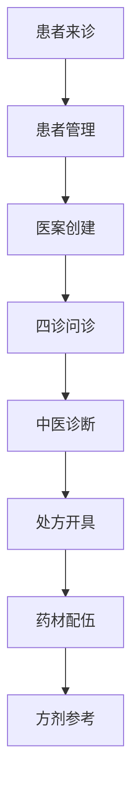
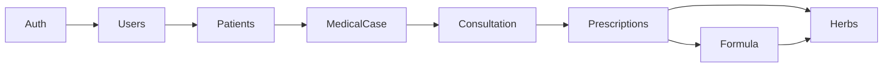

# 📦 业务模块文档

> 核心业务模块详细文档
> 更新时间：2025-09-21

## 🏥 模块概览

LYBTZYZS系统包含8个核心业务模块，涵盖中医诊所完整业务流程：



## 📋 模块清单

### 1. Auth模块 - 认证授权
- **职责**：系统认证、用户授权、Token管理
- **技术**：JWT Bearer Token、RBAC权限模型
- **接口**：IAuthService
- **文档**：[详细文档](auth/README.md)

### 2. Users模块 - 用户管理
- **职责**：用户CRUD、角色管理、档案维护
- **支持角色**：Admin（管理员）、Doctor（医生）
- **接口**：IUserService、IUserQueryService、IUserBusinessService
- **文档**：[详细文档](users/README.md)

### 3. Patients模块 - 患者管理
- **职责**：患者档案、病史管理、就诊记录
- **核心功能**：基本信息、过敏史、家族史、既往史
- **接口**：IPatientService、IPatientQueryService、IPatientBusinessService
- **文档**：[详细文档](patients/README.md)

### 4. MedicalCase模块 - 病历管理
- **职责**：病历容器、诊疗流程管理
- **关系**：1:1关联Consultation（问诊记录）
- **接口**：IMedicalCaseService
- **文档**：[详细文档](medical-case/README.md)

### 5. Consultation模块 - 问诊管理
- **职责**：四诊信息采集、中医诊断、辨证论治
- **四诊**：望诊、闻诊、问诊、切诊
- **接口**：IConsultationService
- **文档**：[详细文档](consultation/README.md)

### 6. Prescriptions模块 - 处方管理
- **职责**：处方开具、配伍检查、剂量计算
- **特性**：智能配伍提醒、剂量自动换算
- **接口**：IPrescriptionService
- **文档**：[详细文档](prescriptions/README.md)

### 7. Herbs模块 - 药材管理
- **职责**：药材信息维护、性味归经、功效主治
- **注意**：纯处方用药，无库存管理
- **接口**：IHerbService
- **文档**：[详细文档](herbs/README.md)

### 8. Formula模块 - 方剂管理
- **职责**：经典方剂、个人经验方、方剂加减
- **特性**：方剂模板、智能推荐
- **接口**：IFormulaService
- **文档**：[详细文档](formula/README.md)

## 🏗️ 模块架构

### 前端架构 - UltraThink双层模式

```csharp
// Module层 - 纯委托
public class UserModule : IUserService
{
    private readonly IUserQueryService _queryService;
    private readonly IUserBusinessService _businessService;

    // 委托给对应服务
}

// QueryService层 - 查询逻辑
public class UserQueryService : IUserQueryService
{
    // 复杂查询、统计分析、报表生成
}

// BusinessService层 - 业务逻辑
public class UserBusinessService : IUserBusinessService
{
    // CRUD操作、业务流程、数据验证
}
```

### 后端架构 - 传统三层

```
Controller → Service → Repository → Database
    ↓           ↓          ↓           ↓
 API端点    业务逻辑    数据访问    SQL Server
```

## 📊 模块间依赖

### 依赖关系图



### Shared层依赖

所有模块都依赖Shared层的三个项目：

| Shared项目 | 提供内容 | 模块使用 |
|-----------|---------|----------|
| **LYBT.Shared.Models** | DTO定义、枚举、结果模型 | 所有模块 |
| **LYBT.Shared.Interfaces** | 服务接口定义 | 所有模块 |
| **LYBT.Shared.Utilities** | 工具类、扩展方法 | 部分模块 |

详细规范请查看：
- [Shared类型清单](../prds-summary/shared-inventory/shared-types.md)
- [Shared依赖关系](../prds-summary/shared-inventory/shared-deps.md)
- [架构门禁规范](../prds-summary/shared-inventory/shared-arch-gates.md)

## 🔧 开发规范

### 命名约定

| 类型 | 规范 | 示例 |
|------|------|------|
| 模块名 | Pascal命名，单数形式 | UserModule |
| 服务接口 | I前缀 + Service后缀 | IUserService |
| DTO类 | Dto后缀 | UserDto |
| 查询DTO | SearchDto后缀 | UserSearchDto |
| 创建DTO | CreateDto后缀 | UserCreateDto |
| 更新DTO | UpdateDto后缀 | UserUpdateDto |

### 目录结构

```
Module/
├── Interfaces/       # 接口定义
├── Services/         # 服务实现
│   ├── QueryService.cs
│   └── BusinessService.cs
├── Repositories/     # 数据访问（后端）
├── ViewModels/       # 视图模型（前端）
└── Module.cs        # 模块主类
```

## 📈 模块统计

| 指标 | 数值 |
|------|------|
| 业务模块数 | 8 |
| 服务接口数 | 17 |
| DTO类型数 | 200+ |
| 工具方法数 | 72 |
| 代码行数 | 50,000+ |
| 测试覆盖率 | 60%（目标） |

## 🚀 快速开始

1. 查看[环境配置](../development/setup.md)
2. 阅读[编码规范](../development/coding-standards.md)
3. 选择具体模块文档深入了解
4. 参考[API文档](../api/)进行开发

## 📝 维护说明

- 模块文档应与代码保持同步
- 新增功能需更新对应文档
- 重大变更需记录在更新日志
- 保持示例代码的可运行性

---

*此文档是LYBTZYZS业务模块的导航入口，详细内容请查看各模块子文档*
