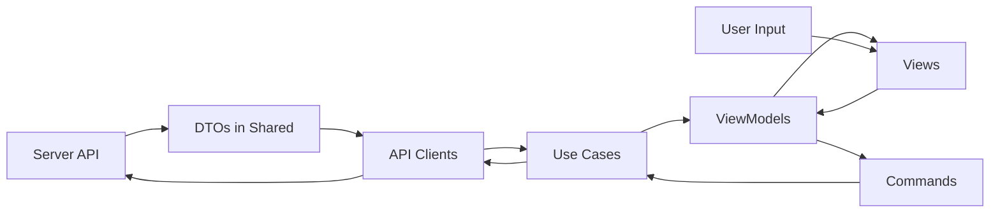
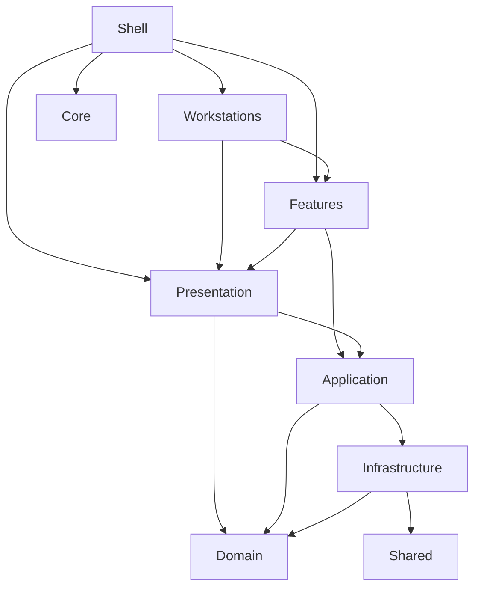

# Desktop项目架构优化方案

## 1. 执行摘要

本方案基于深度代码分析，将Desktop项目从简单的文件夹重组升级为完整的架构优化，充分利用现有的三层架构（Client/Server/Shared），实现Clean Architecture原则。

## 2. 现状分析

### 2.1 整体架构现状
```
src/
├── Client/          # 客户端层
│   └── Desktop/    # WPF桌面应用
├── Server/         # 服务端层（架构良好）
│   ├── Core/      # 核心基础设施
│   ├── Modules/   # 业务模块
│   └── Services/  # Web API服务
└── Shared/         # 共享层（前后端契约）
    ├── LYBT.Shared.Models/     # 包含DTOs
    │   └── Contracts/          # 按领域组织的契约
    │       ├── Auth/
    │       ├── Consultation/
    │       ├── Formula/
    │       ├── Herbs/
    │       ├── MedicalCase/
    │       ├── Patients/
    │       ├── Prescriptions/
    │       └── Users/
    ├── LYBT.Shared.Interfaces/ # 共享接口
    └── LYBT.Shared.Utilities/  # 共享工具
```

### 2.2 Desktop层架构问题诊断

#### 架构级问题
1. **违反单一职责原则**：Core文件夹包含27个子文件夹，职责混杂
2. **缺少领域边界**：模块划分不清，业务逻辑散落各处
3. **重复定义问题**：未充分利用Shared层的DTOs，可能存在重复模型
4. **数据流不清晰**：缺少明确的Server API → DTO → ViewModel → View流程
5. **依赖管理混乱**：缺少清晰的依赖倒置和接口隔离

#### 技术债务
1. **MVVM实现不完整**：ViewModels职责过重，包含业务逻辑
2. **缺少状态管理**：无统一的应用状态管理机制
3. **API调用混乱**：HTTP客户端分散，缺少统一封装
4. **性能问题**：无缓存策略，所有数据实时请求
5. **测试困难**：强耦合导致单元测试困难

## 3. 新架构设计

### 3.1 架构原则

采用**Clean Architecture + DDD（领域驱动设计）**原则：
- **依赖倒置**：高层模块不依赖低层模块，都依赖抽象
- **领域驱动**：按业务领域组织代码，与Shared.Models.Contracts对齐
- **关注点分离**：明确分离UI、业务逻辑、数据访问
- **可测试性**：所有业务逻辑可独立测试

### 3.2 架构层次设计

```
src/Client/Desktop/
├── Core/                                    # 核心层（Clean Architecture核心）
│   ├── LYBT.Desktop.Domain/               # 领域层
│   │   ├── Interfaces/                    # 领域接口
│   │   ├── Events/                        # 领域事件
│   │   ├── Services/                      # 领域服务接口
│   │   └── Specifications/                # 业务规则
│   │
│   ├── LYBT.Desktop.Application/          # 应用层
│   │   ├── UseCases/                      # 用例（业务流程）
│   │   ├── Commands/                      # 命令（CQRS）
│   │   ├── Queries/                       # 查询（CQRS）
│   │   ├── Mappers/                       # DTO到领域模型映射
│   │   └── Validators/                    # 业务验证
│   │
│   └── LYBT.Desktop.Infrastructure/       # 基础设施层
│       ├── ApiClients/                    # API客户端实现
│       │   ├── BaseApiClient.cs          # 基础HTTP客户端
│       │   ├── AuthApiClient.cs          # 认证API
│       │   ├── PatientApiClient.cs       # 患者API
│       │   └── ...                       # 其他领域API
│       ├── Caching/                       # 缓存实现
│       │   ├── MemoryCache/              # 内存缓存
│       │   └── SqliteCache/              # 本地持久化缓存
│       ├── Logging/                       # 日志实现
│       ├── Security/                      # 安全实现
│       └── Configuration/                 # 配置管理
│
├── Presentation/                           # 表现层
│   ├── LYBT.Desktop.ViewModels/          # 视图模型
│   │   ├── Base/                         # 基类
│   │   │   ├── ReactiveViewModel.cs      # 响应式基类
│   │   │   └── ValidatableViewModel.cs   # 可验证基类
│   │   └── Features/                     # 按功能组织的ViewModels
│   │
│   ├── LYBT.Desktop.Views/               # 视图层
│   │   ├── Themes/                       # 主题资源
│   │   │   ├── Design/                   # 设计时资源
│   │   │   ├── Dark/                     # 深色主题
│   │   │   └── Light/                    # 浅色主题
│   │   ├── Controls/                     # 自定义控件
│   │   ├── Converters/                   # 值转换器
│   │   └── Resources/                    # 资源文件
│   │
│   └── LYBT.Desktop.Services/            # UI服务
│       ├── Navigation/                   # 导航服务
│       ├── Dialogs/                      # 对话框服务
│       ├── Notifications/                # 通知服务
│       └── StateManagement/              # 状态管理
│
├── Features/                               # 功能模块（垂直切片）
│   ├── LYBT.Desktop.Features.Auth/       # 认证模块
│   │   ├── Views/                        # 认证相关视图
│   │   ├── ViewModels/                   # 认证视图模型
│   │   ├── Services/                     # 认证服务实现
│   │   ├── Models/                       # 认证本地模型
│   │   └── AuthModule.cs                 # 模块注册
│   │
│   ├── LYBT.Desktop.Features.Patients/   # 患者管理
│   │   ├── Views/
│   │   ├── ViewModels/
│   │   ├── Services/
│   │   └── PatientsModule.cs
│   │
│   ├── LYBT.Desktop.Features.Prescriptions/ # 处方管理
│   ├── LYBT.Desktop.Features.Herbs/        # 药材管理
│   ├── LYBT.Desktop.Features.Formula/      # 方剂管理
│   ├── LYBT.Desktop.Features.Consultation/ # 会诊管理
│   └── LYBT.Desktop.Features.MedicalCase/  # 病例管理
│
├── Workstations/                           # 工作台层（聚合器）
│   ├── LYBT.Desktop.ClinicalWorkstation/ # 诊疗工作台
│   │   ├── Views/                        # 工作台主视图
│   │   ├── ViewModels/                   # 工作台视图模型
│   │   ├── Navigation/                   # 工作台导航
│   │   ├── Services/                     # 工作台服务
│   │   └── ClinicalWorkstationModule.cs
│   │
│   ├── LYBT.Desktop.AdminWorkstation/    # 管理工作台
│   │   └── ...（同上结构）
│   │
│   └── README.md                         # 工作台扩展指南
│
└── Shell/                                  # 启动层
    └── LYBT.Desktop.Shell/                # 主程序
        ├── App.xaml
        ├── App.xaml.cs
        ├── Bootstrapper.cs                # 依赖注入配置
        ├── ModuleLoader.cs                # 模块加载器
        └── Configuration/
            ├── appsettings.json
            └── Dependencies.cs            # 依赖注入注册
```

### 3.3 数据流架构



### 3.4 依赖关系



## 4. 技术栈升级

### 4.1 MVVM框架
- **当前**：Prism + 手动INotifyPropertyChanged
- **升级到**：Prism + ReactiveUI
- **优势**：
  - 自动属性通知
  - 响应式编程支持
  - 更好的测试性

### 4.2 依赖注入
- **当前**：Prism.DryIoc
- **考虑升级**：Microsoft.Extensions.DependencyInjection
- **优势**：
  - 与ASP.NET Core统一
  - 更好的生态支持
  - 标准化配置

### 4.3 API客户端
- **当前**：手动HttpClient
- **升级到**：Refit + Polly
- **优势**：
  - 声明式API定义
  - 自动重试和熔断
  - 类型安全

### 4.4 状态管理
- **新增**：Redux.NET或Akavache
- **用途**：
  - 全局状态管理
  - 离线数据缓存
  - 状态持久化

### 4.5 验证框架
- **新增**：FluentValidation
- **用途**：
  - ViewModel验证
  - 业务规则验证
  - 错误消息管理

## 5. 架构优化要点

### 5.1 充分利用Shared层
```csharp
// 不要重复定义DTO
// ❌ 错误做法
namespace LYBT.Desktop.Models
{
    public class PatientDto { ... }  // 重复定义
}

// ✅ 正确做法
using LYBT.Shared.Models.Contracts.Patients;  // 使用Shared层的DTO

namespace LYBT.Desktop.ViewModels
{
    public class PatientViewModel : ReactiveViewModel
    {
        private PatientDto _patient;  // 使用Shared的DTO

        // 添加UI相关的属性
        public bool IsSelected { get; set; }
        public ReactiveCommand SaveCommand { get; }
    }
}
```

### 5.2 API客户端封装
```csharp
// Infrastructure/ApiClients/BaseApiClient.cs
public abstract class BaseApiClient
{
    protected readonly HttpClient _httpClient;
    protected readonly ITokenService _tokenService;
    protected readonly ILogger _logger;

    protected async Task<T> ExecuteAsync<T>(Func<Task<T>> operation)
    {
        try
        {
            await EnsureAuthenticated();
            return await operation();
        }
        catch (HttpRequestException ex)
        {
            _logger.LogError(ex, "API request failed");
            throw new ApiException("网络请求失败", ex);
        }
    }
}

// Infrastructure/ApiClients/PatientApiClient.cs
public class PatientApiClient : BaseApiClient, IPatientService
{
    public async Task<PatientDto> GetPatientAsync(Guid id)
    {
        return await ExecuteAsync(async () =>
        {
            var response = await _httpClient.GetAsync($"api/patients/{id}");
            response.EnsureSuccessStatusCode();
            return await response.Content.ReadFromJsonAsync<PatientDto>();
        });
    }
}
```

### 5.3 用例模式
```csharp
// Application/UseCases/Patients/GetPatientUseCase.cs
public class GetPatientUseCase : IUseCase<Guid, PatientViewModel>
{
    private readonly IPatientService _patientService;
    private readonly IMapper _mapper;
    private readonly ICacheService _cache;

    public async Task<PatientViewModel> ExecuteAsync(Guid patientId)
    {
        // 1. 检查缓存
        var cached = await _cache.GetAsync<PatientDto>($"patient_{patientId}");
        if (cached != null)
            return _mapper.Map<PatientViewModel>(cached);

        // 2. 调用API
        var patient = await _patientService.GetPatientAsync(patientId);

        // 3. 缓存结果
        await _cache.SetAsync($"patient_{patientId}", patient);

        // 4. 映射到ViewModel
        return _mapper.Map<PatientViewModel>(patient);
    }
}
```

### 5.4 响应式ViewModel
```csharp
// ViewModels/Base/ReactiveViewModel.cs
public abstract class ReactiveViewModel : ReactiveObject, INavigationAware
{
    protected readonly IEventAggregator _eventAggregator;
    protected readonly ILogger _logger;

    private bool _isBusy;
    public bool IsBusy
    {
        get => _isBusy;
        set => this.RaiseAndSetIfChanged(ref _isBusy, value);
    }

    protected ReactiveViewModel()
    {
        // 自动设置验证
        this.ValidationRule(
            vm => vm,
            vm => IsValid(),
            "验证失败");
    }
}

// Features/Patients/ViewModels/PatientEditViewModel.cs
public class PatientEditViewModel : ReactiveViewModel
{
    private readonly IGetPatientUseCase _getPatientUseCase;
    private readonly ISavePatientUseCase _savePatientUseCase;

    private PatientDto _patient;
    public PatientDto Patient
    {
        get => _patient;
        set => this.RaiseAndSetIfChanged(ref _patient, value);
    }

    public ReactiveCommand<Unit, Unit> SaveCommand { get; }

    public PatientEditViewModel()
    {
        SaveCommand = ReactiveCommand.CreateFromTask(
            SavePatientAsync,
            this.WhenAnyValue(x => x.Patient)
                .Select(p => p != null && IsValid()));
    }

    private async Task SavePatientAsync()
    {
        IsBusy = true;
        try
        {
            await _savePatientUseCase.ExecuteAsync(Patient);
            _eventAggregator.Publish(new PatientSavedEvent(Patient));
        }
        finally
        {
            IsBusy = false;
        }
    }
}
```

## 6. 实施路径

### Phase 1：基础架构重构（2周）
- [ ] 创建新的项目结构
- [ ] 迁移Core层到新架构
- [ ] 建立基础设施层
- [ ] 配置依赖注入

### Phase 2：API客户端统一（1周）
- [ ] 实现BaseApiClient
- [ ] 为每个领域创建API客户端
- [ ] 集成Polly重试策略
- [ ] 添加Token自动刷新

### Phase 3：领域模块重组（3周）
- [ ] 按领域创建Features模块
- [ ] 迁移现有功能到新模块
- [ ] 实现用例模式
- [ ] 添加模块自动注册

### Phase 4：MVVM升级（2周）
- [ ] 集成ReactiveUI
- [ ] 重构ViewModels
- [ ] 实现响应式绑定
- [ ] 添加FluentValidation

### Phase 5：状态管理和缓存（1周）
- [ ] 实现全局状态管理
- [ ] 添加内存缓存
- [ ] 实现本地数据缓存
- [ ] 配置缓存策略

### Phase 6：性能优化（1周）
- [ ] 实现懒加载
- [ ] 优化启动性能
- [ ] 添加性能监控
- [ ] 内存泄漏检测

### Phase 7：测试和文档（2周）
- [ ] 编写单元测试
- [ ] 集成测试
- [ ] 更新文档
- [ ] 团队培训

## 7. 预期收益

### 7.1 架构收益
- **清晰的架构边界**：每层职责明确，易于理解和维护
- **高内聚低耦合**：模块独立，减少相互影响
- **可测试性提升**：业务逻辑可完全单元测试
- **代码复用**：充分利用Shared层，避免重复

### 7.2 开发效率
- **并行开发**：团队可按领域并行开发
- **快速定位**：问题可快速定位到具体层次
- **易于扩展**：新功能可按模式快速添加
- **减少Bug**：清晰的数据流减少状态错误

### 7.3 性能提升
- **启动性能**：模块懒加载，减少启动时间
- **运行性能**：缓存策略减少API调用
- **内存优化**：弱引用和资源管理
- **响应速度**：异步操作避免UI阻塞

### 7.4 维护性
- **技术债务减少**：架构清晰，减少技术债
- **知识传递**：新成员容易理解架构
- **持续演进**：架构支持渐进式改进
- **风险降低**：模块隔离降低修改风险

## 8. 风险管理

### 8.1 技术风险
| 风险 | 影响 | 缓解措施 |
|-----|------|---------|
| 重构范围过大 | 高 | 分阶段实施，每阶段验证 |
| 团队学习曲线 | 中 | 提供培训和文档 |
| 性能退化 | 中 | 建立性能基线，持续监控 |
| 兼容性问题 | 低 | 保持向后兼容接口 |

### 8.2 项目风险
| 风险 | 影响 | 缓解措施 |
|-----|------|---------|
| 时间延期 | 高 | 设置清晰的里程碑 |
| 资源不足 | 中 | 优先核心功能 |
| 需求变更 | 中 | 架构支持灵活扩展 |

## 9. 成功标准

### 9.1 技术指标
- 单元测试覆盖率 > 80%
- API响应时间 < 200ms（缓存命中）
- 启动时间 < 3秒
- 内存占用 < 500MB

### 9.2 质量指标
- 代码复杂度降低50%
- Bug率降低40%
- 代码重复率 < 5%
- 架构符合度 > 90%

### 9.3 团队指标
- 新功能开发时间减少30%
- Bug修复时间减少50%
- 代码审查通过率提高
- 团队满意度提升

## 10. 总结

本架构优化方案将Desktop项目从传统的分层架构升级为现代的Clean Architecture，充分利用三层架构的优势，实现真正的领域驱动设计。通过渐进式的实施路径，可以在保证系统稳定的前提下，逐步完成架构升级，最终实现一个高性能、可维护、可扩展的企业级桌面应用架构。

关键成功因素：
1. **充分利用Shared层**：避免重复定义，保持前后端一致
2. **领域驱动设计**：按业务领域组织代码
3. **Clean Architecture**：清晰的依赖关系和职责分离
4. **现代技术栈**：ReactiveUI、依赖注入、响应式编程
5. **渐进式实施**：分阶段实施，持续验证和改进

---

*文档版本：1.0*
*创建日期：2024-12-29*
*作者：架构团队*