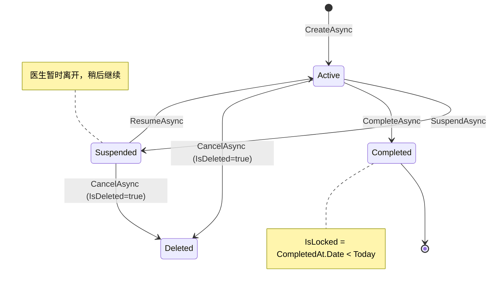

# 全系统设计深化 Phase 3: 数据流/状态流精确化

**版本**: v1.0 | **日期**: 2026-02-22 | **前置**: Phase 1 业务流程深化 + Phase 2 模块功能细化

---

## 3.1 Entity -> DTO 映射 [complete]

> 已在前序会话完成，记录于 Serena 记忆 `design-deepening-phase2-decisions-2026-02-22`

- ListDto vs DetailDto 字段分配已确认
- 计算属性归属: IsLocked/HasPrescription/CanEdit -> Server 端; Amount/Price -> Shared 层 PrescriptionCalculator
- 写回 InputDto 排除字段: CaseStatus/CaseNumber/IsPrinted/CompletedAt/快照名称

---

## 3.2 状态机转换条件与副作用精确化 [complete]

### 3.2.1 状态枚举与转换矩阵

**状态定义** (3 个稳定状态 + 软删除终态):



**转换矩阵** (严格模式):

| From \ To | Active | Suspended | Completed | Deleted |
|-----------|--------|-----------|-----------|---------|
| **[初始]** | CreateAsync | -- | -- | -- |
| **Active** | -- | SuspendAsync | CompleteAsync | CancelAsync |
| **Suspended** | ResumeAsync | -- | **禁止** | CancelAsync |
| **Completed** | -- | -- | -- | -- |

关键规则:
- **Suspended -> Completed 禁止**: 必须先 Resume 到 Active 再 Complete
- **Completed 是终态**: 无任何出向转换 (Admin 编辑不改变状态，仅改内容)
- **取消 = 软删除**: IsDeleted=true，CaseStatus 保持原值不变

**枚举重命名** (MC-D20 落地):

```csharp
public enum MedicalCaseStatus
{
    [Description("已挂起")]
    Suspended = 0,    // 原 Draft，重命名

    [Description("进行中")]
    Active = 1,

    [Description("已完成")]
    Completed = 2
}
```

DB 数据无需迁移 (值不变)，代码中 `Draft` 全部替换为 `Suspended`。

### 3.2.2 Guards (前置条件)

**CreateAsync (-> Active)**:

| # | Guard | 失败响应 | 说明 |
|---|-------|----------|------|
| G1 | 患者存在且未删除 | NotFoundException | PatientId 有效 |
| G2 | 同一患者无活跃医案 | BusinessException (BR-001) | Active/Suspended 状态的均计入 |
| G3 | 操作者为 Doctor 角色 | 403 Forbidden | Controller 级 [Authorize] |

**SuspendAsync (Active -> Suspended)**:

| # | Guard | 失败响应 | 说明 |
|---|-------|----------|------|
| G1 | 医案存在且未软删除 | NotFoundException | -- |
| G2 | 当前状态 = Active | InvalidOperationException | 仅 Active 可挂起 |
| G3 | 操作者有编辑权限 | ForbiddenException | Doctor 仅限自己的医案 |

**ResumeAsync (Suspended -> Active)**:

| # | Guard | 失败响应 | 说明 |
|---|-------|----------|------|
| G1 | 医案存在且未软删除 | NotFoundException | -- |
| G2 | 当前状态 = Suspended | InvalidOperationException | 仅 Suspended 可恢复 |
| G3 | 同一患者无其他活跃医案 | BusinessException (BR-001) | 恢复时也需检查，防止并发冲突 |
| G4 | 操作者有编辑权限 | ForbiddenException | -- |

**CompleteAsync (Active -> Completed)**:

| # | Guard | 失败响应 | 说明 |
|---|-------|----------|------|
| G1 | 医案存在且未软删除 | NotFoundException | -- |
| G2 | **当前状态 = Active** | InvalidOperationException | 严格模式，Suspended 禁止直接完成 |
| G3 | NeedsPrescription 已标记 | InvalidOperationException | 必须明确是否需要处方 |
| G4 | 如需处方，处方存在且未删除 | InvalidOperationException | BR-003 |
| G5 | 操作者有编辑权限 | ForbiddenException | -- |
| G6 | skipWorkflowValidation=true 时跳过 G3/G4 | -- | Admin 强制完成场景 |

**CancelAsync (Active/Suspended -> Deleted)**:

| # | Guard | 失败响应 | 说明 |
|---|-------|----------|------|
| G1 | 医案存在且未软删除 | NotFoundException | 不重复删除 |
| G2 | 当前状态 != Completed | InvalidOperationException | 已完成医案不可取消 |
| G3 | 操作者有编辑权限 | ForbiddenException | -- |

**与现有代码的差异** (需修改):

| 差异 | 当前代码 | 目标设计 |
|------|----------|----------|
| CompleteAsync 源状态校验 | 无校验 | 新增 G2: 仅 Active 可完成 |
| ResumeAsync BR-001 检查 | 无 | 新增 G3: 恢复时检查活跃医案冲突 |
| 异常类型 | InvalidOperationException | 迁移到 BusinessException (S3 落地后) |

### 3.2.3 Side Effects (副作用)

**CreateAsync (-> Active)**:

```
1. 生成 CaseNumber (MC + YYYYMMDD + 序号)
2. 创建 Consultation 内部实体 (1:1)
3. CaseStatus = Active
4. CreatedAt / CreatedBy = 当前时间/用户
5. 审计日志: AuditOperationType.Create
```

**SuspendAsync (Active -> Suspended)**:

```
1. CaseStatus = Suspended
2. 自动保存当前诊断数据 (Consultation 字段)
3. UpdatedAt = 当前时间
4. 审计日志: AuditOperationType.StatusChange
   - ChangedFields: { "CaseStatus": { "Before": "Active", "After": "Suspended" } }
```

**ResumeAsync (Suspended -> Active)**:

```
1. CaseStatus = Active
2. UpdatedAt = 当前时间
3. 审计日志: AuditOperationType.StatusChange
   - ChangedFields: { "CaseStatus": { "Before": "Suspended", "After": "Active" } }
```

**CompleteAsync (Active -> Completed)**:

```
1. CaseStatus = Completed
2. CompletedAt = 当前时间           <- 关键: 锁定计时起点
3. UpdatedAt = 当前时间
4. 审计日志: AuditOperationType.StatusChange
   - ChangedFields: { "CaseStatus": ..., "CompletedAt": ... }
5. 隔天自动生效: IsLocked = true   <- 计算属性，非写入
```

**CancelAsync (Active/Suspended -> Deleted)**:

```
1. 自动保存当前诊断数据 (Consultation 字段)
2. IsDeleted = true                 <- CaseStatus 保持原值不变
3. UpdatedAt = 当前时间
4. 审计日志: AuditOperationType.SoftDelete
```

**副作用执行顺序** (所有操作通用):

```
Guards 校验 -> 充血模型方法 -> Repository.UpdateAsync -> 审计日志写入
                  |
                  └── 单次 SaveChanges，同一事务
```

**充血模型方法映射**:

| 操作 | 调用的域方法 | 变更说明 |
|------|-------------|----------|
| SuspendAsync | `Suspend()` | 原 `SaveAsDraft()` 重命名 |
| ResumeAsync | `Resume()` | 新增域方法 |
| CompleteAsync | `Complete()` | 已有，无变更 |
| CancelAsync | `SoftDelete()` | 已有，新增取消前自动保存 |

### 3.2.4 Desktop/Server 双端一致性

**规则共享层级**:

```
Shared 层 (双端共享)
├── MedicalCaseBusinessRules.IsValidStatusTransition()   <- 转换矩阵
├── MedicalCaseStatus 枚举                               <- 状态定义
└── BR-001 / BR-003 校验规则                              <- 业务规则

Server 端 (独有)
├── MedicalCaseStateService                              <- Guards + 副作用编排
├── MedicalCasePermissionService                         <- 权限校验
└── MedicalCaseAuditService                              <- 审计日志

Desktop 端 - 远程模式
└── 所有状态操作通过 HTTP API 调用 Server

Desktop 端 - 本地模式
├── 过渡态: LocalDataSource 中独立状态逻辑
└── 目标态: 复用 Server 端 StateService (SYNC-D02 后)
```

**ViewModel 层状态感知** (双模式通用):

| 属性 | 计算逻辑 | 用途 |
|------|----------|------|
| IsActive | Status == Active | 可编辑判断 |
| IsSuspended | Status == Suspended | 挂起状态 UI |
| IsCompleted | Status == Completed | 只读展示 |
| IsLocked | IsCompleted && CompletedAt.Date < Today | 锁定图标 |
| CanSuspend | IsActive | 挂起按钮可用 |
| CanResume | IsSuspended | 恢复按钮可用 |
| CanComplete | IsActive | 完成按钮可用 (严格模式) |
| CanCancel | IsActive \|\| IsSuspended | 取消按钮可用 |
| CanEdit | (IsActive \|\| IsSuspended) \|\| (IsCompleted && !IsLocked && IsAdmin) | 编辑权限 |

---

## 3.3 事务边界与缓存失效 [complete]

### 3.3.1 事务边界划分

**原则**: 小诊所系统，并发低，采用最简事务策略 -- 除聚合根操作外不引入显式事务。

**三层事务模型**:

| 层级 | 策略 | 适用场景 |
|------|------|----------|
| **L1: 单 Repository 操作** | 隐式事务 (SaveChangesAsync 内置) | CRUD 单实体: Herb / Patient / User / Formula |
| **L2: 聚合根操作** | 聚合内导航属性 + 单次 SaveChanges | MedicalCase + Consultation + Prescription + Items |
| **L3: 跨聚合操作** | 显式事务 (BeginTransactionAsync) | Sync 上传、批量导入 |

**L1 -- 单 Repository (当前已满足，无变更)**:

单实体 CRUD 无需额外事务保护，EF Core SaveChangesAsync 内置隐式事务。

**L2 -- MedicalCase 聚合根 (当前已满足，无变更)**:

EF Core ChangeTracker 追踪全部关联实体 (MedicalCase + Consultation + Prescription + Items)，一次 SaveChanges 保证原子性。

**L3 -- 跨聚合操作 (需新增显式事务)**:

```csharp
// SyncService.UploadAsync -- 目标设计
await using var transaction = await _dbContext.Database.BeginTransactionAsync();
try
{
    foreach (var entity in input.Entities)
    {
        await UploadEntityAsync(entity);     // 不在内部 SaveChanges
    }
    await _dbContext.SaveChangesAsync();       // 统一保存
    await transaction.CommitAsync();
}
catch
{
    await transaction.RollbackAsync();
    throw;
}
```

需要显式事务的场景:
- Sync 批量上传 (多实体原子性)
- Herb/Patient/Formula 批量导入 (HERB-D02: 分批 100 条)
- MedicalCase 同步上传 (聚合 + 依赖重映射)

### 3.3.2 缓存策略

**双端缓存架构**:

```
Server 端                              Desktop 端
┌─────────────────────┐                ┌──────────────────────┐
│ OutputCache (HTTP层) │                │ IHerbCacheService    │
│ - 列表查询缓存       │                │ - 全量预加载 (HERB-D01)│
│ - 固定过期时间        │                │ - Dict + 拼音索引     │
├─────────────────────┤                ├──────────────────────┤
│ IMemoryCache (业务层)│                │ PatientSearchCache   │
│ - 单实体高频读取缓存  │                │ - LRU 10条/5分钟     │
│ - GetOrSetAsync 可用 │                │ - 用户隔离            │
└─────────────────────┘                └──────────────────────┘
```

**Server 端 OutputCache -- 保留现有 + 补缓存失效**:

| 资源 | 过期时间 | Tag | CUD 后失效方式 |
|------|----------|-----|----------------|
| Herbs 列表 | 30 分钟 | `herbs` | `IOutputCacheStore.EvictByTagAsync("herbs")` |
| Formulas 列表 | 2 小时 | `formulas` | `IOutputCacheStore.EvictByTagAsync("formulas")` |
| Patients 列表 | 30 分钟 | `patients` | `IOutputCacheStore.EvictByTagAsync("patients")` |
| MedicalCase 列表 | 20 分钟 | `medicalcases` | `IOutputCacheStore.EvictByTagAsync("medicalcases")` |

当前问题: CUD 操作后不清缓存。修复: 在 Controller 写操作方法末尾调用 EvictByTag。

**Server 端 IMemoryCache -- 启用用于高频查询**:

| 用途 | Key 模式 | 过期策略 | 失效时机 |
|------|----------|----------|----------|
| 单实体 GetById | `{entity}:{id}` | 滑动 5 分钟 | Update/Delete 时移除 |
| 用户权限 | `user-perms:{userId}` | 滑动 10 分钟 | 角色变更时移除 |
| 当前用户信息 | `user-info:{userId}` | 滑动 10 分钟 | 登出/信息变更时移除 |

不缓存列表查询 (OutputCache 已覆盖)，仅缓存单实体高频读取。

**Desktop 端 IHerbCacheService (HERB-D01 待实现)**:

```
启动/登录时 -> 全量加载 Herbs -> 三套索引:
  - Dict<Guid, HerbItem>           按 ID 精确查找
  - Dict<string, List<HerbItem>>   按拼音首字母索引
  - Dict<string, List<HerbItem>>   按分类索引
```

失效时机: 药材 CUD 后重新加载 / 同步完成后重新加载 / 用户切换时清空。

**Desktop 端 PatientSearchCache -- 保留现有，无变更**。

### 3.3.3 缓存失效矩阵

**Server 端失效矩阵**:

| 触发操作 | OutputCache 失效 | IMemoryCache 失效 |
|----------|-----------------|-------------------|
| Herb Create/Update/Delete | `herbs` tag | `herb:{id}` |
| Herb BatchToggle/Import | `herbs` tag | 清空 `herb:*` |
| Patient Create/Update/Delete | `patients` tag | `patient:{id}` |
| Patient Import | `patients` tag | 清空 `patient:*` |
| Formula Create/Update/Delete | `formulas` tag | `formula:{id}` |
| Formula Clone/Import | `formulas` tag | 清空 `formula:*` |
| MedicalCase 任何写操作 | `medicalcases` tag | `medicalcase:{id}` |
| User Update/ToggleStatus | -- | `user-info:{id}` + `user-perms:{id}` |
| Sync Upload | 按实体类型清对应 tag | 清空对应 `{entity}:*` |

**Desktop 端失效矩阵**:

| 触发操作 | IHerbCacheService | PatientSearchCache |
|----------|-------------------|-------------------|
| Herb CUD (API 返回后) | 重新加载全量 | -- |
| Patient CUD | -- | `Invalidate()` 清空 |
| Sync 完成 | 重新加载全量 | `Invalidate()` 清空 |
| 用户切换/登出 | 清空 | `Invalidate()` 清空 |
| 模式切换 (SYNC-D03) | 重新加载全量 | `Invalidate()` 清空 |

**不失效场景 (仅靠自然过期)**: 其他用户的修改、Admin 编辑已完成医案 -- 小诊所延迟可接受。

---

## Phase 4: 架构问题修复设计 [complete]

8 个维度按薄弱程度排序，每个维度给出具体修复方案和 Sprint 映射。

### 4.1 D4 错误处理架构修复 (4.5 -> 7.5+)

三步渐进激活，不破坏现有行为:

**Step 1: 错误码注册 (S3-X1, 8项)**

模块前缀分配:

| 模块 | 前缀 | 范围 |
|------|------|------|
| Herb | 101xx | 10100-10199 |
| Patient | 102xx | 10200-10299 |
| Formula | 103xx | 10300-10399 |
| MedicalCase | 104xx | 10400-10499 |
| User | 105xx | 10500-10599 |
| Auth | 106xx | 10600-10699 |
| Sync | 107xx | 10700-10799 |

每个模块独立静态类 (如 `HerbErrorCodes`)，注册到 Shared 层。

**Step 2: Service 层替换 (S3-X4, 18项)**

替换规则:

| 当前模式 | 替换为 | 异常类型 | HTTP 状态码 |
|----------|--------|----------|------------|
| `return null` (实体不存在) | `throw new NotFoundException` | 404 | 404 |
| `return null` (业务校验失败) | `throw new BusinessException` | 422 | 422 |
| `throw new InvalidOperationException` | `throw new BusinessException` | 422 | 422 |

逐 Service 替换，每替换一个跑全量测试。

**Step 3: 异常体系切换 (S3-A3, 12项)**

全局异常中间件映射:

```csharp
var response = exception switch
{
    NotFoundException ex   => (404, new ApiResponse(ex.ErrorCode, ex.Message)),
    BusinessException ex   => (422, new ApiResponse(ex.ErrorCode, ex.Message)),
    UnauthorizedAccessException => (401, new ApiResponse(0, "未授权")),
    _                          => (500, new ApiResponse(0, "服务器内部错误"))
};
```

### 4.2 D3 数据模型对齐修复 (5.5 -> 7.5+)

**字段补齐 (S2-X8)**:

| 字段 | 当前状态 | 目标 |
|------|----------|------|
| IsPrinted | 缺失 | 新增 bool (默认 false) |
| PrintVersion | 缺失 | 新增 int (默认 0) |
| PrintCount | 缺失 | 新增 int (默认 0) |
| LastPrintedAt | 缺失 | 新增 DateTime? |

**PrintLog 重命名 (S2-X8)**:

PrescriptionPrintLog -> MedicalCasePrintLog，FK 从 PrescriptionId 改为 MedicalCaseId。Migration: RenameTable + RenameColumn + 数据迁移脚本。

**精度对齐 (S2-X5)**:

Prescription.Discount 从 decimal(5,4) 对齐到文档 decimal(3,2)。需确认现有数据无超范围值。

### 4.3 D8 代码质量修复 (6.5 -> 8.0+) + D1 文档合规性修复 (6.5 -> 8.0+)

**术语清理 (S3-A3, 136 处)**:

| 错误用法 | 正确用法 | 预估数量 |
|----------|----------|----------|
| "问诊" / "就诊" | Consultation (诊断) | ~40 |
| "病历" | MedicalCase (医案) | ~30 |
| "处方单" / "药方" | Prescription (处方) | ~25 |
| "方剂" | Formula (验方) | ~20 |
| 其他混用 | 按术语铁律规范 | ~21 |

执行: Grep 搜索 -> 区分代码/文档 -> 批量替换 + 人工审核。

**OpenSpec 标记清理 (S5, 1299 处)**:

- 提案已归档 -> 删除标记
- 提案未实施 -> 保留标记
- 兼容代码标记 -> 保留直到目标提案完成
- 按模块分 5 批清理 (Server Core / Desktop Core / Shared / Modules / Tests)

**死代码清理 (S5, ~20 处)**: Grep 无引用 -> 删除。

**Shared 层文档补全 (S3-DOC)**:

新建 `docs/03-architecture/shared.md`，覆盖:
- LYBT.Shared.Foundation (基础类型、BaseEntity)
- LYBT.Shared.Models (DTO、枚举、错误码)
- LYBT.Shared.Utilities (扩展方法、CacheExtensions)
- LYBT.Shared.Validators (验证规则、BusinessRules)
- LYBT.Desktop.Foundation (ConnectionMode、HTTP 客户端)

**空壳模块标注**: 在文档中标注模块状态 (已实现 / 预留 / 空壳)。

**PRD 修订 (16 项)**: 代码实现反哺 PRD，接受当前实现为正式规格。

### 4.4 D6 安全架构修复 (7.5 -> 8.5+) + D7 测试架构修复 (7.0 -> 8.0+)

**D6 Token 撤销 6 场景 (S1-X3)**:

| # | 场景 | 触发条件 | 实现方式 |
|---|------|----------|----------|
| 1 | 用户登出 | Logout API | Token Family 加入黑名单 |
| 2 | 密码修改 | ChangePassword | 撤销该用户全部 Token Family |
| 3 | 角色变更 | Admin 修改角色 | 撤销该用户全部 Token Family |
| 4 | 账户禁用 | Admin 禁用用户 | 撤销该用户全部 Token Family |
| 5 | Token 轮转 | Refresh Token 使用 | 旧 Token 失效，签发新对 |
| 6 | 异常检测 | Family 被重复使用 | 撤销整个 Family (防重放) |

黑名单存储: IMemoryCache，Key = `token-blacklist:{jti}`，过期 = Token 剩余有效期。

**D6 AllowAnonymous 审查 (S2-A2)**: 3 个 import-template 端点改为 [Authorize]。

**D7 架构测试去重 (S3)**: 删除 Unit 项目中的重复架构测试，保留 Architecture 项目为唯一源。

**D7 Mock 统一 (S5)**: 残留 Moq (~5%) 迁移到 NSubstitute 100%。

**D7 零覆盖模块补测 (S5, 7 模块)**: Desktop.Sync / Desktop.Printing / Module.Sync 优先 (中优先级)；Logging / Utilities / Infrastructure 延后 (低优先级)；CardReader 预留模块暂不补测。

**D7 架构测试规则固化 (S3, 6 条)**: DualMode / Repository / ViewModel / Dependencies / CrossModule / Controllers。

### 4.5 D2 设计模式一致性 (8.0 -> 9.0+) + D5 跨模块依赖 (8.2 -> 9.0+)

**详细设计**: [d2-d5-design-patterns-dependencies.md](2026-02-22-d2-d5-design-patterns-dependencies.md)

已完成深入设计，包含 5 个设计项:
- **D2-1**: 全部 Service 统一继承 BaseService 体系 (CRUD -> 泛型，Auth/Sync -> 非泛型)
- **D2-2**: SyncService 返回类型 ServiceResult<T> -> Result<T>
- **D5-1**: ICrossModuleService 按域拆分为 IPatientCrossModuleService / IHerbCrossModuleService / IUserCrossModuleService
- **D5-2**: Sync 模块删除 3 个业务模块 ProjectReference，CheckReference 迁移到跨模块接口
- **D5-3**: Desktop MedicalCase 通过 Contracts 层 IHerbSearchProvider / IFormulaSearchProvider 解耦

---

## 变更记录

| 日期 | 版本 | 变更 |
|------|------|------|
| 2026-02-22 | v1.0 | 3.1 引用 + 3.2 状态机完整设计 |
| 2026-02-22 | v1.1 | 3.3 事务边界与缓存失效设计 |
| 2026-02-22 | v1.2 | Phase 4 全部 8 维度修复设计 |
| 2026-02-22 | v1.3 | 4.5 节 D2+D5 深入设计 (独立文档) |
