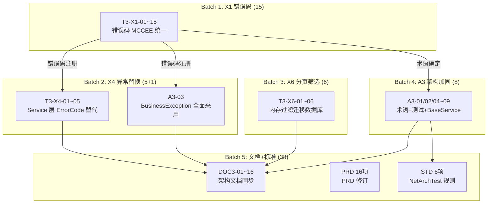

# Sprint 3: 体系统一与文档同步 -- 详细执行计划

> **创建时间**: 2026-02-25
> **数据来源**: [full-sprint-design.md](2026-02-22-full-sprint-design.md) 第三章 (L509-797)
> **路线图**: [unified-architecture-sprint-roadmap.md](2026-02-21-unified-architecture-sprint-roadmap.md) 第四章
> **前置条件**: Sprint 1 (33/33 COMPLETE) + Sprint 2 (51/51 COMPLETE) + D5 跨模块解耦 (12/12 COMPLETE, PR #2263)
> **任务总数**: 73 项 (原 85 - 12 D5 已完成)

---

## 一、Sprint 概览

### 1.1 任务分布

| 分类 | 分组 | 任务数 | 类型 |
|------|------|--------|------|
| 代码 | X1 错误码 MCCEE 统一 | 15 | 核心基础设施 |
| 代码 | X4 Service 层 ErrorCode 替代 | 5 | 异常体系切换 |
| 代码 | X6 分页筛选迁移 Repository | 6 | 性能优化 |
| 代码 | A3 架构加固 | 9 | 术语修复+测试合并+BaseService |
| 文档 | DOC 架构文档同步 | 16 | S1/S2 代码变更后更新 |
| 文档 | PRD 修订 | 16 | 认证/错误/日志/同步模块 |
| 标准 | STD 标准固化 | 6 | NetArchTest 架构规则 |
| **合计** | | **73** | |

### 1.2 执行 Batch 规划

```
Batch 1: X1 错误码 (15)          ← 核心基础设施，其他任务依赖
    │
    ├──→ Batch 2: X4 (5) + A3-03  ← 依赖 X1 错误码注册
    │
    └──→ Batch 3: X6 (6)          ← 独立，可与 Batch 2 并行
              │
              └──→ Batch 4: A3 其余 (8)  ← 术语修复+架构加固
                        │
                        └──→ Batch 5: DOC+PRD+STD (38)  ← 代码完成后文档批量处理
```

### 1.3 D5 已完成项 (不在本 Sprint 范围)

以下 12 项已在 PR #2263 (2026-02-23) 中完成，不再列入执行:

| 任务 ID | 描述 | 状态 |
|---------|------|------|
| T3-D5-01~08 | ICrossModuleService ISP 拆分 (8 项) | COMPLETE |
| T3-D5-09~12 | Sync 模块编译期依赖解耦 (4 项) | COMPLETE |

---

## 二、Batch 1: X1 错误码 MCCEE 统一 (15 项)

**优先级**: 最高 -- 其他代码任务依赖错误码体系
**风险等级**: 高

### 2.1 现状分析

**ErrorCode.cs** (384 行, 66 个错误码):
```
0xxxx (通用):  0-12 共 13 个 -- 不符合 5 位编码规范
1xxxx (用户):  10001-10015 共 15 个
2xxxx (患者):  20001-20006 共 6 个
3xxxx (医案):  30001-30008 共 8 个
4xxxx (处方):  40001-40007 共 7 个
5xxxx (草药):  50001-50006 共 6 个
6xxxx (配方):  60001-60006 共 6 个
7xxxx (问诊):  70001-70005 共 5 个 -- 语义需重新对应
8xxxx (同步):  缺失 -- 20 个 PRD 错误码未实现
```

**关键文件**:
- `ErrorCode.cs` -- 错误码枚举定义
- `ErrorMessages.cs` (89 条) -- 中英文消息映射
- `ClientErrorMessageMapper.cs` (161 条) -- Desktop 端映射
- `ApiErrorCodes.cs` -- 字符串常量 (统一后删除)

### 2.2 技术方案

**阶段 1: 通用错误码迁移 (0-12 -> 0xxxx)**

```csharp
// 旧: Unknown = 0, InvalidRequest = 1, NotFound = 2, ...
// 新: Unknown = 00000, InvalidRequest = 00001, NotFound = 00002, ...
```

更新 `ErrorCode.ToFormattedString()`:
```csharp
public static string ToFormattedString(this ErrorCode code)
    => $"ERR-{(int)code:D5}";  // 格式化为 ERR-00001
```

**阶段 2: 按模块补齐缺失错误码**

| 模块 | 当前范围 | 需补齐 |
|------|---------|--------|
| Auth | 10001-10015 | Auth 专用错误码归属到 1xxxx |
| Patients | 20001-20006 | 补齐 ERR-20002/20004/20005/20006 |
| Herbs | 50001-50006 | 对齐编号规范 |
| Formulas | 60001-60006 | 17 个错误码对齐 |
| MedicalCase | 30001-30008 | 迁移到 ERR-3xxxx |
| Sync | 无 | 新增 8xxxx 范围 20 个错误码 |

**阶段 3: 客户端同步更新**

ClientErrorMessageMapper 的 `ErrorCodeMessages` 和 `ErrorCodePrefixMessages` 字典同步更新键值。

### 2.3 任务清单

| # | 任务 ID | 模块 | 描述 | 关键文件 |
|---|---------|------|------|----------|
| 1 | T3-X1-01 | auth | Auth 错误码迁移到 5 位 MCCEE | `ErrorCode.cs`, `ErrorMessages.cs` |
| 2 | T3-X1-02 | patients | 实现 ERR-20002 | `ErrorCode.cs`, `PatientsController.cs` |
| 3 | T3-X1-03 | patients | 实现 ERR-20004 | 同上 |
| 4 | T3-X1-04 | patients | 实现 ERR-20005 | 同上 |
| 5 | T3-X1-05 | patients | 实现 ERR-20006 | 同上 |
| 6 | T3-X1-06 | patients | 删除失败返回 422 非 404 | `PatientsController.cs` |
| 7 | T3-X1-07 | herbs | Herbs 错误码编号对齐 | `ErrorCode.cs`, `HerbService.cs` |
| 8 | T3-X1-08 | herbs | 实现 ERR-50106 | 同上 |
| 9 | T3-X1-09 | herbs | 实现 ERR-50104 | 同上 |
| 10 | T3-X1-10 | herbs | 实现 ERR-50202 | 同上 |
| 11 | T3-X1-11 | formulas | Formulas 17 个错误码对齐 | `ErrorCode.cs`, `FormulaService.cs` |
| 12 | T3-X1-12 | medical-cases | MedicalCase 错误码迁移到 ERR-3xxxx | `ErrorCode.cs`, `MedicalCase*Service.cs` |
| 13 | T3-X1-13 | sync | 同步模块 20 个 PRD 错误码全部实现 | `ErrorCode.cs`, `SyncService.cs` |
| 14 | T3-X1-14 | error-handling | ErrorCode 7xxxx 语义重新对应 | `ErrorCode.cs` |
| 15 | T3-X1-15 | error-handling | 修复 ClientErrorMessageMapper 解析 ERR-10004 | `ClientErrorMessageMapper.cs` |

### 2.4 验收标准

- [ ] 所有错误码使用 5 位 MCCEE 编码 (ERR-xxxxx)
- [ ] `ErrorCode.ToFormattedString()` 输出格式统一
- [ ] ClientErrorMessageMapper 与 ErrorCode 完全对应
- [ ] Sync 模块 8xxxx 范围 20 个错误码注册
- [ ] 单元测试覆盖新错误码
- [ ] `dotnet build` 0 errors

---

## 三、Batch 2: X4 异常替换 (5 项) + A3-03

**前置依赖**: Batch 1 (X1 错误码注册完成)
**风险等级**: 中

### 3.1 精确定位: InvalidOperationException 分布

**MedicalCaseCommandService.cs** (726 行, 6 处):

| 行号 | 当前代码 | 替换方案 |
|------|---------|---------|
| L170 | `throw new InvalidOperationException("医案的辨证信息不存在")` | `throw NotFoundException.Consultation(medicalCaseId)` |
| L254 | `throw new InvalidOperationException("未标记需要开处方...")` | `throw new BusinessException(EC.InvalidMedicalCaseState, "...")` |
| L257 | `throw new InvalidOperationException("医案已存在处方...")` | `throw new BusinessException(EC.MedicalCaseConflict, "...")` |
| L323 | `throw new InvalidOperationException("处方已打印，不允许修改")` | `throw new BusinessException(EC.PrescriptionAlreadyPrinted, "...")` |
| L383 | `throw new InvalidOperationException("处方已打印，不允许删除")` | `throw new BusinessException(EC.PrescriptionAlreadyPrinted, "...")` |
| L459 | `throw new InvalidOperationException("医案不存在")` | `throw NotFoundException.MedicalCase(medicalCaseId)` |

**MedicalCaseServiceHelper.cs** (222 行, 5 处):

| 行号 | 当前代码 | 替换方案 |
|------|---------|---------|
| L120 | `"患者不存在"` | `throw NotFoundException.Patient(patientId)` |
| L123 | `"医生不存在"` | `throw NotFoundException.User(doctorId)` |
| L134 | `"该患者已有进行中的医案"` | `throw new BusinessException(EC.MedicalCaseConflict, "...")` |
| L142 | `"该患者已有暂存的医案"` | `throw new BusinessException(EC.MedicalCaseConflict, "...")` |
| L180 | `"操作失败，请稍后重试"` | `throw new BusinessException(EC.ServiceUnavailable, "...")` |

**MedicalCaseStateService**: 8 处 (状态流转异常)

**JwtService.cs**: 3 处 (L37-55, SecretKey 验证)

**已有异常类** (可直接使用):
- `AppException` (基类, 95 行): ErrorCode + UserMessage + ShowDetailToUser + GetHttpStatusCode
- `BusinessException` (49 行): 400 + BusinessRule
- `NotFoundException` (77 行): 404 + ResourceType/ResourceId + 静态工厂方法

### 3.2 任务清单

| # | 任务 ID | 模块 | 描述 | 修改文件 | 替换数量 |
|---|---------|------|------|----------|---------|
| 1 | T3-X4-01 | users | UserService 硬编码替换为 ErrorCode | `UserService.cs` | 5+ 处 |
| 2 | T3-X4-02 | users | 用户名重复返回 409 (ConflictException) | `UserService.cs` | 1 处 |
| 3 | T3-X4-03 | herbs | HerbService 硬编码替换为 ErrorCode | `HerbService.cs` | 5+ 处 |
| 4 | T3-X4-04 | formulas | FormulaService 硬编码替换为 ErrorCode | `FormulaService.cs` | 5+ 处 |
| 5 | T3-X4-05 | auth | TokenRevoked 提示语义精确化 | `AuthService.cs` | 3 处 |
| 6 | A3-03 | 跨模块 | Service 层全面采用 BusinessException/NotFoundException | `MedicalCaseCommandService.cs`, `MedicalCaseServiceHelper.cs`, `MedicalCaseStateService.cs` | 19+ 处 |

### 3.3 验收标准

- [ ] 项目中不再有 `throw new InvalidOperationException` (Service 层)
- [ ] 所有异常使用 BusinessException/NotFoundException/ConflictException
- [ ] 每个异常携带 ErrorCode
- [ ] GlobalExceptionHandler 正确映射 HTTP 状态码
- [ ] 单元测试验证异常类型

---

## 四、Batch 3: X6 分页筛选迁移 Repository (6 项)

**前置依赖**: 无 (可与 Batch 2 并行)
**风险等级**: 中

### 4.1 精确定位: 内存过滤代码

**HerbService.GetPagedAsync** (L43-67):
- 内存过滤 category (L53-58)
- TotalCount 错误: 内存过滤后重新计算 (L63)

**MedicalCaseQueryService.GetListAsync** (L49-100):
- 内存过滤 status/patientId/keyword/doctorId (L56-80)
- TotalCount 错误 (L95): 使用过滤后的 filteredItems.Count()

**FormulaService.GetPagedAsync** (L35-91):
- 内存过滤 角色 + 分类 (L50-65)

**FormulaService.GetPendingValidationFormulasAsync** (L282-298):
- 全量加载! `var allFormulas = await _repository.GetAllAsync()`

### 4.2 技术方案

利用 `BaseRepository.GetPagedAsync` 高级重载:

```csharp
public virtual async Task<PagedResult<TEntity>> GetPagedAsync(
    int pageNumber, int pageSize,
    Expression<Func<TEntity, bool>>? predicate = null,
    Expression<Func<TEntity, object>>? orderBy = null,
    bool ascending = false)
```

### 4.3 任务清单

| # | 任务 ID | Service | 筛选字段 | 修改方式 |
|---|---------|---------|---------|---------|
| 1 | T3-X6-01 | UserService | role + status | predicate 参数 |
| 2 | T3-X6-02 | HerbService | category | predicate 参数 |
| 3 | T3-X6-03 | FormulaService | category | predicate 参数 |
| 4 | T3-X6-04 | FormulaService | GetPendingValidation 改分页 | predicate + GetPagedAsync |
| 5 | T3-X6-05 | MedicalCaseQueryService | status + patientId + doctorId | predicate 参数 |
| 6 | T3-X6-06 | ErrorHandling | HTTP 429 映射到错误码 | RateLimiting + ErrorCode |

### 4.4 验收标准

- [ ] 所有筛选在数据库层完成 (IQueryable)
- [ ] TotalCount 由数据库正确计算
- [ ] GetPendingValidation 不再全量加载
- [ ] 分页 API 响应性能测试 (大数据量)

---

## 五、Batch 4: A3 架构加固 (8 项)

**前置依赖**: Batch 1 (术语修复依赖错误码体系确定)

### 5.1 任务清单

| # | 任务 ID | 描述 | 核心修改 | 说明 |
|---|---------|------|---------|------|
| 1 | A3-01 | ErrorCode.cs 术语违规修复 | 替换 "病历"->"医案", "问诊"->"辨证" | 与 X1 一并处理 |
| 2 | A3-02 | ErrorMessages.cs + NotFoundException.cs 术语修复 | 同上 | 与 X1 一并处理 |
| 3 | A3-04 | 两套架构测试合并 | 消除 24 条重复规则 | `tests/LYBT.Tests.Architecture/` |
| 4 | A3-05 | 添加 Shared 内部依赖架构规则 | 同上 | |
| 5 | A3-06 | 术语铁律违规系统清理 (136 处/39 文件) | 全局搜索替换 | 与 A3-01/02 协同 |
| 6 | A3-07 | FormulaService 补齐 BaseService 继承 | `FormulaService.cs` | 享受统一错误处理 |
| 7 | A3-08 | FallbackPolicy 设置 | `AuthenticationServiceCollectionExtensions.cs` | Swagger 兼容 |
| 8 | A3-09 | 补齐 Shared.Logging/Desktop.Sync 零覆盖测试 | 新建测试文件 | 优先 2 个高优模块 |

> 注: A3-03 已归入 Batch 2 (与 X4 一起执行)

### 5.2 术语违规精确定位

| 文件 | 行号 | 违规内容 | 修正 |
|------|------|---------|------|
| ErrorMessages.cs | L48 | `// 病历模块` | `// 医案模块` |
| ErrorMessages.cs | L49-56 | 多处 "病历" | "医案" |
| ClientErrorMessageMapper.cs | L71 | `"病历相关错误"` | `"医案相关错误"` |
| ClientErrorMessageMapper.cs | L116 | `"就诊记录"` | `"医案"` |
| ClientErrorMessageMapper.cs | L121-128 | 多处 "病历" | "医案" |
| NotFoundException.cs | L70 | `"病历不存在"` | `"医案不存在"` |

### 5.3 验收标准

- [ ] 项目中不存在 "病历" / "就诊记录" 术语 (代码+注释)
- [ ] 架构测试项目合并为单一 `LYBT.Tests.Architecture`
- [ ] FormulaService 继承 BaseService
- [ ] Shared.Logging + Desktop.Sync 有基本测试覆盖
- [ ] `dotnet test tests/LYBT.Tests.Architecture/` 全部通过

---

## 六、Batch 5: 文档 + PRD + 标准 (38 项)

**前置依赖**: Batch 1-4 代码完成后

### 6.1 DOC: 架构文档同步 (16 项)

| # | 任务 ID | 描述 | 目标文档 |
|---|---------|------|---------|
| 1 | DOC3-01 | Consultation/Prescriptions 空壳模块标注废弃 | system-overview.md |
| 2 | DOC3-02 | system-overview.md 项目总数更新 (约 33->40+) | system-overview.md |
| 3 | DOC3-03 | Shared 层文档补全 8 个项目 (4 个缺失) | shared.md |
| 4 | DOC3-04 | Desktop.LocalData 和 CardReader 补充到系统概览 | system-overview.md |
| 5 | DOC3-05 | Desktop 端 Consultation 模块标注不存在 | desktop.md |
| 6 | DOC3-06 | Controls/ vs Views/ 目录约定文档化 | desktop.md |
| 7 | DOC3-07 | FormulaService 不继承 BaseService 的原因文档化 | server.md |
| 8 | DOC3-08 | Desktop.CardReader 位置混乱的说明 | desktop.md |
| 9 | DOC3-09 | Validator 位置迁移 (Module->Shared.Validators) 文档更新 | server.md |
| 10 | DOC3-10 | 4 个辅助实体补充到 data-model.md | data-model.md |
| 11 | DOC3-11 | 异常处理体系架构文档更新 (切换后) | error-handling 设计文档 |
| 12 | DOC3-12 | CLAUDE.md 测试项目数量更新 (5->实际数) | CLAUDE.md |
| 13 | DOC3-13 | SensitiveDataAttribute 统一后文档更新 | shared.md |
| 14 | DOC3-14 | CorrelationId 全链路文档补充 (正面发现文档化) | error-handling 文档 |
| 15 | DOC3-15 | 工具层 4 个项目文档化 | system-overview.md |
| 16 | DOC3-16 | OpenSpec 标记 1299 处跟踪机制文档 | development 指南 |

### 6.2 PRD: PRD 修订 (16 项)

认证/错误处理/日志/同步/配置模块 PRD 接受当前代码实现。

| # | PRD 编号 | 模块 | 修订内容 |
|---|---------|------|---------|
| 1 | AUTH-02 | auth | 移除登出前警告 (simplify-auth 决策) |
| 2 | AUTH-11 | auth | AuthSession 独立表 -> 保持 Token 表 |
| 3 | AUTH-13 | auth | 内外网统一限流 |
| 4 | AUTH-15 | auth | WPF 触摸事件追踪过度设计 |
| 5 | AUTH-19 | auth | 状态命名 PRD 接受代码命名 |
| 6 | ERR-07 | error-handling | 错误消息文案细节 PRD 接受 |
| 7 | ERR-08 | error-handling | 错误分类枚举值 PRD 接受 |
| 8 | ERR-09 | error-handling | 错误日志格式 PRD 接受 |
| 9 | LOG-05 | logging | 日志级别配置差异 PRD 接受 |
| 10 | LOG-06 | logging | 日志格式模板差异 PRD 接受 |
| 11 | LOG-07 | logging | 日志轮转配置差异 PRD 接受 |
| 12 | LOG-08 | logging | 结构化日志字段命名 PRD 接受 |
| 13 | SYNC-11 | sync | 进度 UI 简化 PRD 接受 |
| 14 | SYNC-15 | sync | DTO 命名 PRD 接受 |
| 15 | SYNC-16 | sync | 字段名差异 PRD 接受 |
| 16 | SYNC-19 | sync | 其他命名规范 PRD 接受 |

### 6.3 STD: 架构标准固化 (6 项)

写入 `tests/LYBT.Tests.Architecture/` 为 NetArchTest 规则:

| # | 标准编号 | 正面发现 | 测试规则 | 保护内容 |
|---|---------|---------|---------|---------|
| 1 | P-01 | 双模式 5/5 实体 100% 完整 | `AllEntitiesWithDataSourceMustHaveBothModes` | 新增实体必须同时实现 Remote+Local |
| 2 | P-02 | Repository 基类 100% 统一 | `AllRepositoriesMustInheritBaseRepository` | 禁止绕过 BaseRepository |
| 3 | P-03 | MasterDetailViewModelBase 100% | `AllCrudViewModelsMustInheritMasterDetail` | CRUD ViewModel 必须继承基类 |
| 4 | P-06 | 无反向引用/循环依赖 | `NoReverseOrCircularDependencies` | 防止分层退化 |
| 5 | P-08 | 所有跨模块引用仅依赖接口 | `CrossModuleReferencesMustUseInterfaces` | 防止具体实现耦合 |
| 6 | P-09 | Controller 100% 授权覆盖 | `AllControllersMustHaveClassLevelAuthorize` | 防止裸 Controller |

### 6.4 验收标准

- [ ] 所有 DOC 任务对应的文档已更新
- [ ] PRD 修订在对应 PRD 文件中标记 "代码实现已接受"
- [ ] 6 条 NetArchTest 规则全部通过
- [ ] `dotnet test tests/LYBT.Tests.Architecture/` 0 failures

---

## 七、依赖关系图



### 关键依赖链

| 依赖链 | 说明 |
|--------|------|
| X1 (错误码注册) -> X4 (Service 替换) -> A3-03 (异常体系) -> DOC3-11 (文档) | 错误处理完整重构链 |
| X1 (术语确定) -> A3-01/02/06 (术语清理) -> DOC (文档更新) | 术语统一链 |
| A3-04 (测试合并) -> STD (标准固化) | 架构测试链 |

---

## 八、风险与缓解

| 风险 | 影响 | 缓解措施 |
|------|------|---------|
| X1 错误码迁移影响面广 | 编译错误大量出现 | 按模块逐个迁移，每个模块独立编译验证 |
| X4 异常替换可能遗漏 | 运行时异常未被正确处理 | Grep 搜索 `InvalidOperationException` 确保全部替换 |
| X6 分页迁移性能回归 | 查询变慢 | 对比迁移前后的 SQL 执行计划 |
| DOC 文档量大 (16 项) | 遗漏更新 | 使用 doc-sync skill 检测遗漏 |
| 术语清理 136 处 | 误替换 | 正则精确匹配，排除非术语上下文 |

---

## 九、统计汇总

### 按 Batch 统计

| Batch | 任务数 | 类型 | 建议并行度 |
|-------|--------|------|-----------|
| Batch 1 (X1) | 15 | 代码 | 按模块逐个 |
| Batch 2 (X4+A3-03) | 6 | 代码 | 可与 Batch 3 并行 |
| Batch 3 (X6) | 6 | 代码 | 可与 Batch 2 并行 |
| Batch 4 (A3 其余) | 8 | 代码+测试 | 顺序执行 |
| Batch 5 (DOC+PRD+STD) | 38 | 文档+标准 | 文档可并行 |
| **合计** | **73** | | |

### 按模块统计

| 模块 | X1 | X4 | X6 | A3 | DOC | PRD | STD | 合计 |
|------|----|----|----|----|-----|-----|-----|------|
| auth | 1 | 1 | - | - | - | 5 | - | 7 |
| users | - | 2 | 1 | - | - | - | - | 3 |
| patients | 5 | - | - | - | - | - | - | 5 |
| herbs | 4 | 1 | 1 | - | - | - | - | 6 |
| formulas | 1 | 1 | 2 | 1 | - | - | - | 5 |
| medical-cases | 1 | - | 1 | - | - | - | - | 2 |
| sync | 1 | - | - | - | - | 4 | - | 5 |
| error-handling | 2 | - | 1 | - | - | 3 | - | 6 |
| logging | - | - | - | - | - | 4 | - | 4 |
| 跨模块/架构 | - | 1 | - | 8 | 16 | - | 6 | 31 |
| **合计** | **15** | **6** | **6** | **9** | **16** | **16** | **6** | **73** |

> 注: X4 的 6 项 = X4-01~05 (5 项) + A3-03 (1 项，归入 Batch 2 执行)

---

## 变更记录

| 日期 | 版本 | 变更内容 |
|------|------|----------|
| 2026-02-25 | v1.0 | 初始版本: 从 full-sprint-design.md 第三章提取; D5(12 项) 已完成扣除; 按 5 Batch 组织执行计划 |
