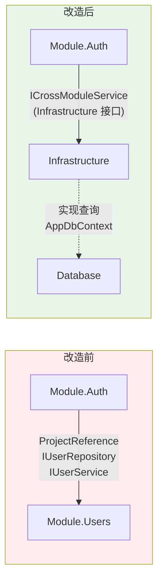
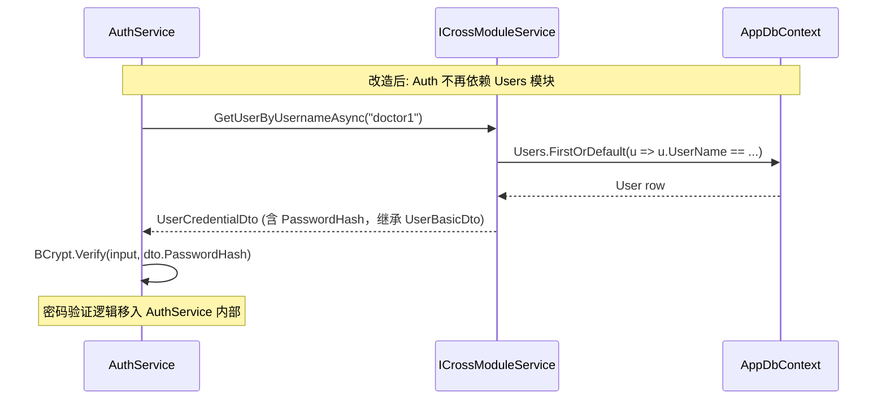
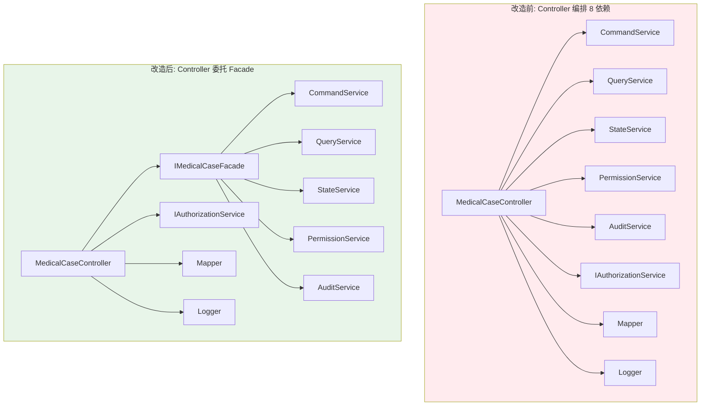
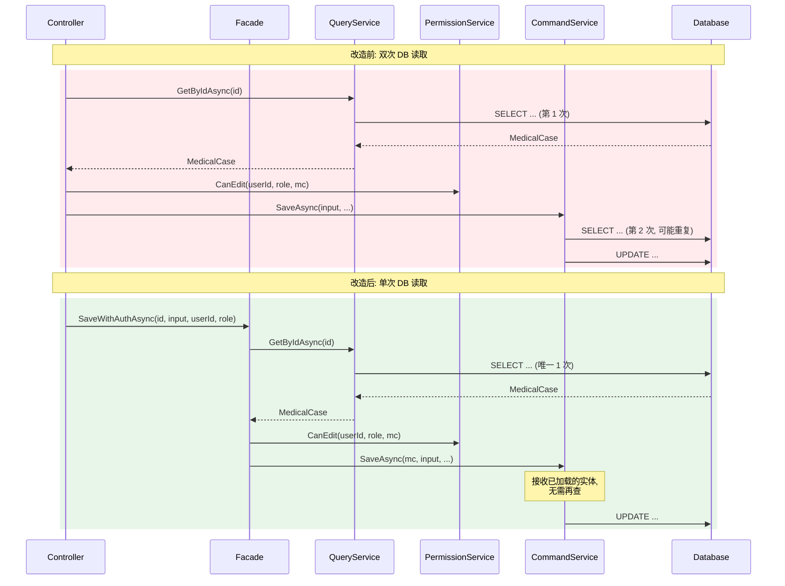
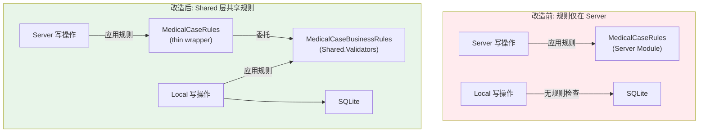
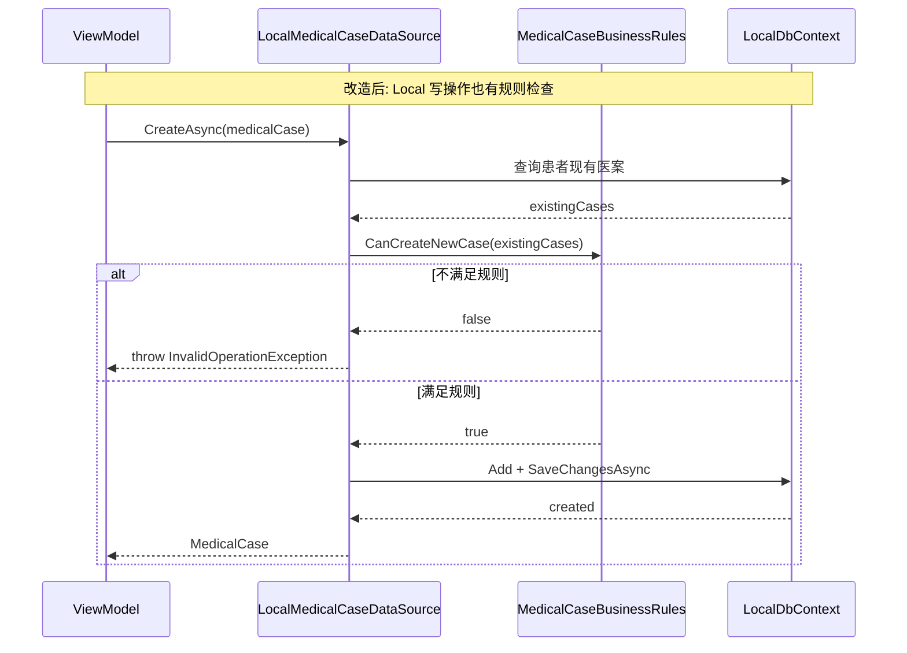
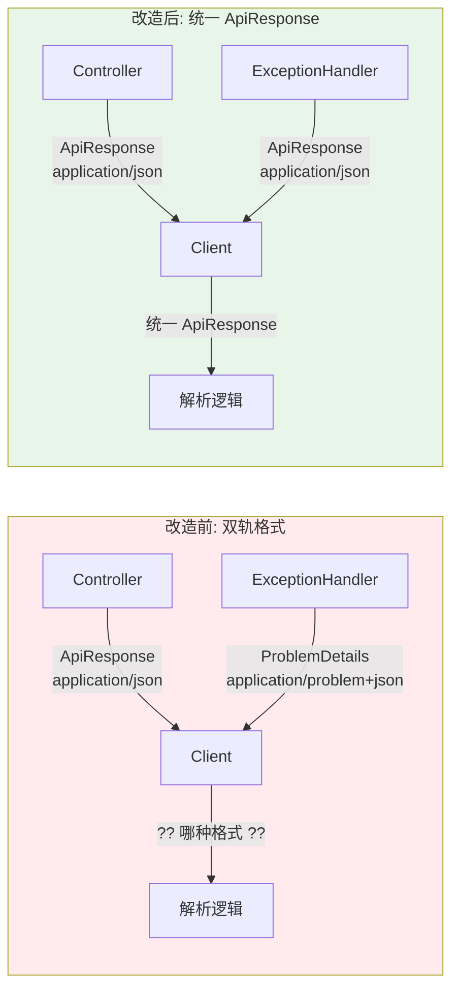
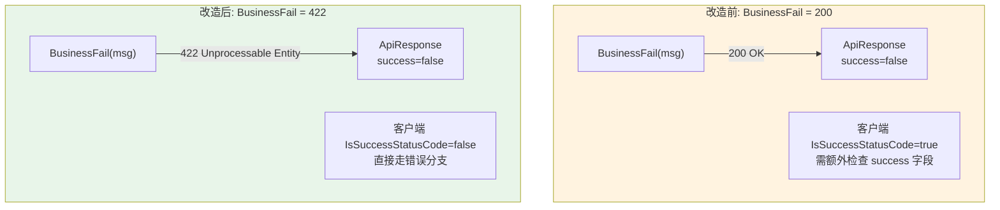

# 8 个设计合理性问题 -- 解决方案

> **生成日期**: 2026-02-21
> **关联文档**: `2026-02-21-system-architecture-diagrams.md` Section 8
> **状态**: 已完成 (2026-02-21 实施 + Code Review)
> **定位**: 所有 8 个问题已全部实施，经5代理并行代码审查后修复4项问题

---

## 目录

- [总览](#总览)
- [Issue #1: Auth->Users 跨模块依赖 (HIGH)](#issue-1-auth-users-跨模块依赖-high)
- [Issue #2 + #3: Controller 8依赖 + 双次DB读取 (MEDIUM)](#issue-2--3-controller-8依赖--双次db读取-medium)
- [Issue #4: Local 模式绕过业务规则 (HIGH)](#issue-4-local-模式绕过业务规则-high)
- [Issue #5: ViewModel 继承链断裂 (LOW)](#issue-5-viewmodel-继承链断裂-low)
- [Issue #6: Token 安全可能过度设计 (LOW)](#issue-6-token-安全可能过度设计-low)
- [Issue #7: IHerbItem 接口不一致 (LOW)](#issue-7-iherbitem-接口不一致-low)
- [Issue #8: 双轨响应格式统一 (MEDIUM)](#issue-8-双轨响应格式统一-medium)
- [实施路线图](#实施路线图)
- [附录: ADR 模板](#附录-adr-模板)

---

## 总览

| # | 问题 | 严重度 | 方案 | 改动量 | Sprint |
|---|------|--------|------|--------|--------|
| 1 | Auth->Users 跨模块依赖 | HIGH | 扩展 ICrossModuleService + 移除 ProjectReference | 5 文件 | 1 |
| 2+3 | Controller 8依赖 + 双次DB读取 | MEDIUM | 引入 IMedicalCaseFacade 聚合服务 + 内部集成鉴权 | 4 文件 | 2 |
| 4 | Local 绕过业务规则 | HIGH | 提取 MedicalCaseBusinessRules 到 Shared.Validators | 4 文件 | 1 |
| 5 | ViewModel 继承链断裂 | LOW | ADR 记录设计决策 | 仅文档 | 3 |
| 6 | Token 过度设计 | LOW | ADR 补充设计意图 | 仅文档 | 3 |
| 7 | IHerbItem 不一致 | LOW | 删除 Server 端冗余接口 + 文档化 | 1 文件 + 文档 | 3 |
| 8 | 双轨响应格式 | MEDIUM | 统一为 ApiResponse: 中间件改返回 ApiResponse + BusinessFail -> 422 | 4 文件 | 2 |

**代码变更总计**: 约 18 个文件 (新建 4 / 修改 13 / 删除 1)
**文档变更**: 3 个 ADR + 本文档

---

## Issue #1: Auth->Users 跨模块依赖 (HIGH)

### 问题描述

`LYBT.Module.Auth.csproj` 包含 `<ProjectReference Include="..\LYBT.Module.Users\LYBT.Module.Users.csproj" />`，AuthService 直接注入 `IUserRepository` 和 `IUserService`。这违反了 `system-overview.md` 明确的规范："Module 之间禁止直接依赖，跨模块通过 `ICrossModuleService` 通信"。

**相关图表**: Section 2.1 项目依赖图 / Section 5.2 认证流程时序图

### 根因分析

`AuthService` (`src/Server/Modules/LYBT.Module.Auth/Services/AuthService.cs`) 构造函数注入了 8 个依赖:

```csharp
public AuthService(
    IJwtService jwtService,
    IUserRepository userRepository,       // <-- 跨模块依赖
    IUserService userService,             // <-- 跨模块依赖
    ILogger<AuthService> logger,
    AppDbContext dbContext,
    IConfiguration configuration,
    ITokenRevocationService revocationService,
    ISecurityAuditService auditService)
```

Auth 对 Users 模块的 3 个需求:
1. **密码验证**: `IUserService.ValidatePasswordAsync(username, password)` -- 登录时校验 BCrypt 密码
2. **按用户名查**: `IUserRepository.GetByUsernameAsync(username)` -- 登录时查找用户
3. **按ID查**: `IUserRepository.GetByIdAsync(id)` -- Token 刷新/自动登录时获取用户

### 改造前后对比





### 推荐方案

**扩展 ICrossModuleService** -- 新增 3 个用户查询方法，密码验证逻辑移入 AuthService 自身。

**设计决策**: 不在 ICrossModuleService 中暴露 `ValidateUserPasswordAsync`，因为密码验证属于 Auth 领域逻辑。CMQS 返回 `UserCredentialDto`(含 PasswordHash，继承自 UserBasicDto)，由 AuthService 自行调用 BCrypt 验证。`UserBasicDto` 不含 PasswordHash，用于非认证场景的用户信息展示。这既保持了 CMQS 的职责边界，又实现了敏感信息隔离 (SRP)。

### 实施步骤

**Step 1**: 新建 `UserBasicDto` 和 `UserCredentialDto`

> **[已实施 2026-02-21]** 拆分为两个 DTO: UserBasicDto (不含敏感信息) + UserCredentialDto (含 PasswordHash)。
> Role/Status 改为枚举类型 (UserRole/CommonStatus)，补全 User 实体的全部展示字段。

```csharp
// src/Shared/LYBT.Shared.Models/DTOs/Users/UserBasicDto.cs
namespace LYBT.Shared.Models.DTOs.Users;

/// <summary>
/// 跨模块用户基本信息 DTO - 不含敏感信息
/// </summary>
public record UserBasicDto
{
    public Guid Id { get; init; }
    public string UserName { get; init; } = string.Empty;
    public string RealName { get; init; } = string.Empty;
    public UserRole Role { get; init; }           // 枚举类型，非 string
    public CommonStatus Status { get; init; }     // 枚举类型，非 string
    public string? PhoneNumber { get; init; }
    public string? Email { get; init; }
    public string? PinYinCode { get; init; }
    public DateTime? LastLoginTime { get; init; }
    public int FailedLoginCount { get; init; }
    public DateTime CreatedAt { get; init; }
    public DateTime? UpdatedAt { get; init; }
    public string? Remark { get; init; }
}

/// <summary>
/// 用户凭据 DTO - 含 PasswordHash，仅供密码验证场景
/// </summary>
public record UserCredentialDto : UserBasicDto
{
    public string PasswordHash { get; init; } = string.Empty;
}
```

**Step 2**: 扩展 `ICrossModuleService` 接口

在 `src/Server/Core/LYBT.Infrastructure/Services/ICrossModuleService.cs` 新增:

```csharp
// 用户跨模块查询 (供 Auth 模块使用)
Task<UserBasicDto?> GetUserBasicInfoAsync(Guid userId);
Task<UserCredentialDto?> GetUserByUsernameAsync(string username);  // 返回 UserCredentialDto
Task UpdateUserPasswordHashAsync(Guid userId, string newPasswordHash);
```

**Step 3**: 在 `CrossModuleService` 中实现

在 `src/Server/Core/LYBT.Infrastructure/Services/CrossModuleService.cs` 新增实现:

```csharp
public async Task<UserBasicDto?> GetUserBasicInfoAsync(Guid userId)
{
    return await _context.Users
        .AsNoTracking()
        .Where(u => u.Id == userId && !u.IsDeleted)
        .Select(u => new UserBasicDto
        {
            Id = u.Id, UserName = u.UserName, RealName = u.RealName,
            Role = u.Role, Status = u.Status,
            PhoneNumber = u.PhoneNumber, Email = u.Email,
            PinYinCode = u.PinYinCode, LastLoginTime = u.LastLoginTime,
            FailedLoginCount = u.FailedLoginCount,
            CreatedAt = u.CreatedAt, UpdatedAt = u.UpdatedAt,
            Remark = u.Remark
        })
        .FirstOrDefaultAsync();
}

public async Task<UserCredentialDto?> GetUserByUsernameAsync(string username)
{
    return await _context.Users
        .AsNoTracking()
        .Where(u => u.UserName == username && !u.IsDeleted)
        .Select(u => new UserCredentialDto
        {
            Id = u.Id, UserName = u.UserName, RealName = u.RealName,
            Role = u.Role, Status = u.Status,
            PhoneNumber = u.PhoneNumber, Email = u.Email,
            PinYinCode = u.PinYinCode, LastLoginTime = u.LastLoginTime,
            FailedLoginCount = u.FailedLoginCount,
            CreatedAt = u.CreatedAt, UpdatedAt = u.UpdatedAt,
            Remark = u.Remark,
            PasswordHash = u.PasswordHash
        })
        .FirstOrDefaultAsync();
}
```

**Step 4**: 重构 `AuthService`

在 `src/Server/Modules/LYBT.Module.Auth/Services/AuthService.cs` 中:
- 移除构造函数中的 `IUserRepository userRepository` 和 `IUserService userService`
- 新增 `ICrossModuleService crossModuleQuery`
- 将 `_userService.ValidatePasswordAsync()` 调用替换为: CMQS 获取 UserCredentialDto -> BCrypt.Verify
- 将 `_userRepository.GetByUsernameAsync()` 替换为 `_crossModuleQuery.GetUserByUsernameAsync()`
- 将 `_userRepository.GetByIdAsync()` 替换为 `_crossModuleQuery.GetUserBasicInfoAsync()`

**Step 5**: 移除 ProjectReference

在 `src/Server/Modules/LYBT.Module.Auth/LYBT.Module.Auth.csproj` 中:
- 删除 `<ProjectReference Include="..\LYBT.Module.Users\LYBT.Module.Users.csproj" />`
- 确认已有 `<ProjectReference Include="..\..\Core\LYBT.Infrastructure\LYBT.Infrastructure.csproj" />` (ICrossModuleService 所在位置)

**Step 6**: 添加 BCrypt NuGet 引用

检查 `LYBT.Module.Auth.csproj` 是否已引用 BCrypt.Net-Next。若之前通过 Users 模块传递依赖获得，需显式添加:
```xml
<PackageReference Include="BCrypt.Net-Next" Version="4.*" />
```

### 受影响文件

| 文件路径 | 操作 | 说明 |
|----------|------|------|
| `src/Shared/LYBT.Shared.Models/DTOs/Users/UserBasicDto.cs` | 新建 | 跨模块 DTO (UserBasicDto + UserCredentialDto) |
| `src/Server/Core/LYBT.Infrastructure/Services/ICrossModuleService.cs` | 修改 | +2 个用户查询方法签名 |
| `src/Server/Core/LYBT.Infrastructure/Services/CrossModuleService.cs` | 修改 | +2 个用户查询实现 |
| `src/Server/Modules/LYBT.Module.Auth/Services/AuthService.cs` | 重构 | 替换依赖源 |
| `src/Server/Modules/LYBT.Module.Auth/LYBT.Module.Auth.csproj` | 修改 | 移除 Users 引用 |

### 验证方法

1. `dotnet build src/Server/Modules/LYBT.Module.Auth/` -- 编译验证无 Users 依赖
2. `dotnet test tests/LYBT.Tests.Unit/ --filter "FullyQualifiedName~Auth"` -- Auth 单元测试
3. `dotnet test tests/LYBT.Tests.Server.Integration/ --filter "FullyQualifiedName~Auth"` -- Auth 集成测试
4. `dotnet test tests/LYBT.Tests.Architecture/` -- 架构测试验证模块依赖规则

### 风险评估

| 维度 | 评估 |
|------|------|
| 向后兼容 | **完全兼容** -- 仅改变内部实现，Auth API 不变 |
| 回归范围 | Auth 登录/刷新/自动登录/登出 4 个流程 |
| 关键风险 | BCrypt 密码验证逻辑迁移正确性 -- 需确认 Hash 格式一致 |
| 架构测试 | 现有架构测试可能已包含"禁止 Module 间 ProjectReference"规则 |

---

## Issue #2 + #3: Controller 8依赖 + 双次DB读取 (MEDIUM)

### 问题描述

`MedicalCaseController` 构造函数注入 8 个依赖 (5 个 CQRS 服务 + Authorization + Mapper + Logger)，且写操作存在双次数据库读取: Controller 先调用 `QueryService.GetByIdAsync()` 获取实体用于鉴权，`CommandService.SaveAsync()` 内部再次读取。

**相关图表**: Section 6.1 CQRS 分解 / Section 5.3 医案保存流程时序图

### 根因分析

**8 依赖问题**: CQRS Phase 3 拆分过细，Controller 变成了"胖编排器"。

当前 Controller 构造函数 (`src/Server/Services/LYBT.WebAPI/Controllers/MedicalCaseController.cs`):

```csharp
public MedicalCaseController(
    IMedicalCaseCommandService commandService,      // 写操作
    IMedicalCaseQueryService queryService,          // 读操作
    IMedicalCaseStateService stateService,          // 状态管理
    IMedicalCasePermissionService permissionService,// 权限控制
    IMedicalCaseAuditService auditService,          // 审计日志
    IAuthorizationService authorizationService,     // ASP.NET Core 授权
    MedicalCaseMapper mapper,                       // DTO 映射
    ILogger<MedicalCaseController> logger)          // 日志
```

**双次读取问题**: 写操作流程:
1. `QueryService.GetByIdAsync(id)` -- 第 1 次 DB 读取 (含 Include Consultation + Prescription)
2. `AuthorizationService.AuthorizeAsync(user, medicalCase, "Edit")` -- 使用第 1 次结果做鉴权
3. `CommandService.SaveAsync(input, userId, isAdmin)` -- 内部可能第 2 次读取

**联动逻辑**: Facade 模式同时解决两个问题 -- 聚合 5 个服务减少依赖 + 内部单次读取集成鉴权。

### 改造前后对比



**写操作流程对比**:



### 推荐方案

**IMedicalCaseFacade (门面模式)** -- 聚合 5 个 CQRS 服务，写操作内部集成鉴权，单次 DB 往返。

### Facade 接口设计

```csharp
// src/Server/Modules/LYBT.Module.MedicalCase/Interfaces/IMedicalCaseFacade.cs
namespace LYBT.Module.MedicalCases.Interfaces;

public interface IMedicalCaseFacade
{
    // ===== 写操作 (含鉴权 + 单次 DB 往返) =====

    /// <summary>保存医案 (含鉴权检查)</summary>
    Task<Result<MedicalCase>> SaveWithAuthAsync(
        Guid id, MedicalCaseInputDto input, Guid userId, UserRole role);

    /// <summary>设置处方标记 (含鉴权检查)</summary>
    Task<Result<MedicalCase>> SetPrescriptionFlagWithAuthAsync(
        Guid id, bool hasPrescription, Guid userId, UserRole role);

    /// <summary>删除医案 (含鉴权检查)</summary>
    Task<Result<bool>> DeleteWithAuthAsync(
        Guid id, Guid userId, UserRole role);

    /// <summary>更新状态 (含鉴权检查)</summary>
    Task<Result<MedicalCase>> UpdateStatusWithAuthAsync(
        Guid id, MedicalCaseStatus status, Guid userId, UserRole role);

    /// <summary>完成医案 (含鉴权检查)</summary>
    Task<Result<MedicalCase>> CompleteWithAuthAsync(
        Guid id, Guid userId, UserRole role, bool skipValidation = false);

    /// <summary>保存草稿 (含鉴权检查)</summary>
    Task<Result<MedicalCase>> SaveDraftWithAuthAsync(
        Guid id, ConsultationInputDto? input, Guid userId, UserRole role);

    /// <summary>取消医案 (含鉴权检查)</summary>
    Task<Result<MedicalCase>> CancelWithAuthAsync(
        Guid id, Guid userId, UserRole role, string? reason = null);

    // ===== 读操作 (直通 QueryService) =====

    Task<Result<MedicalCase>> GetByIdAsync(Guid id);
    Task<Result<PagedResult<MedicalCaseListDto>>> GetListAsync(MedicalCaseQueryDto query);
    Task<Result<List<PendingMedicalCaseDto>>> GetPendingCasesAsync(Guid doctorId);

    // ===== 权限/审计 (直通) =====

    MedicalCasePermissionDto GetPermissions(Guid userId, UserRole role, MedicalCase mc);
    Task<Result<(List<MedicalCaseAuditLog> Logs, int TotalCount)>> GetAuditLogsPagedAsync(
        Guid medicalCaseId, int page, int pageSize);
}
```

### Facade 内部实现模式

```csharp
// src/Server/Modules/LYBT.Module.MedicalCase/Services/MedicalCaseFacade.cs
// 写操作的统一模式:
public async Task<Result<MedicalCase>> SaveWithAuthAsync(
    Guid id, MedicalCaseInputDto input, Guid userId, UserRole role)
{
    // 1. 单次 DB 读取
    var mc = await _queryService.GetByIdAsync(id);
    if (mc == null) return Result<MedicalCase>.Fail("医案不存在");

    // 2. 鉴权检查
    if (!_permissionService.CanEdit(userId, role, mc))
        return Result<MedicalCase>.Fail("无编辑权限");

    // 3. 执行写操作 (传入已加载的实体, 避免重复查询)
    var result = await _commandService.SaveAsync(mc, input, userId, role == UserRole.Admin);

    // 4. 审计日志
    if (result.IsSuccess)
        await _auditService.LogAsync(/* before, after, operatorId */);

    return result;
}
```

### 实施步骤

**Step 1**: 新建 `IMedicalCaseFacade` 接口

文件: `src/Server/Modules/LYBT.Module.MedicalCase/Interfaces/IMedicalCaseFacade.cs`

按上述接口设计创建。

**Step 2**: 新建 `MedicalCaseFacade` 实现

文件: `src/Server/Modules/LYBT.Module.MedicalCase/Services/MedicalCaseFacade.cs`

构造函数注入 5 个服务:
```csharp
public MedicalCaseFacade(
    IMedicalCaseCommandService commandService,
    IMedicalCaseQueryService queryService,
    IMedicalCaseStateService stateService,
    IMedicalCasePermissionService permissionService,
    IMedicalCaseAuditService auditService)
```

每个写方法遵循模式: Read -> AuthCheck -> Execute -> Audit (单次 DB 往返)。

**注意**: CommandService/StateService 可能需要新增接受已加载实体的重载方法 (避免内部重复查询)。如果现有方法签名是 `SaveAsync(Guid id, ...)` 则需添加 `SaveAsync(MedicalCase existingEntity, ...)` 重载。

**Step 3**: 重构 `MedicalCaseController`

文件: `src/Server/Services/LYBT.WebAPI/Controllers/MedicalCaseController.cs`

```csharp
// Before: 8 params
public MedicalCaseController(
    IMedicalCaseCommandService commandService,
    IMedicalCaseQueryService queryService,
    IMedicalCaseStateService stateService,
    IMedicalCasePermissionService permissionService,
    IMedicalCaseAuditService auditService,
    IAuthorizationService authorizationService,
    MedicalCaseMapper mapper,
    ILogger<MedicalCaseController> logger) : base(logger)

// After: 4 params
public MedicalCaseController(
    IMedicalCaseFacade facade,
    IAuthorizationService authorizationService,
    MedicalCaseMapper mapper,
    ILogger<MedicalCaseController> logger) : base(logger)
```

Controller 的写操作方法从编排模式简化为委托模式:
```csharp
// Before
[HttpPut("{id:guid}")]
public async Task<IActionResult> Save(Guid id, MedicalCaseInputDto input)
{
    var mc = await _queryService.GetByIdAsync(id);           // 第 1 次 DB
    var authResult = await _authorizationService.AuthorizeAsync(...);
    if (!authResult.Succeeded) return Forbid(...);
    var result = await _commandService.SaveAsync(input, ...); // 可能第 2 次 DB
    await _auditService.LogAsync(...);
    return HandleResult(result);
}

// After
[HttpPut("{id:guid}")]
public async Task<IActionResult> Save(Guid id, MedicalCaseInputDto input)
{
    var (userId, _, role) = GetOperator();
    var result = await _facade.SaveWithAuthAsync(id, input, userId, role);
    return HandleResult(result);
}
```

**Step 4**: 注册 Facade 服务

在 `src/Server/Modules/LYBT.Module.MedicalCase/MedicalCaseModule.cs` 的 `AddMedicalCaseModule` 方法中添加:
```csharp
services.AddScoped<IMedicalCaseFacade, MedicalCaseFacade>();
```

### 受影响文件

| 文件路径 | 操作 | 说明 |
|----------|------|------|
| `src/Server/Modules/LYBT.Module.MedicalCase/Interfaces/IMedicalCaseFacade.cs` | 新建 | Facade 接口 |
| `src/Server/Modules/LYBT.Module.MedicalCase/Services/MedicalCaseFacade.cs` | 新建 | Facade 实现 |
| `src/Server/Services/LYBT.WebAPI/Controllers/MedicalCaseController.cs` | 重构 | 8 deps -> 4 deps |
| `src/Server/Modules/LYBT.Module.MedicalCase/MedicalCaseModule.cs` | 修改 | 注册 Facade |
| 可能: `IMedicalCaseCommandService.cs` / `IMedicalCaseStateService.cs` | 修改 | 添加接受已加载实体的重载 |

### 验证方法

1. `dotnet build LYBTZYZS.sln` -- 全量编译
2. `dotnet test tests/LYBT.Tests.Unit/ --filter "FullyQualifiedName~MedicalCase"` -- 单元测试
3. `dotnet test tests/LYBT.Tests.Server.Integration/ --filter "FullyQualifiedName~MedicalCase"` -- 集成测试
4. 手动验证: 通过 Swagger 执行医案 CRUD 操作，确认功能完整

### 风险评估

| 维度 | 评估 |
|------|------|
| 向后兼容 | **API 不变** -- Controller 的 HTTP 端点签名不变，客户端无需修改 |
| 回归范围 | MedicalCase 所有 CRUD 操作 + 状态流转 + 权限判断 |
| 关键风险 | CommandService 方法如果内部依赖 ChangeTracker 上的实体，需确认传入已加载实体的兼容性 |
| 测试调整 | Controller 单元测试需重写 (mock 对象从 8 个减到 4 个) |

---

## Issue #4: Local 模式绕过业务规则 (HIGH)

### 问题描述

本地模式 `LocalMedicalCaseDataSource` 直连 SQLite，不经过 Server 端的权限校验、状态机规则和审计日志。12 个写方法全部无规则检查，可能创建违反业务规则的数据。

**相关图表**: Section 6.4 双模式策略

### 根因分析

`MedicalCaseRules` 定义在 Server 模块 (`src/Server/Modules/LYBT.Module.MedicalCase/Services/MedicalCaseRules.cs`)，属于 `LYBT.Module.MedicalCases` 命名空间。Desktop 端的 `LYBT.Desktop.LocalData` 无法引用 Server 模块，因此 `LocalMedicalCaseDataSource` 的写方法 (`CreateAsync`, `UpdateAsync`, `SaveAsync`, `DeleteAsync`) 全部裸写。

当前 `MedicalCaseRules` 的 4 个纯函数:

| 方法 | 功能 | 依赖 |
|------|------|------|
| `CanCreateNewCase(IEnumerable<MedicalCase>)` | 患者同时只能有一个 Active/Draft 医案 | 仅 MedicalCase.CaseStatus |
| `HasActiveCase(IEnumerable<MedicalCase>)` | 检查是否有 Active 医案 | 仅 MedicalCase.CaseStatus |
| `HasDraftCase(IEnumerable<MedicalCase>)` | 检查是否有 Draft 医案 | 仅 MedicalCase.CaseStatus |
| `IsValidStatusTransition(from, to)` | 状态流转合法性 | 仅枚举值 |

这 4 个方法都是**纯函数**，不依赖任何 Server 端服务，可以安全提取到 Shared 层。

### 改造前后对比





### 推荐方案

**提取纯函数到 Shared.Validators** -- `MedicalCaseBusinessRules` 包含 4 个纯函数，Server 端 `MedicalCaseRules` 简化为 thin wrapper，Local 端直接引用。

### 实施步骤

**Step 1**: 新建 `MedicalCaseBusinessRules`

文件: `src/Shared/LYBT.Shared.Validators/BusinessRules/MedicalCaseBusinessRules.cs`

```csharp
using LYBT.Shared.Models.Enums;

namespace LYBT.Shared.Validators.BusinessRules;

/// <summary>
/// 医案核心业务规则 (纯函数, 无外部依赖)
/// 由 Server MedicalCaseRules 和 Local DataSource 共同引用
/// </summary>
public static class MedicalCaseBusinessRules
{
    /// <summary>
    /// 核心规则: 患者同时只能有一个 Active 或 Draft 状态的医案
    /// </summary>
    public static bool CanCreateNewCase(IEnumerable<MedicalCaseStatus> existingStatuses)
    {
        return !existingStatuses.Any(s => s == MedicalCaseStatus.Active ||
                                          s == MedicalCaseStatus.Draft);
    }

    /// <summary>
    /// 验证状态流转合法性
    /// Draft <-> Active (双向), Completed 由 CompleteAsync 专门处理
    /// </summary>
    public static bool IsValidStatusTransition(MedicalCaseStatus from, MedicalCaseStatus to)
    {
        return (from, to) switch
        {
            (MedicalCaseStatus.Draft, MedicalCaseStatus.Active) => true,
            (MedicalCaseStatus.Active, MedicalCaseStatus.Draft) => true,
            _ => false
        };
    }

    public static bool HasActiveCase(IEnumerable<MedicalCaseStatus> statuses)
        => statuses.Any(s => s == MedicalCaseStatus.Active);

    public static bool HasDraftCase(IEnumerable<MedicalCaseStatus> statuses)
        => statuses.Any(s => s == MedicalCaseStatus.Draft);
}
```

**设计说明**: 参数从 `IEnumerable<MedicalCase>` 改为 `IEnumerable<MedicalCaseStatus>`，消除对 `LYBT.Entities.MedicalCases.MedicalCase` 实体类的依赖。Shared 层只依赖 `MedicalCaseStatus` 枚举 (已在 `LYBT.Shared.Models.Enums` 中)。

**Step 2**: Server 端 `MedicalCaseRules` 简化为 thin wrapper

文件: `src/Server/Modules/LYBT.Module.MedicalCase/Services/MedicalCaseRules.cs`

```csharp
using LYBT.Entities.MedicalCases;
using LYBT.Shared.Models.Enums;
using LYBT.Shared.Validators.BusinessRules;

namespace LYBT.Module.MedicalCases.Services;

/// <summary>
/// 医案规则 - Server 端包装器
/// 内部委托给 MedicalCaseBusinessRules (Shared 层)
/// </summary>
public static class MedicalCaseRules
{
    public static bool CanCreateNewCase(IEnumerable<MedicalCase> existingCases)
        => MedicalCaseBusinessRules.CanCreateNewCase(existingCases.Select(c => c.CaseStatus));

    public static bool HasActiveCase(IEnumerable<MedicalCase> existingCases)
        => MedicalCaseBusinessRules.HasActiveCase(existingCases.Select(c => c.CaseStatus));

    public static bool HasDraftCase(IEnumerable<MedicalCase> existingCases)
        => MedicalCaseBusinessRules.HasDraftCase(existingCases.Select(c => c.CaseStatus));

    public static bool IsValidStatusTransition(MedicalCaseStatus from, MedicalCaseStatus to)
        => MedicalCaseBusinessRules.IsValidStatusTransition(from, to);
}
```

**Step 3**: `LocalMedicalCaseDataSource` 添加规则检查

文件: `src/Client/Desktop/Core/LYBT.Desktop.LocalData/DataSources/LocalMedicalCaseDataSource.cs`

在 `CreateAsync` 方法开头添加:
```csharp
// 业务规则检查: 患者同时只能有一个 Active/Draft 医案
var existingStatuses = await _context.MedicalCases
    .Where(mc => mc.PatientId == entity.PatientId && !mc.IsDeleted)
    .Select(mc => mc.CaseStatus)
    .ToListAsync(ct);

if (!MedicalCaseBusinessRules.CanCreateNewCase(existingStatuses))
    throw new InvalidOperationException("该患者已有进行中或暂存的医案，不能创建新医案");
```

在 `UpdateAsync` / `SaveAsync` 中状态变更处添加:
```csharp
// 验证状态流转合法性
if (existing.CaseStatus != entity.CaseStatus)
{
    if (!MedicalCaseBusinessRules.IsValidStatusTransition(existing.CaseStatus, entity.CaseStatus))
        throw new InvalidOperationException(
            $"医案状态不能从 {existing.CaseStatus} 变更为 {entity.CaseStatus}");
}
```

**Step 4**: 添加项目引用

在 `src/Client/Desktop/Core/LYBT.Desktop.LocalData/LYBT.Desktop.LocalData.csproj` 中添加:
```xml
<ProjectReference Include="..\..\..\..\Shared\LYBT.Shared.Validators\LYBT.Shared.Validators.csproj" />
```

同时确认 Server 端 `LYBT.Module.MedicalCase.csproj` 也添加了 `Shared.Validators` 引用。

### 受影响文件

| 文件路径 | 操作 | 说明 |
|----------|------|------|
| `src/Shared/LYBT.Shared.Validators/BusinessRules/MedicalCaseBusinessRules.cs` | 新建 | 共享规则纯函数 |
| `src/Server/Modules/LYBT.Module.MedicalCase/Services/MedicalCaseRules.cs` | 重构 | thin wrapper |
| `src/Client/Desktop/Core/LYBT.Desktop.LocalData/DataSources/LocalMedicalCaseDataSource.cs` | 修改 | 添加规则检查 |
| `src/Client/Desktop/Core/LYBT.Desktop.LocalData/LYBT.Desktop.LocalData.csproj` | 修改 | 添加引用 |
| 可能: `src/Server/Modules/LYBT.Module.MedicalCase/LYBT.Module.MedicalCase.csproj` | 修改 | 添加引用 |

### 验证方法

1. `dotnet build LYBTZYZS.sln` -- 全量编译
2. `dotnet test tests/LYBT.Tests.Unit/ --filter "FullyQualifiedName~MedicalCaseRules"` -- 规则单元测试
3. `dotnet test tests/LYBT.Tests.Desktop.Unit/ --filter "FullyQualifiedName~LocalMedicalCase"` -- Local 单元测试
4. 新增测试: `MedicalCaseBusinessRulesTests` 覆盖 4 个纯函数
5. 新增测试: `LocalMedicalCaseDataSource` 创建时的规则拦截验证

### 风险评估

| 维度 | 评估 |
|------|------|
| 向后兼容 | **Server 完全兼容** (wrapper 签名不变); **Local 行为变更** (之前允许的违规操作现在会抛异常) |
| 回归范围 | Server MedicalCase 全部写操作 + Local 模式 CreateAsync/UpdateAsync |
| 关键风险 | Local 端用户如果之前依赖"无限制创建"行为，可能需要 UI 提示调整 |
| 数据一致性 | 已有违规数据 (Local 中重复 Active 医案) 不受影响，仅新操作受规则约束 |

---

## Issue #5: ViewModel 继承链断裂 (LOW)

### 问题描述

`CoreViewModelBase` (Desktop.Models) 和 `MasterDetailViewModelBase` (Desktop.Infrastructure) 都继承自 `ObservableObject`，但没有共同基类。`MasterDetailViewModelBase` 无法复用 `CoreViewModelBase` 的 `IsBusy`/`ErrorMessage`/`ExecuteWithErrorHandlingAsync` 等通用能力。

**相关图表**: Section 6.2 ViewModel 继承层次

### 根因分析

**项目依赖循环**: `Desktop.Models` 和 `Desktop.Infrastructure` 之间存在双向依赖风险:
- `CoreViewModelBase` 在 `Desktop.Models` (底层)
- `MasterDetailViewModelBase` 在 `Desktop.Infrastructure` (高层，依赖 Desktop.Models)
- 如果让 `MasterDetailViewModelBase` 继承 `CoreViewModelBase`，方向正确
- 但 `MasterDetailViewModelBase` 同时需要 `IRegionManager` 等 Prism 依赖，这些在 `Desktop.Infrastructure` 中

代码中已标记: `OpenSpec: refactor-viewmodel-composition` -- 说明团队已知此问题，选择了组合模式 (`IMasterDetailServices`) 作为当前解决方案。

### 推荐方案

**ADR 记录设计决策** (不做代码变更) -- 当前组合模式是合理的折中方案。

### ADR 内容

文件: `docs/03-architecture/decisions/0007-viewmodel-composition-pattern.md`

```markdown
# ADR-0007: ViewModel 组合模式

## 状态

已接受 (2026-02-21)

## 背景

系统有两棵独立的 ViewModel 继承树:
1. **CoreViewModelBase** (Desktop.Models): IsBusy, ErrorMessage, ExecuteWithErrorHandlingAsync
2. **MasterDetailViewModelBase** (Desktop.Infrastructure): CRUD 主从模式, LoadListAsync, SaveDetailAsync

两者都继承 CommunityToolkit.Mvvm 的 `ObservableObject`，但无法合并为单一继承链。

## 技术限制

- `CoreViewModelBase` 在 Desktop.Models (底层项目)
- `MasterDetailViewModelBase` 在 Desktop.Infrastructure (依赖 Prism `IRegionManager`)
- 让 MasterDetailViewModelBase 直接继承 CoreViewModelBase 在依赖方向上可行
- 但 MasterDetailViewModelBase 通过 `IMasterDetailServices` 组合接口已实现等价能力

## 决策

保持当前**组合模式** (`IMasterDetailServices`)，通过接口组合而非继承共享能力。

## 原因

1. **SOLID I 原则**: 接口隔离优于继承 -- CRUD ViewModel 和导航 ViewModel 关注点不同
2. **测试友好**: 组合模式更容易 mock 依赖
3. **避免 "God Base Class"**: 合并后基类职责过重
4. **已验证**: 当前模式在 5 个 MasterDetail ViewModel 中运行良好

## 未来可选方案 (当前不执行)

| 方案 | 优点 | 缺点 |
|------|------|------|
| A: CoreVM 下沉到 Shared | 完全解耦 | 过度设计, Shared 不应有 MVVM 依赖 |
| B: MasterDetail 继承 CoreVM | 简化继承树 | Desktop.Infrastructure 需重构 |
| C: 保持组合 (当前) | 已验证, 无变更风险 | 两棵继承树的存在需要文档说明 |

## 标记

`OpenSpec: refactor-viewmodel-composition` -- 代码中现有标记保持，作为未来重构入口。
```

### 受影响文件

| 文件路径 | 操作 | 说明 |
|----------|------|------|
| `docs/03-architecture/decisions/0007-viewmodel-composition-pattern.md` | 新建 | ADR 文档 |

### 验证方法

1. ADR 格式符合现有 `docs/03-architecture/decisions/` 目录下的规范 (0001-0006 已存在)
2. ADR 编号连续 (0007)

### 风险评估

| 维度 | 评估 |
|------|------|
| 向后兼容 | **N/A** -- 仅文档变更 |
| 关键风险 | 无 |

---

## Issue #6: Token 安全可能过度设计 (LOW)

### 问题描述

Token FamilyId 重放攻击检测、Token 轮换机制对于 3-5 人的诊所系统可能过度设计。但从安全最佳实践和未来扩展角度看，这些机制有其合理性。

**相关图表**: Section 4.3 Token 生命周期 / Section 5.2 认证流程时序图

### 根因分析

现有 ADR-0005 (`docs/03-architecture/decisions/0005-superadmin-auth-module.md`) 记录了 Auth 模块的设计决策，但缺少对 FamilyId/Token 轮换的设计理由说明。

Token 安全机制实际实现:
- `RefreshToken` 7 天有效期 + FamilyId 关联
- `AutoLoginToken` 30 天有效期 + FamilyId 关联
- Token 轮换: 使用后标记 `IsUsed=true`，生成新 Token 继承 FamilyId
- 重放攻击检测: `IsUsed=true` 的 Token 再次使用 -> 撤销整个 Family

### 推荐方案

**ADR 补充设计意图文档** (不做代码变更) -- 明确标注"防御性设计"意图。

### ADR 内容

文件: `docs/03-architecture/decisions/0008-token-security-defensive-design.md`

```markdown
# ADR-0008: Token 安全防御性设计

## 状态

已接受 (2026-02-21)

## 背景

当前系统部署规模为单诊所 3-5 人。Token 安全机制 (FamilyId, Token 轮换, 重放攻击检测) 对此规模可能显得"过度设计"。

## 决策

**保留现有 Token 安全机制**，定位为"防御性设计"。

## 原因

### 1. 安全无"过度"

OWASP Session Management 最佳实践推荐 Token 轮换和重放检测。安全性不应以当前用户规模为折扣条件。

### 2. 面向扩展

系统设计为支持多诊所/云部署场景:
- `FamilyId` 机制在多设备登录场景下提供精确撤销能力
- Token 轮换在公网暴露场景 (云部署) 下是必要防护
- 若未来扩展到连锁诊所 (50+ 用户)，现有机制无需改动

### 3. 实现成本已沉没

Token 安全机制已实现并测试通过，维护成本极低 (仅 DB 字段 + 查询条件)。移除反而增加风险和工作量。

### 4. 审计合规

医疗系统对安全审计有更高要求。Token 重放检测提供了"异常登录行为"的检测能力。

## 后果

- Token 刷新流程比简单方案多 1 次 DB 写入 (标记 IsUsed + 创建新 Token)
- 数据库 RefreshTokens 表需定期清理过期记录 (已有 `CleanupExpiredTokensAsync` 实现)
- 新开发人员需理解 FamilyId 概念 (本 ADR 作为文档入口)

## 关联

- `2026-02-21-system-architecture-diagrams.md` Section 4.3: Token 生命周期状态图
- `AuthService.cs`: FamilyId 和 Token 轮换实现
- `ITokenRevocationService.cs`: Token 撤销接口
```

### 受影响文件

| 文件路径 | 操作 | 说明 |
|----------|------|------|
| `docs/03-architecture/decisions/0008-token-security-defensive-design.md` | 新建 | ADR 文档 |

### 验证方法

1. ADR 编号连续 (0008)
2. 关联引用的文件路径准确

### 风险评估

| 维度 | 评估 |
|------|------|
| 向后兼容 | **N/A** -- 仅文档变更 |
| 关键风险 | 无 |

---

## Issue #7: IHerbItem 接口不一致 (LOW)

### 问题描述

Server 端 (`LYBT.Entities.Common.IHerbItem`) 和 Client 端 (`LYBT.Shared.Components.IHerbItem`) 各有一个 `IHerbItem` 接口，签名不同，且 Server 端版本零实现者。

**相关图表**: Section 3.3 领域模型 (药材相关)

### 根因分析

**两个 IHerbItem 对比**:

| 属性 | Server (`LYBT.Entities.Common`) | Shared (`LYBT.Shared.Components`) |
|------|--------------------------------|-----------------------------------|
| `HerbId` | `Guid` (get; set;) | `Guid` (get;) -- 只读 |
| `HerbName` | `string` (get; set;) | `string` (get;) -- 只读 |
| `Dosage` | `int` (get; set;) | `int` (get;) -- 只读 |
| `Unit` | `string` (get; set;) | `string` (get;) -- 只读 |
| `UnitPrice` | **缺失** | `decimal` (get;) -- 只读 |

**Server 端零实现者的原因**: `FormulaHerbItem.HerbId` 是 `Guid?` (可空)，无法满足接口的 `Guid` (非空) 约束。`PrescriptionItem` 实体使用 `HerbId` 但名称为 `PrescriptionItem`，语义上代表处方条目而非药材项。

**命名冲突**: `PrescriptionItem` 在 Server 端表示"处方中的一味药材"，在 Desktop 端 (`LYBT.Shared.Components.PrescriptionItem`) 表示"处方容器组件"，两者语义完全不同。

### 推荐方案

**删除 Server 端冗余接口** + 在解决方案文档中记录命名冲突。

### 实施步骤

**Step 1**: 确认无引用

在删除前通过 Grep 确认 `LYBT.Entities.Common.IHerbItem` 的所有引用:

```bash
# 预期: 仅自身文件定义
rg "LYBT\.Entities\.Common\.IHerbItem" --type cs
rg "using LYBT\.Entities\.Common" --type cs | grep -i herb
```

如果存在意外引用 (如 README 或注释)，需一并清理。

**Step 2**: 删除文件

删除 `src/Server/Core/LYBT.Entities/Common/IHerbItem.cs`

**Step 3**: 编译验证

```bash
dotnet build src/Server/Core/LYBT.Entities/
dotnet build LYBTZYZS.sln
```

**Step 4**: 文档记录

在本文档中记录以下设计说明 (已包含在本节):

- **为什么 Server IHerbItem 无实现者**: `FormulaHerbItem.HerbId` 是 `Guid?`，不满足接口的 `Guid` 约束
- **PrescriptionItem 命名冲突**:
  - Server `LYBT.Entities.Prescriptions.PrescriptionItem` = 处方中的一味药材 (HerbId, Dosage, Unit)
  - Desktop `LYBT.Shared.Components.PrescriptionItem` = 处方 UI 容器组件 (ObservableCollection)
  - 两者在不同层级，不会产生编译冲突，但概念上需注意区分
- **保留 Shared Components IHerbItem**: 有实际实现者 (Desktop 药材编辑 ViewModel)，签名合理 (只读 + UnitPrice)

### 受影响文件

| 文件路径 | 操作 | 说明 |
|----------|------|------|
| `src/Server/Core/LYBT.Entities/Common/IHerbItem.cs` | 删除 | 零实现者的冗余接口 |

### 验证方法

1. `dotnet build LYBTZYZS.sln` -- 全量编译 (确认无隐藏引用)
2. 全文搜索确认无残留引用

### 风险评估

| 维度 | 评估 |
|------|------|
| 向后兼容 | **完全兼容** -- 零实现者，删除无影响 |
| 关键风险 | 极低 -- 唯一风险是存在未被搜索发现的反射引用 (不太可能) |

---

## Issue #8: 双轨响应格式统一 (MEDIUM)

### 问题描述

Controller 正常返回使用 `ApiResponse` 格式 (`{ success, message, data, errors, timestamp, requestId }`)，异常中间件 (`BusinessExceptionHandler`, `SystemExceptionHandler`) 返回 RFC 7807 `ProblemDetails` 格式 (`{ status, title, detail, instance, type, extensions }`)。客户端需要处理两种不同格式。

**相关图表**: Section 6.3 Server 请求管道

### 根因分析

**当前双轨路径**:

| 路径 | 格式 | Content-Type | 示例场景 |
|------|------|-------------|---------|
| Controller 成功 | `ApiResponse` (200 OK) | application/json | 正常 CRUD |
| Controller 业务失败 | `ApiResponse` (200 OK, success=false) | application/json | 权限不足、数据不存在 |
| Controller 验证失败 | `ApiResponse` (400 Bad Request) | application/json | 参数验证 |
| 中间件业务异常 | `ProblemDetails` (4xx) | application/problem+json | AppException 抛出 |
| 中间件系统异常 | `ProblemDetails` (5xx) | application/problem+json | 未处理异常 |

**客户端影响** (`ApiService.HandleResponseAsync`): 当前实现仅按 HTTP 状态码判断成功/失败，错误时直接抛 `ApiException(statusCode, content)`。ViewModel 层需要自行解析错误内容，但不知道是 `ApiResponse` 还是 `ProblemDetails` 格式。

**用户决策**: 统一为 ApiResponse 格式。异常中间件也返回 ApiResponse，`BusinessFail` 改为 HTTP 422。

### 改造前后对比



**HTTP 状态码变更**:



### 推荐方案

**统一为 ApiResponse**: 异常中间件改返回 ApiResponse + `BusinessFail` 改为 HTTP 422。

### 实施步骤

**Step 1**: `BaseApiController.BusinessFail` 改 HTTP 422

文件: `src/Server/Core/LYBT.Infrastructure/Web/BaseApiController.cs`

```csharp
// Before (line 195-204)
protected IActionResult BusinessFail(string message, string? errorCode = null)
{
    var response = ApiResponse.CreateFail(message);
    response.RequestId = GetRequestId();
    if (errorCode != null)
    {
        response.Errors = new { code = errorCode };
    }
    return Ok(response);  // 200 OK
}

// After
protected IActionResult BusinessFail(string message, string? errorCode = null)
{
    var response = ApiResponse.CreateFail(message);
    response.RequestId = GetRequestId();
    if (errorCode != null)
    {
        response.Errors = new { code = errorCode };
    }
    return StatusCode(422, response);  // 422 Unprocessable Entity
}
```

**Step 2**: 修改 `BusinessExceptionHandler`

文件: `src/Shared/LYBT.Shared.ExceptionHandling/Handlers/Server/BusinessExceptionHandler.cs`

将 ProblemDetails 响应替换为 ApiResponse:

```csharp
// Before (line 48-56)
var problemDetails = ProblemDetailsFactory.Create(
    appException, httpContext.Request.Path, correlationId, httpContext.TraceIdentifier);
httpContext.Response.StatusCode = problemDetails.Status!.Value;
httpContext.Response.ContentType = "application/problem+json";
await httpContext.Response.WriteAsJsonAsync(problemDetails, cancellationToken);

// After
var statusCode = appException.GetHttpStatusCode();
var response = new ApiResponse
{
    Success = false,
    Message = appException.UserMessage ?? appException.Message,
    Errors = new
    {
        code = appException.ErrorCode ?? appException.TypedErrorCode?.ToFormattedString(),
        correlationId,
        traceId = httpContext.TraceIdentifier
    },
    RequestId = correlationId
};
httpContext.Response.StatusCode = statusCode;
httpContext.Response.ContentType = "application/json";
await httpContext.Response.WriteAsJsonAsync(response, cancellationToken);
```

**注意**: `BusinessExceptionHandler` 位于 `LYBT.Shared.ExceptionHandling` 项目，需确认该项目引用了 `LYBT.Shared.Models` (ApiResponse 所在位置)。

**Step 3**: 修改 `SystemExceptionHandler`

文件: `src/Shared/LYBT.Shared.ExceptionHandling/Handlers/Server/SystemExceptionHandler.cs`

将 ProblemDetails 响应替换为 ApiResponse:

```csharp
// Before (line 45-49)
var problemDetails = CreateProblemDetails(httpContext, exception, correlationId);
httpContext.Response.StatusCode = problemDetails.Status!.Value;
httpContext.Response.ContentType = "application/problem+json";
await httpContext.Response.WriteAsJsonAsync(problemDetails, cancellationToken);

// After
var (statusCode, title, detail) = GetExceptionInfo(exception);
var response = new ApiResponse
{
    Success = false,
    Message = detail,
    Errors = _environment.IsDevelopment()
        ? new
        {
            title,
            exceptionType = exception.GetType().FullName,
            stackTrace = exception.StackTrace,
            correlationId,
            traceId = httpContext.TraceIdentifier
        }
        : (object)new
        {
            title,
            correlationId,
            traceId = httpContext.TraceIdentifier
        },
    RequestId = correlationId
};
httpContext.Response.StatusCode = statusCode;
httpContext.Response.ContentType = "application/json";
await httpContext.Response.WriteAsJsonAsync(response, cancellationToken);
```

**保留 `ProblemDetailsFactory.cs`**: 不删除，作为 ASP.NET Core 内置错误处理的兜底 (如 Model Binding 失败等框架级错误)。但主路径 (AppException + 未处理异常) 走 ApiResponse。

**Step 4**: 客户端 `ApiService` 统一解析

文件: `src/Client/Desktop/Core/LYBT.Desktop.Foundation/Http/ApiService.cs`

当前 `HandleResponseAsync` 在非成功状态码时直接抛 `ApiException`，调用方需自行解析。改为统一按 ApiResponse 格式解析:

```csharp
// 在 HandleResponseAsync 中增强错误处理
private async Task<TResponse?> HandleResponseAsync<TResponse>(HttpResponseMessage response)
{
    var content = await response.Content.ReadAsStringAsync();

    if (!response.IsSuccessStatusCode)
    {
        // 尝试按 ApiResponse 格式解析错误
        try
        {
            var errorResponse = JsonSerializer.Deserialize<ApiResponse>(content, _jsonOptions);
            if (errorResponse != null)
            {
                _logger?.LogWarning(
                    "API业务错误: {StatusCode}, 消息: {Message}",
                    (int)response.StatusCode, errorResponse.Message);
                throw new ApiException(response.StatusCode, errorResponse.Message);
            }
        }
        catch (JsonException)
        {
            // 非 ApiResponse 格式 (如框架级 ProblemDetails), 回退到原始内容
        }

        _logger?.LogError("API错误: {StatusCode}, 内容: {Content}", response.StatusCode, content);
        throw new ApiException(response.StatusCode, content);
    }

    if (string.IsNullOrWhiteSpace(content))
        return default;

    return JsonSerializer.Deserialize<TResponse>(content, _jsonOptions);
}
```

**附加**: 确认 `ApiException` 类是否需要扩展以包含 `ErrorCode` 字段。如果 ViewModel 需要根据错误码做不同处理 (如 Token 过期自动刷新)，需要:

```csharp
public class ApiException : Exception
{
    public HttpStatusCode StatusCode { get; }
    public string? ErrorCode { get; }      // 新增
    public string? ErrorMessage { get; }   // 新增 (来自 ApiResponse.Message)

    // ... 构造函数
}
```

### 受影响文件

| 文件路径 | 操作 | 说明 |
|----------|------|------|
| `src/Server/Core/LYBT.Infrastructure/Web/BaseApiController.cs` | 修改 | BusinessFail: 200 -> 422 |
| `src/Shared/LYBT.Shared.ExceptionHandling/Handlers/Server/BusinessExceptionHandler.cs` | 修改 | ProblemDetails -> ApiResponse |
| `src/Shared/LYBT.Shared.ExceptionHandling/Handlers/Server/SystemExceptionHandler.cs` | 修改 | ProblemDetails -> ApiResponse |
| `src/Client/Desktop/Core/LYBT.Desktop.Foundation/Http/ApiService.cs` | 修改 | 统一按 ApiResponse 解析错误 |
| 可能: `LYBT.Shared.ExceptionHandling.csproj` | 修改 | 添加 LYBT.Shared.Models 引用 |
| 可能: `ApiException.cs` | 修改 | 扩展错误码字段 |

### 验证方法

1. `dotnet build LYBTZYZS.sln` -- 全量编译
2. `dotnet test tests/LYBT.Tests.Unit/ --filter "FullyQualifiedName~ExceptionHandler"` -- 异常处理器测试
3. `dotnet test tests/LYBT.Tests.Server.Integration/` -- 全量集成测试 (验证 API 响应格式)
4. 手动验证矩阵:

| 场景 | 预期状态码 | 预期格式 |
|------|-----------|---------|
| 正常 CRUD | 200 | ApiResponse (success=true) |
| 业务失败 (Controller) | 422 | ApiResponse (success=false) |
| 参数验证失败 | 400 | ApiResponse (success=false) |
| AppException 抛出 | 4xx | ApiResponse (success=false) |
| 未处理异常 | 5xx | ApiResponse (success=false) |
| 404 Not Found | 404 | ApiResponse (success=false) |
| 401 Unauthorized | 401 | ApiResponse (success=false) |

### 风险评估

| 维度 | 评估 |
|------|------|
| 向后兼容 | **Breaking Change** -- 客户端必须同步更新 (BusinessFail 200->422 + 响应格式变更) |
| 回归范围 | 所有 API 端点的错误响应 + 客户端所有错误处理路径 |
| 关键风险 | (1) `LYBT.Shared.ExceptionHandling` 引用 `LYBT.Shared.Models` 是否引入循环依赖 (2) 现有测试中硬编码 ProblemDetails 断言需更新 |
| 部署策略 | 服务端和客户端必须同时部署，不能灰度 |
| 兼容期 | 可选: 中间件先尝试 ApiResponse，若失败回退 ProblemDetails (过渡期 1 个 Sprint) |

---

## 实施路线图

### Sprint 1: HIGH -- 模块隔离 + 规则共享

| 任务 | Issue | 优先级 | 前置依赖 |
|------|-------|--------|----------|
| 新建 UserBasicDto | #1 | P0 | 无 |
| 扩展 ICrossModuleService | #1 | P0 | UserBasicDto |
| 重构 AuthService | #1 | P0 | CMQS 扩展 |
| 移除 Auth->Users ProjectReference | #1 | P0 | AuthService 重构 |
| 新建 MedicalCaseBusinessRules | #4 | P0 | 无 |
| MedicalCaseRules 简化为 wrapper | #4 | P1 | BusinessRules |
| LocalDataSource 添加规则检查 | #4 | P1 | BusinessRules |
| 编译验证 + 全量测试 | ALL | P0 | 上述全部 |

**并行机会**: Issue #1 和 Issue #4 无依赖关系，可并行开发。

**预期测试影响**:
- Auth 相关测试可能需要 mock ICrossModuleService (替换之前的 IUserRepository mock)
- LocalMedicalCaseDataSource 测试需要新增规则检查场景

---

### Sprint 2: MEDIUM -- Facade 重构 + 响应格式统一

| 任务 | Issue | 优先级 | 前置依赖 |
|------|-------|--------|----------|
| 新建 IMedicalCaseFacade + 实现 | #2+#3 | P0 | 无 |
| 重构 MedicalCaseController | #2+#3 | P0 | Facade |
| BaseApiController BusinessFail -> 422 | #8 | P0 | 无 |
| BusinessExceptionHandler -> ApiResponse | #8 | P0 | 无 |
| SystemExceptionHandler -> ApiResponse | #8 | P0 | 无 |
| ApiService 统一错误解析 | #8 | P0 | 中间件变更 |
| 编译验证 + 全量测试 | ALL | P0 | 上述全部 |

**并行机会**: Issue #2+#3 和 Issue #8 无依赖关系，可并行开发。

**注意**: Issue #8 是 Breaking Change，服务端和客户端需同步部署。

---

### Sprint 3: LOW -- 文档 ADR + 接口清理

| 任务 | Issue | 优先级 | 前置依赖 |
|------|-------|--------|----------|
| ADR-0007: ViewModel 组合模式 | #5 | P2 | 无 |
| ADR-0008: Token 安全防御性设计 | #6 | P2 | 无 |
| 删除 Server IHerbItem + 命名冲突记录 | #7 | P2 | 无 |
| 编译验证 | #7 | P2 | 删除 IHerbItem |

**并行机会**: 3 个任务完全独立，可全部并行。

---

### 总体风险矩阵

| Sprint | 代码变更量 | Breaking Change | 测试影响 | 部署约束 |
|--------|-----------|----------------|---------|---------|
| 1 | 约 10 文件 | 无 (内部重构) | Auth + LocalData 测试 | 无特殊要求 |
| 2 | 约 8 文件 | **Issue #8**: 响应格式 | MedicalCase 全量 + 异常处理 | 服务端+客户端同步部署 |
| 3 | 约 3 文件 | 无 | 仅编译验证 | 无特殊要求 |

---

## 附录: ADR 模板

项目 ADR 存放在 `docs/03-architecture/decisions/` 目录下，遵循以下格式:

```markdown
# ADR-NNNN: [标题]

## 状态

[已提议 | 已接受 | 已弃用 | 已取代]

## 背景

[描述问题上下文和促使做出决策的因素]

## 决策

[描述做出的决策]

## 原因

[解释为什么做出这个决策]

## 后果

[描述决策带来的正面和负面影响]

## 关联

[相关文档、代码文件、其他 ADR 的引用]
```

现有 ADR 编号: 0001-0006。本文档新增: 0007 (ViewModel 组合模式), 0008 (Token 安全防御性设计)。

---

## 附录: Code Review 结果 (2026-02-21)

### 审查方法

5个并行代理独立审查: CLAUDE.md合规 / Bug扫描 / 历史上下文 / 代码注释合规 / 架构合规。
对发现的问题按置信度 0-100 评分，仅保留 >= 80 的问题。

### 发现并修复的问题

| # | 问题 | 置信度 | 严重度 | 修复内容 |
|---|------|--------|--------|----------|
| 1 | `CrossModuleService.UpdateUserPasswordHashAsync` 使用 `FindAsync`，触发 IsDeleted 全局过滤器 | 92 | HIGH | 改用 `FirstOrDefaultAsync` 并添加注释警告 |
| 2 | `CommandService.DeleteAsync` 和 `BatchDeleteAsync` 无资源级权限检查 | 85 | HIGH | 添加 `operatorId`/`isAdmin` 参数 + `EnsureCanDelete` 调用链 |
| 3 | `LoginAsync` 和 `VerifyCredentialsAsync` 双重调用 `GetUserByUsernameAsync` | 82 | MEDIUM | 提取 `VerifyCredentialsInternalAsync` 返回 `UserBasicDto`，`LoginAsync` 复用 |
| 4 | 3处 `AUTHZ-002` XML注释与实现不符 | 80 | MEDIUM | 更新为 "资源级权限由 Service 层 EnsureCanEdit/EnsureCanDelete 统一检查" |

### 排除后追加修复的问题

| # | 问题 | 原置信度 | 修复内容 |
|---|------|----------|----------|
| 5 | `UserBasicDto.PasswordHash` 暴露到 Shared 层 | 75 | **已修复**: 拆分为 UserBasicDto (无敏感信息) + UserCredentialDto (含 PasswordHash) |
| 6 | `Enum.Parse` 无 `TryParse` 保护 | 65 | **已修复**: Role/Status 改为枚举类型 (UserRole/CommonStatus)，消除字符串转换 |
| 7 | `MedicalCaseFacade` 无单元测试 | 55 | 保持排除: 纯委托层，测试价值有限 |

### 追加修复 (来自第二轮 Code Review)

| # | 问题 | 严重度 | 修复内容 |
|---|------|--------|----------|
| 8 | `MapToUserDetailDto` 仅映射 9/14 个字段 | P0 | 补全 PinYinCode/LastLoginTime/FailedLoginCount/Remark 映射 |
| 9 | `UnauthorizedAccessException` 映射为 401 (应为 403) | P1 | SystemExceptionHandler 改为 HTTP 403 Forbidden |
| 10 | `MedicalCaseRules` 兼容层缺少 OpenSpec 注释 | P2 | 添加 `OpenSpec: design-issues-solutions` 标记 |
| 11 | 术语"病案"应统一为"医案" | P2 | 18 个 .cs 源文件批量替换 |

### 验证结果

- 编译: 0 error, 0 warning
- Auth Tests: 81 pass
- Infrastructure Tests: 114 pass
- Architecture Tests: 41 pass

### 影响范围 (修复后总计)

| 统计项 | 数值 |
|--------|------|
| 新建文件 | 6 (Facade接口+实现, BusinessRules, UserBasicDto, ADR-0007, ADR-0008) |
| 修改文件 | 16 (含Review修复) |
| 删除文件 | 1 (IHerbItem.cs) |
| Controller依赖 | 8 -> 3 |
| 模块间直接引用 | Auth->Users 移除 |
| 业务规则覆盖 | Server-only -> Server+Local 共享 |
| 响应格式 | 双轨(ApiResponse+ProblemDetails) -> 统一ApiResponse |
| BusinessFail HTTP | 200 -> 422 |
