# LYBTZYZS 全系统架构图表集

> **生成日期**: 2026-02-21
> **覆盖范围**: 7大领域 / 21个Mermaid图表 / 设计合理性审查
> **定位**: 补充现有 `system-overview.md` 和 `clinical-workflow.md`，提供更深层的架构视图

---

## 目录

- [Section 1: 系统上下文](#section-1-系统上下文)
- [Section 2: 项目依赖图](#section-2-项目依赖图)
- [Section 3: 领域模型](#section-3-领域模型)
- [Section 4: 状态机](#section-4-状态机)
- [Section 5: 业务流程](#section-5-业务流程)
- [Section 6: 架构模式](#section-6-架构模式)
- [Section 7: 脑图](#section-7-脑图)
- [Section 8: 设计合理性审查](#section-8-设计合理性审查)

---

## Section 1: 系统上下文

### 1.1 系统上下文图

展示系统边界、外部角色和外部依赖。`system-overview.md` 中的架构图侧重内部分层，本图侧重外部交互视角。

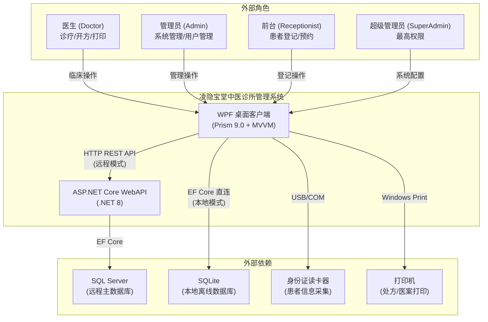
```mermaid
flowchart TB
    subgraph Actors["外部角色"]
        Doctor["医生 (Doctor)\n诊疗/开方/打印"]
        Admin["管理员 (Admin)\n系统管理/用户管理"]
        Receptionist["前台 (Receptionist)\n患者登记/预约"]
        SuperAdmin["超级管理员 (SuperAdmin)\n最高权限"]
    end

    subgraph System["凌隐宝堂中医诊所管理系统"]
        WPF["WPF 桌面客户端\n(Prism 9.0 + MVVM)"]
        API["ASP.NET Core WebAPI\n(.NET 8)"]
    end

    subgraph External["外部依赖"]
        SQLServer["SQL Server\n(远程主数据库)"]
        SQLite["SQLite\n(本地离线数据库)"]
        CardReader["身份证读卡器\n(患者信息采集)"]
        Printer["打印机\n(处方/医案打印)"]
    end

    Doctor -->|"临床操作"| WPF
    Admin -->|"管理操作"| WPF
    Receptionist -->|"登记操作"| WPF
    SuperAdmin -->|"系统配置"| WPF

    WPF -->|"HTTP REST API\n(远程模式)"| API
    WPF -->|"EF Core 直连\n(本地模式)"| SQLite
    WPF -->|"USB/COM"| CardReader
    WPF -->|"Windows Print"| Printer

    API -->|"EF Core"| SQLServer
```

**说明**:
- 四种角色通过同一个 WPF 客户端访问系统，角色决定可见模块 (Admin/Clinical 工作台)
- 远程模式和本地模式通过 `ConnectionMode` 配置切换，运行时二选一
- 身份证读卡器集成在 `LYBT.Desktop.CardReader` 模块中，用于患者信息快速录入
- 打印功能在 `LYBT.Desktop.Printing` 模块中，提供 A5 处方打印模板

---

### 1.2 深度三层架构图

比 `system-overview.md` 更详细: 列出每层所有项目，标注项目数量和依赖方向。

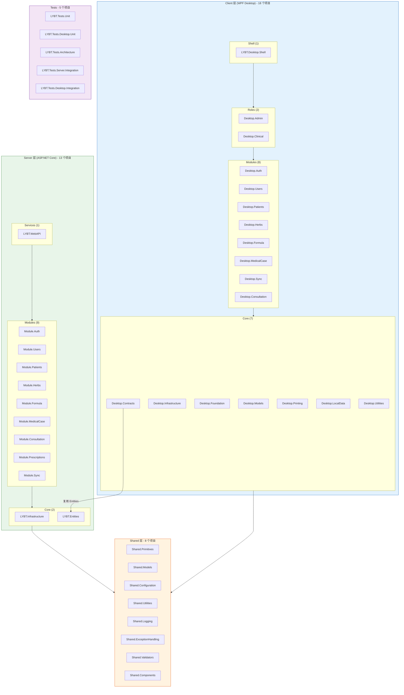
```mermaid
flowchart TB
    subgraph Client["Client 层 (WPF Desktop) - 18 个项目"]
        subgraph Shell_Layer["Shell (1)"]
            Shell["LYBT.Desktop.Shell"]
        end
        subgraph Role_Layer["Roles (2)"]
            RAdmin["Desktop.Admin"]
            RClinical["Desktop.Clinical"]
        end
        subgraph Module_Layer["Modules (8)"]
            MAuth["Desktop.Auth"]
            MUsers["Desktop.Users"]
            MPatients["Desktop.Patients"]
            MHerbs["Desktop.Herbs"]
            MFormula["Desktop.Formula"]
            MMC["Desktop.MedicalCase"]
            MSync["Desktop.Sync"]
            MConsultation["Desktop.Consultation"]
        end
        subgraph Core_Layer["Core (7)"]
            Models["Desktop.Models"]
            Infra_C["Desktop.Infrastructure"]
            Foundation["Desktop.Foundation"]
            Contracts["Desktop.Contracts"]
            Printing["Desktop.Printing"]
            LocalData["Desktop.LocalData"]
            Utilities["Desktop.Utilities"]
        end
    end

    subgraph Shared["Shared 层 - 8 个项目"]
        Primitives["Shared.Primitives"]
        SModels["Shared.Models"]
        SConfig["Shared.Configuration"]
        SUtils["Shared.Utilities"]
        SLog["Shared.Logging"]
        SExc["Shared.ExceptionHandling"]
        SVal["Shared.Validators"]
        SComp["Shared.Components"]
    end

    subgraph Server["Server 层 (ASP.NET Core) - 13 个项目"]
        subgraph Service_Layer["Services (1)"]
            WebAPI["LYBT.WebAPI"]
        end
        subgraph Server_Modules["Modules (9)"]
            SAuth["Module.Auth"]
            SUsers["Module.Users"]
            SPatients["Module.Patients"]
            SHerbs["Module.Herbs"]
            SFormula["Module.Formula"]
            SMC["Module.MedicalCase"]
            SConsult["Module.Consultation"]
            SPresc["Module.Prescriptions"]
            SSync["Module.Sync"]
        end
        subgraph Server_Core["Core (2)"]
            Infra_S["LYBT.Infrastructure"]
            Entities["LYBT.Entities"]
        end
    end

    subgraph Tests["Tests - 5 个项目"]
        TUnit["LYBT.Tests.Unit"]
        TDesktopUnit["LYBT.Tests.Desktop.Unit"]
        TArch["LYBT.Tests.Architecture"]
        TServerInt["LYBT.Tests.Server.Integration"]
        TDesktopInt["LYBT.Tests.Desktop.Integration"]
    end

    Shell_Layer --> Role_Layer --> Module_Layer --> Core_Layer
    Core_Layer --> Shared
    Service_Layer --> Server_Modules --> Server_Core
    Server_Core --> Shared
    Contracts -->|"复用 Entities"| Entities

    style Client fill:#e3f2fd,stroke:#1565c0
    style Shared fill:#fff3e0,stroke:#e65100
    style Server fill:#e8f5e9,stroke:#2e7d32
    style Tests fill:#f3e5f5,stroke:#6a1b9a
```

**说明**:
- 系统总计 **44 个项目** (Client 18 + Shared 8 + Server 13 + Tests 5)
- Client 和 Server 之间只通过 HTTP API 通信，但 `Desktop.Contracts` 复用 Server 端的 `Entities` 实体定义
- Shared 层被两端共同引用，提供 DTO、验证器、工具类等

---

## Section 2: 项目依赖图

### 2.1 Server 层依赖图

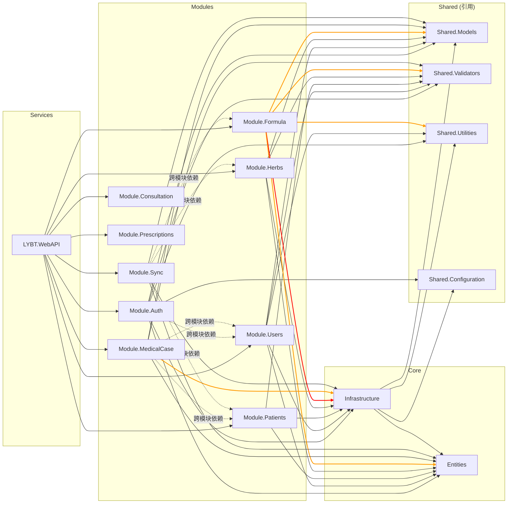
```mermaid
flowchart LR
    subgraph WebAPI["Services"]
        API["LYBT.WebAPI"]
    end

    subgraph Modules["Modules"]
        Auth["Module.Auth"]
        Users["Module.Users"]
        Patients["Module.Patients"]
        Herbs["Module.Herbs"]
        Formula["Module.Formula"]
        MC["Module.MedicalCase"]
        Consult["Module.Consultation"]
        Presc["Module.Prescriptions"]
        Sync["Module.Sync"]
    end

    subgraph Core["Core"]
        Infra["Infrastructure"]
        Ent["Entities"]
    end

    subgraph SharedRefs["Shared (引用)"]
        SM["Shared.Models"]
        SV["Shared.Validators"]
        SU["Shared.Utilities"]
        SC["Shared.Configuration"]
    end

    API --> Auth & Users & Patients & Herbs & Formula & MC & Consult & Presc & Sync

    Auth --> Infra & Ent & SM & SV & SU & SC
    Users --> Infra & Ent & SM & SV & SU
    Patients --> Infra & Ent & SV
    Herbs --> Infra & Ent & SM & SV
    Formula --> Infra & Ent & SM & SU & SV
    MC --> Infra & Ent & SM & SV
    Sync --> Infra & Ent & SM

    Infra --> Ent & SM & SU & SC

    Auth -.->|"跨模块依赖"| Users
    MC -.->|"跨模块依赖"| Patients
    MC -.->|"跨模块依赖"| Users
    Sync -.->|"跨模块依赖"| Herbs
    Sync -.->|"跨模块依赖"| Patients
    Sync -.->|"跨模块依赖"| Formula

    linkStyle 27 stroke:#ff0000,stroke-width:2px
    linkStyle 28 stroke:#ff9800,stroke-width:2px
    linkStyle 29 stroke:#ff9800,stroke-width:2px
    linkStyle 30 stroke:#ff9800,stroke-width:2px
    linkStyle 31 stroke:#ff9800,stroke-width:2px
    linkStyle 32 stroke:#ff9800,stroke-width:2px
```

**说明**:
- **红色线 (Auth -> Users)**: 直接项目引用 `IUserRepository`/`IUserService`，违反模块隔离原则。`system-overview.md` 规定"Module 之间禁止直接依赖，跨模块通过 `ICrossModuleService` 通信"
- **橙色线 (MC -> Patients/Users, Sync -> Herbs/Patients/Formula)**: 跨模块依赖，MedicalCase 和 Sync 模块因业务需要引用其他模块
- Formula 模块已成功解耦 (注释中标注"跨模块引用已移除 Herbs")

---

### 2.2 Client 层依赖图

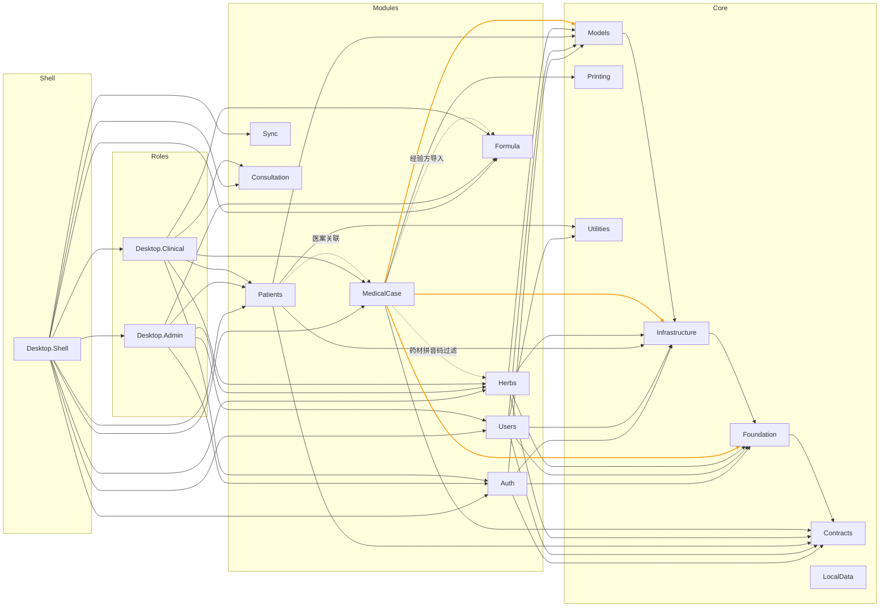
```mermaid
flowchart LR
    subgraph Shell_G["Shell"]
        Shell["Desktop.Shell"]
    end

    subgraph Roles_G["Roles"]
        Admin["Desktop.Admin"]
        Clinical["Desktop.Clinical"]
    end

    subgraph Mods["Modules"]
        MAuth["Auth"]
        MUsers["Users"]
        MPatients["Patients"]
        MHerbs["Herbs"]
        MFormula["Formula"]
        MMC["MedicalCase"]
        MSync["Sync"]
        MConsult["Consultation"]
    end

    subgraph Core_G["Core"]
        Models["Models"]
        Infra["Infrastructure"]
        Found["Foundation"]
        Contracts["Contracts"]
        Print["Printing"]
        Local["LocalData"]
        Utils["Utilities"]
    end

    Shell --> Admin & Clinical & MAuth & MUsers & MPatients & MHerbs & MFormula & MMC & MSync & MConsult

    Admin --> MAuth & MUsers & MPatients & MHerbs & MFormula
    Clinical --> MAuth & MPatients & MMC & MConsult & MHerbs & MFormula

    MAuth --> Found & Infra & Models & Contracts
    MUsers --> Found & Infra & Models & Contracts & Utils
    MPatients --> Infra & Models & Contracts & Utils
    MHerbs --> Found & Infra & Models & Contracts
    MMC --> Found & Infra & Models & Contracts & Print

    Models --> Infra
    Infra --> Found
    Found --> Contracts

    MMC -.->|"药材拼音码过滤"| MHerbs
    MMC -.->|"经验方导入"| MFormula
    MPatients -.->|"医案关联"| MMC

    linkStyle 38 stroke:#ff9800,stroke-width:2px
    linkStyle 39 stroke:#ff9800,stroke-width:2px
    linkStyle 40 stroke:#ff9800,stroke-width:2px
```

**说明**:
- Core 层依赖链: `Models -> Infrastructure -> Foundation -> Contracts` (单向)
- **ViewModel 基类分裂**: `CoreViewModelBase` 在 `Desktop.Models` 中，`MasterDetailViewModelBase` 在 `Desktop.Infrastructure` 中，两者都继承 `ObservableObject` 但无共同基类
- **橙色线**: 模块间功能聚合依赖 (MedicalCase 需要 Herbs 的拼音码过滤和 Formula 的导入功能)

---

### 2.3 Shared 层依赖图

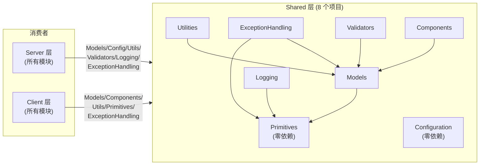
```mermaid
flowchart LR
    subgraph Shared["Shared 层 (8 个项目)"]
        Prim["Primitives\n(零依赖)"]
        Conf["Configuration\n(零依赖)"]
        SMod["Models"]
        SUtil["Utilities"]
        SLog["Logging"]
        SExc["ExceptionHandling"]
        SVal["Validators"]
        SComp["Components"]
    end

    SMod --> Prim
    SUtil --> SMod
    SLog --> Prim
    SExc --> SMod & Prim
    SVal --> SMod
    SComp --> SMod

    subgraph Consumers["消费者"]
        S["Server 层\n(所有模块)"]
        C["Client 层\n(所有模块)"]
    end

    S -->|"Models/Config/Utils/\nValidators/Logging/\nExceptionHandling"| Shared
    C -->|"Models/Components/\nUtils/Primitives/\nExceptionHandling"| Shared
```

**说明**:
- `Primitives` 和 `Configuration` 是零依赖的底层项目
- `Models` 是最核心的共享项目，被 5 个 Shared 子项目和两端所有模块引用
- `Components` 包含 UI 相关共享组件 (如 `IHerbItem`/`IHerbItemEditable` 接口)，仅被 Client 端使用
- `Logging` 仅被 Server 端 `Infrastructure` 和 Client 端 `Infrastructure` 引用

---

## Section 3: 领域模型

### 3.1 核心实体关系图

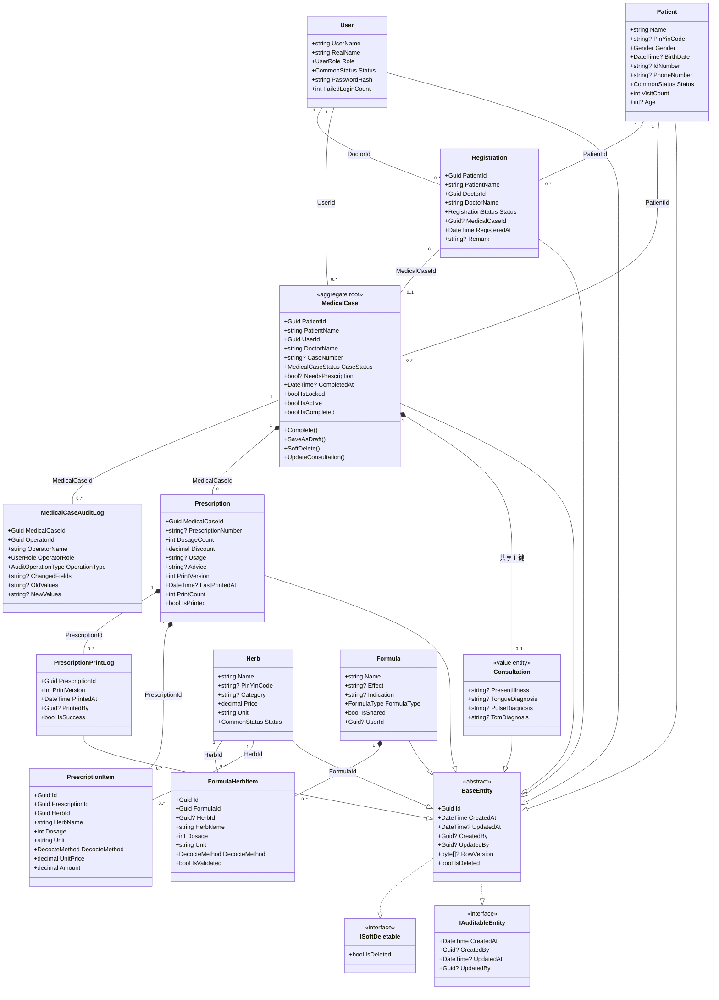
```mermaid
classDiagram
    class BaseEntity {
        <<abstract>>
        +Guid Id
        +DateTime CreatedAt
        +DateTime? UpdatedAt
        +Guid? CreatedBy
        +Guid? UpdatedBy
        +byte[]? RowVersion
        +bool IsDeleted
    }

    class IAuditableEntity {
        <<interface>>
        +DateTime CreatedAt
        +Guid? CreatedBy
        +DateTime? UpdatedAt
        +Guid? UpdatedBy
    }

    class ISoftDeletable {
        <<interface>>
        +bool IsDeleted
    }

    class MedicalCase {
        <<aggregate root>>
        +Guid PatientId
        +string PatientName
        +Guid UserId
        +string DoctorName
        +string? CaseNumber
        +MedicalCaseStatus CaseStatus
        +bool? NeedsPrescription
        +DateTime? CompletedAt
        +bool IsLocked
        +bool IsActive
        +bool IsCompleted
        +Complete()
        +SaveAsDraft()
        +SoftDelete()
        +UpdateConsultation()
    }

    class Consultation {
        <<value entity>>
        +string? PresentIllness
        +string? TongueDiagnosis
        +string? PulseDiagnosis
        +string? TcmDiagnosis
    }

    class Prescription {
        +Guid MedicalCaseId
        +string? PrescriptionNumber
        +int DosageCount
        +decimal Discount
        +string? Usage
        +string? Advice
        +int PrintVersion
        +DateTime? LastPrintedAt
        +int PrintCount
        +bool IsPrinted
    }

    class PrescriptionItem {
        +Guid Id
        +Guid PrescriptionId
        +Guid HerbId
        +string HerbName
        +int Dosage
        +string Unit
        +DecocteMethod DecocteMethod
        +decimal UnitPrice
        +decimal Amount
    }

    class PrescriptionPrintLog {
        +Guid PrescriptionId
        +int PrintVersion
        +DateTime PrintedAt
        +Guid? PrintedBy
        +bool IsSuccess
    }

    class Patient {
        +string Name
        +string? PinYinCode
        +Gender Gender
        +DateTime? BirthDate
        +string? IdNumber
        +string? PhoneNumber
        +CommonStatus Status
        +int VisitCount
        +int? Age
    }

    class User {
        +string UserName
        +string RealName
        +UserRole Role
        +CommonStatus Status
        +string PasswordHash
        +int FailedLoginCount
    }

    class Herb {
        +string Name
        +string? PinYinCode
        +string? Category
        +decimal Price
        +string Unit
        +CommonStatus Status
    }

    class Formula {
        +string Name
        +string? Effect
        +string? Indication
        +FormulaType FormulaType
        +bool IsShared
        +Guid? UserId
    }

    class FormulaHerbItem {
        +Guid Id
        +Guid FormulaId
        +Guid? HerbId
        +string HerbName
        +int Dosage
        +string Unit
        +DecocteMethod DecocteMethod
        +bool IsValidated
    }

    class Registration {
        +Guid PatientId
        +string PatientName
        +Guid DoctorId
        +string DoctorName
        +RegistrationStatus Status
        +Guid? MedicalCaseId
        +DateTime RegisteredAt
        +string? Remark
    }

    class MedicalCaseAuditLog {
        +Guid MedicalCaseId
        +Guid OperatorId
        +string OperatorName
        +UserRole OperatorRole
        +AuditOperationType OperationType
        +string? ChangedFields
        +string? OldValues
        +string? NewValues
    }

    BaseEntity ..|> IAuditableEntity
    BaseEntity ..|> ISoftDeletable
    MedicalCase --|> BaseEntity
    Consultation --|> BaseEntity
    Prescription --|> BaseEntity
    PrescriptionPrintLog --|> BaseEntity
    Patient --|> BaseEntity
    User --|> BaseEntity
    Herb --|> BaseEntity
    Registration --|> BaseEntity
    Formula --|> BaseEntity

    MedicalCase "1" *-- "0..1" Consultation : 共享主键
    MedicalCase "1" *-- "0..1" Prescription : MedicalCaseId
    Prescription "1" *-- "0..*" PrescriptionItem : PrescriptionId
    Prescription "1" *-- "0..*" PrescriptionPrintLog : PrescriptionId

    Patient "1" -- "0..*" MedicalCase : PatientId
    Patient "1" -- "0..*" Registration : PatientId
    User "1" -- "0..*" MedicalCase : UserId
    User "1" -- "0..*" Registration : DoctorId
    Registration "0..1" -- "0..1" MedicalCase : MedicalCaseId
    MedicalCase "1" -- "0..*" MedicalCaseAuditLog : MedicalCaseId

    Formula "1" *-- "0..*" FormulaHerbItem : FormulaId
    Herb "1" -- "0..*" PrescriptionItem : HerbId
    Herb "1" -- "0..*" FormulaHerbItem : HerbId
```

**说明**:
- **MedicalCase 是唯一的 DDD 聚合根**，Consultation 和 Prescription 是内部实体
- Consultation 与 MedicalCase 共享主键 (1:1)，Prescription 通过外键关联 (1:0..1)
- Patient 和 User 通过 ID 弱引用 MedicalCase (跨聚合引用)，MedicalCase 冗余存储 `PatientName`/`DoctorName` 用于读优化
- `PrescriptionItem` 和 `FormulaHerbItem` 不继承 `BaseEntity`，是轻量级值对象

---

### 3.2 认证实体模型

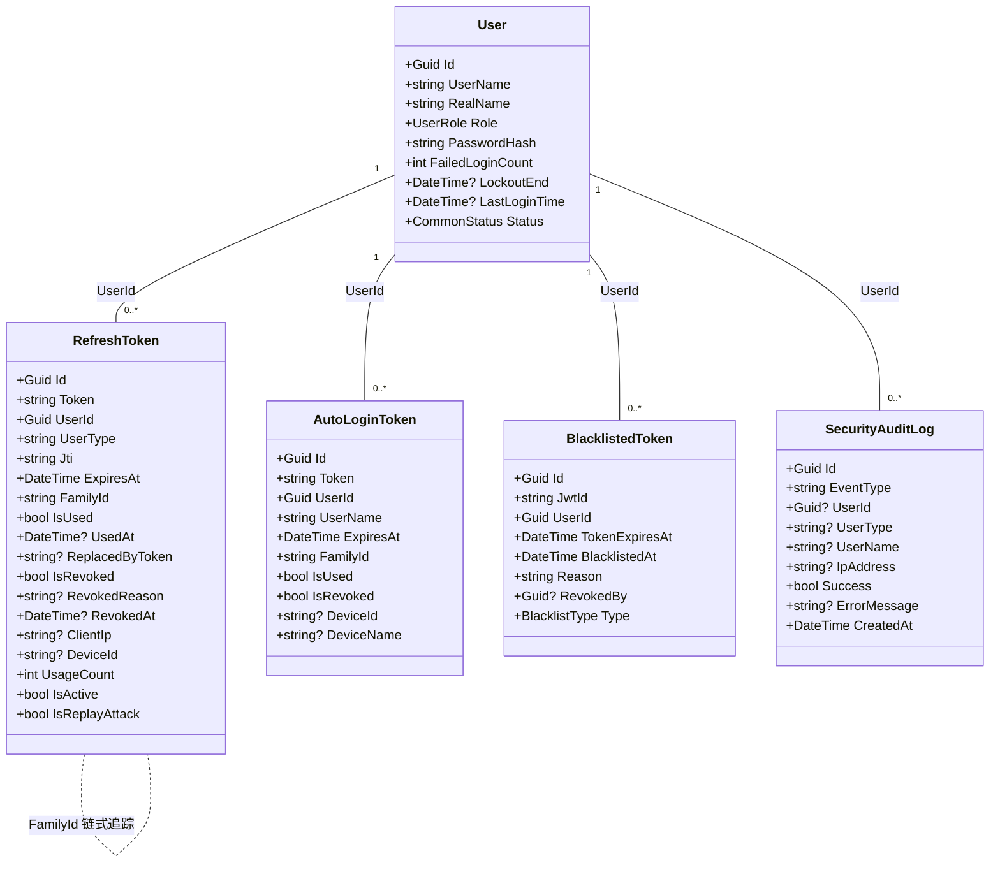
```mermaid
classDiagram
    class User {
        +Guid Id
        +string UserName
        +string RealName
        +UserRole Role
        +string PasswordHash
        +int FailedLoginCount
        +DateTime? LockoutEnd
        +DateTime? LastLoginTime
        +CommonStatus Status
    }

    class RefreshToken {
        +Guid Id
        +string Token
        +Guid UserId
        +string UserType
        +string Jti
        +DateTime ExpiresAt
        +string FamilyId
        +bool IsUsed
        +DateTime? UsedAt
        +string? ReplacedByToken
        +bool IsRevoked
        +string? RevokedReason
        +DateTime? RevokedAt
        +string? ClientIp
        +string? DeviceId
        +int UsageCount
        +bool IsActive
        +bool IsReplayAttack
    }

    class AutoLoginToken {
        +Guid Id
        +string Token
        +Guid UserId
        +string UserName
        +DateTime ExpiresAt
        +string FamilyId
        +bool IsUsed
        +bool IsRevoked
        +string? DeviceId
        +string? DeviceName
    }

    class BlacklistedToken {
        +Guid Id
        +string JwtId
        +Guid UserId
        +DateTime TokenExpiresAt
        +DateTime BlacklistedAt
        +string Reason
        +Guid? RevokedBy
        +BlacklistType Type
    }

    class SecurityAuditLog {
        +Guid Id
        +string EventType
        +Guid? UserId
        +string? UserType
        +string? UserName
        +string? IpAddress
        +bool Success
        +string? ErrorMessage
        +DateTime CreatedAt
    }

    User "1" -- "0..*" RefreshToken : UserId
    User "1" -- "0..*" AutoLoginToken : UserId
    User "1" -- "0..*" BlacklistedToken : UserId
    User "1" -- "0..*" SecurityAuditLog : UserId

    RefreshToken .. RefreshToken : FamilyId 链式追踪
```

**说明**:
- **FamilyId 机制**: 同一次登录产生的所有 RefreshToken 共享相同的 FamilyId，用于重放攻击检测
- `IsReplayAttack` 是计算属性: 当 `IsUsed == true` 时表示该 Token 已被轮换使用，再次使用即为重放攻击
- BlacklistedToken 支持 6 种撤销类型: UserLogout / AdminRevoked / PasswordChanged / AccountLocked / SecurityThreat / SessionTimeout
- SecurityAuditLog 对 IP 地址和 UserAgent 进行脱敏处理

---

### 3.3 药材项接口体系

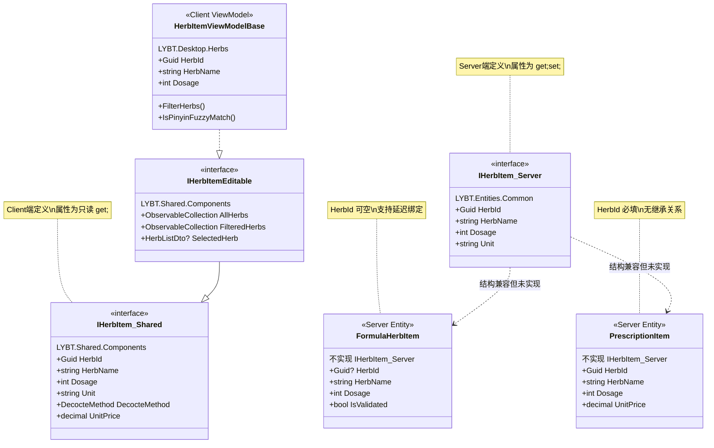
```mermaid
classDiagram
    class IHerbItem_Server {
        <<interface>>
        LYBT.Entities.Common
        +Guid HerbId
        +string HerbName
        +int Dosage
        +string Unit
    }

    class IHerbItem_Shared {
        <<interface>>
        LYBT.Shared.Components
        +Guid HerbId
        +string HerbName
        +int Dosage
        +string Unit
        +DecocteMethod DecocteMethod
        +decimal UnitPrice
    }

    class IHerbItemEditable {
        <<interface>>
        LYBT.Shared.Components
        +ObservableCollection AllHerbs
        +ObservableCollection FilteredHerbs
        +HerbListDto? SelectedHerb
    }

    class FormulaHerbItem {
        <<Server Entity>>
        不实现 IHerbItem_Server
        +Guid? HerbId
        +string HerbName
        +int Dosage
        +bool IsValidated
    }

    class PrescriptionItem {
        <<Server Entity>>
        不实现 IHerbItem_Server
        +Guid HerbId
        +string HerbName
        +int Dosage
        +decimal UnitPrice
    }

    class HerbItemViewModelBase {
        <<Client ViewModel>>
        LYBT.Desktop.Herbs
        +Guid HerbId
        +string HerbName
        +int Dosage
        +FilterHerbs()
        +IsPinyinFuzzyMatch()
    }

    IHerbItemEditable --|> IHerbItem_Shared
    HerbItemViewModelBase ..|> IHerbItemEditable

    IHerbItem_Server ..> FormulaHerbItem : 结构兼容但未实现
    IHerbItem_Server ..> PrescriptionItem : 结构兼容但未实现

    note for IHerbItem_Server "Server端定义\n属性为 get;set;"
    note for IHerbItem_Shared "Client端定义\n属性为只读 get;"
    note for FormulaHerbItem "HerbId 可空\n支持延迟绑定"
    note for PrescriptionItem "HerbId 必填\n无继承关系"
```

**设计问题暴露**:
- 存在**两个同名但不同的 `IHerbItem` 接口**: Server 端 (`LYBT.Entities.Common`) 和 Client 端 (`LYBT.Shared.Components`)，属性签名不同 (get;set; vs get;)
- `FormulaHerbItem` 和 `PrescriptionItem` 都具有 IHerbItem 的结构特征，但**都未实现该接口**
- `FormulaHerbItem.HerbId` 可空 (支持延迟绑定)，而 `PrescriptionItem.HerbId` 必填，这是两者不统一的根本原因
- Client 端通过 `HerbItemViewModelBase` 实现了 `IHerbItemEditable` (继承自 `IHerbItem`)，但仅用于 UI 层

---

## Section 4: 状态机

### 4.1 医案生命周期

```mermaid
stateDiagram-v2
    [*] --> Draft : 创建医案\n(Doctor.SaveAsDraft)

    Draft --> Active : 继续看诊\n(UpdateStatus)
    Active --> Draft : 暂存\n(SaveDraft)
    Active --> Completed : 完成诊疗\n(CompleteAsync)

    state Draft {
        [*] --> draft_idle
        note right of draft_idle
            可随时编辑
            不受跨日限制
            可删除/取消
        end note
    }

    state Active {
        [*] --> active_idle
        note right of active_idle
            可随时编辑
            不受跨日限制
            三步流程进行中
        end note
    }

    state Completed {
        [*] --> check_date
        check_date --> Editable : CompletedAt.Date == Today
        check_date --> Locked : CompletedAt.Date < Today

        state Editable {
            note right of Editable
                当天完成
                创建者/Admin可编辑
            end note
        }

        state Locked {
            note right of Locked
                跨日锁定
                仅Admin可编辑
                修改需提供原因
            end note
        }
    }

    Draft --> [*] : 取消/删除\n(SoftDelete)
    Active --> [*] : 取消/删除\n(SoftDelete)
```

**业务规则**:
- **单患者单活跃医案**: `CanCreateNewCase` 检查患者是否已有 Draft 或 Active 状态的医案
- **完成前验证**: `CompleteAsync` 检查 `NeedsPrescription` 为 true 时必须存在 Prescription
- **锁定计算**: `IsLocked = IsCompleted && (CompletedAt ?? CreatedAt).Date < DateTime.Today`
- **软删除**: 取消操作使用 `IsDeleted = true`，不是状态转换

---

### 4.2 权限决策树

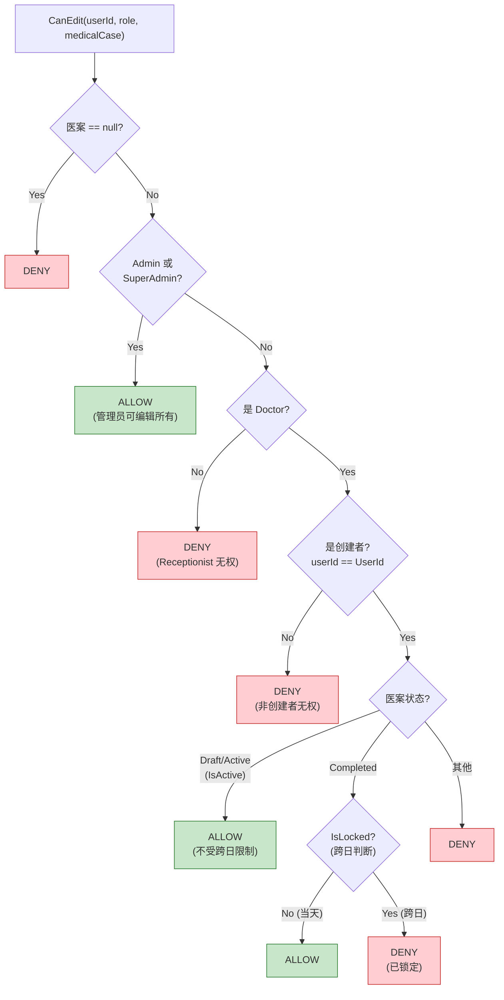
```mermaid
flowchart TD
    Start["CanEdit(userId, role, medicalCase)"] --> NullCheck{"医案 == null?"}
    NullCheck -->|"Yes"| Deny1["DENY"]

    NullCheck -->|"No"| AdminCheck{"Admin 或\nSuperAdmin?"}
    AdminCheck -->|"Yes"| Allow1["ALLOW\n(管理员可编辑所有)"]

    AdminCheck -->|"No"| DoctorCheck{"是 Doctor?"}
    DoctorCheck -->|"No"| Deny2["DENY\n(Receptionist 无权)"]

    DoctorCheck -->|"Yes"| OwnerCheck{"是创建者?\nuserId == UserId"}
    OwnerCheck -->|"No"| Deny3["DENY\n(非创建者无权)"]

    OwnerCheck -->|"Yes"| StatusCheck{"医案状态?"}
    StatusCheck -->|"Draft/Active\n(IsActive)"| Allow2["ALLOW\n(不受跨日限制)"]

    StatusCheck -->|"Completed"| LockCheck{"IsLocked?\n(跨日判断)"}
    LockCheck -->|"No (当天)"| Allow3["ALLOW"]
    LockCheck -->|"Yes (跨日)"| Deny4["DENY\n(已锁定)"]

    StatusCheck -->|"其他"| Deny5["DENY"]

    style Allow1 fill:#c8e6c9,stroke:#2e7d32
    style Allow2 fill:#c8e6c9,stroke:#2e7d32
    style Allow3 fill:#c8e6c9,stroke:#2e7d32
    style Deny1 fill:#ffcdd2,stroke:#c62828
    style Deny2 fill:#ffcdd2,stroke:#c62828
    style Deny3 fill:#ffcdd2,stroke:#c62828
    style Deny4 fill:#ffcdd2,stroke:#c62828
    style Deny5 fill:#ffcdd2,stroke:#c62828
```

**权限矩阵总结**:

| 角色 | Draft | Active | Completed (当天) | Completed (跨日) |
|------|-------|--------|------------------|------------------|
| SuperAdmin | ALLOW | ALLOW | ALLOW | ALLOW (需原因) |
| Admin | ALLOW | ALLOW | ALLOW | ALLOW (需原因) |
| Doctor (创建者) | ALLOW | ALLOW | ALLOW | DENY |
| Doctor (非创建者) | DENY | DENY | DENY | DENY |
| Receptionist | DENY | DENY | DENY | DENY |

**特殊规则**: `CanCreate` -- 仅 Doctor 可创建医案，Admin/SuperAdmin 不能创建

---

### 4.3 Token 生命周期

```mermaid
stateDiagram-v2
    state "RefreshToken 生命周期" as RT {
        [*] --> Active_RT : 登录成功\n生成新 FamilyId

        Active_RT --> Used : 正常刷新\n(Token 轮换)
        Used --> NewActive : 生成新 Token\n继承 FamilyId

        Active_RT --> Revoked_RT : 用户登出
        Active_RT --> Revoked_RT : 管理员撤销
        Active_RT --> Expired_RT : 超过 7 天

        Used --> FamilyRevoked : 重放攻击检测\n(IsUsed == true 再次使用)
        FamilyRevoked --> AllRevoked : 撤销整个 FamilyId\n所有关联 Token 失效

        state Active_RT {
            note right of Active_RT
                IsUsed = false
                IsRevoked = false
                ExpiresAt > Now
            end note
        }
    }

    state "AutoLoginToken 生命周期" as ALT {
        [*] --> Active_ALT : RememberMe = true\n生成新 FamilyId

        Active_ALT --> Used_ALT : 自动登录成功\n(Token 轮换)
        Used_ALT --> NewActive_ALT : 生成新 Token\n继承 FamilyId

        Active_ALT --> Revoked_ALT : 用户登出/撤销
        Active_ALT --> Expired_ALT : 超过 30 天

        Used_ALT --> FamilyRevoked_ALT : 重放攻击检测
    }
```

**Token 轮换流程**:
1. 客户端使用 RefreshToken T1 请求刷新
2. 服务端验证 T1 有效 -> 标记 T1 为 `IsUsed = true`
3. 生成新 Token T2，继承 T1 的 `FamilyId`
4. 返回 T2 给客户端，客户端替换本地存储
5. 若攻击者再次使用 T1 -> 检测到 `IsUsed == true` -> 重放攻击 -> 撤销整个 Family

---

## Section 5: 业务流程

### 5.1 临床工作流 (简化版)

详细时序图见 `docs/01-product/06-clinical-workflow.md` (v2.0)。本图提供简化的端到端流程概览。

> **v2.0 更新**: clinical-workflow.md 已深化补充: Section 六 (异常路径: BR-001 碰撞/BR-002 离开/并发冲突), Section 七 (子流程: 验方导入含重复药材合并/打印保护/编辑模式切换), Section 八 (跨模块联动: 药材禁用/患者禁用)。新增 Registration 独立挂号模块。

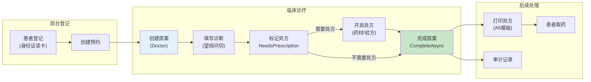
```mermaid
flowchart LR
    subgraph Reception["前台登记"]
        R1["患者登记\n(身份证读卡)"]
        R2["创建预约"]
    end

    subgraph Clinical["临床诊疗"]
        C1["创建医案\n(Doctor)"]
        C2["填写诊断\n(望闻问切)"]
        C3["标记处方\nNeedsPrescription"]
        C4["开具处方\n(药材/验方)"]
        C5["完成医案\nCompleteAsync"]
    end

    subgraph PostCare["后续处理"]
        P1["打印处方\n(A5模板)"]
        P2["患者取药"]
        P3["审计记录"]
    end

    R1 --> R2 --> C1
    C1 --> C2 --> C3
    C3 -->|"需要处方"| C4 --> C5
    C3 -->|"不需要处方"| C5
    C5 --> P1 --> P2
    C5 --> P3

    style C1 fill:#e3f2fd
    style C5 fill:#c8e6c9
```

---

### 5.2 认证流程时序图

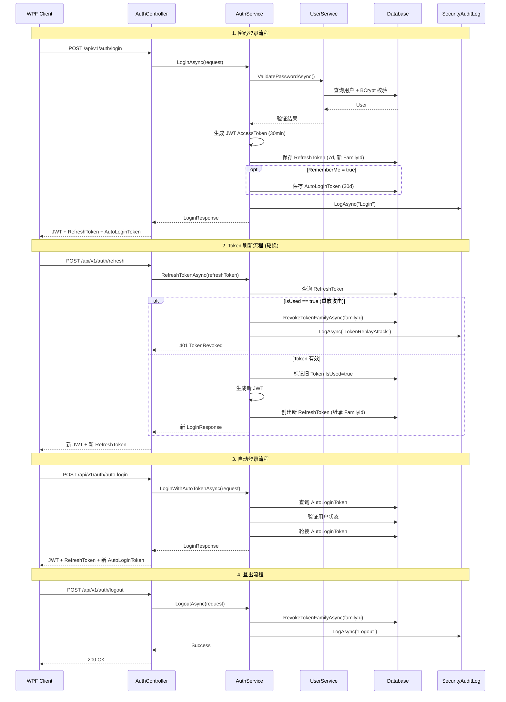
```mermaid
sequenceDiagram
    participant C as WPF Client
    participant AC as AuthController
    participant AS as AuthService
    participant US as UserService
    participant DB as Database
    participant SAL as SecurityAuditLog

    Note over C,SAL: 1. 密码登录流程
    C->>AC: POST /api/v1/auth/login
    AC->>AS: LoginAsync(request)
    AS->>US: ValidatePasswordAsync()
    US->>DB: 查询用户 + BCrypt 校验
    DB-->>US: User
    US-->>AS: 验证结果
    AS->>AS: 生成 JWT AccessToken (30min)
    AS->>DB: 保存 RefreshToken (7d, 新 FamilyId)
    opt RememberMe = true
        AS->>DB: 保存 AutoLoginToken (30d)
    end
    AS->>SAL: LogAsync("Login")
    AS-->>AC: LoginResponse
    AC-->>C: JWT + RefreshToken + AutoLoginToken

    Note over C,SAL: 2. Token 刷新流程 (轮换)
    C->>AC: POST /api/v1/auth/refresh
    AC->>AS: RefreshTokenAsync(refreshToken)
    AS->>DB: 查询 RefreshToken
    alt IsUsed == true (重放攻击)
        AS->>DB: RevokeTokenFamilyAsync(familyId)
        AS->>SAL: LogAsync("TokenReplayAttack")
        AS-->>AC: 401 TokenRevoked
    else Token 有效
        AS->>DB: 标记旧 Token IsUsed=true
        AS->>AS: 生成新 JWT
        AS->>DB: 创建新 RefreshToken (继承 FamilyId)
        AS-->>AC: 新 LoginResponse
    end
    AC-->>C: 新 JWT + 新 RefreshToken

    Note over C,SAL: 3. 自动登录流程
    C->>AC: POST /api/v1/auth/auto-login
    AC->>AS: LoginWithAutoTokenAsync(request)
    AS->>DB: 查询 AutoLoginToken
    AS->>DB: 验证用户状态
    AS->>DB: 轮换 AutoLoginToken
    AS-->>AC: LoginResponse
    AC-->>C: JWT + RefreshToken + 新 AutoLoginToken

    Note over C,SAL: 4. 登出流程
    C->>AC: POST /api/v1/auth/logout
    AC->>AS: LogoutAsync(request)
    AS->>DB: RevokeTokenFamilyAsync(familyId)
    AS->>SAL: LogAsync("Logout")
    AS-->>AC: Success
    AC-->>C: 200 OK
```

---

### 5.3 医案保存流程时序图

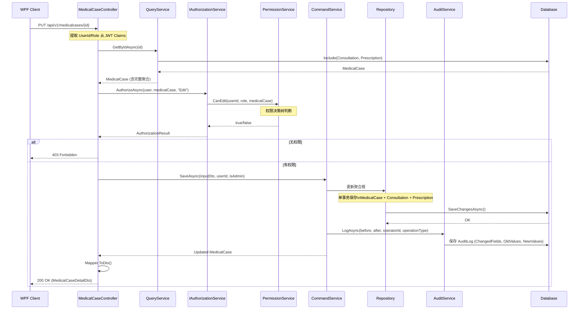
```mermaid
sequenceDiagram
    participant C as WPF Client
    participant Ctrl as MedicalCaseController
    participant QS as QueryService
    participant Auth as IAuthorizationService
    participant PS as PermissionService
    participant CS as CommandService
    participant Repo as Repository
    participant AS as AuditService
    participant DB as Database

    C->>Ctrl: PUT /api/v1/medicalcases/{id}
    Note over Ctrl: 提取 UserId/Role 从 JWT Claims

    Ctrl->>QS: GetByIdAsync(id)
    QS->>DB: Include(Consultation, Prescription)
    DB-->>QS: MedicalCase
    QS-->>Ctrl: MedicalCase (含完整聚合)

    Ctrl->>Auth: AuthorizeAsync(user, medicalCase, "Edit")
    Auth->>PS: CanEdit(userId, role, medicalCase)
    Note over PS: 权限决策树判断
    PS-->>Auth: true/false
    Auth-->>Ctrl: AuthorizationResult

    alt 无权限
        Ctrl-->>C: 403 Forbidden
    else 有权限
        Ctrl->>CS: SaveAsync(inputDto, userId, isAdmin)
        CS->>Repo: 更新聚合根
        Note over Repo: 单事务保存\nMedicalCase + Consultation + Prescription
        Repo->>DB: SaveChangesAsync()
        DB-->>Repo: OK

        CS->>AS: LogAsync(before, after, operatorId, operationType)
        AS->>DB: 保存 AuditLog (ChangedFields, OldValues, NewValues)

        CS-->>Ctrl: Updated MedicalCase
        Ctrl->>Ctrl: Mapper.ToDto()
        Ctrl-->>C: 200 OK (MedicalCaseDetailDto)
    end
```

**说明**:
- **双次数据库读取问题**: QueryService.GetByIdAsync (用于鉴权) 和 CommandService.SaveAsync (内部可能再次读取)，存在优化空间
- 聚合根保存使用单事务: MedicalCase + Consultation + Prescription + PrescriptionItems 一次性提交
- AuditService 记录变更前后的差异 (ChangedFields/OldValues/NewValues JSON)

---

### 5.4 数据同步流程时序图

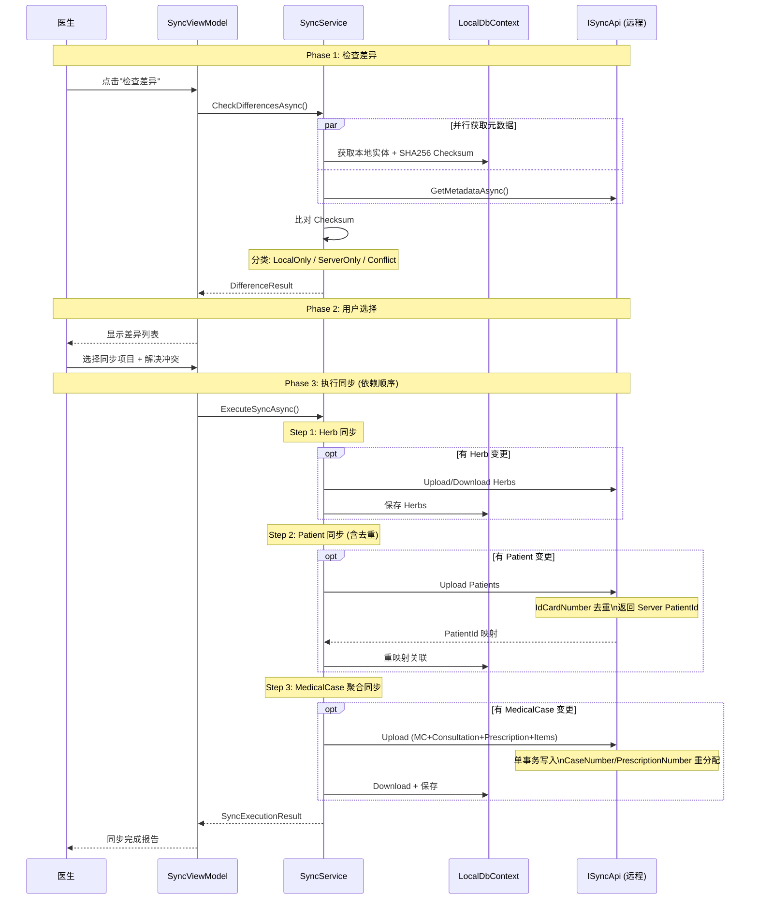
```mermaid
sequenceDiagram
    participant User as 医生
    participant VM as SyncViewModel
    participant Sync as SyncService
    participant Local as LocalDbContext
    participant API as ISyncApi (远程)

    Note over User,API: Phase 1: 检查差异
    User->>VM: 点击"检查差异"
    VM->>Sync: CheckDifferencesAsync()

    par 并行获取元数据
        Sync->>Local: 获取本地实体 + SHA256 Checksum
    and
        Sync->>API: GetMetadataAsync()
    end

    Sync->>Sync: 比对 Checksum
    Note over Sync: 分类: LocalOnly / ServerOnly / Conflict
    Sync-->>VM: DifferenceResult

    Note over User,API: Phase 2: 用户选择
    VM-->>User: 显示差异列表
    User->>VM: 选择同步项目 + 解决冲突

    Note over User,API: Phase 3: 执行同步 (依赖顺序)
    VM->>Sync: ExecuteSyncAsync()

    Note over Sync: Step 1: Herb 同步
    opt 有 Herb 变更
        Sync->>API: Upload/Download Herbs
        Sync->>Local: 保存 Herbs
    end

    Note over Sync: Step 2: Patient 同步 (含去重)
    opt 有 Patient 变更
        Sync->>API: Upload Patients
        Note over API: IdCardNumber 去重\n返回 Server PatientId
        API-->>Sync: PatientId 映射
        Sync->>Local: 重映射关联
    end

    Note over Sync: Step 3: MedicalCase 聚合同步
    opt 有 MedicalCase 变更
        Sync->>API: Upload (MC+Consultation+Prescription+Items)
        Note over API: 单事务写入\nCaseNumber/PrescriptionNumber 重分配
        Sync->>Local: Download + 保存
    end

    Sync-->>VM: SyncExecutionResult
    VM-->>User: 同步完成报告
```

**说明**:
- **依赖顺序强制编排**: Herb -> Patient -> MedicalCase，用户无需关心
- **聚合级原子同步**: MedicalCase 整个聚合 (含 Consultation + Prescription + Items) 作为一个 JSON 对象传输
- **患者去重**: 上传时 Server 按 `IdCardNumber` 检查，已存在则返回 Server 端 PatientId
- **编号重分配**: `CaseNumber` 和 `PrescriptionNumber` 上传后由 Server 重新分配

---

## Section 6: 架构模式

### 6.1 CQRS 分解

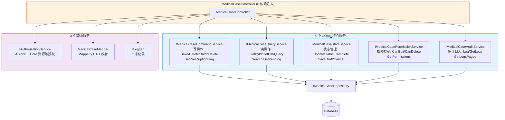
```mermaid
flowchart TB
    subgraph Controller["MedicalCaseController (8 依赖注入)"]
        MC["MedicalCaseController"]
    end

    MC --> CMD["IMedicalCaseCommandService\n写操作: Save/Delete/BatchDelete\nSetPrescriptionFlag"]
    MC --> QRY["IMedicalCaseQueryService\n读操作: GetById/GetList/Query\nSearch/GetPending"]
    MC --> STATE["IMedicalCaseStateService\n状态管理: UpdateStatus/Complete\nSaveDraft/Cancel"]
    MC --> PERM["IMedicalCasePermissionService\n权限控制: CanEdit/CanDelete\nGetPermissions"]
    MC --> AUDIT["IMedicalCaseAuditService\n审计日志: Log/GetLogs\nGetLogsPaged"]
    MC --> AUTH["IAuthorizationService\nASP.NET Core 资源级授权"]
    MC --> MAP["MedicalCaseMapper\nMapperly DTO 映射"]
    MC --> LOG["ILogger\n日志记录"]

    subgraph Services["5 个 CQRS 核心服务"]
        CMD
        QRY
        STATE
        PERM
        AUDIT
    end

    subgraph Auxiliary["3 个辅助服务"]
        AUTH
        MAP
        LOG
    end

    CMD --> REPO["IMedicalCaseRepository"]
    QRY --> REPO
    STATE --> REPO
    PERM --> REPO
    AUDIT --> REPO

    REPO --> DB[("Database")]

    style Controller fill:#fff3e0,stroke:#e65100
    style Services fill:#e3f2fd,stroke:#1565c0
    style Auxiliary fill:#f3e5f5,stroke:#6a1b9a
```

**设计问题**: Controller 承担了 8 个依赖的编排职责。CQRS 拆分虽然实现了关注点分离，但 Controller 层成为了"胖编排器"。可考虑引入 Mediator 模式进一步解耦。

---

### 6.2 ViewModel 继承层次

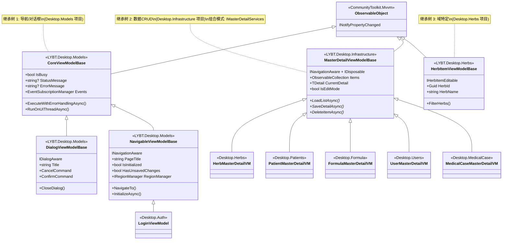
```mermaid
classDiagram
    class ObservableObject {
        <<CommunityToolkit.Mvvm>>
        INotifyPropertyChanged
    }

    class CoreViewModelBase {
        <<LYBT.Desktop.Models>>
        +bool IsBusy
        +string? StatusMessage
        +string? ErrorMessage
        +EventSubscriptionManager Events
        +ExecuteWithErrorHandlingAsync()
        +RunOnUIThreadAsync()
    }

    class DialogViewModelBase {
        <<LYBT.Desktop.Models>>
        IDialogAware
        +string Title
        +CancelCommand
        +ConfirmCommand
        +CloseDialog()
    }

    class NavigableViewModelBase {
        <<LYBT.Desktop.Models>>
        INavigationAware
        +string PageTitle
        +bool IsInitialized
        +bool HasUnsavedChanges
        +IRegionManager RegionManager
        +NavigateTo()
        +InitializeAsync()
    }

    class MasterDetailViewModelBase {
        <<LYBT.Desktop.Infrastructure>>
        INavigationAware + IDisposable
        +ObservableCollection Items
        +TDetail CurrentDetail
        +bool IsEditMode
        +LoadListAsync()*
        +SaveDetailAsync()*
        +DeleteItemAsync()*
    }

    class HerbItemViewModelBase {
        <<LYBT.Desktop.Herbs>>
        IHerbItemEditable
        +Guid HerbId
        +string HerbName
        +FilterHerbs()
    }

    class LoginViewModel {
        <<Desktop.Auth>>
    }

    class HerbMasterDetailVM {
        <<Desktop.Herbs>>
    }
    class PatientMasterDetailVM {
        <<Desktop.Patients>>
    }
    class FormulaMasterDetailVM {
        <<Desktop.Formula>>
    }
    class UserMasterDetailVM {
        <<Desktop.Users>>
    }
    class MedicalCaseMasterDetailVM {
        <<Desktop.MedicalCase>>
    }

    ObservableObject <|-- CoreViewModelBase
    CoreViewModelBase <|-- DialogViewModelBase
    CoreViewModelBase <|-- NavigableViewModelBase
    NavigableViewModelBase <|-- LoginViewModel

    ObservableObject <|-- MasterDetailViewModelBase
    MasterDetailViewModelBase <|-- HerbMasterDetailVM
    MasterDetailViewModelBase <|-- PatientMasterDetailVM
    MasterDetailViewModelBase <|-- FormulaMasterDetailVM
    MasterDetailViewModelBase <|-- UserMasterDetailVM
    MasterDetailViewModelBase <|-- MedicalCaseMasterDetailVM

    ObservableObject <|-- HerbItemViewModelBase

    note for CoreViewModelBase "继承树 1: 导航/对话框\n(Desktop.Models 项目)"
    note for MasterDetailViewModelBase "继承树 2: 数据CRUD\n(Desktop.Infrastructure 项目)\n组合模式: IMasterDetailServices"
    note for HerbItemViewModelBase "继承树 3: 域特定\n(Desktop.Herbs 项目)"
```

**设计问题暴露**:
- **两棵独立继承树**: `CoreViewModelBase` 和 `MasterDetailViewModelBase` 都继承自 `ObservableObject` 但没有共同基类
- `MasterDetailViewModelBase` 无法复用 `CoreViewModelBase` 的 `IsBusy`/`ErrorMessage`/`ExecuteWithErrorHandlingAsync` 等通用能力
- `MasterDetailViewModelBase` 通过组合模式 (`IMasterDetailServices`) 解决了部分问题，但增加了架构复杂度
- 两棵树分布在不同项目中 (Models vs Infrastructure)，合并需要解决项目依赖循环

---

### 6.3 Server 请求管道

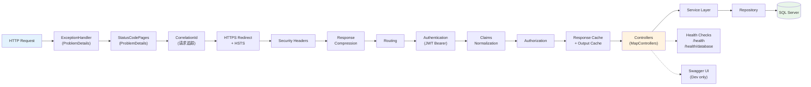
```mermaid
flowchart LR
    HTTP["HTTP Request"] --> EH["ExceptionHandler\n(ProblemDetails)"]
    EH --> SCP["StatusCodePages\n(ProblemDetails)"]
    SCP --> CID["CorrelationId\n(请求追踪)"]
    CID --> HTTPS["HTTPS Redirect\n+ HSTS"]
    HTTPS --> SEC["Security Headers"]
    SEC --> COMP["Response\nCompression"]
    COMP --> ROUTE["Routing"]
    ROUTE --> AUTHN["Authentication\n(JWT Bearer)"]
    AUTHN --> CLAIMS["Claims\nNormalization"]
    CLAIMS --> AUTHZ["Authorization"]
    AUTHZ --> CACHE["Response Cache\n+ Output Cache"]
    CACHE --> CTRL["Controllers\n(MapControllers)"]
    CTRL --> SVC["Service Layer"]
    SVC --> REPO["Repository"]
    REPO --> DB[("SQL Server")]

    CTRL -.-> HEALTH["Health Checks\n/health\n/health/database"]
    CTRL -.-> SWAGGER["Swagger UI\n(Dev only)"]

    style HTTP fill:#e3f2fd
    style DB fill:#e8f5e9
    style CTRL fill:#fff3e0
```

**管道顺序** (来自 `UnifiedMiddlewareConfiguration.cs`):
1. Exception Handler (ProblemDetails 格式)
2. Status Code Pages
3. Correlation ID (请求追踪)
4. HTTPS Redirect + HSTS (生产环境)
5. Security Headers
6. Response Compression
7. Routing
8. Authentication (JWT Bearer)
9. Claims Normalization
10. Authorization
11. Response Cache + Output Cache
12. Controllers / Health Checks / Swagger

---

### 6.4 双模式策略

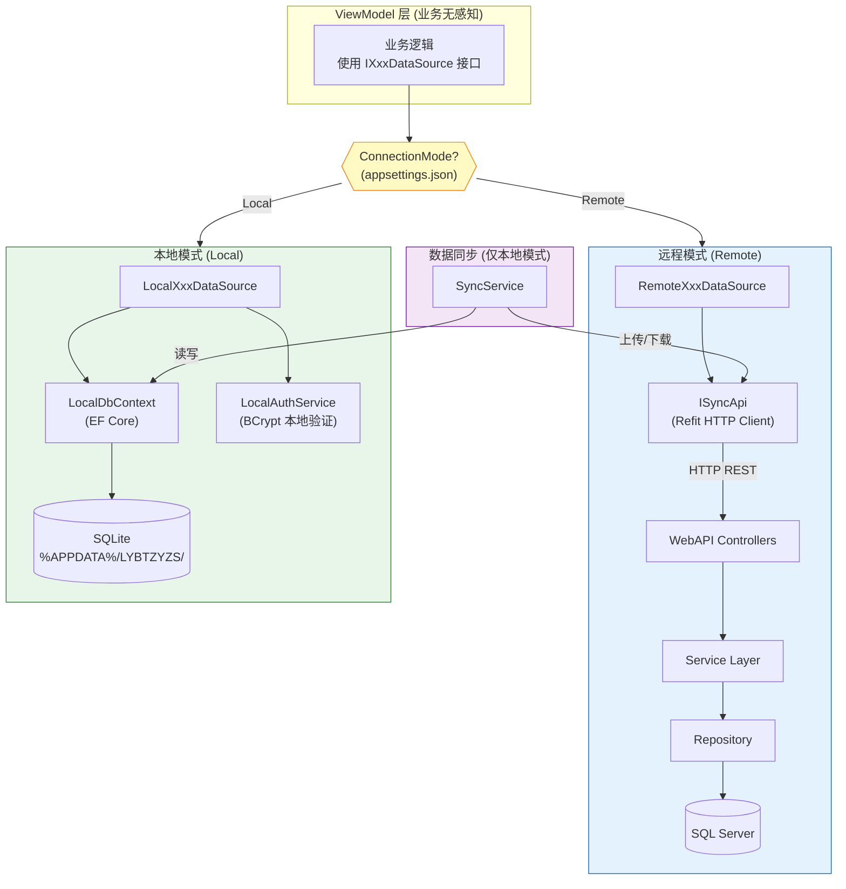
```mermaid
flowchart TB
    subgraph VM["ViewModel 层 (业务无感知)"]
        BL["业务逻辑\n使用 IXxxDataSource 接口"]
    end

    BL --> DS{{"ConnectionMode?\n(appsettings.json)"}}

    DS -->|"Remote"| Remote
    DS -->|"Local"| Local

    subgraph Remote["远程模式 (Remote)"]
        RDS["RemoteXxxDataSource"]
        Refit["ISyncApi\n(Refit HTTP Client)"]
        CTRL["WebAPI Controllers"]
        SVC["Service Layer"]
        REPO["Repository"]
        SQLSRV[("SQL Server")]

        RDS --> Refit -->|"HTTP REST"| CTRL --> SVC --> REPO --> SQLSRV
    end

    subgraph Local["本地模式 (Local)"]
        LDS["LocalXxxDataSource"]
        LDB["LocalDbContext\n(EF Core)"]
        SQLite[("SQLite\n%APPDATA%/LYBTZYZS/")]
        LAUTH["LocalAuthService\n(BCrypt 本地验证)"]

        LDS --> LDB --> SQLite
        LDS --> LAUTH
    end

    subgraph Sync["数据同步 (仅本地模式)"]
        SyncSvc["SyncService"]
        SyncSvc -->|"上传/下载"| Refit
        SyncSvc -->|"读写"| LDB
    end

    style DS fill:#fff9c4,stroke:#f57f17
    style Remote fill:#e3f2fd,stroke:#1565c0
    style Local fill:#e8f5e9,stroke:#2e7d32
    style Sync fill:#f3e5f5,stroke:#6a1b9a
```

**说明**:
- **策略模式**: DI 容器根据 `ConnectionMode` 注册不同的 `IXxxDataSource` 实现，ViewModel 层完全无感知
- **远程模式数据链路**: ViewModel -> RemoteDataSource -> Refit HTTP -> Controller -> Service -> Repository -> SQL Server
- **本地模式数据链路**: ViewModel -> LocalDataSource -> LocalDbContext -> SQLite (跳过 Server 端所有中间件)
- **设计风险**: 本地模式绕过了 Server 端的权限校验、状态机规则和审计日志 (详见 Section 8)

---

## Section 7: 脑图

### 7.1 系统模块清单

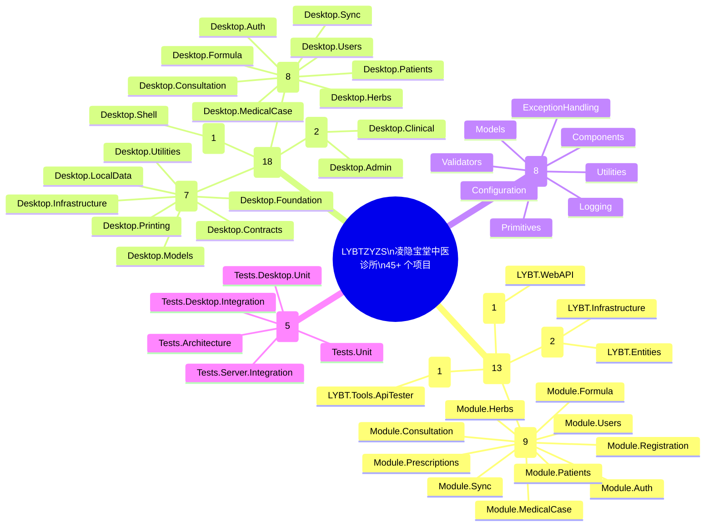
```mermaid
mindmap
    root((LYBTZYZS\n凌隐宝堂中医诊所\n45+ 个项目))
        Server 层 (13)
            Core (2)
                LYBT.Entities
                LYBT.Infrastructure
            Modules (9)
                Module.Auth
                Module.Users
                Module.Patients
                Module.Herbs
                Module.Formula
                Module.MedicalCase
                Module.Consultation
                Module.Prescriptions
                Module.Registration
                Module.Sync
            Services (1)
                LYBT.WebAPI
            Tools (1)
                LYBT.Tools.ApiTester
        Client 层 (18)
            Core (7)
                Desktop.Contracts
                Desktop.Foundation
                Desktop.Infrastructure
                Desktop.Models
                Desktop.Printing
                Desktop.LocalData
                Desktop.Utilities
            Modules (8)
                Desktop.Auth
                Desktop.Users
                Desktop.Patients
                Desktop.Herbs
                Desktop.Formula
                Desktop.MedicalCase
                Desktop.Sync
                Desktop.Consultation
            Roles (2)
                Desktop.Admin
                Desktop.Clinical
            Shell (1)
                Desktop.Shell
        Shared 层 (8)
            Primitives
            Models
            Configuration
            Utilities
            Logging
            ExceptionHandling
            Validators
            Components
        Tests (5)
            Tests.Unit
            Tests.Desktop.Unit
            Tests.Architecture
            Tests.Server.Integration
            Tests.Desktop.Integration
```

---

### 7.2 设计合理性问题分类

```mermaid
mindmap
    root((设计合理性问题\n8 类))
        依赖违规
            Auth 直接引用 Users
            违反 ICrossModuleService 规范
        过度设计
            Token FamilyId 重放检测
            对 3-5 人系统可能过度
        抽象缺失
            IHerbItem 双重定义
            PrescriptionItem 未实现接口
        双路径风险
            本地模式绕过业务规则
            权限/状态校验缺失
        模式不一致
            ProblemDetails vs ApiResponse
            错误响应格式双轨
        Controller 复杂度
            8 依赖注入参数
            CQRS 拆分过细
        ViewModel 断裂
            两棵独立继承树
            CoreVM vs MasterDetailVM
        双次读取
            鉴权读 + 保存再读
            QueryService + CommandService
```

---

## Section 8: 设计合理性审查

### 审查总结

基于以上 21 个图表的分析，识别出 8 个设计合理性问题:

| # | 问题 | 严重度 | 相关图表 | 文件位置 |
|---|------|--------|----------|----------|
| 1 | Auth -> Users 跨模块依赖 | HIGH | 2.1 | `src/Server/Modules/LYBT.Module.Auth/LYBT.Module.Auth.csproj` |
| 2 | MedicalCaseController 8参数 | MEDIUM | 6.1 | `src/Server/Services/LYBT.WebAPI/Controllers/MedicalCaseController.cs` |
| 3 | Controller 双次数据库读取 | MEDIUM | 5.3 | `MedicalCaseController.cs` Save/SetPrescriptionFlag 方法 |
| 4 | Local 模式绕过业务规则 | HIGH | 6.4 | `src/Client/Desktop/Core/LYBT.Desktop.LocalData/` |
| 5 | ViewModel 继承链断裂 | LOW | 6.2 | `Desktop.Models` vs `Desktop.Infrastructure` |
| 6 | Token 安全可能过度设计 | LOW | 4.3 | `src/Server/Modules/LYBT.Module.Auth/Services/AuthService.cs` |
| 7 | IHerbItem 接口不一致 | LOW | 3.3 | `LYBT.Entities/Common/IHerbItem.cs` vs `LYBT.Shared.Components/IHerbItem.cs` |
| 8 | ProblemDetails vs ApiResponse 双轨 | MEDIUM | 6.3 | `WebAPI/Configuration/ProblemDetailsConfiguration.cs` |

---

### 问题详述

#### 1. Auth -> Users 跨模块依赖 (HIGH)

**现象**: `LYBT.Module.Auth.csproj` 包含 `<ProjectReference>` 指向 `LYBT.Module.Users`

**违反原则**: `system-overview.md` 明确规定"Module 之间禁止直接依赖，跨模块通过 `ICrossModuleService` 通信"

**影响**:
- Auth 模块无法独立测试/部署
- Users 模块的内部变更可能破坏 Auth 模块
- 建立了不良先例

**建议**: 提取 Auth 所需的用户验证能力到 `ICrossModuleService` 接口，移除 Auth -> Users 的直接项目引用

---

#### 2. MedicalCaseController 8 依赖参数 (MEDIUM)

**现象**: 构造函数注入 8 个依赖 -- 5 个 CQRS 服务 + IAuthorizationService + Mapper + Logger

**影响**:
- 违反单一职责原则 (Controller 承担编排职责)
- 构造函数参数过多降低可读性
- 测试时需要 mock 8 个依赖

**建议**:
- 引入 `IMedicalCaseFacade` 聚合 5 个 CQRS 服务
- 或使用 MediatR 将 Controller 简化为 thin dispatcher

---

#### 3. Controller 双次数据库读取 (MEDIUM)

**现象**: Save/SetPrescriptionFlag 等写操作:
1. 先调用 `QueryService.GetByIdAsync()` 获取实体用于鉴权
2. 再调用 `CommandService.SaveAsync()` 内部可能再次读取

**影响**: 同一请求内可能产生两次相同的数据库查询

**建议**: 将鉴权读取的实体传递给 CommandService，避免重复查询。或在 CommandService 内部集成鉴权逻辑

---

#### 4. Local 模式绕过业务规则 (HIGH)

**现象**: 本地模式 `LocalXxxDataSource` 直连 SQLite，不经过 Server 端的:
- 权限校验 (MedicalCasePermissionService)
- 状态机规则 (MedicalCaseRules)
- 审计日志 (MedicalCaseAuditService)
- 数据验证 (Validators)

**影响**:
- 本地模式下可能创建违反业务规则的数据
- 同步到 Server 时可能产生冲突
- 安全审计缺失

**建议**:
- 在 LocalDataSource 层复制关键业务规则 (至少状态机和权限)
- 或将规则抽取到 Shared 层供两端复用
- 明确标记本地模式的功能受限范围 (已在 `dual-mode.md` TBD-01 中部分记录)

---

#### 5. ViewModel 继承链断裂 (LOW)

**现象**: 两棵独立继承树:
- 树 1: `ObservableObject -> CoreViewModelBase -> NavigableViewModelBase/DialogViewModelBase` (Desktop.Models)
- 树 2: `ObservableObject -> MasterDetailViewModelBase` (Desktop.Infrastructure)

**影响**: `MasterDetailViewModelBase` 无法复用 `CoreViewModelBase` 的通用能力 (IsBusy, ErrorMessage, ExecuteWithErrorHandlingAsync)

**缓解**: `MasterDetailViewModelBase` 通过组合模式 (`IMasterDetailServices`) 包含了 Loading/Error 等独立服务，功能上等价但实现路径不同

**建议**: 当前架构可接受，但长期可考虑将 `CoreViewModelBase` 下沉到 `Desktop.Infrastructure` 统一继承链

---

#### 6. Token 安全可能过度设计 (LOW)

**现象**: 针对 3-5 人的中医诊所系统，实现了:
- FamilyId 重放攻击检测
- Token 轮换 (每次刷新生成新 Token)
- 设备绑定
- 完整的安全审计日志

**背景**: 这是一个诊所内部系统，用户数量极少，网络环境可控

**缓解**: 安全设计为"防御性编程"，即使过度也不会造成负面影响。如果系统未来扩展到多诊所/云部署，这些机制会变得有价值

**建议**: 保持现有设计，但在文档中明确标注设计目标和适用场景

---

#### 7. IHerbItem 接口不一致 (LOW)

**现象**:
- Server 端 `LYBT.Entities.Common.IHerbItem`: 属性为 `get; set;`
- Client 端 `LYBT.Shared.Components.IHerbItem`: 属性为只读 `get;`
- `FormulaHerbItem` 和 `PrescriptionItem` 都未实现任一接口

**影响**: 两个同名接口可能造成混淆，缺乏统一的药材项抽象

**建议**:
- 统一到 Shared 层的单一 IHerbItem 定义
- 或明确区分命名 (如 `IHerbItemEntity` vs `IHerbItemViewModel`)

---

#### 8. ProblemDetails vs ApiResponse 双轨 (MEDIUM)

**现象**:
- 中间件层 (ExceptionHandler, StatusCodePages) 使用 RFC 7807 `ProblemDetails` 格式
- Controller 层 (业务代码) 使用自定义 `ApiResponse<T>` 包装格式
- 客户端需要处理两种不同的错误响应格式

**影响**:
- 客户端错误处理逻辑复杂
- API 行为不一致
- 新开发者容易混淆

**建议**: 统一为 ProblemDetails 格式 (RFC 7807 标准)，或统一为 ApiResponse 格式，避免混用

---

### 审查结论

| 严重度 | 数量 | 问题编号 | 建议优先级 |
|--------|------|----------|-----------|
| HIGH | 2 | #1 Auth依赖, #4 Local模式 | Sprint 1-2 |
| MEDIUM | 3 | #2 Controller参数, #3 双次读取, #8 响应格式 | Sprint 3-4 |
| LOW | 3 | #5 ViewModel断裂, #6 Token过度, #7 IHerbItem | 可选/不急 |

**总体评价**: 系统架构设计严谨，CQRS 拆分和聚合根模式实施到位。主要问题集中在 Module 隔离不够严格 (#1) 和本地模式的业务规则覆盖不足 (#4)。建议优先处理这两个 HIGH 级别问题。
