# 统一架构优化Sprint路线图

> **创建时间**: 2026-02-21
> **数据来源**:
> - `docs/plans/2026-02-21-code-fix-backlog.md` -- 201项CODE基准任务
> - `docs/plans/2026-02-21-architecture-deep-comparison.md` -- 44项新增架构偏差 + 18项重合 + 5项根因 + 12项正面发现
> - `docs/plans/2026-02-21-deviation-triage-checklist.md` -- 40项PRD修订 + 18项DEFER
> **有效任务总数**: ~305项 (221 CODE + 20 架构新增 + 21 文档同步 + 40 PRD修订 + 12 标准固化 - 9 重复计数调整)
> **综合架构评分**: 6.83/10 (C级) -- 架构骨架优秀，文档同步和错误处理体系是短板

### Sprint 进度总览

| Sprint | 任务数 | 状态 | 完成日期 | 备注 |
|--------|--------|------|----------|------|
| Sprint 1: 安全加固 | 33 | **COMPLETE** (33/33) | 2026-02-23~25 | 全部合并到 master |
| Sprint 2: 核心功能 | 51 | **COMPLETE** (51/51) | 2026-02-24~25 | 全部合并到 master |
| D5 跨模块解耦 | 12 | **COMPLETE** (12/12) | 2026-02-23 | PR #2263 已合并; 原属 Sprint 3 |
| Sprint 3: 体系统一 | 73 | PENDING | - | 85 - 12(D5) = 73 项 |
| Sprint 4: 本地模式 | 62 | PENDING | - | |
| Sprint 5+: 细节完善 | 86 | PENDING | - | |

---

## 一、总体概览

### 1.1 数据源合并方法论

```
                    ┌──────────────────────┐
                    │   architecture-deep   │
                    │   comparison (8维度)   │
                    │   44新增 + 18重合      │
                    │   + 5根因 + 12正面     │
                    └──────────┬───────────┘
                               │
                    ┌──────────▼───────────┐
┌──────────────┐   │                       │   ┌──────────────────┐
│  code-fix-   │──▶│    三源合并引擎        │◀──│ deviation-triage  │
│  backlog     │   │                       │   │ checklist         │
│  201项CODE   │   │  去重 → 分配 → 验证   │   │ 40项PRD + 18 DEFER│
└──────────────┘   └──────────┬───────────┘   └──────────────────┘
                               │
                    ┌──────────▼───────────┐
                    │   统一Sprint路线图     │
                    │   ~305项有效任务       │
                    │   5个Sprint + DEFER   │
                    └──────────────────────┘
```

### 1.2 合并统计

| 类别 | 来源 | 数量 | 说明 |
|------|------|------|------|
| CODE基准 | code-fix-backlog | 201 | 5 Tier / 8 横切面 / 6 专项 |
| 架构新增(代码) | architecture-deep-comparison [新增-架构] | 20 | 28项中扣除8项纯文档 |
| 架构新增(文档) | architecture-deep-comparison [新增-架构] | 21 | 8项D1 + 其余文档类 |
| PRD修订 | deviation-triage-checklist [PRD] | 40 | 15个模块的文档修订 |
| 架构标准固化 | architecture-deep-comparison [正面] | 12 | 6测试规则 + 6开发规范 |
| **有效任务小计** | | **~305** | (含部分跨类重复) |
| 重合去重 | 18项保留backlog ID | -18 | 架构信息作增强注释 |
| 根因附加 | 5项附加到对应任务 | -5 | 非独立任务 |
| DEFER延期 | deviation-triage-checklist | 18 | 独立跟踪 |

### 1.3 去重策略

**18项重合处理**: 全部保留 code-fix-backlog 任务ID，架构报告的额外信息作为增强注释合并到对应任务。

| 架构报告编号 | Backlog任务ID | 增强信息 |
|-------------|---------------|---------|
| D3-01 | T2-X8-02 | MedicalCase IsPrinted/PrintVersion缺失 -- 文档v1.3已定义 |
| D3-02 | T2-X5-* | Discount精度冲突 -- Entity(5,4) vs Configuration(3,2) |
| D3-03 | T2-X8-03 | Prescription保留已从文档移除的字段 |
| D3-04 | T2-X8-03/12 | PrescriptionPrintLog层级不匹配 |
| D4-01 | T3-X1-* | 通用错误码(0-12)非MCCEE 5位编码 |
| D4-02 | T3-X4-* | MedicalCase全部使用InvalidOperationException |
| D4-03 | T3-X4-* | BusinessException/NotFoundException已定义但从未使用 (根因) |
| D4-04 | T3-X4-01~04 | Result.Failure("硬编码字符串")无ErrorCode |
| D4-07 | T3-X1-13 | Sync模块(8xxxx)错误码完全缺失 |
| D4-08 | T3-X4-* | ProblemDetails基础设施完整但未被利用 (根因) |
| D6-03 | T1-S2-05/06/09 | AdminOnly过度限制自助端点 |
| D6-05 | T1-X3-01~06 | Token Family撤销未完整实现 |
| D6-15 | T1-S2-01 | Receptionist角色支持缺失 |
| D8-01 | T3-X1 (部分) | 术语违规136处(全范围，错误码部分与X1重合) |
| D8-02 | T3-X1 (部分) | ErrorCode.cs和ErrorMessages.cs是术语违规重灾区 |

**5项根因附加**: 非独立任务，作为对应backlog项的根因说明。

| 根因编号 | 附加到 | 说明 |
|---------|--------|------|
| D4-03 | T3-X4-* | BusinessException/NotFoundException未使用是X4所有任务的根因 |
| D4-08 | T3-X4-* | ProblemDetails基础设施未被利用是错误处理体系失效的根因 |
| D2-01 | D4-04 | FormulaService未继承BaseService导致缺少统一错误处理 |
| D7-02 | D1-06 | Desktop架构规则缺失导致Controls/目录模式无门禁保障 |
| D3-05 | D3-01 | 索引条件不符是IsPrinted字段缺失的下游影响 |

---

## 二、Sprint 1: 安全加固与数据完整性 (33项) -- COMPLETE

**状态**: **COMPLETE** (33/33, 2026-02-23~25)
**主题**: 修复安全漏洞、数据完整性问题、硬编码风险
**来源**: Backlog Tier 1 (30项) + 架构新增 (3项)

### 2.1 X3: Token Family 撤销 (6项)

| 任务ID | 偏差ID | 模块 | 描述 | 架构增强 |
|--------|--------|------|------|---------|
| T1-X3-01 | AUTH-01 | auth | 登录时撤销已有Token Family | D6-05: Token撤销机制未完整实现 |
| T1-X3-02 | USER-02 | users | 角色变更后撤销目标用户Token Family | |
| T1-X3-03 | USER-05 | users | 删除用户后撤销其Token Family | |
| T1-X3-04 | USER-06 | users | 重置密码后撤销目标用户Token Family | |
| T1-X3-05 | USER-08 | users | 修改密码后撤销当前用户Token Family | |
| T1-X3-06 | USER-14 | users | 禁用用户后撤销其Token Family | |

### 2.2 X7: 引用检查修复 (10项)

| 任务ID | 偏差ID | 模块 | 描述 |
|--------|--------|------|------|
| T1-X7-01 | PAT-05 | patients | 单条删除时调用引用检查 |
| T1-X7-02 | PAT-06 | patients | 批量删除时调用引用检查 |
| T1-X7-03 | PAT-09 | patients | Controller添加check-reference端点 |
| T1-X7-04 | PAT-10 | patients | CheckReferenceAsync实现实际医案引用计数查询 |
| T1-X7-05 | PAT-11 | patients | Controller添加batch-check-reference端点 |
| T1-X7-06 | PAT-12 | patients | BatchCheckReference实现实际引用计数查询 |
| T1-X7-07 | HERB-01 | herbs | 删除药材时检查处方引用 |
| T1-X7-08 | HERB-02 | herbs | 批量删除药材时检查处方引用 |
| T1-X7-09 | HERB-03 | herbs | CanDelete实现实际处方引用查询 |
| T1-X7-10 | HERB-09 | herbs | 删除被引用药材时返回422 |

### 2.3 S1: 密码哈希Bug (1项)

| 任务ID | 偏差ID | 模块 | 描述 |
|--------|--------|------|------|
| T1-S1-01 | USER-09 | users | 修复密码哈希Bug(旧密码覆盖新密码) |

### 2.4 S2: 权限矩阵修复 (9项)

| 任务ID | 偏差ID | 模块 | 描述 | 架构增强 |
|--------|--------|------|------|---------|
| T1-S2-01 | USER-01 | users | CanManageUser补充Receptionist角色 | D6-15: 权限矩阵缺少Receptionist |
| T1-S2-02 | USER-03 | users | 角色变更时CanManageUser补充Receptionist | |
| T1-S2-03 | USER-04 | users | 单条删除添加"不能删除自己"检查 | |
| T1-S2-04 | USER-07 | users | ChangePasswordAsync调用PasswordPolicyValidator | |
| T1-S2-05 | USER-11 | users | 修改密码解除AdminOnly限制 | D6-03: AdminOnly过度限制 |
| T1-S2-06 | USER-12 | users | 修改个人资料解除AdminOnly限制 | D6-03: AdminOnly过度限制 |
| T1-S2-07 | USER-13 | users | ToggleStatus添加最后管理员保护 | |
| T1-S2-08 | USER-15 | users | BatchUpdateStatus添加权限检查和保护 | |
| T1-S2-09 | USER-16 | users | GetCurrentUser解除AdminOnly继承 | D6-03: AdminOnly过度限制 |

### 2.5 S3: EditReason 强制校验 (4项)

| 任务ID | 偏差ID | 模块 | 描述 |
|--------|--------|------|------|
| T1-S3-01 | MC-04 | medical-cases | EditReason在Update中强制校验 |
| T1-S3-02 | MC-06 | medical-cases | EditReason在编辑操作中强制校验 |
| T1-S3-03 | MC-14 | medical-cases | 审计日志中传递EditReason |
| T1-S3-04 | MC-20 | medical-cases | RequiresEditReason补充"非本人"和"当天已完成" |

### 2.6 架构新增: 安全加固 (3项)

| 任务ID | 架构编号 | 描述 | 严重度 | 修改文件 |
|--------|---------|------|--------|---------|
| A1-01 | D3-05 | MedicalCase筛选唯一索引条件修复(Draft+Active vs Active only) | 严重 | `Infrastructure/Data/Configurations/MedicalCaseConfiguration.cs` |
| A1-02 | D6-08 | User.PhoneNumber和User.Email添加SensitiveData标记 | 高 | `Server/Core/LYBT.Entities/Users/UserModel.cs` |
| A1-03 | D8-05 | 移除硬编码SQL Server连接字符串 | 高 | `Server/Services/LYBT.WebAPI/Extensions/DatabaseServiceCollectionExtensions.cs` |

### Sprint 1 统计

| 分组 | 任务数 |
|------|--------|
| X3 Token撤销 | 6 |
| X7 引用检查 | 10 |
| S1 密码哈希 | 1 |
| S2 权限矩阵 | 9 |
| S3 EditReason | 4 |
| 架构新增 | 3 |
| **Sprint 1 合计** | **33** |

---

## 三、Sprint 2: 核心功能修复 (51项) -- COMPLETE

**状态**: **COMPLETE** (51/51, 2026-02-24~25)
**主题**: 打印层级重构、字段验证、功能Bug修复、安全端点加固
**来源**: Backlog Tier 2 (42项) + 架构新增 (4项) + PRD修订 (5项)

### 3.1 X8: 打印层级重构 (12项)

| 任务ID | 偏差ID | 模块 | 描述 | 架构增强 |
|--------|--------|------|------|---------|
| T2-X8-01 | MC-02 | medical-cases | 实现打印保护逻辑 | |
| T2-X8-02 | MC-03 | medical-cases | MedicalCase实体添加IsPrinted/PrintVersion字段 | D3-01: 文档v1.3已定义 |
| T2-X8-03 | MC-07 | medical-cases | PrescriptionPrintLog重构为MedicalCasePrintLog | D3-03/04: 打印日志归属错误 |
| T2-X8-04 | MC-21 | medical-cases | PrintHandler打印后设置IsPrinted=true | |
| T2-X8-05 | MC-22 | medical-cases | 打印后更新PrintCount++和LastPrintedAt | |
| T2-X8-06 | PRINT-01 | printing | PrintCount递增逻辑实现 | |
| T2-X8-07 | PRINT-02 | printing | IsPrinted=true回写逻辑实现 | |
| T2-X8-08 | PRINT-03 | printing | LastPrintedAt时间戳更新实现 | |
| T2-X8-09 | PRINT-04 | printing | 打印层级从处方层迁移到医案层 | |
| T2-X8-10 | PRINT-05 | printing | PrintVersion递增逻辑实现 | |
| T2-X8-11 | PRINT-06 | printing | 打印版本号快照记录 | |
| T2-X8-12 | PRINT-07 | printing | 创建MedicalCasePrintLog实体 | |

### 3.2 X5: 字段验证值对齐 (15项)

| 任务ID | 偏差ID | 模块 | 描述 | 架构增强 |
|--------|--------|------|------|---------|
| T2-X5-01 | AUTH-12 | auth | 密码最小长度6->8 | |
| T2-X5-02 | USER-19 | users | 用户密码最小长度6->8 | |
| T2-X5-03 | PAT-20 | patients | IdNumber/PhoneNumber/Address DTO改为Required | |
| T2-X5-04 | HERB-17 | herbs | Effect字段DTO 1000->500 | |
| T2-X5-05 | HERB-18 | herbs | Usage字段Validator 200->500 | |
| T2-X5-06 | HERB-23 | herbs | Spec字段DTO 50->100 | |
| T2-X5-07 | HERB-24 | herbs | Unit字段DTO 20->10 | |
| T2-X5-08 | FORM-04 | formulas | Effect DTO=200->500 | D3-02: 精度冲突增强 |
| T2-X5-09 | FORM-12 | formulas | Desktop Validator功效/用法改选填 | |
| T2-X5-10 | FORM-13 | formulas | Usage DTO=200改500 | |
| T2-X5-11 | MC-32 | medical-cases | 添加DosageCount>0校验 | |
| T2-X5-12 | MC-35 | medical-cases | OperatorName MaxLength 50->100 | |
| T2-X5-13 | CFG-01 | configuration | DefaultRole "Staff"->"Doctor" | |
| T2-X5-14 | CFG-02 | configuration | InactivityTimeout 5->15分钟 | |
| T2-X5-15 | SHELL-05 | desktop-shell | Shell端确认读取正确超时值 | |

### 3.3 S4: 功能Bug/审计/患者状态/系统 (15项)

| 任务ID | 偏差ID | 模块 | 描述 |
|--------|--------|------|------|
| T2-S4-01 | FORM-01 | formulas | FormulaMapper补充Herbs列表映射 |
| T2-S4-02 | FORM-05 | formulas | 修复TotalPrice始终为0 |
| T2-S4-03 | MC-30 | medical-cases | 修复PrescriptionItem.Usage错误赋值 |
| T2-S4-04 | LOG-01 | logging | 审计日志保留期30->365天 |
| T2-S4-05 | LOG-02 | logging | 修复SensitiveDataAttribute两份定义冲突 |
| T2-S4-06 | LOG-03 | logging | CleanupService使用Options配置替代硬编码 |
| T2-S4-07 | LOG-04 | logging | CleanupService改为分批删除 |
| T2-S4-08 | PAT-01 | patients | 实现患者状态管理功能 |
| T2-S4-09 | SYS-01 | health-diagnostics | Unhealthy映射修正 |
| T2-S4-10 | SYS-02 | health-diagnostics | 健康检查详细响应补充 |
| T2-S4-11 | ERR-03 | error-handling | 实现异常到通知类型映射 |
| T2-S4-12 | PRINT-08 | printing | 创建PrintType枚举 |
| T2-S4-13 | PRINT-09 | printing | 实现打印日志写入 |
| T2-S4-14 | NFR-03 | nfr | 不活跃超时确认NFR引用点 |
| T2-S4-15 | NFR-04 | nfr | 密码过期配置统一30->90天 |

### 3.4 架构新增: 安全端点与数据 (4项)

| 任务ID | 架构编号 | 描述 | 严重度 | 修改文件 |
|--------|---------|------|--------|---------|
| A2-01 | D6-04 | 3个import-template端点移除AllowAnonymous | 中等 | `PatientsController.cs`, `HerbsController.cs`, `FormulasController.cs` |
| A2-02 | D6-13 | 启用Rate Limiting中间件(Login端点) | 中等 | `Server/Services/LYBT.WebAPI/Program.cs` |
| A2-03 | D3-06 | MedicalCase补充IX_MedicalCases_UserId索引 | 轻微 | `MedicalCaseConfiguration.cs` |
| A2-04 | D7-02 | Desktop架构规则迁移到主测试项目 | 高 | `tests/LYBT.Tests.Architecture/` |

### 3.5 PRD修订: 打印/药材相关 (5项)

| PRD编号 | 模块 | 修订内容 |
|---------|------|---------|
| HERB-05 | herbs | Price验证保持代码>0.01 (PRD接受) |
| HERB-06 | herbs | Price上限保持代码100000 (PRD接受) |
| PRINT-23 | printing | 字号大小微差PRD接受 |
| PRINT-26 | printing | 打印日期格式差异PRD接受 |
| PRINT-27 | printing | 其他排版细节偏差PRD接受 |

### Sprint 2 统计

| 分组 | 任务数 |
|------|--------|
| X8 打印层级重构 | 12 |
| X5 字段验证对齐 | 15 |
| S4 功能Bug/审计 | 15 |
| 架构新增 | 4 |
| PRD修订 | 5 |
| **Sprint 2 合计** | **51** |

---

## 四、Sprint 3: 体系统一与文档同步 (73项) -- 最大Sprint -- NEXT

**状态**: PENDING (D5 跨模块解耦 12 项已完成，剩余 73 项)
**主题**: 错误码体系统一、异常体系切换、文档同步、架构标准固化
**来源**: Backlog Tier 3 (26项) + 架构新增 (9项) + 文档同步 (16项) + PRD修订 (16项) + 标准固化 (6项)
**详细设计**: [sprint3-design.md](2026-02-25-sprint3-design.md)

### 4.1 X1: 错误码MCCEE统一 (15项)

| 任务ID | 偏差ID | 模块 | 描述 | 架构增强 |
|--------|--------|------|------|---------|
| T3-X1-01 | AUTH-05 | auth | Auth错误码迁移到5位MCCEE | D4-01: 通用错误码格式不统一 |
| T3-X1-02 | PAT-15 | patients | 实现ERR-20002 | |
| T3-X1-03 | PAT-16 | patients | 实现ERR-20004 | |
| T3-X1-04 | PAT-17 | patients | 实现ERR-20005 | |
| T3-X1-05 | PAT-18 | patients | 实现ERR-20006 | |
| T3-X1-06 | PAT-22 | patients | 删除失败返回422非404 | |
| T3-X1-07 | HERB-15 | herbs | Herbs错误码编号对齐 | |
| T3-X1-08 | HERB-19 | herbs | 实现ERR-50106 | |
| T3-X1-09 | HERB-20 | herbs | 实现ERR-50104 | |
| T3-X1-10 | HERB-21 | herbs | 实现ERR-50202 | |
| T3-X1-11 | FORM-02 | formulas | Formulas 17个错误码对齐 | |
| T3-X1-12 | MC-10 | medical-cases | MedicalCase错误码迁移到ERR-3xxxx | |
| T3-X1-13 | SYNC-14 | sync | 同步模块20个PRD错误码全部实现 | D4-07: Sync错误码完全缺失 |
| T3-X1-14 | ERR-01 | error-handling | ErrorCode 7xxxx语义重新对应 | |
| T3-X1-15 | ERR-02 | error-handling | 修复ClientErrorMessageMapper解析ERR-10004 | |

### 4.2 X4: Service层ErrorCode替代 (5项)

| 任务ID | 偏差ID | 模块 | 描述 | 架构增强 |
|--------|--------|------|------|---------|
| T3-X4-01 | USER-17 | users | UserService硬编码替换为ErrorCode | D4-02/03/04: 根因修复 -- 统一采用BusinessException |
| T3-X4-02 | USER-18 | users | 用户名重复返回409 | |
| T3-X4-03 | HERB-16 | herbs | HerbService硬编码替换为ErrorCode | |
| T3-X4-04 | FORM-11 | formulas | FormulaService硬编码替换为ErrorCode | |
| T3-X4-05 | AUTH-14 | auth | TokenRevoked提示语义精确化 | |

### 4.3 X6: 分页筛选迁移Repository (6项)

| 任务ID | 偏差ID | 模块 | 描述 |
|--------|--------|------|------|
| T3-X6-01 | USER-20 | users | role/status筛选移到Repository IQueryable链 |
| T3-X6-02 | HERB-07 | herbs | 分类筛选移到Repository |
| T3-X6-03 | FORM-15 | formulas | 分类筛选移到Repository |
| T3-X6-04 | FORM-17 | formulas | 待验证列表改为分页查询 |
| T3-X6-05 | MC-18 | medical-cases | GetListDtoAsync筛选移到Repository |
| T3-X6-06 | ERR-04 | error-handling | HTTP 429映射到错误码 |

### 4.4 架构新增: 异常体系与测试合并 (9项)

| 任务ID | 架构编号 | 描述 | 严重度 | 说明 |
|--------|---------|------|--------|------|
| A3-01 | D4-05 | ErrorCode.cs中35处术语违规修复 | 中等 | 与X1一并处理 |
| A3-02 | D4-06 | ErrorMessages.cs中11处 + NotFoundException.cs 1处术语修复 | 中等 | 与X1一并处理 |
| A3-03 | D4-03/08 | Service层全面采用BusinessException/NotFoundException替代InvalidOperationException | 严重 | X4的根因修复 |
| A3-04 | D7-01 | 两套架构测试项目合并(消除24条重复规则) | 中 | 合并到LYBT.Tests.Architecture |
| A3-05 | D7-03 | 添加Shared内部依赖架构规则 | 中 | tests/LYBT.Tests.Architecture/ |
| A3-06 | D8-01 | 术语铁律违规系统清理(136处/39文件) | 高 | 与A3-01/02协同 |
| A3-07 | D2-01 | FormulaService补齐BaseService继承 | 中 | 享受统一错误处理 |
| A3-08 | D6-14 | FallbackPolicy设置(Swagger兼容) | 中 | WebAPI安全加固 |
| A3-09 | D7-05(部分) | 补齐Shared.Logging/Desktop.Sync零覆盖测试 | 高 | 优先2个高优模块 |

### 4.5 文档同步 (16项)

| 任务ID | 架构编号 | 描述 | 目标文档 |
|--------|---------|------|---------|
| DOC3-01 | D1-01 | Consultation/Prescriptions空壳模块标注废弃 | system-overview.md |
| DOC3-02 | D1-02 | system-overview.md项目总数更新(约33->40+) | system-overview.md |
| DOC3-03 | D1-03 | Shared层文档补全8个项目(4个缺失) | shared.md |
| DOC3-04 | D1-04 | Desktop.LocalData和CardReader补充到系统概览 | system-overview.md |
| DOC3-05 | D1-05 | Desktop端Consultation模块标注不存在 | desktop.md |
| DOC3-06 | D1-06 | Controls/ vs Views/ 目录约定文档化 | desktop.md |
| DOC3-07 | D1-07 | FormulaService不继承BaseService的原因文档化 | server.md |
| DOC3-08 | D1-08 | Desktop.CardReader位置混乱的说明 | desktop.md |
| DOC3-09 | D2-03 | Validator位置迁移(Module->Shared.Validators)文档更新 | server.md |
| DOC3-10 | D3-09 | 4个辅助实体补充到data-model.md | data-model.md |
| DOC3-11 | D4-08 | 异常处理体系架构文档更新(切换后) | error-handling设计文档 |
| DOC3-12 | D7-06 | CLAUDE.md测试项目数量更新(5->实际数) | CLAUDE.md |
| DOC3-13 | D6-06 | SensitiveDataAttribute统一后文档更新 | shared.md |
| DOC3-14 | D4-09 | CorrelationId全链路文档补充(正面发现文档化) | error-handling文档 |
| DOC3-15 | D1-03+ | 工具层4个项目文档化 | system-overview.md |
| DOC3-16 | D8-04 | OpenSpec标记1299处跟踪机制文档 | development指南 |

### 4.6 PRD修订: 认证/错误处理/日志/同步/配置 (16项)

| PRD编号 | 模块 | 修订内容 |
|---------|------|---------|
| AUTH-02 | auth | 移除登出前警告(simplify-auth决策) |
| AUTH-11 | auth | AuthSession独立表->保持Token表 |
| AUTH-13 | auth | 内外网统一限流 |
| AUTH-15 | auth | WPF触摸事件追踪过度设计 |
| AUTH-19 | auth | 状态命名PRD接受代码命名 |
| ERR-07 | error-handling | 错误消息文案细节PRD接受 |
| ERR-08 | error-handling | 错误分类枚举值PRD接受 |
| ERR-09 | error-handling | 错误日志格式PRD接受 |
| LOG-05 | logging | 日志级别配置差异PRD接受 |
| LOG-06 | logging | 日志格式模板差异PRD接受 |
| LOG-07 | logging | 日志轮转配置差异PRD接受 |
| LOG-08 | logging | 结构化日志字段命名PRD接受 |
| SYNC-11 | sync | 进度UI简化PRD接受 |
| SYNC-15 | sync | DTO命名PRD接受 |
| SYNC-16 | sync | 字段名差异PRD接受 |
| SYNC-19 | sync | 其他命名规范PRD接受 |

### 4.7 架构标准固化: 测试规则 (6项)

将12项正面发现中的6项固化为架构测试规则，写入 `tests/LYBT.Tests.Architecture/`:

| 标准编号 | 正面发现 | 测试规则 | 保护内容 |
|---------|---------|---------|---------|
| P-01 | 双模式5/5实体100%完整 | `AllEntitiesWithDataSourceMustHaveBothModes` | 新增实体必须同时实现Remote+Local |
| P-02 | Repository基类100%统一 | `AllRepositoriesMustInheritBaseRepository` | 禁止绕过BaseRepository |
| P-03 | MasterDetailViewModelBase 100% | `AllCrudViewModelsMustInheritMasterDetail` | CRUD ViewModel必须继承基类 |
| P-06 | 无反向引用/循环依赖 | `NoReverseOrCircularDependencies` | 防止分层退化 |
| P-08 | 所有跨模块引用仅依赖接口 | `CrossModuleReferencesMustUseInterfaces` | 防止具体实现耦合 |
| P-09 | Controller 100%授权覆盖 | `AllControllersMustHaveClassLevelAuthorize` | 防止裸Controller |

### Sprint 3 统计

| 分组 | 任务数 |
|------|--------|
| X1 错误码MCCEE统一 | 15 |
| X4 Service层ErrorCode | 5 |
| X6 分页筛选迁移 | 6 |
| 架构新增 | 9 |
| 文档同步 | 16 |
| PRD修订 | 16 |
| 架构标准(测试规则) | 6 |
| **Sprint 3 合计** | **73** |

---

## 五、Sprint 4: 本地模式补齐 (62项)

**主题**: 本地模式功能完善、打印模板、Desktop Shell、开发规范固化
**来源**: Backlog Tier 4 (37项) + 架构新增 (4项) + PRD修订 (12项) + 标准固化 (6项) + 测试补齐 (3项)

### 5.1 X2: IDataSource+导入导出 (22项)

| 任务ID | 偏差ID | 模块 | 描述 |
|--------|--------|------|------|
| T4-X2-01 | USER-10 | users | Desktop ChangePasswordAsync实现 |
| T4-X2-02 | USER-21 | users | LocalUserDataSource删除保护完善 |
| T4-X2-03 | USER-22 | users | IUserDataSource添加RestoreAsync |
| T4-X2-04 | USER-23 | users | IUserDataSource添加BatchDeleteAsync |
| T4-X2-05 | USER-25 | users | IUserDataSource添加ResetPasswordAsync |
| T4-X2-06 | USER-27 | users | LocalUserDataSource状态切换保护完善 |
| T4-X2-07 | USER-28 | users | IUserDataSource添加批量启用/禁用 |
| T4-X2-08 | USER-29 | users | 本地模式GetCurrentUser实现 |
| T4-X2-09 | PAT-07 | patients | 本地模式批量导入实现 |
| T4-X2-10 | PAT-08 | patients | 本地模式导出实现 |
| T4-X2-11 | PAT-23 | patients | Desktop端实现引用检查 |
| T4-X2-12 | PAT-24 | patients | Desktop端批量引用检查实现 |
| T4-X2-13 | HERB-10 | herbs | 本地模式批量启用/禁用实现 |
| T4-X2-14 | HERB-11 | herbs | 本地模式Excel导入实现 |
| T4-X2-15 | HERB-12 | herbs | 本地模式JSON导入实现 |
| T4-X2-16 | HERB-13 | herbs | 本地模式导出实现 |
| T4-X2-17 | HERB-14 | herbs | 本地模式引用检查实现 |
| T4-X2-18 | HERB-22 | herbs | 本地模式导入模板下载 |
| T4-X2-19 | FORM-06 | formulas | Desktop端恢复延迟绑定验证方法 |
| T4-X2-20 | FORM-07 | formulas | Desktop端恢复待验证列表方法 |
| T4-X2-21 | FORM-08 | formulas | Desktop端本地批量导入实现 |
| T4-X2-22 | FORM-10 | formulas | Desktop端本地导出实现 |

### 5.2 S5: 打印模板完善 (11项)

| 任务ID | 偏差ID | 模块 | 描述 |
|--------|--------|------|------|
| T4-S5-01 | PRINT-10 | printing | 实现打印失败日志记录 |
| T4-S5-02 | PRINT-11 | printing | 远程模式打印日志API实现 |
| T4-S5-03 | PRINT-12 | printing | 本地模式打印日志存储实现 |
| T4-S5-04 | PRINT-13 | printing | 模板字体楷体改为宋体 |
| T4-S5-05 | PRINT-14 | printing | 模板边距15mm改为8mm |
| T4-S5-06 | PRINT-15 | printing | 添加诊所信息区 |
| T4-S5-07 | PRINT-16 | printing | 完善诊断信息区 |
| T4-S5-08 | PRINT-17 | printing | 渲染煎法标注 |
| T4-S5-09 | PRINT-18 | printing | 实现分页规则(>12味分页) |
| T4-S5-10 | PRINT-20 | printing | DoctorName自动绑定 |
| T4-S5-11 | PRINT-21 | printing | 费用计算纳入Discount |

### 5.3 S6: Desktop-shell功能 (4项)

| 任务ID | 偏差ID | 模块 | 描述 |
|--------|--------|------|------|
| T4-S6-01 | SHELL-01 | desktop-shell | 实现菜单可见性矩阵 |
| T4-S6-02 | SHELL-07 | desktop-shell | 本地模式菜单不可用逻辑 |
| T4-S6-03 | SHELL-06 | desktop-shell | 导航历史20条上限 |
| T4-S6-04 | SHELL-10 | desktop-shell | 本地模式账户设置分支处理 |

### 5.4 架构新增: 安全与代码质量 (4项)

| 任务ID | 架构编号 | 描述 | 严重度 |
|--------|---------|------|--------|
| A4-01 | D8-06 | RFC URI映射重复定义DRY合并 | 中 |
| A4-02 | D6-07 | Patient.EmergencyContactPhone添加SensitiveData标记 | 低 |
| A4-03 | D6-10 | Patient/Herb缺少资源级AuthorizationHandler评估 | 中 |
| A4-04 | D6-09 | ExtractUserInfo方法重复DRY合并 | 低 |

### 5.5 架构新增: 测试覆盖补齐 (3项)

| 任务ID | 架构编号 | 描述 |
|--------|---------|------|
| A4-05 | D7-05(部分) | Desktop.CardReader零覆盖补齐 |
| A4-06 | D7-05(部分) | Desktop.Admin零覆盖补齐 |
| A4-07 | D7-05(部分) | Desktop.Clinical零覆盖补齐 |

### 5.6 PRD修订: 医案/桌面/同步/读卡器/NFR (12项)

| PRD编号 | 模块 | 修订内容 |
|---------|------|---------|
| MC-08 | medical-cases | 初始状态保持Active(UI层未保存表单替代Draft) |
| MC-31 | medical-cases | PRD过度细分错误消息 |
| MC-34 | medical-cases | OperationType int枚举vs string PRD接受 |
| SHELL-04 | desktop-shell | 超时前警告移除(simplify-auth) |
| SHELL-11 | desktop-shell | 状态枚举命名PRD接受 |
| SHELL-12 | desktop-shell | 登录协调依赖计数PRD接受 |
| SHELL-13 | desktop-shell | StartupReport返回类型PRD接受 |
| SHELL-14 | desktop-shell | 启动诊断信息格式PRD接受 |
| CARD-01 | card-reader | RealName vs Name PRD接受 |
| CFG-06 | configuration | Swagger/Json注册方式PRD接受 |
| CFG-08 | configuration | 配置错误输出格式PRD接受 |
| USER-30 | users | 旧密码错误消息PRD接受 |

### 5.7 架构标准固化: 开发规范 (6项)

将12项正面发现中的6项固化为开发规范，写入 `docs/05-development/04-patterns.md` + `.claude/rules/code-standards.md`:

| 标准编号 | 正面发现 | 规范条目 | 保护内容 |
|---------|---------|---------|---------|
| P-04 | CQRS边界清晰7/7 | `MedicalCase-CQRS-Pattern` | CQRS仅限MedicalCase，其余保持传统单Service |
| P-05 | CorrelationId全链路 | `CorrelationId-Pipeline` | 新增中间件必须传递CorrelationId |
| P-07 | ICrossModuleService | `CrossModule-Decoupling-Pattern` | 跨模块查询必须通过Infrastructure层接口 |
| P-10 | 敏感数据脱敏管线完整 | `SensitiveData-Pipeline` | 新增敏感字段必须标记SensitiveDataAttribute |
| P-11 | AAA测试模式100% | `AAA-Test-Pattern` | 所有测试必须使用// Arrange/Act/Assert标记 |
| P-12 | JWT配置规范 | `JWT-Security-Configuration` | Production环境禁止使用默认密钥 |

### Sprint 4 统计

| 分组 | 任务数 |
|------|--------|
| X2 IDataSource+导入导出 | 22 |
| S5 打印模板 | 11 |
| S6 Desktop-shell | 4 |
| 架构新增(代码) | 4 |
| 架构新增(测试) | 3 |
| PRD修订 | 12 |
| 架构标准(开发规范) | 6 |
| **Sprint 4 合计** | **62** |

---

## 六、Sprint 5+: 细节完善 (86项)

**主题**: P2功能完善、P3细节修复、文档补全、Mock统一
**来源**: Backlog Tier 5 (66项) + 架构新增 (6项) + 文档 (5项) + PRD修订 (7项) + 其他 (2项)

### 6.1 P2: 功能完善 (45项)

| 任务ID | 偏差ID | 模块 | 描述 |
|--------|--------|------|------|
| T5-P2-01 | AUTH-03 | auth | 实现远程模式FailedLoginCount |
| T5-P2-02 | AUTH-04 | auth | UserDisabled返回403替代401 |
| T5-P2-03 | AUTH-06 | auth | HMAC校验失败清除篡改凭据 |
| T5-P2-04 | AUTH-07 | auth | 实现30天绝对过期 |
| T5-P2-05 | AUTH-09 | auth | TokenExpired时尝试AutoLogin降级 |
| T5-P2-06 | AUTH-17 | auth | 过期Token错误码区分Expired vs Invalid |
| T5-P2-07 | AUTH-18 | auth | "记住密码"自动勾选"记住用户名" |
| T5-P2-08 | AUTH-20 | auth | 本地模式简化版状态机 |
| T5-P2-09 | MC-01 | medical-cases | 创建医案时检查患者状态 |
| T5-P2-10 | MC-05 | medical-cases | TcmDiagnosis非空校验 |
| T5-P2-11 | MC-09 | medical-cases | 医案编号自动生成 |
| T5-P2-12 | MC-11 | medical-cases | HasPrescription=false时清除处方 |
| T5-P2-13 | MC-12 | medical-cases | 处方编号自动生成 |
| T5-P2-14 | MC-13 | medical-cases | 处方Items为空时验证 |
| T5-P2-15 | MC-15 | medical-cases | 完成操作验证Items非空 |
| T5-P2-16 | MC-17 | medical-cases | 非当天本人取消需Reason |
| T5-P2-17 | MC-23 | medical-cases | 验方导入过滤ValidationStatus |
| T5-P2-18 | MC-24 | medical-cases | 验方导入过滤Status=Enabled |
| T5-P2-19 | MC-25 | medical-cases | 验方导入跳过禁用药材 |
| T5-P2-20 | MC-26 | medical-cases | 验方导入价格实时获取 |
| T5-P2-21 | MC-27 | medical-cases | 历史复制跳过禁用药材 |
| T5-P2-22 | MC-28 | medical-cases | 历史复制价格实时获取 |
| T5-P2-23 | MC-29 | medical-cases | 历史复制记录ReferencedFormulas |
| T5-P2-24 | PAT-02 | patients | 身份证号必填+唯一性检查 |
| T5-P2-25 | PAT-03 | patients | 更新时手机号唯一性检查 |
| T5-P2-26 | PAT-04 | patients | 更新时身份证号唯一性检查 |
| T5-P2-27 | PAT-13 | patients | Receptionist查询过滤Disabled患者 |
| T5-P2-28 | PAT-14 | patients | 导入时身份证号唯一性检查 |
| T5-P2-29 | PAT-19 | patients | 创建API返回201替代200 |
| T5-P2-30 | PAT-21 | patients | Receptionist添加CRU权限 |
| T5-P2-31 | USER-24 | users | MustChangeOnNextLogin标记实现 |
| T5-P2-32 | USER-26 | users | ChangeProfileAsync重新生成PinYinCode |
| T5-P2-33 | HERB-04 | herbs | CreateAsync添加拼音码自动生成 |
| T5-P2-34 | HERB-08 | herbs | 名称变更时重新生成拼音码 |
| T5-P2-35 | FORM-03 | formulas | Server端校验Herbs列表非空 |
| T5-P2-36 | FORM-09 | formulas | 导出Excel包含药材组成详情 |
| T5-P2-37 | FORM-16 | formulas | 本地模式批量启用/禁用 |
| T5-P2-38 | FORM-18 | formulas | 本地模式内置导入模板 |
| T5-P2-39 | SYNC-06 | sync | SyncMetadataDto补充缺失字段 |
| T5-P2-40 | SYNC-07 | sync | GetMetadataAsync使用IgnoreQueryFilters |
| T5-P2-41 | SYNC-09 | sync | OverwriteConflicts改为配置项 |
| T5-P2-42 | SYNC-10 | sync | 同步前添加网络/Token检查 |
| T5-P2-43 | SYNC-12 | sync | 完善同步结果汇总 |
| T5-P2-44 | CFG-03 | configuration | 添加FeatureToggle CardReaderEnabled |
| T5-P2-45 | CFG-04 | configuration | JWT SecretKey验证增强 |

### 6.2 P3: 细节修复 (21项)

| 任务ID | 偏差ID | 模块 | 描述 |
|--------|--------|------|------|
| T5-P3-01 | CFG-05 | configuration | Important配置缺失改为警告 |
| T5-P3-02 | ERR-05 | error-handling | Token相关错误码消息映射 |
| T5-P3-03 | ERR-06 | error-handling | 追踪码与Severity自动关联 |
| T5-P3-04 | NFR-02 | nfr | 审计日志保留365天NFR确认 |
| T5-P3-05 | NFR-05 | nfr | Server端缓存失效映射 |
| T5-P3-06 | NFR-06 | nfr | Desktop端写后缓存失效 |
| T5-P3-07 | MC-36 | medical-cases | 审计字段补充Prescription.Usage |
| T5-P3-08 | MC-37 | medical-cases | pending端点添加doctorId参数 |
| T5-P3-09 | MC-38 | medical-cases | 历史复制包含DosageCount/Discount |
| T5-P3-10 | PAT-25 | patients | CreateAsync(DTO版)手机号唯一性 |
| T5-P3-11 | PAT-26 | patients | 导入行数限制off-by-one |
| T5-P3-12 | PAT-27 | patients | 导入模板IdNumber列标记必填 |
| T5-P3-13 | PAT-28 | patients | PatientStatus复用CommonStatus |
| T5-P3-14 | PRINT-22 | printing | A4/A5排版差异处理 |
| T5-P3-15 | PRINT-24 | printing | 药材名称过长截断 |
| T5-P3-16 | PRINT-25 | printing | 空处方打印校验 |
| T5-P3-17 | SHELL-02 | desktop-shell | 登出时清除导航历史 |
| T5-P3-18 | SHELL-03 | desktop-shell | 模块加载增加角色粒度 |
| T5-P3-19 | SHELL-09 | desktop-shell | 账户设置添加Email编辑 |
| T5-P3-20 | SYNC-17 | sync | Checksum字段类型/长度对齐 |
| T5-P3-21 | SYNC-18 | sync | 状态栏同步标识实现 |

### 6.3 架构新增: 优化与清理 (6项)

| 任务ID | 架构编号 | 描述 | 严重度 |
|--------|---------|------|--------|
| A5-01 | D7-04 | Mock框架统一(Moq vs NSubstitute选一) | 中 |
| A5-02 | D5-03 | MedicalCase直接引用Patients+Users优化评估 | 中 |
| A5-03 | D5-05 | Auth.AuthService直接使用Users.Mapping优化 | 低 |
| A5-04 | D8-03 | 3个空壳项目/目录清理(Consultation/Prescriptions/Server.Interfaces) | 低 |
| A5-05 | D8-07 | [Obsolete]标记7处清理 | 低 |
| A5-06 | D3-10 | 外键关系补充显式Fluent API配置 | 轻微 |

### 6.4 文档补全 (5项)

| 任务ID | 架构编号 | 描述 | 目标文档 |
|--------|---------|------|---------|
| DOC5-01 | D3-07 | Patient 5个代码字段补充到文档 | data-model.md |
| DOC5-02 | D3-08 | RefreshToken 10个代码字段补充到文档 | data-model.md |
| DOC5-03 | D2-02 | BaseReadRepository文档声明但代码未使用的说明 | server.md |
| DOC5-04 | D2-04 | Desktop端Repository无统一基类的说明 | desktop.md |
| DOC5-05 | D5-04 | Sync模块引用3个Module(引用量最大)文档化 | server.md |

### 6.5 PRD修订: 健康诊断/验方/用户/NFR (7项)

| PRD编号 | 模块 | 修订内容 |
|---------|------|---------|
| SYS-03 | health-diagnostics | 健康检查响应格式PRD接受 |
| SYS-04 | health-diagnostics | 健康检查超时配置PRD接受 |
| SYS-05 | health-diagnostics | 诊断端点路径PRD接受 |
| FORM-14 | formulas | Entity Name 200 vs PRD 100 PRD放宽 |
| NFR-07 | nfr | 并发连接数配置PRD接受 |
| NFR-08 | nfr | 响应时间SLA PRD接受 |
| NFR-09 | nfr | 其他NFR细节PRD接受 |

### 6.6 架构: OpenSpec跟踪与测试合并验证 (2项)

| 任务ID | 描述 |
|--------|------|
| A5-07 | 建立OpenSpec标记(1299处/452文件)定期清理机制 |
| A5-08 | 架构测试项目合并后验证(Sprint 3 A3-04的后续验证) |

### Sprint 5+ 统计

| 分组 | 任务数 |
|------|--------|
| P2 功能完善 | 45 |
| P3 细节修复 | 21 |
| 架构新增 | 6 |
| 文档补全 | 5 |
| PRD修订 | 7 |
| OpenSpec+测试验证 | 2 |
| **Sprint 5+ 合计** | **86** |

---

## 七、架构标准固化清单

### 7.1 架构测试规则 (Sprint 3 写入)

目标: `tests/LYBT.Tests.Architecture/`

| # | 规则名称 | 来源 | 保护内容 | 实现方式 |
|---|---------|------|---------|---------|
| P-01 | DualMode_AllEntities_HaveBothModes | 双模式5/5 100% | 新增实体必须同时实现IDataSource+Remote+Local | NetArchTest检查DataSource配对 |
| P-02 | Repository_AllInherit_BaseRepository | Repository 100%统一 | 禁止绕过BaseRepository | NetArchTest检查继承链 |
| P-03 | ViewModel_CrudModules_InheritMasterDetail | MVVM 100%统一 | CRUD ViewModel必须继承MasterDetailViewModelBase | NetArchTest检查继承链 |
| P-06 | Dependencies_NoReverseOrCircular | 分层0反向依赖 | 防止分层退化 | NetArchTest检查引用方向 |
| P-08 | CrossModule_MustUseInterfaces | DIP 100%遵循 | 跨模块引用必须通过接口 | NetArchTest检查namespace引用 |
| P-09 | Controllers_MustHaveAuthorize | 授权100%覆盖 | 防止裸Controller暴露 | NetArchTest检查[Authorize]属性 |

### 7.2 开发规范 (Sprint 4 写入)

目标: `docs/05-development/04-patterns.md` + `.claude/rules/code-standards.md`

| # | 规范名称 | 来源 | 规范内容 |
|---|---------|------|---------|
| P-04 | CQRS-Boundary | CQRS边界7/7匹配 | MedicalCase是唯一CQRS模块，其余保持传统单Service模式 |
| P-05 | CorrelationId-Pipeline | CorrelationId全链路 | 新增中间件必须传递CorrelationId，新增ProblemDetails必须包含TraceId |
| P-07 | CrossModule-Decoupling | ICrossModuleService | 跨模块查询必须通过Infrastructure层接口，禁止ProjectReference直接引用其他Module |
| P-10 | SensitiveData-Marking | 脱敏管线完整 | 所有敏感字段必须标记SensitiveDataAttribute，日志管线自动脱敏 |
| P-11 | AAA-TestPattern | AAA 100%覆盖 | 所有测试必须使用`// Arrange` / `// Act` / `// Assert`标记 |
| P-12 | JWT-Security | JWT配置规范 | Production环境禁止使用默认密钥，Development环境允许但必须日志Warning |

---

## 八、跨Sprint依赖关系图

```mermaid
graph TD
    subgraph Sprint1["Sprint 1: 安全加固 (33)"]
        T1X3["X3: Token撤销 (6)"]
        T1X7["X7: 引用检查 (10)"]
        T1S1["S1: 密码哈希 (1)"]
        T1S2["S2: 权限矩阵 (9)"]
        T1S3["S3: EditReason (4)"]
        A1["架构新增 (3)"]
    end

    subgraph Sprint2["Sprint 2: 核心功能 (51)"]
        T2X8["X8: 打印重构 (12)"]
        T2X5["X5: 字段验证 (15)"]
        T2S4["S4: 功能Bug (15)"]
        A2["架构新增 (4)"]
        PRD2["PRD修订 (5)"]
    end

    subgraph Sprint3["Sprint 3: 体系统一 (73)"]
        T3X1["X1: 错误码 (15)"]
        T3X4["X4: ErrorCode替代 (5)"]
        T3X6["X6: 分页迁移 (6)"]
        A3["架构新增 (9)"]
        DOC3["文档同步 (16)"]
        PRD3["PRD修订 (16)"]
        STD3["标准固化:测试 (6)"]
    end

    subgraph Sprint4["Sprint 4: 本地模式 (62)"]
        T4X2["X2: IDataSource (22)"]
        T4S5["S5: 打印模板 (11)"]
        T4S6["S6: Shell功能 (4)"]
        A4["架构新增 (7)"]
        PRD4["PRD修订 (12)"]
        STD4["标准固化:规范 (6)"]
    end

    subgraph Sprint5["Sprint 5+: 细节完善 (86)"]
        T5P2["P2: 功能完善 (45)"]
        T5P3["P3: 细节修复 (21)"]
        A5["架构新增 (8)"]
        DOC5["文档补全 (5)"]
        PRD5["PRD修订 (7)"]
    end

    %% 跨Sprint依赖
    T1X3 -->|"Token撤销是权限修复的前提"| T1S2
    T2X8 -->|"IsPrinted字段 -> 打印回写"| T2S4
    T3X1 -->|"错误码注册 -> Service层引用"| T3X4
    T3X4 -->|"统一异常体系 -> 文档更新"| DOC3
    A1 -->|"索引修复 -> 打印保护"| T2X8
    T2X8 -->|"打印实体 -> 日志API"| T4S5
    T2X5 -->|"配置修改 -> Shell读取"| T4S6
    T4X2 -->|"导入实现 -> 模板下载"| T5P2
    STD3 -->|"测试规则 -> 验证通过"| A5
    A3 -->|"测试合并 -> 后续验证"| A5
```



### 关键依赖链

| 依赖链 | 说明 |
|--------|------|
| T2-X8-02 (字段) -> T2-X8-01/04~12 (回写) -> T4-S5 (模板) | 打印系统完整链路 |
| T2-X8-12 (实体) -> T2-S4-12 (枚举) -> T4-S5-01~03 (日志) | 打印日志链路 |
| T3-X1 (错误码注册) -> T3-X4 (Service替换) -> A3-03 (异常体系) | 错误处理完整重构链 |
| T1-X3 (Token撤销) -> T1-S2 (权限修复) -> 完整验证 | 安全修复链路 |
| T4-X2-14~16 (导入导出) -> T4-X2-18 (模板) | 本地模式功能链路 |
| T5-P2-24~28 (唯一性) -> T4-X2-09 (本地导入) | 数据完整性链路 |

---

## 九、DEFER项跟踪 (18项)

延期到后续 Epic/Sprint 的任务，不在本路线图 Sprint 1-5 范围内。

### 9.1 MedicalCase同步 (7项)

| 偏差ID | 描述 | 延期原因 |
|--------|------|---------|
| SYNC-01 | MedicalCase同步完全未实现 | 独立Epic，复杂度极高 |
| SYNC-02 | SyncConflictDetailDto未实现 | 依赖同步基础架构 |
| SYNC-03 | 冲突对话框仅展示Checksum | 依赖同步基础架构 |
| SYNC-04 | 运行时模式切换未实现 | MVP阶段登录时选择够用 |
| SYNC-05 | 切换前未同步变更检查 | 依赖运行时模式切换 |
| SYNC-08 | ChangedFields始终为null | 变更检测复杂度高 |
| SYNC-13 | 切换失败回退策略未实现 | 依赖运行时模式切换 |

### 9.2 EditMode状态机 (2项)

| 偏差ID | 描述 | 延期原因 |
|--------|------|---------|
| MC-16 | 取消前未自动保存诊断数据 | UX复杂度高需独立规划 |
| MC-19 | EditModeStateMachine不存在 | 状态机复杂度高需独立设计 |
| MC-33 | Clinical/Management模式区分需验证 | 与MC-19同源 |

### 9.3 其他 (6项)

| 偏差ID | 描述 | 延期原因 | 建议归入 |
|--------|------|---------|---------|
| NFR-01 | SQLite字段级加密整体未实现 | 架构影响面大 | Epic: 安全加固 |
| AUTH-08 | 服务端登出失败重试队列 | 重试队列复杂度高 | Sprint N |
| AUTH-10 | 缺少4个PRD定义事件 | 事件总线扩展非MVP | Sprint N |
| AUTH-16 | validate端点不返回剩余有效时间 | 非MVP必要 | Sprint N |
| AUTH-21 | "记住密码"后无安全警告文案 | UI文案非MVP核心 | Sprint N |
| SHELL-08 | 缺少最后登录时间/IP信息 | 非MVP必要 | Sprint N |
| PRINT-19 | 草稿水印未实现 | 非MVP核心 | Sprint N |
| CFG-07 | FeatureToggle热更新未支持 | MVP阶段重启够用 | Sprint N |

> 注: MC-33 实际属于 MC-19 的子项，DEFER总数仍为18项。

---

## 附录A: 完整任务ID交叉引用索引

### A.1 架构报告编号 -> Sprint归属

| 编号 | 类别 | Sprint | 任务ID/处理方式 |
|------|------|--------|----------------|
| D1-01 | 文档 | 3 | DOC3-01 |
| D1-02 | 文档 | 3 | DOC3-02 |
| D1-03 | 文档 | 3 | DOC3-03 |
| D1-04 | 文档 | 3 | DOC3-04 |
| D1-05 | 文档 | 3 | DOC3-05 |
| D1-06 | 文档 | 3 | DOC3-06 |
| D1-07 | 文档 | 3 | DOC3-07 |
| D1-08 | 文档 | 3 | DOC3-08 |
| D2-01 | 代码 | 3 | A3-07 |
| D2-02 | 文档 | 5 | DOC5-03 |
| D2-03 | 文档 | 3 | DOC3-09 |
| D2-04 | 文档 | 5 | DOC5-04 |
| D2-05 | 正面 | - | CQRS边界清晰(标准P-04) |
| D3-01 | 重合 | 2 | T2-X8-02 (增强) |
| D3-02 | 重合 | 2 | T2-X5-* (增强) |
| D3-03 | 重合 | 2 | T2-X8-03 (增强) |
| D3-04 | 重合 | 2 | T2-X8-03/12 (增强) |
| D3-05 | 代码 | 1 | A1-01 |
| D3-06 | 代码 | 2 | A2-03 |
| D3-07 | 文档 | 5 | DOC5-01 |
| D3-08 | 文档 | 5 | DOC5-02 |
| D3-09 | 文档 | 3 | DOC3-10 |
| D3-10 | 代码 | 5 | A5-06 |
| D4-01 | 重合 | 3 | T3-X1-* (增强) |
| D4-02 | 重合 | 3 | T3-X4-* (增强) |
| D4-03 | 根因 | 3 | T3-X4-* (附加) |
| D4-04 | 重合 | 3 | T3-X4-01~04 (增强) |
| D4-05 | 代码 | 3 | A3-01 |
| D4-06 | 代码 | 3 | A3-02 |
| D4-07 | 重合 | 3 | T3-X1-13 (增强) |
| D4-08 | 根因 | 3 | T3-X4-* (附加) |
| D4-09 | 正面 | 3 | DOC3-14 (文档化) |
| D5-01 | 正面 | - | 无反向引用(标准P-06) |
| D5-02 | 正面 | - | ICrossModuleService(标准P-07) |
| D5-03 | 代码 | 5 | A5-02 |
| D5-04 | 文档 | 5 | DOC5-05 |
| D5-05 | 代码 | 5 | A5-03 |
| D5-06 | 正面 | - | DIP(标准P-08) |
| D6-01 | 正面 | - | 授权100%(标准P-09) |
| D6-02 | 正面 | - | 资源级授权 |
| D6-03 | 重合 | 1 | T1-S2-05/06/09 (增强) |
| D6-04 | 代码 | 2 | A2-01 |
| D6-05 | 重合 | 1 | T1-X3-01~06 (增强) |
| D6-06 | 代码 | 3 | DOC3-13 (文档化) |
| D6-07 | 代码 | 4 | A4-02 |
| D6-08 | 代码 | 1 | A1-02 |
| D6-09 | 代码 | 4 | A4-04 |
| D6-10 | 代码 | 4 | A4-03 |
| D6-11 | 正面 | - | 脱敏管线(标准P-10) |
| D6-12 | 正面 | - | JWT配置(标准P-12) |
| D6-13 | 代码 | 2 | A2-02 |
| D6-14 | 代码 | 3 | A3-08 |
| D6-15 | 重合 | 1 | T1-S2-01 (增强) |
| D7-01 | 代码 | 3 | A3-04 |
| D7-02 | 代码 | 2 | A2-04 |
| D7-03 | 代码 | 3 | A3-05 |
| D7-04 | 代码 | 5 | A5-01 |
| D7-05 | 代码 | 3-4 | A3-09 + A4-05~07 |
| D7-06 | 文档 | 3 | DOC3-12 |
| D7-07 | 正面 | - | AAA模式(标准P-11) |
| D8-01 | 重合(部分) | 3 | A3-06 + T3-X1(重合部分) |
| D8-02 | 重合(部分) | 3 | T3-X1(重合部分) |
| D8-03 | 代码 | 5 | A5-04 |
| D8-04 | 跟踪 | 5 | A5-07 |
| D8-05 | 代码 | 1 | A1-03 |
| D8-06 | 代码 | 4 | A4-01 |
| D8-07 | 代码 | 5 | A5-05 |

### A.2 按模块汇总

| 模块 | Sprint 1 | Sprint 2 | Sprint 3 | Sprint 4 | Sprint 5+ | PRD | DEFER | 合计 |
|------|----------|----------|----------|----------|-----------|-----|-------|------|
| auth | 1(X3) | 1(X5) | 2(X1+X4) | 0 | 8(P2) | 5 | 4 | 21 |
| users | 15(X3+S1+S2) | 1(X5) | 3(X4+X6) | 8(X2) | 3(P2+P3) | 1 | 0 | 31 |
| patients | 6(X7) | 2(X5+S4) | 5(X1) | 4(X2) | 11(P2+P3) | 0 | 0 | 28 |
| herbs | 4(X7) | 5(X5) | 6(X1+X4+X6) | 6(X2) | 3(P2) | 2 | 0 | 26 |
| formulas | 0 | 4(X5+S4) | 4(X1+X4+X6) | 4(X2) | 6(P2) | 1 | 0 | 19 |
| medical-cases | 4(S3) | 7(X8+X5+S4) | 2(X1+X6) | 0 | 20(P2+P3) | 3 | 3 | 39 |
| printing | 0 | 14(X8+S4) | 0 | 11(S5) | 3(P3) | 3 | 1 | 32 |
| sync | 0 | 0 | 1(X1) | 0 | 7(P2+P3) | 4 | 7 | 19 |
| desktop-shell | 0 | 1(X5) | 0 | 4(S6) | 3(P3) | 5 | 1 | 14 |
| configuration | 0 | 2(X5) | 0 | 0 | 3(P2+P3) | 2 | 1 | 8 |
| error-handling | 0 | 1(S4) | 4(X1+X6) | 0 | 2(P3) | 3 | 0 | 10 |
| logging | 0 | 4(S4) | 0 | 0 | 0 | 4 | 0 | 8 |
| health-diagnostics | 0 | 2(S4) | 0 | 0 | 0 | 3 | 0 | 5 |
| nfr | 0 | 2(S4) | 0 | 1(X2) | 3(P3) | 3 | 1 | 10 |
| 架构(跨模块) | 3(A1) | 4(A2) | 9(A3)+16(DOC)+6(STD) | 7(A4)+6(STD) | 8(A5)+5(DOC) | 0 | 0 | 64 |
| **合计** | **33** | **51** | **73** | **62** | **86** | **40** | **18** | **363** |

> 注: "合计" 363 = 305有效任务 + 40 PRD修订 + 18 DEFER。Sprint内部CODE+架构+文档+标准 = 305。PRD和DEFER与Sprint并行但独立计数。

---

## 变更记录

| 日期 | 版本 | 变更内容 |
|------|------|----------|
| 2026-02-21 | v1.0 | 初始版本: 三源合并为统一Sprint路线图。Sprint 1(33) + Sprint 2(51) + Sprint 3(73) + Sprint 4(62) + Sprint 5+(86) + PRD(40) + DEFER(18) |
| 2026-02-25 | v1.1 | Sprint 1(33/33) + Sprint 2(51/51) 标记 COMPLETE; D5 跨模块解耦(12/12) 标记 COMPLETE (PR #2263); Sprint 3 标记 NEXT (73 项); 8 个已完成文件归档到 archive/ |
