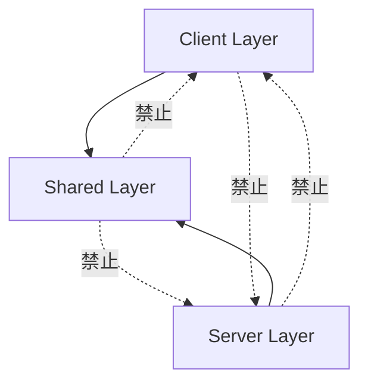
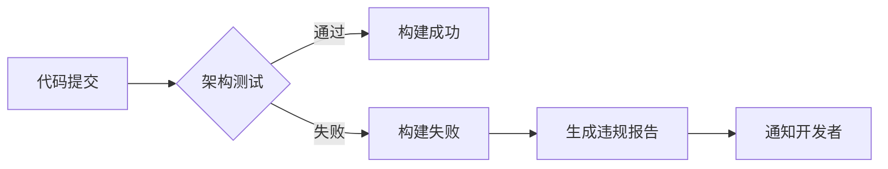

# Shared 架构门禁规范

> 版本：1.0.0
> 更新时间：2025-09-21
> 适用范围：LYBT.Shared.* 项目群及其依赖关系

## 📋 目录

1. [核心原则](#核心原则)
2. [禁止依赖清单](#禁止依赖清单)
3. [边界规则](#边界规则)
4. [架构测试规范](#架构测试规范)
5. [违规处理流程](#违规处理流程)
6. [工具配置](#工具配置)
7. [最佳实践](#最佳实践)

## 🎯 核心原则

### 1. 平台无关性
Shared 层必须保持平台无关，可同时被 Server（ASP.NET Core）和 Client（WPF）引用。

### 2. 契约纯净性
Shared 层只包含契约定义（DTO、接口、枚举），不包含具体实现。

### 3. 零运行时依赖
不依赖任何运行时框架，仅依赖 .NET 标准库。

### 4. 向下兼容
任何变更必须保持向下兼容，避免破坏性更改。

## 🚫 禁止依赖清单

### 绝对禁止（RED）

这些依赖在任何情况下都不应出现在 Shared 层：

| 包名称 | 原因 | 替代方案 |
|--------|------|----------|
| **Microsoft.AspNetCore.*** | Web框架依赖 | 将Web相关逻辑移至WebAPI层 |
| **Microsoft.EntityFrameworkCore.*** | ORM框架依赖 | 实体定义移至Entities项目 |
| **Swashbuckle.AspNetCore.*** | API文档工具 | 文档配置移至WebAPI层 |
| **Autofac** | DI容器 | 使用接口定义，具体注入在应用层 |
| **NLog/Serilog/log4net** | 日志框架 | 定义ILogService接口 |
| **Dapper** | 数据访问 | 移至Repository层 |
| **MediatR** | 中介者模式 | 移至应用层 |
| **FluentValidation** | 验证框架 | 使用DataAnnotations或自定义验证 |
| **Quartz.NET** | 任务调度 | 移至后台服务 |
| **SignalR** | 实时通信 | 移至WebAPI层 |

### 谨慎使用（YELLOW）

这些依赖需要特别评估是否必要：

| 包名称 | 使用条件 | 注意事项 |
|--------|----------|----------|
| **Newtonsoft.Json** | 需要特殊序列化 | 优先使用System.Text.Json |
| **System.ComponentModel.Annotations** | DTO验证 | 仅用于数据注解 |
| **Microsoft.Extensions.Options** | 配置模型 | 仅用于配置类定义 |
| **System.Drawing.Common** | 图像处理 | 考虑平台兼容性 |

### 允许使用（GREEN）

这些依赖是安全的：

| 包名称 | 用途 |
|--------|------|
| **System.*** | .NET标准库 |
| **Microsoft.Extensions.DependencyInjection.Abstractions** | DI抽象 |
| **System.Text.Json** | JSON序列化 |
| **System.ComponentModel** | 基础组件模型 |

## 🛡️ 边界规则

### 1. 层次依赖规则



### 2. 项目间依赖规则

| 项目 | 可以依赖 | 不能依赖 |
|------|----------|----------|
| **LYBT.Shared.Models** | 无 | Interfaces, Utilities |
| **LYBT.Shared.Interfaces** | Models | Utilities |
| **LYBT.Shared.Utilities** | Models | Interfaces |

### 3. 命名空间规则

```csharp
// ✅ 正确：Shared层命名空间
namespace LYBT.Shared.Models.Contracts.Users;
namespace LYBT.Shared.Interfaces;
namespace LYBT.Shared.Utilities.Helpers;

// ❌ 错误：包含具体实现层
namespace LYBT.Shared.Services;        // 不应有Services
namespace LYBT.Shared.Repositories;    // 不应有Repositories
namespace LYBT.Shared.Controllers;     // 不应有Controllers
```

## 🧪 架构测试规范

### 1. ArchUnit.NET 配置

```csharp
using ArchUnitNET.Domain;
using ArchUnitNET.Fluent;
using ArchUnitNET.xUnit;

public class SharedArchitectureTests
{
    private static readonly Architecture Architecture =
        new ArchLoader()
            .LoadAssemblies(
                typeof(LYBT.Shared.Models.Common.ServiceResult<>).Assembly,
                typeof(LYBT.Shared.Interfaces.IAuthService).Assembly,
                typeof(LYBT.Shared.Utilities.Helpers.PasswordHelper).Assembly)
            .Build();

    [Fact]
    public void Shared_Should_Not_Depend_On_AspNetCore()
    {
        IArchRule rule = Types()
            .That()
            .ResideInNamespace("LYBT.Shared", true)
            .Should()
            .NotDependOnAny(Types().That().ResideInNamespace("Microsoft.AspNetCore", true));

        rule.Check(Architecture);
    }

    [Fact]
    public void Shared_Should_Not_Depend_On_EntityFramework()
    {
        IArchRule rule = Types()
            .That()
            .ResideInNamespace("LYBT.Shared", true)
            .Should()
            .NotDependOnAny(Types().That().ResideInNamespace("Microsoft.EntityFrameworkCore", true));

        rule.Check(Architecture);
    }

    [Fact]
    public void Shared_Should_Not_Have_Concrete_Services()
    {
        IArchRule rule = Classes()
            .That()
            .ResideInNamespace("LYBT.Shared", true)
            .Should()
            .NotHaveName(".*Service$", useRegularExpressions: true)
            .OrShould()
            .BeInterfaces();

        rule.Check(Architecture);
    }

    [Fact]
    public void Interfaces_Should_Start_With_I()
    {
        IArchRule rule = Interfaces()
            .That()
            .ResideInNamespace("LYBT.Shared.Interfaces", true)
            .Should()
            .HaveName("^I.*", useRegularExpressions: true);

        rule.Check(Architecture);
    }
}
```

### 2. 自定义分析器规则

```xml
<!-- .editorconfig -->
[*.{cs,vb}]

# LYBT001: Shared层不应依赖AspNetCore
dotnet_diagnostic.LYBT001.severity = error

# LYBT002: Shared层不应依赖EntityFrameworkCore
dotnet_diagnostic.LYBT002.severity = error

# LYBT003: Shared层不应包含Service实现
dotnet_diagnostic.LYBT003.severity = error

# LYBT004: 接口必须以I开头
dotnet_diagnostic.LYBT004.severity = warning
```

### 3. 构建时检查

```xml
<!-- Directory.Build.props for Shared projects -->
<Project>
  <PropertyGroup>
    <TreatWarningsAsErrors>true</TreatWarningsAsErrors>
    <EnableNETAnalyzers>true</EnableNETAnalyzers>
    <AnalysisLevel>latest</AnalysisLevel>
  </PropertyGroup>

  <ItemGroup>
    <PackageReference Include="ArchUnitNET" Version="0.10.0" />
    <PackageReference Include="Microsoft.CodeAnalysis.NetAnalyzers" Version="8.0.0" />
  </ItemGroup>

  <!-- 禁止引用检查 -->
  <Target Name="CheckForbiddenReferences" BeforeTargets="Build">
    <Error Condition="'@(PackageReference)' != '' AND '@(PackageReference->Contains('AspNetCore'))' == 'true'"
           Text="Shared层不能引用AspNetCore相关包" />
    <Error Condition="'@(PackageReference)' != '' AND '@(PackageReference->Contains('EntityFrameworkCore'))' == 'true'"
           Text="Shared层不能引用EntityFrameworkCore相关包" />
  </Target>
</Project>
```

## ⚠️ 违规处理流程

### 1. 检测阶段



### 2. 违规等级

| 等级 | 描述 | 处理方式 |
|------|------|----------|
| **P0 - 阻塞** | 引入禁止依赖 | 立即修复，阻止合并 |
| **P1 - 严重** | 违反边界规则 | 24小时内修复 |
| **P2 - 警告** | 不符合命名规范 | 下个迭代修复 |
| **P3 - 建议** | 可优化项 | 技术债务跟踪 |

### 3. 修复指南

```bash
# 1. 查找违规依赖
dotnet list package --include-transitive | grep "AspNetCore"

# 2. 移除违规包
dotnet remove package Microsoft.AspNetCore.Mvc

# 3. 运行架构测试
dotnet test --filter "Category=Architecture"

# 4. 验证清理
dotnet build --no-incremental
```

## 🛠️ 工具配置

### 1. CI/CD Pipeline 配置

```yaml
# azure-pipelines.yml
- task: DotNetCoreCLI@2
  displayName: 'Run Architecture Tests'
  inputs:
    command: 'test'
    projects: '**/ArchTests.csproj'
    arguments: '--filter Category=Architecture'

- task: PublishTestResults@2
  condition: always()
  inputs:
    testResultsFormat: 'XUnit'
    testResultsFiles: '**/*.trx'
    testRunTitle: 'Architecture Tests'
```

### 2. Git Hooks 配置

```bash
#!/bin/bash
# .git/hooks/pre-commit

# 检查Shared层依赖
if grep -r "using Microsoft.AspNetCore" src/Shared/; then
    echo "❌ 错误：Shared层不能引用AspNetCore"
    exit 1
fi

if grep -r "using Microsoft.EntityFrameworkCore" src/Shared/; then
    echo "❌ 错误：Shared层不能引用EntityFrameworkCore"
    exit 1
fi

echo "✅ 架构检查通过"
```

### 3. Visual Studio 配置

```xml
<!-- .vs/ArchitectureRules.ruleset -->
<?xml version="1.0" encoding="utf-8"?>
<RuleSet Name="Shared Layer Architecture Rules" ToolsVersion="16.0">
  <Rules AnalyzerId="Microsoft.CodeQuality.Analyzers" RuleNamespace="Microsoft.CodeQuality.Analyzers">
    <Rule Id="CA1040" Action="Error" /> <!-- 避免空接口 -->
    <Rule Id="CA1707" Action="Error" /> <!-- 标识符不应包含下划线 -->
    <Rule Id="CA1715" Action="Error" /> <!-- 标识符应具有正确的前缀 -->
  </Rules>
</RuleSet>
```

## ✅ 最佳实践

### 1. DTO设计原则

```csharp
// ✅ 好的实践
public class UserDto
{
    public Guid Id { get; set; }
    public string Username { get; set; } = string.Empty;
    public UserRole Role { get; set; }
}

// ❌ 避免的做法
public class UserDto
{
    public User Entity { get; set; }  // 不要包含实体
    public IUserService Service { get; set; }  // 不要包含服务
}
```

### 2. 接口定义原则

```csharp
// ✅ 好的实践
public interface IUserService
{
    Task<ServiceResult<UserDto>> GetByIdAsync(Guid id);
}

// ❌ 避免的做法
public interface IUserService
{
    IQueryable<User> GetQueryable();  // 不暴露IQueryable
    SqlConnection GetConnection();     // 不暴露具体实现
}
```

### 3. 枚举定义原则

```csharp
// ✅ 好的实践
public enum UserRole
{
    [Description("管理员")]
    Admin = 1,

    [Description("医生")]
    Doctor = 2
}

// ❌ 避免的做法
public enum UserRole
{
    Admin,  // 没有显式值
    Doctor  // 没有描述
}
```

## 📊 门禁检查清单

使用此清单进行代码审查：

- [ ] 无AspNetCore相关引用
- [ ] 无EntityFrameworkCore相关引用
- [ ] 无具体Service实现类
- [ ] 无Repository实现类
- [ ] 接口都以I开头
- [ ] DTO类都有Dto后缀
- [ ] 枚举都有显式值和描述
- [ ] 无循环依赖
- [ ] 符合命名空间规范
- [ ] 通过所有架构测试

## 📈 度量指标

| 指标 | 目标值 | 当前值 | 状态 |
|------|--------|--------|------|
| 禁止依赖违规数 | 0 | 0 | ✅ |
| 边界规则违规数 | 0 | 0 | ✅ |
| 命名规范符合率 | 100% | 98% | ⚠️ |
| 架构测试覆盖率 | 90% | 85% | ⚠️ |
| 构建时检查通过率 | 100% | 100% | ✅ |

