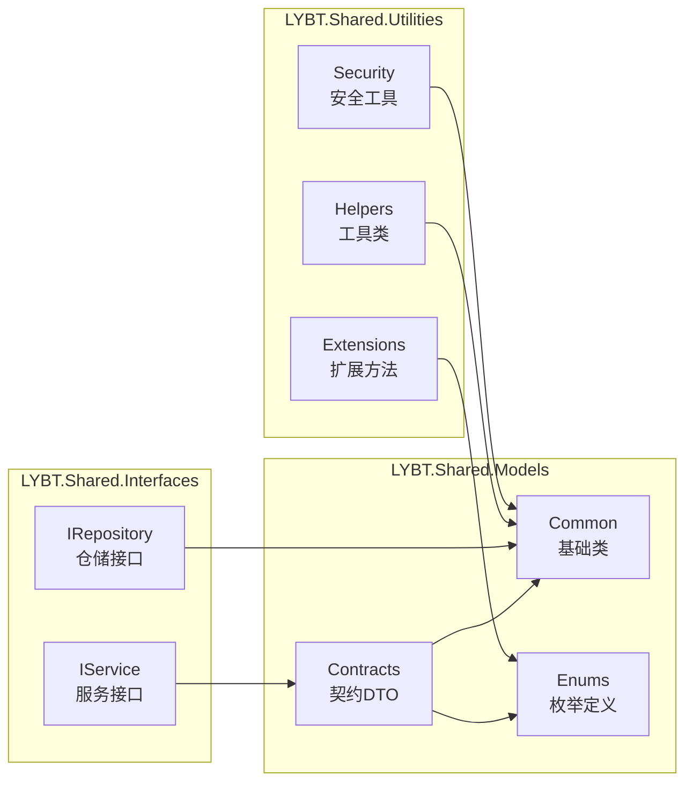
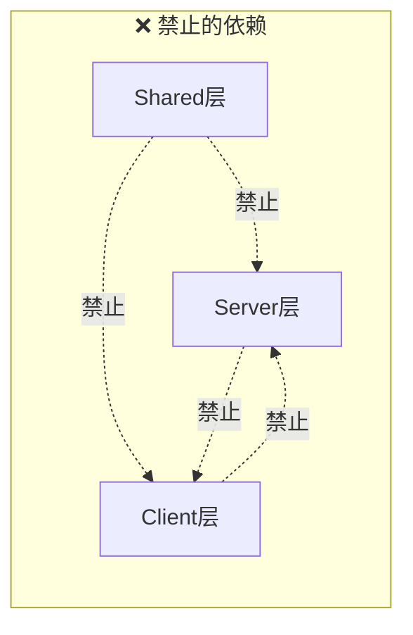

# Shared 依赖关系图

> 生成时间：2025-09-21
> 分析范围：LYBT.Shared.* ↔ Server/Client 依赖关系

## 📊 整体依赖架构

```mermaid
graph TB
    subgraph "Shared Layer"
        Models[LYBT.Shared.Models]
        Interfaces[LYBT.Shared.Interfaces]
        Utilities[LYBT.Shared.Utilities]
    end

    subgraph "Server Layer"
        Infrastructure[LYBT.Infrastructure]
        Auth[LYBT.Module.Auth]
        Users[LYBT.Module.Users]
        Patients[LYBT.Module.Patients]
        MedicalCase[LYBT.Module.MedicalCase]
        Consultation[LYBT.Module.Consultation]
        Prescriptions[LYBT.Module.Prescriptions]
        Herbs[LYBT.Module.Herbs]
        Formula[LYBT.Module.Formula]
        WebAPI[LYBT.WebAPI]
    end

    subgraph "Client Layer"
        ClientAuth[Client.Auth]
        ClientUsers[Client.Users]
        ClientPatients[Client.Patients]
        ClientMedicalCase[Client.MedicalCase]
        ClientConsultation[Client.Consultation]
        ClientPrescriptions[Client.Prescriptions]
        ClientHerbs[Client.Herbs]
        ClientFormula[Client.Formula]
        Shell[Client.Shell]
    end

    %% Shared内部依赖
    Models --> Interfaces
    Models --> Utilities
    Interfaces --> Utilities

    %% Server依赖Shared
    Infrastructure --> Models
    Infrastructure --> Interfaces
    Infrastructure --> Utilities

    Auth --> Models
    Auth --> Interfaces
    Auth --> Utilities

    Users --> Models
    Users --> Interfaces
    Users --> Utilities

    Patients --> Models
    Patients --> Interfaces

    MedicalCase --> Models
    MedicalCase --> Interfaces

    Consultation --> Models
    Consultation --> Interfaces

    Prescriptions --> Models
    Prescriptions --> Interfaces

    Herbs --> Models
    Herbs --> Interfaces

    Formula --> Models
    Formula --> Interfaces

    WebAPI --> Models
    WebAPI --> Interfaces
    WebAPI --> Utilities

    %% Client依赖Shared
    ClientAuth --> Models
    ClientAuth --> Interfaces

    ClientUsers --> Models
    ClientUsers --> Interfaces

    ClientPatients --> Models
    ClientPatients --> Interfaces

    ClientMedicalCase --> Models
    ClientMedicalCase --> Interfaces

    ClientConsultation --> Models
    ClientConsultation --> Interfaces

    ClientPrescriptions --> Models
    ClientPrescriptions --> Interfaces

    ClientHerbs --> Models
    ClientHerbs --> Interfaces

    ClientFormula --> Models
    ClientFormula --> Interfaces

    Shell --> Models
    Shell --> Interfaces
    Shell --> Utilities
```

## 🔄 Shared 内部依赖关系

## 📦 模块依赖详情

### Server 模块依赖

| 模块 | 依赖的 Shared 组件 | 主要用途 |
|------|-------------------|----------|
| **LYBT.Infrastructure** | | |
| | Models.Common | 基础类型、异常 |
| | Models.Contracts | DTO定义 |
| | Models.Enums | 枚举类型 |
| | Interfaces.IRepository | 仓储接口 |
| | Utilities.Helpers | 工具方法 |
| | Utilities.Security | 安全相关 |
| **LYBT.Module.Auth** | | |
| | Models.Contracts.Auth | 认证DTO |
| | Models.Enums | UserRole枚举 |
| | Interfaces.IAuthService | 认证接口 |
| | Utilities.Security | JWT、密码处理 |
| **LYBT.Module.Users** | | |
| | Models.Contracts.Users | 用户DTO |
| | Models.Contracts.Common | 分页、结果类 |
| | Interfaces.IUserService | 用户服务接口 |
| | Utilities.Helpers | 验证、Excel导入导出 |
| **LYBT.Module.Patients** | | |
| | Models.Contracts.Patients | 患者DTO |
| | Models.Contracts.Common | ServiceResult |
| | Interfaces.IPatientService | 患者服务接口 |
| **LYBT.Module.MedicalCase** | | |
| | Models.Contracts.MedicalCase | 病例DTO |
| | Models.Enums | 状态枚举 |
| | Interfaces.IMedicalCaseService | 病例服务接口 |
| **LYBT.Module.Consultation** | | |
| | Models.Contracts.Consultation | 问诊DTO |
| | Models.Enums | DiagnosisMethod |
| | Interfaces.IConsultationService | 问诊服务接口 |
| **LYBT.Module.Prescriptions** | | |
| | Models.Contracts.Prescriptions | 处方DTO |
| | Models.Contracts.Herbs | 药材DTO |
| | Interfaces.IPrescriptionService | 处方服务接口 |
| **LYBT.Module.Herbs** | | |
| | Models.Contracts.Herbs | 药材DTO |
| | Models.Enums | 药材分类枚举 |
| | Interfaces.IHerbService | 药材服务接口 |
| **LYBT.Module.Formula** | | |
| | Models.Contracts.Formula | 方剂DTO |
| | Models.Contracts.Herbs | 药材DTO |
| | Interfaces.IFormulaService | 方剂服务接口 |
| **LYBT.WebAPI** | | |
| | Models.Common | ApiResponse |
| | Models.Contracts.* | 所有DTO |
| | Interfaces.* | 所有服务接口 |
| | Utilities.Extensions | 扩展方法 |
| | Utilities.Security | 认证授权 |

### Client 模块依赖

| 模块 | 依赖的 Shared 组件 | 主要用途 |
|------|-------------------|----------|
| **Client.Auth** | | |
| | Models.Contracts.Auth | LoginDto、TokenDto |
| | Interfaces.IAuthService | 认证接口 |
| **Client.Users** | | |
| | Models.Contracts.Users | 用户DTO |
| | Interfaces.IUserService | 用户服务接口 |
| **Client.Patients** | | |
| | Models.Contracts.Patients | 患者DTO |
| | Interfaces.IPatientService | 患者服务接口 |
| **Client.MedicalCase** | | |
| | Models.Contracts.MedicalCase | 病例DTO |
| | Interfaces.IMedicalCaseService | 病例服务接口 |
| **Client.Consultation** | | |
| | Models.Contracts.Consultation | 问诊DTO |
| | Interfaces.IConsultationService | 问诊服务接口 |
| **Client.Prescriptions** | | |
| | Models.Contracts.Prescriptions | 处方DTO |
| | Interfaces.IPrescriptionService | 处方服务接口 |
| **Client.Herbs** | | |
| | Models.Contracts.Herbs | 药材DTO |
| | Interfaces.IHerbService | 药材服务接口 |
| **Client.Formula** | | |
| | Models.Contracts.Formula | 方剂DTO |
| | Interfaces.IFormulaService | 方剂服务接口 |
| **Client.Shell** | | |
| | Models.Common | 基础类型 |
| | Models.Enums | 系统枚举 |
| | Interfaces.* | 所有接口 |
| | Utilities.Helpers | 工具类 |

## 🚫 禁止依赖项

以下依赖关系应该避免：

### 具体禁止项

| 层次 | 禁止依赖 | 原因 |
|------|----------|------|
| **Shared.Models** | AspNetCore.* | 保持平台无关 |
| | EntityFrameworkCore.* | 避免ORM耦合 |
| | Swashbuckle.* | API文档应在WebAPI层 |
| | 任何Server/Client项目 | 防止循环依赖 |
| **Shared.Interfaces** | 具体实现类 | 接口应保持纯净 |
| | Infrastructure相关 | 基础设施无关 |
| **Shared.Utilities** | 业务逻辑 | 工具类应通用 |
| | 特定框架 | 保持框架无关 |

## 📊 依赖统计

### 引用频率统计

| Shared 组件 | Server引用数 | Client引用数 | 总引用数 |
|-------------|-------------|-------------|----------|
| Models.Contracts | 10 | 9 | 19 |
| Models.Common | 10 | 9 | 19 |
| Models.Enums | 8 | 6 | 14 |
| Interfaces | 10 | 9 | 19 |
| Utilities.Helpers | 5 | 2 | 7 |
| Utilities.Security | 3 | 1 | 4 |
| Utilities.Extensions | 4 | 3 | 7 |

### 依赖深度分析

| 层次 | 最大依赖深度 | 说明 |
|------|-------------|------|
| Shared → Shared | 2 | Models → Interfaces → Utilities |
| Server → Shared | 1 | 直接依赖 |
| Client → Shared | 1 | 直接依赖 |
| Server → Server | 3 | Module → Infrastructure → Entities |
| Client → Client | 2 | Module → Shell |

## 🔧 优化建议

1. **减少交叉依赖**：部分Utilities可考虑拆分为独立包
2. **接口分离**：将IRepository接口移至Infrastructure
3. **DTO精简**：合并相似DTO，减少类型数量
4. **依赖反转**：使用DI容器管理依赖注入
5. **版本管理**：为Shared层建立独立版本号

## 📈 依赖健康度评估

| 指标 | 当前值 | 建议值 | 状态 |
|------|--------|--------|------|
| 循环依赖 | 0 | 0 | ✅ 优秀 |
| 最大依赖深度 | 3 | ≤4 | ✅ 良好 |
| 平均依赖数 | 2.3 | ≤3 | ✅ 良好 |
| 接口实现比 | 1:1 | 1:1 | ✅ 优秀 |
| 跨层依赖 | 0 | 0 | ✅ 优秀 |

---

*此文档展示了 Shared 层与 Server/Client 层的完整依赖关系，有助于架构优化和依赖管理*
